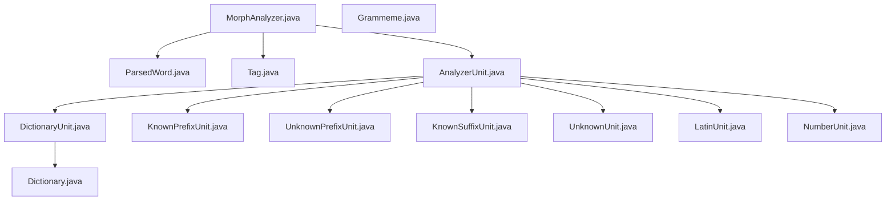
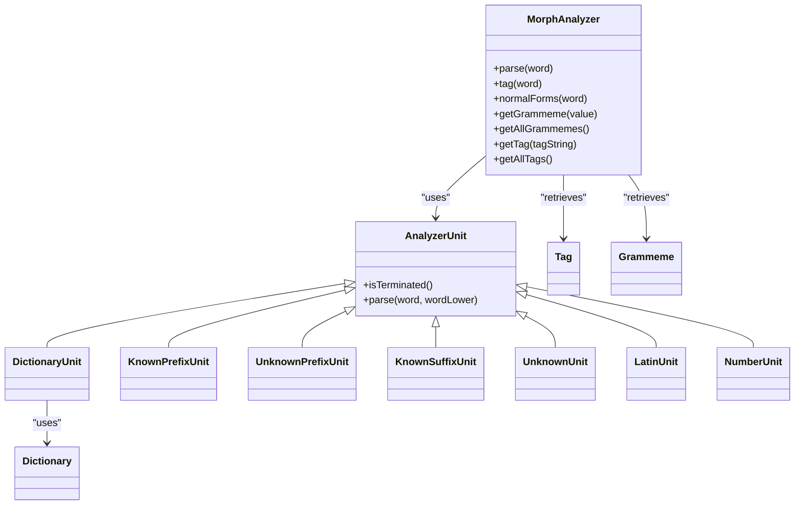

# API Reference

<cite>
**Referenced Files in This Document**
- [MorphAnalyzer.java](file://jmorphy2-core/src/main/java/company/evo/jmorphy2/MorphAnalyzer.java)
- [ParsedWord.java](file://jmorphy2-core/src/main/java/company/evo/jmorphy2/ParsedWord.java)
- [Tag.java](file://jmorphy2-core/src/main/java/company/evo/jmorphy2/Tag.java)
- [Grammeme.java](file://jmorphy2-core/src/main/java/company/evo/jmorphy2/Grammeme.java)
- [AnalyzerUnit.java](file://jmorphy2-core/src/main/java/company/evo/jmorphy2/units/AnalyzerUnit.java)
- [DictionaryUnit.java](file://jmorphy2-core/src/main/java/company/evo/jmorphy2/units/DictionaryUnit.java)
- [KnownPrefixUnit.java](file://jmorphy2-core/src/main/java/company/evo/jmorphy2/units/KnownPrefixUnit.java)
- [UnknownPrefixUnit.java](file://jmorphy2-core/src/main/java/company/evo/jmorphy2/units/UnknownPrefixUnit.java)
- [KnownSuffixUnit.java](file://jmorphy2-core/src/main/java/company/evo/jmorphy2/units/KnownSuffixUnit.java)
- [UnknownUnit.java](file://jmorphy2-core/src/main/java/company/evo/jmorphy2/units/UnknownUnit.java)
- [LatinUnit.java](file://jmorphy2-core/src/main/java/company/evo/jmorphy2/units/LatinUnit.java)
- [NumberUnit.java](file://jmorphy2-core/src/main/java/company/evo/jmorphy2/units/NumberUnit.java)
- [Dictionary.java](file://jmorphy2-core/src/main/java/company/evo/jmorphy2/Dictionary.java)
- [MorphAnalyzerRUTest.java](file://jmorphy2-core/src/test/java/company/evo/jmorphy2/MorphAnalyzerRUTest.java)
- [README.md](file://README.md)
</cite>

## Table of Contents
1. [Introduction](#introduction)
2. [Project Structure](#project-structure)
3. [Core Components](#core-components)
4. [Architecture Overview](#architecture-overview)
5. [Detailed Component Analysis](#detailed-component-analysis)
6. [Dependency Analysis](#dependency-analysis)
7. [Performance Considerations](#performance-considerations)
8. [Troubleshooting Guide](#troubleshooting-guide)
9. [Conclusion](#conclusion)
10. [Appendices](#appendices)

## Introduction
This document provides a comprehensive API reference for Jmorphy2’s public interfaces. It focuses on the MorphAnalyzer class and its builder, analysis methods (parse, tag, normalForms), configuration and grammatical access APIs, the ParsedWord class structure, the Tag class for part-of-speech categories and grammatical features, the Grammeme enumeration, and the AnalyzerUnit base class with its builder pattern for creating custom analysis units. Practical usage patterns are included via references to tests and examples, along with thread-safety considerations, exception handling, and version compatibility notes.

## Project Structure
Jmorphy2 is organized into modules with the core morphological analyzer under jmorphy2-core. The primary public API resides in the core module, with supporting units and dictionaries. The analyzer composes multiple AnalyzerUnit instances to produce morphological analyses.



**Diagram sources**
- [MorphAnalyzer.java:15-247](file://jmorphy2-core/src/main/java/company/evo/jmorphy2/MorphAnalyzer.java#L15-L247)
- [ParsedWord.java:9-89](file://jmorphy2-core/src/main/java/company/evo/jmorphy2/ParsedWord.java#L9-L89)
- [Tag.java:7-230](file://jmorphy2-core/src/main/java/company/evo/jmorphy2/Tag.java#L7-L230)
- [Grammeme.java:7-86](file://jmorphy2-core/src/main/java/company/evo/jmorphy2/Grammeme.java#L7-L86)
- [AnalyzerUnit.java:11-72](file://jmorphy2-core/src/main/java/company/evo/jmorphy2/units/AnalyzerUnit.java#L11-L72)
- [DictionaryUnit.java:14-104](file://jmorphy2-core/src/main/java/company/evo/jmorphy2/units/DictionaryUnit.java#L14-L104)
- [KnownPrefixUnit.java:12-75](file://jmorphy2-core/src/main/java/company/evo/jmorphy2/units/KnownPrefixUnit.java#L12-L75)
- [UnknownPrefixUnit.java:11-75](file://jmorphy2-core/src/main/java/company/evo/jmorphy2/units/UnknownPrefixUnit.java#L11-L75)
- [KnownSuffixUnit.java:17-180](file://jmorphy2-core/src/main/java/company/evo/jmorphy2/units/KnownSuffixUnit.java#L17-L180)
- [UnknownUnit.java:9-34](file://jmorphy2-core/src/main/java/company/evo/jmorphy2/units/UnknownUnit.java#L9-L34)
- [LatinUnit.java:8-28](file://jmorphy2-core/src/main/java/company/evo/jmorphy2/units/LatinUnit.java#L8-L28)
- [NumberUnit.java:10-54](file://jmorphy2-core/src/main/java/company/evo/jmorphy2/units/NumberUnit.java#L10-L54)
- [Dictionary.java:12-302](file://jmorphy2-core/src/main/java/company/evo/jmorphy2/Dictionary.java#L12-L302)

**Section sources**
- [MorphAnalyzer.java:15-247](file://jmorphy2-core/src/main/java/company/evo/jmorphy2/MorphAnalyzer.java#L15-L247)
- [AnalyzerUnit.java:11-72](file://jmorphy2-core/src/main/java/company/evo/jmorphy2/units/AnalyzerUnit.java#L11-L72)

## Core Components
This section documents the principal public classes and their APIs.

- MorphAnalyzer
  - Purpose: Main entry point for morphological analysis. Provides parse, tag, and normalForms methods, and exposes grammatical and tag retrieval utilities.
  - Key methods:
    - parse(String): Returns a sorted list of ParsedWord candidates with highest scores first.
    - parse(char[], int, int): Overload accepting a character buffer.
    - tag(String): Returns a list of Tag objects derived from parse results.
    - tag(char[], int, int): Overload accepting a character buffer.
    - normalForms(String): Returns unique normal forms for the input word.
    - normalForms(char[], int, int): Overload accepting a character buffer.
    - getGrammeme(String): Retrieves a Grammeme by value.
    - getAllGrammemes(): Returns all loaded Grammemes.
    - getTag(String): Retrieves a Tag by its tag string.
    - getAllTags(): Returns all loaded Tags.
  - Builder:
    - dictPath(String): Sets dictionary path.
    - fileLoader(FileLoader): Overrides default file loader.
    - charSubstitutes(Map<Character,String>): Configures character substitutions.
    - build(): Constructs a MorphAnalyzer with prepared units and optional probability estimator.

- ParsedWord
  - Purpose: Represents a single morphological analysis result.
  - Fields:
    - word: Original input word.
    - tag: Tag representing grammatical features.
    - normalForm: Canonical form of the lemma.
    - foundWord: Surface form matched in the dictionary or produced by units.
    - score: Confidence score (higher is better).
  - Methods:
    - rescore(float): Returns a new ParsedWord with updated score.
    - getLexeme(): Returns all paradigm forms for the analysis.
    - inflect(Collection<Grammeme>, Collection<Grammeme>): Filters lexeme by required and excluded grammemes.
    - toUnique(): Produces a hashable uniqueness key for deduplication.

- Tag
  - Purpose: Encapsulates grammatical features and provides accessors for major categories and productivity checks.
  - Constants:
    - PART_OF_SPEECH, ANIMACY, GENDER, NUMBER, CASE, ASPECT, TRANSITIVITY, PERSON, TENSE, MOOD, VOICE, INVOLVEMENT.
  - Accessors:
    - getGrammemeValues(): Values of grammemes present in the tag.
    - contains(...): Checks presence of grammemes or values.
    - isProductive(): True if none of the non-productive grammeme roots are present.
  - Storage:
    - getTag(String), getAllTags(), newTag(String)
    - getGrammeme(String), getAllGrammemes(), newGrammeme(List<String>)

- Grammeme
  - Purpose: Represents a grammatical feature with hierarchical relations.
  - Fields:
    - key, value, parentValue, russianValue, description.
  - Methods:
    - getParent(), getRoot()
    - info(): Human-readable grammeme info string.

- AnalyzerUnit and Builders
  - Purpose: Pluggable analysis units composing the analyzer pipeline.
  - Base:
    - isTerminated(): Whether the unit can short-circuit analysis.
    - parse(String, String): Returns candidate ParsedWord list.
    - Builder.build(Tag.Storage): Builds and caches the unit.
  - Concrete units:
    - DictionaryUnit: Matches against dictionary paradigms and produces lexeme.
    - KnownPrefixUnit: Applies known prefixes with configurable minimum remainder.
    - UnknownPrefixUnit: Brute-force prefix exploration up to max length with minimum remainder.
    - KnownSuffixUnit: Predicts suffixes using DAWG and paradigm prefixes.
    - UnknownUnit: Assigns UNKN tag to unknown tokens.
    - LatinUnit: Recognizes Latin-derived tokens.
    - NumberUnit: Parses integers and floats.

- Dictionary
  - Purpose: Loads and exposes dictionary metadata, paradigms, and helpers for building tags and normal forms.
  - Builder: Loads meta, grammemes, paradigms, suffixes, and grammar tables from resources.
  - Helpers: buildTag, buildNormalForm, buildStem, getParadigm, getSuffix.

**Section sources**
- [MorphAnalyzer.java:15-247](file://jmorphy2-core/src/main/java/company/evo/jmorphy2/MorphAnalyzer.java#L15-L247)
- [ParsedWord.java:9-89](file://jmorphy2-core/src/main/java/company/evo/jmorphy2/ParsedWord.java#L9-L89)
- [Tag.java:7-230](file://jmorphy2-core/src/main/java/company/evo/jmorphy2/Tag.java#L7-L230)
- [Grammeme.java:7-86](file://jmorphy2-core/src/main/java/company/evo/jmorphy2/Grammeme.java#L7-L86)
- [AnalyzerUnit.java:11-72](file://jmorphy2-core/src/main/java/company/evo/jmorphy2/units/AnalyzerUnit.java#L11-L72)
- [DictionaryUnit.java:14-104](file://jmorphy2-core/src/main/java/company/evo/jmorphy2/units/DictionaryUnit.java#L14-L104)
- [KnownPrefixUnit.java:12-75](file://jmorphy2-core/src/main/java/company/evo/jmorphy2/units/KnownPrefixUnit.java#L12-L75)
- [UnknownPrefixUnit.java:11-75](file://jmorphy2-core/src/main/java/company/evo/jmorphy2/units/UnknownPrefixUnit.java#L11-L75)
- [KnownSuffixUnit.java:17-180](file://jmorphy2-core/src/main/java/company/evo/jmorphy2/units/KnownSuffixUnit.java#L17-L180)
- [UnknownUnit.java:9-34](file://jmorphy2-core/src/main/java/company/evo/jmorphy2/units/UnknownUnit.java#L9-L34)
- [LatinUnit.java:8-28](file://jmorphy2-core/src/main/java/company/evo/jmorphy2/units/LatinUnit.java#L8-L28)
- [NumberUnit.java:10-54](file://jmorphy2-core/src/main/java/company/evo/jmorphy2/units/NumberUnit.java#L10-L54)
- [Dictionary.java:12-302](file://jmorphy2-core/src/main/java/company/evo/jmorphy2/Dictionary.java#L12-L302)

## Architecture Overview
The analyzer composes multiple AnalyzerUnit instances. Each unit contributes candidate analyses. The pipeline:
- Applies units in order until a terminating unit with results is encountered.
- Deduplicates candidates.
- Optionally estimates probabilities using a probability estimator when available.
- Sorts results by score descending.

```mermaid
sequenceDiagram
participant Client as "Caller"
participant MA as "MorphAnalyzer"
participant Units as "AnalyzerUnit[]"
participant Prob as "ProbabilityEstimator"
Client->>MA : "parse(word)"
MA->>Units : iterate units
loop for each unit
Units->>Units : "parse(word, wordLower)"
Units-->>MA : "List<ParsedWord>"
alt terminated and non-empty
break
end
end
MA->>MA : "filterDups()"
MA->>MA : "estimate(parseds)"
MA-->>Client : "sorted List<ParsedWord>"
```

**Diagram sources**
- [MorphAnalyzer.java:178-200](file://jmorphy2-core/src/main/java/company/evo/jmorphy2/MorphAnalyzer.java#L178-L200)
- [MorphAnalyzer.java:202-232](file://jmorphy2-core/src/main/java/company/evo/jmorphy2/MorphAnalyzer.java#L202-L232)
- [AnalyzerUnit.java:46-46](file://jmorphy2-core/src/main/java/company/evo/jmorphy2/units/AnalyzerUnit.java#L46-L46)

**Section sources**
- [MorphAnalyzer.java:178-245](file://jmorphy2-core/src/main/java/company/evo/jmorphy2/MorphAnalyzer.java#L178-L245)

## Detailed Component Analysis

### MorphAnalyzer
- Constructor options and builder:
  - Builder supports:
    - dictPath(String): Sets dictionary location.
    - fileLoader(FileLoader): Custom resource loader.
    - charSubstitutes(Map<Character,String>): Character substitution map for matching.
  - prepare() builds units and probability estimator based on dictionary metadata.
  - build() returns a MorphAnalyzer configured with units and optional probability estimation.
- Analysis methods:
  - parse(String|char[]): Returns ordered list of ParsedWord candidates.
  - tag(String|char[]): Returns Tag list from parse results.
  - normalForms(String|char[]): Returns unique normal forms.
- Configuration and retrieval:
  - getGrammeme(String), getAllGrammemes(), getTag(String), getAllTags() delegate to Tag.Storage.

Usage patterns:
- Build analyzer with defaults or customize via builder.
- Call parse to retrieve candidates; sort by score; select top.
- Use tag to obtain grammatical categories.
- Use normalForms to get canonical lemmas.

Exceptions:
- IOException may be thrown during builder.prepare() and builder.build() when loading resources.
- Unsupported dictionary format version raises runtime exception during dictionary build.

Thread safety:
- MorphAnalyzer holds immutable Tag.Storage and lists of AnalyzerUnit after construction. Instances are safe for concurrent use by multiple threads.

**Section sources**
- [MorphAnalyzer.java:20-105](file://jmorphy2-core/src/main/java/company/evo/jmorphy2/MorphAnalyzer.java#L20-L105)
- [MorphAnalyzer.java:107-125](file://jmorphy2-core/src/main/java/company/evo/jmorphy2/MorphAnalyzer.java#L107-L125)
- [MorphAnalyzer.java:127-141](file://jmorphy2-core/src/main/java/company/evo/jmorphy2/MorphAnalyzer.java#L127-L141)
- [MorphAnalyzer.java:143-200](file://jmorphy2-core/src/main/java/company/evo/jmorphy2/MorphAnalyzer.java#L143-L200)
- [MorphAnalyzer.java:202-245](file://jmorphy2-core/src/main/java/company/evo/jmorphy2/MorphAnalyzer.java#L202-L245)

### ParsedWord
- Immutable analysis result with:
  - word, tag, normalForm, foundWord, score.
- Methods:
  - rescore(float): New instance with adjusted score.
  - getLexeme(): Full paradigm forms.
  - inflect(include, exclude): Filter paradigm by required and excluded grammemes.
  - toUnique(): Equality key for deduplication.

Complexity:
- Lexeme generation depends on paradigm size; complexity proportional to paradigm cardinality.

**Section sources**
- [ParsedWord.java:9-89](file://jmorphy2-core/src/main/java/company/evo/jmorphy2/ParsedWord.java#L9-L89)

### Tag
- Encapsulates grammatical features:
  - POS, gender, number, case, aspect, animacy, mood, person, tense, transitivity, voice, involvement.
- Productivity:
  - isProductive(): True if none of the non-productive grammeme roots are present.
- Storage:
  - Normalizes and deduplicates tags and grammemes.
  - Provides newTag and newGrammeme for dynamic creation.

Access patterns:
- Retrieve grammeme values, check containment, and test productivity.

**Section sources**
- [Tag.java:7-230](file://jmorphy2-core/src/main/java/company/evo/jmorphy2/Tag.java#L7-L230)

### Grammeme
- Hierarchical grammatical feature:
  - value, parentValue, russianValue, description.
  - getParent(), getRoot() traverse hierarchy.
- Equality and hashing based on normalized key and storage identity.

**Section sources**
- [Grammeme.java:7-86](file://jmorphy2-core/src/main/java/company/evo/jmorphy2/Grammeme.java#L7-L86)

### AnalyzerUnit and Unit Builders
- Base contract:
  - isTerminated(): Short-circuit flag.
  - parse(word, wordLower): Returns candidates or null.
  - Builder.build(): Caches constructed unit.
- DictionaryUnit:
  - Uses Dictionary to match similar words and build tags and normal forms.
  - Provides lexeme generation via paradigm.
- KnownPrefixUnit:
  - Tests known prefixes and parses with remainder.
  - Configurable minReminder.
- UnknownPrefixUnit:
  - Brute-force prefix exploration up to maxPrefixLength with minReminder.
- KnownSuffixUnit:
  - Predicts suffixes using DAWG and paradigm prefixes.
  - Applies counts to rescore candidates.
- UnknownUnit:
  - Assigns UNKN tag to unknown tokens.
- LatinUnit:
  - Recognizes Latin-derived tokens; registers LATN grammeme/tag.
- NumberUnit:
  - Parses integers and floats; registers NUMB,intg and NUMB,real tags.

**Section sources**
- [AnalyzerUnit.java:11-72](file://jmorphy2-core/src/main/java/company/evo/jmorphy2/units/AnalyzerUnit.java#L11-L72)
- [DictionaryUnit.java:14-104](file://jmorphy2-core/src/main/java/company/evo/jmorphy2/units/DictionaryUnit.java#L14-L104)
- [KnownPrefixUnit.java:12-75](file://jmorphy2-core/src/main/java/company/evo/jmorphy2/units/KnownPrefixUnit.java#L12-L75)
- [UnknownPrefixUnit.java:11-75](file://jmorphy2-core/src/main/java/company/evo/jmorphy2/units/UnknownPrefixUnit.java#L11-L75)
- [KnownSuffixUnit.java:17-180](file://jmorphy2-core/src/main/java/company/evo/jmorphy2/units/KnownSuffixUnit.java#L17-L180)
- [UnknownUnit.java:9-34](file://jmorphy2-core/src/main/java/company/evo/jmorphy2/units/UnknownUnit.java#L9-L34)
- [LatinUnit.java:8-28](file://jmorphy2-core/src/main/java/company/evo/jmorphy2/units/LatinUnit.java#L8-L28)
- [NumberUnit.java:10-54](file://jmorphy2-core/src/main/java/company/evo/jmorphy2/units/NumberUnit.java#L10-L54)

### Dictionary
- Builder loads:
  - meta.json
  - words.dawg
  - paradigms.array
  - suffixes.json
  - prediction-suffixes-*.dawg
  - grammemes.json
  - gramtab-opencorpora-int.json
- Provides:
  - buildTag, buildNormalForm, buildStem
  - getParadigm, getSuffix
  - getMeta for format version and compile options

Version compatibility:
- Throws runtime exception if dictionary format version does not match supported version.

**Section sources**
- [Dictionary.java:36-139](file://jmorphy2-core/src/main/java/company/evo/jmorphy2/Dictionary.java#L36-L139)
- [Dictionary.java:190-260](file://jmorphy2-core/src/main/java/company/evo/jmorphy2/Dictionary.java#L190-L260)

## Dependency Analysis
The analyzer composes units and delegates grammatical lookups to Tag.Storage. Units depend on Dictionary and DAWGs for predictions.



**Diagram sources**
- [MorphAnalyzer.java:15-247](file://jmorphy2-core/src/main/java/company/evo/jmorphy2/MorphAnalyzer.java#L15-L247)
- [AnalyzerUnit.java:11-72](file://jmorphy2-core/src/main/java/company/evo/jmorphy2/units/AnalyzerUnit.java#L11-L72)
- [DictionaryUnit.java:14-104](file://jmorphy2-core/src/main/java/company/evo/jmorphy2/units/DictionaryUnit.java#L14-L104)
- [KnownPrefixUnit.java:12-75](file://jmorphy2-core/src/main/java/company/evo/jmorphy2/units/KnownPrefixUnit.java#L12-L75)
- [UnknownPrefixUnit.java:11-75](file://jmorphy2-core/src/main/java/company/evo/jmorphy2/units/UnknownPrefixUnit.java#L11-L75)
- [KnownSuffixUnit.java:17-180](file://jmorphy2-core/src/main/java/company/evo/jmorphy2/units/KnownSuffixUnit.java#L17-L180)
- [UnknownUnit.java:9-34](file://jmorphy2-core/src/main/java/company/evo/jmorphy2/units/UnknownUnit.java#L9-L34)
- [LatinUnit.java:8-28](file://jmorphy2-core/src/main/java/company/evo/jmorphy2/units/LatinUnit.java#L8-L28)
- [NumberUnit.java:10-54](file://jmorphy2-core/src/main/java/company/evo/jmorphy2/units/NumberUnit.java#L10-L54)
- [Tag.java:7-230](file://jmorphy2-core/src/main/java/company/evo/jmorphy2/Tag.java#L7-L230)
- [Grammeme.java:7-86](file://jmorphy2-core/src/main/java/company/evo/jmorphy2/Grammeme.java#L7-L86)
- [Dictionary.java:12-302](file://jmorphy2-core/src/main/java/company/evo/jmorphy2/Dictionary.java#L12-L302)

**Section sources**
- [MorphAnalyzer.java:15-247](file://jmorphy2-core/src/main/java/company/evo/jmorphy2/MorphAnalyzer.java#L15-L247)
- [AnalyzerUnit.java:11-72](file://jmorphy2-core/src/main/java/company/evo/jmorphy2/units/AnalyzerUnit.java#L11-L72)

## Performance Considerations
- Pipeline short-circuiting: Terminating units reduce work when results are available.
- Deduplication: filterDups reduces redundant candidates.
- Probability estimation: Optional; adds computation but improves ranking when enabled.
- Lexeme generation: Complexity scales with paradigm size; cache results when repeatedly accessed.
- Buffer overloads: Prefer char[] overloads to avoid intermediate String allocations.

[No sources needed since this section provides general guidance]

## Troubleshooting Guide
Common issues and resolutions:
- Unsupported dictionary format version:
  - Symptom: Runtime exception during dictionary build.
  - Resolution: Ensure dictionary matches supported format version.
- Missing dictionary path or resources:
  - Symptom: IOException during builder.prepare().
  - Resolution: Provide dictPath or set PYMORPHY2_DICT_PATH; ensure resources are accessible.
- Unexpected empty results:
  - Verify wordLower normalization and charSubstitutes configuration.
  - Confirm units are properly ordered and not all returning null.
- Unknown tokens:
  - UnknownUnit assigns UNKN; ensure UnknownUnit is included in the pipeline.
- Thread safety:
  - MorphAnalyzer instances are safe for concurrent use; avoid mutating shared state outside the builder.

**Section sources**
- [Dictionary.java:232-239](file://jmorphy2-core/src/main/java/company/evo/jmorphy2/Dictionary.java#L232-L239)
- [MorphAnalyzer.java:52-99](file://jmorphy2-core/src/main/java/company/evo/jmorphy2/MorphAnalyzer.java#L52-L99)

## Conclusion
Jmorphy2’s public API centers around MorphAnalyzer and its builder, with a modular unit system enabling extensibility. The Tag and Grammeme abstractions provide robust grammatical feature access, while ParsedWord encapsulates analysis results and paradigm generation. The design emphasizes composability, performance, and thread-safe usage.

[No sources needed since this section summarizes without analyzing specific files]

## Appendices

### API Reference Tables

- MorphAnalyzer
  - Methods:
    - parse(String|char[], int, int): Returns List<ParsedWord>
    - tag(String|char[], int, int): Returns List<Tag>
    - normalForms(String|char[], int, int): Returns List<String>
    - getGrammeme(String): Returns Grammeme
    - getAllGrammemes(): Returns Collection<Grammeme>
    - getTag(String): Returns Tag
    - getAllTags(): Returns Collection<Tag>
  - Builder methods:
    - dictPath(String): Returns Builder
    - fileLoader(FileLoader): Returns Builder
    - charSubstitutes(Map<Character,String>): Returns Builder
    - build(): Returns MorphAnalyzer

- ParsedWord
  - Fields: word, tag, normalForm, foundWord, score
  - Methods:
    - rescore(float): Returns ParsedWord
    - getLexeme(): Returns List<ParsedWord>
    - inflect(Collection<Grammeme>): Returns List<ParsedWord>
    - inflect(Collection<Grammeme>, Collection<Grammeme>): Returns List<ParsedWord>
    - toUnique(): Returns Unique

- Tag
  - Constants: PART_OF_SPEECH, ANIMACY, GENDER, NUMBER, CASE, ASPECT, TRANSITIVITY, PERSON, TENSE, MOOD, VOICE, INVOLVEMENT
  - Methods:
    - getGrammemeValues(): Returns Set<String>
    - contains(String|Grammeme|Collection<Grammeme>|Collection<String>): Returns boolean
    - containsAll(...)/containsAny(...): Returns boolean
    - isProductive(): Returns boolean
  - Storage:
    - getTag(String), getAllTags(), newTag(String)
    - getGrammeme(String), getAllGrammemes(), newGrammeme(List<String>)

- Grammeme
  - Fields: key, value, parentValue, russianValue, description
  - Methods: getParent(), getRoot(), info()

- AnalyzerUnit
  - Methods:
    - isTerminated(): Returns boolean
    - parse(String, String): Returns List<ParsedWord> or null
  - Builder:
    - build(Tag.Storage): Returns AnalyzerUnit

- Dictionary
  - Builder methods:
    - build(Tag.Storage): Returns Dictionary
  - Methods:
    - getMeta(), getWords(), getParadigmPrefixes(), getParadigm(short), getSuffix(short, short)
    - buildTag(short, short), buildNormalForm(short, short, String), buildStem(short, short, String)

**Section sources**
- [MorphAnalyzer.java:15-247](file://jmorphy2-core/src/main/java/company/evo/jmorphy2/MorphAnalyzer.java#L15-L247)
- [ParsedWord.java:9-89](file://jmorphy2-core/src/main/java/company/evo/jmorphy2/ParsedWord.java#L9-L89)
- [Tag.java:7-230](file://jmorphy2-core/src/main/java/company/evo/jmorphy2/Tag.java#L7-L230)
- [Grammeme.java:7-86](file://jmorphy2-core/src/main/java/company/evo/jmorphy2/Grammeme.java#L7-L86)
- [AnalyzerUnit.java:11-72](file://jmorphy2-core/src/main/java/company/evo/jmorphy2/units/AnalyzerUnit.java#L11-L72)
- [Dictionary.java:36-139](file://jmorphy2-core/src/main/java/company/evo/jmorphy2/Dictionary.java#L36-L139)

### Practical Usage Patterns
- Basic analysis:
  - Build analyzer via builder; call parse(word); inspect top candidate tag and normalForm.
- Retrieve grammatical features:
  - Use getTag(...) to resolve a tag string; access POS, Case, number, gender, etc.
- Get normal forms:
  - Call normalForms(word) to obtain unique lemmas.
- Inflection:
  - Use ParsedWord.inflect(...) to filter paradigm forms by required and excluded grammemes.
- Examples in tests:
  - See Russian analyzer tests for typical usage of parse, tag, normalForms, lexeme, and inflection.

**Section sources**
- [MorphAnalyzerRUTest.java:30-308](file://jmorphy2-core/src/test/java/company/evo/jmorphy2/MorphAnalyzerRUTest.java#L30-L308)

### Version Compatibility and Deprecation Notes
- Dictionary format version:
  - Dictionary.Meta enforces a supported format version; mismatch triggers a runtime exception.
- Elasticsearch plugin:
  - README documents plugin installation and supported Elasticsearch versions; use appropriate plugin version per target ES.

**Section sources**
- [Dictionary.java:232-239](file://jmorphy2-core/src/main/java/company/evo/jmorphy2/Dictionary.java#L232-L239)
- [README.md:41-49](file://README.md#L41-L49)