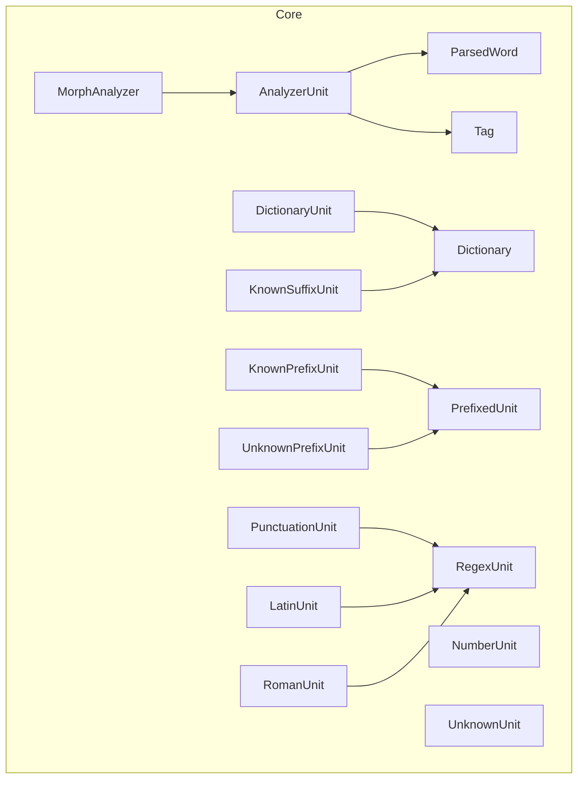
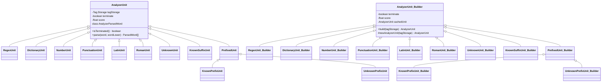
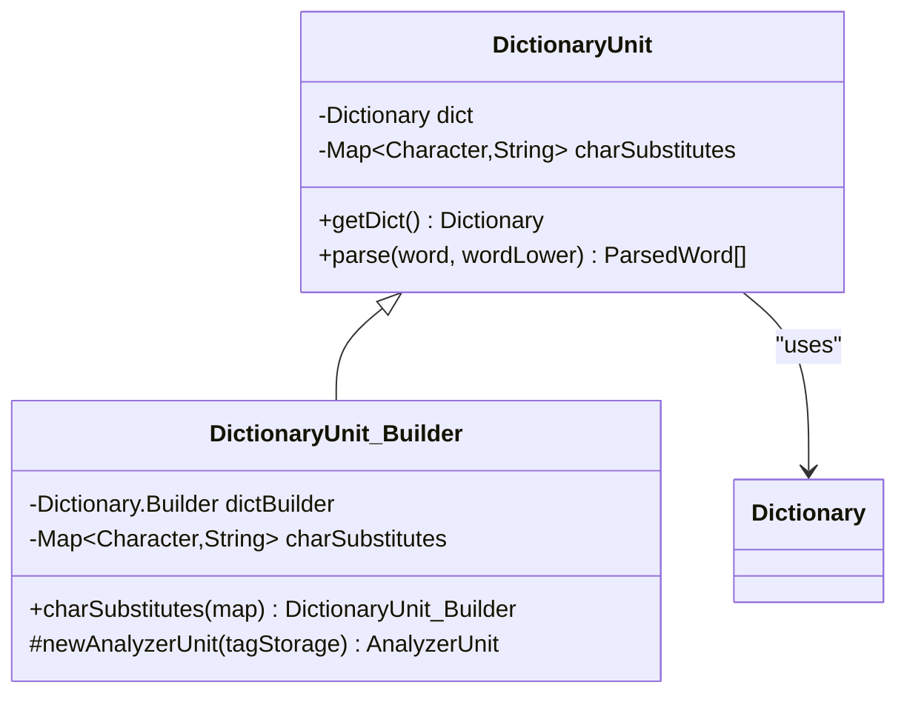
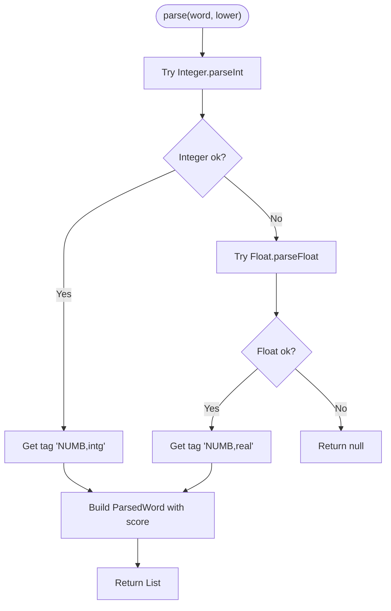
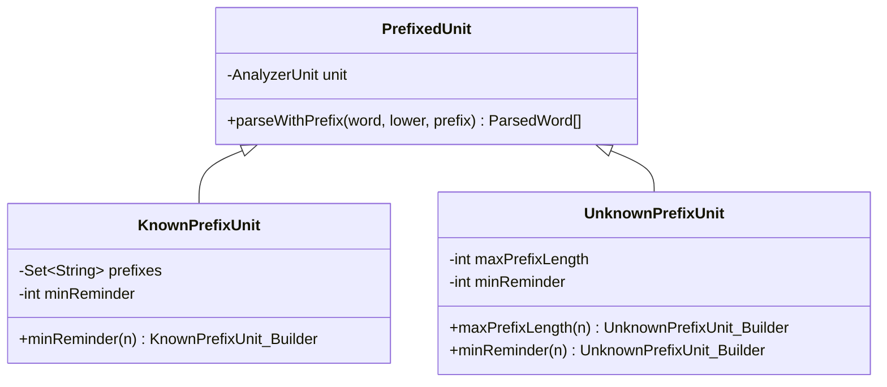
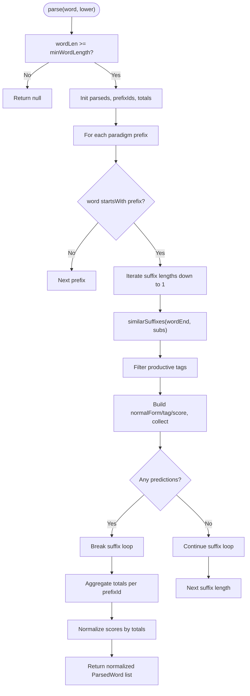
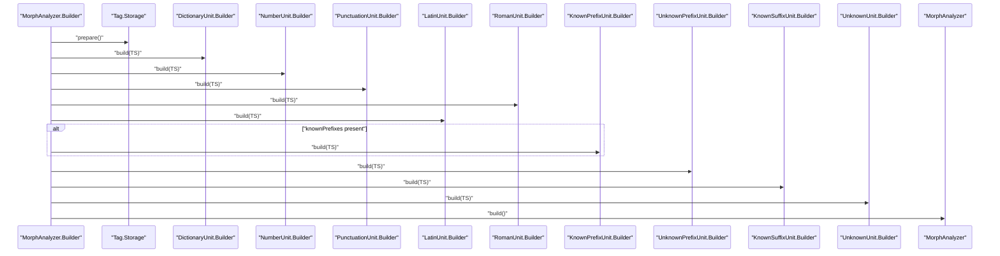
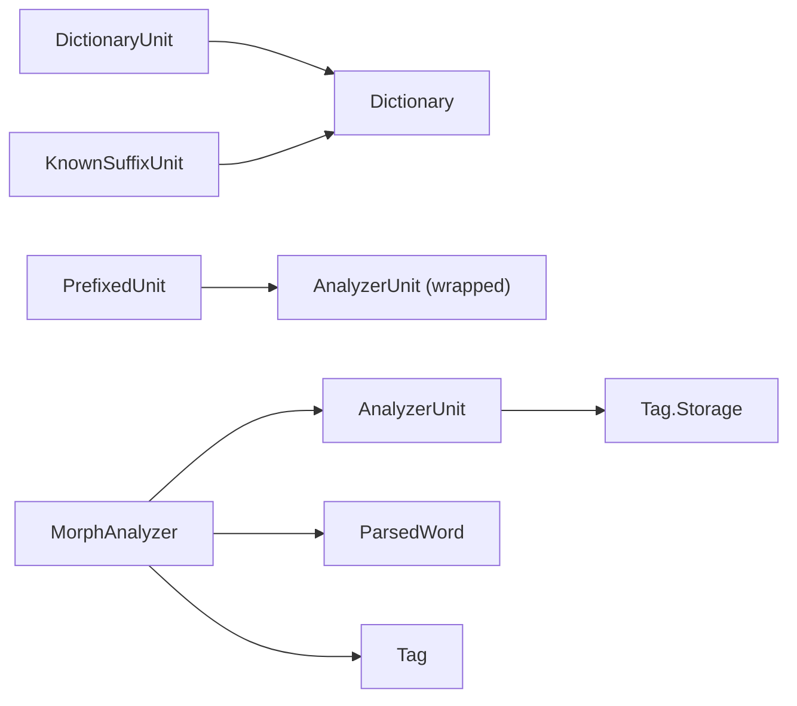

# Analyzer Units API

<cite>
**Referenced Files in This Document**
- [AnalyzerUnit.java](file://jmorphy2-core/src/main/java/company/evo/jmorphy2/units/AnalyzerUnit.java)
- [DictionaryUnit.java](file://jmorphy2-core/src/main/java/company/evo/jmorphy2/units/DictionaryUnit.java)
- [NumberUnit.java](file://jmorphy2-core/src/main/java/company/evo/jmorphy2/units/NumberUnit.java)
- [PunctuationUnit.java](file://jmorphy2-core/src/main/java/company/evo/jmorphy2/units/PunctuationUnit.java)
- [RegexUnit.java](file://jmorphy2-core/src/main/java/company/evo/jmorphy2/units/RegexUnit.java)
- [PrefixedUnit.java](file://jmorphy2-core/src/main/java/company/evo/jmorphy2/units/PrefixedUnit.java)
- [KnownPrefixUnit.java](file://jmorphy2-core/src/main/java/company/evo/jmorphy2/units/KnownPrefixUnit.java)
- [UnknownPrefixUnit.java](file://jmorphy2-core/src/main/java/company/evo/jmorphy2/units/UnknownPrefixUnit.java)
- [KnownSuffixUnit.java](file://jmorphy2-core/src/main/java/company/evo/jmorphy2/units/KnownSuffixUnit.java)
- [LatinUnit.java](file://jmorphy2-core/src/main/java/company/evo/jmorphy2/units/LatinUnit.java)
- [RomanUnit.java](file://jmorphy2-core/src/main/java/company/evo/jmorphy2/units/RomanUnit.java)
- [UnknownUnit.java](file://jmorphy2-core/src/main/java/company/evo/jmorphy2/units/UnknownUnit.java)
- [MorphAnalyzer.java](file://jmorphy2-core/src/main/java/company/evo/jmorphy2/MorphAnalyzer.java)
- [Dictionary.java](file://jmorphy2-core/src/main/java/company/evo/jmorphy2/Dictionary.java)
- [ParsedWord.java](file://jmorphy2-core/src/main/java/company/evo/jmorphy2/ParsedWord.java)
- [Tag.java](file://jmorphy2-core/src/main/java/company/evo/jmorphy2/Tag.java)
</cite>

## Table of Contents
1. [Introduction](#introduction)
2. [Project Structure](#project-structure)
3. [Core Components](#core-components)
4. [Architecture Overview](#architecture-overview)
5. [Detailed Component Analysis](#detailed-component-analysis)
6. [Dependency Analysis](#dependency-analysis)
7. [Performance Considerations](#performance-considerations)
8. [Troubleshooting Guide](#troubleshooting-guide)
9. [Conclusion](#conclusion)
10. [Appendices](#appendices)

## Introduction
This document describes the Analyzer Units subsystem of Jmorphy2, focusing on the AnalyzerUnit base class and its specialized implementations. It explains the unit pipeline architecture, composition patterns, lifecycle callbacks, and the builder pattern used to construct analysis units. It also documents unit termination semantics, scoring, and how units collaborate during morphological analysis. Practical guidance is provided for creating custom units and integrating them into the analysis pipeline, along with performance implications and optimization strategies.

## Project Structure
Analyzer Units reside under the jmorphy2-core module in the units package. They are orchestrated by the MorphAnalyzer, which builds a pipeline of AnalyzerUnit instances and applies them to input tokens. Supporting infrastructure includes the Dictionary for lexical access, Tag and ParsedWord for semantic representation, and PrefixedUnit for composing units with affix handling.



**Diagram sources**
- [MorphAnalyzer.java:15-247](file://jmorphy2-core/src/main/java/company/evo/jmorphy2/MorphAnalyzer.java#L15-L247)
- [AnalyzerUnit.java:11-72](file://jmorphy2-core/src/main/java/company/evo/jmorphy2/units/AnalyzerUnit.java#L11-L72)
- [RegexUnit.java:11-31](file://jmorphy2-core/src/main/java/company/evo/jmorphy2/units/RegexUnit.java#L11-L31)
- [PrefixedUnit.java:10-55](file://jmorphy2-core/src/main/java/company/evo/jmorphy2/units/PrefixedUnit.java#L10-L55)
- [DictionaryUnit.java:14-104](file://jmorphy2-core/src/main/java/company/evo/jmorphy2/units/DictionaryUnit.java#L14-L104)
- [NumberUnit.java:10-54](file://jmorphy2-core/src/main/java/company/evo/jmorphy2/units/NumberUnit.java#L10-L54)
- [PunctuationUnit.java:8-28](file://jmorphy2-core/src/main/java/company/evo/jmorphy2/units/PunctuationUnit.java#L8-L28)
- [KnownPrefixUnit.java:12-75](file://jmorphy2-core/src/main/java/company/evo/jmorphy2/units/KnownPrefixUnit.java#L12-L75)
- [UnknownPrefixUnit.java:11-75](file://jmorphy2-core/src/main/java/company/evo/jmorphy2/units/UnknownPrefixUnit.java#L11-L75)
- [KnownSuffixUnit.java:17-180](file://jmorphy2-core/src/main/java/company/evo/jmorphy2/units/KnownSuffixUnit.java#L17-L180)
- [LatinUnit.java:8-28](file://jmorphy2-core/src/main/java/company/evo/jmorphy2/units/LatinUnit.java#L8-L28)
- [RomanUnit.java:8-32](file://jmorphy2-core/src/main/java/company/evo/jmorphy2/units/RomanUnit.java#L8-L32)
- [UnknownUnit.java:9-34](file://jmorphy2-core/src/main/java/company/evo/jmorphy2/units/UnknownUnit.java#L9-L34)
- [ParsedWord.java:9-89](file://jmorphy2-core/src/main/java/company/evo/jmorphy2/ParsedWord.java#L9-L89)
- [Tag.java:7-200](file://jmorphy2-core/src/main/java/company/evo/jmorphy2/Tag.java#L7-L200)
- [Dictionary.java:12-200](file://jmorphy2-core/src/main/java/company/evo/jmorphy2/Dictionary.java#L12-L200)

**Section sources**
- [MorphAnalyzer.java:15-247](file://jmorphy2-core/src/main/java/company/evo/jmorphy2/MorphAnalyzer.java#L15-L247)
- [AnalyzerUnit.java:11-72](file://jmorphy2-core/src/main/java/company/evo/jmorphy2/units/AnalyzerUnit.java#L11-L72)

## Core Components
- AnalyzerUnit: Abstract base for all analyzers. Provides:
  - Lifecycle flag isTerminated indicating whether a unit can short-circuit the pipeline.
  - Score weighting for ranking results.
  - Abstract parse method returning a list of ParsedWord candidates.
  - Internal AnalyzerParsedWord wrapper implementing rescore, lexeme retrieval, and string representation.
  - Nested Builder base class supporting caching and construction via Tag.Storage.

- ParsedWord: Immutable result container with:
  - Word form, tag, normal form, and the found word.
  - Score used for ranking.
  - Methods to rescore, retrieve lexeme forms, and inflection filtering.
  - Equality/comparison by score.

- Tag and Tag.Storage: Semantic tag representation and registry. Tags are composed of Grammemes and support productivity checks and containment queries.

- MorphAnalyzer: Orchestrates the pipeline:
  - Builds units via a fluent Builder, including dictionary, numbers, punctuation, Latin, Roman numerals, known/unknown prefixes, known suffixes, and unknown tokens.
  - Applies units in order, honoring unit termination semantics.
  - Filters duplicates, optionally estimates probabilities, and sorts results.

**Section sources**
- [AnalyzerUnit.java:11-72](file://jmorphy2-core/src/main/java/company/evo/jmorphy2/units/AnalyzerUnit.java#L11-L72)
- [ParsedWord.java:9-89](file://jmorphy2-core/src/main/java/company/evo/jmorphy2/ParsedWord.java#L9-L89)
- [Tag.java:7-200](file://jmorphy2-core/src/main/java/company/evo/jmorphy2/Tag.java#L7-L200)
- [MorphAnalyzer.java:15-247](file://jmorphy2-core/src/main/java/company/evo/jmorphy2/MorphAnalyzer.java#L15-L247)

## Architecture Overview
The Analyzer Unit pipeline is a composition of specialized units executed in sequence. Each unit attempts to parse the current token and contributes zero or more ParsedWord candidates. Units flagged as terminated halt further unit processing if any candidate is produced.

```mermaid
sequenceDiagram
participant Client as "Caller"
participant MA as "MorphAnalyzer"
participant U1 as "AnalyzerUnit #1"
participant U2 as "AnalyzerUnit #2"
participant UN as "AnalyzerUnit N"
Client->>MA : "parse(word)"
MA->>MA : "lowercase input"
MA->>U1 : "parse(word, lower)"
U1-->>MA : "List<ParsedWord> | null"
alt "U1 isTerminated and produced results"
MA-->>Client : "return merged and ranked results"
else "continue pipeline"
MA->>U2 : "parse(word, lower)"
U2-->>MA : "List<ParsedWord> | null"
opt "U2 isTerminated and produced results"
MA-->>Client : "return merged and ranked results"
else "continue pipeline"
MA->>UN : "parse(word, lower)"
UN-->>MA : "List<ParsedWord> | null"
MA-->>Client : "return merged, estimated, and sorted results"
end
end
```

**Diagram sources**
- [MorphAnalyzer.java:178-200](file://jmorphy2-core/src/main/java/company/evo/jmorphy2/MorphAnalyzer.java#L178-L200)
- [AnalyzerUnit.java:42-44](file://jmorphy2-core/src/main/java/company/evo/jmorphy2/units/AnalyzerUnit.java#L42-L44)

## Detailed Component Analysis

### AnalyzerUnit Base Class and Builder Pattern
- Responsibilities:
  - Define the parse contract returning a list of ParsedWord or null.
  - Expose isTerminated to signal early termination of the pipeline.
  - Provide nested Builder with caching to avoid repeated construction.
- Lifecycle:
  - Construction via subclass constructors and Builder.newAnalyzerUnit.
  - parse invoked per token by MorphAnalyzer.
- Scoring:
  - Units carry a score factor influencing final ranking.
- Composition:
  - Some units wrap others (e.g., PrefixedUnit), delegating parsing after prefix handling.



**Diagram sources**
- [AnalyzerUnit.java:11-72](file://jmorphy2-core/src/main/java/company/evo/jmorphy2/units/AnalyzerUnit.java#L11-L72)
- [RegexUnit.java:11-31](file://jmorphy2-core/src/main/java/company/evo/jmorphy2/units/RegexUnit.java#L11-L31)
- [PrefixedUnit.java:10-55](file://jmorphy2-core/src/main/java/company/evo/jmorphy2/units/PrefixedUnit.java#L10-L55)
- [KnownPrefixUnit.java:12-75](file://jmorphy2-core/src/main/java/company/evo/jmorphy2/units/KnownPrefixUnit.java#L12-L75)
- [UnknownPrefixUnit.java:11-75](file://jmorphy2-core/src/main/java/company/evo/jmorphy2/units/UnknownPrefixUnit.java#L11-L75)
- [DictionaryUnit.java:14-104](file://jmorphy2-core/src/main/java/company/evo/jmorphy2/units/DictionaryUnit.java#L14-L104)
- [NumberUnit.java:10-54](file://jmorphy2-core/src/main/java/company/evo/jmorphy2/units/NumberUnit.java#L10-L54)
- [PunctuationUnit.java:8-28](file://jmorphy2-core/src/main/java/company/evo/jmorphy2/units/PunctuationUnit.java#L8-L28)
- [LatinUnit.java:8-28](file://jmorphy2-core/src/main/java/company/evo/jmorphy2/units/LatinUnit.java#L8-L28)
- [RomanUnit.java:8-32](file://jmorphy2-core/src/main/java/company/evo/jmorphy2/units/RomanUnit.java#L8-L32)
- [UnknownUnit.java:9-34](file://jmorphy2-core/src/main/java/company/evo/jmorphy2/units/UnknownUnit.java#L9-L34)
- [KnownSuffixUnit.java:17-180](file://jmorphy2-core/src/main/java/company/evo/jmorphy2/units/KnownSuffixUnit.java#L17-L180)

**Section sources**
- [AnalyzerUnit.java:11-72](file://jmorphy2-core/src/main/java/company/evo/jmorphy2/units/AnalyzerUnit.java#L11-L72)

### DictionaryUnit
- Purpose: Dictionary-based lookup using WordsDAWG with optional character substitutions.
- Builder options:
  - charSubstitutes(Map): configure phonetic/typo substitutions.
- Behavior:
  - Iterates similar words, constructs normal form and tag, wraps results as DictionaryParsedWord.
  - DictionaryParsedWord.lexeme enumerates paradigm forms for inflection.



**Diagram sources**
- [DictionaryUnit.java:14-104](file://jmorphy2-core/src/main/java/company/evo/jmorphy2/units/DictionaryUnit.java#L14-L104)
- [Dictionary.java:12-200](file://jmorphy2-core/src/main/java/company/evo/jmorphy2/Dictionary.java#L12-L200)

**Section sources**
- [DictionaryUnit.java:14-104](file://jmorphy2-core/src/main/java/company/evo/jmorphy2/units/DictionaryUnit.java#L14-L104)

### NumberUnit
- Purpose: Numeric detection for integers and floats.
- Builder: Registers grammemes and tags NUMB,intg and NUMB,real.
- Behavior:
  - Attempts Integer parsing, then Float parsing.
  - Produces a single ParsedWord with appropriate tag if successful.



**Diagram sources**
- [NumberUnit.java:10-54](file://jmorphy2-core/src/main/java/company/evo/jmorphy2/units/NumberUnit.java#L10-L54)

**Section sources**
- [NumberUnit.java:10-54](file://jmorphy2-core/src/main/java/company/evo/jmorphy2/units/NumberUnit.java#L10-L54)

### PunctuationUnit
- Purpose: Identifies punctuation using RegexUnit with a predefined pattern.
- Builder: Registers grammeme PNCT and tag PNCT.

**Section sources**
- [PunctuationUnit.java:8-28](file://jmorphy2-core/src/main/java/company/evo/jmorphy2/units/PunctuationUnit.java#L8-L28)

### LatinUnit and RomanUnit
- LatinUnit: Regex-based identification of Latin characters and digits/punctuation.
- RomanUnit: Regex-based identification of Roman numerals.
- Both register their respective grammemes/tags via their Builders.

**Section sources**
- [LatinUnit.java:8-28](file://jmorphy2-core/src/main/java/company/evo/jmorphy2/units/LatinUnit.java#L8-L28)
- [RomanUnit.java:8-32](file://jmorphy2-core/src/main/java/company/evo/jmorphy2/units/RomanUnit.java#L8-L32)

### PrefixedUnit and Derived Prefix Units
- PrefixedUnit: Decorator that prepends a known prefix to results from a downstream unit, preserving productivity and lexeme expansion.
- KnownPrefixUnit: Enumerates known prefixes up to a minimum remainder length and delegates to PrefixedUnit.
- UnknownPrefixUnit: Enumerates prefixes up to a maximum length and minimum remainder, delegating to PrefixedUnit.



**Diagram sources**
- [PrefixedUnit.java:10-55](file://jmorphy2-core/src/main/java/company/evo/jmorphy2/units/PrefixedUnit.java#L10-L55)
- [KnownPrefixUnit.java:12-75](file://jmorphy2-core/src/main/java/company/evo/jmorphy2/units/KnownPrefixUnit.java#L12-L75)
- [UnknownPrefixUnit.java:11-75](file://jmorphy2-core/src/main/java/company/evo/jmorphy2/units/UnknownPrefixUnit.java#L11-L75)

**Section sources**
- [PrefixedUnit.java:10-55](file://jmorphy2-core/src/main/java/company/evo/jmorphy2/units/PrefixedUnit.java#L10-L55)
- [KnownPrefixUnit.java:12-75](file://jmorphy2-core/src/main/java/company/evo/jmorphy2/units/KnownPrefixUnit.java#L12-L75)
- [UnknownPrefixUnit.java:11-75](file://jmorphy2-core/src/main/java/company/evo/jmorphy2/units/UnknownPrefixUnit.java#L11-L75)

### KnownSuffixUnit
- Purpose: Predicts word endings using SuffixesDAWG, filters productive tags, and normalizes scores by total predicted counts per paradigm prefix.
- Builder options:
  - minWordLength, maxSuffixLength, charSubstitutes.
- Behavior:
  - Checks minimum length.
  - For matching paradigm prefixes, tries suffixes up to maxSuffixLength.
  - Aggregates counts per prefix and normalizes scores accordingly.



**Diagram sources**
- [KnownSuffixUnit.java:83-126](file://jmorphy2-core/src/main/java/company/evo/jmorphy2/units/KnownSuffixUnit.java#L83-L126)

**Section sources**
- [KnownSuffixUnit.java:17-180](file://jmorphy2-core/src/main/java/company/evo/jmorphy2/units/KnownSuffixUnit.java#L17-L180)

### UnknownUnit
- Purpose: Default unit for unknown tokens, assigns UNKN tag with configured score.

**Section sources**
- [UnknownUnit.java:9-34](file://jmorphy2-core/src/main/java/company/evo/jmorphy2/units/UnknownUnit.java#L9-L34)

### Pipeline Construction and Execution
- MorphAnalyzer.Builder prepares units:
  - DictionaryUnit with charSubstitutes.
  - NumberUnit, PunctuationUnit, LatinUnit, RomanUnit.
  - KnownPrefixUnit (if known prefixes exist).
  - UnknownPrefixUnit.
  - KnownSuffixUnit with charSubstitutes.
  - UnknownUnit.
- Execution:
  - parse iterates units in order, collects results, honors termination, deduplicates, optionally estimates probabilities, and sorts by score.



**Diagram sources**
- [MorphAnalyzer.java:52-104](file://jmorphy2-core/src/main/java/company/evo/jmorphy2/MorphAnalyzer.java#L52-L104)

**Section sources**
- [MorphAnalyzer.java:52-104](file://jmorphy2-core/src/main/java/company/evo/jmorphy2/MorphAnalyzer.java#L52-L104)
- [MorphAnalyzer.java:178-245](file://jmorphy2-core/src/main/java/company/evo/jmorphy2/MorphAnalyzer.java#L178-L245)

## Dependency Analysis
- AnalyzerUnit depends on Tag.Storage for grammeme/tag registration and retrieval.
- DictionaryUnit and KnownSuffixUnit depend on Dictionary for paradigm and suffix data.
- PrefixedUnit composes another AnalyzerUnit to delegate parsing after prefix handling.
- MorphAnalyzer composes all units and orchestrates execution, probability estimation, and result ranking.



**Diagram sources**
- [AnalyzerUnit.java:11-72](file://jmorphy2-core/src/main/java/company/evo/jmorphy2/units/AnalyzerUnit.java#L11-L72)
- [DictionaryUnit.java:14-104](file://jmorphy2-core/src/main/java/company/evo/jmorphy2/units/DictionaryUnit.java#L14-L104)
- [KnownSuffixUnit.java:17-180](file://jmorphy2-core/src/main/java/company/evo/jmorphy2/units/KnownSuffixUnit.java#L17-L180)
- [PrefixedUnit.java:10-55](file://jmorphy2-core/src/main/java/company/evo/jmorphy2/units/PrefixedUnit.java#L10-L55)
- [MorphAnalyzer.java:15-247](file://jmorphy2-core/src/main/java/company/evo/jmorphy2/MorphAnalyzer.java#L15-L247)
- [ParsedWord.java:9-89](file://jmorphy2-core/src/main/java/company/evo/jmorphy2/ParsedWord.java#L9-L89)
- [Tag.java:7-200](file://jmorphy2-core/src/main/java/company/evo/jmorphy2/Tag.java#L7-L200)

**Section sources**
- [MorphAnalyzer.java:15-247](file://jmorphy2-core/src/main/java/company/evo/jmorphy2/MorphAnalyzer.java#L15-L247)

## Performance Considerations
- Unit ordering matters:
  - Place high-precision, fast units earlier (e.g., DictionaryUnit, NumberUnit, PunctuationUnit) to maximize early termination.
- Termination semantics:
  - Units with terminate=true can short-circuit the pipeline when producing results, reducing downstream work.
- Scoring and normalization:
  - Units with higher relative scores influence final ranking; KnownSuffixUnit normalizes by predicted counts to balance confidence.
- Character substitutions:
  - Char substitutes in DictionaryUnit and KnownSuffixUnit improve recall but increase search space; tune per language needs.
- Prefix enumeration:
  - KnownPrefixUnit minReminder and UnknownPrefixUnit bounds control branching; tighter bounds reduce combinatorial explosion.
- Probability estimation:
  - Enabled when dictionary metadata indicates PTW; adds computation but improves ranking quality.

[No sources needed since this section provides general guidance]

## Troubleshooting Guide
- No results returned:
  - Verify unit ordering and termination; ensure early units like DictionaryUnit and NumberUnit are placed before UnknownUnit.
  - Confirm charSubstitutes are appropriate for the language to enable dictionary hits.
- Unexpected tags or forms:
  - Inspect Tag.Storage initialization and grammeme registrations performed by unit Builders.
  - Check Tag.isProductive to filter non-productive analyses.
- Performance regressions:
  - Reduce KnownSuffixUnit maxSuffixLength or KnownPrefixUnit minReminder.
  - Limit UnknownPrefixUnit maxPrefixLength.
  - Disable probability estimation if not needed.

**Section sources**
- [MorphAnalyzer.java:178-245](file://jmorphy2-core/src/main/java/company/evo/jmorphy2/MorphAnalyzer.java#L178-L245)
- [Tag.java:135-139](file://jmorphy2-core/src/main/java/company/evo/jmorphy2/Tag.java#L135-L139)

## Conclusion
Jmorphy2’s Analyzer Units provide a modular, composable framework for morphological analysis. The AnalyzerUnit base class and its builders encapsulate lifecycle and configuration, while specialized units target distinct token types. The pipeline’s termination semantics, scoring, and optional probability estimation enable efficient and accurate analysis. By tuning unit ordering, termination, and configuration, users can optimize accuracy and performance for their language and domain.

[No sources needed since this section summarizes without analyzing specific files]

## Appendices

### Builder Method Signatures and Options
- AnalyzerUnit.Builder
  - build(tagStorage): returns constructed AnalyzerUnit (with internal caching).
  - newAnalyzerUnit(tagStorage): subclasses override to create unit instances.
- DictionaryUnit.Builder
  - charSubstitutes(Map): sets character substitution map.
- KnownPrefixUnit.Builder
  - minReminder(int): sets minimum suffix length after prefix removal.
- UnknownPrefixUnit.Builder
  - maxPrefixLength(int), minReminder(int): controls prefix enumeration bounds.
- KnownSuffixUnit.Builder
  - minWordLength(int), maxSuffixLength(int), charSubstitutes(Map): configures length and substitution behavior.
- Other unit Builders (NumberUnit, PunctuationUnit, LatinUnit, RomanUnit, UnknownUnit)
  - All accept terminate and score flags in their constructors; they register grammemes/tags during build.

**Section sources**
- [AnalyzerUnit.java:16-34](file://jmorphy2-core/src/main/java/company/evo/jmorphy2/units/AnalyzerUnit.java#L16-L34)
- [DictionaryUnit.java:28-50](file://jmorphy2-core/src/main/java/company/evo/jmorphy2/units/DictionaryUnit.java#L28-L50)
- [KnownPrefixUnit.java:29-60](file://jmorphy2-core/src/main/java/company/evo/jmorphy2/units/KnownPrefixUnit.java#L29-L60)
- [UnknownPrefixUnit.java:26-62](file://jmorphy2-core/src/main/java/company/evo/jmorphy2/units/UnknownPrefixUnit.java#L26-L62)
- [KnownSuffixUnit.java:37-81](file://jmorphy2-core/src/main/java/company/evo/jmorphy2/units/KnownSuffixUnit.java#L37-L81)
- [NumberUnit.java:15-29](file://jmorphy2-core/src/main/java/company/evo/jmorphy2/units/NumberUnit.java#L15-L29)
- [PunctuationUnit.java:15-27](file://jmorphy2-core/src/main/java/company/evo/jmorphy2/units/PunctuationUnit.java#L15-L27)
- [LatinUnit.java:15-27](file://jmorphy2-core/src/main/java/company/evo/jmorphy2/units/LatinUnit.java#L15-L27)
- [RomanUnit.java:19-31](file://jmorphy2-core/src/main/java/company/evo/jmorphy2/units/RomanUnit.java#L19-L31)
- [UnknownUnit.java:14-25](file://jmorphy2-core/src/main/java/company/evo/jmorphy2/units/UnknownUnit.java#L14-L25)

### Practical Example: Creating a Custom AnalyzerUnit
Steps:
1. Subclass AnalyzerUnit and implement parse(word, wordLower) to return zero or more ParsedWord candidates.
2. Provide a nested Builder subclass overriding newAnalyzerUnit to register grammemes/tags and construct the unit.
3. Optionally override AnalyzerParsedWord behavior if custom lexeme or rescore logic is needed.
4. Integrate into the pipeline by adding a Builder to MorphAnalyzer.Builder unit list or composing with PrefixedUnit if applicable.
5. Tune terminate and score to control pipeline behavior and ranking.

Guidance:
- Use Tag.Storage.newGrammeme and newTag to register semantic categories.
- Respect isTerminated semantics to avoid unnecessary downstream processing.
- Keep parse efficient; leverage caching via Builder caching and minimize external IO.

**Section sources**
- [AnalyzerUnit.java:11-72](file://jmorphy2-core/src/main/java/company/evo/jmorphy2/units/AnalyzerUnit.java#L11-L72)
- [MorphAnalyzer.java:52-104](file://jmorphy2-core/src/main/java/company/evo/jmorphy2/MorphAnalyzer.java#L52-L104)