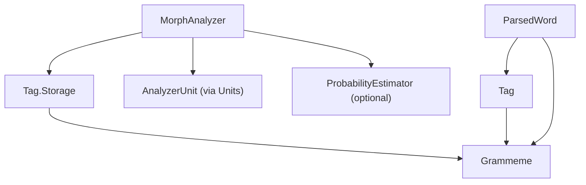
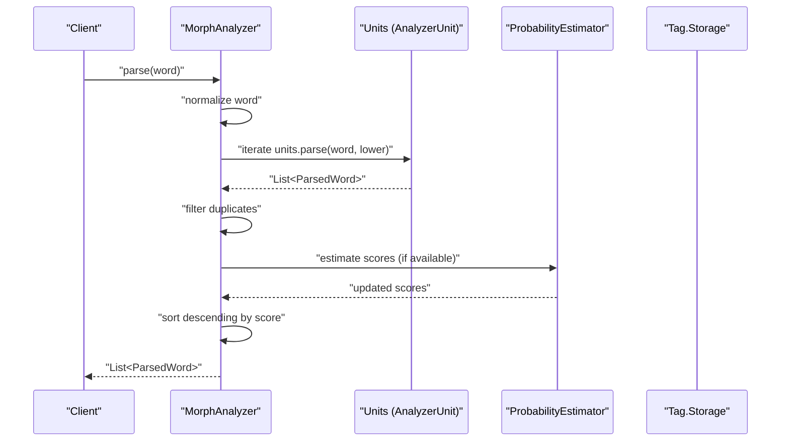
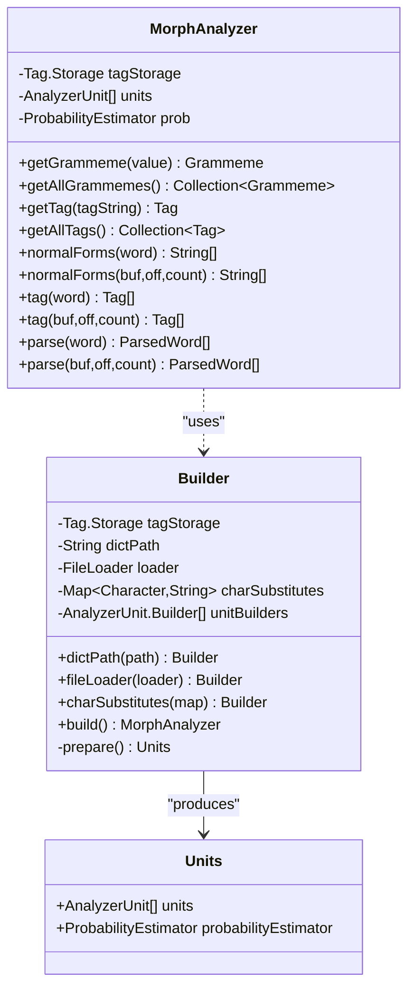
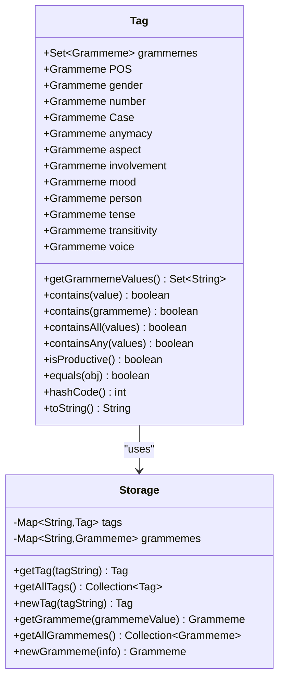
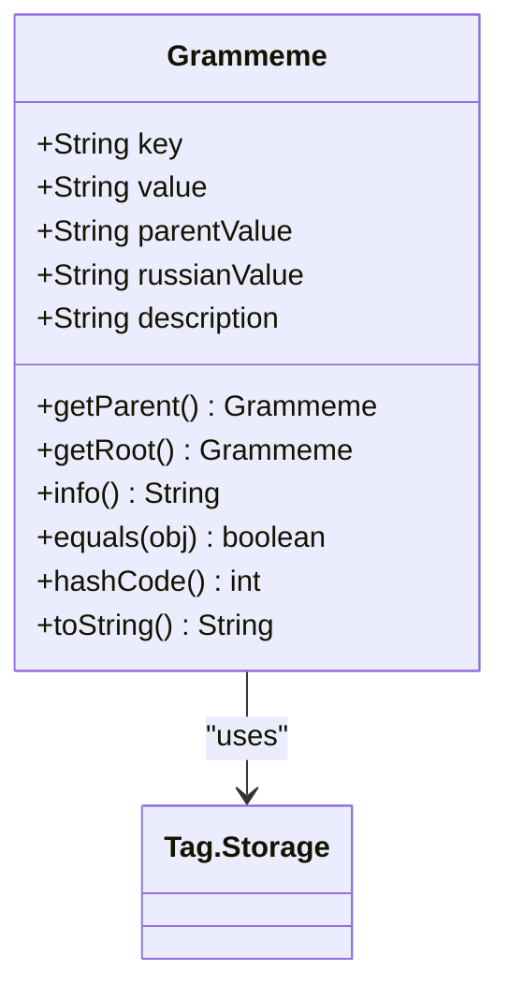
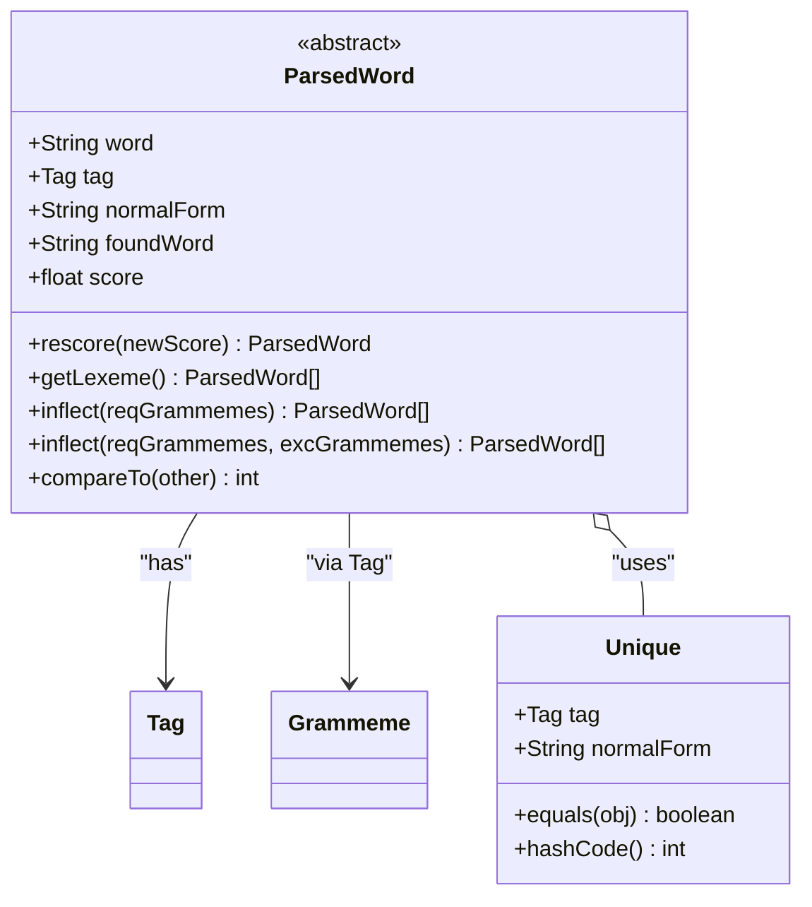
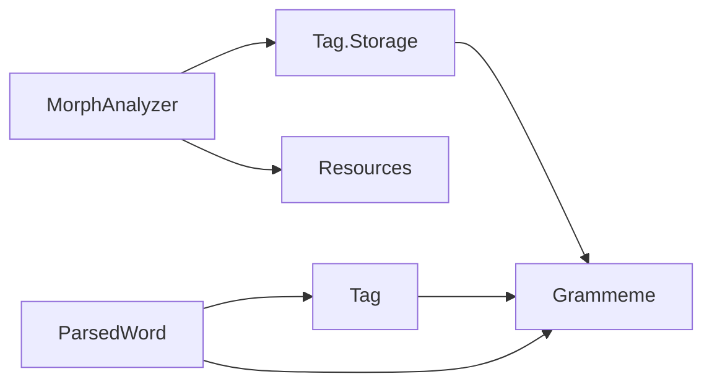

# Core API Classes

<cite>
**Referenced Files in This Document**
- [MorphAnalyzer.java](file://jmorphy2-core/src/main/java/company/evo/jmorphy2/MorphAnalyzer.java)
- [Tag.java](file://jmorphy2-core/src/main/java/company/evo/jmorphy2/Tag.java)
- [Grammeme.java](file://jmorphy2-core/src/main/java/company/evo/jmorphy2/Grammeme.java)
- [ParsedWord.java](file://jmorphy2-core/src/main/java/company/evo/jmorphy2/ParsedWord.java)
- [Resources.java](file://jmorphy2-core/src/main/java/company/evo/jmorphy2/Resources.java)
- [MorphAnalyzerRUTest.java](file://jmorphy2-core/src/test/java/company/evo/jmorphy2/MorphAnalyzerRUTest.java)
- [MorphAnalyzerUkTest.java](file://jmorphy2-core/src/test/java/company/evo/jmorphy2/MorphAnalyzerUkTest.java)
- [Jmorphy2TestsHelpers.java](file://jmorphy2-core/src/test/java/company/evo/jmorphy2/Jmorphy2TestsHelpers.java)
</cite>

## Table of Contents
1. [Introduction](#introduction)
2. [Project Structure](#project-structure)
3. [Core Components](#core-components)
4. [Architecture Overview](#architecture-overview)
5. [Detailed Component Analysis](#detailed-component-analysis)
6. [Dependency Analysis](#dependency-analysis)
7. [Performance Considerations](#performance-considerations)
8. [Troubleshooting Guide](#troubleshooting-guide)
9. [Conclusion](#conclusion)
10. [Appendices](#appendices)

## Introduction
This document provides comprehensive API documentation for Jmorphy2’s core classes focused on MorphAnalyzer, Tag, and Grammeme interfaces. It covers constructor options, analysis methods (parse, tag, normalForms), configuration via the Builder pattern, Tag operations for part-of-speech categories and grammatical features, and Grammeme usage in analysis results. Practical usage patterns are demonstrated through test-driven examples, and thread-safety considerations are addressed along with version compatibility notes.

## Project Structure
The core API resides in the jmorphy2-core module under company.evo.jmorphy2. The primary classes are:
- MorphAnalyzer: orchestrates morphological analysis using pluggable AnalyzerUnit components and a shared Tag.Storage.
- Tag: encapsulates grammatical tags and provides grammeme retrieval and validation helpers.
- Grammeme: represents a grammatical feature with hierarchical parent/root relationships.
- ParsedWord: abstract base for analysis results, including scoring and paradigm generation.
- Resources: utility for loading language-specific character substitutions and known prefixes.

**Diagram sources**
- [MorphAnalyzer.java:15-247](file://jmorphy2-core/src/main/java/company/evo/jmorphy2/MorphAnalyzer.java#L15-L247)
- [Tag.java:7-230](file://jmorphy2-core/src/main/java/company/evo/jmorphy2/Tag.java#L7-L230)
- [Grammeme.java:7-86](file://jmorphy2-core/src/main/java/company/evo/jmorphy2/Grammeme.java#L7-L86)
- [ParsedWord.java:9-89](file://jmorphy2-core/src/main/java/company/evo/jmorphy2/ParsedWord.java#L9-L89)

**Section sources**
- [MorphAnalyzer.java:15-247](file://jmorphy2-core/src/main/java/company/evo/jmorphy2/MorphAnalyzer.java#L15-L247)
- [Tag.java:7-230](file://jmorphy2-core/src/main/java/company/evo/jmorphy2/Tag.java#L7-L230)
- [Grammeme.java:7-86](file://jmorphy2-core/src/main/java/company/evo/jmorphy2/Grammeme.java#L7-L86)
- [ParsedWord.java:9-89](file://jmorphy2-core/src/main/java/company/evo/jmorphy2/ParsedWord.java#L9-L89)
- [Resources.java:16-114](file://jmorphy2-core/src/main/java/company/evo/jmorphy2/Resources.java#L16-L114)

## Core Components
This section summarizes the primary APIs and their responsibilities.

- MorphAnalyzer
  - Provides analysis pipeline: parse(word), tag(word), normalForms(word).
  - Exposes grammeme/tag lookup via getGrammeme(value), getAllGrammemes(), getTag(tagString), getAllTags().
  - Uses a Builder pattern to configure dictionary path, file loader, character substitutions, and unit builders.
  - Internally composes AnalyzerUnit instances and optional ProbabilityEstimator.

- Tag
  - Encapsulates a normalized grammatical tag string and exposes grammeme sets and convenience fields (POS, gender, number, case, etc.).
  - Provides contains checks for grammemes and values, productivity detection, and equality/hash semantics.
  - Tag.Storage manages normalization, caching, and creation of Tag and Grammeme instances.

- Grammeme
  - Represents a grammatical feature with value, parent, Russian label, and description.
  - Supports getParent() and getRoot() to navigate the grammeme hierarchy.
  - Equality and hashing are based on normalized key and storage identity.

- ParsedWord
  - Abstract result with word, tag, normalForm, foundWord, and score.
  - Defines rescore and getLexeme for derived results.
  - Supports inflection filtering via required and excluded grammemes.

**Section sources**
- [MorphAnalyzer.java:15-247](file://jmorphy2-core/src/main/java/company/evo/jmorphy2/MorphAnalyzer.java#L15-L247)
- [Tag.java:7-230](file://jmorphy2-core/src/main/java/company/evo/jmorphy2/Tag.java#L7-L230)
- [Grammeme.java:7-86](file://jmorphy2-core/src/main/java/company/evo/jmorphy2/Grammeme.java#L7-L86)
- [ParsedWord.java:9-89](file://jmorphy2-core/src/main/java/company/evo/jmorphy2/ParsedWord.java#L9-L89)

## Architecture Overview
The analyzer composes multiple AnalyzerUnit components (dictionary, numbers, punctuation, roman numerals, latin, known/unknown prefixes/suffixes, unknown words) and applies a probabilistic estimator when available. Results are deduplicated, scored, and sorted.

**Diagram sources**
- [MorphAnalyzer.java:178-200](file://jmorphy2-core/src/main/java/company/evo/jmorphy2/MorphAnalyzer.java#L178-L200)
- [MorphAnalyzer.java:202-232](file://jmorphy2-core/src/main/java/company/evo/jmorphy2/MorphAnalyzer.java#L202-L232)
- [MorphAnalyzer.java:234-245](file://jmorphy2-core/src/main/java/company/evo/jmorphy2/MorphAnalyzer.java#L234-L245)

## Detailed Component Analysis

### MorphAnalyzer
- Purpose: Central orchestrator for morphological analysis with a pluggable unit architecture and optional probabilistic scoring.
- Key methods:
  - parse(word): returns ordered list of ParsedWord results.
  - tag(word): returns list of Tag instances extracted from parses.
  - normalForms(word): returns unique normal forms for the word.
  - getGrammeme(value), getAllGrammemes(): retrieve Grammeme by normalized value or all grammemes.
  - getTag(tagString), getAllTags(): retrieve Tag by normalized tag string or all tags.
- Builder pattern:
  - dictPath(path): set dictionary path.
  - fileLoader(loader): inject custom FileLoader.
  - charSubstitutes(map): configure character substitution rules.
  - build(): constructs MorphAnalyzer with prepared Units and optional ProbabilityEstimator.
- Internal behavior:
  - Normalizes input and applies known sanitization for specific tokens.
  - Iterates units until a terminated unit yields results.
  - Deduplicates results by tag+normalForm and sorts by score.
  - Applies probability estimation when dictionary metadata indicates PTW support.

**Diagram sources**
- [MorphAnalyzer.java:15-125](file://jmorphy2-core/src/main/java/company/evo/jmorphy2/MorphAnalyzer.java#L15-L125)
- [MorphAnalyzer.java:20-105](file://jmorphy2-core/src/main/java/company/evo/jmorphy2/MorphAnalyzer.java#L20-L105)
- [MorphAnalyzer.java:107-115](file://jmorphy2-core/src/main/java/company/evo/jmorphy2/MorphAnalyzer.java#L107-L115)

**Section sources**
- [MorphAnalyzer.java:15-247](file://jmorphy2-core/src/main/java/company/evo/jmorphy2/MorphAnalyzer.java#L15-L247)

### Tag
- Purpose: Encapsulates a grammatical tag string, normalizes it, and exposes grammeme sets and convenience fields for common categories (POS, gender, number, case, etc.).
- Key methods:
  - getGrammemeValues(): returns the set of grammeme values.
  - contains(value), contains(grammeme), containsAll(...), containsAny(...): checks for grammeme presence.
  - isProductive(): determines if the tag does not include non-productive grammeme roots.
  - equals/hashCode/toString: equality by grammeme set and storage identity, string representation as original tag.
- Tag.Storage:
  - Normalizes grammeme values and tag strings.
  - Caches Tag and Grammeme instances keyed by normalized values.
  - Provides newTag and newGrammeme factories.

**Diagram sources**
- [Tag.java:7-230](file://jmorphy2-core/src/main/java/company/evo/jmorphy2/Tag.java#L7-L230)

**Section sources**
- [Tag.java:7-230](file://jmorphy2-core/src/main/java/company/evo/jmorphy2/Tag.java#L7-L230)

### Grammeme
- Purpose: Represents a grammatical feature with hierarchical relationships.
- Key methods:
  - getParent(): returns the parent Grammeme.
  - getRoot(): traverses up to the root Grammeme.
  - info(): formatted string with value, parent, Russian label, and description.
  - equals/hashCode/toString: equality by normalized key and storage identity.

**Diagram sources**
- [Grammeme.java:7-86](file://jmorphy2-core/src/main/java/company/evo/jmorphy2/Grammeme.java#L7-L86)

**Section sources**
- [Grammeme.java:7-86](file://jmorphy2-core/src/main/java/company/evo/jmorphy2/Grammeme.java#L7-L86)

### ParsedWord
- Purpose: Abstract base for analysis results, exposing word, tag, normal form, found word, and score.
- Key methods:
  - rescore(newScore): returns a new ParsedWord with updated score.
  - getLexeme(): returns paradigm entries matching the tag.
  - inflect(requiredGrammemes[, excluded]): filters lexeme entries by required and excluded grammemes.
  - compareTo: comparison by score.

**Diagram sources**
- [ParsedWord.java:9-89](file://jmorphy2-core/src/main/java/company/evo/jmorphy2/ParsedWord.java#L9-L89)

**Section sources**
- [ParsedWord.java:9-89](file://jmorphy2-core/src/main/java/company/evo/jmorphy2/ParsedWord.java#L9-L89)

## Dependency Analysis
- MorphAnalyzer depends on Tag.Storage for grammeme/tag resolution and caching.
- Tag depends on Grammeme and Tag.Storage for normalization and caching.
- ParsedWord depends on Tag and Grammeme for grammatical filtering and paradigm generation.
- Resources supplies language-specific configuration (character substitutions, known prefixes) used during builder preparation.

**Diagram sources**
- [MorphAnalyzer.java:15-247](file://jmorphy2-core/src/main/java/company/evo/jmorphy2/MorphAnalyzer.java#L15-L247)
- [Tag.java:7-230](file://jmorphy2-core/src/main/java/company/evo/jmorphy2/Tag.java#L7-L230)
- [Grammeme.java:7-86](file://jmorphy2-core/src/main/java/company/evo/jmorphy2/Grammeme.java#L7-L86)
- [ParsedWord.java:9-89](file://jmorphy2-core/src/main/java/company/evo/jmorphy2/ParsedWord.java#L9-L89)
- [Resources.java:16-114](file://jmorphy2-core/src/main/java/company/evo/jmorphy2/Resources.java#L16-L114)

**Section sources**
- [MorphAnalyzer.java:15-247](file://jmorphy2-core/src/main/java/company/evo/jmorphy2/MorphAnalyzer.java#L15-L247)
- [Tag.java:7-230](file://jmorphy2-core/src/main/java/company/evo/jmorphy2/Tag.java#L7-L230)
- [Grammeme.java:7-86](file://jmorphy2-core/src/main/java/company/evo/jmorphy2/Grammeme.java#L7-L86)
- [ParsedWord.java:9-89](file://jmorphy2-core/src/main/java/company/evo/jmorphy2/ParsedWord.java#L9-L89)
- [Resources.java:16-114](file://jmorphy2-core/src/main/java/company/evo/jmorphy2/Resources.java#L16-L114)

## Performance Considerations
- Builder prepares Units and optional ProbabilityEstimator once; reuse the constructed MorphAnalyzer instance for concurrent access.
- Tag.Storage caches normalized tags and grammemes; repeated lookups are O(1) after initial construction.
- parse() performs deduplication and sorting; avoid unnecessary repeated calls for the same input.
- Character substitutions and known prefixes reduce ambiguity and improve accuracy for specific languages.

[No sources needed since this section provides general guidance]

## Troubleshooting Guide
- Dictionary path resolution: If no dictPath is provided and no fileLoader is set, the Builder attempts to load from a system property. Ensure the environment variable or property is configured correctly.
- Unexpected empty results: Verify that the dictionary resource path is correct and that the language code matches the dictionaries.
- Character normalization issues: Use charSubstitutes to handle language-specific character variations.
- Probabilistic scoring not applied: ProbabilityEstimator is enabled only when dictionary metadata indicates PTW support.

**Section sources**
- [MorphAnalyzer.java:52-99](file://jmorphy2-core/src/main/java/company/evo/jmorphy2/MorphAnalyzer.java#L52-L99)
- [Resources.java:16-40](file://jmorphy2-core/src/main/java/company/evo/jmorphy2/Resources.java#L16-L40)

## Conclusion
Jmorphy2’s core API centers around a flexible MorphAnalyzer that composes multiple AnalyzerUnit components, backed by a shared Tag.Storage for grammatical normalization and caching. Tag and Grammeme provide robust grammatical feature modeling and hierarchy traversal. ParsedWord offers a standardized result interface with paradigm generation and filtering. The Builder pattern simplifies configuration, while Tag.Storage ensures efficient lookups. Tests demonstrate typical usage patterns for Russian and Ukrainian languages.

[No sources needed since this section summarizes without analyzing specific files]

## Appendices

### API Reference: MorphAnalyzer
- Constructor options and configuration
  - Builder.dictPath(path): Sets dictionary path.
  - Builder.fileLoader(loader): Injects a FileLoader implementation.
  - Builder.charSubstitutes(map): Configures character substitutions.
  - Builder.build(): Constructs MorphAnalyzer with prepared Units and optional ProbabilityEstimator.
- Analysis methods
  - parse(word): Returns a list of ParsedWord results, sorted by score.
  - tag(word): Returns a list of Tag instances from parses.
  - normalForms(word): Returns unique normal forms for the word.
  - parse(buf, off, count), tag(buf, off, count), normalForms(buf, off, count): Overloads for char arrays.
- Lookup methods
  - getGrammeme(value): Retrieves a Grammeme by normalized value.
  - getAllGrammemes(): Returns all known Grammeme instances.
  - getTag(tagString): Retrieves a Tag by normalized tag string.
  - getAllTags(): Returns all known Tag instances.

**Section sources**
- [MorphAnalyzer.java:15-247](file://jmorphy2-core/src/main/java/company/evo/jmorphy2/MorphAnalyzer.java#L15-L247)

### API Reference: Tag
- Construction and normalization
  - newTag(tagString): Creates or retrieves a normalized Tag.
  - getTag(tagString): Retrieves a Tag by normalized tag string.
  - getAllTags(): Returns all Tag instances.
- Grammatical feature access
  - getGrammemeValues(): Returns grammeme values.
  - contains(value), contains(grammeme), containsAll(values), containsAny(values): Checks for grammeme presence.
  - isProductive(): Determines if the tag excludes non-productive grammeme roots.
  - POS, gender, number, Case, anymacy, aspect, involvement, mood, person, tense, transitivity, voice: Convenience fields.

**Section sources**
- [Tag.java:7-230](file://jmorphy2-core/src/main/java/company/evo/jmorphy2/Tag.java#L7-L230)

### API Reference: Grammeme
- Properties
  - key, value, parentValue, russianValue, description.
- Methods
  - getParent(): Parent Grammeme.
  - getRoot(): Root Grammeme.
  - info(): Formatted info string.
  - equals/hashCode/toString: Equality semantics.

**Section sources**
- [Grammeme.java:7-86](file://jmorphy2-core/src/main/java/company/evo/jmorphy2/Grammeme.java#L7-L86)

### Usage Examples
- Constructing an analyzer for Russian or Ukrainian:
  - Use Jmorphy2TestsHelpers.newMorphAnalyzer(lang) to create a ready-to-use analyzer with resource-based loaders and optional char substitutions.
- Performing analysis:
  - Parse a word to get ParsedWord results, then extract Tag instances via tag(word) or normal forms via normalForms(word).
- Filtering paradigms:
  - Use ParsedWord.inflect(required, excluded) to generate paradigm forms constrained by grammemes.

**Section sources**
- [Jmorphy2TestsHelpers.java:6-20](file://jmorphy2-core/src/test/java/company/evo/jmorphy2/Jmorphy2TestsHelpers.java#L6-L20)
- [MorphAnalyzerRUTest.java:30-142](file://jmorphy2-core/src/test/java/company/evo/jmorphy2/MorphAnalyzerRUTest.java#L30-L142)
- [MorphAnalyzerUkTest.java:30-67](file://jmorphy2-core/src/test/java/company/evo/jmorphy2/MorphAnalyzerUkTest.java#L30-L67)

### Thread Safety and Concurrency
- MorphAnalyzer, Tag.Storage, Tag, and Grammeme instances are designed to be immutable or effectively immutable after construction. They rely on internal caches keyed by normalized strings and storage identity for equality.
- Recommended usage:
  - Build a single MorphAnalyzer instance per language/dictionary configuration.
  - Share the instance across threads for concurrent analysis.
  - Avoid mutating internal state; rely on factory methods and immutable results.

**Section sources**
- [Tag.java:141-159](file://jmorphy2-core/src/main/java/company/evo/jmorphy2/Tag.java#L141-L159)
- [Grammeme.java:62-75](file://jmorphy2-core/src/main/java/company/evo/jmorphy2/Grammeme.java#L62-L75)
- [MorphAnalyzer.java:15-247](file://jmorphy2-core/src/main/java/company/evo/jmorphy2/MorphAnalyzer.java#L15-L247)

### Version Compatibility and Deprecation Notes
- The project integrates with Elasticsearch plugins and supports multiple Elasticsearch versions as documented in the repository README. While this document focuses on core API classes, consult the README for compatibility matrices and migration notes for external integrations.
- No explicit deprecations were identified in the core classes analyzed here. Always refer to release notes and changelogs for deprecation announcements.

**Section sources**
- [README.md:1-142](file://README.md#L1-L142)