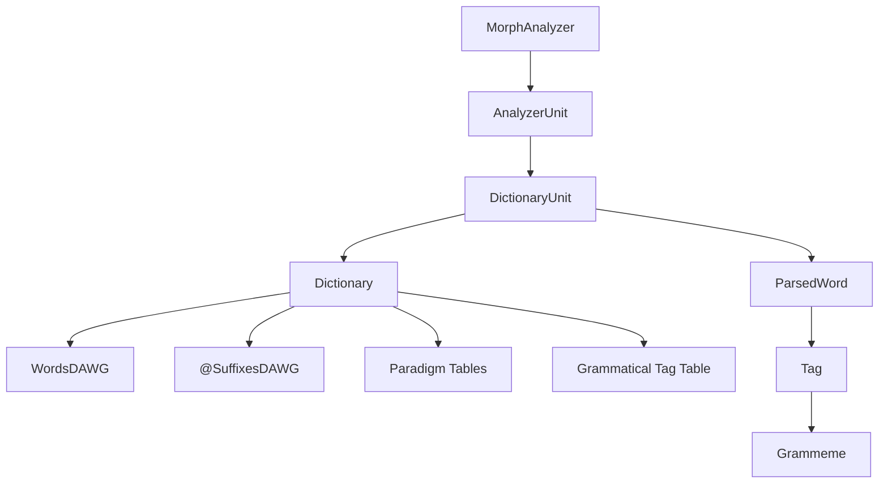
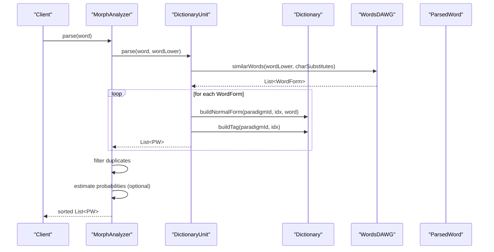
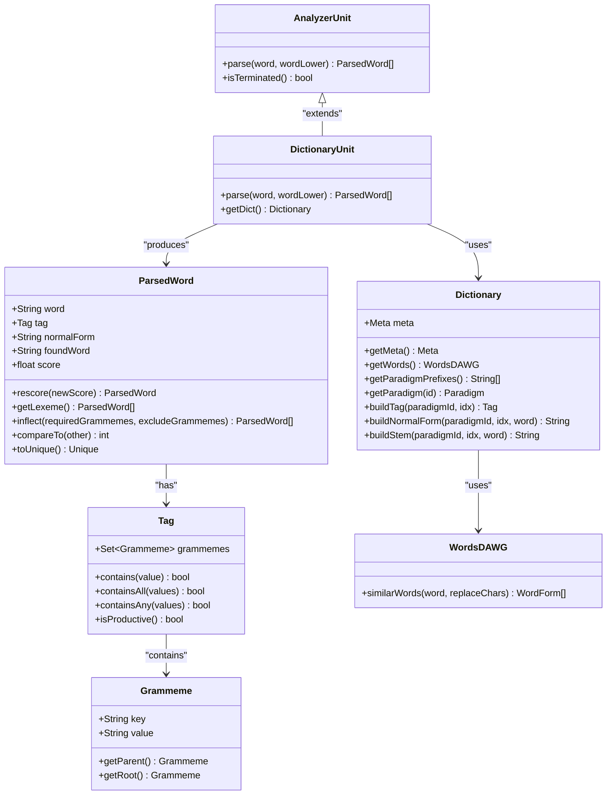

# Result Data Structures

<cite>
**Referenced Files in This Document**
- [ParsedWord.java](file://jmorphy2-core/src/main/java/company/evo/jmorphy2/ParsedWord.java)
- [Dictionary.java](file://jmorphy2-core/src/main/java/company/evo/jmorphy2/Dictionary.java)
- [MorphAnalyzer.java](file://jmorphy2-core/src/main/java/company/evo/jmorphy2/MorphAnalyzer.java)
- [Tag.java](file://jmorphy2-core/src/main/java/company/evo/jmorphy2/Tag.java)
- [Grammeme.java](file://jmorphy2-core/src/main/java/company/evo/jmorphy2/Grammeme.java)
- [DictionaryUnit.java](file://jmorphy2-core/src/main/java/company/evo/jmorphy2/units/DictionaryUnit.java)
- [AnalyzerUnit.java](file://jmorphy2-core/src/main/java/company/evo/jmorphy2/units/AnalyzerUnit.java)
- [WordsDAWG.java](file://jmorphy2-core/src/main/java/company/evo/jmorphy2/WordsDAWG.java)
- [SuffixesDAWG.java](file://jmorphy2-core/src/main/java/company/evo/jmorphy2/SuffixesDAWG.java)
- [MorphAnalyzerRUTest.java](file://jmorphy2-core/src/test/java/company/evo/jmorphy2/MorphAnalyzerRUTest.java)
</cite>

## Table of Contents
1. [Introduction](#introduction)
2. [Project Structure](#project-structure)
3. [Core Components](#core-components)
4. [Architecture Overview](#architecture-overview)
5. [Detailed Component Analysis](#detailed-component-analysis)
6. [Dependency Analysis](#dependency-analysis)
7. [Performance Considerations](#performance-considerations)
8. [Troubleshooting Guide](#troubleshooting-guide)
9. [Conclusion](#conclusion)

## Introduction
This document provides detailed API documentation for Jmorphy2’s result data structures, focusing on the ParsedWord and Dictionary classes. It explains how parsed morphological analyses map to dictionary paradigms, how grammatical information is represented and accessed, and how to compare and manipulate analysis results. Practical examples demonstrate interpreting results and navigating dictionary structures, along with performance considerations for large dictionaries and batch processing.

## Project Structure
Jmorphy2 organizes morphological analysis around a dictionary-backed paradigm system. The core runtime consists of:
- MorphAnalyzer: orchestrates analysis units and scoring
- Dictionary: encapsulates compiled dictionary metadata, paradigm tables, and lookup structures
- ParsedWord: abstract representation of a single analysis result
- Tag and Grammeme: grammatical attributes and their hierarchical relationships
- Units: pluggable analyzers (e.g., DictionaryUnit) that produce ParsedWord instances

**Diagram sources**
- [MorphAnalyzer.java:15-247](file://jmorphy2-core/src/main/java/company/evo/jmorphy2/MorphAnalyzer.java#L15-L247)
- [DictionaryUnit.java:14-104](file://jmorphy2-core/src/main/java/company/evo/jmorphy2/units/DictionaryUnit.java#L14-L104)
- [Dictionary.java:12-302](file://jmorphy2-core/src/main/java/company/evo/jmorphy2/Dictionary.java#L12-L302)
- [WordsDAWG.java:13-57](file://jmorphy2-core/src/main/java/company/evo/jmorphy2/WordsDAWG.java#L13-L57)
- [SuffixesDAWG.java:13-61](file://jmorphy2-core/src/main/java/company/evo/jmorphy2/SuffixesDAWG.java#L13-L61)
- [ParsedWord.java:9-89](file://jmorphy2-core/src/main/java/company/evo/jmorphy2/ParsedWord.java#L9-L89)
- [Tag.java:7-230](file://jmorphy2-core/src/main/java/company/evo/jmorphy2/Tag.java#L7-L230)
- [Grammeme.java:7-86](file://jmorphy2-core/src/main/java/company/evo/jmorphy2/Grammeme.java#L7-L86)

**Section sources**
- [MorphAnalyzer.java:15-247](file://jmorphy2-core/src/main/java/company/evo/jmorphy2/MorphAnalyzer.java#L15-L247)
- [Dictionary.java:12-302](file://jmorphy2-core/src/main/java/company/evo/jmorphy2/Dictionary.java#L12-L302)

## Core Components
This section documents the primary data structures and their roles in morphological analysis.

- ParsedWord: An abstract result representing a single analysis hypothesis with word form, grammatical tag, normal form, original found word, and a confidence score. It supports rescore operations, retrieving the full paradigm (lexeme), inflection filtering, and comparison by score.
- Dictionary: Encapsulates dictionary metadata, paradigm tables, grammatical tag table, and lookup structures (DAWG-based). It exposes builders for loading dictionaries from files and provides methods to reconstruct normal forms and tags from paradigm indices.
- Tag and Grammeme: Represent grammatical attributes and their hierarchical relationships. Tags are sets of grammemes with convenience accessors for major categories (part-of-speech, case, number, gender, etc.) and membership checks.
- AnalyzerUnit and DictionaryUnit: Pluggable analysis units. DictionaryUnit produces ParsedWord instances by querying the dictionary’s DAWG and building results from paradigm tables.

**Section sources**
- [ParsedWord.java:9-89](file://jmorphy2-core/src/main/java/company/evo/jmorphy2/ParsedWord.java#L9-L89)
- [Dictionary.java:12-302](file://jmorphy2-core/src/main/java/company/evo/jmorphy2/Dictionary.java#L12-L302)
- [Tag.java:7-230](file://jmorphy2-core/src/main/java/company/evo/jmorphy2/Tag.java#L7-L230)
- [Grammeme.java:7-86](file://jmorphy2-core/src/main/java/company/evo/jmorphy2/Grammeme.java#L7-L86)
- [AnalyzerUnit.java:11-71](file://jmorphy2-core/src/main/java/company/evo/jmorphy2/units/AnalyzerUnit.java#L11-L71)
- [DictionaryUnit.java:14-104](file://jmorphy2-core/src/main/java/company/evo/jmorphy2/units/DictionaryUnit.java#L14-L104)

## Architecture Overview
The morphological pipeline integrates dictionary-backed analysis with probabilistic scoring and unit composition.

**Diagram sources**
- [MorphAnalyzer.java:178-200](file://jmorphy2-core/src/main/java/company/evo/jmorphy2/MorphAnalyzer.java#L178-L200)
- [DictionaryUnit.java:56-65](file://jmorphy2-core/src/main/java/company/evo/jmorphy2/units/DictionaryUnit.java#L56-L65)
- [Dictionary.java:170-188](file://jmorphy2-core/src/main/java/company/evo/jmorphy2/Dictionary.java#L170-L188)
- [WordsDAWG.java:25-31](file://jmorphy2-core/src/main/java/company/evo/jmorphy2/WordsDAWG.java#L25-L31)

## Detailed Component Analysis

### ParsedWord: Analysis Result Representation
ParsedWord is an abstract class representing a single morphological analysis. It carries:
- word: surface form analyzed
- tag: grammatical tag (set of grammemes)
- normalForm: canonical base form
- foundWord: matched dictionary lemma or derived form
- score: confidence score used for ranking

Key capabilities:
- rescore(newScore): returns a new ParsedWord with updated score (useful for probabilistic re-ranking)
- getLexeme(): returns the full paradigm (all inflected forms) for the analysis
- inflect(requiredGrammemes, excludeGrammemes): filters lexeme items by required and excluded grammemes
- compareTo(other): compares by score descending
- toUnique(): creates a hashable signature for deduplication (tag + normalForm)

Comparison and equality:
- ParsedWord defines a Unique inner class for deduplication based on tag and normalForm.
- Comparison is performed by score ordering.

Practical usage:
- After parsing, sort results by score to select the best analysis.
- Use inflect to restrict results to desired grammatical features (e.g., case, number).
- Use getLexeme to enumerate all paradigm forms for a given analysis.

**Section sources**
- [ParsedWord.java:9-89](file://jmorphy2-core/src/main/java/company/evo/jmorphy2/ParsedWord.java#L9-L89)

### Dictionary: Dictionary Management and Paradigm Access
Dictionary encapsulates:
- Meta: metadata about the dictionary (format version, language, compilation info, sizes, compile options, P(t|w) flags)
- Paradigm tables: per-paradigm arrays storing stem/suffix/prefix ids and tag ids
- Grammatical tag table: maps tag ids to Tag objects
- Lookup structures: WordsDAWG for word-to-paradigm mapping, SuffixesDAWG for suffix predictions
- Suffixes: string table for suffix/stem/prefix strings

Public API highlights:
- getMeta(): access dictionary metadata
- getWords(): access WordsDAWG
- getPredictionSuffixes(n): access per-prefix prediction suffix DAWGs
- getParadigmPrefixes(): access paradigm prefix strings
- getParadigm(id): access paradigm table
- getSuffix(paradigmId, idx): resolve suffix string for a paradigm and index
- buildTag(paradigmId, idx): construct Tag from paradigm and index
- buildNormalForm(paradigmId, idx, word): compute normal form from paradigm and word
- buildStem(paradigmId, idx, word): compute stem from paradigm and word

Builder and loading:
- Builder loads dictionary components from files (meta.json, words.dawg, paradigms.array, suffixes.json, grammemes.json, gramtab-opencorpora-int.json) and caches the resulting Dictionary instance.

Relationship to parsed results:
- DictionaryUnit uses Dictionary to transform WordForm payloads into ParsedWord instances, then expands to lexeme forms using paradigm tables.

**Section sources**
- [Dictionary.java:12-302](file://jmorphy2-core/src/main/java/company/evo/jmorphy2/Dictionary.java#L12-L302)

### Tag and Grammeme: Grammatical Information Access
Tag represents a grammatical tag as a set of grammemes with:
- Convenience accessors for major categories (POS, Case, number, gender, aspect, mood, person, tense, transitivity, voice, involvement)
- Membership checks: contains, containsAll, containsAny, and value-based variants
- Productivity check: determines whether the tag contains non-productive grammemes

Grammeme holds:
- key, value, parentValue, russianValue, description
- getParent() and getRoot() to traverse the grammeme hierarchy
- Equality and hashing based on normalized keys

Tag.Storage manages:
- Normalization of grammeme values and tag strings
- Creation and caching of Grammeme and Tag instances
- Retrieval of grammemes and tags by value

Practical usage:
- Use Tag.accessors to quickly check grammatical features.
- Use Tag.contains* methods to filter analyses by required or excluded features.
- Use Grammeme.getParent()/getRoot() to navigate grammatical hierarchies.

**Section sources**
- [Tag.java:7-230](file://jmorphy2-core/src/main/java/company/evo/jmorphy2/Tag.java#L7-L230)
- [Grammeme.java:7-86](file://jmorphy2-core/src/main/java/company/evo/jmorphy2/Grammeme.java#L7-L86)

### AnalyzerUnit and DictionaryUnit: Producing ParsedWord Results
AnalyzerUnit is an abstract base for analysis units. DictionaryUnit specializes it to:
- Query WordsDAWG for similar words with character substitutions
- Build ParsedWord instances using Dictionary methods
- Expand to lexeme forms using paradigm tables

The AnalyzerParsedWord inner class provides:
- rescore(newScore): immutable update of score
- getLexeme(): returns a single-item list for basic AnalyzerParsedWord, expanded in DictionaryParsedWord
- toString(): includes unit class for debugging

**Section sources**
- [AnalyzerUnit.java:11-71](file://jmorphy2-core/src/main/java/company/evo/jmorphy2/units/AnalyzerUnit.java#L11-L71)
- [DictionaryUnit.java:14-104](file://jmorphy2-core/src/main/java/company/evo/jmorphy2/units/DictionaryUnit.java#L14-L104)

### Practical Examples: Interpreting Results and Navigating Dictionary Structures
Below are practical examples demonstrating how to interpret analysis results and navigate dictionary structures. These examples are derived from tests and reflect real-world usage patterns.

- Parsing a Russian adjective and inspecting grammatical features:
  - Parse a word and access the POS, case, number, and gender from the Tag.
  - Use containsAllValues to verify combinations of grammematical features.
  - Example paths:
    - [MorphAnalyzerRUTest.java:30-50](file://jmorphy2-core/src/test/java/company/evo/jmorphy2/MorphAnalyzerRUTest.java#L30-L50)

- Computing normal forms:
  - Use morph.normalForms to get unique normal forms for a word.
  - Example path:
    - [MorphAnalyzerRUTest.java:144-157](file://jmorphy2-core/src/test/java/company/evo/jmorphy2/MorphAnalyzerRUTest.java#L144-L157)

- Enumerating lexeme forms:
  - Call getLexeme on a ParsedWord to retrieve all paradigm forms.
  - Example path:
    - [MorphAnalyzerRUTest.java:160-200](file://jmorphy2-core/src/test/java/company/evo/jmorphy2/MorphAnalyzerRUTest.java#L160-L200)

- Working with known prefixes and suffixes:
  - Demonstrates how prefixes and suffixes are handled during parsing and lexeme expansion.
  - Example paths:
    - [MorphAnalyzerRUTest.java:56-99](file://jmorphy2-core/src/test/java/company/evo/jmorphy2/MorphAnalyzerRUTest.java#L56-L99)

- Probabilistic estimation:
  - When P(t|w) metadata is present, MorphAnalyzer estimates scores using ProbabilityEstimator and rescores ParsedWord instances.
  - Example path:
    - [MorphAnalyzer.java:202-232](file://jmorphy2-core/src/main/java/company/evo/jmorphy2/MorphAnalyzer.java#L202-L232)

**Section sources**
- [MorphAnalyzerRUTest.java:30-200](file://jmorphy2-core/src/test/java/company/evo/jmorphy2/MorphAnalyzerRUTest.java#L30-L200)
- [MorphAnalyzer.java:202-232](file://jmorphy2-core/src/main/java/company/evo/jmorphy2/MorphAnalyzer.java#L202-L232)

## Dependency Analysis
The following diagram shows key dependencies among the core classes involved in morphological analysis.

**Diagram sources**
- [ParsedWord.java:9-89](file://jmorphy2-core/src/main/java/company/evo/jmorphy2/ParsedWord.java#L9-L89)
- [Dictionary.java:12-302](file://jmorphy2-core/src/main/java/company/evo/jmorphy2/Dictionary.java#L12-L302)
- [Tag.java:7-230](file://jmorphy2-core/src/main/java/company/evo/jmorphy2/Tag.java#L7-L230)
- [Grammeme.java:7-86](file://jmorphy2-core/src/main/java/company/evo/jmorphy2/Grammeme.java#L7-L86)
- [DictionaryUnit.java:14-104](file://jmorphy2-core/src/main/java/company/evo/jmorphy2/units/DictionaryUnit.java#L14-L104)
- [WordsDAWG.java:13-57](file://jmorphy2-core/src/main/java/company/evo/jmorphy2/WordsDAWG.java#L13-L57)
- [AnalyzerUnit.java:11-71](file://jmorphy2-core/src/main/java/company/evo/jmorphy2/units/AnalyzerUnit.java#L11-L71)

**Section sources**
- [ParsedWord.java:9-89](file://jmorphy2-core/src/main/java/company/evo/jmorphy2/ParsedWord.java#L9-L89)
- [Dictionary.java:12-302](file://jmorphy2-core/src/main/java/company/evo/jmorphy2/Dictionary.java#L12-L302)
- [Tag.java:7-230](file://jmorphy2-core/src/main/java/company/evo/jmorphy2/Tag.java#L7-L230)
- [Grammeme.java:7-86](file://jmorphy2-core/src/main/java/company/evo/jmorphy2/Grammeme.java#L7-L86)
- [DictionaryUnit.java:14-104](file://jmorphy2-core/src/main/java/company/evo/jmorphy2/units/DictionaryUnit.java#L14-L104)
- [AnalyzerUnit.java:11-71](file://jmorphy2-core/src/main/java/company/evo/jmorphy2/units/AnalyzerUnit.java#L11-L71)

## Performance Considerations
Working with large dictionaries and batch processing requires attention to several performance aspects:

- Dictionary loading and caching:
  - Dictionary.Builder caches the loaded dictionary instance to avoid repeated IO and parsing overhead.
  - Prefer reusing a single MorphAnalyzer instance across requests to benefit from cached dictionary and tag storage.

- DAWG-based lookups:
  - WordsDAWG and SuffixesDAWG provide efficient near-neighbor searches with character substitution support. These reduce the need for brute-force string matching.

- Lexeme expansion:
  - getLexeme enumerates paradigm forms; for large paradigms, limit the number of results or apply inflection filters early to reduce downstream processing.

- Scoring and deduplication:
  - MorphAnalyzer.filterDups removes duplicate (tag, normalForm) pairs using ParsedWord.Unique.
  - estimate recalculates scores using P(t|w) when available; this adds computational cost but improves ranking quality.

- Batch processing:
  - Sort results once after combining outputs from multiple units.
  - Avoid repeated rescore operations; apply rescore only when necessary.

[No sources needed since this section provides general guidance]

## Troubleshooting Guide
Common issues and remedies:

- Unsupported dictionary format:
  - Dictionary.Meta constructor validates format version; mismatch raises an exception. Ensure the dictionary matches the expected format version.

- Unexpected empty results:
  - Verify that the dictionary was built with the correct language code and that character substitution settings match the input text.

- Incorrect grammatical features:
  - Confirm that Tag.Storage normalization aligns with the grammeme values used in Tag construction. Use Tag.containsAllValues for combined checks.

- Duplicate analysis results:
  - Use ParsedWord.Unique and the deduplication logic in MorphAnalyzer.filterDups to remove redundant hypotheses.

- Probabilistic estimation not applied:
  - Check Dictionary.Meta.ptw flag and ensure ProbabilityEstimator is available. Without P(t|w) metadata, scoring remains unchanged.

**Section sources**
- [Dictionary.java:232-239](file://jmorphy2-core/src/main/java/company/evo/jmorphy2/Dictionary.java#L232-L239)
- [MorphAnalyzer.java:234-245](file://jmorphy2-core/src/main/java/company/evo/jmorphy2/MorphAnalyzer.java#L234-L245)

## Conclusion
Jmorphy2’s result data structures provide a robust foundation for morphological analysis:
- ParsedWord captures analysis hypotheses with grammatical tags, normal forms, and confidence scores, enabling flexible filtering and ranking.
- Dictionary offers efficient access to paradigm tables and grammatical metadata, enabling accurate reconstruction of forms and tags.
- Tag and Grammeme model grammatical features with convenient accessors and hierarchical navigation.
- AnalyzerUnit and DictionaryUnit integrate dictionary-backed analysis into a modular pipeline.

By leveraging these APIs, developers can interpret morphological results, navigate dictionary structures, and optimize performance for large-scale and batch processing scenarios.