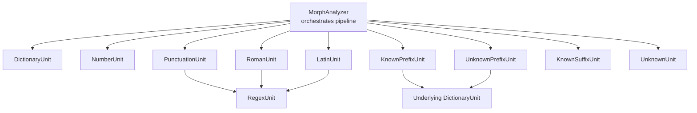
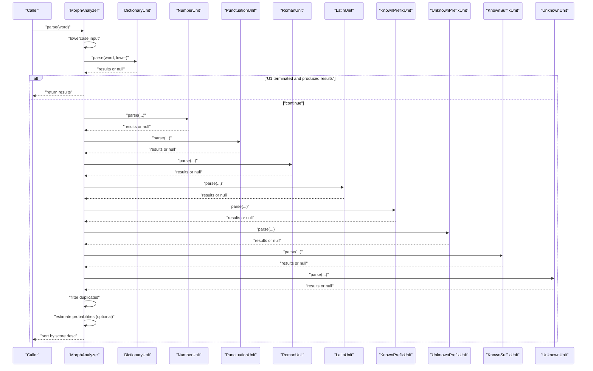
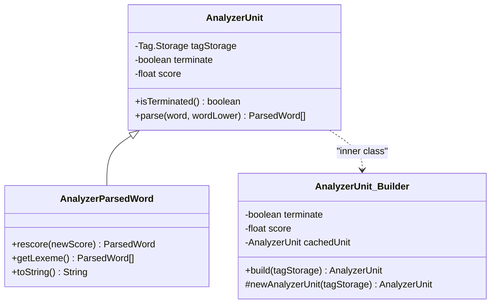
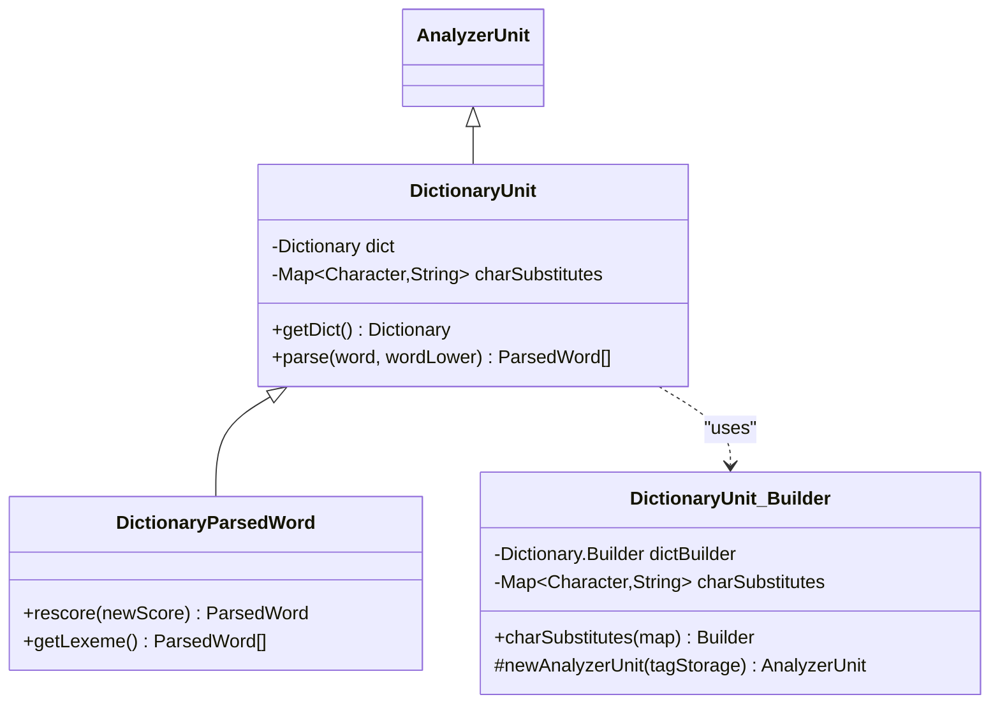
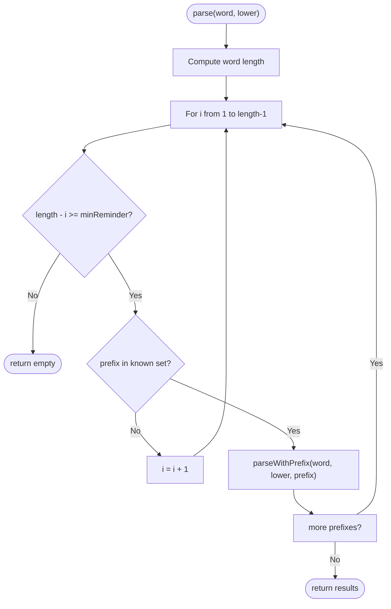
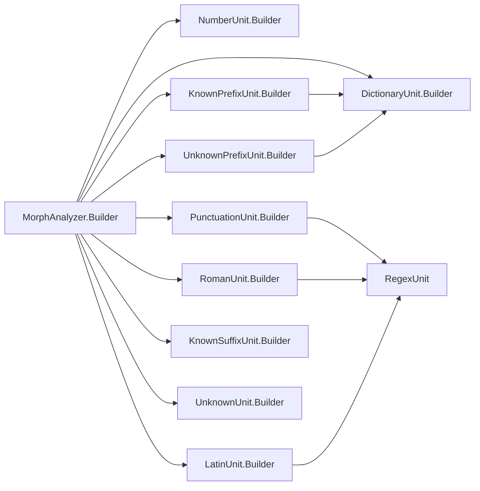

# Analyzer Units Architecture

<cite>
**Referenced Files in This Document**
- [AnalyzerUnit.java](file://jmorphy2-core/src/main/java/company/evo/jmorphy2/units/AnalyzerUnit.java)
- [DictionaryUnit.java](file://jmorphy2-core/src/main/java/company/evo/jmorphy2/units/DictionaryUnit.java)
- [NumberUnit.java](file://jmorphy2-core/src/main/java/company/evo/jmorphy2/units/NumberUnit.java)
- [PunctuationUnit.java](file://jmorphy2-core/src/main/java/company/evo/jmorphy2/units/PunctuationUnit.java)
- [LatinUnit.java](file://jmorphy2-core/src/main/java/company/evo/jmorphy2/units/LatinUnit.java)
- [UnknownUnit.java](file://jmorphy2-core/src/main/java/company/evo/jmorphy2/units/UnknownUnit.java)
- [KnownPrefixUnit.java](file://jmorphy2-core/src/main/java/company/evo/jmorphy2/units/KnownPrefixUnit.java)
- [UnknownPrefixUnit.java](file://jmorphy2-core/src/main/java/company/evo/jmorphy2/units/UnknownPrefixUnit.java)
- [KnownSuffixUnit.java](file://jmorphy2-core/src/main/java/company/evo/jmorphy2/units/KnownSuffixUnit.java)
- [RomanUnit.java](file://jmorphy2-core/src/main/java/company/evo/jmorphy2/units/RomanUnit.java)
- [PrefixedUnit.java](file://jmorphy2-core/src/main/java/company/evo/jmorphy2/units/PrefixedUnit.java)
- [RegexUnit.java](file://jmorphy2-core/src/main/java/company/evo/jmorphy2/units/RegexUnit.java)
- [MorphAnalyzer.java](file://jmorphy2-core/src/main/java/company/evo/jmorphy2/MorphAnalyzer.java)
- [ParsedWord.java](file://jmorphy2-core/src/main/java/company/evo/jmorphy2/ParsedWord.java)
- [Dictionary.java](file://jmorphy2-core/src/main/java/company/evo/jmorphy2/Dictionary.java)
</cite>

## Table of Contents
1. [Introduction](#introduction)
2. [Project Structure](#project-structure)
3. [Core Components](#core-components)
4. [Architecture Overview](#architecture-overview)
5. [Detailed Component Analysis](#detailed-component-analysis)
6. [Dependency Analysis](#dependency-analysis)
7. [Performance Considerations](#performance-considerations)
8. [Troubleshooting Guide](#troubleshooting-guide)
9. [Conclusion](#conclusion)
10. [Appendices](#appendices)

## Introduction
This document explains the Analyzer Units architecture used by the morphological analyzer. It describes the pipeline of specialized processing units that recognize different word types, the base unit interface and the Builder pattern used to construct units, and the execution order and termination semantics. It also documents confidence scoring and normalization, and provides guidance for developing custom units and configuring the pipeline.

## Project Structure
The Analyzer Units live under the units package and are orchestrated by the MorphAnalyzer. Each unit encapsulates a specific recognition strategy and contributes candidate analyses to the final result set.

**Diagram sources**
- [MorphAnalyzer.java:107-125](file://jmorphy2-core/src/main/java/company/evo/jmorphy2/MorphAnalyzer.java#L107-L125)
- [DictionaryUnit.java:14-26](file://jmorphy2-core/src/main/java/company/evo/jmorphy2/units/DictionaryUnit.java#L14-L26)
- [NumberUnit.java:10-29](file://jmorphy2-core/src/main/java/company/evo/jmorphy2/units/NumberUnit.java#L10-L29)
- [PunctuationUnit.java:8-27](file://jmorphy2-core/src/main/java/company/evo/jmorphy2/units/PunctuationUnit.java#L8-L27)
- [LatinUnit.java:8-27](file://jmorphy2-core/src/main/java/company/evo/jmorphy2/units/LatinUnit.java#L8-L27)
- [RomanUnit.java:8-31](file://jmorphy2-core/src/main/java/company/evo/jmorphy2/units/RomanUnit.java#L8-L31)
- [KnownPrefixUnit.java:12-27](file://jmorphy2-core/src/main/java/company/evo/jmorphy2/units/KnownPrefixUnit.java#L12-L27)
- [UnknownPrefixUnit.java:11-24](file://jmorphy2-core/src/main/java/company/evo/jmorphy2/units/UnknownPrefixUnit.java#L11-L24)
- [KnownSuffixUnit.java:17-35](file://jmorphy2-core/src/main/java/company/evo/jmorphy2/units/KnownSuffixUnit.java#L17-L35)
- [UnknownUnit.java:9-33](file://jmorphy2-core/src/main/java/company/evo/jmorphy2/units/UnknownUnit.java#L9-L33)

**Section sources**
- [MorphAnalyzer.java:107-125](file://jmorphy2-core/src/main/java/company/evo/jmorphy2/MorphAnalyzer.java#L107-L125)

## Core Components
- AnalyzerUnit: Abstract base for all analyzers. Provides shared fields for termination behavior and initial confidence score, plus an inner Builder class implementing the Builder pattern. Includes a nested ParsedWord wrapper for scoring and lexeme expansion.
- Derived units implement parse(word, wordLower) to produce zero or more ParsedWord candidates. Some units override rescore and getLexeme to refine confidence and enumerate paradigm forms.

Key capabilities:
- Termination: Each unit declares whether it terminates the pipeline after producing results.
- Confidence scoring: Units supply an initial score; downstream estimation may rescore candidates.
- Lexeme enumeration: Some units expose related paradigm forms for inflection filtering.

**Section sources**
- [AnalyzerUnit.java:11-72](file://jmorphy2-core/src/main/java/company/evo/jmorphy2/units/AnalyzerUnit.java#L11-L72)
- [ParsedWord.java:9-89](file://jmorphy2-core/src/main/java/company/evo/jmorphy2/ParsedWord.java#L9-L89)

## Architecture Overview
The pipeline executes units in a fixed order. Each unit attempts to parse the current token. If it matches and is marked as terminating, the process stops early. Otherwise, results accumulate until the end of the pipeline. After collection, duplicates are removed, optional probability estimation is applied, and results are sorted by score.

**Diagram sources**
- [MorphAnalyzer.java:178-200](file://jmorphy2-core/src/main/java/company/evo/jmorphy2/MorphAnalyzer.java#L178-L200)
- [MorphAnalyzer.java:202-232](file://jmorphy2-core/src/main/java/company/evo/jmorphy2/MorphAnalyzer.java#L202-L232)
- [MorphAnalyzer.java:234-245](file://jmorphy2-core/src/main/java/company/evo/jmorphy2/MorphAnalyzer.java#L234-L245)

## Detailed Component Analysis

### AnalyzerUnit Base Class and Builder Pattern
- Purpose: Defines the unit contract, termination flag, and initial score. Provides a nested Builder with caching to lazily create unit instances.
- Execution: parse(word, wordLower) returns a list of ParsedWord or null. Nested AnalyzerParsedWord wraps results with scoring and lexeme support.

**Diagram sources**
- [AnalyzerUnit.java:11-72](file://jmorphy2-core/src/main/java/company/evo/jmorphy2/units/AnalyzerUnit.java#L11-L72)

**Section sources**
- [AnalyzerUnit.java:16-34](file://jmorphy2-core/src/main/java/company/evo/jmorphy2/units/AnalyzerUnit.java#L16-L34)
- [AnalyzerUnit.java:48-70](file://jmorphy2-core/src/main/java/company/evo/jmorphy2/units/AnalyzerUnit.java#L48-L70)

### DictionaryUnit
- Role: Looks up words in the dictionary using approximate matching with character substitutions. Produces analyses with tags and normal forms derived from paradigms.
- Scoring: Uses the unit’s initial score; lexeme expansion enumerates paradigm forms.
- Configuration: Accepts a Dictionary.Builder and character substitution map via its Builder.

**Diagram sources**
- [DictionaryUnit.java:14-104](file://jmorphy2-core/src/main/java/company/evo/jmorphy2/units/DictionaryUnit.java#L14-L104)
- [Dictionary.java:121-138](file://jmorphy2-core/src/main/java/company/evo/jmorphy2/Dictionary.java#L121-L138)

**Section sources**
- [DictionaryUnit.java:28-50](file://jmorphy2-core/src/main/java/company/evo/jmorphy2/units/DictionaryUnit.java#L28-L50)
- [DictionaryUnit.java:56-65](file://jmorphy2-core/src/main/java/company/evo/jmorphy2/units/DictionaryUnit.java#L56-L65)
- [DictionaryUnit.java:67-102](file://jmorphy2-core/src/main/java/company/evo/jmorphy2/units/DictionaryUnit.java#L67-L102)

### NumberUnit
- Role: Recognizes numeric tokens (integer or real) and assigns appropriate tags.
- Termination: Configured to terminate the pipeline upon match.

**Section sources**
- [NumberUnit.java:10-54](file://jmorphy2-core/src/main/java/company/evo/jmorphy2/units/NumberUnit.java#L10-L54)

### PunctuationUnit
- Role: Identifies punctuation sequences using a regex pattern and tags them as punctuation.
- Termination: Configured to terminate the pipeline upon match.

**Section sources**
- [PunctuationUnit.java:8-28](file://jmorphy2-core/src/main/java/company/evo/jmorphy2/units/PunctuationUnit.java#L8-L28)

### LatinUnit
- Role: Matches tokens consisting of Latin letters, digits, and punctuation.
- Termination: Configured to terminate the pipeline upon match.

**Section sources**
- [LatinUnit.java:8-28](file://jmorphy2-core/src/main/java/company/evo/jmorphy2/units/LatinUnit.java#L8-L28)

### UnknownUnit
- Role: Tags unknown tokens as “unknown”.
- Termination: Configured to terminate the pipeline.

**Section sources**
- [UnknownUnit.java:9-34](file://jmorphy2-core/src/main/java/company/evo/jmorphy2/units/UnknownUnit.java#L9-L34)

### KnownPrefixUnit
- Role: Attempts to strip known prefixes from the token and delegate to an underlying unit for the remainder. Enforces a minimum length for the remaining part.
- Termination: Inherits termination from the underlying unit; the prefix unit itself does not terminate.
- Configuration: Accepts a set of known prefixes and a minimum remainder length.

**Diagram sources**
- [KnownPrefixUnit.java:62-73](file://jmorphy2-core/src/main/java/company/evo/jmorphy2/units/KnownPrefixUnit.java#L62-L73)
- [PrefixedUnit.java:18-28](file://jmorphy2-core/src/main/java/company/evo/jmorphy2/units/PrefixedUnit.java#L18-L28)

**Section sources**
- [KnownPrefixUnit.java:12-75](file://jmorphy2-core/src/main/java/company/evo/jmorphy2/units/KnownPrefixUnit.java#L12-L75)
- [PrefixedUnit.java:10-55](file://jmorphy2-core/src/main/java/company/evo/jmorphy2/units/PrefixedUnit.java#L10-L55)

### UnknownPrefixUnit
- Role: Attempts all prefixes up to a maximum length and delegates to an underlying unit for the remainder, enforcing a minimum remainder length.
- Termination: Inherits termination from the underlying unit; the prefix unit itself does not terminate.
- Configuration: Accepts maximum prefix length and minimum remainder length.

**Section sources**
- [UnknownPrefixUnit.java:11-75](file://jmorphy2-core/src/main/java/company/evo/jmorphy2/units/UnknownPrefixUnit.java#L11-L75)
- [PrefixedUnit.java:10-55](file://jmorphy2-core/src/main/java/company/evo/jmorphy2/units/PrefixedUnit.java#L10-L55)

### KnownSuffixUnit
- Role: Predicts suffixes for candidate paradigms and builds normal forms, tagging only productive paradigms. Normalizes scores by counts per paradigm prefix.
- Termination: Configured to terminate the pipeline upon match.
- Configuration: Accepts dictionary, character substitutions, minimum word length, and maximum suffix length.

**Section sources**
- [KnownSuffixUnit.java:17-180](file://jmorphy2-core/src/main/java/company/evo/jmorphy2/units/KnownSuffixUnit.java#L17-L180)
- [Dictionary.java:145-188](file://jmorphy2-core/src/main/java/company/evo/jmorphy2/Dictionary.java#L145-L188)

### RomanUnit
- Role: Recognizes Roman numerals using a strict regex and tags them accordingly.
- Termination: Does not terminate the pipeline by default.

**Section sources**
- [RomanUnit.java:8-32](file://jmorphy2-core/src/main/java/company/evo/jmorphy2/units/RomanUnit.java#L8-L32)

### RegexUnit
- Role: Base class for regex-based units. Applies a compiled pattern and assigns a tag string.
- Used by LatinUnit, PunctuationUnit, and RomanUnit.

**Section sources**
- [RegexUnit.java:11-31](file://jmorphy2-core/src/main/java/company/evo/jmorphy2/units/RegexUnit.java#L11-L31)

## Dependency Analysis
- Pipeline construction: MorphAnalyzer.Builder prepares units, including dictionary loading, language-specific known prefixes, and optional probability estimation.
- Unit interdependencies:
  - KnownPrefixUnit and UnknownPrefixUnit wrap another unit (commonly DictionaryUnit).
  - LatinUnit, PunctuationUnit, and RomanUnit inherit from RegexUnit.
- Data structures:
  - Dictionary supplies paradigms, tags, and suffix predictions.
  - ParsedWord carries word form, tag, normal form, and score.

**Diagram sources**
- [MorphAnalyzer.java:52-99](file://jmorphy2-core/src/main/java/company/evo/jmorphy2/MorphAnalyzer.java#L52-L99)
- [PunctuationUnit.java:8-27](file://jmorphy2-core/src/main/java/company/evo/jmorphy2/units/PunctuationUnit.java#L8-L27)
- [LatinUnit.java:8-27](file://jmorphy2-core/src/main/java/company/evo/jmorphy2/units/LatinUnit.java#L8-L27)
- [RomanUnit.java:8-31](file://jmorphy2-core/src/main/java/company/evo/jmorphy2/units/RomanUnit.java#L8-L31)

**Section sources**
- [MorphAnalyzer.java:52-99](file://jmorphy2-core/src/main/java/company/evo/jmorphy2/MorphAnalyzer.java#L52-L99)

## Performance Considerations
- Early termination: Units configured with termination reduce total work when a match is found. Place highly probable units earlier (e.g., DictionaryUnit, NumberUnit, PunctuationUnit).
- Prefix scanning limits: KnownPrefixUnit and UnknownPrefixUnit limit prefix lengths and minimum remainders to bound complexity.
- Suffix prediction: KnownSuffixUnit caps suffix length and uses counts to normalize scores, preventing combinatorial explosion.
- Duplicate filtering: Post-processing removes duplicate normal forms/tags to keep results concise.
- Optional probability estimation: When enabled, scores are rescaled using dictionary statistics; otherwise, initial scores are preserved.

[No sources needed since this section provides general guidance]

## Troubleshooting Guide
- No results returned:
  - Verify the pipeline order and termination flags. A terminating unit before a desired matcher may preempt it.
  - Confirm character substitutions and known prefixes align with the input language.
- Unexpected results:
  - Check prefix and suffix limits in KnownPrefixUnit, UnknownPrefixUnit, and KnownSuffixUnit.
  - Inspect tag storage initialization in unit Builders.
- Score anomalies:
  - Initial scores come from unit Builders; probability estimation rescores results when enabled. Disable estimation to preserve raw scores.

**Section sources**
- [MorphAnalyzer.java:178-200](file://jmorphy2-core/src/main/java/company/evo/jmorphy2/MorphAnalyzer.java#L178-L200)
- [MorphAnalyzer.java:202-232](file://jmorphy2-core/src/main/java/company/evo/jmorphy2/MorphAnalyzer.java#L202-L232)
- [MorphAnalyzer.java:234-245](file://jmorphy2-core/src/main/java/company/evo/jmorphy2/MorphAnalyzer.java#L234-L245)

## Conclusion
The Analyzer Units architecture composes specialized recognizers into a configurable pipeline. Each unit encapsulates a single strategy, supports early termination, and contributes scored candidates. The system normalizes results, optionally applies probabilistic re-ranking, and exposes lexeme enumeration for further analysis.

[No sources needed since this section summarizes without analyzing specific files]

## Appendices

### Pipeline Execution Order and Termination Conditions
- Execution order is defined during builder preparation. Typical order places dictionary lookup first, followed by numeric, punctuation, and script-based units, then prefix and suffix handlers, and finally an unknown fallback.
- Termination occurs when a unit returns results and its terminate flag is true. The pipeline halts immediately after such a unit.

**Section sources**
- [MorphAnalyzer.java:60-82](file://jmorphy2-core/src/main/java/company/evo/jmorphy2/MorphAnalyzer.java#L60-L82)
- [MorphAnalyzer.java:184-194](file://jmorphy2-core/src/main/java/company/evo/jmorphy2/MorphAnalyzer.java#L184-L194)

### Confidence Scoring Mechanisms
- Initial scores: Provided by each unit’s Builder.
- Rescoring: Optional probability estimation scales scores using dictionary-derived probabilities; otherwise, initial scores persist.
- Sorting: Results are sorted descending by score.

**Section sources**
- [ParsedWord.java:18-24](file://jmorphy2-core/src/main/java/company/evo/jmorphy2/ParsedWord.java#L18-L24)
- [MorphAnalyzer.java:202-232](file://jmorphy2-core/src/main/java/company/evo/jmorphy2/MorphAnalyzer.java#L202-L232)

### Custom Unit Development Guide
- Extend AnalyzerUnit and implement parse(word, wordLower). Return a list of ParsedWord or null.
- If your unit should halt the pipeline after matching, set terminate = true in the constructor.
- Provide a nested Builder that:
  - Calls tagStorage.newGrammeme(...) and tagStorage.newTag(...) to register grammemes/tags.
  - Implements newAnalyzerUnit(tagStorage) to create the unit instance.
  - Optionally caches the built unit in the parent Builder.
- Integrate your unit into the pipeline by adding its Builder to the builder list in MorphAnalyzer.Builder.prepare(...) or by supplying a custom builder chain.

Example references:
- Base contract and Builder: [AnalyzerUnit.java:11-72](file://jmorphy2-core/src/main/java/company/evo/jmorphy2/units/AnalyzerUnit.java#L11-L72)
- Example of tag registration in a unit: [NumberUnit.java:20-28](file://jmorphy2-core/src/main/java/company/evo/jmorphy2/units/NumberUnit.java#L20-L28)
- Pipeline integration points: [MorphAnalyzer.java:60-99](file://jmorphy2-core/src/main/java/company/evo/jmorphy2/MorphAnalyzer.java#L60-L99)

**Section sources**
- [AnalyzerUnit.java:16-34](file://jmorphy2-core/src/main/java/company/evo/jmorphy2/units/AnalyzerUnit.java#L16-L34)
- [NumberUnit.java:15-29](file://jmorphy2-core/src/main/java/company/evo/jmorphy2/units/NumberUnit.java#L15-L29)
- [MorphAnalyzer.java:60-99](file://jmorphy2-core/src/main/java/company/evo/jmorphy2/MorphAnalyzer.java#L60-L99)