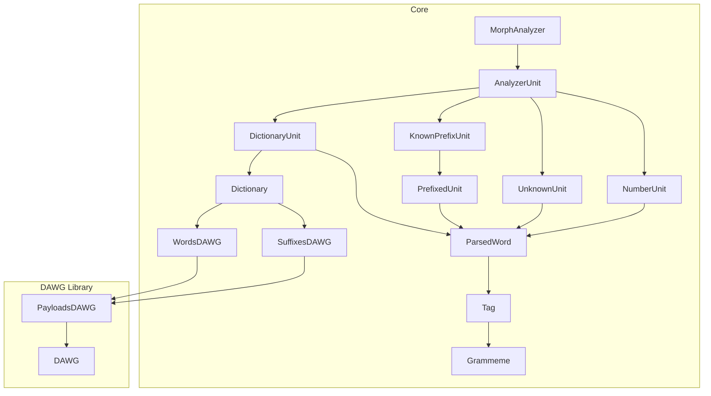
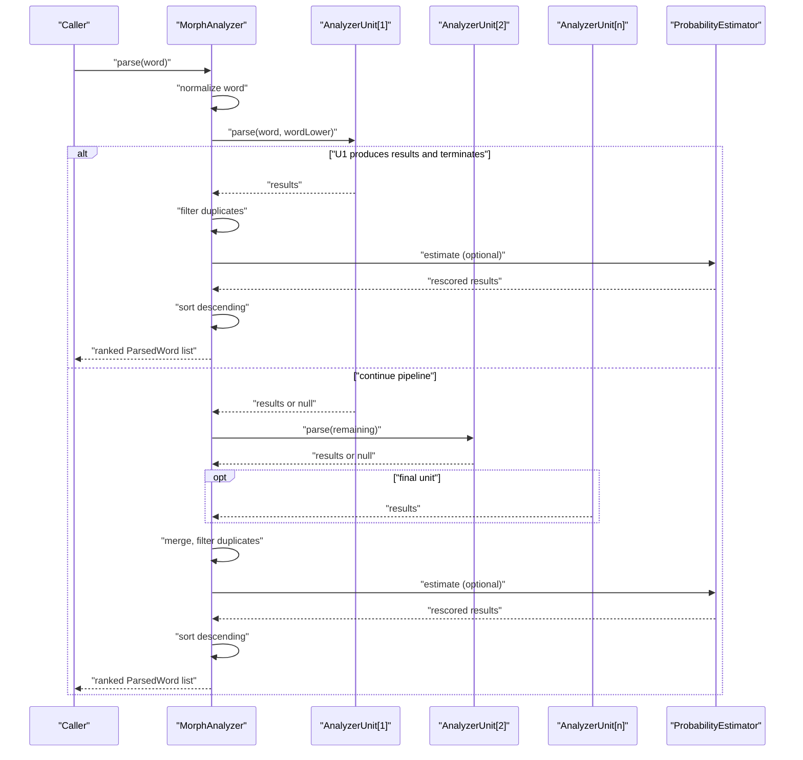
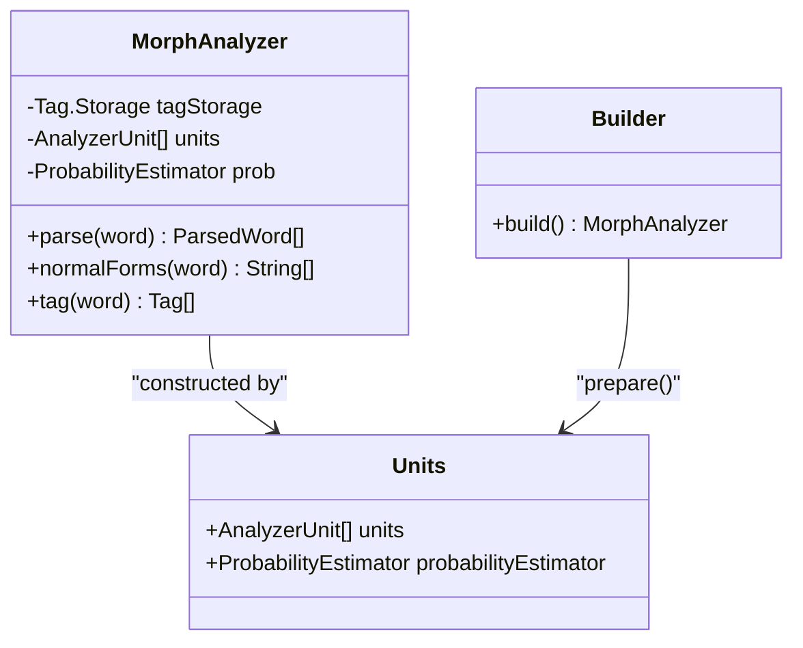
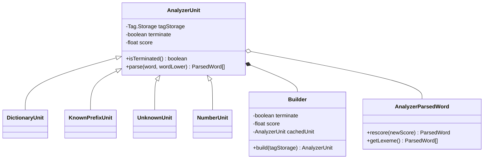
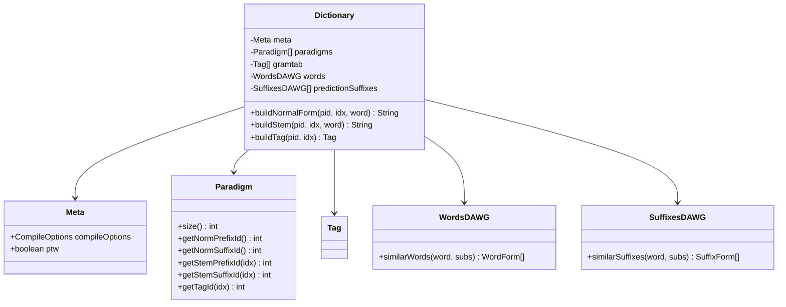
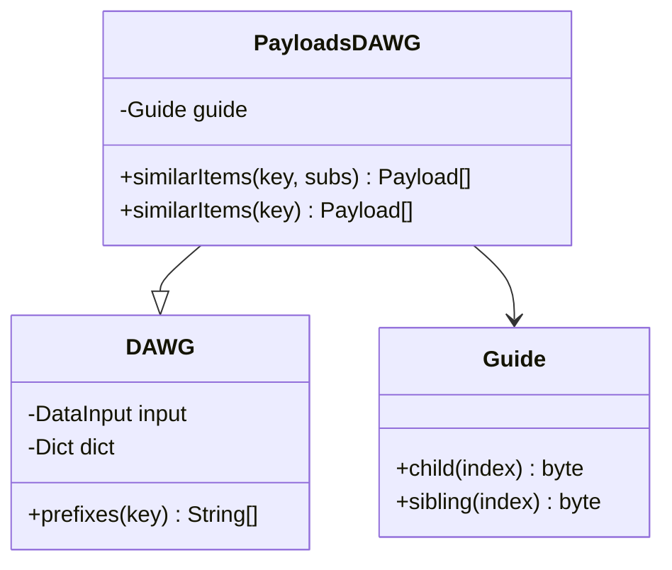
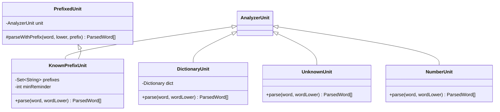
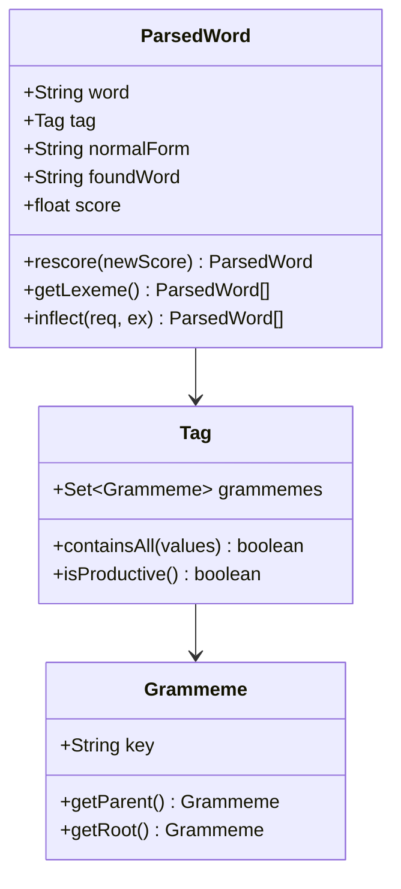
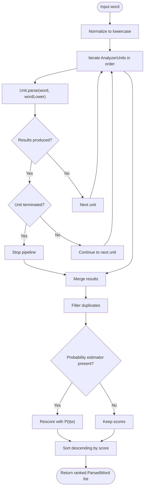
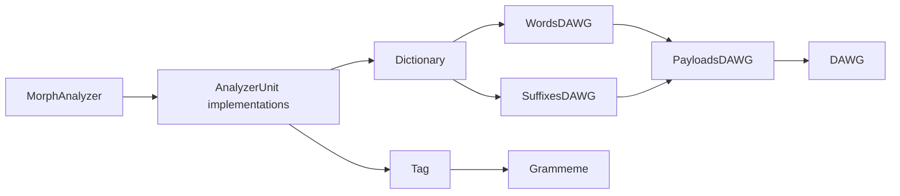

# Core Architecture

<cite>
**Referenced Files in This Document**
- [MorphAnalyzer.java](file://jmorphy2-core/src/main/java/company/evo/jmorphy2/MorphAnalyzer.java)
- [AnalyzerUnit.java](file://jmorphy2-core/src/main/java/company/evo/jmorphy2/units/AnalyzerUnit.java)
- [Dictionary.java](file://jmorphy2-core/src/main/java/company/evo/jmorphy2/Dictionary.java)
- [WordsDAWG.java](file://jmorphy2-core/src/main/java/company/evo/jmorphy2/WordsDAWG.java)
- [SuffixesDAWG.java](file://jmorphy2-core/src/main/java/company/evo/jmorphy2/SuffixesDAWG.java)
- [DictionaryUnit.java](file://jmorphy2-core/src/main/java/company/evo/jmorphy2/units/DictionaryUnit.java)
- [KnownPrefixUnit.java](file://jmorphy2-core/src/main/java/company/evo/jmorphy2/units/KnownPrefixUnit.java)
- [UnknownUnit.java](file://jmorphy2-core/src/main/java/company/evo/jmorphy2/units/UnknownUnit.java)
- [PrefixedUnit.java](file://jmorphy2-core/src/main/java/company/evo/jmorphy2/units/PrefixedUnit.java)
- [NumberUnit.java](file://jmorphy2-core/src/main/java/company/evo/jmorphy2/units/NumberUnit.java)
- [ParsedWord.java](file://jmorphy2-core/src/main/java/company/evo/jmorphy2/ParsedWord.java)
- [Tag.java](file://jmorphy2-core/src/main/java/company/evo/jmorphy2/Tag.java)
- [Grammeme.java](file://jmorphy2-core/src/main/java/company/evo/jmorphy2/Grammeme.java)
- [DAWG.java](file://dawg/src/main/java/company/evo/dawg/DAWG.java)
- [PayloadsDAWG.java](file://dawg/src/main/java/company/evo/dawg/PayloadsDAWG.java)
</cite>

## Table of Contents
1. [Introduction](#introduction)
2. [Project Structure](#project-structure)
3. [Core Components](#core-components)
4. [Architecture Overview](#architecture-overview)
5. [Detailed Component Analysis](#detailed-component-analysis)
6. [Dependency Analysis](#dependency-analysis)
7. [Performance Considerations](#performance-considerations)
8. [Troubleshooting Guide](#troubleshooting-guide)
9. [Conclusion](#conclusion)

## Introduction
This document describes the core architecture of Jmorphy2, focusing on the high-level design and component interactions. The MorphAnalyzer acts as the central orchestrator of the morphological analysis pipeline. It composes a configurable chain of AnalyzerUnit instances that implement specialized processing stages for different word types. The Dictionary system stores word forms and inflection paradigms in compressed DAWG structures, enabling efficient lookup and generation of related forms. The document explains the data flow from input words through the analyzer pipeline to final analysis results, and outlines the modular design that supports extensible unit types and custom processing pipelines.

## Project Structure
The core system resides primarily under jmorphy2-core/src/main/java/company/evo/jmorphy2, with shared DAWG infrastructure in dawg/src/main/java/company/evo/dawg. Key areas:
- Orchestrator and pipeline: MorphAnalyzer, AnalyzerUnit, and unit implementations
- Lexical data and paradigms: Dictionary, WordsDAWG, SuffixesDAWG
- Results and semantics: ParsedWord, Tag, Grammeme
- External integrations: Elasticsearch, Lucene, NLP modules (not analyzed here)

**Diagram sources**
- [MorphAnalyzer.java:15-247](file://jmorphy2-core/src/main/java/company/evo/jmorphy2/MorphAnalyzer.java#L15-L247)
- [AnalyzerUnit.java:11-72](file://jmorphy2-core/src/main/java/company/evo/jmorphy2/units/AnalyzerUnit.java#L11-L72)
- [DictionaryUnit.java:14-104](file://jmorphy2-core/src/main/java/company/evo/jmorphy2/units/DictionaryUnit.java#L14-L104)
- [KnownPrefixUnit.java:12-75](file://jmorphy2-core/src/main/java/company/evo/jmorphy2/units/KnownPrefixUnit.java#L12-L75)
- [UnknownUnit.java:9-34](file://jmorphy2-core/src/main/java/company/evo/jmorphy2/units/UnknownUnit.java#L9-L34)
- [PrefixedUnit.java:10-55](file://jmorphy2-core/src/main/java/company/evo/jmorphy2/units/PrefixedUnit.java#L10-L55)
- [NumberUnit.java:10-54](file://jmorphy2-core/src/main/java/company/evo/jmorphy2/units/NumberUnit.java#L10-L54)
- [Dictionary.java:12-302](file://jmorphy2-core/src/main/java/company/evo/jmorphy2/Dictionary.java#L12-L302)
- [WordsDAWG.java:13-57](file://jmorphy2-core/src/main/java/company/evo/jmorphy2/WordsDAWG.java#L13-L57)
- [SuffixesDAWG.java:13-61](file://jmorphy2-core/src/main/java/company/evo/jmorphy2/SuffixesDAWG.java#L13-L61)
- [ParsedWord.java:9-89](file://jmorphy2-core/src/main/java/company/evo/jmorphy2/ParsedWord.java#L9-L89)
- [Tag.java:7-230](file://jmorphy2-core/src/main/java/company/evo/jmorphy2/Tag.java#L7-L230)
- [Grammeme.java:7-86](file://jmorphy2-core/src/main/java/company/evo/jmorphy2/Grammeme.java#L7-L86)
- [DAWG.java:13-40](file://dawg/src/main/java/company/evo/dawg/DAWG.java#L13-L40)
- [PayloadsDAWG.java:14-242](file://dawg/src/main/java/company/evo/dawg/PayloadsDAWG.java#L14-L242)

**Section sources**
- [MorphAnalyzer.java:15-247](file://jmorphy2-core/src/main/java/company/evo/jmorphy2/MorphAnalyzer.java#L15-L247)
- [AnalyzerUnit.java:11-72](file://jmorphy2-core/src/main/java/company/evo/jmorphy2/units/AnalyzerUnit.java#L11-L72)
- [Dictionary.java:12-302](file://jmorphy2-core/src/main/java/company/evo/jmorphy2/Dictionary.java#L12-L302)
- [DAWG.java:13-40](file://dawg/src/main/java/company/evo/dawg/DAWG.java#L13-L40)
- [PayloadsDAWG.java:14-242](file://dawg/src/main/java/company/evo/dawg/PayloadsDAWG.java#L14-L242)

## Core Components
- MorphAnalyzer: Central orchestrator that builds and runs the analysis pipeline. It uses a builder pattern to configure units, probabilities, and tag storage. It applies deduplication, optional probability estimation, and sorting to produce ranked results.
- AnalyzerUnit: Abstract base for pipeline stages. Provides a builder pattern with caching and a parse method returning ParsedWord results. Includes internal subclasses for consistent result construction and scoring.
- Dictionary: Encapsulates dictionary metadata, paradigms, grammatical tags, and DAWG-backed word/suffix structures. Exposes builders to load from resource streams and helpers to construct normal forms and tags.
- DAWG Infrastructure: PayloadsDAWG and DAWG provide compressed, navigable trie structures with similarity search and payload decoding capabilities.

**Section sources**
- [MorphAnalyzer.java:15-247](file://jmorphy2-core/src/main/java/company/evo/jmorphy2/MorphAnalyzer.java#L15-L247)
- [AnalyzerUnit.java:11-72](file://jmorphy2-core/src/main/java/company/evo/jmorphy2/units/AnalyzerUnit.java#L11-L72)
- [Dictionary.java:12-302](file://jmorphy2-core/src/main/java/company/evo/jmorphy2/Dictionary.java#L12-L302)
- [PayloadsDAWG.java:14-242](file://dawg/src/main/java/company/evo/dawg/PayloadsDAWG.java#L14-L242)
- [DAWG.java:13-40](file://dawg/src/main/java/company/evo/dawg/DAWG.java#L13-L40)

## Architecture Overview
The analyzer pipeline is a staged composition of AnalyzerUnit instances. MorphAnalyzer constructs units via its builder, which can include DictionaryUnit, NumberUnit, PunctuationUnit, LatinUnit, KnownPrefixUnit, UnknownPrefixUnit, KnownSuffixUnit, and UnknownUnit. Each unit contributes candidate analyses; the pipeline stops early if a unit signals termination and yields results.

**Diagram sources**
- [MorphAnalyzer.java:178-200](file://jmorphy2-core/src/main/java/company/evo/jmorphy2/MorphAnalyzer.java#L178-L200)
- [AnalyzerUnit.java:46-46](file://jmorphy2-core/src/main/java/company/evo/jmorphy2/units/AnalyzerUnit.java#L46-L46)
- [MorphAnalyzer.java:202-232](file://jmorphy2-core/src/main/java/company/evo/jmorphy2/MorphAnalyzer.java#L202-L232)

## Detailed Component Analysis

### MorphAnalyzer: Orchestrator and Pipeline Coordinator
- Builder pattern configures units, tag storage, file loader, character substitutes, and probability estimator when applicable. It prepares a fixed-order pipeline tailored to the loaded dictionary’s language.
- parse(word) iterates units in order, aggregates results, and applies deduplication and optional probability re-ranking. Sorting is performed after scoring.
- Utility methods expose normal forms and tags derived from parsed results.

**Diagram sources**
- [MorphAnalyzer.java:15-125](file://jmorphy2-core/src/main/java/company/evo/jmorphy2/MorphAnalyzer.java#L15-L125)
- [MorphAnalyzer.java:107-115](file://jmorphy2-core/src/main/java/company/evo/jmorphy2/MorphAnalyzer.java#L107-L115)
- [MorphAnalyzer.java:101-104](file://jmorphy2-core/src/main/java/company/evo/jmorphy2/MorphAnalyzer.java#L101-L104)

**Section sources**
- [MorphAnalyzer.java:20-104](file://jmorphy2-core/src/main/java/company/evo/jmorphy2/MorphAnalyzer.java#L20-L104)
- [MorphAnalyzer.java:178-232](file://jmorphy2-core/src/main/java/company/evo/jmorphy2/MorphAnalyzer.java#L178-L232)

### AnalyzerUnit: Pipeline Stage Abstraction
- Abstract base defines lifecycle, termination flag, and scoring. The nested Builder caches constructed units and delegates construction to subclasses.
- Internal AnalyzerParsedWord ensures consistent result creation and rescore behavior.

**Diagram sources**
- [AnalyzerUnit.java:11-72](file://jmorphy2-core/src/main/java/company/evo/jmorphy2/units/AnalyzerUnit.java#L11-L72)

**Section sources**
- [AnalyzerUnit.java:11-72](file://jmorphy2-core/src/main/java/company/evo/jmorphy2/units/AnalyzerUnit.java#L11-L72)

### Dictionary and Paradigm-Based Storage
- Dictionary encapsulates metadata, paradigms, grammatical tag table, and DAWG structures for words and prediction suffixes. It exposes helpers to reconstruct normal forms and stems from paradigms.
- WordsDAWG and SuffixesDAWG extend PayloadsDAWG to decode stored payloads into word and suffix forms, enabling similarity search with character substitutions.

**Diagram sources**
- [Dictionary.java:12-302](file://jmorphy2-core/src/main/java/company/evo/jmorphy2/Dictionary.java#L12-L302)
- [WordsDAWG.java:13-57](file://jmorphy2-core/src/main/java/company/evo/jmorphy2/WordsDAWG.java#L13-L57)
- [SuffixesDAWG.java:13-61](file://jmorphy2-core/src/main/java/company/evo/jmorphy2/SuffixesDAWG.java#L13-L61)

**Section sources**
- [Dictionary.java:12-302](file://jmorphy2-core/src/main/java/company/evo/jmorphy2/Dictionary.java#L12-L302)
- [WordsDAWG.java:18-31](file://jmorphy2-core/src/main/java/company/evo/jmorphy2/WordsDAWG.java#L18-L31)
- [SuffixesDAWG.java:18-32](file://jmorphy2-core/src/main/java/company/evo/jmorphy2/SuffixesDAWG.java#L18-L32)

### DAWG Infrastructure: Compressed Trie Search
- DAWG provides traversal primitives for a compressed directed acyclic word graph.
- PayloadsDAWG adds payload decoding and similarity search with wildcard character substitution, supporting approximate matching during lookup.

**Diagram sources**
- [DAWG.java:13-40](file://dawg/src/main/java/company/evo/dawg/DAWG.java#L13-L40)
- [PayloadsDAWG.java:14-242](file://dawg/src/main/java/company/evo/dawg/PayloadsDAWG.java#L14-L242)

**Section sources**
- [DAWG.java:13-40](file://dawg/src/main/java/company/evo/dawg/DAWG.java#L13-L40)
- [PayloadsDAWG.java:42-93](file://dawg/src/main/java/company/evo/dawg/PayloadsDAWG.java#L42-L93)

### AnalyzerUnit Implementations and Pipelining
- DictionaryUnit: Performs dictionary lookup via WordsDAWG, constructs ParsedWord with paradigm-derived normal form and tag, and supports lexeme expansion.
- KnownPrefixUnit: Applies prefix stripping guided by a known prefix set, delegating inner parsing to another unit and filtering non-productive tags.
- UnknownUnit: Assigns an unknown tag to out-of-vocabulary tokens.
- NumberUnit: Recognizes numeric tokens and assigns appropriate tags.

**Diagram sources**
- [DictionaryUnit.java:14-104](file://jmorphy2-core/src/main/java/company/evo/jmorphy2/units/DictionaryUnit.java#L14-L104)
- [KnownPrefixUnit.java:12-75](file://jmorphy2-core/src/main/java/company/evo/jmorphy2/units/KnownPrefixUnit.java#L12-L75)
- [UnknownUnit.java:9-34](file://jmorphy2-core/src/main/java/company/evo/jmorphy2/units/UnknownUnit.java#L9-L34)
- [NumberUnit.java:10-54](file://jmorphy2-core/src/main/java/company/evo/jmorphy2/units/NumberUnit.java#L10-L54)
- [PrefixedUnit.java:10-55](file://jmorphy2-core/src/main/java/company/evo/jmorphy2/units/PrefixedUnit.java#L10-L55)

**Section sources**
- [DictionaryUnit.java:56-65](file://jmorphy2-core/src/main/java/company/evo/jmorphy2/units/DictionaryUnit.java#L56-L65)
- [KnownPrefixUnit.java:62-73](file://jmorphy2-core/src/main/java/company/evo/jmorphy2/units/KnownPrefixUnit.java#L62-L73)
- [UnknownUnit.java:27-32](file://jmorphy2-core/src/main/java/company/evo/jmorphy2/units/UnknownUnit.java#L27-L32)
- [NumberUnit.java:31-52](file://jmorphy2-core/src/main/java/company/evo/jmorphy2/units/NumberUnit.java#L31-L52)
- [PrefixedUnit.java:18-28](file://jmorphy2-core/src/main/java/company/evo/jmorphy2/units/PrefixedUnit.java#L18-L28)

### Data Model: Results and Semantics
- ParsedWord: Immutable result with original word, normalized form, found word, tag, and score. Supports rescore, lexeme extraction, and filtering by grammemes.
- Tag and Grammeme: Hierarchical grammatical descriptors with storage-managed normalization and lookup. Tags expose containment checks and productivity classification.

**Diagram sources**
- [ParsedWord.java:9-89](file://jmorphy2-core/src/main/java/company/evo/jmorphy2/ParsedWord.java#L9-L89)
- [Tag.java:7-230](file://jmorphy2-core/src/main/java/company/evo/jmorphy2/Tag.java#L7-L230)
- [Grammeme.java:7-86](file://jmorphy2-core/src/main/java/company/evo/jmorphy2/Grammeme.java#L7-L86)

**Section sources**
- [ParsedWord.java:18-43](file://jmorphy2-core/src/main/java/company/evo/jmorphy2/ParsedWord.java#L18-L43)
- [Tag.java:41-139](file://jmorphy2-core/src/main/java/company/evo/jmorphy2/Tag.java#L41-L139)
- [Grammeme.java:16-60](file://jmorphy2-core/src/main/java/company/evo/jmorphy2/Grammeme.java#L16-L60)

### Pipeline Flow: From Input to Analysis

**Diagram sources**
- [MorphAnalyzer.java:178-200](file://jmorphy2-core/src/main/java/company/evo/jmorphy2/MorphAnalyzer.java#L178-L200)
- [MorphAnalyzer.java:202-232](file://jmorphy2-core/src/main/java/company/evo/jmorphy2/MorphAnalyzer.java#L202-L232)
- [AnalyzerUnit.java:42-44](file://jmorphy2-core/src/main/java/company/evo/jmorphy2/units/AnalyzerUnit.java#L42-L44)

## Dependency Analysis
- MorphAnalyzer depends on AnalyzerUnit implementations and optional ProbabilityEstimator. It orchestrates the pipeline but does not directly depend on Dictionary internals.
- AnalyzerUnit implementations depend on Dictionary and DAWG structures for lookup and generation of forms.
- Dictionary depends on DAWG structures for compressed storage and on Tag storage for grammatical semantics.
- DAWG library provides low-level trie traversal and payload decoding.

**Diagram sources**
- [MorphAnalyzer.java:15-247](file://jmorphy2-core/src/main/java/company/evo/jmorphy2/MorphAnalyzer.java#L15-L247)
- [AnalyzerUnit.java:11-72](file://jmorphy2-core/src/main/java/company/evo/jmorphy2/units/AnalyzerUnit.java#L11-L72)
- [Dictionary.java:12-302](file://jmorphy2-core/src/main/java/company/evo/jmorphy2/Dictionary.java#L12-L302)
- [WordsDAWG.java:13-57](file://jmorphy2-core/src/main/java/company/evo/jmorphy2/WordsDAWG.java#L13-L57)
- [SuffixesDAWG.java:13-61](file://jmorphy2-core/src/main/java/company/evo/jmorphy2/SuffixesDAWG.java#L13-L61)
- [PayloadsDAWG.java:14-242](file://dawg/src/main/java/company/evo/dawg/PayloadsDAWG.java#L14-L242)
- [DAWG.java:13-40](file://dawg/src/main/java/company/evo/dawg/DAWG.java#L13-L40)
- [Tag.java:7-230](file://jmorphy2-core/src/main/java/company/evo/jmorphy2/Tag.java#L7-L230)
- [Grammeme.java:7-86](file://jmorphy2-core/src/main/java/company/evo/jmorphy2/Grammeme.java#L7-L86)

**Section sources**
- [MorphAnalyzer.java:15-247](file://jmorphy2-core/src/main/java/company/evo/jmorphy2/MorphAnalyzer.java#L15-L247)
- [Dictionary.java:12-302](file://jmorphy2-core/src/main/java/company/evo/jmorphy2/Dictionary.java#L12-L302)

## Performance Considerations
- Pipeline short-circuiting: Units marked as terminated halt further processing when yielding results, reducing unnecessary computation.
- Caching: AnalyzerUnit.Builder caches constructed units to avoid repeated initialization overhead.
- DAWG similarity search: PayloadsDAWG supports approximate matching with character substitutions, trading accuracy for coverage in noisy inputs.
- Deduplication and scoring: Post-processing filters duplicate semantic analyses and optionally rescores using dictionary-derived probabilities to improve ranking quality.

[No sources needed since this section provides general guidance]

## Troubleshooting Guide
- Unexpected empty results: Verify the pipeline order and termination flags. Some units may not match certain inputs; ensure UnknownUnit is included as a fallback.
- Incorrect tags or missing grammemes: Confirm Tag storage initialization via dictionary grammeme loading and that Tag normalization aligns with expected grammeme keys.
- Poor ranking: Probability estimation requires dictionary metadata indicating P(t|w) availability; confirm dictionary meta flags and enable estimator accordingly.
- Prefix handling: KnownPrefixUnit requires a non-empty prefix set; ensure language-specific known prefixes are loaded and minReminder is appropriate.

**Section sources**
- [MorphAnalyzer.java:191-194](file://jmorphy2-core/src/main/java/company/evo/jmorphy2/MorphAnalyzer.java#L191-L194)
- [AnalyzerUnit.java:28-33](file://jmorphy2-core/src/main/java/company/evo/jmorphy2/units/AnalyzerUnit.java#L28-L33)
- [Dictionary.java:254-259](file://jmorphy2-core/src/main/java/company/evo/jmorphy2/Dictionary.java#L254-L259)
- [KnownPrefixUnit.java:76-76](file://jmorphy2-core/src/main/java/company/evo/jmorphy2/units/KnownPrefixUnit.java#L76-L76)

## Conclusion
Jmorphy2’s core architecture centers on a flexible, modular pipeline orchestrated by MorphAnalyzer. AnalyzerUnit implementations encapsulate specialized processing, while Dictionary and DAWG structures deliver efficient, compressed lexical data. The builder-driven configuration enables language-aware defaults and easy customization. The separation of concerns between morphological analysis (units and dictionaries) and language-specific processing (via tag semantics) allows extensibility and maintainability across languages and downstream applications.