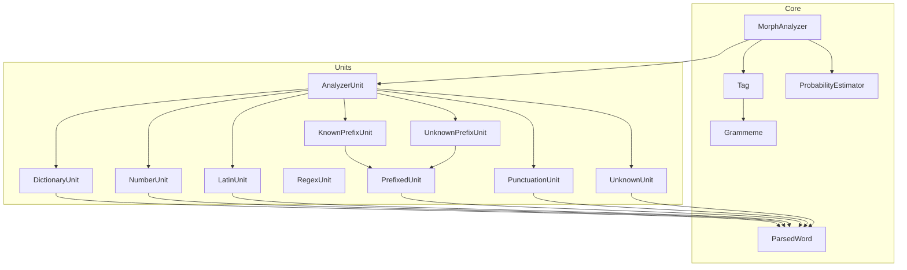
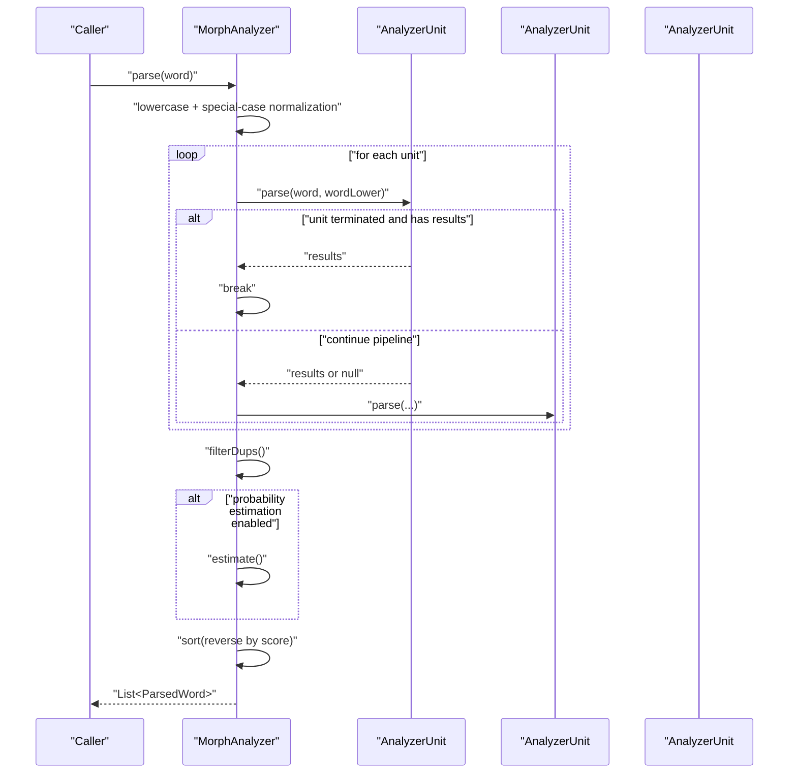
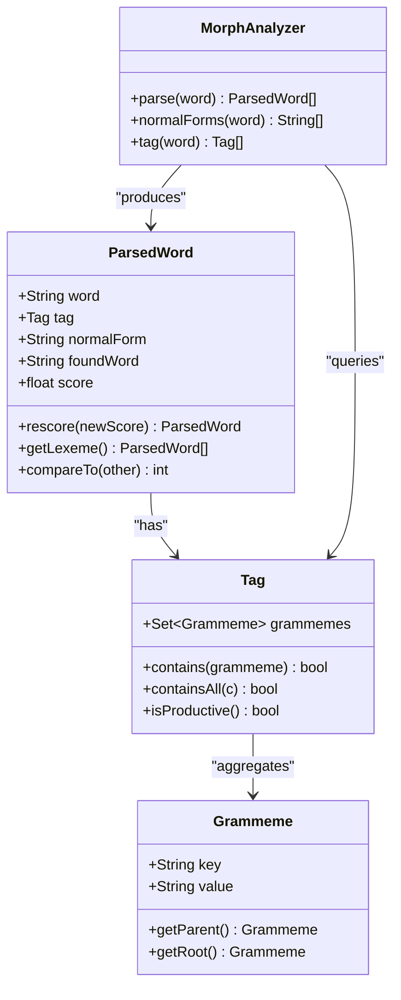
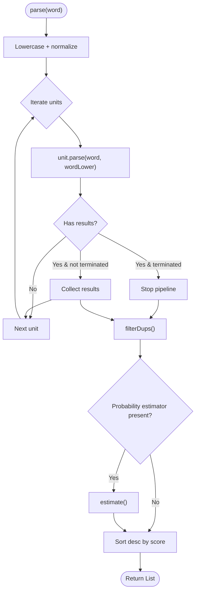
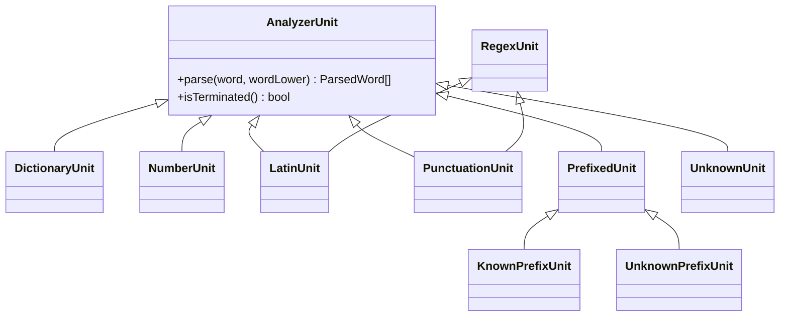
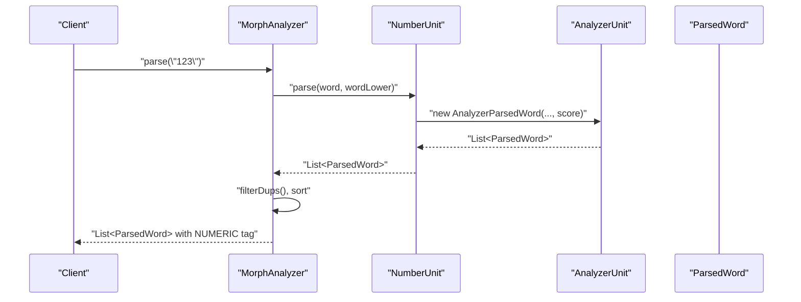
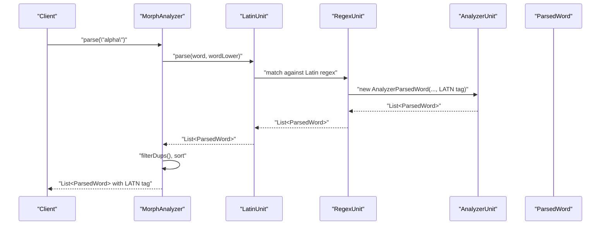
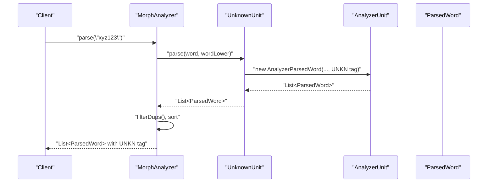
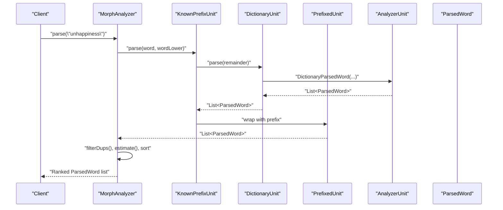
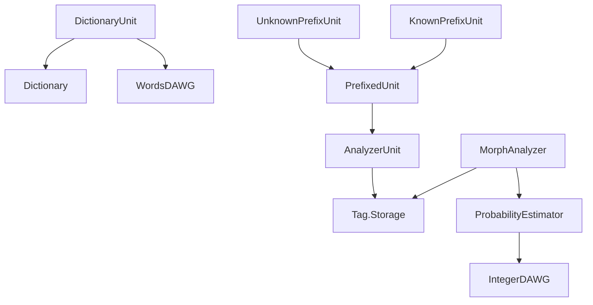

# Data Flow and Processing Patterns

<cite>
**Referenced Files in This Document**
- [MorphAnalyzer.java](file://jmorphy2-core/src/main/java/company/evo/jmorphy2/MorphAnalyzer.java)
- [ParsedWord.java](file://jmorphy2-core/src/main/java/company/evo/jmorphy2/ParsedWord.java)
- [Tag.java](file://jmorphy2-core/src/main/java/company/evo/jmorphy2/Tag.java)
- [Grammeme.java](file://jmorphy2-core/src/main/java/company/evo/jmorphy2/Grammeme.java)
- [ProbabilityEstimator.java](file://jmorphy2-core/src/main/java/company/evo/jmorphy2/ProbabilityEstimator.java)
- [AnalyzerUnit.java](file://jmorphy2-core/src/main/java/company/evo/jmorphy2/units/AnalyzerUnit.java)
- [DictionaryUnit.java](file://jmorphy2-core/src/main/java/company/evo/jmorphy2/units/DictionaryUnit.java)
- [UnknownUnit.java](file://jmorphy2-core/src/main/java/company/evo/jmorphy2/units/UnknownUnit.java)
- [NumberUnit.java](file://jmorphy2-core/src/main/java/company/evo/jmorphy2/units/NumberUnit.java)
- [LatinUnit.java](file://jmorphy2-core/src/main/java/company/evo/jmorphy2/units/LatinUnit.java)
- [RegexUnit.java](file://jmorphy2-core/src/main/java/company/evo/jmorphy2/units/RegexUnit.java)
- [PrefixedUnit.java](file://jmorphy2-core/src/main/java/company/evo/jmorphy2/units/PrefixedUnit.java)
- [KnownPrefixUnit.java](file://jmorphy2-core/src/main/java/company/evo/jmorphy2/units/KnownPrefixUnit.java)
- [UnknownPrefixUnit.java](file://jmorphy2-core/src/main/java/company/evo/jmorphy2/units/UnknownPrefixUnit.java)
- [PunctuationUnit.java](file://jmorphy2-core/src/main/java/company/evo/jmorphy2/units/PunctuationUnit.java)
</cite>

## Table of Contents
1. [Introduction](#introduction)
2. [Project Structure](#project-structure)
3. [Core Components](#core-components)
4. [Architecture Overview](#architecture-overview)
5. [Detailed Component Analysis](#detailed-component-analysis)
6. [Dependency Analysis](#dependency-analysis)
7. [Performance Considerations](#performance-considerations)
8. [Troubleshooting Guide](#troubleshooting-guide)
9. [Conclusion](#conclusion)

## Introduction
This document explains the data flow and processing pipeline of the morphological analyzer. It traces how raw input words are transformed through a staged pipeline of AnalyzerUnits to produce ranked ParsedWord results enriched with Tag and Grammeme metadata. The pipeline includes input preprocessing, unit pipeline execution, duplicate filtering, optional probability estimation, and final ranking. The data models involved are String inputs, intermediate AnalyzerUnit-produced ParsedWord instances, Tag objects representing grammatical categories, and Grammeme objects encoding linguistic features.

## Project Structure
The morphological analysis system is centered around a core analyzer and a set of pluggable AnalyzerUnits. The analyzer composes a chain of units, each responsible for recognizing specific word types or patterns. Supporting classes model grammatical tags and grammemes, and optional probability estimation refines scores.

**Diagram sources**
- [MorphAnalyzer.java:15-247](file://jmorphy2-core/src/main/java/company/evo/jmorphy2/MorphAnalyzer.java#L15-L247)
- [AnalyzerUnit.java:11-72](file://jmorphy2-core/src/main/java/company/evo/jmorphy2/units/AnalyzerUnit.java#L11-L72)
- [DictionaryUnit.java:14-104](file://jmorphy2-core/src/main/java/company/evo/jmorphy2/units/DictionaryUnit.java#L14-L104)
- [NumberUnit.java:10-54](file://jmorphy2-core/src/main/java/company/evo/jmorphy2/units/NumberUnit.java#L10-L54)
- [LatinUnit.java:8-28](file://jmorphy2-core/src/main/java/company/evo/jmorphy2/units/LatinUnit.java#L8-L28)
- [KnownPrefixUnit.java:12-75](file://jmorphy2-core/src/main/java/company/evo/jmorphy2/units/KnownPrefixUnit.java#L12-L75)
- [UnknownPrefixUnit.java:11-75](file://jmorphy2-core/src/main/java/company/evo/jmorphy2/units/UnknownPrefixUnit.java#L11-L75)
- [RegexUnit.java:11-31](file://jmorphy2-core/src/main/java/company/evo/jmorphy2/units/RegexUnit.java#L11-L31)
- [PrefixedUnit.java:10-55](file://jmorphy2-core/src/main/java/company/evo/jmorphy2/units/PrefixedUnit.java#L10-L55)
- [UnknownUnit.java:9-34](file://jmorphy2-core/src/main/java/company/evo/jmorphy2/units/UnknownUnit.java#L9-L34)
- [PunctuationUnit.java:8-28](file://jmorphy2-core/src/main/java/company/evo/jmorphy2/units/PunctuationUnit.java#L8-L28)
- [ParsedWord.java:9-89](file://jmorphy2-core/src/main/java/company/evo/jmorphy2/ParsedWord.java#L9-L89)
- [Tag.java:7-230](file://jmorphy2-core/src/main/java/company/evo/jmorphy2/Tag.java#L7-L230)
- [Grammeme.java:7-86](file://jmorphy2-core/src/main/java/company/evo/jmorphy2/Grammeme.java#L7-L86)
- [ProbabilityEstimator.java:9-27](file://jmorphy2-core/src/main/java/company/evo/jmorphy2/ProbabilityEstimator.java#L9-L27)

**Section sources**
- [MorphAnalyzer.java:15-247](file://jmorphy2-core/src/main/java/company/evo/jmorphy2/MorphAnalyzer.java#L15-L247)
- [AnalyzerUnit.java:11-72](file://jmorphy2-core/src/main/java/company/evo/jmorphy2/units/AnalyzerUnit.java#L11-L72)

## Core Components
- MorphAnalyzer orchestrates parsing, applies duplicate filtering, optional probability estimation, and sorts results by score.
- AnalyzerUnit defines the contract for parsing a word into zero or more ParsedWord candidates, with termination semantics.
- ParsedWord carries the analyzed form, Tag, normal form, the matched dictionary/regex word, and a score.
- Tag encapsulates grammatical categories and provides containment checks; it aggregates Grammeme instances.
- Grammeme represents a single linguistic feature with hierarchical parent/root relationships.
- ProbabilityEstimator optionally reweights candidate scores using precomputed word-tag probabilities.

**Section sources**
- [MorphAnalyzer.java:178-247](file://jmorphy2-core/src/main/java/company/evo/jmorphy2/MorphAnalyzer.java#L178-L247)
- [AnalyzerUnit.java:46-72](file://jmorphy2-core/src/main/java/company/evo/jmorphy2/units/AnalyzerUnit.java#L46-L72)
- [ParsedWord.java:9-89](file://jmorphy2-core/src/main/java/company/evo/jmorphy2/ParsedWord.java#L9-L89)
- [Tag.java:27-159](file://jmorphy2-core/src/main/java/company/evo/jmorphy2/Tag.java#L27-L159)
- [Grammeme.java:7-86](file://jmorphy2-core/src/main/java/company/evo/jmorphy2/Grammeme.java#L7-L86)
- [ProbabilityEstimator.java:9-27](file://jmorphy2-core/src/main/java/company/evo/jmorphy2/ProbabilityEstimator.java#L9-L27)

## Architecture Overview
The analyzer builds a pipeline of AnalyzerUnits configured for the detected language. Each unit contributes candidate analyses. The pipeline short-circuits when a unit declares itself “terminated” and has produced results. After collecting candidates, duplicates are removed, optional probability estimation is applied, and results are sorted descending by score.

**Diagram sources**
- [MorphAnalyzer.java:178-200](file://jmorphy2-core/src/main/java/company/evo/jmorphy2/MorphAnalyzer.java#L178-L200)
- [MorphAnalyzer.java:234-245](file://jmorphy2-core/src/main/java/company/evo/jmorphy2/MorphAnalyzer.java#L234-L245)
- [MorphAnalyzer.java:202-232](file://jmorphy2-core/src/main/java/company/evo/jmorphy2/MorphAnalyzer.java#L202-L232)
- [AnalyzerUnit.java:46](file://jmorphy2-core/src/main/java/company/evo/jmorphy2/units/AnalyzerUnit.java#L46)

## Detailed Component Analysis

### Data Models and Relationships
The core data model hierarchy connects String inputs to grammatical analysis results.

**Diagram sources**
- [ParsedWord.java:9-89](file://jmorphy2-core/src/main/java/company/evo/jmorphy2/ParsedWord.java#L9-L89)
- [Tag.java:27-159](file://jmorphy2-core/src/main/java/company/evo/jmorphy2/Tag.java#L27-L159)
- [Grammeme.java:7-86](file://jmorphy2-core/src/main/java/company/evo/jmorphy2/Grammeme.java#L7-L86)
- [MorphAnalyzer.java:178-200](file://jmorphy2-core/src/main/java/company/evo/jmorphy2/MorphAnalyzer.java#L178-L200)

**Section sources**
- [ParsedWord.java:9-89](file://jmorphy2-core/src/main/java/company/evo/jmorphy2/ParsedWord.java#L9-L89)
- [Tag.java:27-159](file://jmorphy2-core/src/main/java/company/evo/jmorphy2/Tag.java#L27-L159)
- [Grammeme.java:7-86](file://jmorphy2-core/src/main/java/company/evo/jmorphy2/Grammeme.java#L7-L86)

### Processing Pipeline Stages
- Input preprocessing: Lowercasing and special-case normalization are applied before pipeline execution.
- Unit pipeline execution: Units are invoked in order; results are concatenated. If a unit is marked terminated and has results, the pipeline stops early.
- Duplicate filtering: Removes equivalent analyses by Tag and normalForm.
- Probability estimation: Optionally reweights scores using word-tag probabilities; otherwise preserves original scores.
- Ranking: Results are sorted in descending order by score.

**Diagram sources**
- [MorphAnalyzer.java:178-200](file://jmorphy2-core/src/main/java/company/evo/jmorphy2/MorphAnalyzer.java#L178-L200)
- [MorphAnalyzer.java:234-245](file://jmorphy2-core/src/main/java/company/evo/jmorphy2/MorphAnalyzer.java#L234-L245)
- [MorphAnalyzer.java:202-232](file://jmorphy2-core/src/main/java/company/evo/jmorphy2/MorphAnalyzer.java#L202-L232)

**Section sources**
- [MorphAnalyzer.java:178-247](file://jmorphy2-core/src/main/java/company/evo/jmorphy2/MorphAnalyzer.java#L178-L247)

### AnalyzerUnit Types and Their Roles
- DictionaryUnit: Looks up similar words in the dictionary, constructs normal forms and Tags, and produces candidates with initial scores.
- NumberUnit: Recognizes numeric tokens and assigns NUMERIC tags.
- LatinUnit: Recognizes Latin-character sequences via RegexUnit and tags them accordingly.
- PunctuationUnit: Recognizes punctuation sequences via RegexUnit.
- KnownPrefixUnit and UnknownPrefixUnit: Apply known or trial prefixes to base analyses produced by another unit; filter out non-productive tags.
- UnknownUnit: Assigns an UNKNOWN tag to unanalyzable tokens.

**Diagram sources**
- [AnalyzerUnit.java:11-72](file://jmorphy2-core/src/main/java/company/evo/jmorphy2/units/AnalyzerUnit.java#L11-L72)
- [DictionaryUnit.java:14-104](file://jmorphy2-core/src/main/java/company/evo/jmorphy2/units/DictionaryUnit.java#L14-L104)
- [NumberUnit.java:10-54](file://jmorphy2-core/src/main/java/company/evo/jmorphy2/units/NumberUnit.java#L10-L54)
- [LatinUnit.java:8-28](file://jmorphy2-core/src/main/java/company/evo/jmorphy2/units/LatinUnit.java#L8-L28)
- [PunctuationUnit.java:8-28](file://jmorphy2-core/src/main/java/company/evo/jmorphy2/units/PunctuationUnit.java#L8-L28)
- [RegexUnit.java:11-31](file://jmorphy2-core/src/main/java/company/evo/jmorphy2/units/RegexUnit.java#L11-L31)
- [PrefixedUnit.java:10-55](file://jmorphy2-core/src/main/java/company/evo/jmorphy2/units/PrefixedUnit.java#L10-L55)
- [KnownPrefixUnit.java:12-75](file://jmorphy2-core/src/main/java/company/evo/jmorphy2/units/KnownPrefixUnit.java#L12-L75)
- [UnknownPrefixUnit.java:11-75](file://jmorphy2-core/src/main/java/company/evo/jmorphy2/units/UnknownPrefixUnit.java#L11-L75)
- [UnknownUnit.java:9-34](file://jmorphy2-core/src/main/java/company/evo/jmorphy2/units/UnknownUnit.java#L9-L34)

**Section sources**
- [DictionaryUnit.java:56-104](file://jmorphy2-core/src/main/java/company/evo/jmorphy2/units/DictionaryUnit.java#L56-L104)
- [NumberUnit.java:31-54](file://jmorphy2-core/src/main/java/company/evo/jmorphy2/units/NumberUnit.java#L31-L54)
- [LatinUnit.java:8-28](file://jmorphy2-core/src/main/java/company/evo/jmorphy2/units/LatinUnit.java#L8-L28)
- [PunctuationUnit.java:8-28](file://jmorphy2-core/src/main/java/company/evo/jmorphy2/units/PunctuationUnit.java#L8-L28)
- [RegexUnit.java:21-31](file://jmorphy2-core/src/main/java/company/evo/jmorphy2/units/RegexUnit.java#L21-L31)
- [PrefixedUnit.java:18-55](file://jmorphy2-core/src/main/java/company/evo/jmorphy2/units/PrefixedUnit.java#L18-L55)
- [KnownPrefixUnit.java:62-75](file://jmorphy2-core/src/main/java/company/evo/jmorphy2/units/KnownPrefixUnit.java#L62-L75)
- [UnknownPrefixUnit.java:64-75](file://jmorphy2-core/src/main/java/company/evo/jmorphy2/units/UnknownPrefixUnit.java#L64-L75)
- [UnknownUnit.java:27-34](file://jmorphy2-core/src/main/java/company/evo/jmorphy2/units/UnknownUnit.java#L27-L34)

### Example Processing Flows

#### Numeric Token

**Diagram sources**
- [NumberUnit.java:31-54](file://jmorphy2-core/src/main/java/company/evo/jmorphy2/units/NumberUnit.java#L31-L54)
- [AnalyzerUnit.java:48-71](file://jmorphy2-core/src/main/java/company/evo/jmorphy2/units/AnalyzerUnit.java#L48-L71)
- [MorphAnalyzer.java:178-200](file://jmorphy2-core/src/main/java/company/evo/jmorphy2/MorphAnalyzer.java#L178-L200)

#### Latin Word

**Diagram sources**
- [LatinUnit.java:8-28](file://jmorphy2-core/src/main/java/company/evo/jmorphy2/units/LatinUnit.java#L8-L28)
- [RegexUnit.java:21-31](file://jmorphy2-core/src/main/java/company/evo/jmorphy2/units/RegexUnit.java#L21-L31)
- [AnalyzerUnit.java:48-71](file://jmorphy2-core/src/main/java/company/evo/jmorphy2/units/AnalyzerUnit.java#L48-L71)
- [MorphAnalyzer.java:178-200](file://jmorphy2-core/src/main/java/company/evo/jmorphy2/MorphAnalyzer.java#L178-L200)

#### Unknown Word

**Diagram sources**
- [UnknownUnit.java:27-34](file://jmorphy2-core/src/main/java/company/evo/jmorphy2/units/UnknownUnit.java#L27-L34)
- [AnalyzerUnit.java:48-71](file://jmorphy2-core/src/main/java/company/evo/jmorphy2/units/AnalyzerUnit.java#L48-L71)
- [MorphAnalyzer.java:178-200](file://jmorphy2-core/src/main/java/company/evo/jmorphy2/MorphAnalyzer.java#L178-L200)

#### Dictionary Lookup with Prefixes

**Diagram sources**
- [KnownPrefixUnit.java:62-75](file://jmorphy2-core/src/main/java/company/evo/jmorphy2/units/KnownPrefixUnit.java#L62-L75)
- [DictionaryUnit.java:56-104](file://jmorphy2-core/src/main/java/company/evo/jmorphy2/units/DictionaryUnit.java#L56-L104)
- [PrefixedUnit.java:18-55](file://jmorphy2-core/src/main/java/company/evo/jmorphy2/units/PrefixedUnit.java#L18-L55)
- [AnalyzerUnit.java:48-71](file://jmorphy2-core/src/main/java/company/evo/jmorphy2/units/AnalyzerUnit.java#L48-L71)
- [MorphAnalyzer.java:178-200](file://jmorphy2-core/src/main/java/company/evo/jmorphy2/MorphAnalyzer.java#L178-L200)

## Dependency Analysis
- MorphAnalyzer depends on Tag.Storage for grammatical metadata and ProbabilityEstimator when enabled.
- AnalyzerUnit implementations depend on Tag.Storage to construct Tag and Grammeme instances.
- DictionaryUnit depends on Dictionary and WordsDAWG to retrieve paradigm and wordform data.
- PrefixedUnit composes another AnalyzerUnit and augments its results with prefix information.
- ProbabilityEstimator depends on a DAWG-backed integer dictionary for probability lookups.

**Diagram sources**
- [MorphAnalyzer.java:16-247](file://jmorphy2-core/src/main/java/company/evo/jmorphy2/MorphAnalyzer.java#L16-L247)
- [DictionaryUnit.java:14-104](file://jmorphy2-core/src/main/java/company/evo/jmorphy2/units/DictionaryUnit.java#L14-L104)
- [PrefixedUnit.java:10-55](file://jmorphy2-core/src/main/java/company/evo/jmorphy2/units/PrefixedUnit.java#L10-L55)
- [ProbabilityEstimator.java:9-27](file://jmorphy2-core/src/main/java/company/evo/jmorphy2/ProbabilityEstimator.java#L9-L27)

**Section sources**
- [MorphAnalyzer.java:16-247](file://jmorphy2-core/src/main/java/company/evo/jmorphy2/MorphAnalyzer.java#L16-L247)
- [DictionaryUnit.java:14-104](file://jmorphy2-core/src/main/java/company/evo/jmorphy2/units/DictionaryUnit.java#L14-L104)
- [PrefixedUnit.java:10-55](file://jmorphy2-core/src/main/java/company/evo/jmorphy2/units/PrefixedUnit.java#L10-L55)
- [ProbabilityEstimator.java:9-27](file://jmorphy2-core/src/main/java/company/evo/jmorphy2/ProbabilityEstimator.java#L9-L27)

## Performance Considerations
- Pipeline short-circuiting: Units marked terminated reduce total work when applicable.
- Duplicate filtering: Prevents redundant analyses and reduces downstream processing.
- Score normalization: When probability estimation is disabled, scores remain unchanged; when enabled, normalization ensures consistent weighting across diverse units.
- Regex-based units avoid heavy computation for simple pattern matching.
- Prefix scanning bounds: KnownPrefixUnit and UnknownPrefixUnit limit prefix length and minimum remainder to control combinatorial growth.

[No sources needed since this section provides general guidance]

## Troubleshooting Guide
- Unexpected empty results: Verify that the dictionary is loaded and language-specific known prefixes are configured. Confirm that at least one unit can match the input.
- Incorrect tags or missing grammemes: Inspect Tag.Storage initialization and ensure resource loading succeeded.
- Poor ranking for unknown words: UnknownUnit assigns a generic tag; consider enabling probability estimation if available.
- Non-productive tags filtered out: PrefixedUnit excludes non-productive analyses; adjust prefix scanning parameters if legitimate forms are being dropped.
- Performance regressions: Review unit ordering and termination flags; ensure probability estimation is only enabled when needed.

**Section sources**
- [MorphAnalyzer.java:178-247](file://jmorphy2-core/src/main/java/company/evo/jmorphy2/MorphAnalyzer.java#L178-L247)
- [PrefixedUnit.java:22-28](file://jmorphy2-core/src/main/java/company/evo/jmorphy2/units/PrefixedUnit.java#L22-L28)
- [ProbabilityEstimator.java:9-27](file://jmorphy2-core/src/main/java/company/evo/jmorphy2/ProbabilityEstimator.java#L9-L27)

## Conclusion
The morphological analyzer implements a modular, extensible pipeline that transforms raw text into rich morphological analyses. By composing AnalyzerUnits, applying deduplication and optional probability estimation, and ranking results, it delivers accurate and efficient analysis outcomes. The Tag and Grammeme models provide a structured representation of grammatical information, while ParsedWord consolidates all analysis artifacts for downstream consumers.