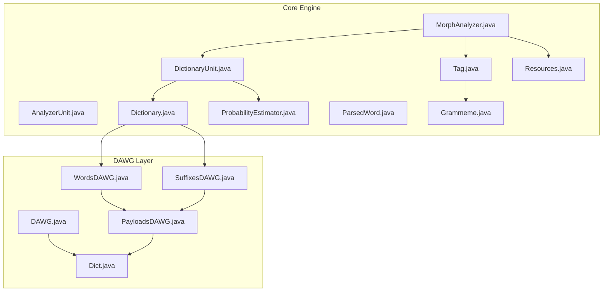
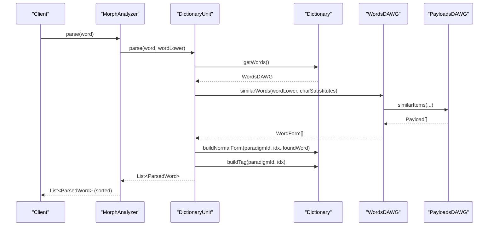
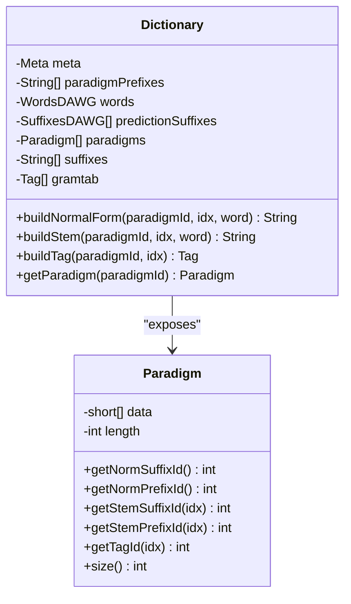
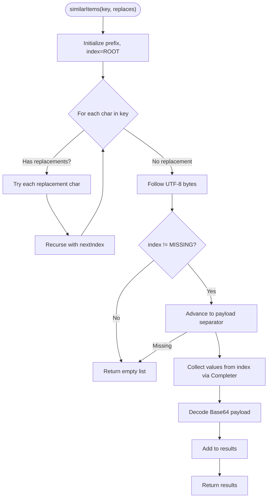
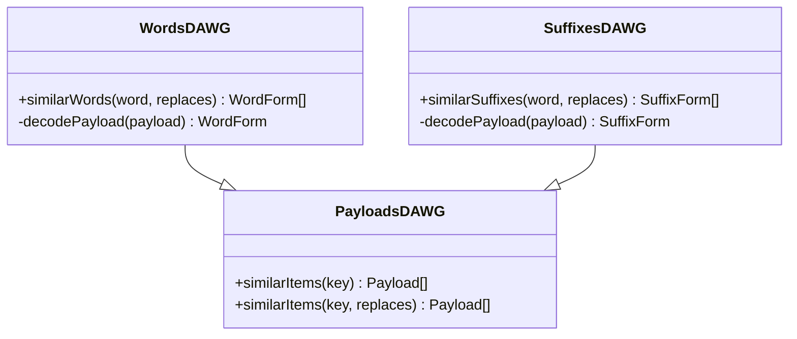
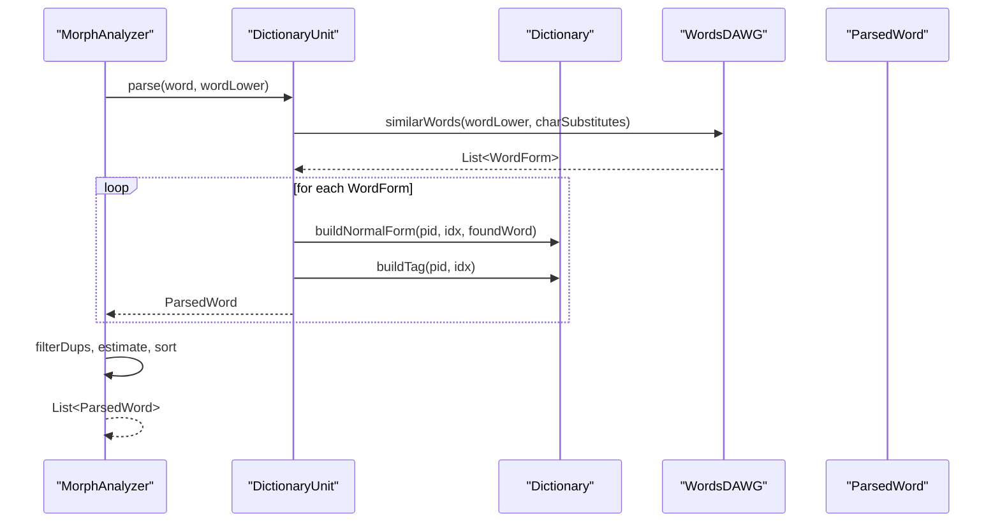
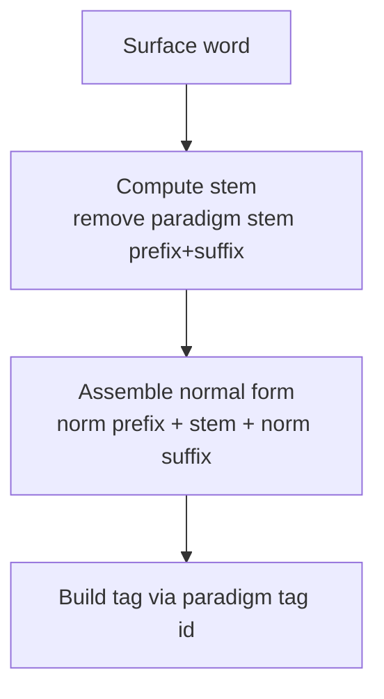
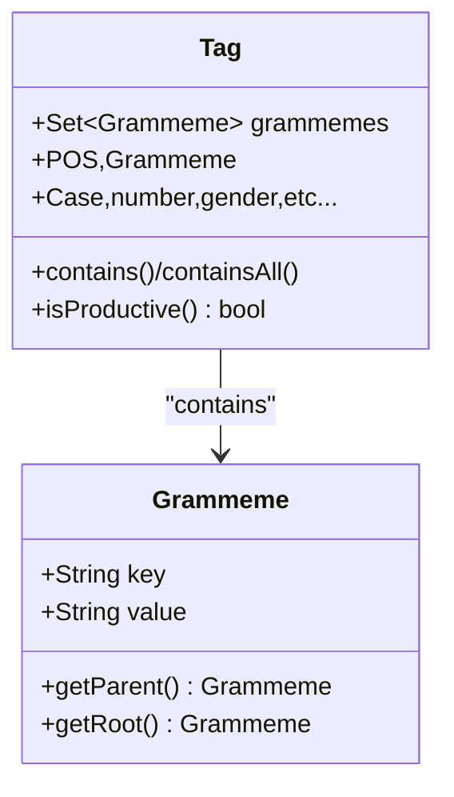
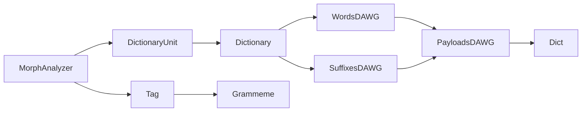

# Dictionary Management System

<cite>
**Referenced Files in This Document**
- [Dictionary.java](file://jmorphy2-core/src/main/java/company/evo/jmorphy2/Dictionary.java)
- [WordsDAWG.java](file://jmorphy2-core/src/main/java/company/evo/jmorphy2/WordsDAWG.java)
- [SuffixesDAWG.java](file://jmorphy2-core/src/main/java/company/evo/jmorphy2/SuffixesDAWG.java)
- [DAWG.java](file://dawg/src/main/java/company/evo/dawg/DAWG.java)
- [PayloadsDAWG.java](file://dawg/src/main/java/company/evo/dawg/PayloadsDAWG.java)
- [Dict.java](file://dawg/src/main/java/company/evo/dawg/Dict.java)
- [MorphAnalyzer.java](file://jmorphy2-core/src/main/java/company/evo/jmorphy2/MorphAnalyzer.java)
- [AnalyzerUnit.java](file://jmorphy2-core/src/main/java/company/evo/jmorphy2/units/AnalyzerUnit.java)
- [DictionaryUnit.java](file://jmorphy2-core/src/main/java/company/evo/jmorphy2/units/DictionaryUnit.java)
- [Tag.java](file://jmorphy2-core/src/main/java/company/evo/jmorphy2/Tag.java)
- [Grammeme.java](file://jmorphy2-core/src/main/java/company/evo/jmorphy2/Grammeme.java)
- [ParsedWord.java](file://jmorphy2-core/src/main/java/company/evo/jmorphy2/ParsedWord.java)
- [ProbabilityEstimator.java](file://jmorphy2-core/src/main/java/company/evo/jmorphy2/ProbabilityEstimator.java)
- [Resources.java](file://jmorphy2-core/src/main/java/company/evo/jmorphy2/Resources.java)
- [MorphAnalyzerRUTest.java](file://jmorphy2-core/src/test/java/company/evo/jmorphy2/MorphAnalyzerRUTest.java)
</cite>

## Table of Contents
1. [Introduction](#introduction)
2. [Project Structure](#project-structure)
3. [Core Components](#core-components)
4. [Architecture Overview](#architecture-overview)
5. [Detailed Component Analysis](#detailed-component-analysis)
6. [Dependency Analysis](#dependency-analysis)
7. [Performance Considerations](#performance-considerations)
8. [Troubleshooting Guide](#troubleshooting-guide)
9. [Conclusion](#conclusion)
10. [Appendices](#appendices)

## Introduction
This document describes the Dictionary Management System that powers morphological analysis with compressed word forms stored in Directed Acyclic Word Graphs (DAWGs). It explains the Dictionary class architecture and its role in managing language-specific morphological data, the DAWG implementation for efficient word lookup, the paradigm table system for inflection patterns, and the specialized WordsDAWG and SuffixesDAWG implementations. It also demonstrates dictionary loading, paradigm table access, and integration with AnalyzerUnits for morphological analysis, along with performance characteristics and memory optimization strategies.

## Project Structure
The system is organized into:
- Core morphological engine and dictionary management in jmorphy2-core
- DAWG infrastructure in dawg
- Language resources and tests under jmorphy2-core/resources/lang and test suites

**Diagram sources**
- [MorphAnalyzer.java:15-247](file://jmorphy2-core/src/main/java/company/evo/jmorphy2/MorphAnalyzer.java#L15-L247)
- [AnalyzerUnit.java:11-72](file://jmorphy2-core/src/main/java/company/evo/jmorphy2/units/AnalyzerUnit.java#L11-L72)
- [DictionaryUnit.java:14-104](file://jmorphy2-core/src/main/java/company/evo/jmorphy2/units/DictionaryUnit.java#L14-L104)
- [Dictionary.java:12-302](file://jmorphy2-core/src/main/java/company/evo/jmorphy2/Dictionary.java#L12-L302)
- [Tag.java:7-230](file://jmorphy2-core/src/main/java/company/evo/jmorphy2/Tag.java#L7-L230)
- [Grammeme.java:7-86](file://jmorphy2-core/src/main/java/company/evo/jmorphy2/Grammeme.java#L7-L86)
- [ParsedWord.java:9-89](file://jmorphy2-core/src/main/java/company/evo/jmorphy2/ParsedWord.java#L9-L89)
- [ProbabilityEstimator.java:9-27](file://jmorphy2-core/src/main/java/company/evo/jmorphy2/ProbabilityEstimator.java#L9-L27)
- [Resources.java:16-114](file://jmorphy2-core/src/main/java/company/evo/jmorphy2/Resources.java#L16-L114)
- [DAWG.java:13-40](file://dawg/src/main/java/company/evo/dawg/DAWG.java#L13-L40)
- [PayloadsDAWG.java:14-242](file://dawg/src/main/java/company/evo/dawg/PayloadsDAWG.java#L14-L242)
- [Dict.java:7-102](file://dawg/src/main/java/company/evo/dawg/Dict.java#L7-L102)
- [WordsDAWG.java:13-57](file://jmorphy2-core/src/main/java/company/evo/jmorphy2/WordsDAWG.java#L13-L57)
- [SuffixesDAWG.java:13-61](file://jmorphy2-core/src/main/java/company/evo/jmorphy2/SuffixesDAWG.java#L13-L61)

**Section sources**
- [MorphAnalyzer.java:15-247](file://jmorphy2-core/src/main/java/company/evo/jmorphy2/MorphAnalyzer.java#L15-L247)
- [Dictionary.java:12-302](file://jmorphy2-core/src/main/java/company/evo/jmorphy2/Dictionary.java#L12-L302)
- [DAWG.java:13-40](file://dawg/src/main/java/company/evo/dawg/DAWG.java#L13-L40)
- [PayloadsDAWG.java:14-242](file://dawg/src/main/java/company/evo/dawg/PayloadsDAWG.java#L14-L242)
- [Dict.java:7-102](file://dawg/src/main/java/company/evo/dawg/Dict.java#L7-L102)
- [WordsDAWG.java:13-57](file://jmorphy2-core/src/main/java/company/evo/jmorphy2/WordsDAWG.java#L13-L57)
- [SuffixesDAWG.java:13-61](file://jmorphy2-core/src/main/java/company/evo/jmorphy2/SuffixesDAWG.java#L13-L61)

## Core Components
- Dictionary: Central orchestrator for loading and exposing dictionary artifacts (meta, paradigms, grammemes, word graph, suffix graphs, tag table). Provides builders to construct dictionaries from serialized files and exposes helpers to compute normal forms, stems, and tags from paradigm indices.
- WordsDAWG: Specialization of PayloadsDAWG to decode word forms and their paradigm indices from DAWG payloads.
- SuffixesDAWG: Specialization of PayloadsDAWG to decode predicted suffixes and counts with paradigm indices.
- DAWG and PayloadsDAWG: Low-level DAWG traversal and payload decoding infrastructure with guided traversal and similarity search.
- MorphAnalyzer and AnalyzerUnit ecosystem: Pipeline of analyzers that integrate DictionaryUnit and other units to produce parsed results.
- Tag and Grammeme: Typed grammatical tag and grammeme model with storage and normalization.
- ProbabilityEstimator: Optional probabilistic scoring backed by an integer-valued DAWG.

**Section sources**
- [Dictionary.java:12-302](file://jmorphy2-core/src/main/java/company/evo/jmorphy2/Dictionary.java#L12-L302)
- [WordsDAWG.java:13-57](file://jmorphy2-core/src/main/java/company/evo/jmorphy2/WordsDAWG.java#L13-L57)
- [SuffixesDAWG.java:13-61](file://jmorphy2-core/src/main/java/company/evo/jmorphy2/SuffixesDAWG.java#L13-L61)
- [DAWG.java:13-40](file://dawg/src/main/java/company/evo/dawg/DAWG.java#L13-L40)
- [PayloadsDAWG.java:14-242](file://dawg/src/main/java/company/evo/dawg/PayloadsDAWG.java#L14-L242)
- [MorphAnalyzer.java:15-247](file://jmorphy2-core/src/main/java/company/evo/jmorphy2/MorphAnalyzer.java#L15-L247)
- [AnalyzerUnit.java:11-72](file://jmorphy2-core/src/main/java/company/evo/jmorphy2/units/AnalyzerUnit.java#L11-L72)
- [DictionaryUnit.java:14-104](file://jmorphy2-core/src/main/java/company/evo/jmorphy2/units/DictionaryUnit.java#L14-L104)
- [Tag.java:7-230](file://jmorphy2-core/src/main/java/company/evo/jmorphy2/Tag.java#L7-L230)
- [Grammeme.java:7-86](file://jmorphy2-core/src/main/java/company/evo/jmorphy2/Grammeme.java#L7-L86)
- [ParsedWord.java:9-89](file://jmorphy2-core/src/main/java/company/evo/jmorphy2/ParsedWord.java#L9-L89)
- [ProbabilityEstimator.java:9-27](file://jmorphy2-core/src/main/java/company/evo/jmorphy2/ProbabilityEstimator.java#L9-L27)

## Architecture Overview
The system composes a layered pipeline:
- Dictionary loads serialized artifacts and exposes paradigm tables and DAWGs.
- AnalyzerUnits (notably DictionaryUnit) query DAWGs to discover candidate word forms and derive tags and normal forms via paradigms.
- MorphAnalyzer coordinates units, filters duplicates, optionally estimates probabilities, and sorts results.

**Diagram sources**
- [MorphAnalyzer.java:178-200](file://jmorphy2-core/src/main/java/company/evo/jmorphy2/MorphAnalyzer.java#L178-L200)
- [DictionaryUnit.java:56-65](file://jmorphy2-core/src/main/java/company/evo/jmorphy2/units/DictionaryUnit.java#L56-L65)
- [Dictionary.java:145-168](file://jmorphy2-core/src/main/java/company/evo/jmorphy2/Dictionary.java#L145-L168)
- [WordsDAWG.java:25-31](file://jmorphy2-core/src/main/java/company/evo/jmorphy2/WordsDAWG.java#L25-L31)
- [PayloadsDAWG.java:42-93](file://dawg/src/main/java/company/evo/dawg/PayloadsDAWG.java#L42-L93)

## Detailed Component Analysis

### Dictionary: Paradigm-Based Word Management
- Responsibilities:
  - Load dictionary metadata, paradigms array, grammemes, OpenCorpora tag table, word DAWG, and per-prefix prediction suffix DAWGs.
  - Provide accessors for paradigm prefixes, paradigms, suffixes, and tags.
  - Compute normal forms and stems from paradigm indices and word surface forms.
- Builder pattern:
  - Reads meta.json, grammemes.json, paradigms.array, suffixes.json, and multiple prediction-suffixes-*.dawg files.
  - Uses Tag.Storage to register grammemes and build Tag instances from tag strings.
- Paradigm model:
  - Fixed-size packed representation per paradigm with three segments: stem suffix ids, tag ids, and stem prefix ids.
  - Accessors expose norm prefix/suffix ids and per-form prefix/suffix/tag ids.

**Diagram sources**
- [Dictionary.java:12-302](file://jmorphy2-core/src/main/java/company/evo/jmorphy2/Dictionary.java#L12-L302)
- [Dictionary.java:262-300](file://jmorphy2-core/src/main/java/company/evo/jmorphy2/Dictionary.java#L262-L300)

**Section sources**
- [Dictionary.java:12-302](file://jmorphy2-core/src/main/java/company/evo/jmorphy2/Dictionary.java#L12-L302)

### DAWG Infrastructure: Compressed Trie Traversal
- DAWG:
  - Loads a compact trie structure and supports prefix enumeration.
- PayloadsDAWG:
  - Extends DAWG to support payloads and similarity search with character substitutions.
  - Uses a Guide table and Completer to traverse nodes and collect keys/values efficiently.
- Dict:
  - Encodes edges and leaf markers with bit-packed units, enabling constant-time navigation and value retrieval.

**Diagram sources**
- [PayloadsDAWG.java:42-93](file://dawg/src/main/java/company/evo/dawg/PayloadsDAWG.java#L42-L93)
- [PayloadsDAWG.java:121-230](file://dawg/src/main/java/company/evo/dawg/PayloadsDAWG.java#L121-L230)
- [Dict.java:41-75](file://dawg/src/main/java/company/evo/dawg/Dict.java#L41-L75)

**Section sources**
- [DAWG.java:13-40](file://dawg/src/main/java/company/evo/dawg/DAWG.java#L13-L40)
- [PayloadsDAWG.java:14-242](file://dawg/src/main/java/company/evo/dawg/PayloadsDAWG.java#L14-L242)
- [Dict.java:7-102](file://dawg/src/main/java/company/evo/dawg/Dict.java#L7-L102)

### WordsDAWG and SuffixesDAWG: Specialized DAWG Readers
- WordsDAWG:
  - Decodes payloads into WordForm containing word, paradigmId, and idx.
  - Provides similarWords for fuzzy matching with character substitutions.
- SuffixesDAWG:
  - Decodes payloads into SuffixForm with count, paradigmId, and idx.
  - Provides similarSuffixes for suffix-based predictions.

**Diagram sources**
- [WordsDAWG.java:13-57](file://jmorphy2-core/src/main/java/company/evo/jmorphy2/WordsDAWG.java#L13-L57)
- [SuffixesDAWG.java:13-61](file://jmorphy2-core/src/main/java/company/evo/jmorphy2/SuffixesDAWG.java#L13-L61)
- [PayloadsDAWG.java:14-242](file://dawg/src/main/java/company/evo/dawg/PayloadsDAWG.java#L14-L242)

**Section sources**
- [WordsDAWG.java:13-57](file://jmorphy2-core/src/main/java/company/evo/jmorphy2/WordsDAWG.java#L13-L57)
- [SuffixesDAWG.java:13-61](file://jmorphy2-core/src/main/java/company/evo/jmorphy2/SuffixesDAWG.java#L13-L61)

### Analyzer Units Integration: DictionaryUnit and MorphAnalyzer
- DictionaryUnit:
  - Parses a word by querying WordsDAWG, building normal forms and tags via Dictionary, and returning ParsedWord instances.
  - Implements getLexeme to enumerate all paradigm forms for a given WordForm.
- MorphAnalyzer:
  - Builds a chain of AnalyzerUnits (DictionaryUnit, Number, Punctuation, Latin, Known/KnownPrefix, UnknownPrefix, Known/KnownSuffix, Unknown).
  - Applies optional probability estimation and deduplication, then sorts results.

**Diagram sources**
- [MorphAnalyzer.java:178-200](file://jmorphy2-core/src/main/java/company/evo/jmorphy2/MorphAnalyzer.java#L178-L200)
- [DictionaryUnit.java:56-102](file://jmorphy2-core/src/main/java/company/evo/jmorphy2/units/DictionaryUnit.java#L56-L102)
- [Dictionary.java:170-188](file://jmorphy2-core/src/main/java/company/evo/jmorphy2/Dictionary.java#L170-L188)
- [WordsDAWG.java:25-31](file://jmorphy2-core/src/main/java/company/evo/jmorphy2/WordsDAWG.java#L25-L31)

**Section sources**
- [AnalyzerUnit.java:11-72](file://jmorphy2-core/src/main/java/company/evo/jmorphy2/units/AnalyzerUnit.java#L11-L72)
- [DictionaryUnit.java:14-104](file://jmorphy2-core/src/main/java/company/evo/jmorphy2/units/DictionaryUnit.java#L14-L104)
- [MorphAnalyzer.java:15-247](file://jmorphy2-core/src/main/java/company/evo/jmorphy2/MorphAnalyzer.java#L15-L247)

### Paradigm Table System and Normal Form Construction
- Paradigm layout:
  - Three contiguous segments in the packed array: stem suffix ids, tag ids, stem prefix ids.
  - Norm prefix/suffix ids define canonical boundaries for normal form computation.
- Normal form derivation:
  - Stem extracted by trimming paradigm-defined prefix and suffix from the surface word.
  - Normal form assembled from norm prefix, computed stem, and norm suffix.

**Diagram sources**
- [Dictionary.java:170-188](file://jmorphy2-core/src/main/java/company/evo/jmorphy2/Dictionary.java#L170-L188)
- [Dictionary.java:277-295](file://jmorphy2-core/src/main/java/company/evo/jmorphy2/Dictionary.java#L277-L295)

**Section sources**
- [Dictionary.java:170-188](file://jmorphy2-core/src/main/java/company/evo/jmorphy2/Dictionary.java#L170-L188)
- [Dictionary.java:262-300](file://jmorphy2-core/src/main/java/company/evo/jmorphy2/Dictionary.java#L262-L300)

### Tag and Grammeme Model
- Tag:
  - Normalizes and stores grammeme sets, exposes convenience getters for major grammatical categories, and checks membership.
- Grammeme:
  - Hierarchical grammeme with parent/root relationships and localized values.

**Diagram sources**
- [Tag.java:7-230](file://jmorphy2-core/src/main/java/company/evo/jmorphy2/Tag.java#L7-L230)
- [Grammeme.java:7-86](file://jmorphy2-core/src/main/java/company/evo/jmorphy2/Grammeme.java#L7-L86)

**Section sources**
- [Tag.java:7-230](file://jmorphy2-core/src/main/java/company/evo/jmorphy2/Tag.java#L7-L230)
- [Grammeme.java:7-86](file://jmorphy2-core/src/main/java/company/evo/jmorphy2/Grammeme.java#L7-L86)

### Example Workflows

- Dictionary loading and paradigm access:
  - Build Dictionary via Dictionary.Builder using a FileLoader.
  - Access paradigms, suffixes, and tags through Dictionary methods.
  - Retrieve prediction suffix DAWGs per paradigm prefix group.

- Morphological analysis integration:
  - Build MorphAnalyzer with DictionaryUnit and other units.
  - Parse a word; DictionaryUnit queries WordsDAWG, derives normal forms and tags via Dictionary, and returns ParsedWord results.
  - Optionally compute lexeme to enumerate all paradigm forms.

- Probability estimation:
  - If dictionary metadata indicates P(t|w), ProbabilityEstimator loads an integer-valued DAWG and assigns scores during post-processing.

**Section sources**
- [Dictionary.java:109-138](file://jmorphy2-core/src/main/java/company/evo/jmorphy2/Dictionary.java#L109-L138)
- [DictionaryUnit.java:56-102](file://jmorphy2-core/src/main/java/company/evo/jmorphy2/units/DictionaryUnit.java#L56-L102)
- [MorphAnalyzer.java:52-99](file://jmorphy2-core/src/main/java/company/evo/jmorphy2/MorphAnalyzer.java#L52-L99)
- [ProbabilityEstimator.java:9-27](file://jmorphy2-core/src/main/java/company/evo/jmorphy2/ProbabilityEstimator.java#L9-L27)
- [MorphAnalyzerRUTest.java:30-200](file://jmorphy2-core/src/test/java/company/evo/jmorphy2/MorphAnalyzerRUTest.java#L30-L200)

## Dependency Analysis
- Dictionary depends on:
  - WordsDAWG for word lookups
  - SuffixesDAWG for suffix predictions
  - Paradigm arrays and suffix/tag tables for morphology
- AnalyzerUnits depend on Dictionary for morphological data and on Tag.Storage for grammatical typing.
- DAWG layer is reused by both WordsDAWG and SuffixesDAWG.

**Diagram sources**
- [Dictionary.java:12-302](file://jmorphy2-core/src/main/java/company/evo/jmorphy2/Dictionary.java#L12-L302)
- [WordsDAWG.java:13-57](file://jmorphy2-core/src/main/java/company/evo/jmorphy2/WordsDAWG.java#L13-L57)
- [SuffixesDAWG.java:13-61](file://jmorphy2-core/src/main/java/company/evo/jmorphy2/SuffixesDAWG.java#L13-L61)
- [PayloadsDAWG.java:14-242](file://dawg/src/main/java/company/evo/dawg/PayloadsDAWG.java#L14-L242)
- [Dict.java:7-102](file://dawg/src/main/java/company/evo/dawg/Dict.java#L7-L102)
- [DictionaryUnit.java:14-104](file://jmorphy2-core/src/main/java/company/evo/jmorphy2/units/DictionaryUnit.java#L14-L104)
- [MorphAnalyzer.java:15-247](file://jmorphy2-core/src/main/java/company/evo/jmorphy2/MorphAnalyzer.java#L15-L247)
- [Tag.java:7-230](file://jmorphy2-core/src/main/java/company/evo/jmorphy2/Tag.java#L7-L230)
- [Grammeme.java:7-86](file://jmorphy2-core/src/main/java/company/evo/jmorphy2/Grammeme.java#L7-L86)

**Section sources**
- [Dictionary.java:12-302](file://jmorphy2-core/src/main/java/company/evo/jmorphy2/Dictionary.java#L12-L302)
- [DictionaryUnit.java:14-104](file://jmorphy2-core/src/main/java/company/evo/jmorphy2/units/DictionaryUnit.java#L14-L104)
- [MorphAnalyzer.java:15-247](file://jmorphy2-core/src/main/java/company/evo/jmorphy2/MorphAnalyzer.java#L15-L247)

## Performance Considerations
- Memory efficiency:
  - DAWG uses compact bit-packing and shared edges to minimize memory footprint.
  - PayloadsDAWG decodes payloads lazily and reuses buffers in Completer.
  - Dictionary stores paradigm and suffix/tag tables as arrays for fast indexed access.
- Lookup performance:
  - WordsDAWG and SuffixesDAWG leverage Dict traversal for O(k) per-character navigation plus payload collection cost.
  - Similarity search supports character substitutions to improve recall without excessive branching.
- Computation:
  - Normal form and tag construction are O(1) per paradigm entry.
  - Lexeme expansion enumerates paradigm forms; cost proportional to paradigm size.
- Optional probability estimation:
  - ProbabilityEstimator adds negligible overhead and is only enabled when metadata indicates P(t|w).

[No sources needed since this section provides general guidance]

## Troubleshooting Guide
- Unsupported format version:
  - Dictionary.Meta constructor validates format version; mismatch raises an exception during build.
- Missing or invalid serialized files:
  - Dictionary.Builder reads multiple files; ensure meta.json, paradigms.array, suffixes.json, grammemes.json, and all prediction-suffixes-*.dawg are present.
- Character substitution issues:
  - Verify Resources.getCharSubstitutes for the target language; incorrect mappings reduce similarity search effectiveness.
- Duplicate parses:
  - MorphAnalyzer.filterDups ensures unique (tag, normalForm) combinations; confirm deduplication logic if unexpected duplicates appear.
- Probability estimation:
  - ProbabilityEstimator requires p_t_given_w.intdawg; absent file disables probabilistic scoring.

**Section sources**
- [Dictionary.java:232-259](file://jmorphy2-core/src/main/java/company/evo/jmorphy2/Dictionary.java#L232-L259)
- [Dictionary.java:109-138](file://jmorphy2-core/src/main/java/company/evo/jmorphy2/Dictionary.java#L109-L138)
- [Resources.java:16-32](file://jmorphy2-core/src/main/java/company/evo/jmorphy2/Resources.java#L16-L32)
- [MorphAnalyzer.java:234-245](file://jmorphy2-core/src/main/java/company/evo/jmorphy2/MorphAnalyzer.java#L234-L245)
- [ProbabilityEstimator.java:16-20](file://jmorphy2-core/src/main/java/company/evo/jmorphy2/ProbabilityEstimator.java#L16-L20)

## Conclusion
The Dictionary Management System leverages compressed DAWG structures to deliver efficient morphological analysis. Dictionary encapsulates paradigm tables and DAWG-backed lookups, while WordsDAWG and SuffixesDAWG specialize in word and suffix retrieval. AnalyzerUnits integrate these capabilities into a robust pipeline, and Tag/Grammeme provide a structured grammatical model. Optional probability estimation further refines results. Together, these components achieve strong performance and memory efficiency for language-specific morphological tasks.

[No sources needed since this section summarizes without analyzing specific files]

## Appendices

### Example: Loading Dictionary and Accessing Paradigm Data
- Build Dictionary using Dictionary.Builder with a FileLoader.
- Retrieve paradigm prefixes, paradigms, suffixes, and tags.
- Access prediction suffix DAWGs via getPredictionSuffixes(n).

**Section sources**
- [Dictionary.java:109-138](file://jmorphy2-core/src/main/java/company/evo/jmorphy2/Dictionary.java#L109-L138)
- [Dictionary.java:149-168](file://jmorphy2-core/src/main/java/company/evo/jmorphy2/Dictionary.java#L149-L168)

### Example: Integrating with AnalyzerUnits
- Construct MorphAnalyzer with DictionaryUnit and other units.
- Parse a word; DictionaryUnit queries WordsDAWG and builds ParsedWord results.
- Optionally call getLexeme to enumerate paradigm forms.

**Section sources**
- [MorphAnalyzer.java:52-99](file://jmorphy2-core/src/main/java/company/evo/jmorphy2/MorphAnalyzer.java#L52-L99)
- [DictionaryUnit.java:56-102](file://jmorphy2-core/src/main/java/company/evo/jmorphy2/units/DictionaryUnit.java#L56-L102)

### Example: Using Tests as Reference
- Russian morphological tests demonstrate parsing, normal forms, tags, and lexeme enumeration.

**Section sources**
- [MorphAnalyzerRUTest.java:30-200](file://jmorphy2-core/src/test/java/company/evo/jmorphy2/MorphAnalyzerRUTest.java#L30-L200)