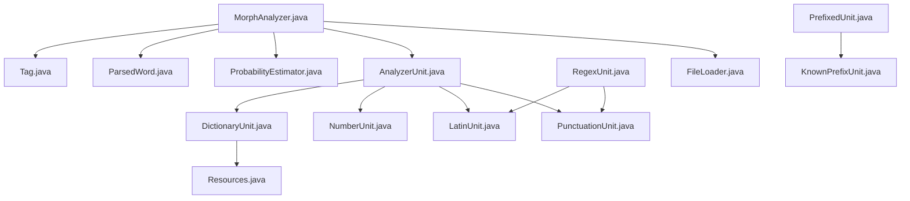
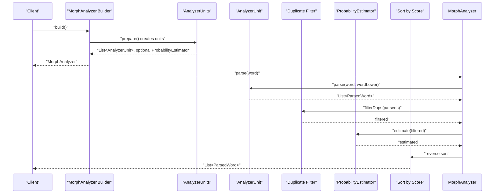
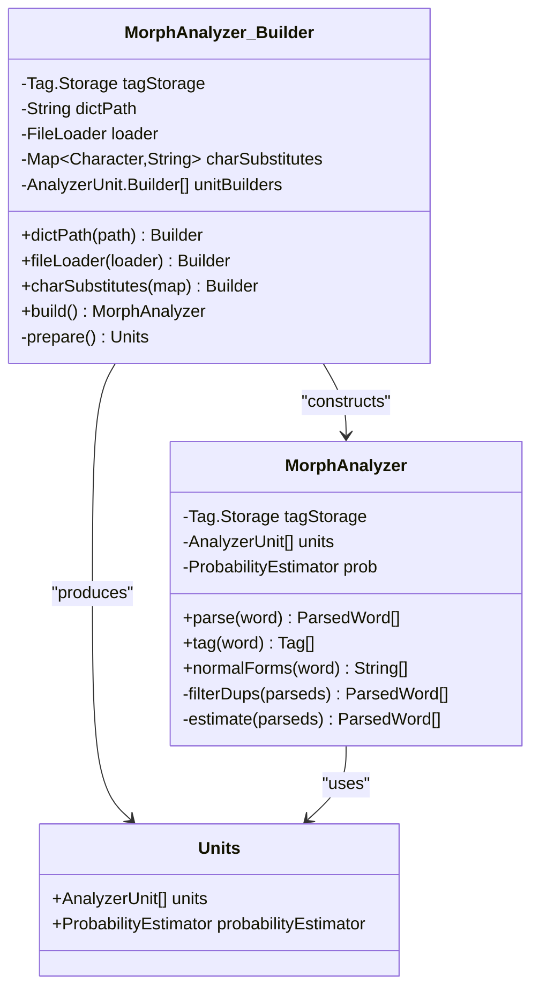
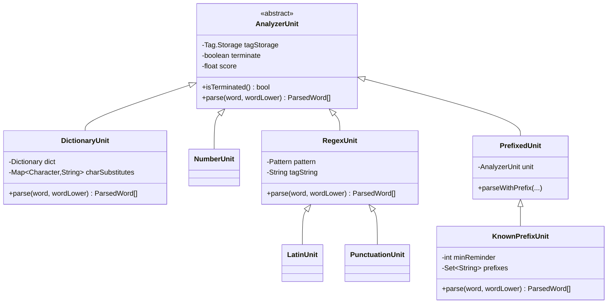
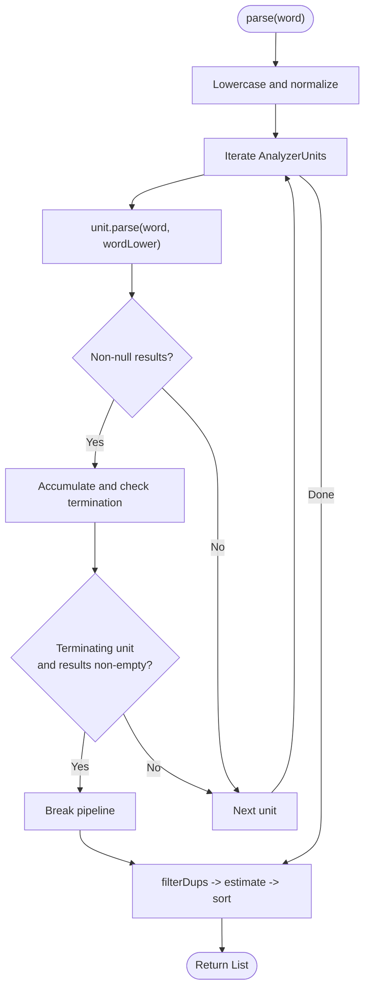
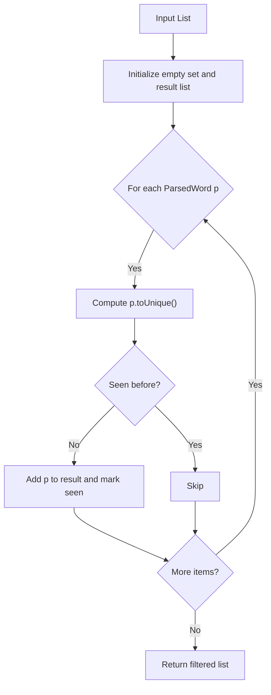
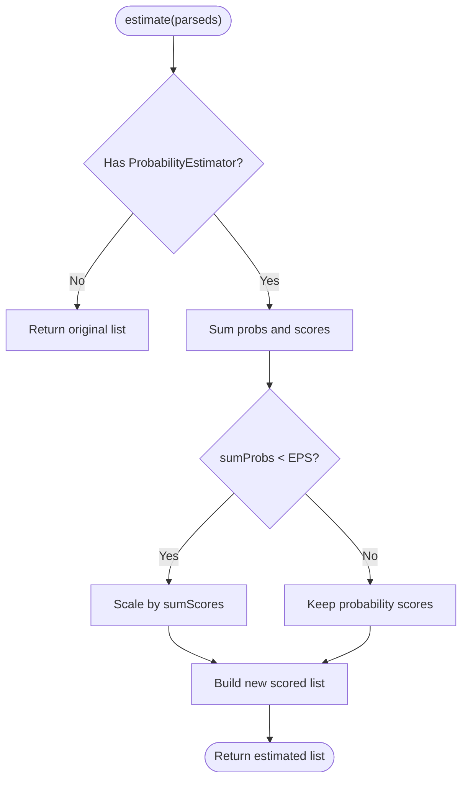
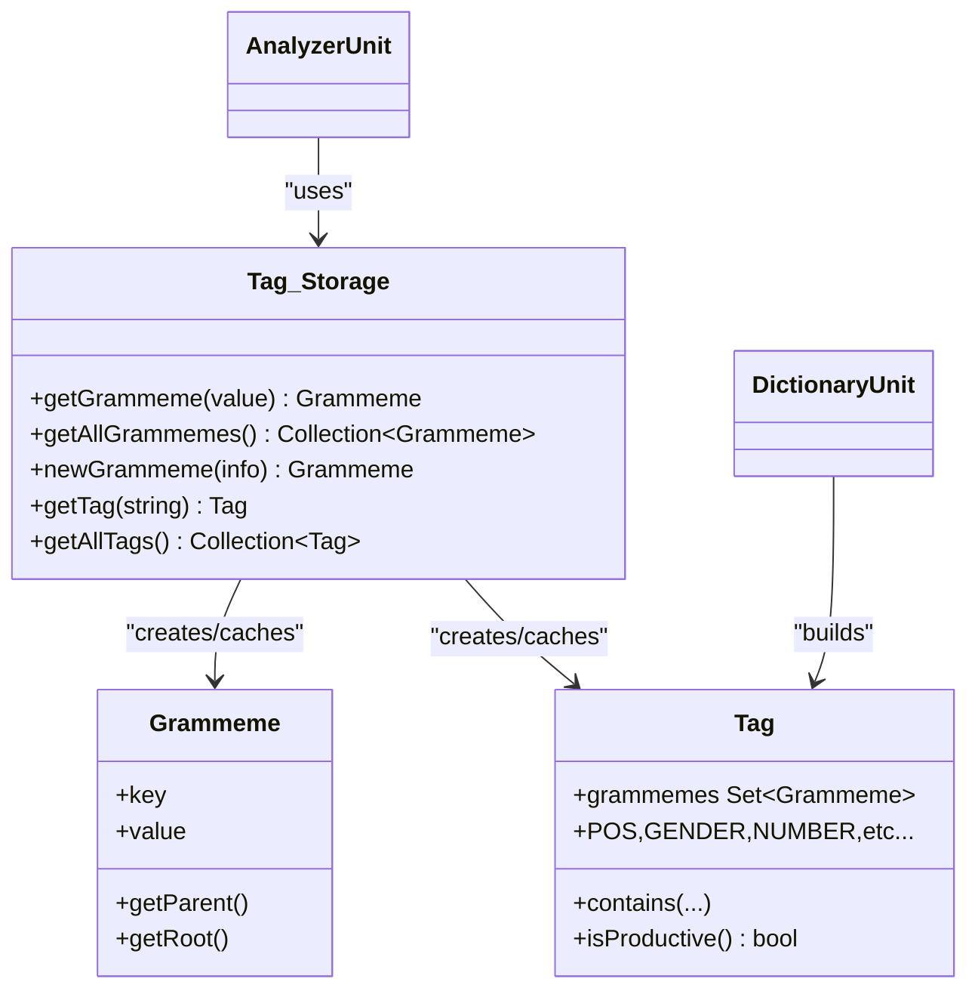
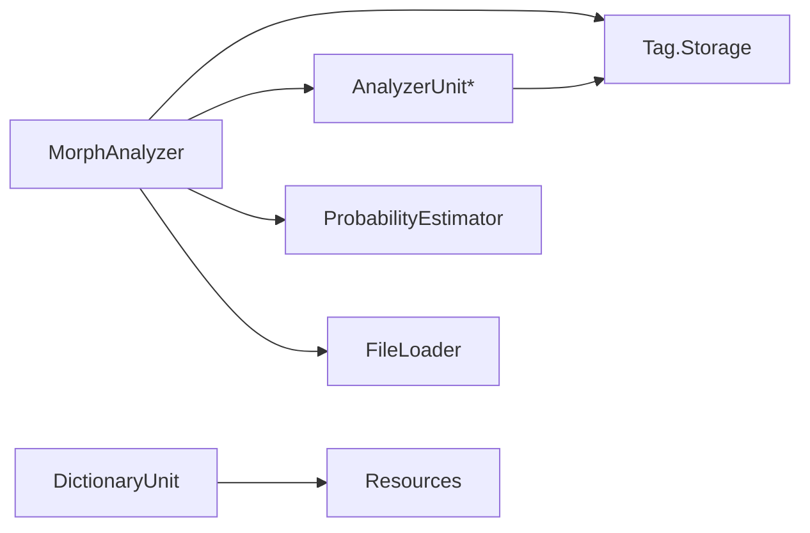

# MorphAnalyzer Engine

<cite>
**Referenced Files in This Document**
- [MorphAnalyzer.java](file://jmorphy2-core/src/main/java/company/evo/jmorphy2/MorphAnalyzer.java)
- [AnalyzerUnit.java](file://jmorphy2-core/src/main/java/company/evo/jmorphy2/units/AnalyzerUnit.java)
- [DictionaryUnit.java](file://jmorphy2-core/src/main/java/company/evo/jmorphy2/units/DictionaryUnit.java)
- [NumberUnit.java](file://jmorphy2-core/src/main/java/company/evo/jmorphy2/units/NumberUnit.java)
- [LatinUnit.java](file://jmorphy2-core/src/main/java/company/evo/jmorphy2/units/LatinUnit.java)
- [PunctuationUnit.java](file://jmorphy2-core/src/main/java/company/evo/jmorphy2/units/PunctuationUnit.java)
- [RegexUnit.java](file://jmorphy2-core/src/main/java/company/evo/jmorphy2/units/RegexUnit.java)
- [PrefixedUnit.java](file://jmorphy2-core/src/main/java/company/evo/jmorphy2/units/PrefixedUnit.java)
- [KnownPrefixUnit.java](file://jmorphy2-core/src/main/java/company/evo/jmorphy2/units/KnownPrefixUnit.java)
- [ProbabilityEstimator.java](file://jmorphy2-core/src/main/java/company/evo/jmorphy2/ProbabilityEstimator.java)
- [Tag.java](file://jmorphy2-core/src/main/java/company/evo/jmorphy2/Tag.java)
- [ParsedWord.java](file://jmorphy2-core/src/main/java/company/evo/jmorphy2/ParsedWord.java)
- [Resources.java](file://jmorphy2-core/src/main/java/company/evo/jmorphy2/Resources.java)
- [FileLoader.java](file://jmorphy2-core/src/main/java/company/evo/jmorphy2/FileLoader.java)
</cite>

## Table of Contents
1. [Introduction](#introduction)
2. [Project Structure](#project-structure)
3. [Core Components](#core-components)
4. [Architecture Overview](#architecture-overview)
5. [Detailed Component Analysis](#detailed-component-analysis)
6. [Dependency Analysis](#dependency-analysis)
7. [Performance Considerations](#performance-considerations)
8. [Troubleshooting Guide](#troubleshooting-guide)
9. [Conclusion](#conclusion)
10. [Appendices](#appendices)

## Introduction
This document explains the MorphAnalyzer engine, focusing on the central orchestrator and the analysis pipeline. It covers the builder pattern for configurable analyzer setup, the execution flow of core analysis methods (parse, tag, normalForms), the probability estimation scoring system, duplicate filtering, and integration with Tag.Storage for grammatical categorization. Practical examples illustrate configuration, usage patterns, and performance considerations, along with the relationship between MorphAnalyzer and AnalyzerUnits.

## Project Structure
The MorphAnalyzer engine resides in the jmorphy2-core module. Key areas:
- Orchestrator and pipeline: MorphAnalyzer, ParsedWord, ProbabilityEstimator
- Grammatical model: Tag, Grammeme, Tag.Storage
- Analyzer pipeline units: AnalyzerUnit and its implementations (DictionaryUnit, NumberUnit, LatinUnit, PunctuationUnit, PrefixedUnit, KnownPrefixUnit)
- Configuration and resources: Resources, FileLoader

**Diagram sources**
- [MorphAnalyzer.java:15-247](file://jmorphy2-core/src/main/java/company/evo/jmorphy2/MorphAnalyzer.java#L15-L247)
- [ParsedWord.java:9-89](file://jmorphy2-core/src/main/java/company/evo/jmorphy2/ParsedWord.java#L9-L89)
- [ProbabilityEstimator.java:9-27](file://jmorphy2-core/src/main/java/company/evo/jmorphy2/ProbabilityEstimator.java#L9-L27)
- [Tag.java:7-230](file://jmorphy2-core/src/main/java/company/evo/jmorphy2/Tag.java#L7-L230)
- [AnalyzerUnit.java:11-72](file://jmorphy2-core/src/main/java/company/evo/jmorphy2/units/AnalyzerUnit.java#L11-L72)
- [DictionaryUnit.java:14-104](file://jmorphy2-core/src/main/java/company/evo/jmorphy2/units/DictionaryUnit.java#L14-L104)
- [NumberUnit.java:10-54](file://jmorphy2-core/src/main/java/company/evo/jmorphy2/units/NumberUnit.java#L10-L54)
- [LatinUnit.java:8-28](file://jmorphy2-core/src/main/java/company/evo/jmorphy2/units/LatinUnit.java#L8-L28)
- [PunctuationUnit.java:8-28](file://jmorphy2-core/src/main/java/company/evo/jmorphy2/units/PunctuationUnit.java#L8-L28)
- [RegexUnit.java:11-31](file://jmorphy2-core/src/main/java/company/evo/jmorphy2/units/RegexUnit.java#L11-L31)
- [PrefixedUnit.java:10-55](file://jmorphy2-core/src/main/java/company/evo/jmorphy2/units/PrefixedUnit.java#L10-L55)
- [KnownPrefixUnit.java:12-75](file://jmorphy2-core/src/main/java/company/evo/jmorphy2/units/KnownPrefixUnit.java#L12-L75)
- [Resources.java:16-114](file://jmorphy2-core/src/main/java/company/evo/jmorphy2/Resources.java#L16-L114)
- [FileLoader.java:7-10](file://jmorphy2-core/src/main/java/company/evo/jmorphy2/FileLoader.java#L7-L10)

**Section sources**
- [MorphAnalyzer.java:15-247](file://jmorphy2-core/src/main/java/company/evo/jmorphy2/MorphAnalyzer.java#L15-L247)
- [Tag.java:162-228](file://jmorphy2-core/src/main/java/company/evo/jmorphy2/Tag.java#L162-L228)

## Core Components
- MorphAnalyzer: Central orchestrator that composes AnalyzerUnits, runs parse/tag/normalForms, applies duplicate filtering, optional probability estimation, and sorting by score.
- AnalyzerUnit and subclasses: Pluggable analyzers implementing parse(word, wordLower) and returning lists of ParsedWord.
- Tag and Grammeme: Grammatical model with Tag.Storage caching grammemes and tags.
- ParsedWord: Immutable result container with score and utilities like lexeme extraction and duplicate detection.
- ProbabilityEstimator: Optional scorer using precomputed distributions keyed by word and tag.
- Resources and FileLoader: Provide language-specific configuration (character substitutions, known prefixes) and dictionary loading.

**Section sources**
- [MorphAnalyzer.java:15-247](file://jmorphy2-core/src/main/java/company/evo/jmorphy2/MorphAnalyzer.java#L15-L247)
- [AnalyzerUnit.java:11-72](file://jmorphy2-core/src/main/java/company/evo/jmorphy2/units/AnalyzerUnit.java#L11-L72)
- [Tag.java:7-230](file://jmorphy2-core/src/main/java/company/evo/jmorphy2/Tag.java#L7-L230)
- [ParsedWord.java:9-89](file://jmorphy2-core/src/main/java/company/evo/jmorphy2/ParsedWord.java#L9-L89)
- [ProbabilityEstimator.java:9-27](file://jmorphy2-core/src/main/java/company/evo/jmorphy2/ProbabilityEstimator.java#L9-L27)
- [Resources.java:16-114](file://jmorphy2-core/src/main/java/company/evo/jmorphy2/Resources.java#L16-L114)
- [FileLoader.java:7-10](file://jmorphy2-core/src/main/java/company/evo/jmorphy2/FileLoader.java#L7-L10)

## Architecture Overview
MorphAnalyzer builds a pipeline of AnalyzerUnits via a fluent Builder. Each unit contributes candidate analyses. The orchestrator merges results, filters duplicates, optionally estimates probabilities, and sorts by score.

**Diagram sources**
- [MorphAnalyzer.java:101-200](file://jmorphy2-core/src/main/java/company/evo/jmorphy2/MorphAnalyzer.java#L101-L200)
- [AnalyzerUnit.java:46-46](file://jmorphy2-core/src/main/java/company/evo/jmorphy2/units/AnalyzerUnit.java#L46-L46)
- [ParsedWord.java:56-87](file://jmorphy2-core/src/main/java/company/evo/jmorphy2/ParsedWord.java#L56-L87)
- [ProbabilityEstimator.java:22-25](file://jmorphy2-core/src/main/java/company/evo/jmorphy2/ProbabilityEstimator.java#L22-L25)

## Detailed Component Analysis

### Builder Pattern and Pipeline Construction
- Configuration knobs:
  - dictPath: dictionary location (System property fallback supported)
  - fileLoader: custom FileLoader (defaults to FSFileLoader)
  - charSubstitutes: language-specific character mapping for similarity matching
  - unitBuilders: override default unit composition
- Default unit pipeline:
  - DictionaryUnit (with charSubstitutes)
  - NumberUnit
  - PunctuationUnit
  - LatinUnit
  - KnownPrefixUnit (if known prefixes exist)
  - UnknownPrefixUnit
  - KnownSuffixUnit (with charSubstitutes)
  - UnknownUnit
- ProbabilityEstimator is enabled when dictionary metadata indicates probabilistic tagging support.

**Diagram sources**
- [MorphAnalyzer.java:20-105](file://jmorphy2-core/src/main/java/company/evo/jmorphy2/MorphAnalyzer.java#L20-L105)

**Section sources**
- [MorphAnalyzer.java:20-105](file://jmorphy2-core/src/main/java/company/evo/jmorphy2/MorphAnalyzer.java#L20-L105)
- [Resources.java:16-40](file://jmorphy2-core/src/main/java/company/evo/jmorphy2/Resources.java#L16-L40)
- [FileLoader.java:7-10](file://jmorphy2-core/src/main/java/company/evo/jmorphy2/FileLoader.java#L7-L10)

### AnalyzerUnit and Pipeline Units
- AnalyzerUnit defines the contract parse(word, wordLower) and supports early termination semantics via isTerminated().
- Concrete units:
  - DictionaryUnit: looks up similar words using character substitutions and builds ParsedWord lexemes from paradigms.
  - NumberUnit: recognizes integers and floats and tags accordingly.
  - Regex-based units (LatinUnit, PunctuationUnit): tag by regular expressions.
  - PrefixedUnit and KnownPrefixUnit: apply known prefixes to base-unit analyses.
- Each unit returns lists of ParsedWord; Terminating units halt further pipeline stages when non-empty results are produced.

**Diagram sources**
- [AnalyzerUnit.java:11-72](file://jmorphy2-core/src/main/java/company/evo/jmorphy2/units/AnalyzerUnit.java#L11-L72)
- [DictionaryUnit.java:14-104](file://jmorphy2-core/src/main/java/company/evo/jmorphy2/units/DictionaryUnit.java#L14-L104)
- [NumberUnit.java:10-54](file://jmorphy2-core/src/main/java/company/evo/jmorphy2/units/NumberUnit.java#L10-L54)
- [RegexUnit.java:11-31](file://jmorphy2-core/src/main/java/company/evo/jmorphy2/units/RegexUnit.java#L11-L31)
- [PrefixedUnit.java:10-55](file://jmorphy2-core/src/main/java/company/evo/jmorphy2/units/PrefixedUnit.java#L10-L55)
- [KnownPrefixUnit.java:12-75](file://jmorphy2-core/src/main/java/company/evo/jmorphy2/units/KnownPrefixUnit.java#L12-L75)

**Section sources**
- [AnalyzerUnit.java:11-72](file://jmorphy2-core/src/main/java/company/evo/jmorphy2/units/AnalyzerUnit.java#L11-L72)
- [DictionaryUnit.java:56-102](file://jmorphy2-core/src/main/java/company/evo/jmorphy2/units/DictionaryUnit.java#L56-L102)
- [NumberUnit.java:31-52](file://jmorphy2-core/src/main/java/company/evo/jmorphy2/units/NumberUnit.java#L31-L52)
- [RegexUnit.java:21-29](file://jmorphy2-core/src/main/java/company/evo/jmorphy2/units/RegexUnit.java#L21-L29)
- [PrefixedUnit.java:18-28](file://jmorphy2-core/src/main/java/company/evo/jmorphy2/units/PrefixedUnit.java#L18-L28)
- [KnownPrefixUnit.java:62-73](file://jmorphy2-core/src/main/java/company/evo/jmorphy2/units/KnownPrefixUnit.java#L62-L73)

### Execution Flow: parse, tag, normalForms
- parse(word):
  - Lowercases and applies special-case normalization.
  - Iterates units in order; accumulates results; stops early if a unit reports termination and produces results.
  - Filters duplicates, estimates scores (optional), sorts descending by score.
- tag(word): delegates to parse and extracts Tag for each ParsedWord.
- normalForms(word): delegates to parse and returns unique normal forms preserving order of first appearance.

**Diagram sources**
- [MorphAnalyzer.java:178-200](file://jmorphy2-core/src/main/java/company/evo/jmorphy2/MorphAnalyzer.java#L178-L200)
- [AnalyzerUnit.java:42-44](file://jmorphy2-core/src/main/java/company/evo/jmorphy2/units/AnalyzerUnit.java#L42-L44)

**Section sources**
- [MorphAnalyzer.java:174-200](file://jmorphy2-core/src/main/java/company/evo/jmorphy2/MorphAnalyzer.java#L174-L200)
- [ParsedWord.java:56-58](file://jmorphy2-core/src/main/java/company/evo/jmorphy2/ParsedWord.java#L56-L58)

### Duplicate Filtering Mechanism
- Duplicates are detected by a canonical representation combining tag and normal form.
- A set tracks seen canonical forms; only first-seen candidates are retained.

**Diagram sources**
- [MorphAnalyzer.java:234-245](file://jmorphy2-core/src/main/java/company/evo/jmorphy2/MorphAnalyzer.java#L234-L245)
- [ParsedWord.java:56-87](file://jmorphy2-core/src/main/java/company/evo/jmorphy2/ParsedWord.java#L56-L87)

**Section sources**
- [MorphAnalyzer.java:234-245](file://jmorphy2-core/src/main/java/company/evo/jmorphy2/MorphAnalyzer.java#L234-L245)
- [ParsedWord.java:56-87](file://jmorphy2-core/src/main/java/company/evo/jmorphy2/ParsedWord.java#L56-L87)

### Probability Estimation and Scoring
- ProbabilityEstimator loads a precomputed distribution keyed by "word:tag" and scales counts to probabilities.
- During scoring:
  - If dictionary supports probabilistic tagging, each ParsedWord receives a probability score derived from the estimator.
  - If total probability mass is negligible, scores fall back to raw scores scaled proportionally.
  - Final ranking is reverse-sorted by score.

**Diagram sources**
- [MorphAnalyzer.java:202-232](file://jmorphy2-core/src/main/java/company/evo/jmorphy2/MorphAnalyzer.java#L202-L232)
- [ProbabilityEstimator.java:22-25](file://jmorphy2-core/src/main/java/company/evo/jmorphy2/ProbabilityEstimator.java#L22-L25)

**Section sources**
- [MorphAnalyzer.java:202-232](file://jmorphy2-core/src/main/java/company/evo/jmorphy2/MorphAnalyzer.java#L202-L232)
- [ProbabilityEstimator.java:9-27](file://jmorphy2-core/src/main/java/company/evo/jmorphy2/ProbabilityEstimator.java#L9-L27)

### Integration with Tag.Storage and Grammatical Model
- Tag.Storage caches grammemes and tags, normalizes grammeme values, and ensures equality semantics across instances.
- Tags expose grammeme sets and convenience predicates (contains, containsAll, isProductive).
- AnalyzerUnits rely on Tag.Storage to construct and resolve tags during parsing.

**Diagram sources**
- [Tag.java:162-228](file://jmorphy2-core/src/main/java/company/evo/jmorphy2/Tag.java#L162-L228)
- [Grammeme.java:7-86](file://jmorphy2-core/src/main/java/company/evo/jmorphy2/Grammeme.java#L7-L86)
- [AnalyzerUnit.java:12-14](file://jmorphy2-core/src/main/java/company/evo/jmorphy2/units/AnalyzerUnit.java#L12-L14)
- [DictionaryUnit.java:57-65](file://jmorphy2-core/src/main/java/company/evo/jmorphy2/units/DictionaryUnit.java#L57-L65)

**Section sources**
- [Tag.java:162-228](file://jmorphy2-core/src/main/java/company/evo/jmorphy2/Tag.java#L162-L228)
- [Grammeme.java:7-86](file://jmorphy2-core/src/main/java/company/evo/jmorphy2/Grammeme.java#L7-L86)
- [AnalyzerUnit.java:12-14](file://jmorphy2-core/src/main/java/company/evo/jmorphy2/units/AnalyzerUnit.java#L12-L14)
- [DictionaryUnit.java:57-65](file://jmorphy2-core/src/main/java/company/evo/jmorphy2/units/DictionaryUnit.java#L57-L65)

### Practical Examples and Usage Patterns
- Basic analyzer creation and usage:
  - Build with defaults (dictionary auto-detected via dictPath or system property).
  - Parse a word to get ranked analyses.
  - Extract tags or normal forms from parse results.
- Configuration tips:
  - Provide dictPath or set the system property to locate dictionaries.
  - Supply a custom FileLoader for alternate storage backends.
  - Override unit builders to adjust pipeline composition.
  - Provide charSubstitutes for language-specific character normalization.

Example references:
- Builder construction and pipeline preparation: [MorphAnalyzer.java:101-104](file://jmorphy2-core/src/main/java/company/evo/jmorphy2/MorphAnalyzer.java#L101-L104)
- Default unit composition and probability estimator enablement: [MorphAnalyzer.java:52-99](file://jmorphy2-core/src/main/java/company/evo/jmorphy2/MorphAnalyzer.java#L52-L99)
- parse, tag, normalForms entry points: [MorphAnalyzer.java:174-176](file://jmorphy2-core/src/main/java/company/evo/jmorphy2/MorphAnalyzer.java#L174-L176), [MorphAnalyzer.java:161-172](file://jmorphy2-core/src/main/java/company/evo/jmorphy2/MorphAnalyzer.java#L161-L172), [MorphAnalyzer.java:143-159](file://jmorphy2-core/src/main/java/company/evo/jmorphy2/MorphAnalyzer.java#L143-L159)

**Section sources**
- [MorphAnalyzer.java:101-104](file://jmorphy2-core/src/main/java/company/evo/jmorphy2/MorphAnalyzer.java#L101-L104)
- [MorphAnalyzer.java:52-99](file://jmorphy2-core/src/main/java/company/evo/jmorphy2/MorphAnalyzer.java#L52-L99)
- [MorphAnalyzer.java:143-172](file://jmorphy2-core/src/main/java/company/evo/jmorphy2/MorphAnalyzer.java#L143-L172)

## Dependency Analysis
- MorphAnalyzer depends on Tag.Storage for grammatical resolution, on AnalyzerUnits for analysis, and optionally on ProbabilityEstimator for scoring.
- AnalyzerUnits depend on Tag.Storage and on shared infrastructure (e.g., DictionaryUnit depends on Dictionary and WordsDAWG).
- Resources supplies language-specific configuration (charSubstitutes, knownPrefixes) consumed by the builder and DictionaryUnit.

**Diagram sources**
- [MorphAnalyzer.java:15-25](file://jmorphy2-core/src/main/java/company/evo/jmorphy2/MorphAnalyzer.java#L15-L25)
- [DictionaryUnit.java:14-26](file://jmorphy2-core/src/main/java/company/evo/jmorphy2/units/DictionaryUnit.java#L14-L26)
- [Resources.java:16-40](file://jmorphy2-core/src/main/java/company/evo/jmorphy2/Resources.java#L16-L40)
- [FileLoader.java:7-10](file://jmorphy2-core/src/main/java/company/evo/jmorphy2/FileLoader.java#L7-L10)

**Section sources**
- [MorphAnalyzer.java:15-25](file://jmorphy2-core/src/main/java/company/evo/jmorphy2/MorphAnalyzer.java#L15-L25)
- [DictionaryUnit.java:14-26](file://jmorphy2-core/src/main/java/company/evo/jmorphy2/units/DictionaryUnit.java#L14-L26)
- [Resources.java:16-40](file://jmorphy2-core/src/main/java/company/evo/jmorphy2/Resources.java#L16-L40)
- [FileLoader.java:7-10](file://jmorphy2-core/src/main/java/company/evo/jmorphy2/FileLoader.java#L7-L10)

## Performance Considerations
- Pipeline short-circuiting: Terminating units reduce total work when applicable.
- Duplicate filtering: Prevents redundant lexeme expansions and downstream processing.
- Probability estimation overhead: Enabled only when dictionary metadata indicates probabilistic tagging; otherwise, raw scores are used.
- Character substitution and prefix scanning: Tune charSubstitutes and knownPrefixes to balance recall and speed.
- Caching: AnalyzerUnit.Builder caches built units to avoid repeated initialization.

[No sources needed since this section provides general guidance]

## Troubleshooting Guide
- No results returned:
  - Verify dictPath or system property is set and accessible.
  - Confirm FileLoader can open dictionary files.
  - Check that units are not prematurely terminating the pipeline.
- Unexpected tags or grammemes:
  - Inspect Tag.Storage normalization and grammeme keys.
  - Ensure language-specific charSubstitutes and knownPrefixes match the input.
- Low-quality rankings:
  - Enable or validate ProbabilityEstimator availability for the loaded dictionary.
  - Review unit scores and ordering in the builder pipeline.

**Section sources**
- [MorphAnalyzer.java:52-99](file://jmorphy2-core/src/main/java/company/evo/jmorphy2/MorphAnalyzer.java#L52-L99)
- [Tag.java:162-228](file://jmorphy2-core/src/main/java/company/evo/jmorphy2/Tag.java#L162-L228)
- [Resources.java:16-40](file://jmorphy2-core/src/main/java/company/evo/jmorphy2/Resources.java#L16-L40)

## Conclusion
MorphAnalyzer composes a modular pipeline of AnalyzerUnits behind a clean builder interface. Its parse, tag, and normalForms methods provide a cohesive analysis surface, while duplicate filtering and optional probability estimation refine quality. Integration with Tag.Storage ensures robust grammatical modeling, and configuration options enable adaptation to diverse languages and environments.

[No sources needed since this section summarizes without analyzing specific files]

## Appendices

### API Summary: Core Methods
- parse(word): returns ranked ParsedWord candidates
- tag(word): returns Tag list derived from parse
- normalForms(word): returns unique normal forms from parse
- getGrammeme, getAllGrammemes, getTag, getAllTags: access Tag.Storage

**Section sources**
- [MorphAnalyzer.java:174-176](file://jmorphy2-core/src/main/java/company/evo/jmorphy2/MorphAnalyzer.java#L174-L176)
- [MorphAnalyzer.java:161-172](file://jmorphy2-core/src/main/java/company/evo/jmorphy2/MorphAnalyzer.java#L161-L172)
- [MorphAnalyzer.java:143-159](file://jmorphy2-core/src/main/java/company/evo/jmorphy2/MorphAnalyzer.java#L143-L159)
- [MorphAnalyzer.java:127-141](file://jmorphy2-core/src/main/java/company/evo/jmorphy2/MorphAnalyzer.java#L127-L141)