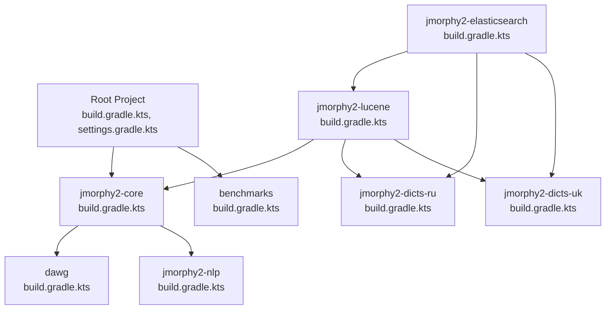
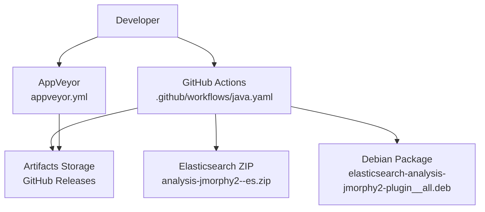
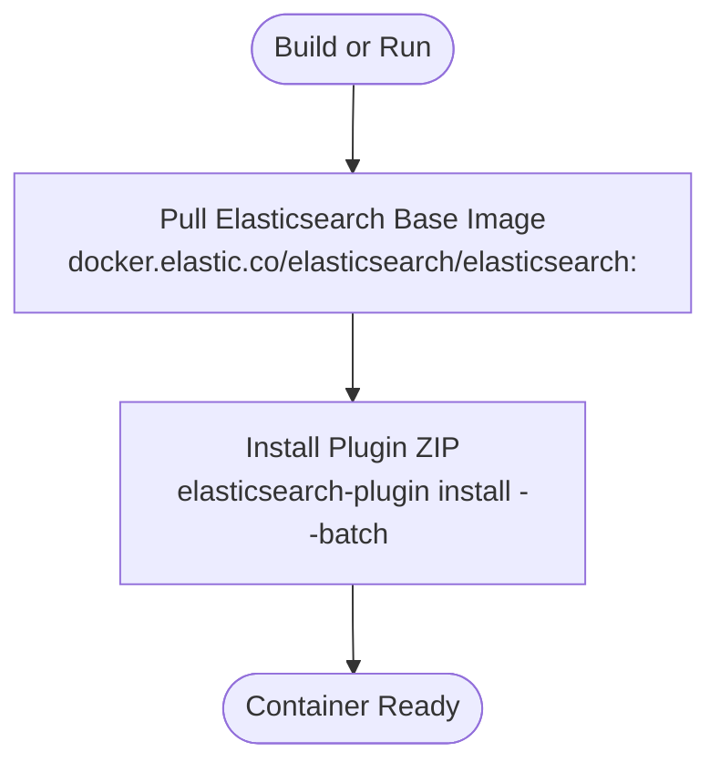
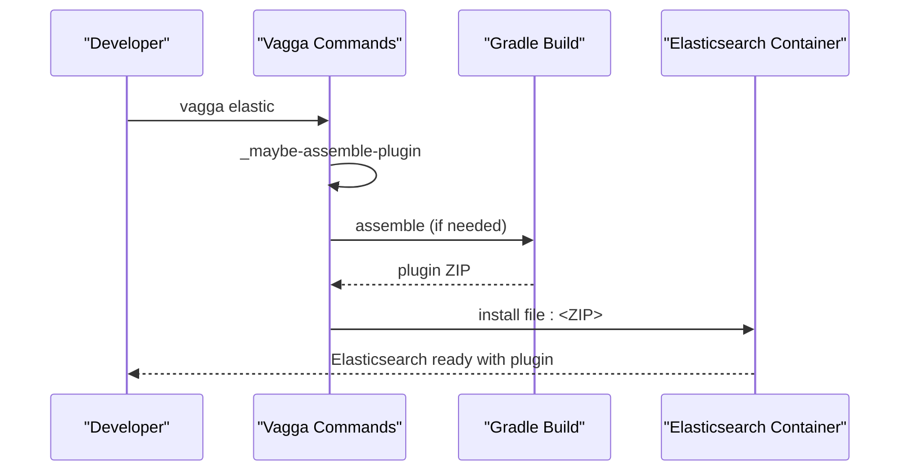
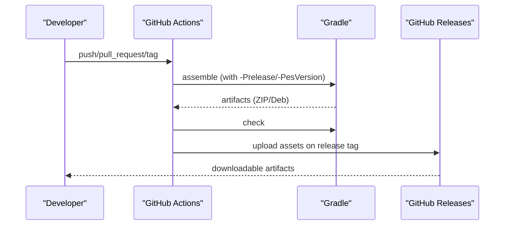
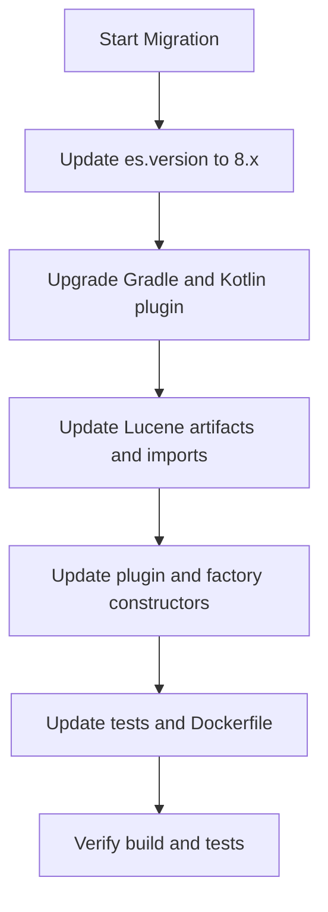
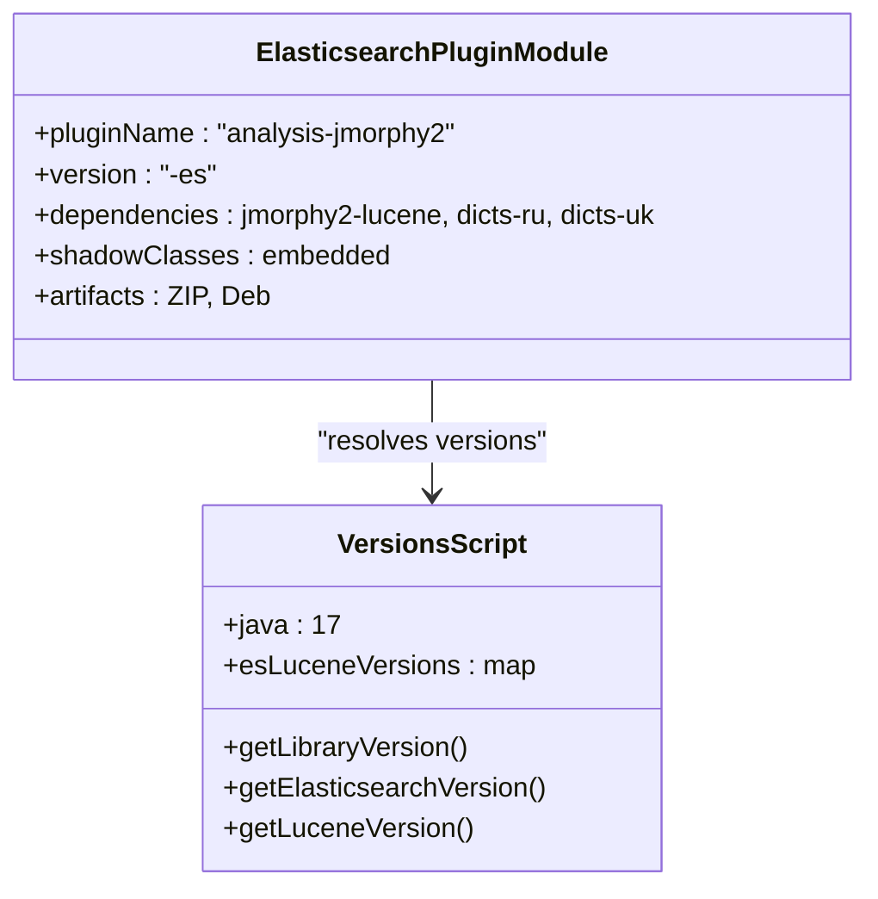
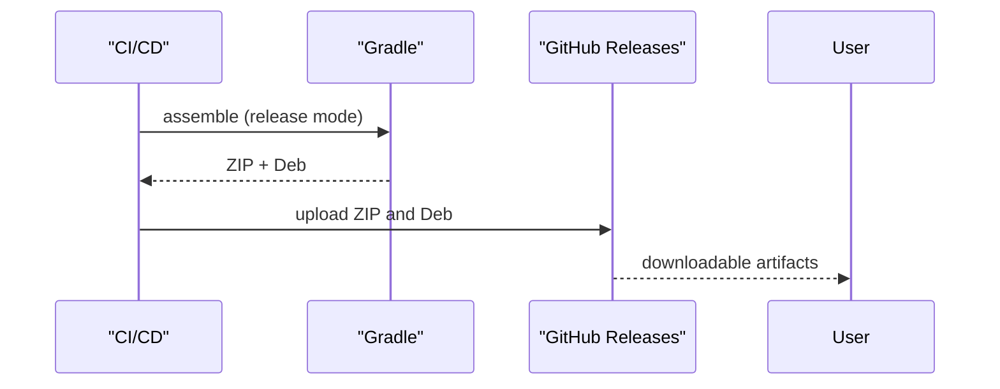
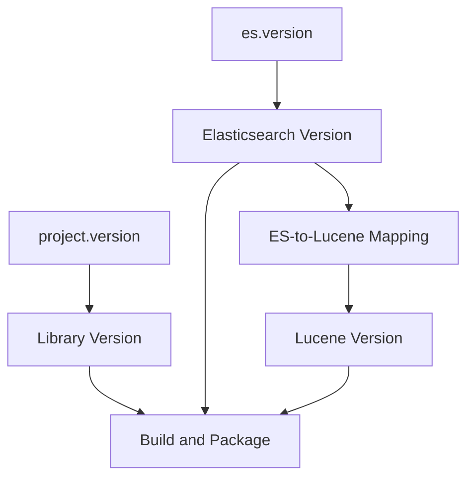
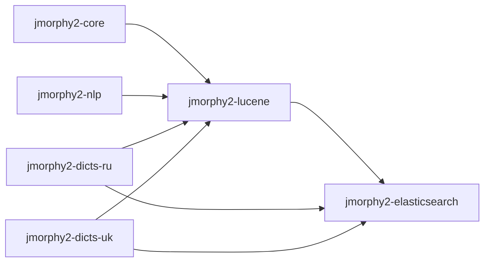

# Deployment and Distribution

<cite>
**Referenced Files in This Document**
- [Dockerfile.elasticsearch](file://Dockerfile.elasticsearch)
- [vagga.yaml](file://vagga.yaml)
- [appveyor.yml](file://appveyor.yml)
- [.github/workflows/java.yaml](file://.github/workflows/java.yaml)
- [ES_8.x_Migration_Report_06a5fe0f.md](file://ES_8.x_Migration_Report_06a5fe0f.md)
- [build.gradle.kts](file://build.gradle.kts)
- [settings.gradle.kts](file://settings.gradle.kts)
- [project.version](file://project.version)
- [es.version](file://es.version)
- [buildSrc/src/main/kotlin/Versions.kt](file://buildSrc/src/main/kotlin/Versions.kt)
- [buildSrc/src/main/kotlin/downloadAndUnpackDicts.kt](file://buildSrc/src/main/kotlin/downloadAndUnpackDicts.kt)
- [jmorphy2-elasticsearch/build.gradle.kts](file://jmorphy2-elasticsearch/build.gradle.kts)
- [jmorphy2-lucene/build.gradle.kts](file://jmorphy2-lucene/build.gradle.kts)
- [jmorphy2-core/build.gradle.kts](file://jmorphy2-core/build.gradle.kts)
- [jmorphy2-elasticsearch/LICENSE.txt](file://jmorphy2-elasticsearch/LICENSE.txt)
- [jmorphy2-elasticsearch/NOTICE.txt](file://jmorphy2-elasticsearch/NOTICE.txt)
- [jmorphy2-elasticsearch/src/main/java/company/evo/jmorphy2/elasticsearch/plugin/AnalysisJmorphy2Plugin.java](file://jmorphy2-elasticsearch/src/main/java/company/evo/jmorphy2/elasticsearch/plugin/AnalysisJmorphy2Plugin.java)
- [jmorphy2-elasticsearch/src/main/java/company/evo/jmorphy2/elasticsearch/index/Jmorphy2AnalyzerProvider.java](file://jmorphy2-elasticsearch/src/main/java/company/evo/jmorphy2/elasticsearch/index/Jmorphy2AnalyzerProvider.java)
</cite>

## Update Summary
**Changes Made**
- Updated Elasticsearch version compatibility matrix to include ES 8.x series with Lucene 9.x mapping
- Enhanced migration procedures section with comprehensive ES 7.x to 8.x migration documentation
- Added detailed API changes documentation for plugin constructor signatures and factory methods
- Updated build system modernization instructions including Java 17 upgrade and Gradle 8.x requirements
- Revised Docker and CI/CD configurations to support ES 8.x deployment
- Enhanced troubleshooting guide with ES 8.x specific deployment issues

## Table of Contents
1. [Introduction](#introduction)
2. [Project Structure](#project-structure)
3. [Core Components](#core-components)
4. [Architecture Overview](#architecture-overview)
5. [Detailed Component Analysis](#detailed-component-analysis)
6. [Dependency Analysis](#dependency-analysis)
7. [Performance Considerations](#performance-considerations)
8. [Troubleshooting Guide](#troubleshooting-guide)
9. [Conclusion](#conclusion)
10. [Appendices](#appendices)

## Introduction
This document describes the deployment and distribution approach for the jmorphy2 project with a focus on packaging, containerization, and release procedures. It covers:
- Docker containerization for Elasticsearch integration, including the Dockerfile configuration and runtime installation of the Elasticsearch plugin.
- Local development and testing with Vagga, including commands for assembling and installing the plugin locally.
- CI/CD pipelines using GitHub Actions and AppVeyor for automated building, testing, and release of the Elasticsearch plugin.
- Elasticsearch version compatibility and migration procedures for upgrades, including comprehensive ES 7.x to 8.x migration documentation.
- Plugin packaging for Elasticsearch, including version-specific builds and distribution channels.
- Release procedures for core library, dictionary modules, and integration plugins.
- Version management, dependency resolution, and compatibility checking.
- Troubleshooting tips for deployment and environment-specific configuration.
- Distribution channel relationships and target audiences.

## Project Structure
The repository is a multi-module Gradle project with dedicated modules for core functionality, Lucene integration, Elasticsearch plugin, Solr integration, NLP utilities, and benchmarks. The top-level build and settings define shared Java toolchains and module inclusion. Versioning is centralized via a shared script in buildSrc and a default Elasticsearch version file.

**Diagram sources**
- [settings.gradle.kts:1-12](file://settings.gradle.kts#L1-L12)
- [build.gradle.kts:1-21](file://build.gradle.kts#L1-L21)
- [jmorphy2-core/build.gradle.kts:1-39](file://jmorphy2-core/build.gradle.kts#L1-L39)
- [jmorphy2-lucene/build.gradle.kts:1-17](file://jmorphy2-lucene/build.gradle.kts#L1-L17)
- [jmorphy2-elasticsearch/build.gradle.kts:1-126](file://jmorphy2-elasticsearch/build.gradle.kts#L1-L126)

**Section sources**
- [settings.gradle.kts:1-12](file://settings.gradle.kts#L1-L12)
- [build.gradle.kts:1-21](file://build.gradle.kts#L1-L21)

## Core Components
- Version management and compatibility:
  - Centralized via buildSrc/Versions.kt, which defines Java version, dependency versions, and the Elasticsearch-to-Lucene version mapping.
  - Default Elasticsearch version is read from es.version.
  - Library version is read from project.version.
- Packaging and distribution:
  - The Elasticsearch plugin module builds both ZIP and Debian packages using the ES plugin Gradle plugin and the nebula ospackage plugin.
  - Shadow classes are embedded to avoid classpath conflicts.
- Local development:
  - Vagga commands orchestrate Gradle builds, test execution, and local Elasticsearch plugin installation.

**Section sources**
- [buildSrc/src/main/kotlin/Versions.kt:35-108](file://buildSrc/src/main/kotlin/Versions.kt#L35-L108)
- [es.version:1-2](file://es.version#L1-L2)
- [project.version:1-2](file://project.version#L1-L2)
- [jmorphy2-elasticsearch/build.gradle.kts:18-126](file://jmorphy2-elasticsearch/build.gradle.kts#L18-L126)
- [vagga.yaml:68-164](file://vagga.yaml#L68-L164)

## Architecture Overview
The deployment pipeline integrates CI/CD, packaging, and distribution for the Elasticsearch plugin. The GitHub Actions workflow assembles artifacts, runs tests, and publishes releases with both ZIP and Debian packages. AppVeyor complements Windows builds and caching.

**Diagram sources**
- [.github/workflows/java.yaml:1-112](file://.github/workflows/java.yaml#L1-L112)
- [appveyor.yml:1-15](file://appveyor.yml#L1-L15)

**Section sources**
- [.github/workflows/java.yaml:1-112](file://.github/workflows/java.yaml#L1-L112)
- [appveyor.yml:1-15](file://appveyor.yml#L1-L15)

## Detailed Component Analysis

### Docker Containerization for Elasticsearch Integration
The Dockerfile uses the official Elasticsearch image and installs the jmorphy2 plugin by downloading a prebuilt ZIP from the GitHub Releases page. The default ES version is configurable via an ARG and is reflected in the plugin's version suffix.

**Diagram sources**
- [Dockerfile.elasticsearch:1-9](file://Dockerfile.elasticsearch#L1-L9)

**Section sources**
- [Dockerfile.elasticsearch:1-9](file://Dockerfile.elasticsearch#L1-L9)

### Vagga Configuration for Local Development and Testing
Vagga provides containers and commands for local development:
- jdk container sets up Java and Gradle environment.
- elastic container installs Elasticsearch from a pinned version and exposes persistent volumes for data and logs.
- Commands:
  - gradle, compile, compile-test, build, assemble, clean, test, check, benchmark.
  - update-shas to refresh checksums for license artifacts.
  - elastic: assembles the plugin if missing and installs it into the running Elasticsearch container.
  - _maybe-assemble-plugin: conditional assembly of the plugin ZIP.
  - python: interactive Python shell with pymorphy2 and dictionaries.

**Diagram sources**
- [vagga.yaml:133-164](file://vagga.yaml#L133-L164)
- [vagga.yaml:151-159](file://vagga.yaml#L151-L159)

**Section sources**
- [vagga.yaml:14-164](file://vagga.yaml#L14-L164)

### CI/CD Pipeline with GitHub Actions and AppVeyor
- GitHub Actions job:
  - Checks out code, sets up JDK 17, caches Gradle wrapper and packages.
  - Detects release tags and passes version and ES version to Gradle.
  - Assembles plugin artifacts and runs tests.
  - Uploads artifacts on tagged releases.
  - Creates GitHub Releases and uploads ZIP and Debian packages.
- AppVeyor:
  - Sets JAVA_HOME and UTF-8 encoding, runs Gradle assemble and check, caches Chocolatey binaries.

**Diagram sources**
- [.github/workflows/java.yaml:8-112](file://.github/workflows/java.yaml#L8-L112)
- [appveyor.yml:1-15](file://appveyor.yml#L1-L15)

**Section sources**
- [.github/workflows/java.yaml:1-112](file://.github/workflows/java.yaml#L1-L112)
- [appveyor.yml:1-15](file://appveyor.yml#L1-L15)

### Elasticsearch Version Compatibility and Migration Procedures
- Compatibility mapping:
  - The Versions.kt file maintains a map of Elasticsearch versions to Lucene versions.
  - The default ES version is 8.15.0; the plugin version embeds this as a suffix.
  - ES 8.x series maps to Lucene 9.x series with specific version mappings.
- Migration guidance:
  - The migration report documents breaking changes for ES 8.x, including Java version upgrade to 17, plugin constructor changes, factory signature modifications, Lucene 8 to 9 changes, and build toolchain updates.
  - Recommended order of migration steps includes updating es.version, Gradle wrapper, Kotlin plugin, Lucene artifacts, and plugin factories.

**Updated** Enhanced with comprehensive ES 7.x to 8.x migration documentation including API changes, Lucene 8 to 9 upgrade guidance, and build system modernization.

**Diagram sources**
- [ES_8.x_Migration_Report_06a5fe0f.md:227-243](file://ES_8.x_Migration_Report_06a5fe0f.md#L227-L243)
- [buildSrc/src/main/kotlin/Versions.kt:47-82](file://buildSrc/src/main/kotlin/Versions.kt#L47-L82)
- [es.version:1-2](file://es.version#L1-L2)

**Section sources**
- [buildSrc/src/main/kotlin/Versions.kt:35-108](file://buildSrc/src/main/kotlin/Versions.kt#L35-L108)
- [ES_8.x_Migration_Report_06a5fe0f.md:16-261](file://ES_8.x_Migration_Report_06a5fe0f.md#L16-L261)
- [es.version:1-2](file://es.version#L1-L2)

### Plugin Packaging for Elasticsearch Integration
- Build configuration:
  - Uses the Elasticsearch Gradle plugin and nebula ospackage plugin.
  - Version is composed from library version and ES version (e.g., <lib>-es<es>).
  - Dependencies include jmorphy2-lucene and dictionary modules.
  - Shadow classes are embedded to avoid conflicts.
  - Generates both ZIP and Debian packages during assemble.
- Licensing:
  - Apache 2.0 license and NOTICE are included in the plugin distribution.

**Diagram sources**
- [jmorphy2-elasticsearch/build.gradle.kts:18-126](file://jmorphy2-elasticsearch/build.gradle.kts#L18-L126)
- [buildSrc/src/main/kotlin/Versions.kt:35-108](file://buildSrc/src/main/kotlin/Versions.kt#L35-L108)

**Section sources**
- [jmorphy2-elasticsearch/build.gradle.kts:18-126](file://jmorphy2-elasticsearch/build.gradle.kts#L18-L126)
- [jmorphy2-elasticsearch/LICENSE.txt:1-203](file://jmorphy2-elasticsearch/LICENSE.txt#L1-L203)
- [jmorphy2-elasticsearch/NOTICE.txt:1-14](file://jmorphy2-elasticsearch/NOTICE.txt#L1-L14)

### Release Procedures for Components
- Core library and dictionary modules:
  - Version is derived from project.version and applied consistently across modules.
  - Tests are executed via Gradle tasks; benchmarks are available separately.
- Elasticsearch plugin:
  - Assembled into ZIP and Debian packages.
  - On release tags containing "-es", artifacts are uploaded to GitHub Releases.
- Distribution channels:
  - ZIP: direct download from GitHub Releases.
  - Debian package: published alongside ZIP for Debian-based systems.

**Diagram sources**
- [.github/workflows/java.yaml:58-112](file://.github/workflows/java.yaml#L58-L112)
- [jmorphy2-elasticsearch/build.gradle.kts:105-126](file://jmorphy2-elasticsearch/build.gradle.kts#L105-L126)

**Section sources**
- [project.version:1-2](file://project.version#L1-L2)
- [.github/workflows/java.yaml:58-112](file://.github/workflows/java.yaml#L58-L112)
- [jmorphy2-elasticsearch/build.gradle.kts:105-126](file://jmorphy2-elasticsearch/build.gradle.kts#L105-L126)

### Version Management, Dependency Resolution, and Compatibility Checking
- Version sources:
  - Library version: project.version (without snapshot suffix for release).
  - Elasticsearch version: es.version, overridden by Gradle property for CI.
  - Lucene version: resolved from the ES-to-Lucene mapping.
- Dependency resolution:
  - Modules declare dependencies on core and NLP components; Lucene module depends on Lucene artifacts resolved by the mapping.
- Compatibility:
  - The migration report enumerates breaking changes and required updates for ES 8.x.

**Updated** Enhanced with ES 8.x version mapping and Lucene 9.x compatibility requirements.

**Diagram sources**
- [buildSrc/src/main/kotlin/Versions.kt:85-108](file://buildSrc/src/main/kotlin/Versions.kt#L85-L108)
- [es.version:1-2](file://es.version#L1-L2)
- [project.version:1-2](file://project.version#L1-L2)

**Section sources**
- [buildSrc/src/main/kotlin/Versions.kt:35-108](file://buildSrc/src/main/kotlin/Versions.kt#L35-L108)
- [jmorphy2-lucene/build.gradle.kts:5-17](file://jmorphy2-lucene/build.gradle.kts#L5-L17)

## Dependency Analysis
The Elasticsearch plugin depends on Lucene integration and dictionary modules. The Lucene module depends on core and NLP modules plus dictionaries. Version resolution ensures Elasticsearch and Lucene versions align.

**Diagram sources**
- [jmorphy2-lucene/build.gradle.kts:5-17](file://jmorphy2-lucene/build.gradle.kts#L5-L17)
- [jmorphy2-elasticsearch/build.gradle.kts:51-62](file://jmorphy2-elasticsearch/build.gradle.kts#L51-L62)

**Section sources**
- [jmorphy2-lucene/build.gradle.kts:5-17](file://jmorphy2-lucene/build.gradle.kts#L5-L17)
- [jmorphy2-elasticsearch/build.gradle.kts:51-62](file://jmorphy2-elasticsearch/build.gradle.kts#L51-L62)

## Performance Considerations
- Caching:
  - GitHub Actions caches Gradle wrapper and Gradle user home directories to speed up builds.
  - AppVeyor caches Chocolatey binaries.
- Shadow classes:
  - Embedding dependencies reduces classpath conflicts and simplifies plugin distribution.
- Benchmarking:
  - Benchmarks module is available for performance evaluation.

**Section sources**
- [.github/workflows/java.yaml:19-31](file://.github/workflows/java.yaml#L19-L31)
- [appveyor.yml:12-15](file://appveyor.yml#L12-L15)
- [jmorphy2-elasticsearch/build.gradle.kts:49-98](file://jmorphy2-elasticsearch/build.gradle.kts#L49-L98)

## Troubleshooting Guide
- Elasticsearch plugin installation failures:
  - Ensure the plugin ZIP matches the Elasticsearch version (suffix "-es<es>").
  - Use the Vagga elastic command to install the assembled plugin into a local container.
- Docker build issues:
  - Verify ES_VERSION argument matches the intended Elasticsearch version.
  - Confirm the release URL for the plugin ZIP is reachable.
- CI/CD failures:
  - Check that release tags include "-es<version>" to trigger artifact publishing.
  - Validate JAVA_HOME and Gradle versions in CI environments.
- Local development:
  - Use Vagga commands to assemble and install the plugin; confirm persistent volumes for Elasticsearch data and logs are configured.
- ES 8.x specific issues:
  - Ensure Java 17 compatibility for plugin construction and factory methods.
  - Verify Lucene 9.x artifact compatibility and import package renames.
  - Check for proper SPI implementation with NAME field and no-arg constructor requirements.

**Updated** Added ES 8.x specific troubleshooting guidance for Java version compatibility, Lucene 9.x migration issues, and plugin construction changes.

**Section sources**
- [vagga.yaml:133-164](file://vagga.yaml#L133-L164)
- [Dockerfile.elasticsearch:7-9](file://Dockerfile.elasticsearch#L7-L9)
- [.github/workflows/java.yaml:36-45](file://.github/workflows/java.yaml#L36-L45)
- [ES_8.x_Migration_Report_06a5fe0f.md:18-243](file://ES_8.x_Migration_Report_06a5fe0f.md#L18-L243)

## Conclusion
The jmorphy2 project employs a robust deployment and distribution strategy centered on:
- Clear version management and compatibility mapping.
- Automated CI/CD pipelines that produce ZIP and Debian artifacts.
- Local development workflows via Vagga and Docker.
- Comprehensive migration guidance for Elasticsearch version upgrades, including detailed ES 7.x to 8.x migration procedures.
This approach ensures reliable releases across multiple channels and environments.

## Appendices

### Elasticsearch Version Compatibility Matrix (selected)
- ES 8.15 maps to Lucene 9.11.1.
- ES 8.x series maps to Lucene 9.x series with incremental versions.
- ES 7.x series maps to Lucene 8.x series with established compatibility.

**Updated** Enhanced with ES 8.x version mapping and Lucene 9.x compatibility details.

**Section sources**
- [buildSrc/src/main/kotlin/Versions.kt:66-82](file://buildSrc/src/main/kotlin/Versions.kt#L66-L82)
- [ES_8.x_Migration_Report_06a5fe0f.md:139-163](file://ES_8.x_Migration_Report_06a5fe0f.md#L139-L163)

### Distribution Channels and Target Audiences
- ZIP artifacts:
  - Direct download for Elasticsearch users across platforms.
- Debian packages:
  - Ideal for Debian/Ubuntu-based systems with package manager integration.

**Section sources**
- [.github/workflows/java.yaml:58-112](file://.github/workflows/java.yaml#L58-L112)
- [jmorphy2-elasticsearch/build.gradle.kts:105-126](file://jmorphy2-elasticsearch/build.gradle.kts#L105-L126)

### ES 8.x Migration Implementation Details
- Java 17 Upgrade:
  - All build scripts updated to use Java 17 for ES 8.x compatibility.
  - GitHub Actions workflow upgraded to Java 17 with latest action versions.
- Plugin Constructor Changes:
  - AnalysisJmorphy2Plugin now uses no-arg constructor with createComponents() method.
  - Jmorphy2Service initialized in createComponents() lifecycle method.
- Factory Method Updates:
  - Token filter factories updated to remove IndexSettings parameter.
  - Analyzer provider constructor simplified to (String, Settings).
- Lucene 9.x Migration:
  - Artifact names updated from lucene-analyzers-common to lucene-analysis-common.
  - Import package renames for TokenFilterFactory, ResourceLoader, and ResourceLoaderAware.
  - SPI requirements implemented with NAME field and no-arg constructor.

**Section sources**
- [ES_8.x_Migration_Report_06a5fe0f.md:16-261](file://ES_8.x_Migration_Report_06a5fe0f.md#L16-L261)
- [jmorphy2-elasticsearch/src/main/java/company/evo/jmorphy2/elasticsearch/plugin/AnalysisJmorphy2Plugin.java:34-69](file://jmorphy2-elasticsearch/src/main/java/company/evo/jmorphy2/elasticsearch/plugin/AnalysisJmorphy2Plugin.java#L34-L69)
- [jmorphy2-elasticsearch/src/main/java/company/evo/jmorphy2/elasticsearch/index/Jmorphy2AnalyzerProvider.java:29-53](file://jmorphy2-elasticsearch/src/main/java/company/evo/jmorphy2/elasticsearch/index/Jmorphy2AnalyzerProvider.java#L29-L53)
- [jmorphy2-lucene/build.gradle.kts:6-8](file://jmorphy2-lucene/build.gradle.kts#L6-L8)