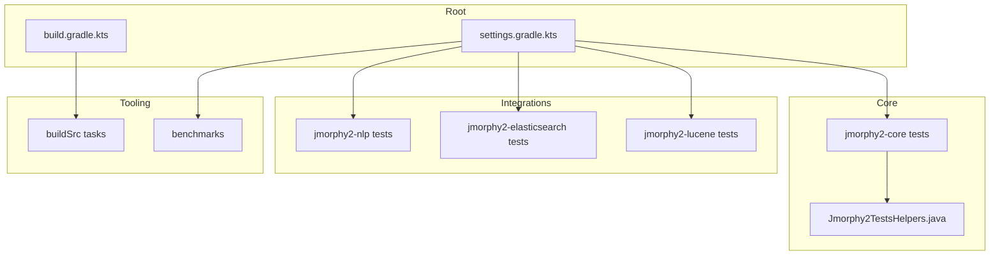
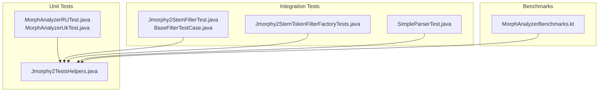
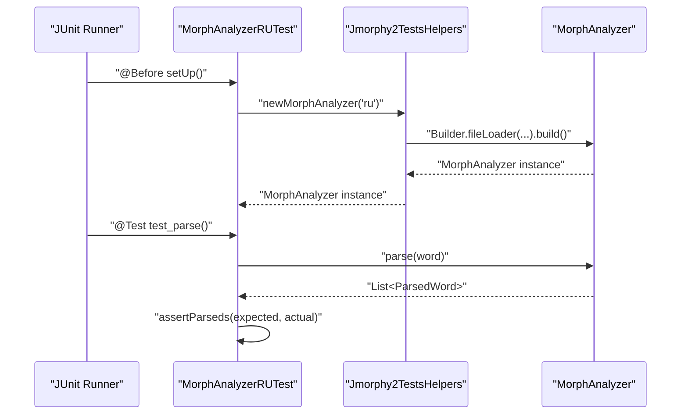
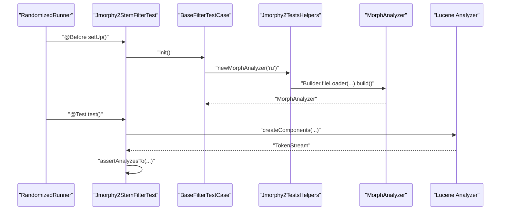
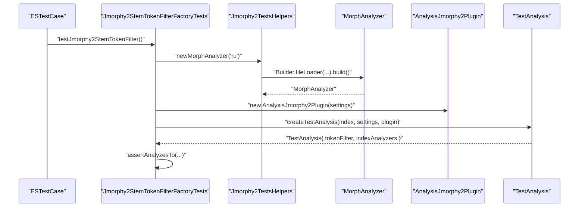
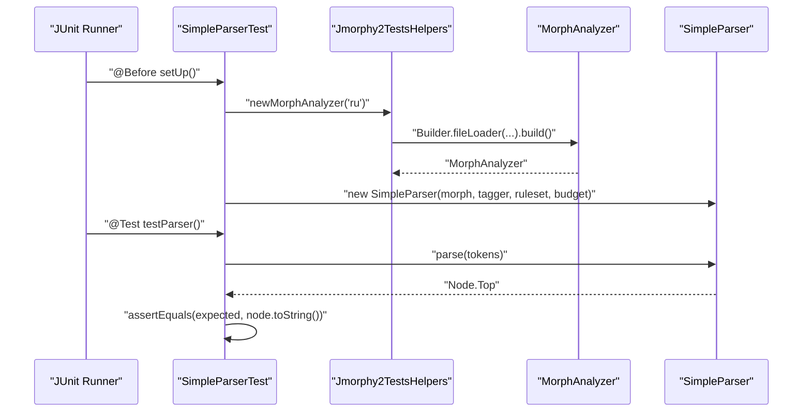
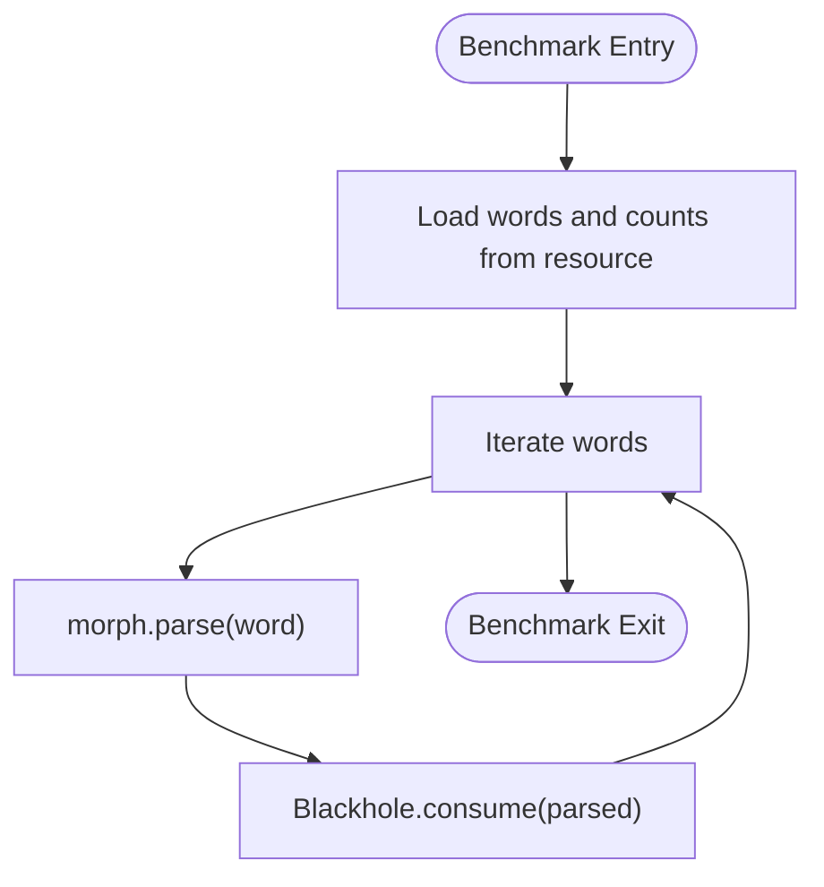
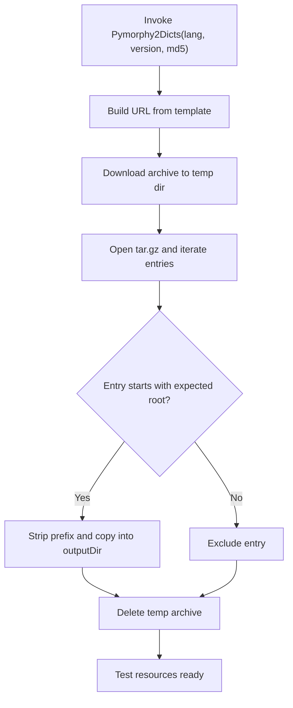

# Development and Testing

<cite>
**Referenced Files in This Document**
- [README.md](file://README.md)
- [build.gradle.kts](file://build.gradle.kts)
- [settings.gradle.kts](file://settings.gradle.kts)
- [Versions.kt](file://buildSrc/src/main/kotlin/Versions.kt)
- [downloadAndUnpackDicts.kt](file://buildSrc/src/main/kotlin/downloadAndUnpackDicts.kt)
- [Jmorphy2TestsHelpers.java](file://jmorphy2-core/src/test/java/company/evo/jmorphy2/Jmorphy2TestsHelpers.java)
- [MorphAnalyzerRUTest.java](file://jmorphy2-core/src/test/java/company/evo/jmorphy2/MorphAnalyzerRUTest.java)
- [MorphAnalyzerUkTest.java](file://jmorphy2-core/src/test/java/company/evo/jmorphy2/MorphAnalyzerUkTest.java)
- [BaseFilterTestCase.java](file://jmorphy2-lucene/src/test/java/company/evo/jmorphy2/lucene/BaseFilterTestCase.java)
- [Jmorphy2StemFilterTest.java](file://jmorphy2-lucene/src/test/java/company/evo/jmorphy2/lucene/Jmorphy2StemFilterTest.java)
- [Jmorphy2StemTokenFilterFactoryTests.java](file://jmorphy2-elasticsearch/src/test/java/company/evo/jmorphy2/elasticsearch/index/Jmorphy2StemTokenFilterFactoryTests.java)
- [SimpleParserTest.java](file://jmorphy2-nlp/src/test/java/company/evo/jmorphy2/nlp/SimpleParserTest.java)
- [MorphAnalyzerBenchmarks.kt](file://benchmarks/src/jmh/kotlin/company/evo/jmorphy2/MorphAnalyzerBenchmarks.kt)
- [java.yaml](file://.github/workflows/java.yaml)
</cite>

## Table of Contents
1. [Introduction](#introduction)
2. [Project Structure](#project-structure)
3. [Core Components](#core-components)
4. [Architecture Overview](#architecture-overview)
5. [Detailed Component Analysis](#detailed-component-analysis)
6. [Dependency Analysis](#dependency-analysis)
7. [Performance Considerations](#performance-considerations)
8. [Troubleshooting Guide](#troubleshooting-guide)
9. [Conclusion](#conclusion)
10. [Appendices](#appendices)

## Introduction
This document explains how to develop and test contributions to Jmorphy2. It covers the testing strategy (unit, integration, and performance), test utilities and helpers, execution with JUnit and related frameworks, dictionary acquisition for tests, continuous integration, code quality and best practices, and guidance for adding new tests for language-specific features and custom analysis units.

## Project Structure
Jmorphy2 is a multi-module Gradle project. The core morphological analyzer resides in jmorphy2-core, while integrations live in jmorphy2-lucene, jmorphy2-elasticsearch, and jmorphy2-nlp. Benchmarks are in benchmarks. Shared build logic and dictionary download tasks live in buildSrc.



**Diagram sources**
- [settings.gradle.kts:1-12](file://settings.gradle.kts#L1-L12)
- [build.gradle.kts:1-21](file://build.gradle.kts#L1-L21)
- [Jmorphy2TestsHelpers.java:1-21](file://jmorphy2-core/src/test/java/company/evo/jmorphy2/Jmorphy2TestsHelpers.java#L1-L21)

**Section sources**
- [settings.gradle.kts:1-12](file://settings.gradle.kts#L1-L12)
- [build.gradle.kts:1-21](file://build.gradle.kts#L1-L21)

## Core Components
- MorphAnalyzer and ParsedWord are the central APIs for morphological analysis. Tests in jmorphy2-core exercise parsing, normal forms, lexeme generation, inflection, and grammeme tagging.
- Integration tests validate Lucene and Elasticsearch filters and analyzers using realistic token streams and index settings.
- Benchmarks measure throughput using JMH with real-word frequency lists.

Key testing utilities:
- Jmorphy2TestsHelpers constructs a MorphAnalyzer configured to load dictionaries from resources, enabling repeatable unit tests.
- BaseFilterTestCase standardizes analyzer initialization for Lucene integration tests.
- downloadAndUnpackDicts.kt is a Gradle task that downloads and unpacks pymorphy2 dictionaries into the test resources tree.

**Section sources**
- [Jmorphy2TestsHelpers.java:1-21](file://jmorphy2-core/src/test/java/company/evo/jmorphy2/Jmorphy2TestsHelpers.java#L1-L21)
- [BaseFilterTestCase.java:1-18](file://jmorphy2-lucene/src/test/java/company/evo/jmorphy2/lucene/BaseFilterTestCase.java#L1-L18)
- [downloadAndUnpackDicts.kt:1-82](file://buildSrc/src/main/kotlin/downloadAndUnpackDicts.kt#L1-L82)

## Architecture Overview
The testing architecture separates concerns across modules:
- Unit tests in jmorphy2-core validate core morphological logic using resource-backed dictionaries.
- Integration tests in jmorphy2-lucene and jmorphy2-elasticsearch validate pipeline behavior (analyzers, token filters).
- Benchmarks in benchmarks measure performance using JMH.



**Diagram sources**
- [MorphAnalyzerRUTest.java:1-308](file://jmorphy2-core/src/test/java/company/evo/jmorphy2/MorphAnalyzerRUTest.java#L1-L308)
- [MorphAnalyzerUkTest.java:1-175](file://jmorphy2-core/src/test/java/company/evo/jmorphy2/MorphAnalyzerUkTest.java#L1-L175)
- [Jmorphy2TestsHelpers.java:1-21](file://jmorphy2-core/src/test/java/company/evo/jmorphy2/Jmorphy2TestsHelpers.java#L1-L21)
- [Jmorphy2StemFilterTest.java:1-134](file://jmorphy2-lucene/src/test/java/company/evo/jmorphy2/lucene/Jmorphy2StemFilterTest.java#L1-L134)
- [BaseFilterTestCase.java:1-18](file://jmorphy2-lucene/src/test/java/company/evo/jmorphy2/lucene/BaseFilterTestCase.java#L1-L18)
- [Jmorphy2StemTokenFilterFactoryTests.java:1-85](file://jmorphy2-elasticsearch/src/test/java/company/evo/jmorphy2/elasticsearch/index/Jmorphy2StemTokenFilterFactoryTests.java#L1-L85)
- [SimpleParserTest.java:1-156](file://jmorphy2-nlp/src/test/java/company/evo/jmorphy2/nlp/SimpleParserTest.java#L1-L156)
- [MorphAnalyzerBenchmarks.kt:1-44](file://benchmarks/src/jmh/kotlin/company/evo/jmorphy2/MorphAnalyzerBenchmarks.kt#L1-L44)

## Detailed Component Analysis

### Unit Tests: MorphAnalyzer Core
- Purpose: Validate parsing correctness, normal form extraction, lexeme enumeration, inflection with inclusion/exclusion of grammemes, and grammeme semantics.
- Execution: JUnit 4 via Gradle tasks; tests exclude benchmarks automatically.
- Data sources: Resource-backed dictionaries via Jmorphy2TestsHelpers.



**Diagram sources**
- [MorphAnalyzerRUTest.java:22-28](file://jmorphy2-core/src/test/java/company/evo/jmorphy2/MorphAnalyzerRUTest.java#L22-L28)
- [Jmorphy2TestsHelpers.java:7-19](file://jmorphy2-core/src/test/java/company/evo/jmorphy2/Jmorphy2TestsHelpers.java#L7-L19)

**Section sources**
- [MorphAnalyzerRUTest.java:1-308](file://jmorphy2-core/src/test/java/company/evo/jmorphy2/MorphAnalyzerRUTest.java#L1-L308)
- [MorphAnalyzerUkTest.java:1-175](file://jmorphy2-core/src/test/java/company/evo/jmorphy2/MorphAnalyzerUkTest.java#L1-L175)
- [Jmorphy2TestsHelpers.java:1-21](file://jmorphy2-core/src/test/java/company/evo/jmorphy2/Jmorphy2TestsHelpers.java#L1-L21)
- [build.gradle.kts:12-14](file://build.gradle.kts#L12-L14)

### Integration Tests: Lucene Filters
- Purpose: Validate token filtering behavior in Lucene analyzers using randomized testing and Lucene’s assertion helpers.
- Execution: RandomizedRunner for Lucene tests; shared MorphAnalyzer setup via BaseFilterTestCase.



**Diagram sources**
- [Jmorphy2StemFilterTest.java:20-34](file://jmorphy2-lucene/src/test/java/company/evo/jmorphy2/lucene/Jmorphy2StemFilterTest.java#L20-L34)
- [BaseFilterTestCase.java:9-16](file://jmorphy2-lucene/src/test/java/company/evo/jmorphy2/lucene/BaseFilterTestCase.java#L9-L16)
- [Jmorphy2TestsHelpers.java:7-19](file://jmorphy2-core/src/test/java/company/evo/jmorphy2/Jmorphy2TestsHelpers.java#L7-L19)

**Section sources**
- [Jmorphy2StemFilterTest.java:1-134](file://jmorphy2-lucene/src/test/java/company/evo/jmorphy2/lucene/Jmorphy2StemFilterTest.java#L1-L134)
- [BaseFilterTestCase.java:1-18](file://jmorphy2-lucene/src/test/java/company/evo/jmorphy2/lucene/BaseFilterTestCase.java#L1-L18)

### Integration Tests: Elasticsearch Plugin
- Purpose: Validate Elasticsearch token filter factory registration and analyzer behavior using ESTestCase and test analysis builders.
- Execution: Standard JUnit via ESTestCase; analyzer assertions mirror Lucene tests.



**Diagram sources**
- [Jmorphy2StemTokenFilterFactoryTests.java:35-53](file://jmorphy2-elasticsearch/src/test/java/company/evo/jmorphy2/elasticsearch/index/Jmorphy2StemTokenFilterFactoryTests.java#L35-L53)
- [Jmorphy2TestsHelpers.java:7-19](file://jmorphy2-core/src/test/java/company/evo/jmorphy2/Jmorphy2TestsHelpers.java#L7-L19)

**Section sources**
- [Jmorphy2StemTokenFilterFactoryTests.java:1-85](file://jmorphy2-elasticsearch/src/test/java/company/evo/jmorphy2/elasticsearch/index/Jmorphy2StemTokenFilterFactoryTests.java#L1-L85)

### Integration Tests: NLP Pipeline
- Purpose: Validate higher-level parsing and tagging rules using a SimpleParser backed by MorphAnalyzer and rule sets.



**Diagram sources**
- [SimpleParserTest.java:23-39](file://jmorphy2-nlp/src/test/java/company/evo/jmorphy2/nlp/SimpleParserTest.java#L23-L39)
- [Jmorphy2TestsHelpers.java:7-19](file://jmorphy2-core/src/test/java/company/evo/jmorphy2/Jmorphy2TestsHelpers.java#L7-L19)

**Section sources**
- [SimpleParserTest.java:1-156](file://jmorphy2-nlp/src/test/java/company/evo/jmorphy2/nlp/SimpleParserTest.java#L1-L156)

### Performance Benchmarks: JMH
- Purpose: Measure morphological parsing throughput using a real unigram list.
- Execution: JMH benchmark methods; shared analyzer via Jmorphy2TestsHelpers.



**Diagram sources**
- [MorphAnalyzerBenchmarks.kt:13-42](file://benchmarks/src/jmh/kotlin/company/evo/jmorphy2/MorphAnalyzerBenchmarks.kt#L13-L42)
- [Jmorphy2TestsHelpers.java:7-19](file://jmorphy2-core/src/test/java/company/evo/jmorphy2/Jmorphy2TestsHelpers.java#L7-L19)

**Section sources**
- [MorphAnalyzerBenchmarks.kt:1-44](file://benchmarks/src/jmh/kotlin/company/evo/jmorphy2/MorphAnalyzerBenchmarks.kt#L1-L44)

## Dependency Analysis
- Subproject configuration applies Java library plugin, Maven Central, and excludes benchmarks from default test tasks.
- Modules are included via settings.gradle.kts.
- BuildSrc defines shared versions and a task to download and unpack dictionaries into test resources.

```mermaid
graph LR
Root["Root build.gradle.kts"] --> Sub["subprojects { apply java-library }"]
Root --> Excl["tasks.withType<Test> { exclude(\"**/*Benchmark*\") }"]
Settings["settings.gradle.kts"] --> Mods["include modules"]
BuildSrc["buildSrc Versions.kt"] --> V["Shared versions"]
BuildSrcTask["buildSrc downloadAndUnpackDicts.kt"] --> Res["Test resources dir"]
```

**Diagram sources**
- [build.gradle.kts:1-21](file://build.gradle.kts#L1-L21)
- [settings.gradle.kts:1-12](file://settings.gradle.kts#L1-L12)
- [Versions.kt:35-87](file://buildSrc/src/main/kotlin/Versions.kt#L35-L87)
- [downloadAndUnpackDicts.kt:14-80](file://buildSrc/src/main/kotlin/downloadAndUnpackDicts.kt#L14-L80)

**Section sources**
- [build.gradle.kts:1-21](file://build.gradle.kts#L1-L21)
- [settings.gradle.kts:1-12](file://settings.gradle.kts#L1-L12)
- [Versions.kt:35-87](file://buildSrc/src/main/kotlin/Versions.kt#L35-L87)
- [downloadAndUnpackDicts.kt:14-80](file://buildSrc/src/main/kotlin/downloadAndUnpackDicts.kt#L14-L80)

## Performance Considerations
- Use JMH benchmarks to measure parsing throughput on representative corpora.
- Keep benchmark inputs deterministic and representative of production workloads.
- Prefer resource-backed analyzers for reproducible results in benchmarks and tests.

[No sources needed since this section provides general guidance]

## Troubleshooting Guide
Common issues and remedies:
- Missing dictionaries in tests:
  - Ensure the downloadAndUnpackDicts task has run and populated the resource tree before tests.
  - Verify the task output directory matches the resource path expected by ResourceFileLoader.
- Dictionary version mismatches:
  - Confirm the expected dictionary version and checksum align with the task inputs.
- Benchmark flakiness:
  - Run with warmed JVM and stable hardware; avoid noisy multitasking during measurement.
- CI failures:
  - Review GitHub Actions logs for cache keys and Gradle arguments applied during assembly and checks.

**Section sources**
- [downloadAndUnpackDicts.kt:30-80](file://buildSrc/src/main/kotlin/downloadAndUnpackDicts.kt#L30-L80)
- [java.yaml:33-45](file://.github/workflows/java.yaml#L33-L45)

## Conclusion
Jmorphy2’s testing strategy combines robust unit tests for core morphological logic, integration tests for Lucene and Elasticsearch pipelines, and JMH benchmarks for performance. Shared utilities simplify test setup, while CI automates builds and releases. Adhering to the outlined practices ensures reliable contributions and maintainable extensions.

[No sources needed since this section summarizes without analyzing specific files]

## Appendices

### A. Test Execution Procedures
- Local execution:
  - Assemble and run tests: ./gradlew assemble check
  - Exclude benchmarks from default test tasks; JMH benchmarks require separate invocation.
- CI execution:
  - GitHub Actions job assembles artifacts, optionally configures Elasticsearch version, and runs checks.
  - On tagged releases with “-es” suffix, plugin artifacts are uploaded.

**Section sources**
- [build.gradle.kts:12-14](file://build.gradle.kts#L12-L14)
- [java.yaml:33-45](file://.github/workflows/java.yaml#L33-L45)

### B. Writing New Unit Tests for Custom Analysis Units
- Use Jmorphy2TestsHelpers to construct a MorphAnalyzer with resource-backed dictionaries.
- Add test cases covering parsing, normal forms, lexeme generation, and inflection.
- Validate grammeme semantics and tag resolution.
- Example patterns:
  - Parsing known prefixes/suffixes and unknown variants.
  - Handling special characters and normalization (e.g., ё vs е).
  - Numeric, punctuation, Latin, and Roman numeral handling.
  - Unknown word classification.

**Section sources**
- [Jmorphy2TestsHelpers.java:7-19](file://jmorphy2-core/src/test/java/company/evo/jmorphy2/Jmorphy2TestsHelpers.java#L7-L19)
- [MorphAnalyzerRUTest.java:30-142](file://jmorphy2-core/src/test/java/company/evo/jmorphy2/MorphAnalyzerRUTest.java#L30-L142)
- [MorphAnalyzerUkTest.java:30-67](file://jmorphy2-core/src/test/java/company/evo/jmorphy2/MorphAnalyzerUkTest.java#L30-L67)

### C. Language-Specific Testing Guidance
- Russian tests focus on paradigms, gen2/loct/loc2, hyphens, and numeral handling.
- Ukrainian tests emphasize compb agreement, apostrophe handling, and hyphenated compounds.
- Extend existing tests by mirroring patterns in MorphAnalyzerRUTest.java and MorphAnalyzerUkTest.java.

**Section sources**
- [MorphAnalyzerRUTest.java:30-142](file://jmorphy2-core/src/test/java/company/evo/jmorphy2/MorphAnalyzerRUTest.java#L30-L142)
- [MorphAnalyzerUkTest.java:30-101](file://jmorphy2-core/src/test/java/company/evo/jmorphy2/MorphAnalyzerUkTest.java#L30-L101)

### D. Dictionary Downloading and Unpacking Mechanisms
- Task: Pymorphy2Dicts downloads a tar.gz archive from PyPI using a provided md5sum and extracts only the relevant data subtree into the test resources directory.
- Output: The task writes pymorphy2_dicts under the module’s resource path for test analyzers to consume.



**Diagram sources**
- [downloadAndUnpackDicts.kt:30-80](file://buildSrc/src/main/kotlin/downloadAndUnpackDicts.kt#L30-L80)

**Section sources**
- [downloadAndUnpackDicts.kt:14-80](file://buildSrc/src/main/kotlin/downloadAndUnpackDicts.kt#L14-L80)

### E. Continuous Integration Setup
- Workflow: Java CI on push and pull_request.
- Steps:
  - Checkout repository.
  - Set up JDK 17.
  - Cache Gradle wrapper and caches.
  - Assemble and run tests; pass -PesVersion for Elasticsearch-specific builds.
  - Upload Elasticsearch plugin artifacts on tagged releases containing “-es”.

**Section sources**
- [.github/workflows/java.yaml:1-112](file://.github/workflows/java.yaml#L1-L112)

### F. Code Quality Standards and Best Practices
- Keep tests deterministic by relying on resource-backed analyzers.
- Prefer small, focused assertions; reuse helper methods for setup.
- Validate grammeme semantics and tag combinations explicitly.
- For integration tests, mirror expected tokenization outcomes using Lucene’s assertion helpers.
- Document test expectations clearly and keep test data minimal but representative.

[No sources needed since this section provides general guidance]

### G. Examples of Test Case Development
- Parsing scenarios:
  - Known prefix: verify decomposition and score distribution.
  - Unknown prefix: verify maximum prefix length and minimum remainder behavior.
  - Known suffix: verify paradigm-based suffix handling.
  - Special characters: ё normalization and Ukrainian apostrophe variants.
- Inflection scenarios:
  - Include-only grammemes and include-with-exclude combinations.
- Integration scenarios:
  - Lucene stem filter with include/exclude tags and position increments.
  - Elasticsearch token filter factory registration and analyzer behavior.

**Section sources**
- [MorphAnalyzerRUTest.java:56-106](file://jmorphy2-core/src/test/java/company/evo/jmorphy2/MorphAnalyzerRUTest.java#L56-L106)
- [MorphAnalyzerUkTest.java:45-63](file://jmorphy2-core/src/test/java/company/evo/jmorphy2/MorphAnalyzerUkTest.java#L45-L63)
- [Jmorphy2StemFilterTest.java:51-83](file://jmorphy2-lucene/src/test/java/company/evo/jmorphy2/lucene/Jmorphy2StemFilterTest.java#L51-L83)
- [Jmorphy2StemTokenFilterFactoryTests.java:37-83](file://jmorphy2-elasticsearch/src/test/java/company/evo/jmorphy2/elasticsearch/index/Jmorphy2StemTokenFilterFactoryTests.java#L37-L83)

### H. Relationship Between Core and Integration Testing
- Core tests validate MorphAnalyzer behavior in isolation.
- Integration tests validate how analyzers integrate into Lucene and Elasticsearch pipelines.
- Benchmarks validate performance across both core and integration contexts.

**Section sources**
- [MorphAnalyzerRUTest.java:1-308](file://jmorphy2-core/src/test/java/company/evo/jmorphy2/MorphAnalyzerRUTest.java#L1-L308)
- [Jmorphy2StemFilterTest.java:1-134](file://jmorphy2-lucene/src/test/java/company/evo/jmorphy2/lucene/Jmorphy2StemFilterTest.java#L1-L134)
- [Jmorphy2StemTokenFilterFactoryTests.java:1-85](file://jmorphy2-elasticsearch/src/test/java/company/evo/jmorphy2/elasticsearch/index/Jmorphy2StemTokenFilterFactoryTests.java#L1-L85)
- [MorphAnalyzerBenchmarks.kt:1-44](file://benchmarks/src/jmh/kotlin/company/evo/jmorphy2/MorphAnalyzerBenchmarks.kt#L1-L44)