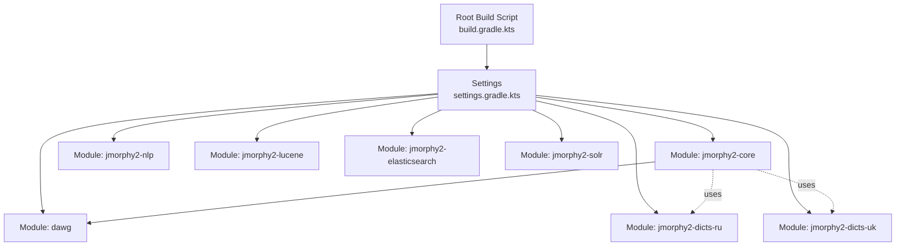
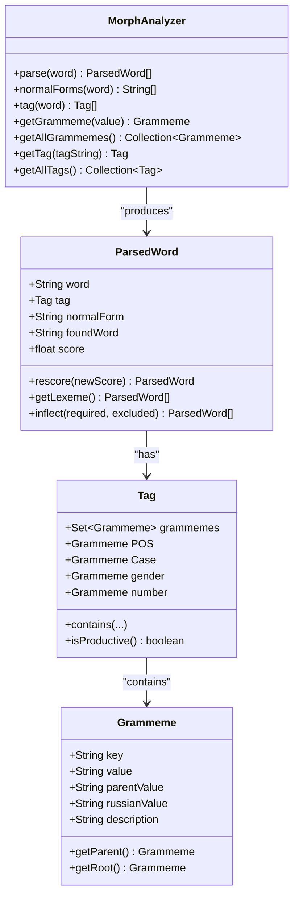
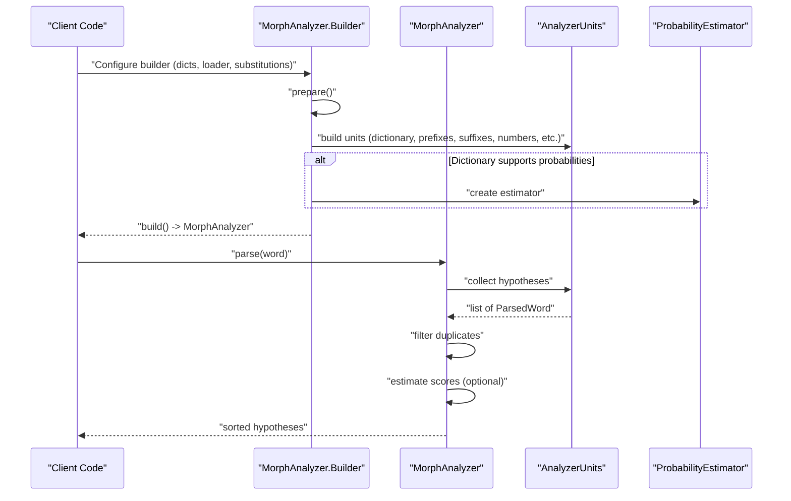
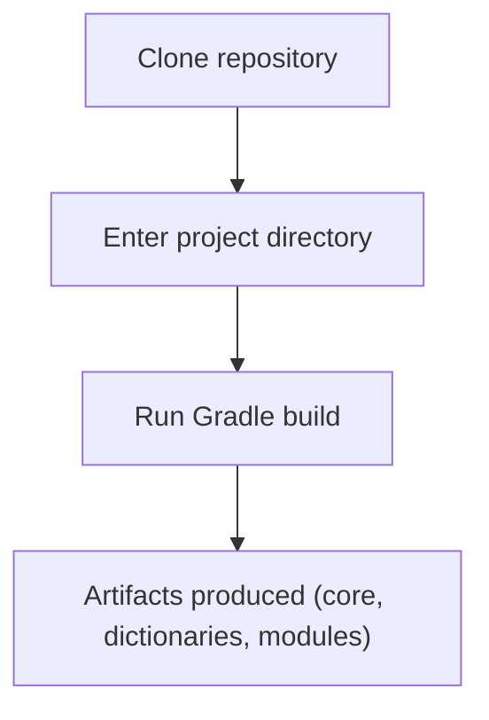
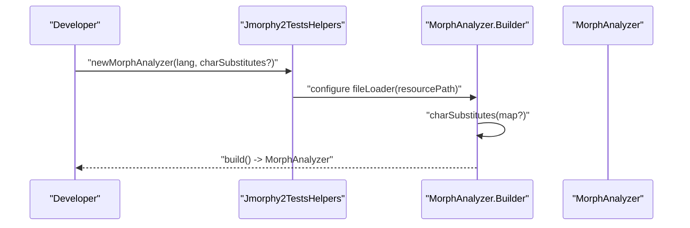

# Getting Started

<cite>
**Referenced Files in This Document**
- [README.md](file://README.md)
- [build.gradle.kts](file://build.gradle.kts)
- [settings.gradle.kts](file://settings.gradle.kts)
- [gradle-wrapper.properties](file://gradle/wrapper/gradle-wrapper.properties)
- [project.version](file://project.version)
- [MorphAnalyzer.java](file://jmorphy2-core/src/main/java/company/evo/jmorphy2/MorphAnalyzer.java)
- [ParsedWord.java](file://jmorphy2-core/src/main/java/company/evo/jmorphy2/ParsedWord.java)
- [Tag.java](file://jmorphy2-core/src/main/java/company/evo/jmorphy2/Tag.java)
- [Grammeme.java](file://jmorphy2-core/src/main/java/company/evo/jmorphy2/Grammeme.java)
- [MorphAnalyzerRUTest.java](file://jmorphy2-core/src/test/java/company/evo/jmorphy2/MorphAnalyzerRUTest.java)
- [MorphAnalyzerUkTest.java](file://jmorphy2-core/src/test/java/company/evo/jmorphy2/MorphAnalyzerUkTest.java)
- [Jmorphy2TestsHelpers.java](file://jmorphy2-core/src/test/java/company/evo/jmorphy2/Jmorphy2TestsHelpers.java)
- [jmorphy2-dicts-ru README.md](file://jmorphy2-dicts-ru/README.md)
- [jmorphy2-dicts-uk README.md](file://jmorphy2-dicts-uk/README.md)
- [Versions.kt](file://buildSrc/src/main/kotlin/Versions.kt)
</cite>

## Table of Contents
1. [Introduction](#introduction)
2. [Project Structure](#project-structure)
3. [Core Components](#core-components)
4. [Architecture Overview](#architecture-overview)
5. [Installation and Setup](#installation-and-setup)
6. [Basic Usage Examples](#basic-usage-examples)
7. [Essential Configuration Options](#essential-configuration-options)
8. [Prerequisites and Background](#prerequisites-and-background)
9. [Verification and Troubleshooting](#verification-and-troubleshooting)
10. [Conclusion](#conclusion)

## Introduction
Jmorphy2 is a Java port of the Python library pymorphy2, providing fast and accurate morphological analysis for Russian and Ukrainian. It supports dictionary-based analysis, normalization to dictionary head forms, grammatical tagging, and paradigm generation with flexible inflection filtering. This guide helps you quickly install, configure, and use Jmorphy2 for morphological analysis of Russian and Ukrainian texts.

## Project Structure
Jmorphy2 is a multi-module Gradle project. The core module provides the analyzer and language units, while separate modules supply language-specific dictionaries. Additional modules integrate with Lucene, Elasticsearch, and NLP utilities.

**Diagram sources**
- [build.gradle.kts:1-21](file://build.gradle.kts#L1-L21)
- [settings.gradle.kts:1-12](file://settings.gradle.kts#L1-L12)

**Section sources**
- [build.gradle.kts:1-21](file://build.gradle.kts#L1-L21)
- [settings.gradle.kts:1-12](file://settings.gradle.kts#L1-L12)

## Core Components
- MorphAnalyzer: Main entry point for morphological analysis. Provides methods to parse words, compute normal forms, retrieve grammatical tags, and access grammeme metadata.
- ParsedWord: Represents a single analysis hypothesis with the surface form, normalized dictionary lemma, found dictionary head, grammatical tag, and a confidence score.
- Tag and Grammeme: Represent grammatical tags and their constituent grammemes, including part-of-speech, case, number, gender, animacy, and other features.
- Analyzer Units: Pluggable components that handle dictionary lookup, prefixes/suffixes, numbers, punctuation, Latin, Roman numerals, and unknown words.

**Diagram sources**
- [MorphAnalyzer.java:15-247](file://jmorphy2-core/src/main/java/company/evo/jmorphy2/MorphAnalyzer.java#L15-L247)
- [ParsedWord.java:9-89](file://jmorphy2-core/src/main/java/company/evo/jmorphy2/ParsedWord.java#L9-L89)
- [Tag.java:7-230](file://jmorphy2-core/src/main/java/company/evo/jmorphy2/Tag.java#L7-L230)
- [Grammeme.java:7-86](file://jmorphy2-core/src/main/java/company/evo/jmorphy2/Grammeme.java#L7-L86)

**Section sources**
- [MorphAnalyzer.java:15-247](file://jmorphy2-core/src/main/java/company/evo/jmorphy2/MorphAnalyzer.java#L15-L247)
- [ParsedWord.java:9-89](file://jmorphy2-core/src/main/java/company/evo/jmorphy2/ParsedWord.java#L9-L89)
- [Tag.java:7-230](file://jmorphy2-core/src/main/java/company/evo/jmorphy2/Tag.java#L7-L230)
- [Grammeme.java:7-86](file://jmorphy2-core/src/main/java/company/evo/jmorphy2/Grammeme.java#L7-L86)

## Architecture Overview
The analyzer composes multiple AnalyzerUnits that collectively parse an input word. Each unit contributes zero or more hypotheses. Hypotheses are deduplicated, optionally scored via dictionary probabilities, and ranked by score.

**Diagram sources**
- [MorphAnalyzer.java:52-104](file://jmorphy2-core/src/main/java/company/evo/jmorphy2/MorphAnalyzer.java#L52-L104)
- [MorphAnalyzer.java:178-200](file://jmorphy2-core/src/main/java/company/evo/jmorphy2/MorphAnalyzer.java#L178-L200)
- [MorphAnalyzer.java:202-232](file://jmorphy2-core/src/main/java/company/evo/jmorphy2/MorphAnalyzer.java#L202-L232)

**Section sources**
- [MorphAnalyzer.java:52-104](file://jmorphy2-core/src/main/java/company/evo/jmorphy2/MorphAnalyzer.java#L52-L104)
- [MorphAnalyzer.java:178-200](file://jmorphy2-core/src/main/java/company/evo/jmorphy2/MorphAnalyzer.java#L178-L200)
- [MorphAnalyzer.java:202-232](file://jmorphy2-core/src/main/java/company/evo/jmorphy2/MorphAnalyzer.java#L202-L232)

## Installation and Setup
There are several ways to bring Jmorphy2 into your project:

- Clone and build from source
- Add as Gradle dependency (published artifacts)
- Use prebuilt dictionaries modules

### Clone and Build from Source
- Clone the repository and enter the project directory.
- Build the project with Gradle to compile, test, and package the modules.

**Diagram sources**
- [README.md:8-19](file://README.md#L8-L19)
- [build.gradle.kts:1-21](file://build.gradle.kts#L1-L21)

**Section sources**
- [README.md:8-19](file://README.md#L8-L19)
- [build.gradle.kts:1-21](file://build.gradle.kts#L1-L21)

### Add as Gradle Dependency
- The project uses Maven Central for dependencies and publishes artifacts under the group identifier declared in the root build script.
- The current library version is derived from the project version file.

Key points:
- Group and artifact identifiers are defined in the root build script.
- Library version comes from the project version file.
- The core module declares dependencies on commons-io, noggit, and the DAWG module.

**Section sources**
- [build.gradle.kts:1-21](file://build.gradle.kts#L1-L21)
- [project.version:1-2](file://project.version#L1-L2)
- [jmorphy2-core/build.gradle.kts:5-14](file://jmorphy2-core/build.gradle.kts#L5-L14)

### Use Prebuilt Dictionaries Modules
- Separate modules provide Russian and Ukrainian dictionaries.
- These modules are included as test dependencies in the core module, indicating their role as runtime dictionary providers.

**Section sources**
- [jmorphy2-dicts-ru/README.md:1-10](file://jmorphy2-dicts-ru/README.md#L1-L10)
- [jmorphy2-dicts-uk/README.md:1-12](file://jmorphy2-dicts-uk/README.md#L1-L12)
- [jmorphy2-core/build.gradle.kts:11-13](file://jmorphy2-core/build.gradle.kts#L11-L13)

### Java Version and Wrapper
- The project targets Java 17.
- The Gradle wrapper distribution is configured in the wrapper properties.

**Section sources**
- [Versions.kt:36](file://buildSrc/src/main/kotlin/Versions.kt#L36)
- [gradle-wrapper.properties:1-6](file://gradle/wrapper/gradle-wrapper.properties#L1-L6)

## Basic Usage Examples
This section demonstrates how to analyze Russian and Ukrainian words using the analyzer. The examples follow the same pattern: create a MorphAnalyzer instance, parse a word, and inspect grammatical information.

### Create a MorphAnalyzer Instance
- Use the builder to configure the analyzer.
- Provide a dictionary resource path or a custom file loader.
- Optionally set character substitution rules for the language.

**Diagram sources**
- [Jmorphy2TestsHelpers.java:7-19](file://jmorphy2-core/src/test/java/company/evo/jmorphy2/Jmorphy2TestsHelpers.java#L7-L19)
- [MorphAnalyzer.java:101-104](file://jmorphy2-core/src/main/java/company/evo/jmorphy2/MorphAnalyzer.java#L101-L104)

**Section sources**
- [Jmorphy2TestsHelpers.java:7-19](file://jmorphy2-core/src/test/java/company/evo/jmorphy2/Jmorphy2TestsHelpers.java#L7-L19)
- [MorphAnalyzer.java:101-104](file://jmorphy2-core/src/main/java/company/evo/jmorphy2/MorphAnalyzer.java#L101-L104)

### Parse a Single Word (Russian)
- Parse a Russian word to obtain analysis hypotheses.
- Inspect the top hypothesis tag and grammemes.
- Retrieve normal forms and grammatical tags.

Example expectations (from tests):
- Parsing a Russian adjective in a specific case and gender yields multiple analyses with distinct grammatical tags and scores.
- Normal forms extraction returns canonical dictionary lemmas.

**Section sources**
- [MorphAnalyzerRUTest.java:30-142](file://jmorphy2-core/src/test/java/company/evo/jmorphy2/MorphAnalyzerRUTest.java#L30-L142)
- [MorphAnalyzer.java:147-172](file://jmorphy2-core/src/main/java/company/evo/jmorphy2/MorphAnalyzer.java#L147-L172)

### Extract Grammatical Information (Ukrainian)
- Parse a Ukrainian word and verify grammatical attributes such as part of speech, case, and gender.
- Use grammeme queries to check feature presence.

Example expectations (from tests):
- Parsing a Ukrainian adjective shows expected POS and case features.
- Multiple analyses may be returned for ambiguous forms.

**Section sources**
- [MorphAnalyzerUkTest.java:30-67](file://jmorphy2-core/src/test/java/company/evo/jmorphy2/MorphAnalyzerUkTest.java#L30-L67)
- [Tag.java:96-133](file://jmorphy2-core/src/main/java/company/evo/jmorphy2/Tag.java#L96-L133)

### Practical Example Workflows
- Normalization: Call the method that returns dictionary head forms for a given word.
- Tagging: Obtain grammatical tags for a word to programmatically inspect features.
- Paradigm Generation: Get the lexeme (full paradigm) for a word and filter by required or excluded grammematical features.

**Section sources**
- [MorphAnalyzer.java:147-172](file://jmorphy2-core/src/main/java/company/evo/jmorphy2/MorphAnalyzer.java#L147-L172)
- [ParsedWord.java:30-43](file://jmorphy2-core/src/main/java/company/evo/jmorphy2/ParsedWord.java#L30-L43)

## Essential Configuration Options
- Dictionary path or loader: Provide a dictionary resource path or a custom file loader. The builder defaults to a filesystem loader if none is supplied.
- Character substitutions: Configure language-specific character substitutes to normalize input before analysis.
- Units pipeline: The builder prepares a default pipeline including dictionary lookup, numbers, punctuation, Latin, known/unknown prefixes/suffixes, and unknown words. You can customize unit builders if needed.

**Section sources**
- [MorphAnalyzer.java:37-50](file://jmorphy2-core/src/main/java/company/evo/jmorphy2/MorphAnalyzer.java#L37-L50)
- [MorphAnalyzer.java:52-99](file://jmorphy2-core/src/main/java/company/evo/jmorphy2/MorphAnalyzer.java#L52-L99)

## Prerequisites and Background
- Java Programming: Familiarity with Java is required to instantiate analyzers, iterate over results, and use grammatical tags.
- Morphology Basics: Understanding of morphological analysis concepts such as lemmas, grammatical tags, cases, numbers, and genders will help interpret results.

[No sources needed since this section provides general guidance]

## Verification and Troubleshooting
- Verify installation by running the project build and tests.
- Confirm Java version compatibility (Java 17).
- Ensure dictionary resources are accessible via the configured loader or resource path.

Common checks:
- Build succeeds and tests pass.
- Analyzer parses example words and returns expected grammatical tags.
- Normal forms and lexeme generation work as demonstrated in tests.

**Section sources**
- [README.md:15-19](file://README.md#L15-L19)
- [Versions.kt:36](file://buildSrc/src/main/kotlin/Versions.kt#L36)
- [MorphAnalyzerRUTest.java:30-142](file://jmorphy2-core/src/test/java/company/evo/jmorphy2/MorphAnalyzerRUTest.java#L30-L142)
- [MorphAnalyzerUkTest.java:30-67](file://jmorphy2-core/src/test/java/company/evo/jmorphy2/MorphAnalyzerUkTest.java#L30-L67)

## Conclusion
You now have the essentials to install Jmorphy2, configure a MorphAnalyzer, and perform morphological analysis on Russian and Ukrainian texts. Use the builder to initialize the analyzer with appropriate dictionaries and substitutions, parse words to obtain grammatical hypotheses, and leverage normal forms and lexeme generation for downstream NLP tasks.