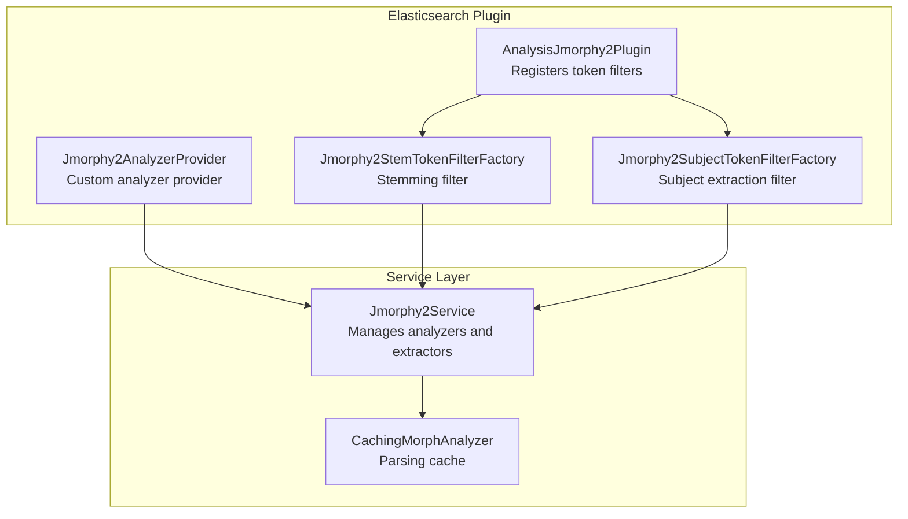
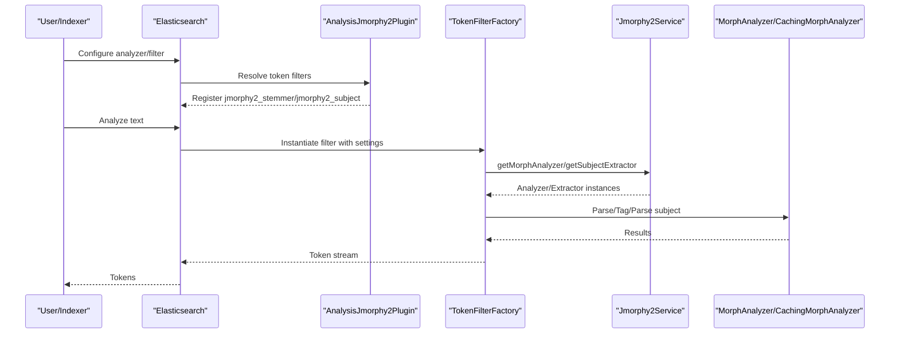
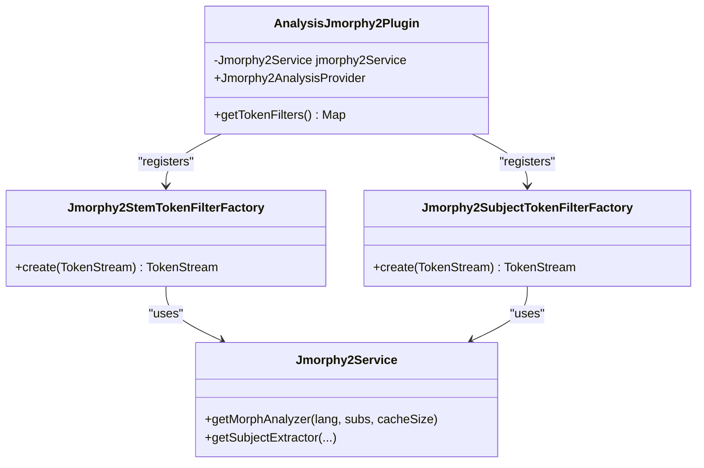
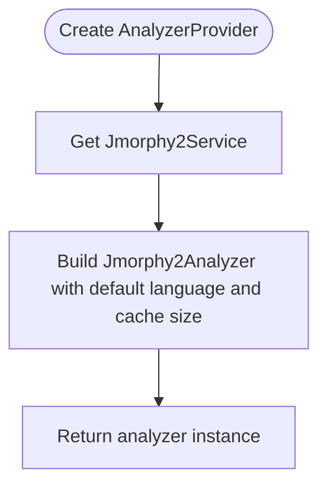
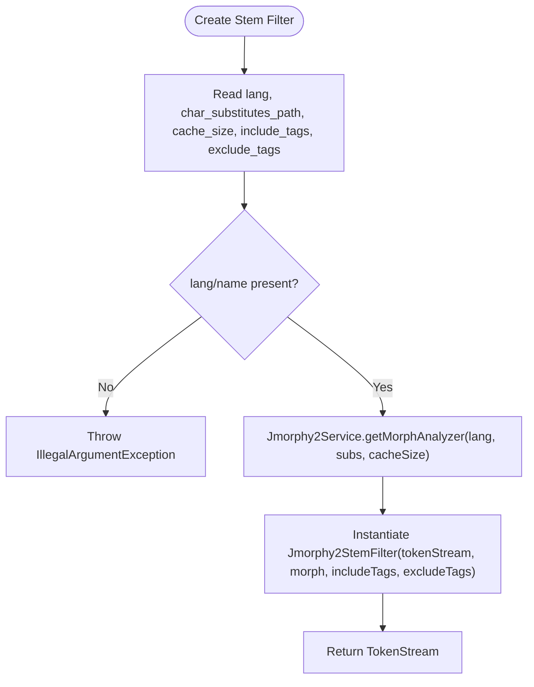
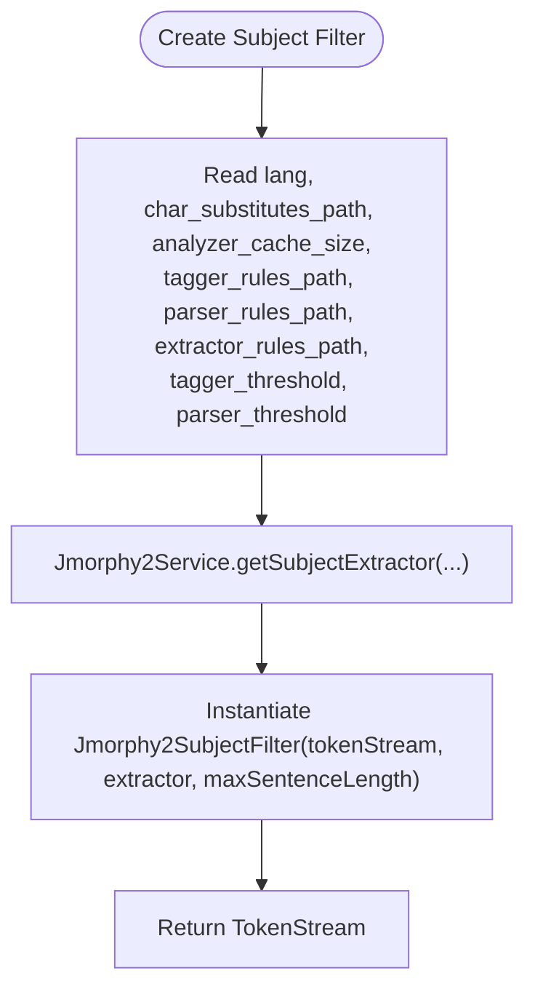
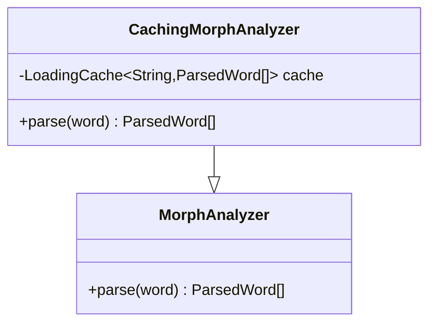
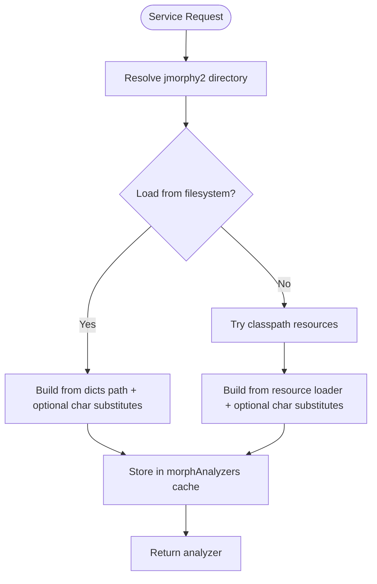
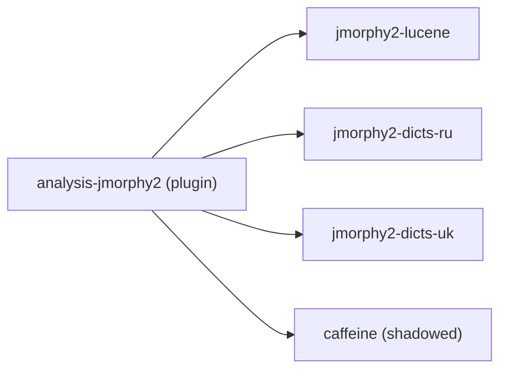

# Elasticsearch Integration

<cite>
**Referenced Files in This Document**
- [AnalysisJmorphy2Plugin.java](file://jmorphy2-elasticsearch/src/main/java/company/evo/jmorphy2/elasticsearch/plugin/AnalysisJmorphy2Plugin.java)
- [Jmorphy2AnalyzerProvider.java](file://jmorphy2-elasticsearch/src/main/java/company/evo/jmorphy2/elasticsearch/index/Jmorphy2AnalyzerProvider.java)
- [Jmorphy2StemTokenFilterFactory.java](file://jmorphy2-elasticsearch/src/main/java/company/evo/jmorphy2/elasticsearch/index/Jmorphy2StemTokenFilterFactory.java)
- [Jmorphy2SubjectTokenFilterFactory.java](file://jmorphy2-elasticsearch/src/main/java/company/evo/jmorphy2/elasticsearch/index/Jmorphy2SubjectTokenFilterFactory.java)
- [CachingMorphAnalyzer.java](file://jmorphy2-elasticsearch/src/main/java/company/evo/jmorphy2/elasticsearch/indices/CachingMorphAnalyzer.java)
- [Jmorphy2Service.java](file://jmorphy2-elasticsearch/src/main/java/company/evo/jmorphy2/elasticsearch/indices/Jmorphy2Service.java)
- [build.gradle.kts](file://jmorphy2-elasticsearch/build.gradle.kts)
- [README.md](file://README.md)
- [ES_8.x_Migration_Report_06a5fe0f.md](file://ES_8.x_Migration_Report_06a5fe0f.md)
- [Jmorphy2StemTokenFilterFactoryTests.java](file://jmorphy2-elasticsearch/src/test/java/company/evo/jmorphy2/elasticsearch/index/Jmorphy2StemTokenFilterFactoryTests.java)
- [Jmorphy2SubjectTokenFilterFactoryTests.java](file://jmorphy2-elasticsearch/src/test/java/company/evo/jmorphy2/elasticsearch/index/Jmorphy2SubjectTokenFilterFactoryTests.java)
- [Utils.java](file://jmorphy2-elasticsearch/src/test/java/company/evo/jmorphy2/elasticsearch/index/Utils.java)
- [Dockerfile.elasticsearch](file://Dockerfile.elasticsearch)
- [Versions.kt](file://buildSrc/src/main/kotlin/Versions.kt)
</cite>

## Table of Contents
1. [Introduction](#introduction)
2. [Project Structure](#project-structure)
3. [Core Components](#core-components)
4. [Architecture Overview](#architecture-overview)
5. [Detailed Component Analysis](#detailed-component-analysis)
6. [Dependency Analysis](#dependency-analysis)
7. [Performance Considerations](#performance-considerations)
8. [Troubleshooting Guide](#troubleshooting-guide)
9. [Conclusion](#conclusion)
10. [Appendices](#appendices)

## Introduction
This document explains how Jmorphy2 integrates with Elasticsearch to provide Russian and Ukrainian morphological processing. It covers the plugin architecture, custom token filters, analyzer provider, caching mechanisms, and service management. It also includes practical examples for installation, configuration, and mapping strategies tailored for Russian and Ukrainian text, along with compatibility notes for Elasticsearch 6.x through 8.x, deployment procedures, troubleshooting, and production tuning guidelines.

## Project Structure
The Elasticsearch integration lives in the jmorphy2-elasticsearch module. Key parts:
- Plugin registration and token filter providers
- Analyzer provider for custom analyzers
- Token filter factories for stemming and subject extraction
- Service layer managing dictionaries and NLP components
- Caching layer for morphological parsing
- Tests validating behavior and configuration
- Build and packaging for plugin distribution

**Diagram sources**
- [AnalysisJmorphy2Plugin.java:34-67](file://jmorphy2-elasticsearch/src/main/java/company/evo/jmorphy2/elasticsearch/plugin/AnalysisJmorphy2Plugin.java#L34-L67)
- [Jmorphy2AnalyzerProvider.java:29-51](file://jmorphy2-elasticsearch/src/main/java/company/evo/jmorphy2/elasticsearch/index/Jmorphy2AnalyzerProvider.java#L29-L51)
- [Jmorphy2StemTokenFilterFactory.java:37-72](file://jmorphy2-elasticsearch/src/main/java/company/evo/jmorphy2/elasticsearch/index/Jmorphy2StemTokenFilterFactory.java#L37-L72)
- [Jmorphy2SubjectTokenFilterFactory.java:35-77](file://jmorphy2-elasticsearch/src/main/java/company/evo/jmorphy2/elasticsearch/index/Jmorphy2SubjectTokenFilterFactory.java#L35-L77)
- [Jmorphy2Service.java:44-76](file://jmorphy2-elasticsearch/src/main/java/company/evo/jmorphy2/elasticsearch/indices/Jmorphy2Service.java#L44-L76)
- [CachingMorphAnalyzer.java:19-62](file://jmorphy2-elasticsearch/src/main/java/company/evo/jmorphy2/elasticsearch/indices/CachingMorphAnalyzer.java#L19-L62)

**Section sources**
- [AnalysisJmorphy2Plugin.java:34-67](file://jmorphy2-elasticsearch/src/main/java/company/evo/jmorphy2/elasticsearch/plugin/AnalysisJmorphy2Plugin.java#L34-L67)
- [build.gradle.kts:18-26](file://jmorphy2-elasticsearch/build.gradle.kts#L18-L26)

## Core Components
- AnalysisJmorphy2Plugin: Registers token filters and wires them to Jmorphy2Service.
- Jmorphy2AnalyzerProvider: Provides a custom analyzer backed by Jmorphy2.
- Jmorphy2StemTokenFilterFactory: Configurable stemming filter with language selection and tag filtering.
- Jmorphy2SubjectTokenFilterFactory: Subject extraction filter with configurable thresholds and rule paths.
- Jmorphy2Service: Central service resolving dictionaries and building analyzers/extractors with caching.
- CachingMorphAnalyzer: Wraps morphological parsing with a cache for performance.

**Section sources**
- [AnalysisJmorphy2Plugin.java:34-67](file://jmorphy2-elasticsearch/src/main/java/company/evo/jmorphy2/elasticsearch/plugin/AnalysisJmorphy2Plugin.java#L34-L67)
- [Jmorphy2AnalyzerProvider.java:29-51](file://jmorphy2-elasticsearch/src/main/java/company/evo/jmorphy2/elasticsearch/index/Jmorphy2AnalyzerProvider.java#L29-L51)
- [Jmorphy2StemTokenFilterFactory.java:37-72](file://jmorphy2-elasticsearch/src/main/java/company/evo/jmorphy2/elasticsearch/index/Jmorphy2StemTokenFilterFactory.java#L37-L72)
- [Jmorphy2SubjectTokenFilterFactory.java:35-77](file://jmorphy2-elasticsearch/src/main/java/company/evo/jmorphy2/elasticsearch/index/Jmorphy2SubjectTokenFilterFactory.java#L35-L77)
- [Jmorphy2Service.java:44-76](file://jmorphy2-elasticsearch/src/main/java/company/evo/jmorphy2/elasticsearch/indices/Jmorphy2Service.java#L44-L76)
- [CachingMorphAnalyzer.java:19-62](file://jmorphy2-elasticsearch/src/main/java/company/evo/jmorphy2/elasticsearch/indices/CachingMorphAnalyzer.java#L19-L62)

## Architecture Overview
The plugin exposes two token filters:
- jmorphy2_stemmer: performs stemming with optional include/exclude grammatical tags and caches parsed forms.
- jmorphy2_subject: extracts subjects using tagger, parser, and rules with configurable thresholds.

Both filters delegate to Jmorphy2Service, which resolves dictionaries from filesystem or classpath resources and constructs analyzers and extractors. Parsing results are cached to reduce repeated work.

**Diagram sources**
- [AnalysisJmorphy2Plugin.java:42-56](file://jmorphy2-elasticsearch/src/main/java/company/evo/jmorphy2/elasticsearch/plugin/AnalysisJmorphy2Plugin.java#L42-L56)
- [Jmorphy2StemTokenFilterFactory.java:45-66](file://jmorphy2-elasticsearch/src/main/java/company/evo/jmorphy2/elasticsearch/index/Jmorphy2StemTokenFilterFactory.java#L45-L66)
- [Jmorphy2SubjectTokenFilterFactory.java:39-71](file://jmorphy2-elasticsearch/src/main/java/company/evo/jmorphy2/elasticsearch/index/Jmorphy2SubjectTokenFilterFactory.java#L39-L71)
- [Jmorphy2Service.java:61-76](file://jmorphy2-elasticsearch/src/main/java/company/evo/jmorphy2/elasticsearch/indices/Jmorphy2Service.java#L61-L76)
- [CachingMorphAnalyzer.java:59-62](file://jmorphy2-elasticsearch/src/main/java/company/evo/jmorphy2/elasticsearch/indices/CachingMorphAnalyzer.java#L59-L62)

## Detailed Component Analysis

### Plugin Registration and Providers
- AnalysisJmorphy2Plugin registers two token filters under names jmorphy2_stemmer and jmorphy2_subject. Each filter is backed by a dedicated factory that obtains a MorphAnalyzer or SubjectExtractor from Jmorphy2Service.
- The plugin defines a Jmorphy2AnalysisProvider marker interface indicating that analysis settings are required.

**Diagram sources**
- [AnalysisJmorphy2Plugin.java:34-67](file://jmorphy2-elasticsearch/src/main/java/company/evo/jmorphy2/elasticsearch/plugin/AnalysisJmorphy2Plugin.java#L34-L67)
- [Jmorphy2StemTokenFilterFactory.java:37-72](file://jmorphy2-elasticsearch/src/main/java/company/evo/jmorphy2/elasticsearch/index/Jmorphy2StemTokenFilterFactory.java#L37-L72)
- [Jmorphy2SubjectTokenFilterFactory.java:35-77](file://jmorphy2-elasticsearch/src/main/java/company/evo/jmorphy2/elasticsearch/index/Jmorphy2SubjectTokenFilterFactory.java#L35-L77)
- [Jmorphy2Service.java:61-76](file://jmorphy2-elasticsearch/src/main/java/company/evo/jmorphy2/elasticsearch/indices/Jmorphy2Service.java#L61-L76)

**Section sources**
- [AnalysisJmorphy2Plugin.java:42-67](file://jmorphy2-elasticsearch/src/main/java/company/evo/jmorphy2/elasticsearch/plugin/AnalysisJmorphy2Plugin.java#L42-L67)

### Analyzer Provider
- Jmorphy2AnalyzerProvider creates a Jmorphy2Analyzer bound to a default language and a fixed cache size for stemming. It delegates dictionary resolution to Jmorphy2Service.

**Diagram sources**
- [Jmorphy2AnalyzerProvider.java:29-51](file://jmorphy2-elasticsearch/src/main/java/company/evo/jmorphy2/elasticsearch/index/Jmorphy2AnalyzerProvider.java#L29-L51)
- [Jmorphy2Service.java:61-64](file://jmorphy2-elasticsearch/src/main/java/company/evo/jmorphy2/elasticsearch/indices/Jmorphy2Service.java#L61-L64)

**Section sources**
- [Jmorphy2AnalyzerProvider.java:29-51](file://jmorphy2-elasticsearch/src/main/java/company/evo/jmorphy2/elasticsearch/index/Jmorphy2AnalyzerProvider.java#L29-L51)

### Stemming Filter Factory
- Jmorphy2StemTokenFilterFactory reads language, character substitution path, cache size, and include/exclude tag lists from settings. It validates presence of language and constructs a MorphAnalyzer via Jmorphy2Service. The resulting filter applies stemming with tag filtering.

**Diagram sources**
- [Jmorphy2StemTokenFilterFactory.java:45-71](file://jmorphy2-elasticsearch/src/main/java/company/evo/jmorphy2/elasticsearch/index/Jmorphy2StemTokenFilterFactory.java#L45-L71)
- [Jmorphy2Service.java:61-64](file://jmorphy2-elasticsearch/src/main/java/company/evo/jmorphy2/elasticsearch/indices/Jmorphy2Service.java#L61-L64)

**Section sources**
- [Jmorphy2StemTokenFilterFactory.java:37-72](file://jmorphy2-elasticsearch/src/main/java/company/evo/jmorphy2/elasticsearch/index/Jmorphy2StemTokenFilterFactory.java#L37-L72)

### Subject Extraction Filter Factory
- Jmorphy2SubjectTokenFilterFactory reads language, substitutions, analyzer cache size, and rule paths for tagger, parser, and extractor. It builds a SubjectExtractor via Jmorphy2Service and wraps tokens with a subject-extraction filter. Thresholds can be tuned.

**Diagram sources**
- [Jmorphy2SubjectTokenFilterFactory.java:39-76](file://jmorphy2-elasticsearch/src/main/java/company/evo/jmorphy2/elasticsearch/index/Jmorphy2SubjectTokenFilterFactory.java#L39-L76)
- [Jmorphy2Service.java:66-76](file://jmorphy2-elasticsearch/src/main/java/company/evo/jmorphy2/elasticsearch/indices/Jmorphy2Service.java#L66-L76)

**Section sources**
- [Jmorphy2SubjectTokenFilterFactory.java:35-77](file://jmorphy2-elasticsearch/src/main/java/company/evo/jmorphy2/elasticsearch/index/Jmorphy2SubjectTokenFilterFactory.java#L35-L77)

### Caching Mechanism
- CachingMorphAnalyzer extends the base morphological analyzer and caches parsed forms using a LoadingCache keyed by word. The cache size is configurable and controlled by the factory settings.

**Diagram sources**
- [CachingMorphAnalyzer.java:19-62](file://jmorphy2-elasticsearch/src/main/java/company/evo/jmorphy2/elasticsearch/indices/CachingMorphAnalyzer.java#L19-L62)

**Section sources**
- [CachingMorphAnalyzer.java:19-62](file://jmorphy2-elasticsearch/src/main/java/company/evo/jmorphy2/elasticsearch/indices/CachingMorphAnalyzer.java#L19-L62)

### Service Management
- Jmorphy2Service centralizes dictionary resolution and component construction:
  - Resolves jmorphy2 directory from settings or defaults to config/jmorphy2.
  - Loads morphological analyzers from filesystem or classpath resources.
  - Builds subject extractors with optional rule sets and thresholds.
  - Maintains concurrent caches keyed by configuration to avoid redundant construction.

**Diagram sources**
- [Jmorphy2Service.java:78-127](file://jmorphy2-elasticsearch/src/main/java/company/evo/jmorphy2/elasticsearch/indices/Jmorphy2Service.java#L78-L127)

**Section sources**
- [Jmorphy2Service.java:44-127](file://jmorphy2-elasticsearch/src/main/java/company/evo/jmorphy2/elasticsearch/indices/Jmorphy2Service.java#L44-L127)

## Dependency Analysis
- The plugin depends on jmorphy2-lucene for the underlying analyzer and filters, and on jmorphy2-dicts-ru and jmorphy2-dicts-uk for language-specific dictionaries.
- The build process packages caffeine for caching and shadows dependencies into the plugin artifact.

**Diagram sources**
- [build.gradle.kts:51-61](file://jmorphy2-elasticsearch/build.gradle.kts#L51-L61)

**Section sources**
- [build.gradle.kts:51-61](file://jmorphy2-elasticsearch/build.gradle.kts#L51-L61)

## Performance Considerations
- Enable caching for morphological parsing via cache_size in the stemmer filter to reduce repeated parse calls.
- Tune include_tags and exclude_tags to limit expensive analyses to relevant grammatical categories.
- For subject extraction, adjust tagger_threshold and parser_threshold to balance precision/recall vs. performance.
- Use appropriate max_sentence_length to cap computational cost during parsing.
- Prefer filesystem-backed dictionaries for predictable I/O characteristics; classpath resources are convenient but may incur overhead on cold starts.

[No sources needed since this section provides general guidance]

## Troubleshooting Guide
Common issues and resolutions:
- Missing language configuration: Both token filters require a language setting; ensure lang or name is provided.
- Missing dictionary: If the configured language lacks dictionaries in filesystem or resources, construction fails. Verify jmorphy2 directory and language subfolders.
- Character substitutions path invalid: Ensure the path resolves to an existing file under the config directory.
- Rule files not found: For subject extraction, ensure tagger_rules_path, parser_rules_path, and extractor_rules_path point to readable files under config.
- Analyzer reuse: If changing cache_size or substitutions, expect new analyzer instances due to caching keys; restart affected nodes or re-create indices to pick up new settings.

**Section sources**
- [Jmorphy2StemTokenFilterFactory.java:52-65](file://jmorphy2-elasticsearch/src/main/java/company/evo/jmorphy2/elasticsearch/index/Jmorphy2StemTokenFilterFactory.java#L52-L65)
- [Jmorphy2SubjectTokenFilterFactory.java:46-70](file://jmorphy2-elasticsearch/src/main/java/company/evo/jmorphy2/elasticsearch/index/Jmorphy2SubjectTokenFilterFactory.java#L46-L70)
- [Jmorphy2Service.java:89-127](file://jmorphy2-elasticsearch/src/main/java/company/evo/jmorphy2/elasticsearch/indices/Jmorphy2Service.java#L89-L127)

## Conclusion
The Jmorphy2 Elasticsearch plugin integrates Russian and Ukrainian morphological processing through configurable token filters and analyzers. Jmorphy2Service centralizes dictionary resolution and component construction, while CachingMorphAnalyzer optimizes parsing throughput. Proper configuration of language, cache sizes, and thresholds enables robust indexing and querying for Slavic languages.

[No sources needed since this section summarizes without analyzing specific files]

## Appendices

### Installation and Deployment
- Debian package or elasticsearch-plugin install commands are documented in the project README.
- Containerized deployment is supported via a Dockerfile that installs the plugin into an Elasticsearch image.

Practical steps:
- Install the plugin using the release package or elasticsearch-plugin command.
- Place dictionaries under config/jmorphy2/<lang>/pymorphy2_dicts and optional NLP rule files under config/jmorphy2/<lang>.
- Restart nodes or recreate indices to apply new settings.

**Section sources**
- [README.md:23-77](file://README.md#L23-L77)
- [Dockerfile.elasticsearch:1-9](file://Dockerfile.elasticsearch#L1-L9)

### Configuration Examples
- Configure analyzers and filters in index settings YAML. Example analyzers for Russian and Ukrainian are provided in the README, including word delimiter and lowercase filters combined with jmorphy2_stemmer.

Field mapping strategies:
- Map text fields requiring morphological normalization to analyzers using jmorphy2_stemmer.
- For subject-focused queries, consider analyzers using jmorphy2_subject to extract canonical noun phrases.

Query optimization techniques:
- Use keyword or completion suggesters on stemmed/subject-normalized fields for fast lookups.
- Combine filtered aggregations with normalized fields to improve relevance.

**Section sources**
- [README.md:84-141](file://README.md#L84-L141)

### Compatibility and Version Notes
- Supported Elasticsearch versions include 6.6.x through 7.14.x as noted in the README.
- Migration to Elasticsearch 8.x requires substantial changes:
  - Update Java to 17, Lucene to 9.x, and Gradle/Kotlin versions accordingly.
  - Adjust plugin constructor and factory signatures to align with ES 8.x APIs.
  - Update artifact names and SPI requirements for Lucene 9.
  - Align build-tools and OS package plugin versions.

Target version recommendation:
- ES 8.15.0 with Lucene 9.11.1 is recommended for stability.

**Section sources**
- [README.md:41-56](file://README.md#L41-L56)
- [ES_8.x_Migration_Report_06a5fe0f.md:2-12](file://ES_8.x_Migration_Report_06a5fe0f.md#L2-L12)
- [ES_8.x_Migration_Report_06a5fe0f.md:26-93](file://ES_8.x_Migration_Report_06a5fe0f.md#L26-L93)
- [ES_8.x_Migration_Report_06a5fe0f.md:139-187](file://ES_8.x_Migration_Report_06a5fe0f.md#L139-L187)
- [Versions.kt:36-82](file://buildSrc/src/main/kotlin/Versions.kt#L36-L82)

### Testing and Validation
- Unit tests demonstrate expected tokenization outcomes for Russian and Ukrainian texts.
- Test utilities copy required dictionary and rule files into a temporary config directory for reproducible runs.

Validation tips:
- Run analyzer tests locally to confirm expected stems and subjects.
- Compare results across languages to ensure consistent behavior.

**Section sources**
- [Jmorphy2StemTokenFilterFactoryTests.java:35-83](file://jmorphy2-elasticsearch/src/test/java/company/evo/jmorphy2/elasticsearch/index/Jmorphy2StemTokenFilterFactoryTests.java#L35-L83)
- [Jmorphy2SubjectTokenFilterFactoryTests.java:36-82](file://jmorphy2-elasticsearch/src/test/java/company/evo/jmorphy2/elasticsearch/index/Jmorphy2SubjectTokenFilterFactoryTests.java#L36-L82)
- [Utils.java:29-73](file://jmorphy2-elasticsearch/src/test/java/company/evo/jmorphy2/elasticsearch/index/Utils.java#L29-L73)