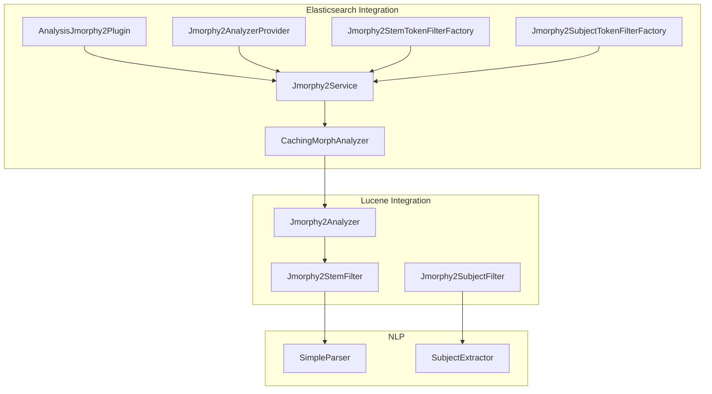
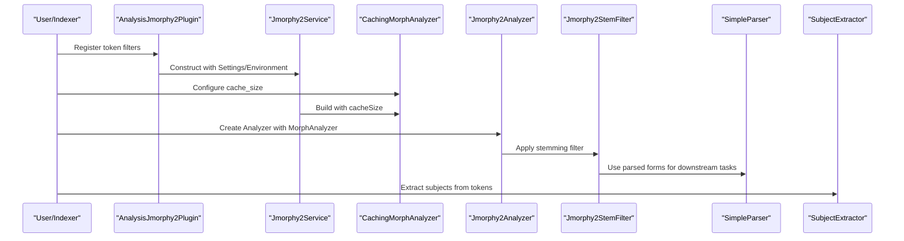
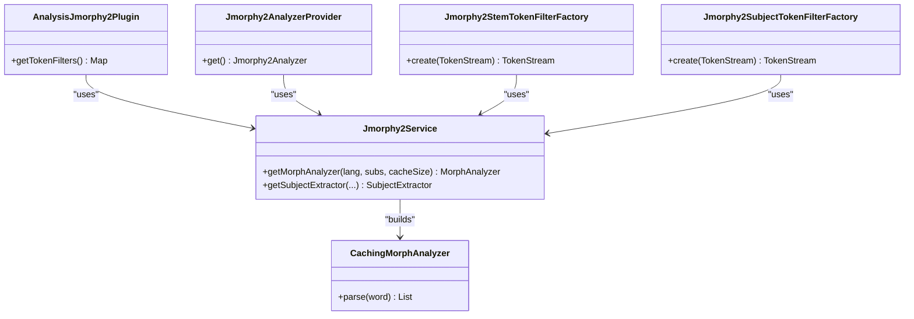
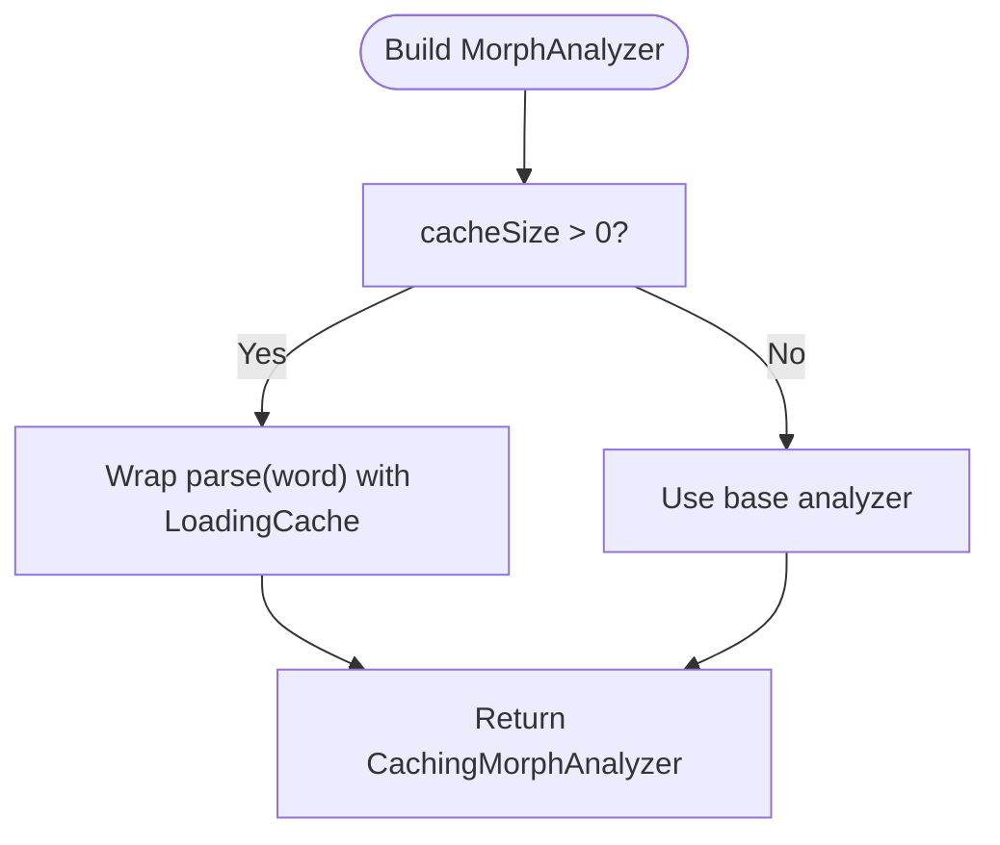
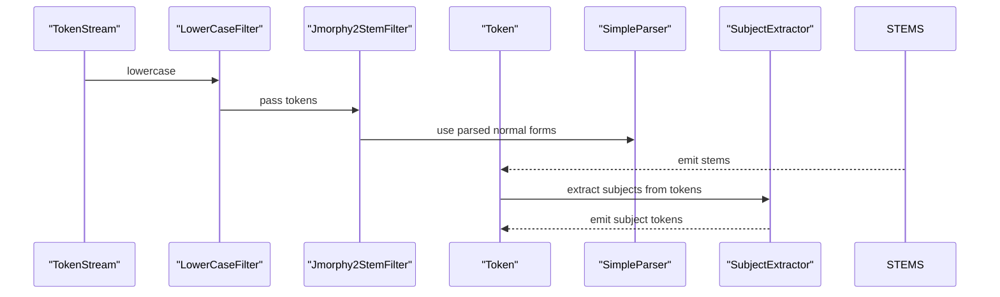
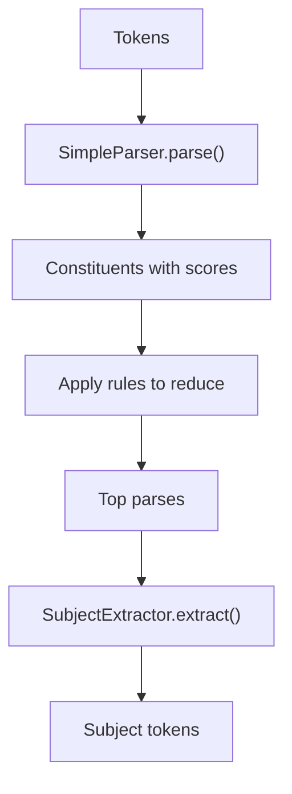
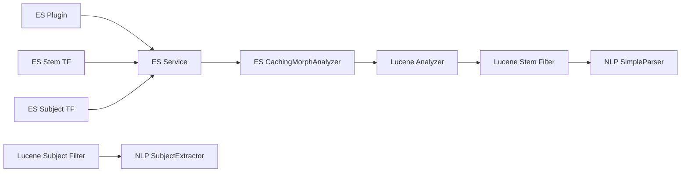

# Integration Modules

<cite>
**Referenced Files in This Document**
- [README.md](file://README.md)
- [AnalysisJmorphy2Plugin.java](file://jmorphy2-elasticsearch/src/main/java/company/evo/jmorphy2/elasticsearch/plugin/AnalysisJmorphy2Plugin.java)
- [Jmorphy2AnalyzerProvider.java](file://jmorphy2-elasticsearch/src/main/java/company/evo/jmorphy2/elasticsearch/index/Jmorphy2AnalyzerProvider.java)
- [Jmorphy2StemTokenFilterFactory.java](file://jmorphy2-elasticsearch/src/main/java/company/evo/jmorphy2/elasticsearch/index/Jmorphy2StemTokenFilterFactory.java)
- [Jmorphy2SubjectTokenFilterFactory.java](file://jmorphy2-elasticsearch/src/main/java/company/evo/jmorphy2/elasticsearch/index/Jmorphy2SubjectTokenFilterFactory.java)
- [Jmorphy2Service.java](file://jmorphy2-elasticsearch/src/main/java/company/evo/jmorphy2/elasticsearch/indices/Jmorphy2Service.java)
- [CachingMorphAnalyzer.java](file://jmorphy2-elasticsearch/src/main/java/company/evo/jmorphy2/elasticsearch/indices/CachingMorphAnalyzer.java)
- [Jmorphy2Analyzer.java](file://jmorphy2-lucene/src/main/java/company/evo/jmorphy2/lucene/Jmorphy2Analyzer.java)
- [Jmorphy2StemFilter.java](file://jmorphy2-lucene/src/main/java/company/evo/jmorphy2/lucene/Jmorphy2StemFilter.java)
- [Jmorphy2SubjectFilter.java](file://jmorphy2-lucene/src/main/java/company/evo/jmorphy2/lucene/Jmorphy2SubjectFilter.java)
- [SubjectExtractor.java](file://jmorphy2-nlp/src/main/java/company/evo/jmorphy2/nlp/SubjectExtractor.java)
- [SimpleParser.java](file://jmorphy2-nlp/src/main/java/company/evo/jmorphy2/nlp/SimpleParser.java)
- [tagger_rules.txt (ES test)](file://jmorphy2-elasticsearch/src/test/resources/company/evo/jmorphy2/elasticsearch/index/ru/tagger_rules.txt)
- [parser_rules.txt (ES test)](file://jmorphy2-elasticsearch/src/test/resources/company/evo/jmorphy2/elasticsearch/index/ru/parser_rules.txt)
- [extract_rules.txt (ES test)](file://jmorphy2-elasticsearch/src/test/resources/company/evo/jmorphy2/elasticsearch/index/ru/extract_rules.txt)
- [tagger_rules.txt (Lucene test)](file://jmorphy2-lucene/src/test/resources/tagger_rules.txt)
- [parser_rules.txt (Lucene test)](file://jmorphy2-lucene/src/test/resources/parser_rules.txt)
- [phrases.txt (NLP test)](file://jmorphy2-nlp/src/test/resources/phrases.txt)
</cite>

## Table of Contents
1. [Introduction](#introduction)
2. [Project Structure](#project-structure)
3. [Core Components](#core-components)
4. [Architecture Overview](#architecture-overview)
5. [Detailed Component Analysis](#detailed-component-analysis)
6. [Dependency Analysis](#dependency-analysis)
7. [Performance Considerations](#performance-considerations)
8. [Troubleshooting Guide](#troubleshooting-guide)
9. [Conclusion](#conclusion)
10. [Appendices](#appendices)

## Introduction
This document explains the integration modules that extend Jmorphy2 beyond standalone morphological analysis. It covers:
- Elasticsearch plugin architecture with custom analyzers and token filters, plus caching
- Apache Lucene integration providing stemming and subject extraction filters
- NLP advanced features: context-free grammar parsing, rule-based phrase analysis, and semantic role labeling via subject extraction
- Practical configuration and usage examples
- Installation procedures, configuration options, performance tuning, and troubleshooting

## Project Structure
The repository organizes integrations by framework:
- Elasticsearch plugin and index-time filters
- Apache Lucene analyzer and token filters
- NLP components for parsing and subject extraction

**Diagram sources**
- [AnalysisJmorphy2Plugin.java:34-67](file://jmorphy2-elasticsearch/src/main/java/company/evo/jmorphy2/elasticsearch/plugin/AnalysisJmorphy2Plugin.java#L34-L67)
- [Jmorphy2Service.java:44-76](file://jmorphy2-elasticsearch/src/main/java/company/evo/jmorphy2/elasticsearch/indices/Jmorphy2Service.java#L44-L76)
- [Jmorphy2AnalyzerProvider.java:29-51](file://jmorphy2-elasticsearch/src/main/java/company/evo/jmorphy2/elasticsearch/index/Jmorphy2AnalyzerProvider.java#L29-L51)
- [Jmorphy2StemTokenFilterFactory.java:37-72](file://jmorphy2-elasticsearch/src/main/java/company/evo/jmorphy2/elasticsearch/index/Jmorphy2StemTokenFilterFactory.java#L37-L72)
- [Jmorphy2SubjectTokenFilterFactory.java:35-77](file://jmorphy2-elasticsearch/src/main/java/company/evo/jmorphy2/elasticsearch/index/Jmorphy2SubjectTokenFilterFactory.java#L35-L77)
- [CachingMorphAnalyzer.java:19-63](file://jmorphy2-elasticsearch/src/main/java/company/evo/jmorphy2/elasticsearch/indices/CachingMorphAnalyzer.java#L19-L63)
- [Jmorphy2Analyzer.java:17-41](file://jmorphy2-lucene/src/main/java/company/evo/jmorphy2/lucene/Jmorphy2Analyzer.java#L17-L41)
- [Jmorphy2StemFilter.java:21-183](file://jmorphy2-lucene/src/main/java/company/evo/jmorphy2/lucene/Jmorphy2StemFilter.java#L21-L183)
- [Jmorphy2SubjectFilter.java:17-85](file://jmorphy2-lucene/src/main/java/company/evo/jmorphy2/lucene/Jmorphy2SubjectFilter.java#L17-L85)
- [SimpleParser.java:15-175](file://jmorphy2-nlp/src/main/java/company/evo/jmorphy2/nlp/SimpleParser.java#L15-L175)
- [SubjectExtractor.java:11-116](file://jmorphy2-nlp/src/main/java/company/evo/jmorphy2/nlp/SubjectExtractor.java#L11-L116)

**Section sources**
- [README.md:21-141](file://README.md#L21-L141)

## Core Components
- Elasticsearch plugin registers token filters and optionally analyzers, backed by a service that manages morphological analyzers and subject extractors with caching.
- Lucene analyzer composes a standard tokenizer, lowercasing, and Jmorphy2 stemming; optional subject extraction filter extracts semantic roles.
- NLP stack provides a simple CFG parser and a rule-driven subject extractor.

**Section sources**
- [AnalysisJmorphy2Plugin.java:34-67](file://jmorphy2-elasticsearch/src/main/java/company/evo/jmorphy2/elasticsearch/plugin/AnalysisJmorphy2Plugin.java#L34-L67)
- [Jmorphy2AnalyzerProvider.java:29-51](file://jmorphy2-elasticsearch/src/main/java/company/evo/jmorphy2/elasticsearch/index/Jmorphy2AnalyzerProvider.java#L29-L51)
- [Jmorphy2StemTokenFilterFactory.java:37-72](file://jmorphy2-elasticsearch/src/main/java/company/evo/jmorphy2/elasticsearch/index/Jmorphy2StemTokenFilterFactory.java#L37-L72)
- [Jmorphy2SubjectTokenFilterFactory.java:35-77](file://jmorphy2-elasticsearch/src/main/java/company/evo/jmorphy2/elasticsearch/index/Jmorphy2SubjectTokenFilterFactory.java#L35-L77)
- [Jmorphy2Service.java:44-76](file://jmorphy2-elasticsearch/src/main/java/company/evo/jmorphy2/elasticsearch/indices/Jmorphy2Service.java#L44-L76)
- [CachingMorphAnalyzer.java:19-63](file://jmorphy2-elasticsearch/src/main/java/company/evo/jmorphy2/elasticsearch/indices/CachingMorphAnalyzer.java#L19-L63)
- [Jmorphy2Analyzer.java:17-41](file://jmorphy2-lucene/src/main/java/company/evo/jmorphy2/lucene/Jmorphy2Analyzer.java#L17-L41)
- [Jmorphy2StemFilter.java:21-183](file://jmorphy2-lucene/src/main/java/company/evo/jmorphy2/lucene/Jmorphy2StemFilter.java#L21-L183)
- [Jmorphy2SubjectFilter.java:17-85](file://jmorphy2-lucene/src/main/java/company/evo/jmorphy2/lucene/Jmorphy2SubjectFilter.java#L17-L85)
- [SimpleParser.java:15-175](file://jmorphy2-nlp/src/main/java/company/evo/jmorphy2/nlp/SimpleParser.java#L15-L175)
- [SubjectExtractor.java:11-116](file://jmorphy2-nlp/src/main/java/company/evo/jmorphy2/nlp/SubjectExtractor.java#L11-L116)

## Architecture Overview
The integrations share a layered design:
- Core morphological analysis is provided by a builder-backed analyzer with optional caching.
- Elasticsearch plugin exposes token filters and an analyzer provider; a service resolves dictionaries and builds analyzers/subject extractors with caches keyed by configuration.
- Lucene integration wraps the same morphological analyzer into an Analyzer and TokenFilters for stemming and subject extraction.
- NLP components (parser and subject extractor) operate on token sequences to produce syntactic structures and semantic roles.

**Diagram sources**
- [AnalysisJmorphy2Plugin.java:34-67](file://jmorphy2-elasticsearch/src/main/java/company/evo/jmorphy2/elasticsearch/plugin/AnalysisJmorphy2Plugin.java#L34-L67)
- [Jmorphy2Service.java:61-76](file://jmorphy2-elasticsearch/src/main/java/company/evo/jmorphy2/elasticsearch/indices/Jmorphy2Service.java#L61-L76)
- [CachingMorphAnalyzer.java:22-40](file://jmorphy2-elasticsearch/src/main/java/company/evo/jmorphy2/elasticsearch/indices/CachingMorphAnalyzer.java#L22-L40)
- [Jmorphy2Analyzer.java:29-32](file://jmorphy2-lucene/src/main/java/company/evo/jmorphy2/lucene/Jmorphy2Analyzer.java#L29-L32)
- [Jmorphy2StemFilter.java:26-61](file://jmorphy2-lucene/src/main/java/company/evo/jmorphy2/lucene/Jmorphy2StemFilter.java#L26-L61)
- [SimpleParser.java:23-43](file://jmorphy2-nlp/src/main/java/company/evo/jmorphy2/nlp/SimpleParser.java#L23-L43)
- [SubjectExtractor.java:18-22](file://jmorphy2-nlp/src/main/java/company/evo/jmorphy2/nlp/SubjectExtractor.java#L18-L22)

## Detailed Component Analysis

### Elasticsearch Plugin and Index-Time Filters
- Plugin registration: registers two token filters under names suitable for index analysis settings.
- Analyzer provider: constructs a Jmorphy2Analyzer backed by a cached morphological analyzer resolved by the service.
- Token filter factories:
  - Stem filter factory: resolves language, character substitutes, cache size, include/exclude grammeme tags, and builds a stemming filter.
  - Subject filter factory: resolves language, analyzer cache size, tagger/parser thresholds, and rules paths, then builds a subject extraction filter.

**Diagram sources**
- [AnalysisJmorphy2Plugin.java:34-67](file://jmorphy2-elasticsearch/src/main/java/company/evo/jmorphy2/elasticsearch/plugin/AnalysisJmorphy2Plugin.java#L34-L67)
- [Jmorphy2AnalyzerProvider.java:29-51](file://jmorphy2-elasticsearch/src/main/java/company/evo/jmorphy2/elasticsearch/index/Jmorphy2AnalyzerProvider.java#L29-L51)
- [Jmorphy2StemTokenFilterFactory.java:37-72](file://jmorphy2-elasticsearch/src/main/java/company/evo/jmorphy2/elasticsearch/index/Jmorphy2StemTokenFilterFactory.java#L37-L72)
- [Jmorphy2SubjectTokenFilterFactory.java:35-77](file://jmorphy2-elasticsearch/src/main/java/company/evo/jmorphy2/elasticsearch/index/Jmorphy2SubjectTokenFilterFactory.java#L35-L77)
- [Jmorphy2Service.java:61-76](file://jmorphy2-elasticsearch/src/main/java/company/evo/jmorphy2/elasticsearch/indices/Jmorphy2Service.java#L61-L76)
- [CachingMorphAnalyzer.java:19-63](file://jmorphy2-elasticsearch/src/main/java/company/evo/jmorphy2/elasticsearch/indices/CachingMorphAnalyzer.java#L19-L63)

**Section sources**
- [AnalysisJmorphy2Plugin.java:34-67](file://jmorphy2-elasticsearch/src/main/java/company/evo/jmorphy2/elasticsearch/plugin/AnalysisJmorphy2Plugin.java#L34-L67)
- [Jmorphy2AnalyzerProvider.java:29-51](file://jmorphy2-elasticsearch/src/main/java/company/evo/jmorphy2/elasticsearch/index/Jmorphy2AnalyzerProvider.java#L29-L51)
- [Jmorphy2StemTokenFilterFactory.java:37-72](file://jmorphy2-elasticsearch/src/main/java/company/evo/jmorphy2/elasticsearch/index/Jmorphy2StemTokenFilterFactory.java#L37-L72)
- [Jmorphy2SubjectTokenFilterFactory.java:35-77](file://jmorphy2-elasticsearch/src/main/java/company/evo/jmorphy2/elasticsearch/index/Jmorphy2SubjectTokenFilterFactory.java#L35-L77)
- [Jmorphy2Service.java:61-76](file://jmorphy2-elasticsearch/src/main/java/company/evo/jmorphy2/elasticsearch/indices/Jmorphy2Service.java#L61-L76)

### Caching Mechanism for Morphological Analysis
- A builder enables configuring cache size; when positive, a Caffeine cache wraps the base analyzer’s parse method.
- The Elasticsearch service caches analyzers and subject extractors keyed by configuration to avoid repeated construction.

**Diagram sources**
- [CachingMorphAnalyzer.java:22-40](file://jmorphy2-elasticsearch/src/main/java/company/evo/jmorphy2/elasticsearch/indices/CachingMorphAnalyzer.java#L22-L40)
- [Jmorphy2Service.java:61-64](file://jmorphy2-elasticsearch/src/main/java/company/evo/jmorphy2/elasticsearch/indices/Jmorphy2Service.java#L61-L64)

**Section sources**
- [CachingMorphAnalyzer.java:19-63](file://jmorphy2-elasticsearch/src/main/java/company/evo/jmorphy2/elasticsearch/indices/CachingMorphAnalyzer.java#L19-L63)
- [Jmorphy2Service.java:53-64](file://jmorphy2-elasticsearch/src/main/java/company/evo/jmorphy2/elasticsearch/indices/Jmorphy2Service.java#L53-L64)

### Apache Lucene Integration
- Analyzer: standard tokenizer plus lowercasing, followed by a stemming filter configured with include/exclude grammeme sets.
- Stemming filter: converts tokens to normalized forms, supports include/exclude grammeme filtering, and position increments.
- Subject extraction filter: collects up to a configurable sentence length, runs subject extraction, and emits matched tokens preserving positions.

**Diagram sources**
- [Jmorphy2Analyzer.java:34-40](file://jmorphy2-lucene/src/main/java/company/evo/jmorphy2/lucene/Jmorphy2Analyzer.java#L34-L40)
- [Jmorphy2StemFilter.java:92-121](file://jmorphy2-lucene/src/main/java/company/evo/jmorphy2/lucene/Jmorphy2StemFilter.java#L92-L121)
- [Jmorphy2SubjectFilter.java:51-76](file://jmorphy2-lucene/src/main/java/company/evo/jmorphy2/lucene/Jmorphy2SubjectFilter.java#L51-L76)
- [SimpleParser.java:23-43](file://jmorphy2-nlp/src/main/java/company/evo/jmorphy2/nlp/SimpleParser.java#L23-L43)
- [SubjectExtractor.java:45-65](file://jmorphy2-nlp/src/main/java/company/evo/jmorphy2/nlp/SubjectExtractor.java#L45-L65)

**Section sources**
- [Jmorphy2Analyzer.java:17-41](file://jmorphy2-lucene/src/main/java/company/evo/jmorphy2/lucene/Jmorphy2Analyzer.java#L17-L41)
- [Jmorphy2StemFilter.java:21-183](file://jmorphy2-lucene/src/main/java/company/evo/jmorphy2/lucene/Jmorphy2StemFilter.java#L21-L183)
- [Jmorphy2SubjectFilter.java:17-85](file://jmorphy2-lucene/src/main/java/company/evo/jmorphy2/lucene/Jmorphy2SubjectFilter.java#L17-L85)

### NLP Advanced Features: Parsing and Subject Extraction
- Simple context-free grammar parser applies a ruleset to reduce token sequences into constituents, scoring and limiting alternatives.
- Subject extractor traverses the parse tree, matching grammeme values against inclusion/exclusion rules and normalization options to extract semantic roles.

**Diagram sources**
- [SimpleParser.java:67-114](file://jmorphy2-nlp/src/main/java/company/evo/jmorphy2/nlp/SimpleParser.java#L67-L114)
- [SubjectExtractor.java:49-91](file://jmorphy2-nlp/src/main/java/company/evo/jmorphy2/nlp/SubjectExtractor.java#L49-L91)

**Section sources**
- [SimpleParser.java:15-175](file://jmorphy2-nlp/src/main/java/company/evo/jmorphy2/nlp/SimpleParser.java#L15-L175)
- [SubjectExtractor.java:11-116](file://jmorphy2-nlp/src/main/java/company/evo/jmorphy2/nlp/SubjectExtractor.java#L11-L116)

## Dependency Analysis
- Elasticsearch plugin depends on the service to supply analyzers and extractors.
- Token filter factories depend on the service and configuration to construct filters.
- Lucene analyzer and filters depend on the shared morphological analyzer.
- NLP components depend on the morphological analyzer and grammeme model.

**Diagram sources**
- [AnalysisJmorphy2Plugin.java:34-67](file://jmorphy2-elasticsearch/src/main/java/company/evo/jmorphy2/elasticsearch/plugin/AnalysisJmorphy2Plugin.java#L34-L67)
- [Jmorphy2Service.java:61-76](file://jmorphy2-elasticsearch/src/main/java/company/evo/jmorphy2/elasticsearch/indices/Jmorphy2Service.java#L61-L76)
- [Jmorphy2StemTokenFilterFactory.java:37-72](file://jmorphy2-elasticsearch/src/main/java/company/evo/jmorphy2/elasticsearch/index/Jmorphy2StemTokenFilterFactory.java#L37-L72)
- [Jmorphy2SubjectTokenFilterFactory.java:35-77](file://jmorphy2-elasticsearch/src/main/java/company/evo/jmorphy2/elasticsearch/index/Jmorphy2SubjectTokenFilterFactory.java#L35-L77)
- [CachingMorphAnalyzer.java:19-63](file://jmorphy2-elasticsearch/src/main/java/company/evo/jmorphy2/elasticsearch/indices/CachingMorphAnalyzer.java#L19-L63)
- [Jmorphy2Analyzer.java:17-41](file://jmorphy2-lucene/src/main/java/company/evo/jmorphy2/lucene/Jmorphy2Analyzer.java#L17-L41)
- [Jmorphy2StemFilter.java:21-183](file://jmorphy2-lucene/src/main/java/company/evo/jmorphy2/lucene/Jmorphy2StemFilter.java#L21-L183)
- [Jmorphy2SubjectFilter.java:17-85](file://jmorphy2-lucene/src/main/java/company/evo/jmorphy2/lucene/Jmorphy2SubjectFilter.java#L17-L85)
- [SimpleParser.java:15-175](file://jmorphy2-nlp/src/main/java/company/evo/jmorphy2/nlp/SimpleParser.java#L15-L175)
- [SubjectExtractor.java:11-116](file://jmorphy2-nlp/src/main/java/company/evo/jmorphy2/nlp/SubjectExtractor.java#L11-L116)

**Section sources**
- [Jmorphy2Service.java:44-76](file://jmorphy2-elasticsearch/src/main/java/company/evo/jmorphy2/elasticsearch/indices/Jmorphy2Service.java#L44-L76)

## Performance Considerations
- Enable analyzer caching in Elasticsearch via the cache_size setting to reduce repeated morphological parsing work.
- Use include/exclude grammeme filters in the stemming filter to narrow down normal forms and reduce downstream processing.
- Limit sentence length in the subject extraction filter to bound memory and CPU usage during parsing.
- Tune thresholds in the parser to prune unlikely derivations early.
- Place the stemming filter after lowercasing and before downstream filters to maximize recall of normalized forms.

[No sources needed since this section provides general guidance]

## Troubleshooting Guide
- Missing language configuration: token filter factories require a language setting; ensure lang is provided in filter settings.
- Dictionary not found: if the configured language lacks a dictionary, construction fails; verify dictionary availability in the configured location.
- Character substitutes path errors: ensure the path exists and is readable; otherwise, parsing substitutes may fail.
- Subject extractor thresholds: adjust tagger and parser thresholds to improve accuracy or performance depending on workload.
- Compatibility: Elasticsearch plugin versions are provided for specific major versions; use the appropriate release for your cluster.

**Section sources**
- [Jmorphy2StemTokenFilterFactory.java:52-65](file://jmorphy2-elasticsearch/src/main/java/company/evo/jmorphy2/elasticsearch/index/Jmorphy2StemTokenFilterFactory.java#L52-L65)
- [Jmorphy2SubjectTokenFilterFactory.java:46-68](file://jmorphy2-elasticsearch/src/main/java/company/evo/jmorphy2/elasticsearch/index/Jmorphy2SubjectTokenFilterFactory.java#L46-L68)
- [Jmorphy2Service.java:107-127](file://jmorphy2-elasticsearch/src/main/java/company/evo/jmorphy2/elasticsearch/indices/Jmorphy2Service.java#L107-L127)
- [README.md:21-78](file://README.md#L21-L78)

## Conclusion
These integration modules extend Jmorphy2 into production search platforms:
- Elasticsearch plugin delivers configurable analyzers and token filters with caching.
- Lucene integration provides stemming and subject extraction filters for embedded applications.
- NLP components enable advanced linguistic analysis for semantic role labeling and phrase understanding.

Together, they offer robust, configurable morphological processing suitable for multilingual full-text search and content analysis.

[No sources needed since this section summarizes without analyzing specific files]

## Appendices

### Installation Procedures
- Elasticsearch plugin installation via package or elasticsearch-plugin command is documented, including supported versions and building for specific versions.
- Docker and containerized testing approaches are also described.

**Section sources**
- [README.md:21-78](file://README.md#L21-L78)

### Configuration Options
- Elasticsearch token filters support:
  - lang or name (language selection)
  - char_substitutes_path (optional)
  - cache_size (default used if unspecified)
  - include_tags and exclude_tags (grammeme filters)
  - analyzer_cache_size, tagger_rules_path, parser_rules_path, extractor_rules_path, tagger_threshold, parser_threshold, max_sentence_length
- Analyzer provider supports default language and cache sizing.

**Section sources**
- [Jmorphy2StemTokenFilterFactory.java:52-65](file://jmorphy2-elasticsearch/src/main/java/company/evo/jmorphy2/elasticsearch/index/Jmorphy2StemTokenFilterFactory.java#L52-L65)
- [Jmorphy2SubjectTokenFilterFactory.java:52-71](file://jmorphy2-elasticsearch/src/main/java/company/evo/jmorphy2/elasticsearch/index/Jmorphy2SubjectTokenFilterFactory.java#L52-L71)
- [Jmorphy2AnalyzerProvider.java:30-44](file://jmorphy2-elasticsearch/src/main/java/company/evo/jmorphy2/elasticsearch/index/Jmorphy2AnalyzerProvider.java#L30-L44)

### Practical Examples
- Example index creation and analyzer testing are provided in the repository documentation, including Russian and Ukrainian analyzers.

**Section sources**
- [README.md:81-141](file://README.md#L81-L141)

### Rule Files and Test Data
- Rule files for tagger, parser, and extractor are included in test resources for both Elasticsearch and Lucene modules.
- Phrase corpora are available for testing NLP components.

**Section sources**
- [tagger_rules.txt (ES test):1-8](file://jmorphy2-elasticsearch/src/test/resources/company/evo/jmorphy2/elasticsearch/index/ru/tagger_rules.txt#L1-L8)
- [parser_rules.txt (ES test):1-36](file://jmorphy2-elasticsearch/src/test/resources/company/evo/jmorphy2/elasticsearch/index/ru/parser_rules.txt#L1-L36)
- [extract_rules.txt (ES test):1-2](file://jmorphy2-elasticsearch/src/test/resources/company/evo/jmorphy2/elasticsearch/index/ru/extract_rules.txt#L1-L2)
- [tagger_rules.txt (Lucene test):1-8](file://jmorphy2-lucene/src/test/resources/tagger_rules.txt#L1-L8)
- [parser_rules.txt (Lucene test):1-36](file://jmorphy2-lucene/src/test/resources/parser_rules.txt#L1-L36)
- [phrases.txt (NLP test):1-1001](file://jmorphy2-nlp/src/test/resources/phrases.txt#L1-L1001)