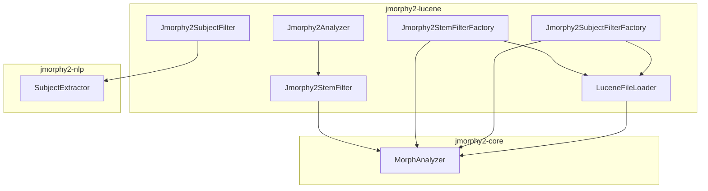
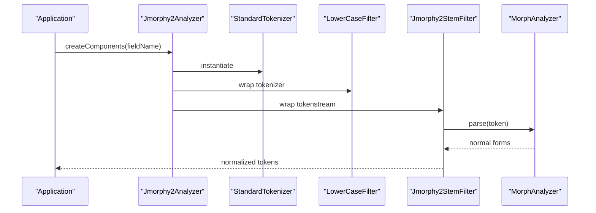
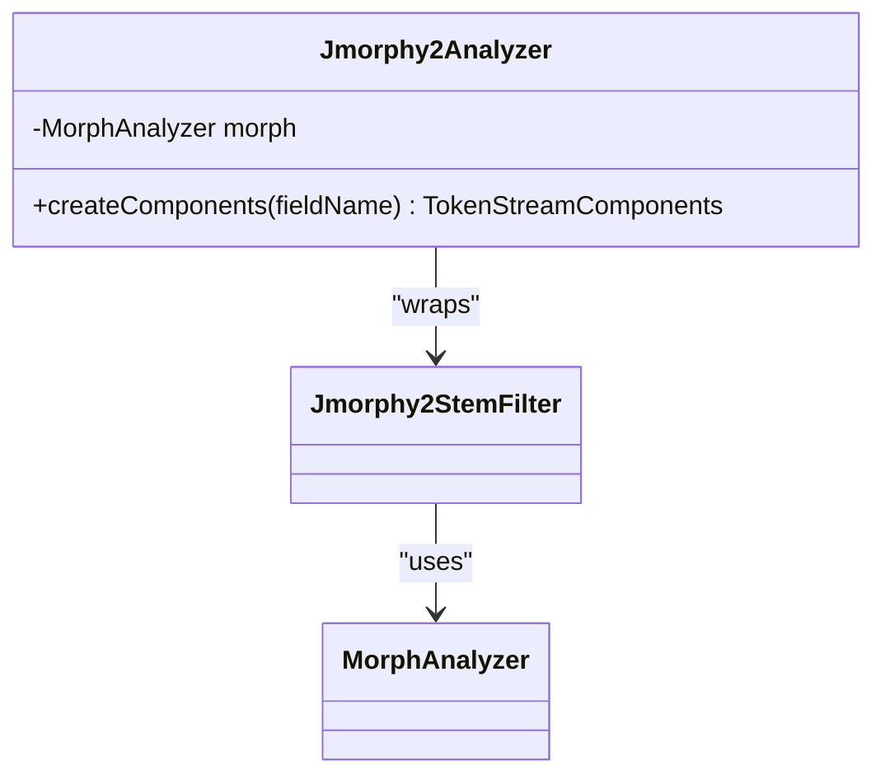
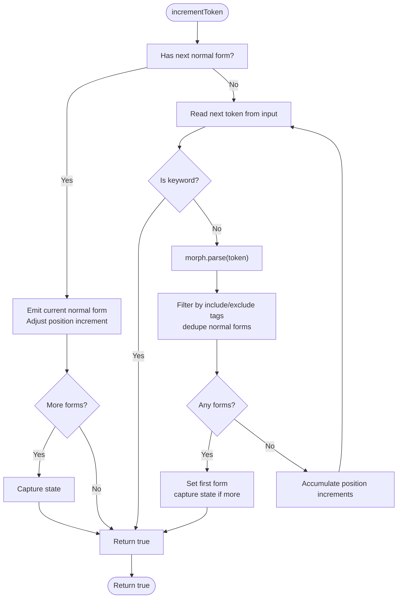
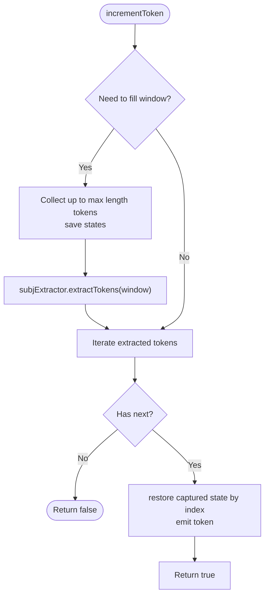
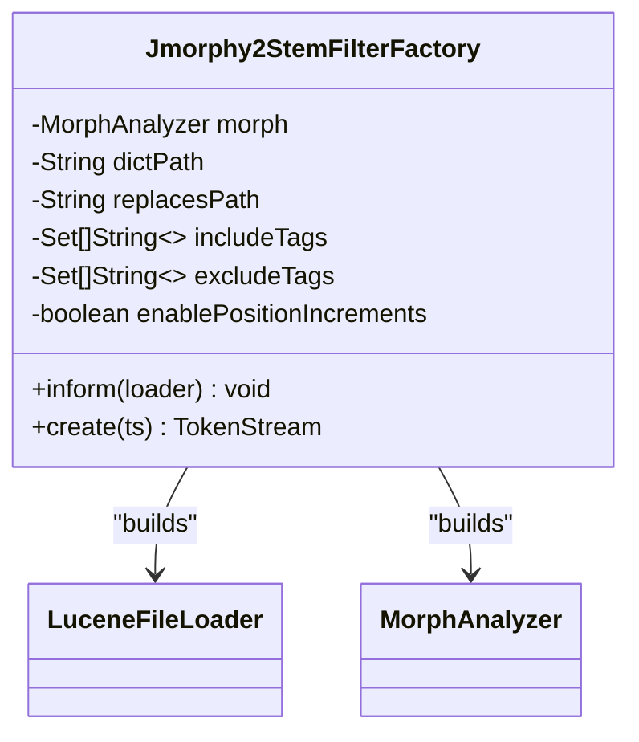
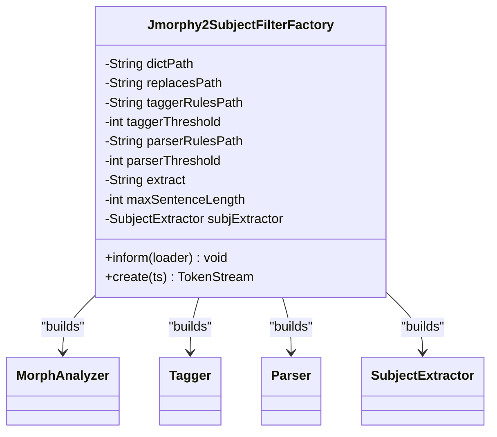
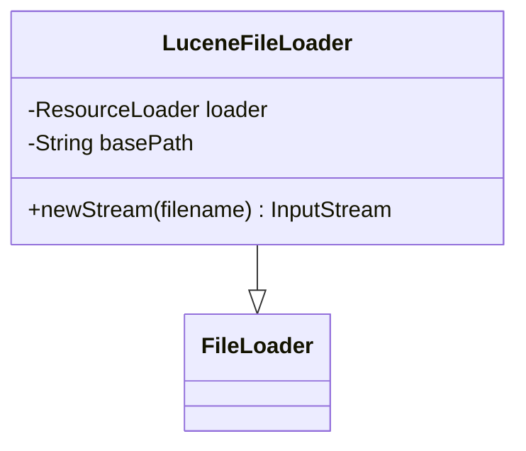
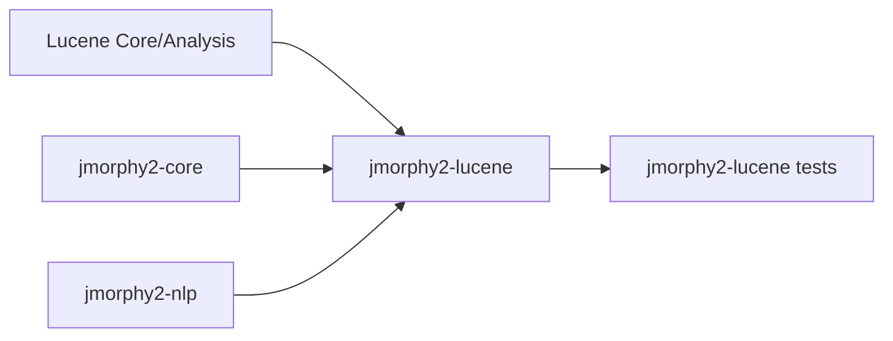

# Lucene Integration

<cite>
**Referenced Files in This Document**
- [Jmorphy2Analyzer.java](file://jmorphy2-lucene/src/main/java/company/evo/jmorphy2/lucene/Jmorphy2Analyzer.java)
- [Jmorphy2StemFilter.java](file://jmorphy2-lucene/src/main/java/company/evo/jmorphy2/lucene/Jmorphy2StemFilter.java)
- [Jmorphy2SubjectFilter.java](file://jmorphy2-lucene/src/main/java/company/evo/jmorphy2/lucene/Jmorphy2SubjectFilter.java)
- [Jmorphy2StemFilterFactory.java](file://jmorphy2-lucene/src/main/java/company/evo/jmorphy2/lucene/Jmorphy2StemFilterFactory.java)
- [Jmorphy2SubjectFilterFactory.java](file://jmorphy2-lucene/src/main/java/company/evo/jmorphy2/lucene/Jmorphy2SubjectFilterFactory.java)
- [LuceneFileLoader.java](file://jmorphy2-lucene/src/main/java/company/evo/jmorphy2/lucene/LuceneFileLoader.java)
- [MorphAnalyzer.java](file://jmorphy2-core/src/main/java/company/evo/jmorphy2/MorphAnalyzer.java)
- [BaseFilterTestCase.java](file://jmorphy2-lucene/src/test/java/company/evo/jmorphy2/lucene/BaseFilterTestCase.java)
- [Jmorphy2AnalyzerTest.java](file://jmorphy2-lucene/src/test/java/company/evo/jmorphy2/lucene/Jmorphy2AnalyzerTest.java)
- [Jmorphy2StemFilterTest.java](file://jmorphy2-lucene/src/test/java/company/evo/jmorphy2/lucene/Jmorphy2StemFilterTest.java)
- [Jmorphy2SubjectFilterTest.java](file://jmorphy2-lucene/src/test/java/company/evo/jmorphy2/lucene/Jmorphy2SubjectFilterTest.java)
- [parser_rules.txt](file://jmorphy2-lucene/src/test/resources/parser_rules.txt)
- [tagger_rules.txt](file://jmorphy2-lucene/src/test/resources/tagger_rules.txt)
- [jmorphy2-lucene build.gradle.kts](file://jmorphy2-lucene/build.gradle.kts)
- [root build.gradle.kts](file://build.gradle.kts)
- [Versions.kt](file://buildSrc/src/main/kotlin/Versions.kt)
</cite>

## Table of Contents
1. [Introduction](#introduction)
2. [Project Structure](#project-structure)
3. [Core Components](#core-components)
4. [Architecture Overview](#architecture-overview)
5. [Detailed Component Analysis](#detailed-component-analysis)
6. [Dependency Analysis](#dependency-analysis)
7. [Performance Considerations](#performance-considerations)
8. [Troubleshooting Guide](#troubleshooting-guide)
9. [Conclusion](#conclusion)
10. [Appendices](#appendices)

## Introduction
This document explains how to integrate morphological analysis into Apache Lucene applications using the jmorphy2 components. It focuses on:
- Creating custom analyzers with morphological stemming
- Applying filters for stemming and subject extraction
- Instantiating and configuring filters via factory classes
- Managing resources through Lucene’s ResourceLoader abstraction
- Practical examples for analyzer configuration, filter chains, and integration with IndexWriter/IndexReader
- Usage patterns for Russian and Ukrainian languages, field analysis strategies, and query processing optimizations
- Compatibility across Lucene versions, performance considerations, and best practices

## Project Structure
The Lucene integration lives primarily in the jmorphy2-lucene module, which depends on jmorphy2-core and jmorphy2-nlp. The module exposes:
- A ready-to-use Analyzer
- Token filters for stemming and subject extraction
- Factory classes for filter instantiation and configuration
- A ResourceLoader-aware FileLoader adapter

**Diagram sources**
- [Jmorphy2Analyzer.java:17-41](file://jmorphy2-lucene/src/main/java/company/evo/jmorphy2/lucene/Jmorphy2Analyzer.java#L17-L41)
- [Jmorphy2StemFilter.java:21-61](file://jmorphy2-lucene/src/main/java/company/evo/jmorphy2/lucene/Jmorphy2StemFilter.java#L21-L61)
- [Jmorphy2SubjectFilter.java:17-39](file://jmorphy2-lucene/src/main/java/company/evo/jmorphy2/lucene/Jmorphy2SubjectFilter.java#L17-L39)
- [Jmorphy2StemFilterFactory.java:22-80](file://jmorphy2-lucene/src/main/java/company/evo/jmorphy2/lucene/Jmorphy2StemFilterFactory.java#L22-L80)
- [Jmorphy2SubjectFilterFactory.java:23-93](file://jmorphy2-lucene/src/main/java/company/evo/jmorphy2/lucene/Jmorphy2SubjectFilterFactory.java#L23-L93)
- [LuceneFileLoader.java:12-24](file://jmorphy2-lucene/src/main/java/company/evo/jmorphy2/lucene/LuceneFileLoader.java#L12-L24)
- [MorphAnalyzer.java:15-105](file://jmorphy2-core/src/main/java/company/evo/jmorphy2/MorphAnalyzer.java#L15-L105)

**Section sources**
- [jmorphy2-lucene build.gradle.kts:5-17](file://jmorphy2-lucene/build.gradle.kts#L5-L17)
- [root build.gradle.kts:3-21](file://build.gradle.kts#L3-L21)

## Core Components
- Jmorphy2Analyzer: A convenience Analyzer that tokenizes, lowercases, and applies morphological stemming with default exclusion rules for parts-of-speech.
- Jmorphy2StemFilter: A TokenFilter that converts tokens to normalized forms using morphological analysis, optionally filtered by grammematical tags and position increments handling.
- Jmorphy2SubjectFilter: A TokenFilter that extracts subject-related tokens from a sentence-sized window using a SubjectExtractor built from tagger and parser rules.
- Jmorphy2StemFilterFactory and Jmorphy2SubjectFilterFactory: Factories that construct filters from Lucene configuration, loading dictionaries and rules via ResourceLoader and building MorphAnalyzer instances.
- LuceneFileLoader: Bridges jmorphy2’s FileLoader interface to Lucene’s ResourceLoader to load dictionary and replacement files from the Lucene resource path.

**Section sources**
- [Jmorphy2Analyzer.java:17-41](file://jmorphy2-lucene/src/main/java/company/evo/jmorphy2/lucene/Jmorphy2Analyzer.java#L17-L41)
- [Jmorphy2StemFilter.java:21-184](file://jmorphy2-lucene/src/main/java/company/evo/jmorphy2/lucene/Jmorphy2StemFilter.java#L21-L184)
- [Jmorphy2SubjectFilter.java:17-86](file://jmorphy2-lucene/src/main/java/company/evo/jmorphy2/lucene/Jmorphy2SubjectFilter.java#L17-L86)
- [Jmorphy2StemFilterFactory.java:22-110](file://jmorphy2-lucene/src/main/java/company/evo/jmorphy2/lucene/Jmorphy2StemFilterFactory.java#L22-L110)
- [Jmorphy2SubjectFilterFactory.java:23-109](file://jmorphy2-lucene/src/main/java/company/evo/jmorphy2/lucene/Jmorphy2SubjectFilterFactory.java#L23-L109)
- [LuceneFileLoader.java:12-26](file://jmorphy2-lucene/src/main/java/company/evo/jmorphy2/lucene/LuceneFileLoader.java#L12-L26)

## Architecture Overview
The integration follows Lucene’s Analyzer and TokenFilter architecture. Filters operate on Lucene’s TokenStream pipeline, leveraging jmorphy2’s MorphAnalyzer for morphological parsing and normalization.

**Diagram sources**
- [Jmorphy2Analyzer.java:34-40](file://jmorphy2-lucene/src/main/java/company/evo/jmorphy2/lucene/Jmorphy2Analyzer.java#L34-L40)
- [Jmorphy2StemFilter.java:92-121](file://jmorphy2-lucene/src/main/java/company/evo/jmorphy2/lucene/Jmorphy2StemFilter.java#L92-L121)
- [MorphAnalyzer.java:178-200](file://jmorphy2-core/src/main/java/company/evo/jmorphy2/MorphAnalyzer.java#L178-L200)

## Detailed Component Analysis

### Jmorphy2Analyzer
- Purpose: Provides a complete analyzer pipeline: StandardTokenizer → LowerCaseFilter → Jmorphy2StemFilter.
- Defaults: Excludes pronouns, prepositions, conjunctions, particles, and interjections by default during stemming.
- Integration: Suitable for indexing Russian and Ukrainian text fields requiring morphological normalization.

**Diagram sources**
- [Jmorphy2Analyzer.java:17-41](file://jmorphy2-lucene/src/main/java/company/evo/jmorphy2/lucene/Jmorphy2Analyzer.java#L17-L41)
- [Jmorphy2StemFilter.java:21-61](file://jmorphy2-lucene/src/main/java/company/evo/jmorphy2/lucene/Jmorphy2StemFilter.java#L21-L61)
- [MorphAnalyzer.java:15-105](file://jmorphy2-core/src/main/java/company/evo/jmorphy2/MorphAnalyzer.java#L15-L105)

**Section sources**
- [Jmorphy2Analyzer.java:17-41](file://jmorphy2-lucene/src/main/java/company/evo/jmorphy2/lucene/Jmorphy2Analyzer.java#L17-L41)

### Jmorphy2StemFilter
- Purpose: Converts tokens to normalized (lemmatized) forms using MorphAnalyzer.parse.
- Filtering: Supports include/exclude grammematical tags; deduplicates normal forms; preserves positions or adjusts increments.
- Behavior: Skips keyword tokens; handles multi-form tokens by emitting multiple tokens with proper position increments.

**Diagram sources**
- [Jmorphy2StemFilter.java:92-182](file://jmorphy2-lucene/src/main/java/company/evo/jmorphy2/lucene/Jmorphy2StemFilter.java#L92-L182)

**Section sources**
- [Jmorphy2StemFilter.java:21-184](file://jmorphy2-lucene/src/main/java/company/evo/jmorphy2/lucene/Jmorphy2StemFilter.java#L21-L184)

### Jmorphy2SubjectFilter
- Purpose: Extracts subject-related tokens from a sentence-sized window using a SubjectExtractor built from tagger and parser rules.
- Windowing: Reads up to a configurable maximum sentence length, captures token states, and replays them for extracted tokens.
- Positioning: Adjusts position increments to reflect original positions.

**Diagram sources**
- [Jmorphy2SubjectFilter.java:50-84](file://jmorphy2-lucene/src/main/java/company/evo/jmorphy2/lucene/Jmorphy2SubjectFilter.java#L50-L84)

**Section sources**
- [Jmorphy2SubjectFilter.java:17-86](file://jmorphy2-lucene/src/main/java/company/evo/jmorphy2/lucene/Jmorphy2SubjectFilter.java#L17-L86)

### Jmorphy2StemFilterFactory
- Purpose: Creates Jmorphy2StemFilter instances from Lucene configuration.
- Configuration:
  - dict: Path to dictionaries (default: pymorphy2_dicts)
  - replaces: JSON mapping of character substitutes
  - includeTags/excludeTags: Grammatical tag sets to include or exclude
  - enablePositionIncrements: Whether to preserve or adjust position increments
- Resource loading: Uses LuceneFileLoader to open resources via ResourceLoader.

**Diagram sources**
- [Jmorphy2StemFilterFactory.java:22-80](file://jmorphy2-lucene/src/main/java/company/evo/jmorphy2/lucene/Jmorphy2StemFilterFactory.java#L22-L80)
- [LuceneFileLoader.java:12-24](file://jmorphy2-lucene/src/main/java/company/evo/jmorphy2/lucene/LuceneFileLoader.java#L12-L24)
- [MorphAnalyzer.java:101-105](file://jmorphy2-core/src/main/java/company/evo/jmorphy2/MorphAnalyzer.java#L101-L105)

**Section sources**
- [Jmorphy2StemFilterFactory.java:22-110](file://jmorphy2-lucene/src/main/java/company/evo/jmorphy2/lucene/Jmorphy2StemFilterFactory.java#L22-L110)

### Jmorphy2SubjectFilterFactory
- Purpose: Creates Jmorphy2SubjectFilter instances from Lucene configuration.
- Configuration:
  - dict, replaces: Same as stem filter
  - taggerRules, taggerThreshold: Rules and threshold for tagging
  - parserRules, parserThreshold: Rules and threshold for parsing
  - extract: Extraction strategy for subjects
  - maxSentenceLength: Maximum window size for subject extraction
- Resource loading: Builds MorphAnalyzer, Tagger, Parser, and SubjectExtractor using ResourceLoader.

**Diagram sources**
- [Jmorphy2SubjectFilterFactory.java:23-93](file://jmorphy2-lucene/src/main/java/company/evo/jmorphy2/lucene/Jmorphy2SubjectFilterFactory.java#L23-L93)

**Section sources**
- [Jmorphy2SubjectFilterFactory.java:23-109](file://jmorphy2-lucene/src/main/java/company/evo/jmorphy2/lucene/Jmorphy2SubjectFilterFactory.java#L23-L109)

### LuceneFileLoader
- Purpose: Adapts jmorphy2’s FileLoader to Lucene’s ResourceLoader so dictionary and replacement files can be loaded from the Lucene resource path.
- Behavior: Resolves relative paths under a base path and opens InputStreams via ResourceLoader.

**Diagram sources**
- [LuceneFileLoader.java:12-24](file://jmorphy2-lucene/src/main/java/company/evo/jmorphy2/lucene/LuceneFileLoader.java#L12-L24)

**Section sources**
- [LuceneFileLoader.java:12-26](file://jmorphy2-lucene/src/main/java/company/evo/jmorphy2/lucene/LuceneFileLoader.java#L12-L26)

## Dependency Analysis
- jmorphy2-lucene depends on:
  - jmorphy2-core for MorphAnalyzer and morphological units
  - jmorphy2-nlp for SubjectExtractor and NLP components
  - Lucene core and analysis-common for Analyzer, TokenStream, and ResourceLoader
- Build-time Lucene version resolution is derived from Elasticsearch version mapping.

**Diagram sources**
- [jmorphy2-lucene build.gradle.kts:5-17](file://jmorphy2-lucene/build.gradle.kts#L5-L17)
- [root build.gradle.kts:3-21](file://build.gradle.kts#L3-L21)

**Section sources**
- [jmorphy2-lucene build.gradle.kts:5-17](file://jmorphy2-lucene/build.gradle.kts#L5-L17)
- [root build.gradle.kts:3-21](file://build.gradle.kts#L3-L21)
- [Versions.kt:47-108](file://buildSrc/src/main/kotlin/Versions.kt#L47-L108)

## Performance Considerations
- Filter ordering: Place Jmorphy2StemFilter after LowerCaseFilter to normalize casing before morphological analysis.
- Position increments: Enabling position increments helps preserve phrase and proximity matching; disabling can reduce overhead when not needed.
- Tag filtering: Narrow includeTags or use excludeTags to limit candidate normal forms and reduce downstream processing.
- Sentence window: Subject extraction is bounded by maxSentenceLength; tune this to balance recall and performance.
- Resource loading: Using LuceneFileLoader avoids filesystem I/O overhead by leveraging Lucene’s resource caching.

[No sources needed since this section provides general guidance]

## Troubleshooting Guide
Common issues and resolutions:
- Missing dictionary resources
  - Symptom: IOException when opening dictionary files.
  - Resolution: Ensure dict path exists under the Lucene resource path and matches the configured base path.
  - Related code: [LuceneFileLoader.java:21-24](file://jmorphy2-lucene/src/main/java/company/evo/jmorphy2/lucene/LuceneFileLoader.java#L21-L24)
- Incorrect replace characters mapping
  - Symptom: Malformed character substitutions.
  - Resolution: Verify JSON mapping keys are single characters; factory validates this and throws IOException otherwise.
  - Related code: [Jmorphy2StemFilterFactory.java:96-108](file://jmorphy2-lucene/src/main/java/company/evo/jmorphy2/lucene/Jmorphy2StemFilterFactory.java#L96-L108), [Jmorphy2SubjectFilterFactory.java:95-107](file://jmorphy2-lucene/src/main/java/company/evo/jmorphy2/lucene/Jmorphy2SubjectFilterFactory.java#L95-L107)
- Unexpected empty results from stemming
  - Symptom: No tokens emitted.
  - Resolution: Check include/exclude tag sets; ensure defaults are appropriate for your corpus; verify tokenization precedes stemming.
  - Related code: [Jmorphy2StemFilter.java:133-161](file://jmorphy2-lucene/src/main/java/company/evo/jmorphy2/lucene/Jmorphy2StemFilter.java#L133-L161)
- Subject extraction yields no tokens
  - Symptom: Empty subject stream.
  - Resolution: Increase maxSentenceLength; verify tagger/parser rules; confirm extract strategy is supported.
  - Related code: [Jmorphy2SubjectFilter.java:52-69](file://jmorphy2-lucene/src/main/java/company/evo/jmorphy2/lucene/Jmorphy2SubjectFilter.java#L52-L69), [Jmorphy2SubjectFilterFactory.java:76-89](file://jmorphy2-lucene/src/main/java/company/evo/jmorphy2/lucene/Jmorphy2SubjectFilterFactory.java#L76-L89)

**Section sources**
- [LuceneFileLoader.java:21-24](file://jmorphy2-lucene/src/main/java/company/evo/jmorphy2/lucene/LuceneFileLoader.java#L21-L24)
- [Jmorphy2StemFilterFactory.java:96-108](file://jmorphy2-lucene/src/main/java/company/evo/jmorphy2/lucene/Jmorphy2StemFilterFactory.java#L96-L108)
- [Jmorphy2SubjectFilterFactory.java:95-107](file://jmorphy2-lucene/src/main/java/company/evo/jmorphy2/lucene/Jmorphy2SubjectFilterFactory.java#L95-L107)
- [Jmorphy2StemFilter.java:133-161](file://jmorphy2-lucene/src/main/java/company/evo/jmorphy2/lucene/Jmorphy2StemFilter.java#L133-L161)
- [Jmorphy2SubjectFilter.java:52-69](file://jmorphy2-lucene/src/main/java/company/evo/jmorphy2/lucene/Jmorphy2SubjectFilter.java#L52-L69)

## Conclusion
The jmorphy2 Lucene integration provides robust morphological analysis for Russian and Ukrainian text. By combining Jmorphy2Analyzer, Jmorphy2StemFilter, and Jmorphy2SubjectFilter with their respective factories and LuceneFileLoader, developers can build efficient analyzers and filters tailored to their domain. Proper configuration of tag filtering, sentence windows, and position increments ensures strong indexing and query performance.

[No sources needed since this section summarizes without analyzing specific files]

## Appendices

### Practical Examples and Usage Patterns
- Analyzer configuration in tests
  - Example usage of Jmorphy2Analyzer and assertions for expected normal forms and positions:
    - [Jmorphy2AnalyzerTest.java:22-54](file://jmorphy2-lucene/src/test/java/company/evo/jmorphy2/lucene/Jmorphy2AnalyzerTest.java#L22-L54)
  - Example usage of Jmorphy2StemFilter with include/exclude tags and position increments:
    - [Jmorphy2StemFilterTest.java:36-49](file://jmorphy2-lucene/src/test/java/company/evo/jmorphy2/lucene/Jmorphy2StemFilterTest.java#L36-L49)
  - Example usage of Jmorphy2SubjectFilter with sentence window and subject extraction:
    - [Jmorphy2SubjectFilterTest.java:60-85](file://jmorphy2-lucene/src/test/java/company/evo/jmorphy2/lucene/Jmorphy2SubjectFilterTest.java#L60-L85)
- Field analysis strategies
  - Use Jmorphy2Analyzer for general-purpose morphological indexing.
  - Compose custom analyzers with Jmorphy2StemFilter and/or Jmorphy2SubjectFilter depending on retrieval needs (e.g., subject-focused queries).
- Query processing optimizations
  - Normalize query terms using the same stemmer to match indexed normal forms.
  - For phrase queries, consider enabling position increments to preserve adjacency.
- Integration with IndexWriter and IndexReader
  - Configure analyzers per field in your IndexWriter configuration.
  - Use IndexReader to retrieve stored fields and re-analyze queries with the same pipeline for consistent normalization.

**Section sources**
- [Jmorphy2AnalyzerTest.java:22-54](file://jmorphy2-lucene/src/test/java/company/evo/jmorphy2/lucene/Jmorphy2AnalyzerTest.java#L22-L54)
- [Jmorphy2StemFilterTest.java:36-49](file://jmorphy2-lucene/src/test/java/company/evo/jmorphy2/lucene/Jmorphy2StemFilterTest.java#L36-L49)
- [Jmorphy2SubjectFilterTest.java:60-85](file://jmorphy2-lucene/src/test/java/company/evo/jmorphy2/lucene/Jmorphy2SubjectFilterTest.java#L60-L85)

### Compatibility and Version Notes
- Lucene version selection is derived from Elasticsearch version mapping in build scripts.
- Ensure your Lucene version aligns with the resolved version used by the build.

**Section sources**
- [Versions.kt:47-108](file://buildSrc/src/main/kotlin/Versions.kt#L47-L108)
- [jmorphy2-lucene build.gradle.kts:6-7](file://jmorphy2-lucene/build.gradle.kts#L6-L7)

### Resource Configuration References
- Parser rules used in tests:
  - [parser_rules.txt:1-36](file://jmorphy2-lucene/src/test/resources/parser_rules.txt#L1-L36)
- Tagger rules used in tests:
  - [tagger_rules.txt:1-8](file://jmorphy2-lucene/src/test/resources/tagger_rules.txt#L1-L8)

**Section sources**
- [parser_rules.txt:1-36](file://jmorphy2-lucene/src/test/resources/parser_rules.txt#L1-L36)
- [tagger_rules.txt:1-8](file://jmorphy2-lucene/src/test/resources/tagger_rules.txt#L1-L8)