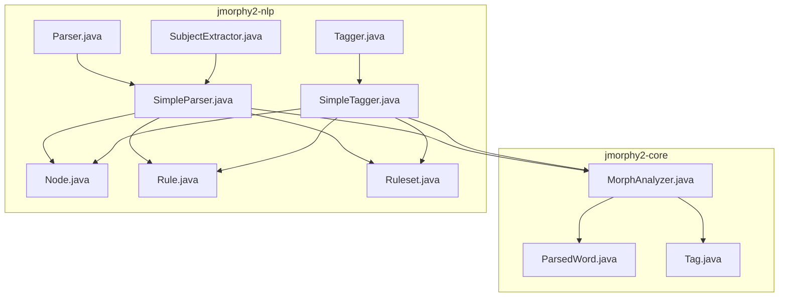
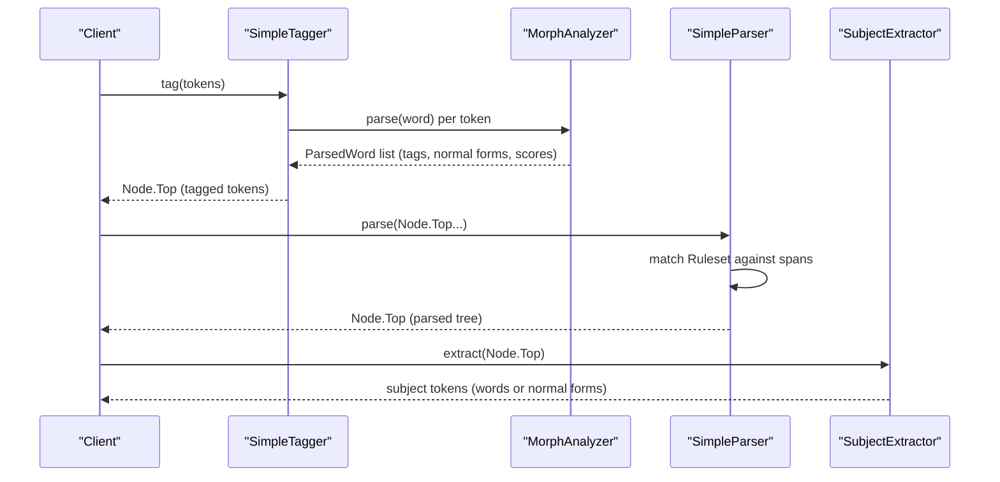
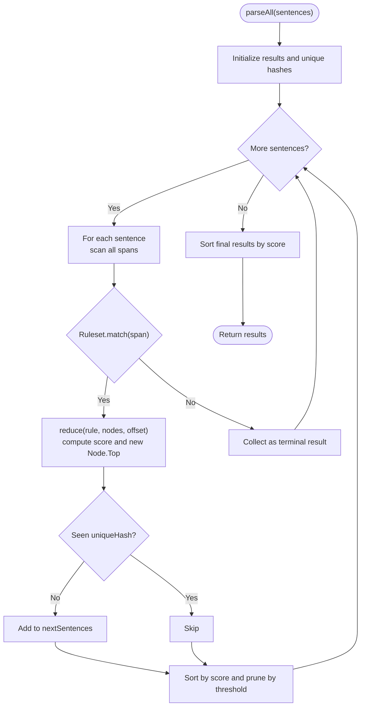
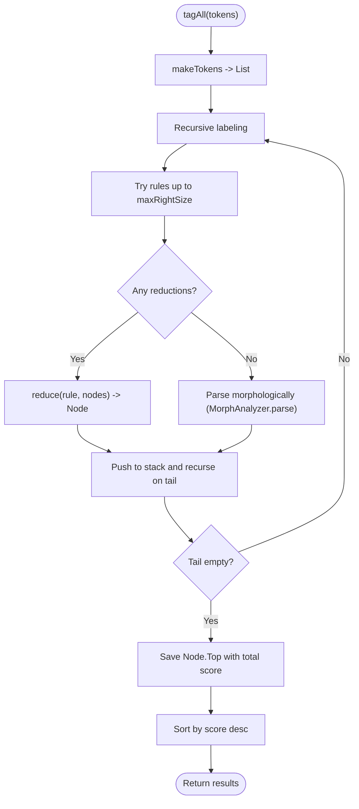
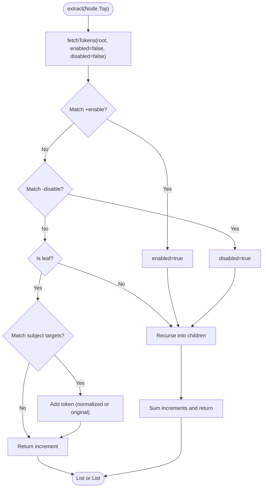
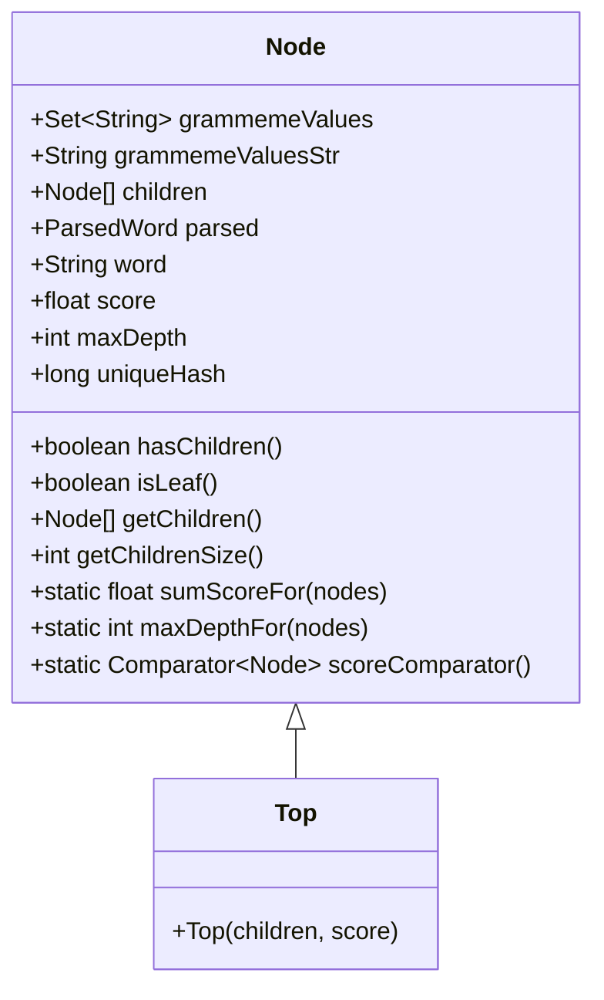
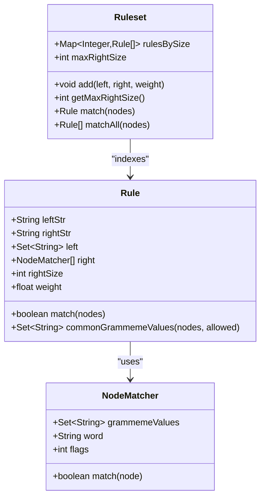
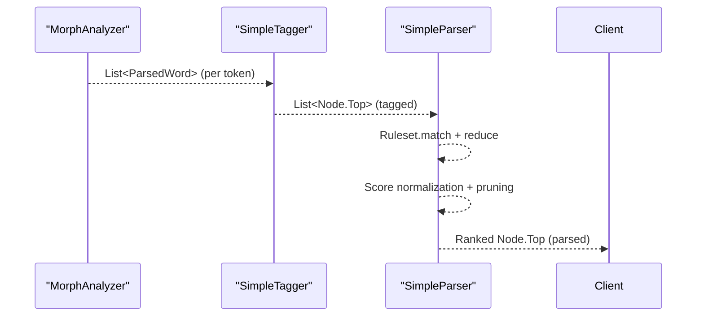
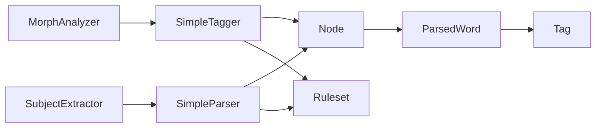

# NLP Advanced Features

<cite>
**Referenced Files in This Document**
- [Parser.java](file://jmorphy2-nlp/src/main/java/company/evo/jmorphy2/nlp/Parser.java)
- [SimpleParser.java](file://jmorphy2-nlp/src/main/java/company/evo/jmorphy2/nlp/SimpleParser.java)
- [Tagger.java](file://jmorphy2-nlp/src/main/java/company/evo/jmorphy2/nlp/Tagger.java)
- [SimpleTagger.java](file://jmorphy2-nlp/src/main/java/company/evo/jmorphy2/nlp/SimpleTagger.java)
- [SubjectExtractor.java](file://jmorphy2-nlp/src/main/java/company/evo/jmorphy2/nlp/SubjectExtractor.java)
- [Node.java](file://jmorphy2-nlp/src/main/java/company/evo/jmorphy2/nlp/Node.java)
- [Rule.java](file://jmorphy2-nlp/src/main/java/company/evo/jmorphy2/nlp/Rule.java)
- [Ruleset.java](file://jmorphy2-nlp/src/main/java/company/evo/jmorphy2/nlp/Ruleset.java)
- [MorphAnalyzer.java](file://jmorphy2-core/src/main/java/company/evo/jmorphy2/MorphAnalyzer.java)
- [ParsedWord.java](file://jmorphy2-core/src/main/java/company/evo/jmorphy2/ParsedWord.java)
- [Tag.java](file://jmorphy2-core/src/main/java/company/evo/jmorphy2/Tag.java)
- [parser_rules.txt](file://jmorphy2-nlp/src/test/resources/parser_rules.txt)
- [tagger_rules.txt](file://jmorphy2-nlp/src/test/resources/tagger_rules.txt)
- [phrases.txt](file://jmorphy2-nlp/src/test/resources/phrases.txt)
- [SimpleParserTest.java](file://jmorphy2-nlp/src/test/java/company/evo/jmorphy2/nlp/SimpleParserTest.java)
- [SubjectExtractorTest.java](file://jmorphy2-nlp/src/test/java/company/evo/jmorphy2/nlp/SubjectExtractorTest.java)
</cite>

## Table of Contents
1. [Introduction](#introduction)
2. [Project Structure](#project-structure)
3. [Core Components](#core-components)
4. [Architecture Overview](#architecture-overview)
5. [Detailed Component Analysis](#detailed-component-analysis)
6. [Dependency Analysis](#dependency-analysis)
7. [Performance Considerations](#performance-considerations)
8. [Troubleshooting Guide](#troubleshooting-guide)
9. [Conclusion](#conclusion)
10. [Appendices](#appendices)

## Introduction
This document explains the advanced NLP features built atop Jmorphy2’s morphological analyzer. It focuses on:
- Context-free grammar parsing via the Parser interface and SimpleParser implementation
- Part-of-speech tagging via the Tagger interface and SimpleTagger implementation
- Semantic role labeling for subject extraction via SubjectExtractor
- The Node data structure for representing parsed trees
- Rule and Ruleset classes for defining parsing grammars
- Integration with morphological analysis results, confidence scoring, and ambiguity resolution
- Practical configuration and usage patterns for Slavic languages
- Production deployment guidance including performance optimization and memory management

## Project Structure
The advanced NLP features live in the jmorphy2-nlp module and integrate with the morphological analyzer in jmorphy2-core. The tests demonstrate usage patterns and expected outputs.

**Diagram sources**
- [MorphAnalyzer.java:15-247](file://jmorphy2-core/src/main/java/company/evo/jmorphy2/MorphAnalyzer.java#L15-L247)
- [ParsedWord.java:1-89](file://jmorphy2-core/src/main/java/company/evo/jmorphy2/ParsedWord.java#L1-L89)
- [Tag.java:1-230](file://jmorphy2-core/src/main/java/company/evo/jmorphy2/Tag.java#L1-L230)
- [Parser.java:1-30](file://jmorphy2-nlp/src/main/java/company/evo/jmorphy2/nlp/Parser.java#L1-L30)
- [SimpleParser.java:1-176](file://jmorphy2-nlp/src/main/java/company/evo/jmorphy2/nlp/SimpleParser.java#L1-L176)
- [Tagger.java:1-20](file://jmorphy2-nlp/src/main/java/company/evo/jmorphy2/nlp/Tagger.java#L1-L20)
- [SimpleTagger.java:1-155](file://jmorphy2-nlp/src/main/java/company/evo/jmorphy2/nlp/SimpleTagger.java#L1-L155)
- [SubjectExtractor.java:1-117](file://jmorphy2-nlp/src/main/java/company/evo/jmorphy2/nlp/SubjectExtractor.java#L1-L117)
- [Node.java:1-159](file://jmorphy2-nlp/src/main/java/company/evo/jmorphy2/nlp/Node.java#L1-L159)
- [Rule.java:1-118](file://jmorphy2-nlp/src/main/java/company/evo/jmorphy2/nlp/Rule.java#L1-L118)
- [Ruleset.java:1-115](file://jmorphy2-nlp/src/main/java/company/evo/jmorphy2/nlp/Ruleset.java#L1-L115)

**Section sources**
- [MorphAnalyzer.java:15-247](file://jmorphy2-core/src/main/java/company/evo/jmorphy2/MorphAnalyzer.java#L15-L247)
- [Parser.java:1-30](file://jmorphy2-nlp/src/main/java/company/evo/jmorphy2/nlp/Parser.java#L1-L30)
- [Tagger.java:1-20](file://jmorphy2-nlp/src/main/java/company/evo/jmorphy2/nlp/Tagger.java#L1-L20)
- [Node.java:1-159](file://jmorphy2-nlp/src/main/java/company/evo/jmorphy2/nlp/Node.java#L1-L159)
- [Rule.java:1-118](file://jmorphy2-nlp/src/main/java/company/evo/jmorphy2/nlp/Rule.java#L1-L118)
- [Ruleset.java:1-115](file://jmorphy2-nlp/src/main/java/company/evo/jmorphy2/nlp/Ruleset.java#L1-L115)

## Core Components
- Parser and SimpleParser: Apply context-free grammar rules to sequences of tagged tokens to produce hierarchical parses represented as Node trees.
- Tagger and SimpleTagger: Convert raw tokens into initial labeled constituents using morphological analysis and optional lexical rules.
- SubjectExtractor: Traverses parse trees to extract semantic subjects based on configurable grammeme filters.
- Node: Immutable tree node carrying grammeme values, word form, morphological analysis, score, and depth.
- Rule and Ruleset: Define context-free grammar productions with weights and flags; support matching and reduction.

These components work together so that morphological analysis feeds into tagging, which feeds into parsing, and finally into semantic extraction.

**Section sources**
- [Parser.java:9-30](file://jmorphy2-nlp/src/main/java/company/evo/jmorphy2/nlp/Parser.java#L9-L30)
- [SimpleParser.java:15-176](file://jmorphy2-nlp/src/main/java/company/evo/jmorphy2/nlp/SimpleParser.java#L15-L176)
- [Tagger.java:9-20](file://jmorphy2-nlp/src/main/java/company/evo/jmorphy2/nlp/Tagger.java#L9-L20)
- [SimpleTagger.java:14-155](file://jmorphy2-nlp/src/main/java/company/evo/jmorphy2/nlp/SimpleTagger.java#L14-L155)
- [SubjectExtractor.java:11-117](file://jmorphy2-nlp/src/main/java/company/evo/jmorphy2/nlp/SubjectExtractor.java#L11-L117)
- [Node.java:12-159](file://jmorphy2-nlp/src/main/java/company/evo/jmorphy2/nlp/Node.java#L12-L159)
- [Rule.java:10-118](file://jmorphy2-nlp/src/main/java/company/evo/jmorphy2/nlp/Rule.java#L10-L118)
- [Ruleset.java:17-115](file://jmorphy2-nlp/src/main/java/company/evo/jmorphy2/nlp/Ruleset.java#L17-L115)

## Architecture Overview
The pipeline integrates morphological analysis with rule-based parsing and semantic extraction.

**Diagram sources**
- [SimpleTagger.java:38-135](file://jmorphy2-nlp/src/main/java/company/evo/jmorphy2/nlp/SimpleTagger.java#L38-L135)
- [MorphAnalyzer.java:178-200](file://jmorphy2-core/src/main/java/company/evo/jmorphy2/MorphAnalyzer.java#L178-L200)
- [SimpleParser.java:59-114](file://jmorphy2-nlp/src/main/java/company/evo/jmorphy2/nlp/SimpleParser.java#L59-L114)
- [SubjectExtractor.java:45-91](file://jmorphy2-nlp/src/main/java/company/evo/jmorphy2/nlp/SubjectExtractor.java#L45-L91)

## Detailed Component Analysis

### Parser and SimpleParser
- Purpose: Convert tagged token sequences into hierarchical parses using context-free grammar rules.
- Key behaviors:
  - Iterative bottom-up reduction of spans using Ruleset.match
  - Score normalization combining rule weights and shared grammeme agreement
  - Threshold pruning to control combinatorial explosion
  - Deduplication via unique hash of Node trees
- Integration with morphological analysis:
  - Uses grammeme roots (e.g., NUMBER, CASE) to compute shared values for agreement scoring
- Typical usage:
  - Construct with MorphAnalyzer and SimpleTagger
  - Call parse(tokens) or parseAll(tokens) to obtain ranked parses

**Diagram sources**
- [SimpleParser.java:67-114](file://jmorphy2-nlp/src/main/java/company/evo/jmorphy2/nlp/SimpleParser.java#L67-L114)
- [Rule.java:52-84](file://jmorphy2-nlp/src/main/java/company/evo/jmorphy2/nlp/Rule.java#L52-L84)
- [Node.java:76-96](file://jmorphy2-nlp/src/main/java/company/evo/jmorphy2/nlp/Node.java#L76-L96)

**Section sources**
- [Parser.java:18-29](file://jmorphy2-nlp/src/main/java/company/evo/jmorphy2/nlp/Parser.java#L18-L29)
- [SimpleParser.java:15-176](file://jmorphy2-nlp/src/main/java/company/evo/jmorphy2/nlp/SimpleParser.java#L15-L176)
- [Node.java:12-159](file://jmorphy2-nlp/src/main/java/company/evo/jmorphy2/nlp/Node.java#L12-L159)

### Tagger and SimpleTagger
- Purpose: Produce initial labeled constituents for tokens using morphological analysis and optional lexical rules.
- Key behaviors:
  - Exhaustively apply Ruleset.matchAll up to maxRightSize to label spans greedily
  - Fall back to morphological analysis when no rule matches
  - Cap results by threshold to limit branching
  - Build Node.Top sequences by stacking reductions
- Integration with morphological analysis:
  - Uses ParsedWord tags and scores to construct nodes
  - Stops on fixed forms (e.g., “Fixd”) to avoid overgeneration

**Diagram sources**
- [SimpleTagger.java:38-104](file://jmorphy2-nlp/src/main/java/company/evo/jmorphy2/nlp/SimpleTagger.java#L38-L104)
- [MorphAnalyzer.java:178-200](file://jmorphy2-core/src/main/java/company/evo/jmorphy2/MorphAnalyzer.java#L178-L200)

**Section sources**
- [Tagger.java:9-20](file://jmorphy2-nlp/src/main/java/company/evo/jmorphy2/nlp/Tagger.java#L9-L20)
- [SimpleTagger.java:14-155](file://jmorphy2-nlp/src/main/java/company/evo/jmorphy2/nlp/SimpleTagger.java#L14-L155)
- [ParsedWord.java:9-89](file://jmorphy2-core/src/main/java/company/evo/jmorphy2/ParsedWord.java#L9-L89)

### SubjectExtractor
- Purpose: Extract semantic subjects from a parsed sentence using configurable grammeme filters.
- Key behaviors:
  - Config string defines inclusion (+), exclusion (-), and target sets for subject values
  - Traverses the parse tree depth-first, enabling/disabling based on grammeme matches
  - Normalizes tokens to normal form when requested
- Typical usage:
  - Configure with a Parser, a config string, and a normalization flag
  - Call extract(tokens) or extractTokens(Node.Top)

**Diagram sources**
- [SubjectExtractor.java:45-91](file://jmorphy2-nlp/src/main/java/company/evo/jmorphy2/nlp/SubjectExtractor.java#L45-L91)

**Section sources**
- [SubjectExtractor.java:11-117](file://jmorphy2-nlp/src/main/java/company/evo/jmorphy2/nlp/SubjectExtractor.java#L11-L117)

### Node Data Structure
- Represents a tree node with:
  - grammemeValues: set of grammeme keys derived from morphological analysis
  - word/parsed/score: terminal token info and confidence score
  - children: nested constituents for non-terminals
  - maxDepth and uniqueHash: for efficient deduplication and ordering
- Provides:
  - sumScoreFor and maxDepthFor aggregators
  - scoreComparator for sorting
  - pretty printing for debugging

**Diagram sources**
- [Node.java:12-159](file://jmorphy2-nlp/src/main/java/company/evo/jmorphy2/nlp/Node.java#L12-L159)

**Section sources**
- [Node.java:12-159](file://jmorphy2-nlp/src/main/java/company/evo/jmorphy2/nlp/Node.java#L12-L159)

### Rule and Ruleset
- Rule:
  - Left-hand side: set of grammeme keys for the non-terminal
  - Right-hand side: sequence of NodeMatcher entries supporting:
    - Grammeme constraints
    - Exact word equality
    - Flags: NO_COMMONS (ignore for shared value computation), NO_REDUCE (do not flatten children)
  - Weight: production strength
  - commonGrammemeValues: intersection of shared values constrained by allowed roots (NUMBER, CASE)
- Ruleset:
  - Indexes rules by right-hand size for fast lookup
  - Parses textual rules with optional weights and continuations
  - match/matchAll for span-based matching

**Diagram sources**
- [Rule.java:10-118](file://jmorphy2-nlp/src/main/java/company/evo/jmorphy2/nlp/Rule.java#L10-L118)
- [Ruleset.java:17-115](file://jmorphy2-nlp/src/main/java/company/evo/jmorphy2/nlp/Ruleset.java#L17-L115)

**Section sources**
- [Rule.java:10-118](file://jmorphy2-nlp/src/main/java/company/evo/jmorphy2/nlp/Rule.java#L10-L118)
- [Ruleset.java:17-115](file://jmorphy2-nlp/src/main/java/company/evo/jmorphy2/nlp/Ruleset.java#L17-L115)

### Integration with Morphological Analysis
- MorphAnalyzer.parse returns a list of ParsedWord with:
  - tag: Tag containing grammeme keys
  - normalForm: canonical lemma
  - score: confidence score
- SimpleTagger constructs nodes from ParsedWord and uses tag.getGrammemeValues to seed grammemeValues
- SimpleParser computes shared grammeme values across spans and combines with rule weights to produce top-ranked parses

**Diagram sources**
- [MorphAnalyzer.java:178-200](file://jmorphy2-core/src/main/java/company/evo/jmorphy2/MorphAnalyzer.java#L178-L200)
- [ParsedWord.java:9-89](file://jmorphy2-core/src/main/java/company/evo/jmorphy2/ParsedWord.java#L9-L89)
- [SimpleTagger.java:68-84](file://jmorphy2-nlp/src/main/java/company/evo/jmorphy2/nlp/SimpleTagger.java#L68-L84)
- [SimpleParser.java:88-94](file://jmorphy2-nlp/src/main/java/company/evo/jmorphy2/nlp/SimpleParser.java#L88-L94)

**Section sources**
- [MorphAnalyzer.java:178-200](file://jmorphy2-core/src/main/java/company/evo/jmorphy2/MorphAnalyzer.java#L178-L200)
- [Tag.java:88-139](file://jmorphy2-core/src/main/java/company/evo/jmorphy2/Tag.java#L88-L139)
- [SimpleTagger.java:68-84](file://jmorphy2-nlp/src/main/java/company/evo/jmorphy2/nlp/SimpleTagger.java#L68-L84)
- [SimpleParser.java:88-94](file://jmorphy2-nlp/src/main/java/company/evo/jmorphy2/nlp/SimpleParser.java#L88-L94)

## Dependency Analysis
- Parser depends on MorphAnalyzer and Tagger
- SimpleParser depends on Ruleset and uses Node scoring
- SimpleTagger depends on Ruleset and MorphAnalyzer
- SubjectExtractor depends on Parser
- Node depends on ParsedWord and Tag grammeme values
- Rule and Ruleset depend on Node grammeme semantics

**Diagram sources**
- [MorphAnalyzer.java:178-200](file://jmorphy2-core/src/main/java/company/evo/jmorphy2/MorphAnalyzer.java#L178-L200)
- [ParsedWord.java:9-89](file://jmorphy2-core/src/main/java/company/evo/jmorphy2/ParsedWord.java#L9-L89)
- [Tag.java:88-139](file://jmorphy2-core/src/main/java/company/evo/jmorphy2/Tag.java#L88-L139)
- [SimpleTagger.java:68-84](file://jmorphy2-nlp/src/main/java/company/evo/jmorphy2/nlp/SimpleTagger.java#L68-L84)
- [SimpleParser.java:88-94](file://jmorphy2-nlp/src/main/java/company/evo/jmorphy2/nlp/SimpleParser.java#L88-L94)
- [SubjectExtractor.java:45-91](file://jmorphy2-nlp/src/main/java/company/evo/jmorphy2/nlp/SubjectExtractor.java#L45-L91)
- [Node.java:12-159](file://jmorphy2-nlp/src/main/java/company/evo/jmorphy2/nlp/Node.java#L12-L159)
- [Ruleset.java:17-115](file://jmorphy2-nlp/src/main/java/company/evo/jmorphy2/nlp/Ruleset.java#L17-L115)

**Section sources**
- [Parser.java:9-16](file://jmorphy2-nlp/src/main/java/company/evo/jmorphy2/nlp/Parser.java#L9-L16)
- [Tagger.java:9-14](file://jmorphy2-nlp/src/main/java/company/evo/jmorphy2/nlp/Tagger.java#L9-L14)
- [Node.java:12-51](file://jmorphy2-nlp/src/main/java/company/evo/jmorphy2/nlp/Node.java#L12-L51)
- [Rule.java:10-25](file://jmorphy2-nlp/src/main/java/company/evo/jmorphy2/nlp/Rule.java#L10-L25)
- [Ruleset.java:17-82](file://jmorphy2-nlp/src/main/java/company/evo/jmorphy2/nlp/Ruleset.java#L17-L82)

## Performance Considerations
- Pruning and thresholds:
  - SimpleParser and SimpleTagger use threshold parameters to cap branching and reduce combinatorial growth.
- Deduplication:
  - Node.uniqueHash prevents reprocessing identical subtrees across iterations.
- Scoring normalization:
  - SimpleParser divides total score by span length and depth to favor compact, high-scoring parses.
- Rule indexing:
  - Ruleset indexes by right-hand size for O(1) lookup during span scanning.
- Memory management:
  - Prefer iterative reduction with bounded queues and early pruning.
  - Reuse grammeme sets and avoid unnecessary allocations in hot loops.
- Confidence scoring:
  - Use ParsedWord.score as a base; combine with rule weights and shared grammeme counts for robust ranking.

[No sources needed since this section provides general guidance]

## Troubleshooting Guide
- No parses returned:
  - Verify Ruleset contains applicable rules for the input spans.
  - Check threshold values are not too low.
- Ambiguous parses:
  - Adjust rule weights to prefer desired analyses.
  - Narrow grammeme constraints in rules to reduce alternatives.
- Incorrect subjects extracted:
  - Review SubjectExtractor config string: ensure correct inclusion/exclusion sets and target categories.
  - Confirm morphological tags align with expected grammeme roots (NUMBER, CASE).
- Performance regressions:
  - Increase thresholds gradually.
  - Limit maxRightSize by tuning rule complexity.
  - Monitor uniqueHash collisions and consider hashing improvements if needed.

**Section sources**
- [SimpleParser.java:67-114](file://jmorphy2-nlp/src/main/java/company/evo/jmorphy2/nlp/SimpleParser.java#L67-L114)
- [SimpleTagger.java:58-104](file://jmorphy2-nlp/src/main/java/company/evo/jmorphy2/nlp/SimpleTagger.java#L58-L104)
- [SubjectExtractor.java:18-43](file://jmorphy2-nlp/src/main/java/company/evo/jmorphy2/nlp/SubjectExtractor.java#L18-L43)

## Conclusion
Jmorphy2’s advanced NLP features provide a robust, rule-driven framework for Russian and Ukrainian text understanding. By combining morphological analysis with context-free grammar rules and configurable semantic extraction, the system supports sophisticated downstream tasks such as product categorization, entity spotting, and intent recognition. Proper tuning of thresholds, rule weights, and grammeme constraints yields both accuracy and performance suitable for production deployments.

[No sources needed since this section summarizes without analyzing specific files]

## Appendices

### Practical Configuration Examples
- Loading rules from resources:
  - See test resources for parser and tagger rules.
  - Use Ruleset(InputStream) constructor to parse rule files.
- Building a pipeline:
  - Create MorphAnalyzer
  - Create SimpleTagger with Ruleset and threshold
  - Create SimpleParser with MorphAnalyzer, SimpleTagger, Ruleset, and threshold
  - Wrap with SubjectExtractor using a configuration string and normalization flag
- Example rule formats:
  - Left -> Right [weight]
  - Right can include flags and alternations
  - See [parser_rules.txt:1-36](file://jmorphy2-nlp/src/test/resources/parser_rules.txt#L1-L36) and [tagger_rules.txt:1-7](file://jmorphy2-nlp/src/test/resources/tagger_rules.txt#L1-L7)

**Section sources**
- [parser_rules.txt:1-36](file://jmorphy2-nlp/src/test/resources/parser_rules.txt#L1-L36)
- [tagger_rules.txt:1-7](file://jmorphy2-nlp/src/test/resources/tagger_rules.txt#L1-L7)
- [Ruleset.java:32-67](file://jmorphy2-nlp/src/main/java/company/evo/jmorphy2/nlp/Ruleset.java#L32-L67)

### Usage Patterns and Tests
- Parsing examples:
  - See [SimpleParserTest.java:63-154](file://jmorphy2-nlp/src/test/java/company/evo/jmorphy2/nlp/SimpleParserTest.java#L63-L154)
- Subject extraction examples:
  - See [SubjectExtractorTest.java:35-60](file://jmorphy2-nlp/src/test/java/company/evo/jmorphy2/nlp/SubjectExtractorTest.java#L35-L60)
- Sample phrase corpus:
  - See [phrases.txt:1-1001](file://jmorphy2-nlp/src/test/resources/phrases.txt#L1-L1001)

**Section sources**
- [SimpleParserTest.java:15-39](file://jmorphy2-nlp/src/test/java/company/evo/jmorphy2/nlp/SimpleParserTest.java#L15-L39)
- [SubjectExtractorTest.java:17-33](file://jmorphy2-nlp/src/test/java/company/evo/jmorphy2/nlp/SubjectExtractorTest.java#L17-L33)