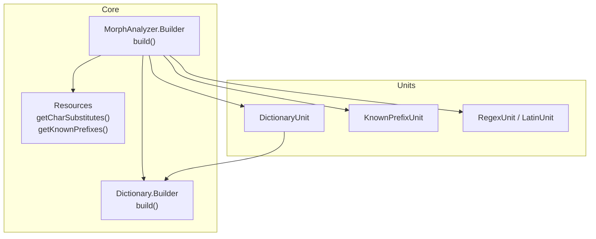
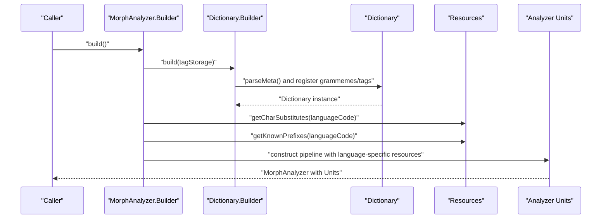
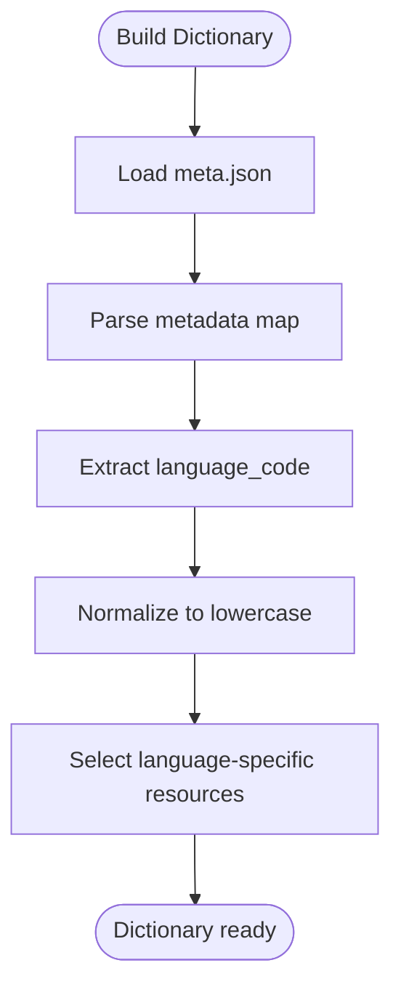
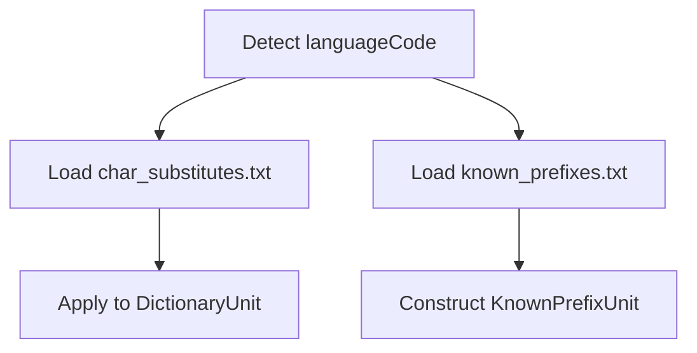
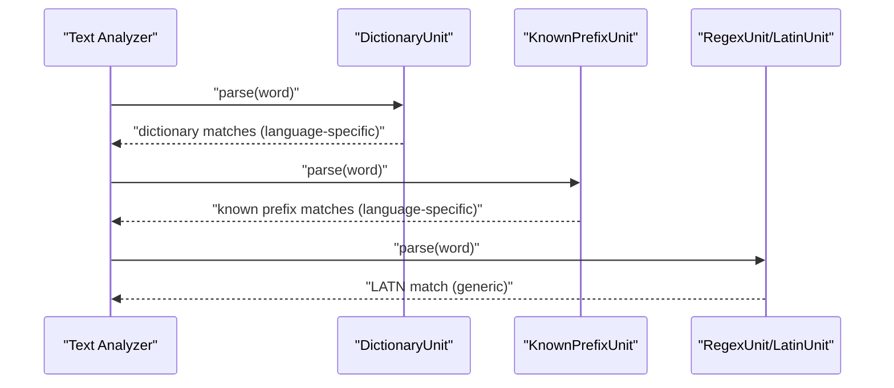
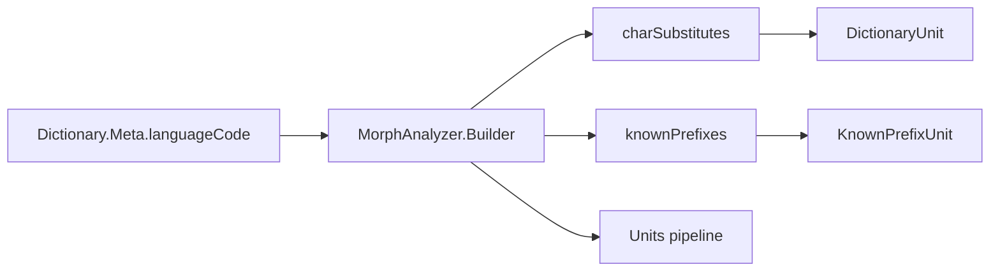

# Language Detection and Switching

<cite>
**Referenced Files in This Document**
- [MorphAnalyzer.java](file://jmorphy2-core/src/main/java/company/evo/jmorphy2/MorphAnalyzer.java)
- [Dictionary.java](file://jmorphy2-core/src/main/java/company/evo/jmorphy2/Dictionary.java)
- [Resources.java](file://jmorphy2-core/src/main/java/company/evo/jmorphy2/Resources.java)
- [DictionaryUnit.java](file://jmorphy2-core/src/main/java/company/evo/jmorphy2/units/DictionaryUnit.java)
- [KnownPrefixUnit.java](file://jmorphy2-core/src/main/java/company/evo/jmorphy2/units/KnownPrefixUnit.java)
- [PrefixedUnit.java](file://jmorphy2-core/src/main/java/company/evo/jmorphy2/units/PrefixedUnit.java)
- [RegexUnit.java](file://jmorphy2-core/src/main/java/company/evo/jmorphy2/units/RegexUnit.java)
- [LatinUnit.java](file://jmorphy2-core/src/main/java/company/evo/jmorphy2/units/LatinUnit.java)
- [Jmorphy2TestsHelpers.java](file://jmorphy2-core/src/test/java/company/evo/jmorphy2/Jmorphy2TestsHelpers.java)
- [MorphAnalyzerRUTest.java](file://jmorphy2-core/src/test/java/company/evo/jmorphy2/MorphAnalyzerRUTest.java)
- [MorphAnalyzerUkTest.java](file://jmorphy2-core/src/test/java/company/evo/jmorphy2/MorphAnalyzerUkTest.java)
- [char_substitutes.txt](file://jmorphy2-core/src/main/resources/lang/uk/char_substitutes.txt)
- [known_prefixes.txt (Ukrainian)](file://jmorphy2-core/src/main/resources/lang/uk/known_prefixes.txt)
- [known_prefixes.txt (Russian)](file://jmorphy2-core/src/main/resources/lang/ru/known_prefixes.txt)
</cite>

## Table of Contents
1. [Introduction](#introduction)
2. [Project Structure](#project-structure)
3. [Core Components](#core-components)
4. [Architecture Overview](#architecture-overview)
5. [Detailed Component Analysis](#detailed-component-analysis)
6. [Dependency Analysis](#dependency-analysis)
7. [Performance Considerations](#performance-considerations)
8. [Troubleshooting Guide](#troubleshooting-guide)
9. [Conclusion](#conclusion)

## Introduction
This document explains how the system automatically detects the language for morphological analysis and switches processing accordingly. It covers:
- How language detection is performed via dictionary metadata
- How language codes are extracted during initialization
- How charSubstitutes and knownPrefixes are loaded per detected language
- How the analyzer processes mixed-language text and maintains language-specific behavior
- Scenarios with ambiguity and fallbacks
- Guidance for manual language selection
- Troubleshooting tips for detection failures and multilingual encoding issues

## Project Structure
The language detection and switching logic is centered around the morphological analyzer builder, dictionary metadata parsing, and resource loading utilities. Tests demonstrate language-specific behavior and resource availability.

**Diagram sources**
- [MorphAnalyzer.java:52-99](file://jmorphy2-core/src/main/java/company/evo/jmorphy2/MorphAnalyzer.java#L52-L99)
- [Dictionary.java:109-138](file://jmorphy2-core/src/main/java/company/evo/jmorphy2/Dictionary.java#L109-L138)
- [Resources.java:17-40](file://jmorphy2-core/src/main/java/company/evo/jmorphy2/Resources.java#L17-L40)
- [DictionaryUnit.java:28-49](file://jmorphy2-core/src/main/java/company/evo/jmorphy2/units/DictionaryUnit.java#L28-L49)
- [KnownPrefixUnit.java:29-59](file://jmorphy2-core/src/main/java/company/evo/jmorphy2/units/KnownPrefixUnit.java#L29-L59)
- [RegexUnit.java:15-29](file://jmorphy2-core/src/main/java/company/evo/jmorphy2/units/RegexUnit.java#L15-L29)

**Section sources**
- [MorphAnalyzer.java:52-99](file://jmorphy2-core/src/main/java/company/evo/jmorphy2/MorphAnalyzer.java#L52-L99)
- [Dictionary.java:109-138](file://jmorphy2-core/src/main/java/company/evo/jmorphy2/Dictionary.java#L109-L138)
- [Resources.java:17-40](file://jmorphy2-core/src/main/java/company/evo/jmorphy2/Resources.java#L17-L40)

## Core Components
- MorphAnalyzer.Builder: Orchestrates initialization, loads dictionary metadata, selects language-specific resources, and constructs the unit pipeline.
- Dictionary.Builder: Parses dictionary metadata and registers grammemes/tags.
- Resources: Loads language-specific charSubstitutes and knownPrefixes from resource files.
- DictionaryUnit: Performs dictionary lookup with language-specific character substitutions.
- KnownPrefixUnit: Applies language-specific known prefixes to decompose words.
- RegexUnit/LatinUnit: Handles Latin-script tokens generically.

Key behaviors:
- Language detection occurs by reading the dictionary’s language code from metadata.
- Language code determines which charSubstitutes and knownPrefixes are loaded.
- The analyzer pipeline is constructed once per detected language.

**Section sources**
- [MorphAnalyzer.java:52-99](file://jmorphy2-core/src/main/java/company/evo/jmorphy2/MorphAnalyzer.java#L52-L99)
- [Dictionary.java:232-259](file://jmorphy2-core/src/main/java/company/evo/jmorphy2/Dictionary.java#L232-L259)
- [Resources.java:17-40](file://jmorphy2-core/src/main/java/company/evo/jmorphy2/Resources.java#L17-L40)
- [DictionaryUnit.java:56-65](file://jmorphy2-core/src/main/java/company/evo/jmorphy2/units/DictionaryUnit.java#L56-L65)
- [KnownPrefixUnit.java:62-73](file://jmorphy2-core/src/main/java/company/evo/jmorphy2/units/KnownPrefixUnit.java#L62-L73)
- [RegexUnit.java:21-29](file://jmorphy2-core/src/main/java/company/evo/jmorphy2/units/RegexUnit.java#L21-L29)

## Architecture Overview
The analyzer initializes with a dictionary loader and builds a pipeline of analyzer units. During preparation, the builder:
- Builds the dictionary to extract languageCode from metadata
- Loads charSubstitutes and knownPrefixes based on languageCode
- Constructs DictionaryUnit, NumberUnit, PunctuationUnit, RomanUnit, LatinUnit, KnownPrefixUnit (if applicable), UnknownPrefixUnit, KnownSuffixUnit, and UnknownUnit

**Diagram sources**
- [MorphAnalyzer.java:52-99](file://jmorphy2-core/src/main/java/company/evo/jmorphy2/MorphAnalyzer.java#L52-L99)
- [Dictionary.java:109-138](file://jmorphy2-core/src/main/java/company/evo/jmorphy2/Dictionary.java#L109-L138)
- [Resources.java:17-40](file://jmorphy2-core/src/main/java/company/evo/jmorphy2/Resources.java#L17-L40)

## Detailed Component Analysis

### Language Detection from Dictionary Metadata
- The dictionary meta.json is parsed to obtain language_code.
- The language code is normalized to lowercase and used to select language-specific resources.
- The analyzer’s probability estimator is enabled if the dictionary metadata indicates probabilistic tagging support.

**Diagram sources**
- [Dictionary.java:53-59](file://jmorphy2-core/src/main/java/company/evo/jmorphy2/Dictionary.java#L53-L59)
- [Dictionary.java:232-259](file://jmorphy2-core/src/main/java/company/evo/jmorphy2/Dictionary.java#L232-L259)
- [MorphAnalyzer.java:62-66](file://jmorphy2-core/src/main/java/company/evo/jmorphy2/MorphAnalyzer.java#L62-L66)

**Section sources**
- [Dictionary.java:53-59](file://jmorphy2-core/src/main/java/company/evo/jmorphy2/Dictionary.java#L53-L59)
- [Dictionary.java:232-259](file://jmorphy2-core/src/main/java/company/evo/jmorphy2/Dictionary.java#L232-L259)
- [MorphAnalyzer.java:62-66](file://jmorphy2-core/src/main/java/company/evo/jmorphy2/MorphAnalyzer.java#L62-L66)

### Language-Specific Resource Loading (charSubstitutes and knownPrefixes)
- Resources.getCharSubstitutes reads language-specific char_substitutes.txt from /lang/{lang}/char_substitutes.txt.
- Resources.getKnownPrefixes reads language-specific known_prefixes.txt from /lang/{lang}/known_prefixes.txt.
- These resources are applied to DictionaryUnit and KnownSuffixUnit to normalize characters and recognize prefixes.

**Diagram sources**
- [Resources.java:17-40](file://jmorphy2-core/src/main/java/company/evo/jmorphy2/Resources.java#L17-L40)
- [DictionaryUnit.java:18-26](file://jmorphy2-core/src/main/java/company/evo/jmorphy2/units/DictionaryUnit.java#L18-L26)
- [KnownPrefixUnit.java:16-27](file://jmorphy2-core/src/main/java/company/evo/jmorphy2/units/KnownPrefixUnit.java#L16-L27)

**Section sources**
- [Resources.java:17-40](file://jmorphy2-core/src/main/java/company/evo/jmorphy2/Resources.java#L17-L40)
- [DictionaryUnit.java:18-26](file://jmorphy2-core/src/main/java/company/evo/jmorphy2/units/DictionaryUnit.java#L18-L26)
- [KnownPrefixUnit.java:16-27](file://jmorphy2-core/src/main/java/company/evo/jmorphy2/units/KnownPrefixUnit.java#L16-L27)

### Mixed-Language Text Processing and Switching Behavior
- The analyzer does not dynamically switch languages mid-token. Instead, it is configured for a single language at build time.
- For mixed-language text, the pipeline applies language-specific normalization and decomposition rules consistently according to the selected language.
- LatinUnit matches Latin-script tokens generically; it does not imply language switching but ensures coverage for foreign terms.

**Diagram sources**
- [MorphAnalyzer.java:178-200](file://jmorphy2-core/src/main/java/company/evo/jmorphy2/MorphAnalyzer.java#L178-L200)
- [DictionaryUnit.java:56-65](file://jmorphy2-core/src/main/java/company/evo/jmorphy2/units/DictionaryUnit.java#L56-L65)
- [KnownPrefixUnit.java:62-73](file://jmorphy2-core/src/main/java/company/evo/jmorphy2/units/KnownPrefixUnit.java#L62-L73)
- [RegexUnit.java:21-29](file://jmorphy2-core/src/main/java/company/evo/jmorphy2/units/RegexUnit.java#L21-L29)

**Section sources**
- [MorphAnalyzer.java:178-200](file://jmorphy2-core/src/main/java/company/evo/jmorphy2/MorphAnalyzer.java#L178-L200)
- [LatinUnit.java:8-27](file://jmorphy2-core/src/main/java/company/evo/jmorphy2/units/LatinUnit.java#L8-L27)

### Examples from Tests Demonstrating Language-Specific Behavior
- Russian tests show behavior aligned with Russian morphology and known prefixes.
- Ukrainian tests show behavior aligned with Ukrainian morphology, including character substitution normalization for apostrophes and hyphens, and Ukrainian-specific known prefixes.

These examples illustrate that the analyzer behaves differently depending on the selected language resources.

**Section sources**
- [MorphAnalyzerRUTest.java:30-142](file://jmorphy2-core/src/test/java/company/evo/jmorphy2/MorphAnalyzerRUTest.java#L30-L142)
- [MorphAnalyzerUkTest.java:30-101](file://jmorphy2-core/src/test/java/company/evo/jmorphy2/MorphAnalyzerUkTest.java#L30-L101)

### Manual Language Selection
- Tests demonstrate constructing analyzers for specific languages by passing a language identifier to the helper, which configures the dictionary loader path accordingly.
- To force a specific language, construct the analyzer with the desired language code and ensure the corresponding dictionary resources are available.

**Section sources**
- [Jmorphy2TestsHelpers.java:7-19](file://jmorphy2-core/src/test/java/company/evo/jmorphy2/Jmorphy2TestsHelpers.java#L7-L19)

## Dependency Analysis
The analyzer pipeline depends on:
- Dictionary metadata for language identification
- Language-specific resources for normalization and prefix recognition
- Unit order and termination semantics to influence parsing outcomes

**Diagram sources**
- [MorphAnalyzer.java:62-66](file://jmorphy2-core/src/main/java/company/evo/jmorphy2/MorphAnalyzer.java#L62-L66)
- [Dictionary.java:232-259](file://jmorphy2-core/src/main/java/company/evo/jmorphy2/Dictionary.java#L232-L259)
- [Resources.java:17-40](file://jmorphy2-core/src/main/java/company/evo/jmorphy2/Resources.java#L17-L40)

**Section sources**
- [MorphAnalyzer.java:62-66](file://jmorphy2-core/src/main/java/company/evo/jmorphy2/MorphAnalyzer.java#L62-L66)
- [Dictionary.java:232-259](file://jmorphy2-core/src/main/java/company/evo/jmorphy2/Dictionary.java#L232-L259)
- [Resources.java:17-40](file://jmorphy2-core/src/main/java/company/evo/jmorphy2/Resources.java#L17-L40)

## Performance Considerations
- Resource loading is performed once during builder preparation; avoid repeated re-initialization.
- Using language-specific charSubstitutes and knownPrefixes improves accuracy and reduces ambiguity, potentially reducing backtracking in suffix/prefix decomposition.
- Probability estimation is conditionally enabled based on dictionary metadata; enabling it adds computational overhead but improves ranking quality.

[No sources needed since this section provides general guidance]

## Troubleshooting Guide
Common issues and resolutions:
- Language detection failure
  - Ensure the dictionary meta.json contains a valid language_code field and is readable.
  - Verify the language code is supported by included resources (e.g., char_substitutes.txt and known_prefixes.txt exist under /lang/{code}/).
  - Confirm the analyzer is built with the intended language code.

- Character encoding problems in multilingual contexts
  - Resources are read with UTF-8; ensure input strings are properly decoded.
  - For Unicode variants (e.g., U+2019 or U+02BC), rely on Resources.parseString to handle escapes and normalize to canonical forms.

- Mixed-language text not behaving as expected
  - The analyzer is configured for a single language. If mixed-language content is common, pre-segment by language or supply separate analyzers per language.
  - Confirm that knownPrefixes lists match the target language to avoid misanalysis of compound tokens.

- Missing charSubstitutes or knownPrefixes
  - If resources are empty, the analyzer still functions but may miss language-specific normalization or prefix recognition. Provide the appropriate language resources.

**Section sources**
- [Dictionary.java:53-59](file://jmorphy2-core/src/main/java/company/evo/jmorphy2/Dictionary.java#L53-L59)
- [Resources.java:42-62](file://jmorphy2-core/src/main/java/company/evo/jmorphy2/Resources.java#L42-L62)
- [char_substitutes.txt:1-4](file://jmorphy2-core/src/main/resources/lang/uk/char_substitutes.txt#L1-L4)
- [known_prefixes.txt (Ukrainian):1-10](file://jmorphy2-core/src/main/resources/lang/uk/known_prefixes.txt#L1-L10)
- [known_prefixes.txt (Russian):1-10](file://jmorphy2-core/src/main/resources/lang/ru/known_prefixes.txt#L1-L10)

## Conclusion
The system detects language automatically from dictionary metadata and configures language-specific resources for accurate morphological analysis. While it does not dynamically switch languages during parsing, it supports robust normalization and decomposition tailored to the selected language. For mixed-language content, segment by language or configure separate analyzers. When encountering detection or encoding issues, verify metadata, resource presence, and input decoding.