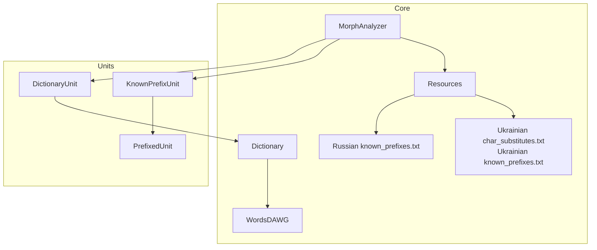
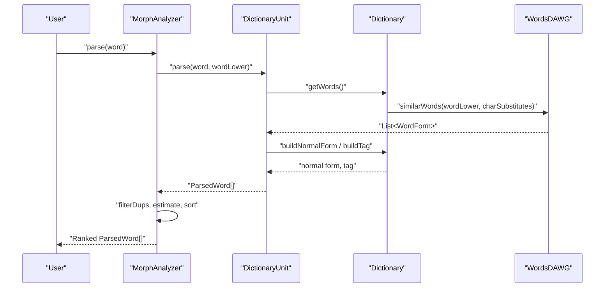
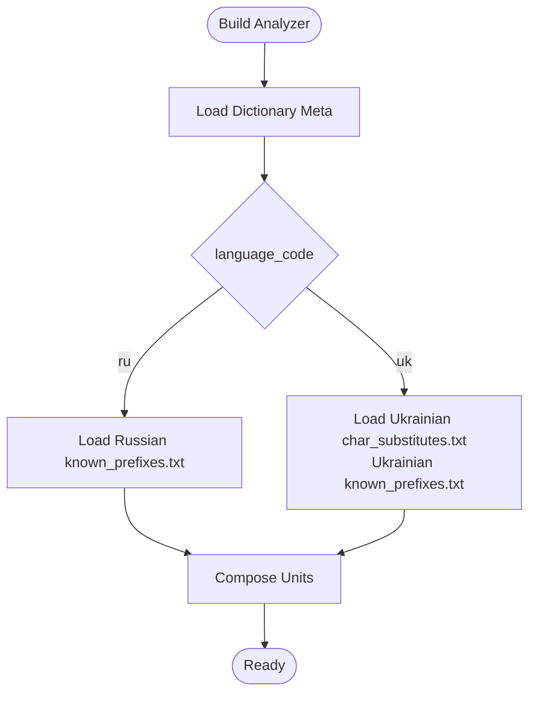
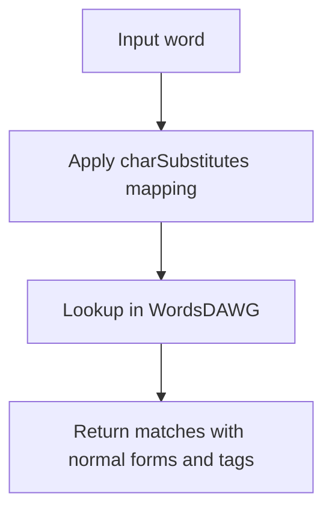
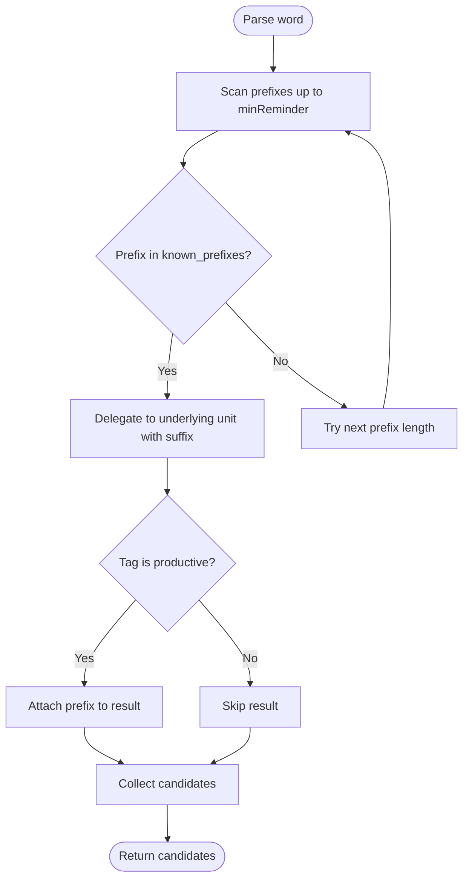
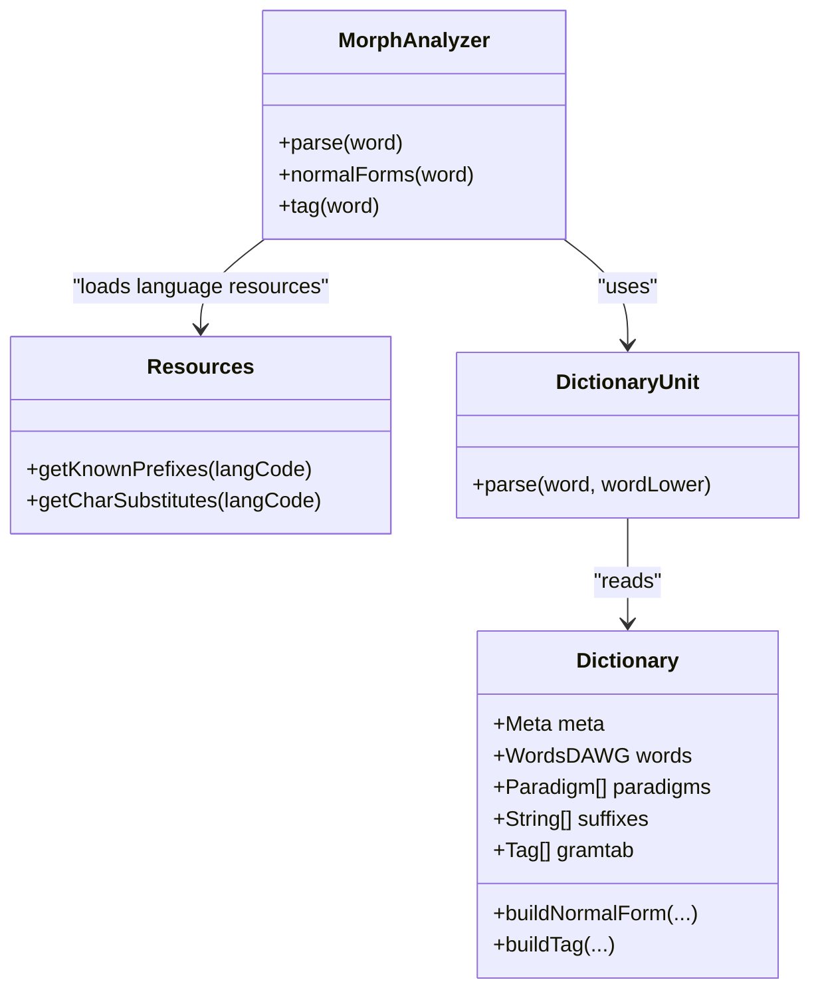
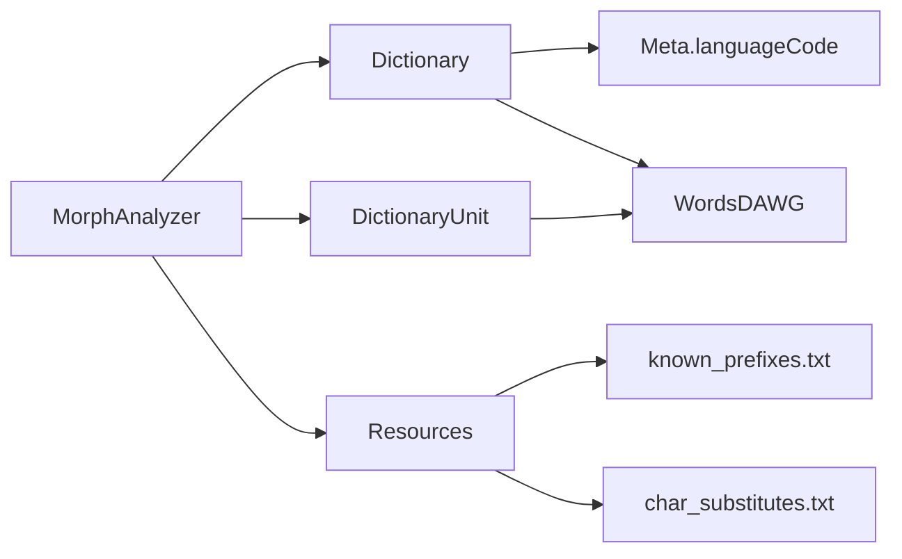

# Language Support

<cite>
**Referenced Files in This Document**
- [MorphAnalyzer.java](file://jmorphy2-core/src/main/java/company/evo/jmorphy2/MorphAnalyzer.java)
- [Resources.java](file://jmorphy2-core/src/main/java/company/evo/jmorphy2/Resources.java)
- [Dictionary.java](file://jmorphy2-core/src/main/java/company/evo/jmorphy2/Dictionary.java)
- [DictionaryUnit.java](file://jmorphy2-core/src/main/java/company/evo/jmorphy2/units/DictionaryUnit.java)
- [PrefixedUnit.java](file://jmorphy2-core/src/main/java/company/evo/jmorphy2/units/PrefixedUnit.java)
- [KnownPrefixUnit.java](file://jmorphy2-core/src/main/java/company/evo/jmorphy2/units/KnownPrefixUnit.java)
- [WordsDAWG.java](file://jmorphy2-core/src/main/java/company/evo/jmorphy2/WordsDAWG.java)
- [char_substitutes.txt](file://jmorphy2-core/src/main/resources/lang/uk/char_substitutes.txt)
- [known_prefixes.txt (Russian)](file://jmorphy2-core/src/main/resources/lang/ru/known_prefixes.txt)
- [known_prefixes.txt (Ukrainian)](file://jmorphy2-core/src/main/resources/lang/uk/known_prefixes.txt)
- [MorphAnalyzerRUTest.java](file://jmorphy2-core/src/test/java/company/evo/jmorphy2/MorphAnalyzerRUTest.java)
- [MorphAnalyzerUkTest.java](file://jmorphy2-core/src/test/java/company/evo/jmorphy2/MorphAnalyzerUkTest.java)
- [Jmorphy2TestsHelpers.java](file://jmorphy2-core/src/test/java/company/evo/jmorphy2/Jmorphy2TestsHelpers.java)
- [README.md](file://README.md)
</cite>

## Table of Contents
1. [Introduction](#introduction)
2. [Project Structure](#project-structure)
3. [Core Components](#core-components)
4. [Architecture Overview](#architecture-overview)
5. [Detailed Component Analysis](#detailed-component-analysis)
6. [Dependency Analysis](#dependency-analysis)
7. [Performance Considerations](#performance-considerations)
8. [Troubleshooting Guide](#troubleshooting-guide)
9. [Conclusion](#conclusion)
10. [Appendices](#appendices)

## Introduction
This document explains the language support features for Russian and Ukrainian morphological processing in the system. It covers the dual-language architecture, language-specific optimizations, character substitution for Ukrainian, the known prefix recognition system, dictionary loading and resource management, differences in inflection patterns, configuration and usage guidance, and troubleshooting tips for edge cases.

## Project Structure
The language support spans several modules:
- Core morphological analyzer and unit pipeline
- Language-specific resources (character substitutions, known prefixes)
- Dictionary loading and grammatical metadata
- Tests validating Russian and Ukrainian behavior

**Diagram sources**
- [MorphAnalyzer.java:15-125](file://jmorphy2-core/src/main/java/company/evo/jmorphy2/MorphAnalyzer.java#L15-L125)
- [Dictionary.java:12-34](file://jmorphy2-core/src/main/java/company/evo/jmorphy2/Dictionary.java#L12-L34)
- [WordsDAWG.java:13-31](file://jmorphy2-core/src/main/java/company/evo/jmorphy2/WordsDAWG.java#L13-L31)
- [Resources.java:16-40](file://jmorphy2-core/src/main/java/company/evo/jmorphy2/Resources.java#L16-L40)
- [KnownPrefixUnit.java:12-75](file://jmorphy2-core/src/main/java/company/evo/jmorphy2/units/KnownPrefixUnit.java#L12-L75)
- [PrefixedUnit.java:10-55](file://jmorphy2-core/src/main/java/company/evo/jmorphy2/units/PrefixedUnit.java#L10-L55)
- [DictionaryUnit.java:14-104](file://jmorphy2-core/src/main/java/company/evo/jmorphy2/units/DictionaryUnit.java#L14-L104)

**Section sources**
- [MorphAnalyzer.java:15-125](file://jmorphy2-core/src/main/java/company/evo/jmorphy2/MorphAnalyzer.java#L15-L125)
- [Resources.java:16-40](file://jmorphy2-core/src/main/java/company/evo/jmorphy2/Resources.java#L16-L40)
- [Dictionary.java:12-34](file://jmorphy2-core/src/main/java/company/evo/jmorphy2/Dictionary.java#L12-L34)
- [WordsDAWG.java:13-31](file://jmorphy2-core/src/main/java/company/evo/jmorphy2/WordsDAWG.java#L13-L31)
- [KnownPrefixUnit.java:12-75](file://jmorphy2-core/src/main/java/company/evo/jmorphy2/units/KnownPrefixUnit.java#L12-L75)
- [PrefixedUnit.java:10-55](file://jmorphy2-core/src/main/java/company/evo/jmorphy2/units/PrefixedUnit.java#L10-L55)
- [DictionaryUnit.java:14-104](file://jmorphy2-core/src/main/java/company/evo/jmorphy2/units/DictionaryUnit.java#L14-L104)

## Core Components
- MorphAnalyzer orchestrates parsing via a chain of AnalyzerUnits. It builds units based on detected language metadata, loads language-specific known prefixes and character substitutions, and applies scoring and deduplication.
- Dictionary encapsulates language metadata, grammatical tables, paradigms, and DAWG-based word lookup with optional probability estimation.
- DictionaryUnit performs dictionary lookups with character substitution support.
- PrefixedUnit and KnownPrefixUnit implement known prefix recognition to improve word boundary detection.
- Resources provides language-specific lists and mappings from resource files.

Key behaviors:
- Language detection: The dictionary’s metadata determines the language code, which selects language-specific resources.
- Character substitution: Ukrainian-specific substitutions are applied during dictionary lookup.
- Known prefixes: Language-specific prefix lists are loaded and used to split candidate prefixes from words.
- Scoring and normalization: Results are deduplicated, optionally scored via probability estimation, and sorted.

**Section sources**
- [MorphAnalyzer.java:52-99](file://jmorphy2-core/src/main/java/company/evo/jmorphy2/MorphAnalyzer.java#L52-L99)
- [MorphAnalyzer.java:178-200](file://jmorphy2-core/src/main/java/company/evo/jmorphy2/MorphAnalyzer.java#L178-L200)
- [MorphAnalyzer.java:202-232](file://jmorphy2-core/src/main/java/company/evo/jmorphy2/MorphAnalyzer.java#L202-L232)
- [MorphAnalyzer.java:234-245](file://jmorphy2-core/src/main/java/company/evo/jmorphy2/MorphAnalyzer.java#L234-L245)
- [Dictionary.java:109-138](file://jmorphy2-core/src/main/java/company/evo/jmorphy2/Dictionary.java#L109-L138)
- [Dictionary.java:239](file://jmorphy2-core/src/main/java/company/evo/jmorphy2/Dictionary.java#L239)
- [DictionaryUnit.java:56-65](file://jmorphy2-core/src/main/java/company/evo/jmorphy2/units/DictionaryUnit.java#L56-L65)
- [WordsDAWG.java:25-31](file://jmorphy2-core/src/main/java/company/evo/jmorphy2/WordsDAWG.java#L25-L31)
- [Resources.java:17-40](file://jmorphy2-core/src/main/java/company/evo/jmorphy2/Resources.java#L17-L40)

## Architecture Overview
The analyzer composes a pipeline of units. At build time, the language code is inferred from dictionary metadata, and language-specific resources are loaded. At runtime, the pipeline parses input words and produces ranked analyses.

**Diagram sources**
- [MorphAnalyzer.java:178-200](file://jmorphy2-core/src/main/java/company/evo/jmorphy2/MorphAnalyzer.java#L178-L200)
- [DictionaryUnit.java:56-65](file://jmorphy2-core/src/main/java/company/evo/jmorphy2/units/DictionaryUnit.java#L56-L65)
- [Dictionary.java:165-168](file://jmorphy2-core/src/main/java/company/evo/jmorphy2/Dictionary.java#L165-L168)
- [WordsDAWG.java:25-31](file://jmorphy2-core/src/main/java/company/evo/jmorphy2/WordsDAWG.java#L25-L31)

## Detailed Component Analysis

### Dual-Language Architecture and Language Detection
- Language detection: The builder reads dictionary metadata and extracts the language code. This code is uppercased and used to select language-specific resources.
- Automatic switching: Because the language code drives resource selection, switching languages is achieved by loading a dictionary for the target language.

**Diagram sources**
- [MorphAnalyzer.java:60-67](file://jmorphy2-core/src/main/java/company/evo/jmorphy2/MorphAnalyzer.java#L60-L67)
- [Dictionary.java:239](file://jmorphy2-core/src/main/java/company/evo/jmorphy2/Dictionary.java#L239)
- [Resources.java:34-40](file://jmorphy2-core/src/main/java/company/evo/jmorphy2/Resources.java#L34-L40)

**Section sources**
- [MorphAnalyzer.java:60-67](file://jmorphy2-core/src/main/java/company/evo/jmorphy2/MorphAnalyzer.java#L60-L67)
- [Dictionary.java:239](file://jmorphy2-core/src/main/java/company/evo/jmorphy2/Dictionary.java#L239)
- [Resources.java:34-40](file://jmorphy2-core/src/main/java/company/evo/jmorphy2/Resources.java#L34-L40)

### Character Substitution Handling for Ukrainian
- Ukrainian-specific substitutions are loaded from a resource file and applied during dictionary lookups.
- The substitutions normalize variants like apostrophe forms and certain Cyrillic letters to canonical forms, improving matching.

**Diagram sources**
- [DictionaryUnit.java:56-65](file://jmorphy2-core/src/main/java/company/evo/jmorphy2/units/DictionaryUnit.java#L56-L65)
- [WordsDAWG.java:25-31](file://jmorphy2-core/src/main/java/company/evo/jmorphy2/WordsDAWG.java#L25-L31)
- [Resources.java:17-32](file://jmorphy2-core/src/main/java/company/evo/jmorphy2/Resources.java#L17-L32)
- [char_substitutes.txt:1-4](file://jmorphy2-core/src/main/resources/lang/uk/char_substitutes.txt#L1-L4)

**Section sources**
- [DictionaryUnit.java:56-65](file://jmorphy2-core/src/main/java/company/evo/jmorphy2/units/DictionaryUnit.java#L56-L65)
- [WordsDAWG.java:25-31](file://jmorphy2-core/src/main/java/company/evo/jmorphy2/WordsDAWG.java#L25-L31)
- [Resources.java:17-32](file://jmorphy2-core/src/main/java/company/evo/jmorphy2/Resources.java#L17-L32)
- [char_substitutes.txt:1-4](file://jmorphy2-core/src/main/resources/lang/uk/char_substitutes.txt#L1-L4)

### Known Prefix Recognition System
- Russian and Ukrainian each maintain a list of known prefixes.
- The KnownPrefixUnit scans candidate prefixes up to a minimum length, delegates to the underlying unit for parsing the remainder, and reattaches the prefix to results.
- PrefixedUnit ensures only productive (grammatically valid) analyses are retained.

**Diagram sources**
- [KnownPrefixUnit.java:62-73](file://jmorphy2-core/src/main/java/company/evo/jmorphy2/units/KnownPrefixUnit.java#L62-L73)
- [PrefixedUnit.java:18-28](file://jmorphy2-core/src/main/java/company/evo/jmorphy2/units/PrefixedUnit.java#L18-L28)
- [Resources.java:34-40](file://jmorphy2-core/src/main/java/company/evo/jmorphy2/Resources.java#L34-L40)
- [known_prefixes.txt (Russian):1-145](file://jmorphy2-core/src/main/resources/lang/ru/known_prefixes.txt#L1-L145)
- [known_prefixes.txt (Ukrainian):1-480](file://jmorphy2-core/src/main/resources/lang/uk/known_prefixes.txt#L1-L480)

**Section sources**
- [KnownPrefixUnit.java:62-73](file://jmorphy2-core/src/main/java/company/evo/jmorphy2/units/KnownPrefixUnit.java#L62-L73)
- [PrefixedUnit.java:18-28](file://jmorphy2-core/src/main/java/company/evo/jmorphy2/units/PrefixedUnit.java#L18-L28)
- [Resources.java:34-40](file://jmorphy2-core/src/main/java/company/evo/jmorphy2/Resources.java#L34-L40)
- [known_prefixes.txt (Russian):1-145](file://jmorphy2-core/src/main/resources/lang/ru/known_prefixes.txt#L1-L145)
- [known_prefixes.txt (Ukrainian):1-480](file://jmorphy2-core/src/main/resources/lang/uk/known_prefixes.txt#L1-L480)

### Dictionary Loading and Language-Specific Resource Management
- Dictionary.Builder loads grammatical tables, paradigms, suffix lists, and DAWGs from the dictionary bundle.
- Resources provides:
  - getKnownPrefixes(langCode): Loads language-specific prefix list.
  - getCharSubstitutes(langCode): Loads language-specific character substitution map.
- The analyzer composes units with these resources and sets termination and scoring per unit.

**Diagram sources**
- [Dictionary.java:12-34](file://jmorphy2-core/src/main/java/company/evo/jmorphy2/Dictionary.java#L12-L34)
- [Dictionary.java:109-138](file://jmorphy2-core/src/main/java/company/evo/jmorphy2/Dictionary.java#L109-L138)
- [Resources.java:17-40](file://jmorphy2-core/src/main/java/company/evo/jmorphy2/Resources.java#L17-L40)
- [MorphAnalyzer.java:52-99](file://jmorphy2-core/src/main/java/company/evo/jmorphy2/MorphAnalyzer.java#L52-L99)
- [DictionaryUnit.java:56-65](file://jmorphy2-core/src/main/java/company/evo/jmorphy2/units/DictionaryUnit.java#L56-L65)

**Section sources**
- [Dictionary.java:109-138](file://jmorphy2-core/src/main/java/company/evo/jmorphy2/Dictionary.java#L109-L138)
- [Resources.java:17-40](file://jmorphy2-core/src/main/java/company/evo/jmorphy2/Resources.java#L17-L40)
- [MorphAnalyzer.java:52-99](file://jmorphy2-core/src/main/java/company/evo/jmorphy2/MorphAnalyzer.java#L52-L99)
- [DictionaryUnit.java:56-65](file://jmorphy2-core/src/main/java/company/evo/jmorphy2/units/DictionaryUnit.java#L56-L65)

### Differences in Inflection Patterns Between Russian and Ukrainian
- Tests demonstrate distinct paradigms:
  - Russian adjectives show gender and case inflection aligned with Russian grammar.
  - Ukrainian adjectives show comparative degree and gender/number/case paradigms aligned with Ukrainian grammar.
- Comparative tests illustrate how Ukrainian supports comparative degrees and different case/number combinations compared to Russian.

Practical examples from tests:
- Russian: “красивого” yields adjective tags with gender and case features typical of Russian morphology.
- Ukrainian: “чарівної” yields adjective tags with comparative degree and gender/case features typical of Ukrainian morphology.

**Section sources**
- [MorphAnalyzerRUTest.java:30-114](file://jmorphy2-core/src/test/java/company/evo/jmorphy2/MorphAnalyzerRUTest.java#L30-L114)
- [MorphAnalyzerUkTest.java:30-88](file://jmorphy2-core/src/test/java/company/evo/jmorphy2/MorphAnalyzerUkTest.java#L30-L88)

### Practical Examples: Typical Russian and Ukrainian Words
Below are representative examples derived from tests. Replace the placeholder words with your own to observe morphological processing.

- Russian examples:
  - Input: “красивого”
    - Normal forms include “красивый”
    - Tags include ADJF with gender and case features
  - Input: “сегодня”
    - Normal form: “сегодня”
    - Tag: ADVB
  - Input: “псевдокошка”
    - Normal form: “псевдокошка”, lemma “кошка”
    - Known prefix “псевдо-” recognized

- Ukrainian examples:
  - Input: “чарівної”
    - Normal form: “чарівний”
    - Tag includes comparative degree and gender/case features
  - Input: “комп’ютер”
    - Normal form: “комп’ютер”
    - Variant forms include “комп’ютер” and “комп’ютером”
  - Input: “3D-графіка”
    - Normal form: “3d-графік”
    - Known prefix “3D-” recognized

These examples reflect correct morphological processing for each language.

**Section sources**
- [MorphAnalyzerRUTest.java:30-114](file://jmorphy2-core/src/test/java/company/evo/jmorphy2/MorphAnalyzerRUTest.java#L30-L114)
- [MorphAnalyzerUkTest.java:30-88](file://jmorphy2-core/src/test/java/company/evo/jmorphy2/MorphAnalyzerUkTest.java#L30-L88)

### Configuration and Mixed-Language Text Processing
- Language preference:
  - Select language by loading a dictionary bundle for the desired language code.
  - Tests demonstrate constructing analyzers for “ru” and “uk”.
- Mixed-language text:
  - The analyzer operates per-token; segment or route tokens accordingly.
  - For systems like Elasticsearch or Lucene, configure separate analyzers per language.

Usage guidance:
- Elasticsearch: Configure separate analyzers for Russian and Ukrainian using the plugin filters with language names.
- Lucene: Use the provided analyzer/filter factories to apply language-specific stemming and tagging.

**Section sources**
- [Jmorphy2TestsHelpers.java:7-19](file://jmorphy2-core/src/test/java/company/evo/jmorphy2/Jmorphy2TestsHelpers.java#L7-L19)
- [README.md:84-141](file://README.md#L84-L141)

## Dependency Analysis
The analyzer depends on:
- Dictionary metadata for language detection
- Language-specific resources for known prefixes and character substitutions
- DAWG structures for efficient word lookup

**Diagram sources**
- [MorphAnalyzer.java:60-67](file://jmorphy2-core/src/main/java/company/evo/jmorphy2/MorphAnalyzer.java#L60-L67)
- [Dictionary.java:239](file://jmorphy2-core/src/main/java/company/evo/jmorphy2/Dictionary.java#L239)
- [Resources.java:34-40](file://jmorphy2-core/src/main/java/company/evo/jmorphy2/Resources.java#L34-L40)
- [DictionaryUnit.java:56-65](file://jmorphy2-core/src/main/java/company/evo/jmorphy2/units/DictionaryUnit.java#L56-L65)
- [WordsDAWG.java:25-31](file://jmorphy2-core/src/main/java/company/evo/jmorphy2/WordsDAWG.java#L25-L31)

**Section sources**
- [MorphAnalyzer.java:60-67](file://jmorphy2-core/src/main/java/company/evo/jmorphy2/MorphAnalyzer.java#L60-L67)
- [Dictionary.java:239](file://jmorphy2-core/src/main/java/company/evo/jmorphy2/Dictionary.java#L239)
- [Resources.java:34-40](file://jmorphy2-core/src/main/java/company/evo/jmorphy2/Resources.java#L34-L40)
- [DictionaryUnit.java:56-65](file://jmorphy2-core/src/main/java/company/evo/jmorphy2/units/DictionaryUnit.java#L56-L65)
- [WordsDAWG.java:25-31](file://jmorphy2-core/src/main/java/company/evo/jmorphy2/WordsDAWG.java#L25-L31)

## Performance Considerations
- DAWG-based lookups minimize memory footprint and accelerate word retrieval.
- Probability estimation is conditionally enabled based on dictionary metadata, adding accuracy at potential cost of extra computation.
- Known prefix scanning is bounded by minimum reminder and prefix set size; tuning these parameters affects speed and recall.
- Deduplication and sorting occur after pipeline completion to ensure deterministic, ranked outputs.

[No sources needed since this section provides general guidance]

## Troubleshooting Guide
Common issues and resolutions:
- Incorrect language detected:
  - Verify dictionary metadata language code and ensure the correct dictionary bundle is loaded.
- Ukrainian character variants not matching:
  - Confirm that the Ukrainian character substitution map is applied during lookup.
- Unexpected prefix splits:
  - Adjust minimum reminder threshold or review known prefix lists for the language.
- Mixed-language tokenization artifacts:
  - Route tokens to the appropriate analyzer per language; avoid forcing a single analyzer on multilingual content.
- Encoding problems:
  - Ensure resources are read with UTF-8 and that input text is normalized consistently before analysis.

**Section sources**
- [MorphAnalyzer.java:60-67](file://jmorphy2-core/src/main/java/company/evo/jmorphy2/MorphAnalyzer.java#L60-L67)
- [Resources.java:17-32](file://jmorphy2-core/src/main/java/company/evo/jmorphy2/Resources.java#L17-L32)
- [KnownPrefixUnit.java:62-73](file://jmorphy2-core/src/main/java/company/evo/jmorphy2/units/KnownPrefixUnit.java#L62-L73)
- [README.md:84-141](file://README.md#L84-L141)

## Conclusion
The system provides robust, language-aware morphological processing for Russian and Ukrainian. Language detection from dictionary metadata, combined with language-specific known prefixes and character substitutions, enables accurate word boundary detection and disambiguation. Ukrainian-specific character normalization and extensive prefix lists improve coverage for modern and technical terms. Tests validate distinct inflection patterns per language, and configuration examples enable straightforward integration into larger NLP pipelines.

[No sources needed since this section summarizes without analyzing specific files]

## Appendices

### Appendix A: Ukrainian Character Substitutions
- The Ukrainian substitution map includes mappings for Cyrillic variants and apostrophe forms to canonical characters, aiding dictionary lookup.

**Section sources**
- [char_substitutes.txt:1-4](file://jmorphy2-core/src/main/resources/lang/uk/char_substitutes.txt#L1-L4)

### Appendix B: Known Prefix Lists
- Russian and Ukrainian lists differ in scope and granularity, reflecting language-specific morphological tendencies and modern terminology.

**Section sources**
- [known_prefixes.txt (Russian):1-145](file://jmorphy2-core/src/main/resources/lang/ru/known_prefixes.txt#L1-L145)
- [known_prefixes.txt (Ukrainian):1-480](file://jmorphy2-core/src/main/resources/lang/uk/known_prefixes.txt#L1-L480)

### Appendix C: Example Workflows
- Russian parsing workflow:
  - Input token → Analyzer pipeline → Dictionary lookup → Normal form and tag extraction → Ranked results
- Ukrainian parsing workflow:
  - Input token → Apply character substitutions → Analyzer pipeline → Dictionary lookup → Normal form and tag extraction → Ranked results

**Section sources**
- [MorphAnalyzer.java:178-200](file://jmorphy2-core/src/main/java/company/evo/jmorphy2/MorphAnalyzer.java#L178-L200)
- [DictionaryUnit.java:56-65](file://jmorphy2-core/src/main/java/company/evo/jmorphy2/units/DictionaryUnit.java#L56-L65)
- [MorphAnalyzerRUTest.java:30-114](file://jmorphy2-core/src/test/java/company/evo/jmorphy2/MorphAnalyzerRUTest.java#L30-L114)
- [MorphAnalyzerUkTest.java:30-88](file://jmorphy2-core/src/test/java/company/evo/jmorphy2/MorphAnalyzerUkTest.java#L30-L88)