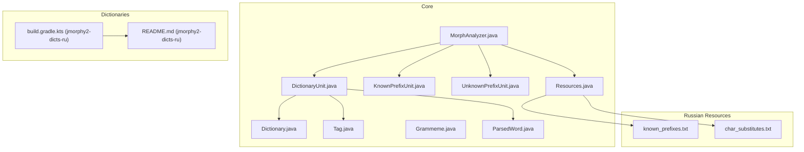
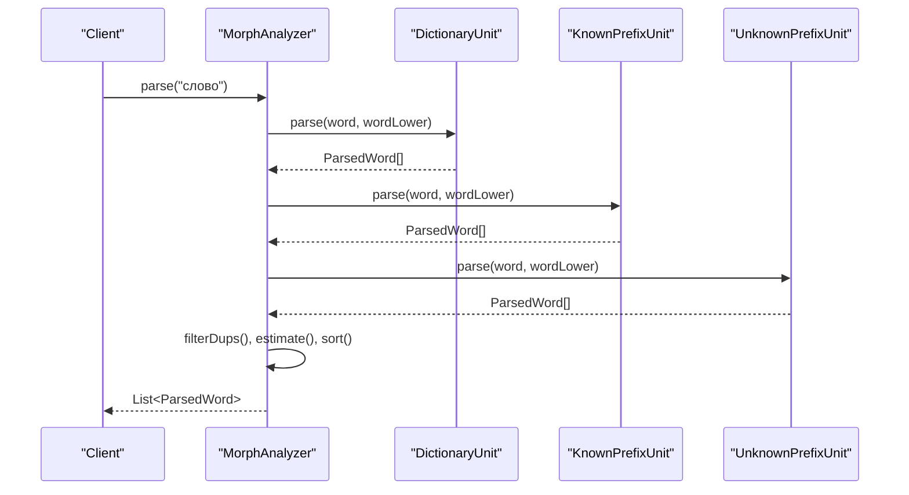
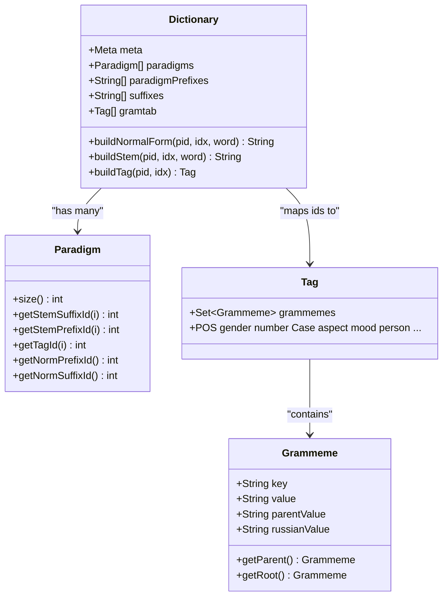
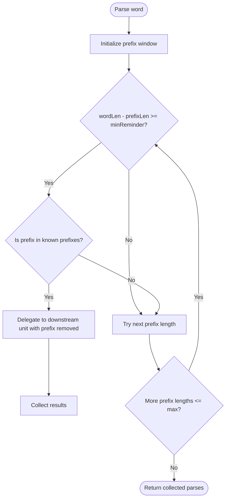
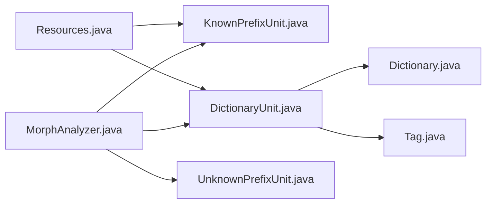

# Russian Language Processing

<cite>
**Referenced Files in This Document**
- [MorphAnalyzer.java](file://jmorphy2-core/src/main/java/company/evo/jmorphy2/MorphAnalyzer.java)
- [Dictionary.java](file://jmorphy2-core/src/main/java/company/evo/jmorphy2/Dictionary.java)
- [Tag.java](file://jmorphy2-core/src/main/java/company/evo/jmorphy2/Tag.java)
- [Grammeme.java](file://jmorphy2-core/src/main/java/company/evo/jmorphy2/Grammeme.java)
- [ParsedWord.java](file://jmorphy2-core/src/main/java/company/evo/jmorphy2/ParsedWord.java)
- [DictionaryUnit.java](file://jmorphy2-core/src/main/java/company/evo/jmorphy2/units/DictionaryUnit.java)
- [KnownPrefixUnit.java](file://jmorphy2-core/src/main/java/company/evo/jmorphy2/units/KnownPrefixUnit.java)
- [UnknownPrefixUnit.java](file://jmorphy2-core/src/main/java/company/evo/jmorphy2/units/UnknownPrefixUnit.java)
- [Resources.java](file://jmorphy2-core/src/main/java/company/evo/jmorphy2/Resources.java)
- [known_prefixes.txt](file://jmorphy2-core/src/main/resources/lang/ru/known_prefixes.txt)
- [char_substitutes.txt](file://jmorphy2-core/src/main/resources/lang/ru/char_substitutes.txt)
- [MorphAnalyzerRUTest.java](file://jmorphy2-core/src/test/java/company/evo/jmorphy2/MorphAnalyzerRUTest.java)
- [build.gradle.kts (jmorphy2-dicts-ru)](file://jmorphy2-dicts-ru/build.gradle.kts)
- [README.md (jmorphy2-dicts-ru)](file://jmorphy2-dicts-ru/README.md)
- [tagger_rules.txt (Elasticsearch ru)](file://jmorphy2-elasticsearch/src/test/resources/company/evo/jmorphy2/elasticsearch/index/ru/tagger_rules.txt)
</cite>

## Table of Contents
1. [Introduction](#introduction)
2. [Project Structure](#project-structure)
3. [Core Components](#core-components)
4. [Architecture Overview](#architecture-overview)
5. [Detailed Component Analysis](#detailed-component-analysis)
6. [Dependency Analysis](#dependency-analysis)
7. [Performance Considerations](#performance-considerations)
8. [Troubleshooting Guide](#troubleshooting-guide)
9. [Conclusion](#conclusion)
10. [Appendices](#appendices)

## Introduction
This document explains the Russian language morphological processing capabilities implemented in the system. It focuses on Slavic inflection patterns, grammatical gender and case handling, the Russian dictionary structure and paradigm tables, the known prefixes mechanism for improved word boundary detection, and Russian-specific tag storage and grammeme mappings. Practical examples demonstrate analysis results for Russian nouns, verbs, adjectives, and pronouns. The guide also covers Russian language nuances such as soft consonants, palatalization effects, and historical spelling variations, along with configuration and troubleshooting guidance.

## Project Structure
The Russian language support is primarily implemented in the core analyzer and dictionary modules, with language-specific resources and tests validating behavior. The Russian dictionary is packaged separately and fetched during build.

**Diagram sources**
- [MorphAnalyzer.java:15-105](file://jmorphy2-core/src/main/java/company/evo/jmorphy2/MorphAnalyzer.java#L15-L105)
- [Dictionary.java:12-139](file://jmorphy2-core/src/main/java/company/evo/jmorphy2/Dictionary.java#L12-L139)
- [Tag.java:7-230](file://jmorphy2-core/src/main/java/company/evo/jmorphy2/Tag.java#L7-L230)
- [Grammeme.java:7-86](file://jmorphy2-core/src/main/java/company/evo/jmorphy2/Grammeme.java#L7-L86)
- [ParsedWord.java:9-89](file://jmorphy2-core/src/main/java/company/evo/jmorphy2/ParsedWord.java#L9-L89)
- [DictionaryUnit.java:14-104](file://jmorphy2-core/src/main/java/company/evo/jmorphy2/units/DictionaryUnit.java#L14-L104)
- [KnownPrefixUnit.java:12-75](file://jmorphy2-core/src/main/java/company/evo/jmorphy2/units/KnownPrefixUnit.java#L12-L75)
- [UnknownPrefixUnit.java:11-75](file://jmorphy2-core/src/main/java/company/evo/jmorphy2/units/UnknownPrefixUnit.java#L11-L75)
- [Resources.java:16-114](file://jmorphy2-core/src/main/java/company/evo/jmorphy2/Resources.java#L16-L114)
- [known_prefixes.txt:1-145](file://jmorphy2-core/src/main/resources/lang/ru/known_prefixes.txt#L1-L145)
- [char_substitutes.txt:1-2](file://jmorphy2-core/src/main/resources/lang/ru/char_substitutes.txt#L1-L2)
- [build.gradle.kts (jmorphy2-dicts-ru):1-14](file://jmorphy2-dicts-ru/build.gradle.kts#L1-L14)
- [README.md (jmorphy2-dicts-ru):1-10](file://jmorphy2-dicts-ru/README.md#L1-L10)

**Section sources**
- [MorphAnalyzer.java:15-105](file://jmorphy2-core/src/main/java/company/evo/jmorphy2/MorphAnalyzer.java#L15-L105)
- [Dictionary.java:12-139](file://jmorphy2-core/src/main/java/company/evo/jmorphy2/Dictionary.java#L12-L139)
- [Resources.java:16-114](file://jmorphy2-core/src/main/java/company/evo/jmorphy2/Resources.java#L16-L114)
- [build.gradle.kts (jmorphy2-dicts-ru):1-14](file://jmorphy2-dicts-ru/build.gradle.kts#L1-L14)
- [README.md (jmorphy2-dicts-ru):1-10](file://jmorphy2-dicts-ru/README.md#L1-L10)

## Core Components
- MorphAnalyzer orchestrates parsing via a pipeline of AnalyzerUnits, including dictionary lookup, number, punctuation, Latin, known/unknown prefixes/suffixes, and unknown word handling. It supports probabilistic estimation when available.
- Dictionary encapsulates the compiled dictionary metadata, paradigm tables, suffix sets, and grammeme-to-tag mapping. It builds normal forms and tags from paradigms and provides prediction suffixes per paradigm prefix group.
- Tag and Grammeme define the grammatical tag model, with standardized keys for part-of-speech, animacy, gender, number, case, aspect, transitivity, person, tense, mood, voice, and involvement. Tags are stored and normalized centrally.
- DictionaryUnit performs dictionary lookup with optional character substitutions and produces parsed word forms with tags and normal forms.
- Prefix units (KnownPrefixUnit, UnknownPrefixUnit) improve word boundary detection by splitting candidate prefixes and delegating analysis to downstream units.
- Resources loads language-specific known prefixes and character substitution rules.

**Section sources**
- [MorphAnalyzer.java:15-105](file://jmorphy2-core/src/main/java/company/evo/jmorphy2/MorphAnalyzer.java#L15-L105)
- [Dictionary.java:12-139](file://jmorphy2-core/src/main/java/company/evo/jmorphy2/Dictionary.java#L12-L139)
- [Tag.java:7-230](file://jmorphy2-core/src/main/java/company/evo/jmorphy2/Tag.java#L7-L230)
- [Grammeme.java:7-86](file://jmorphy2-core/src/main/java/company/evo/jmorphy2/Grammeme.java#L7-L86)
- [DictionaryUnit.java:14-104](file://jmorphy2-core/src/main/java/company/evo/jmorphy2/units/DictionaryUnit.java#L14-L104)
- [KnownPrefixUnit.java:12-75](file://jmorphy2-core/src/main/java/company/evo/jmorphy2/units/KnownPrefixUnit.java#L12-L75)
- [UnknownPrefixUnit.java:11-75](file://jmorphy2-core/src/main/java/company/evo/jmorphy2/units/UnknownPrefixUnit.java#L11-L75)
- [Resources.java:16-114](file://jmorphy2-core/src/main/java/company/evo/jmorphy2/Resources.java#L16-L114)

## Architecture Overview
The Russian morphological analyzer composes multiple AnalyzerUnits in sequence. The pipeline prioritizes dictionary lookup, then handles numeric tokens, punctuation, Roman numerals, Latin words, known prefixes, unknown prefixes, known suffixes, and finally unknown words. Character substitutions and known prefixes are applied during construction.

**Diagram sources**
- [MorphAnalyzer.java:178-200](file://jmorphy2-core/src/main/java/company/evo/jmorphy2/MorphAnalyzer.java#L178-L200)
- [DictionaryUnit.java:56-65](file://jmorphy2-core/src/main/java/company/evo/jmorphy2/units/DictionaryUnit.java#L56-L65)
- [KnownPrefixUnit.java:62-73](file://jmorphy2-core/src/main/java/company/evo/jmorphy2/units/KnownPrefixUnit.java#L62-L73)
- [UnknownPrefixUnit.java:64-73](file://jmorphy2-core/src/main/java/company/evo/jmorphy2/units/UnknownPrefixUnit.java#L64-L73)

## Detailed Component Analysis

### Russian Dictionary Structure and Paradigm Tables
- Paradigm storage: Each paradigm defines a set of word form variants with associated tags and stem/suffix manipulations. The paradigm holds three segments: stem suffix ids, tag ids, and stem prefix ids, aligned by count.
- Normal form building: Uses paradigm’s norm prefix/suffix and computed stem to reconstruct canonical forms.
- Grammatical tag mapping: Tags are loaded from a JSON array and indexed by dictionary metadata; each paradigm index maps to a tag id.
- Prediction suffixes: Separate DAWGs per paradigm prefix group assist in predicting likely endings.

**Diagram sources**
- [Dictionary.java:12-139](file://jmorphy2-core/src/main/java/company/evo/jmorphy2/Dictionary.java#L12-L139)
- [Dictionary.java:262-300](file://jmorphy2-core/src/main/java/company/evo/jmorphy2/Dictionary.java#L262-L300)
- [Tag.java:7-230](file://jmorphy2-core/src/main/java/company/evo/jmorphy2/Tag.java#L7-L230)
- [Grammeme.java:7-86](file://jmorphy2-core/src/main/java/company/evo/jmorphy2/Grammeme.java#L7-L86)

**Section sources**
- [Dictionary.java:12-139](file://jmorphy2-core/src/main/java/company/evo/jmorphy2/Dictionary.java#L12-L139)
- [Dictionary.java:262-300](file://jmorphy2-core/src/main/java/company/evo/jmorphy2/Dictionary.java#L262-L300)

### Russian Tag Storage and Grammeme Mappings
- Tag keys represent grammatical categories such as part-of-speech (POST), animacy (ANim), gender (GNdr), number (NMbr), case (CAse), aspect (ASpc), transitivity (TRns), person (PErs), tense (TEns), mood (MOod), voice (VOic), and involvement (INvl).
- Grammemes are hierarchical; each grammeme has a parent/root relationship enabling category checks against roots.
- Tags are normalized and stored centrally, ensuring consistent comparison and filtering.

Practical usage examples (from tests):
- Adjective “красивого” yields multiple tags with POS=ADJF, Case=gent, Number=sing, Gender/neuter or Gender=masc, and Animacy=anim for accusative.
- Noun “снега” shows genitive singular and plural variants.
- Adverb “сегодня”, numeral “1”, punctuation “.”, Latin “test”, Roman “MD”, and unknown “ъь”.

**Section sources**
- [Tag.java:7-230](file://jmorphy2-core/src/main/java/company/evo/jmorphy2/Tag.java#L7-L230)
- [Grammeme.java:7-86](file://jmorphy2-core/src/main/java/company/evo/jmorphy2/Grammeme.java#L7-L86)
- [MorphAnalyzerRUTest.java:30-142](file://jmorphy2-core/src/test/java/company/evo/jmorphy2/MorphAnalyzerRUTest.java#L30-L142)

### Known Prefix System and Word Boundary Detection
- Known prefixes are preloaded from a resource list and matched greedily up to a configurable minimum reminder length. This improves parsing of compound words and foreign blends.
- Unknown prefixes are handled with bounded maximum length and minimum reminder to avoid over-segmentation.

Examples from tests:
- Known prefix “псевдо-” splits “псевдокошка” into prefix and stem.
- Hyphenated known prefix “лже-” recognized in “лже-кот”.
- Unknown prefix “лошарик” + “шарики” segmented with minimum reminder enforcement.
- Maximum prefix length and minimum reminder controls demonstrated in “бочкоподобный” and “штрихкот”.

**Diagram sources**
- [KnownPrefixUnit.java:62-73](file://jmorphy2-core/src/main/java/company/evo/jmorphy2/units/KnownPrefixUnit.java#L62-L73)
- [UnknownPrefixUnit.java:64-73](file://jmorphy2-core/src/main/java/company/evo/jmorphy2/units/UnknownPrefixUnit.java#L64-L73)
- [known_prefixes.txt:1-145](file://jmorphy2-core/src/main/resources/lang/ru/known_prefixes.txt#L1-L145)

**Section sources**
- [KnownPrefixUnit.java:12-75](file://jmorphy2-core/src/main/java/company/evo/jmorphy2/units/KnownPrefixUnit.java#L12-L75)
- [UnknownPrefixUnit.java:11-75](file://jmorphy2-core/src/main/java/company/evo/jmorphy2/units/UnknownPrefixUnit.java#L11-L75)
- [Resources.java:34-40](file://jmorphy2-core/src/main/java/company/evo/jmorphy2/Resources.java#L34-L40)
- [known_prefixes.txt:1-145](file://jmorphy2-core/src/main/resources/lang/ru/known_prefixes.txt#L1-L145)
- [MorphAnalyzerRUTest.java:56-78](file://jmorphy2-core/src/test/java/company/evo/jmorphy2/MorphAnalyzerRUTest.java#L56-L78)

### Russian Language Nuances: Soft Consonants, Palatalization, Historical Spelling
- Character substitution: The Russian resource defines “е” => “ё”, enabling normalization of historical/euphonic spelling differences.
- Case system: Tests show genitive, nominative, dative, accusative, instrumental, and prepositional (loct) cases for nouns.
- Gender and animacy: Adjectives and pronouns reflect gender (masculine, feminine, neuter) and animacy distinctions affecting agreement.
- Historical spelling: Tests demonstrate equivalence between “ёжик” and “ежик”, and “теплые” vs “тёплый”.

**Section sources**
- [char_substitutes.txt:1-2](file://jmorphy2-core/src/main/resources/lang/ru/char_substitutes.txt#L1-L2)
- [MorphAnalyzerRUTest.java:108-114](file://jmorphy2-core/src/test/java/company/evo/jmorphy2/MorphAnalyzerRUTest.java#L108-L114)
- [MorphAnalyzerRUTest.java:80-107](file://jmorphy2-core/src/test/java/company/evo/jmorphy2/MorphAnalyzerRUTest.java#L80-L107)

### Practical Examples: Russian Nouns, Verbs, Adjectives, Pronouns
- Adjective “красивого”: yields ADJF with Case=gent, Number=sing, and Gender=masc/neut/anim depending on form.
- Noun “снега”: genitive singular and plural variants; “снеге” and “снегу” demonstrate loct and loc2/gen2 mappings.
- Adverb “сегодня”, numeral “1”, punctuation “.”, Latin “test”, Roman “MD”, unknown “ъь”.
- Lexeme enumeration: “красивого” expands to multiple paradigm forms including nominative/accusative and superlative degrees.

**Section sources**
- [MorphAnalyzerRUTest.java:30-142](file://jmorphy2-core/src/test/java/company/evo/jmorphy2/MorphAnalyzerRUTest.java#L30-L142)
- [MorphAnalyzerRUTest.java:160-211](file://jmorphy2-core/src/test/java/company/evo/jmorphy2/MorphAnalyzerRUTest.java#L160-L211)

### Configuration and Build for Russian Language Processing
- Dictionary packaging: The Russian dictionary module fetches and packages the dictionary resources from upstream sources.
- Test harness: Russian tests initialize the analyzer with language code “ru” and validate parsing behavior.

Configuration highlights:
- Language selection: The builder resolves language-specific resources and units.
- Character substitution and known prefixes: Loaded automatically for the selected language.
- Optional probability estimation: Enabled when dictionary metadata indicates availability.

**Section sources**
- [build.gradle.kts (jmorphy2-dicts-ru):1-14](file://jmorphy2-dicts-ru/build.gradle.kts#L1-L14)
- [README.md (jmorphy2-dicts-ru):1-10](file://jmorphy2-dicts-ru/README.md#L1-L10)
- [MorphAnalyzer.java:52-99](file://jmorphy2-core/src/main/java/company/evo/jmorphy2/MorphAnalyzer.java#L52-L99)
- [Resources.java:16-40](file://jmorphy2-core/src/main/java/company/evo/jmorphy2/Resources.java#L16-L40)

## Dependency Analysis
The Russian analyzer composes units with clear dependencies and minimal coupling. DictionaryUnit depends on Dictionary and Tag storage; prefix units depend on downstream units. Resources supply language-specific lists.

**Diagram sources**
- [MorphAnalyzer.java:52-99](file://jmorphy2-core/src/main/java/company/evo/jmorphy2/MorphAnalyzer.java#L52-L99)
- [DictionaryUnit.java:14-104](file://jmorphy2-core/src/main/java/company/evo/jmorphy2/units/DictionaryUnit.java#L14-L104)
- [KnownPrefixUnit.java:12-75](file://jmorphy2-core/src/main/java/company/evo/jmorphy2/units/KnownPrefixUnit.java#L12-L75)
- [UnknownPrefixUnit.java:11-75](file://jmorphy2-core/src/main/java/company/evo/jmorphy2/units/UnknownPrefixUnit.java#L11-L75)
- [Resources.java:16-114](file://jmorphy2-core/src/main/java/company/evo/jmorphy2/Resources.java#L16-L114)

**Section sources**
- [MorphAnalyzer.java:52-99](file://jmorphy2-core/src/main/java/company/evo/jmorphy2/MorphAnalyzer.java#L52-L99)
- [DictionaryUnit.java:14-104](file://jmorphy2-core/src/main/java/company/evo/jmorphy2/units/DictionaryUnit.java#L14-L104)
- [KnownPrefixUnit.java:12-75](file://jmorphy2-core/src/main/java/company/evo/jmorphy2/units/KnownPrefixUnit.java#L12-L75)
- [UnknownPrefixUnit.java:11-75](file://jmorphy2-core/src/main/java/company/evo/jmorphy2/units/UnknownPrefixUnit.java#L11-L75)
- [Resources.java:16-114](file://jmorphy2-core/src/main/java/company/evo/jmorphy2/Resources.java#L16-L114)

## Performance Considerations
- Dictionary lookup uses compact DAWGs and paradigm indexing for fast retrieval.
- Prediction suffix DAWGs accelerate candidate generation per paradigm prefix group.
- Prefix units prune search space early, reducing downstream work.
- Probabilistic scoring is applied when available; otherwise, scores remain lexical.

[No sources needed since this section provides general guidance]

## Troubleshooting Guide
Common issues and resolutions:
- Unexpected unknown-word classification: Verify minimum prefix length and maximum prefix length settings in UnknownPrefixUnit; adjust to balance recall vs. precision.
- Missing known prefix segmentation: Confirm the prefix appears in the known prefixes list and is lowercased consistently.
- Case/number/gender mismatches: Inspect the tag string and grammeme keys; ensure the expected grammeme values match the normalized tag representation.
- Historical spelling differences: Ensure character substitution is enabled for the target language so “е” and “ё” are treated equivalently.
- Probabilistic estimates not applied: Check dictionary metadata for probability table presence; enable when available.

**Section sources**
- [UnknownPrefixUnit.java:26-61](file://jmorphy2-core/src/main/java/company/evo/jmorphy2/units/UnknownPrefixUnit.java#L26-L61)
- [KnownPrefixUnit.java:29-59](file://jmorphy2-core/src/main/java/company/evo/jmorphy2/units/KnownPrefixUnit.java#L29-L59)
- [Resources.java:16-40](file://jmorphy2-core/src/main/java/company/evo/jmorphy2/Resources.java#L16-L40)
- [MorphAnalyzer.java:202-232](file://jmorphy2-core/src/main/java/company/evo/jmorphy2/MorphAnalyzer.java#L202-L232)
- [MorphAnalyzerRUTest.java:108-114](file://jmorphy2-core/src/test/java/company/evo/jmorphy2/MorphAnalyzerRUTest.java#L108-L114)

## Conclusion
The Russian language processing pipeline leverages a robust dictionary model with paradigm tables, precise grammeme/tag semantics, and language-specific resources. The known prefix system and character substitution enhance accuracy for complex and historically variant forms. Tests validate coverage across nouns, adjectives, adverbs, numerals, punctuation, Latin, and unknown tokens, demonstrating practical applicability.

[No sources needed since this section summarizes without analyzing specific files]

## Appendices

### Appendix A: Russian Tag Keys and Categories
- Part-of-speech: ADJF, NOUN, ADVB, NUMB, LATN, ROMN, PNCT, UNKN
- Animacy: ANim
- Gender: GNdr (masculine, feminine, neuter)
- Number: NMbr (singular, plural)
- Case: CAse (nominative, genitive, dative, accusative, instrumental, prepositional)
- Aspect: ASpc
- Transitivity: TRns
- Person: PErs
- Tense: TEns
- Mood: MOod
- Voice: VOic
- Involvement: INvl

**Section sources**
- [Tag.java:7-230](file://jmorphy2-core/src/main/java/company/evo/jmorphy2/Tag.java#L7-L230)
- [MorphAnalyzerRUTest.java:30-142](file://jmorphy2-core/src/test/java/company/evo/jmorphy2/MorphAnalyzerRUTest.java#L30-L142)

### Appendix B: Russian NLP Pipeline Rules (Elasticsearch)
Russian-specific rules for conjunctions and prepositions are provided for indexing and tagging contexts.

**Section sources**
- [tagger_rules.txt (Elasticsearch ru):1-8](file://jmorphy2-elasticsearch/src/test/resources/company/evo/jmorphy2/elasticsearch/index/ru/tagger_rules.txt#L1-L8)