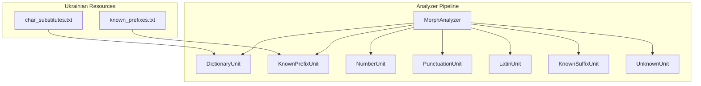
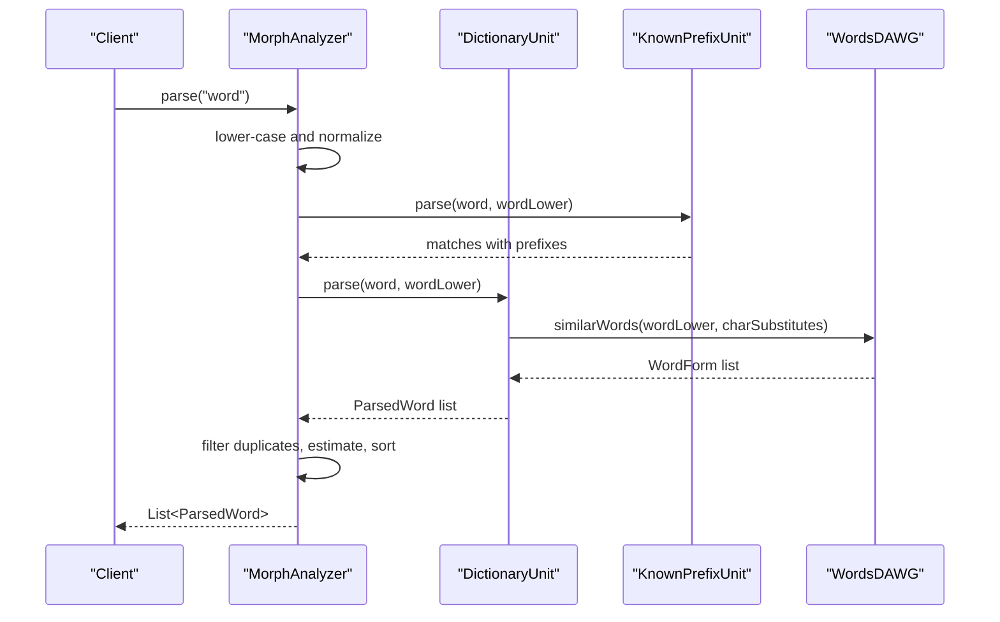
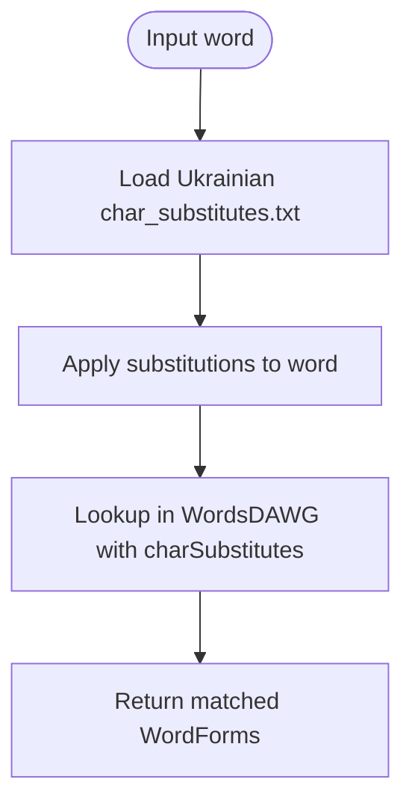
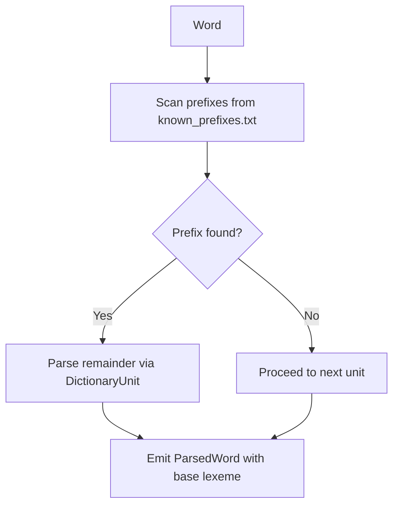
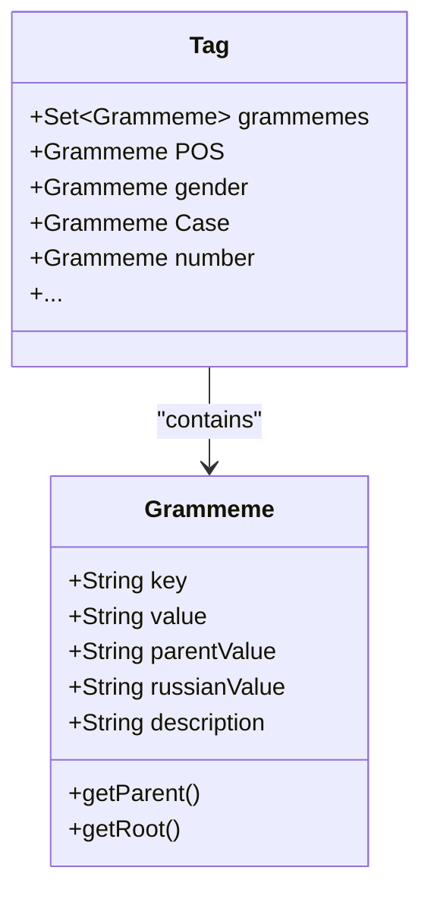
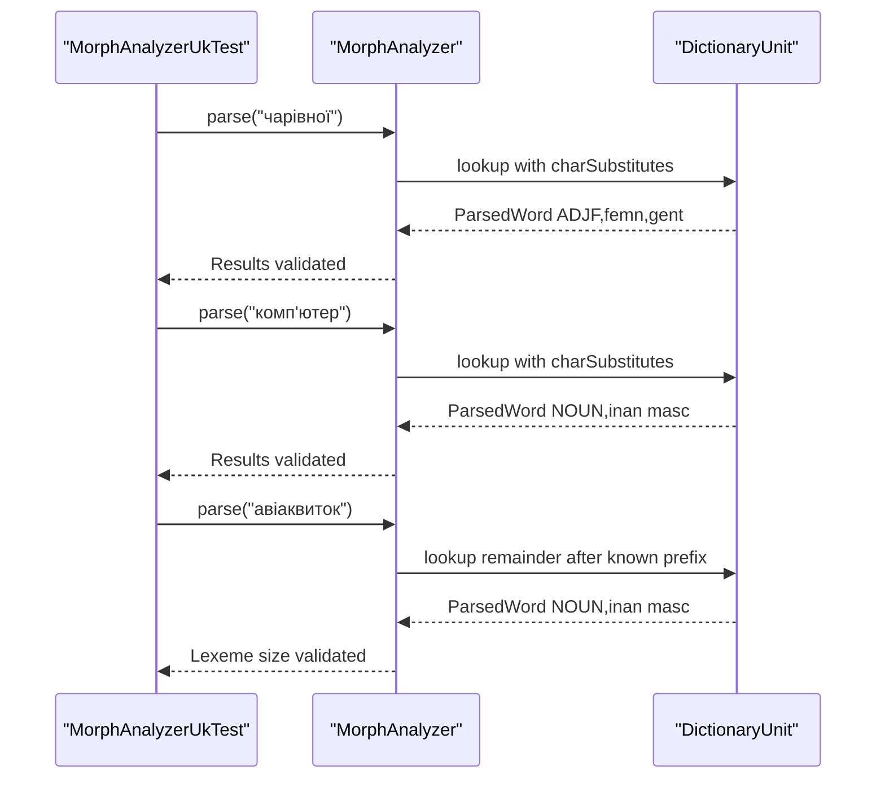
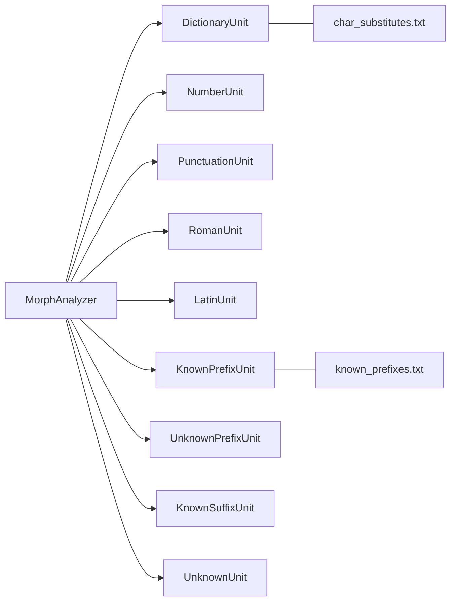

# Ukrainian Language Processing

<cite>
**Referenced Files in This Document**
- [char_substitutes.txt](file://jmorphy2-core/src/main/resources/lang/uk/char_substitutes.txt)
- [known_prefixes.txt](file://jmorphy2-core/src/main/resources/lang/uk/known_prefixes.txt)
- [MorphAnalyzer.java](file://jmorphy2-core/src/main/java/company/evo/jmorphy2/MorphAnalyzer.java)
- [DictionaryUnit.java](file://jmorphy2-core/src/main/java/company/evo/jmorphy2/units/DictionaryUnit.java)
- [KnownPrefixUnit.java](file://jmorphy2-core/src/main/java/company/evo/jmorphy2/units/KnownPrefixUnit.java)
- [Resources.java](file://jmorphy2-core/src/main/java/company/evo/jmorphy2/Resources.java)
- [WordsDAWG.java](file://jmorphy2-core/src/main/java/company/evo/jmorphy2/WordsDAWG.java)
- [Tag.java](file://jmorphy2-core/src/main/java/company/evo/jmorphy2/Tag.java)
- [Grammeme.java](file://jmorphy2-core/src/main/java/company/evo/jmorphy2/Grammeme.java)
- [ParsedWord.java](file://jmorphy2-core/src/main/java/company/evo/jmorphy2/ParsedWord.java)
- [MorphAnalyzerUkTest.java](file://jmorphy2-core/src/test/java/company/evo/jmorphy2/MorphAnalyzerUkTest.java)
- [jmorphy2-dicts-uk README.md](file://jmorphy2-dicts-uk/README.md)
- [jmorphy2-dicts-uk build.gradle.kts](file://jmorphy2-dicts-uk/build.gradle.kts)
</cite>

## Table of Contents
1. [Introduction](#introduction)
2. [Project Structure](#project-structure)
3. [Core Components](#core-components)
4. [Architecture Overview](#architecture-overview)
5. [Detailed Component Analysis](#detailed-component-analysis)
6. [Dependency Analysis](#dependency-analysis)
7. [Performance Considerations](#performance-considerations)
8. [Troubleshooting Guide](#troubleshooting-guide)
9. [Conclusion](#conclusion)
10. [Appendices](#appendices)

## Introduction
This document explains the Ukrainian language morphological processing capabilities implemented in the system. It focuses on:
- Ukrainian-specific character substitutions for ї, й, є, і and other graphemic variants
- The known prefixes system and how it differs from Russian
- Orthographic variation handling via character substitution and prefix parsing
- Practical examples of morphological analysis for Ukrainian words with special characters
- Ukrainian grammatical features supported by the tagset (three-gender system, complex case inflection)
- Challenges such as soft consonant mutations and vowel harmony as they relate to dictionary coverage and normalization
- Configuration and troubleshooting guidance for character encoding and normalization

## Project Structure
Ukrainian language support is organized around resource files and analyzer units:
- Language resources for Ukrainian are located under the Ukrainian language directory and include character substitution rules and known prefixes lists
- The analyzer composes multiple units to parse input: dictionary lookup, number handling, punctuation, Latin, known prefixes, unknown prefixes, known suffixes, and unknown tokens
- Tests demonstrate parsing behavior for Ukrainian words and known prefixes

**Diagram sources**
- [MorphAnalyzer.java:52-99](file://jmorphy2-core/src/main/java/company/evo/jmorphy2/MorphAnalyzer.java#L52-L99)
- [DictionaryUnit.java:14-26](file://jmorphy2-core/src/main/java/company/evo/jmorphy2/units/DictionaryUnit.java#L14-L26)
- [KnownPrefixUnit.java:12-27](file://jmorphy2-core/src/main/java/company/evo/jmorphy2/units/KnownPrefixUnit.java#L12-L27)
- [char_substitutes.txt:1-4](file://jmorphy2-core/src/main/resources/lang/uk/char_substitutes.txt#L1-L4)
- [known_prefixes.txt:1-480](file://jmorphy2-core/src/main/resources/lang/uk/known_prefixes.txt#L1-L480)

**Section sources**
- [MorphAnalyzer.java:52-99](file://jmorphy2-core/src/main/java/company/evo/jmorphy2/MorphAnalyzer.java#L52-L99)
- [Resources.java:17-40](file://jmorphy2-core/src/main/java/company/evo/jmorphy2/Resources.java#L17-L40)
- [MorphAnalyzerUkTest.java:22-67](file://jmorphy2-core/src/test/java/company/evo/jmorphy2/MorphAnalyzerUkTest.java#L22-L67)

## Core Components
- Character Substitution Rules: Ukrainian-specific substitutions are loaded from the Ukrainian resource file and applied during dictionary lookup to match alternate orthographic forms
- Known Prefixes: A curated list of Ukrainian prefixes enables accurate parsing of prefixed compounds and loanwords
- Analyzer Pipeline: The analyzer composes units in order, applying dictionary lookup, prefix/suffix handling, and fallbacks
- Tagging and Lexical Paradigms: The tagset supports Ukrainian grammatical categories such as part-of-speech, animacy, gender, number, and case; lexicographic paradigms are generated for inflection

**Section sources**
- [char_substitutes.txt:1-4](file://jmorphy2-core/src/main/resources/lang/uk/char_substitutes.txt#L1-L4)
- [known_prefixes.txt:1-480](file://jmorphy2-core/src/main/resources/lang/uk/known_prefixes.txt#L1-L480)
- [MorphAnalyzer.java:52-99](file://jmorphy2-core/src/main/java/company/evo/jmorphy2/MorphAnalyzer.java#L52-L99)
- [Tag.java:8-40](file://jmorphy2-core/src/main/java/company/evo/jmorphy2/Tag.java#L8-L40)
- [ParsedWord.java:30-43](file://jmorphy2-core/src/main/java/company/evo/jmorphy2/ParsedWord.java#L30-L43)

## Architecture Overview
The Ukrainian morphological pipeline integrates resource-driven normalization and prefix parsing with dictionary-based analysis.

**Diagram sources**
- [MorphAnalyzer.java:178-200](file://jmorphy2-core/src/main/java/company/evo/jmorphy2/MorphAnalyzer.java#L178-L200)
- [KnownPrefixUnit.java:62-73](file://jmorphy2-core/src/main/java/company/evo/jmorphy2/units/KnownPrefixUnit.java#L62-L73)
- [DictionaryUnit.java:56-65](file://jmorphy2-core/src/main/java/company/evo/jmorphy2/units/DictionaryUnit.java#L56-L65)
- [WordsDAWG.java:25-31](file://jmorphy2-core/src/main/java/company/evo/jmorphy2/WordsDAWG.java#L25-L31)

## Detailed Component Analysis

### Ukrainian Character Substitutions
- Purpose: Normalize variant glyphs and punctuation apostrophes to canonical forms recognized by the dictionary
- Mechanism: The analyzer loads substitutions from the Ukrainian resource file and passes them to the dictionary unit; the DAWG search uses these rules to find matching entries
- Examples of substitutions include mappings for specific characters and Unicode apostrophe variants

**Diagram sources**
- [Resources.java:17-32](file://jmorphy2-core/src/main/java/company/evo/jmorphy2/Resources.java#L17-L32)
- [DictionaryUnit.java:56-65](file://jmorphy2-core/src/main/java/company/evo/jmorphy2/units/DictionaryUnit.java#L56-L65)
- [WordsDAWG.java:25-31](file://jmorphy2-core/src/main/java/company/evo/jmorphy2/WordsDAWG.java#L25-L31)

**Section sources**
- [char_substitutes.txt:1-4](file://jmorphy2-core/src/main/resources/lang/uk/char_substitutes.txt#L1-L4)
- [Resources.java:17-32](file://jmorphy2-core/src/main/java/company/evo/jmorphy2/Resources.java#L17-L32)
- [MorphAnalyzer.java:64-68](file://jmorphy2-core/src/main/java/company/evo/jmorphy2/MorphAnalyzer.java#L64-L68)

### Known Prefixes System (Ukrainian vs Russian)
- Purpose: Recognize common Ukrainian prefixes to disambiguate and correctly parse prefixed compounds and loanwords
- Differences from Russian: The Ukrainian list includes many Slavic and foreign-derived prefixes typical in Ukrainian, alongside adapted Russian-style prefixes
- Behavior: The KnownPrefixUnit scans the beginning of the word for known prefixes and delegates parsing to the dictionary unit with the remainder

**Diagram sources**
- [known_prefixes.txt:1-480](file://jmorphy2-core/src/main/resources/lang/uk/known_prefixes.txt#L1-L480)
- [KnownPrefixUnit.java:62-73](file://jmorphy2-core/src/main/java/company/evo/jmorphy2/units/KnownPrefixUnit.java#L62-L73)
- [MorphAnalyzer.java:75-77](file://jmorphy2-core/src/main/java/company/evo/jmorphy2/MorphAnalyzer.java#L75-L77)

**Section sources**
- [known_prefixes.txt:337-480](file://jmorphy2-core/src/main/resources/lang/uk/known_prefixes.txt#L337-L480)
- [MorphAnalyzerUkTest.java:90-97](file://jmorphy2-core/src/test/java/company/evo/jmorphy2/MorphAnalyzerUkTest.java#L90-L97)

### Ukrainian Morphological Features Supported by the Tagset
- Three-gender system: Masculine, feminine, neuter are represented in the tagset
- Complex case inflection: The tagset includes case markers enabling generation of multiple paradigms
- Additional categories: Animacy, number, aspect, person, tense, mood, voice, transitivity are also present in the tagset

**Diagram sources**
- [Tag.java:27-73](file://jmorphy2-core/src/main/java/company/evo/jmorphy2/Tag.java#L27-L73)
- [Grammeme.java:8-36](file://jmorphy2-core/src/main/java/company/evo/jmorphy2/Grammeme.java#L8-L36)

**Section sources**
- [Tag.java:8-40](file://jmorphy2-core/src/main/java/company/evo/jmorphy2/Tag.java#L8-L40)
- [MorphAnalyzerUkTest.java:35-44](file://jmorphy2-core/src/test/java/company/evo/jmorphy2/MorphAnalyzerUkTest.java#L35-L44)

### Practical Examples: Ukrainian Words with Special Characters
- Demonstrated behaviors include:
  - Parsing of a word with a combining character variant and accepting multiple Unicode apostrophe forms
  - Handling of prefixed compounds with known prefixes
  - Generation of multiple paradigms for adjectives and nouns
- These examples illustrate robustness against orthographic variants and strong prefix recognition

**Diagram sources**
- [MorphAnalyzerUkTest.java:35-67](file://jmorphy2-core/src/test/java/company/evo/jmorphy2/MorphAnalyzerUkTest.java#L35-L67)
- [MorphAnalyzerUkTest.java:90-97](file://jmorphy2-core/src/test/java/company/evo/jmorphy2/MorphAnalyzerUkTest.java#L90-L97)

**Section sources**
- [MorphAnalyzerUkTest.java:35-67](file://jmorphy2-core/src/test/java/company/evo/jmorphy2/MorphAnalyzerUkTest.java#L35-L67)
- [MorphAnalyzerUkTest.java:90-97](file://jmorphy2-core/src/test/java/company/evo/jmorphy2/MorphAnalyzerUkTest.java#L90-L97)

### Ukrainian Challenges: Soft Consonants and Vowel Harmony
- Soft consonant mutations: The system relies on dictionary coverage; if a form is not present in the dictionary, it may be treated as unknown or require normalization to a canonical representation
- Vowel harmony: The tagset encodes gender and case; harmonization is reflected in paradigms rather than explicit phonological rules in the pipeline
- Implication: For words not covered by the dictionary, ensure normalization to canonical forms and consider prefix stripping for better matching

**Section sources**
- [Tag.java:8-40](file://jmorphy2-core/src/main/java/company/evo/jmorphy2/Tag.java#L8-L40)
- [ParsedWord.java:30-43](file://jmorphy2-core/src/main/java/company/evo/jmorphy2/ParsedWord.java#L30-L43)

## Dependency Analysis
The Ukrainian analyzer pipeline composes units with explicit ordering and scoring. Character substitutions and known prefixes are integrated early to maximize coverage.

**Diagram sources**
- [MorphAnalyzer.java:67-81](file://jmorphy2-core/src/main/java/company/evo/jmorphy2/MorphAnalyzer.java#L67-L81)
- [DictionaryUnit.java:14-26](file://jmorphy2-core/src/main/java/company/evo/jmorphy2/units/DictionaryUnit.java#L14-L26)
- [KnownPrefixUnit.java:12-27](file://jmorphy2-core/src/main/java/company/evo/jmorphy2/units/KnownPrefixUnit.java#L12-L27)

**Section sources**
- [MorphAnalyzer.java:52-99](file://jmorphy2-core/src/main/java/company/evo/jmorphy2/MorphAnalyzer.java#L52-L99)

## Performance Considerations
- Early prefix detection reduces dictionary search space for long compounds
- Character substitution minimizes misspellings caused by variant glyphs and apostrophes
- Probability estimation is available when dictionary metadata indicates probabilistic tagging
- Prefer pre-normalized text to reduce repeated transformations

[No sources needed since this section provides general guidance]

## Troubleshooting Guide
- Character encoding and normalization
  - Ensure input is UTF-8 and normalized consistently; the resource loader reads with UTF-8
  - Verify that apostrophe variants and combining marks are covered by the substitution rules
- Known prefixes
  - Confirm that the known prefix list is loaded for Ukrainian; the analyzer injects it automatically when present
- Dictionary coverage
  - Words not in the dictionary are tagged as unknown; normalize forms and strip known prefixes when possible
- Tag interpretation
  - Use the tag storage to resolve grammeme keys and ensure consistent case and gender handling

**Section sources**
- [Resources.java:42-62](file://jmorphy2-core/src/main/java/company/evo/jmorphy2/Resources.java#L42-L62)
- [MorphAnalyzer.java:64-68](file://jmorphy2-core/src/main/java/company/evo/jmorphy2/MorphAnalyzer.java#L64-L68)
- [MorphAnalyzerUkTest.java:99-101](file://jmorphy2-core/src/test/java/company/evo/jmorphy2/MorphAnalyzerUkTest.java#L99-L101)

## Conclusion
The Ukrainian language processing pipeline leverages:
- Ukrainian-specific character substitutions to normalize orthographic variants
- A curated list of known prefixes to parse compounds and loanwords accurately
- A robust tagset supporting Ukrainian grammar (gender, case, number, animacy)
- A modular analyzer pipeline that integrates these components for reliable morphological analysis

[No sources needed since this section summarizes without analyzing specific files]

## Appendices

### Configuration Examples
- Loading Ukrainian resources
  - The analyzer automatically loads Ukrainian character substitutions and known prefixes when building with the Ukrainian language code
- Customizing character substitutions
  - Pass a custom map of character substitutions to the dictionary unit builder if extending behavior
- Enabling probabilistic estimation
  - Probability estimation is enabled automatically when dictionary metadata indicates probabilistic tagging

**Section sources**
- [MorphAnalyzer.java:62-68](file://jmorphy2-core/src/main/java/company/evo/jmorphy2/MorphAnalyzer.java#L62-L68)
- [DictionaryUnit.java:39-43](file://jmorphy2-core/src/main/java/company/evo/jmorphy2/units/DictionaryUnit.java#L39-L43)
- [jmorphy2-dicts-uk README.md:1-12](file://jmorphy2-dicts-uk/README.md#L1-L12)
- [jmorphy2-dicts-uk build.gradle.kts:1-14](file://jmorphy2-dicts-uk/build.gradle.kts#L1-L14)