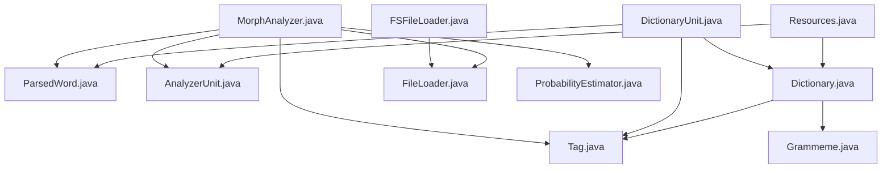
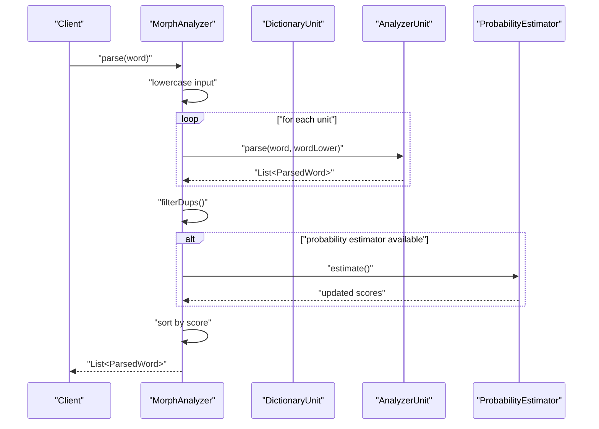
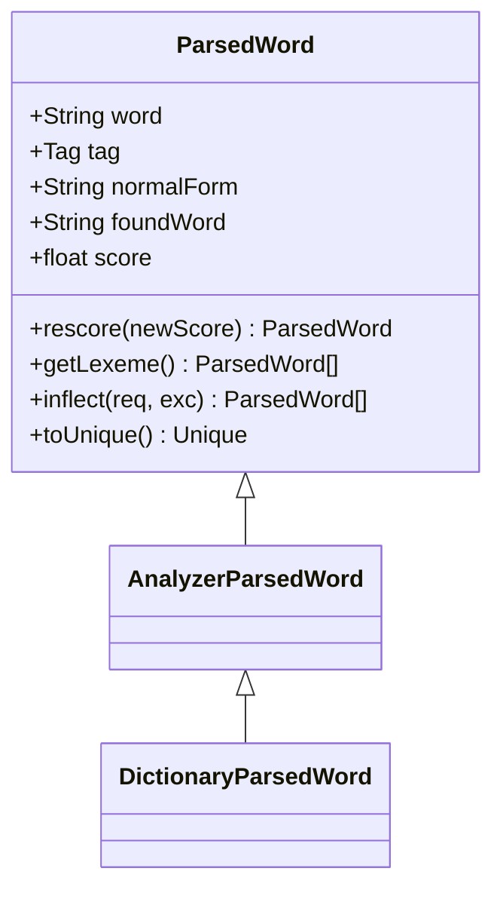
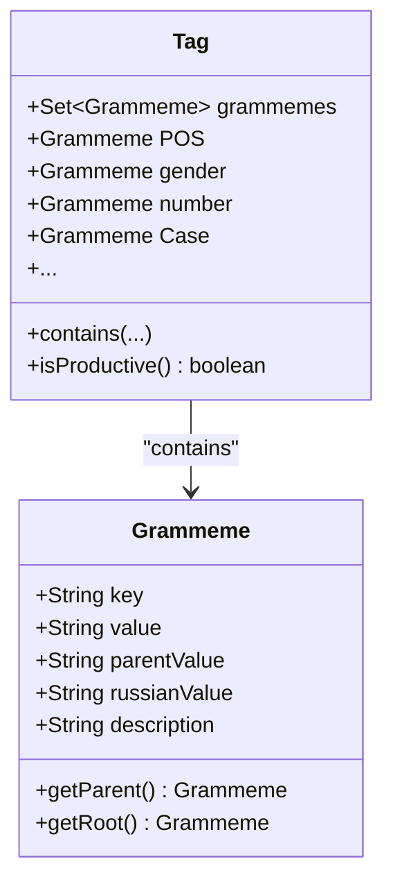
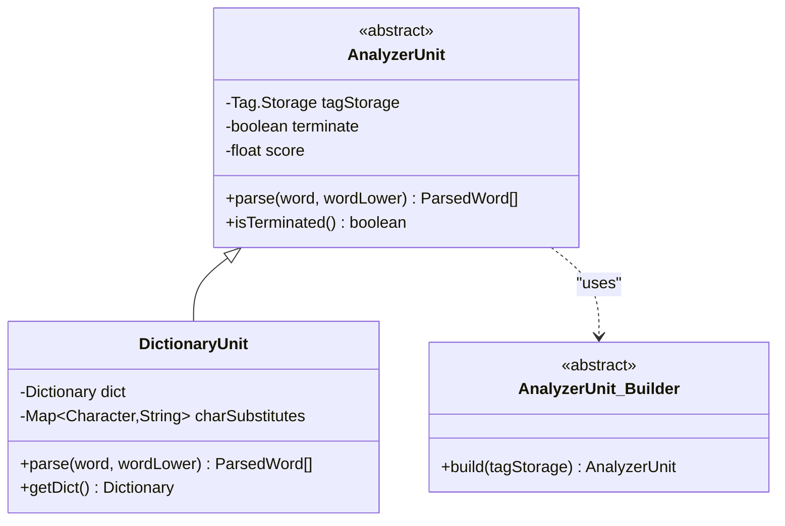
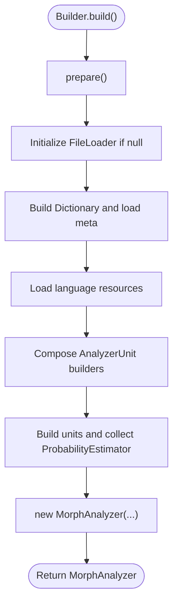
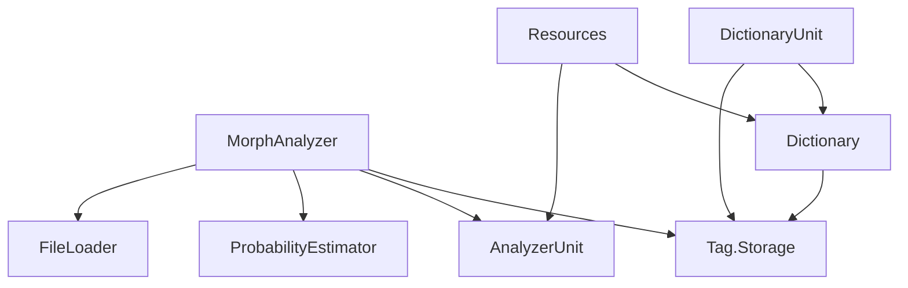

# API Reference

<cite>
**Referenced Files in This Document**
- [MorphAnalyzer.java](file://jmorphy2-core/src/main/java/company/evo/jmorphy2/MorphAnalyzer.java)
- [ParsedWord.java](file://jmorphy2-core/src/main/java/company/evo/jmorphy2/ParsedWord.java)
- [Tag.java](file://jmorphy2-core/src/main/java/company/evo/jmorphy2/Tag.java)
- [Grammeme.java](file://jmorphy2-core/src/main/java/company/evo/jmorphy2/Grammeme.java)
- [AnalyzerUnit.java](file://jmorphy2-core/src/main/java/company/evo/jmorphy2/units/AnalyzerUnit.java)
- [DictionaryUnit.java](file://jmorphy2-core/src/main/java/company/evo/jmorphy2/units/DictionaryUnit.java)
- [ProbabilityEstimator.java](file://jmorphy2-core/src/main/java/company/evo/jmorphy2/ProbabilityEstimator.java)
- [FileLoader.java](file://jmorphy2-core/src/main/java/company/evo/jmorphy2/FileLoader.java)
- [FSFileLoader.java](file://jmorphy2-core/src/main/java/company/evo/jmorphy2/FSFileLoader.java)
- [Resources.java](file://jmorphy2-core/src/main/java/company/evo/jmorphy2/Resources.java)
- [Dictionary.java](file://jmorphy2-core/src/main/java/company/evo/jmorphy2/Dictionary.java)
- [MorphAnalyzerRUTest.java](file://jmorphy2-core/src/test/java/company/evo/jmorphy2/MorphAnalyzerRUTest.java)
- [MorphAnalyzerUkTest.java](file://jmorphy2-core/src/test/java/company/evo/jmorphy2/MorphAnalyzerUkTest.java)
</cite>

## Table of Contents
1. [Introduction](#introduction)
2. [Project Structure](#project-structure)
3. [Core Components](#core-components)
4. [Architecture Overview](#architecture-overview)
5. [Detailed Component Analysis](#detailed-component-analysis)
6. [Dependency Analysis](#dependency-analysis)
7. [Performance Considerations](#performance-considerations)
8. [Troubleshooting Guide](#troubleshooting-guide)
9. [Conclusion](#conclusion)
10. [Appendices](#appendices)

## Introduction
This document provides a comprehensive API reference for the MorphAnalyzer class and related data structures used for morphological analysis of Russian and Ukrainian text. It covers public methods, builder configuration, data models, and usage patterns. It also documents thread safety, performance characteristics, and integration points with other components.

## Project Structure
The morphological analyzer is implemented in the jmorphy2-core module. Key packages and files include:
- Root analyzer and data models: MorphAnalyzer, ParsedWord, Tag, Grammeme
- Analyzer units: AnalyzerUnit and DictionaryUnit
- Dictionary and resources: Dictionary, Resources, FileLoader, FSFileLoader
- Probability estimation: ProbabilityEstimator
- Tests demonstrating usage patterns: MorphAnalyzerRUTest, MorphAnalyzerUkTest

**Diagram sources**
- [MorphAnalyzer.java:15-247](file://jmorphy2-core/src/main/java/company/evo/jmorphy2/MorphAnalyzer.java#L15-L247)
- [ParsedWord.java:9-89](file://jmorphy2-core/src/main/java/company/evo/jmorphy2/ParsedWord.java#L9-L89)
- [Tag.java:7-230](file://jmorphy2-core/src/main/java/company/evo/jmorphy2/Tag.java#L7-L230)
- [Grammeme.java:7-86](file://jmorphy2-core/src/main/java/company/evo/jmorphy2/Grammeme.java#L7-L86)
- [AnalyzerUnit.java:11-72](file://jmorphy2-core/src/main/java/company/evo/jmorphy2/units/AnalyzerUnit.java#L11-L72)
- [DictionaryUnit.java:14-104](file://jmorphy2-core/src/main/java/company/evo/jmorphy2/units/DictionaryUnit.java#L14-L104)
- [Dictionary.java:12-200](file://jmorphy2-core/src/main/java/company/evo/jmorphy2/Dictionary.java#L12-L200)
- [FileLoader.java:7-10](file://jmorphy2-core/src/main/java/company/evo/jmorphy2/FileLoader.java#L7-L10)
- [FSFileLoader.java:9-21](file://jmorphy2-core/src/main/java/company/evo/jmorphy2/FSFileLoader.java#L9-L21)
- [ProbabilityEstimator.java:9-27](file://jmorphy2-core/src/main/java/company/evo/jmorphy2/ProbabilityEstimator.java#L9-L27)
- [Resources.java:16-114](file://jmorphy2-core/src/main/java/company/evo/jmorphy2/Resources.java#L16-L114)

**Section sources**
- [MorphAnalyzer.java:15-247](file://jmorphy2-core/src/main/java/company/evo/jmorphy2/MorphAnalyzer.java#L15-L247)
- [AnalyzerUnit.java:11-72](file://jmorphy2-core/src/main/java/company/evo/jmorphy2/units/AnalyzerUnit.java#L11-L72)
- [DictionaryUnit.java:14-104](file://jmorphy2-core/src/main/java/company/evo/jmorphy2/units/DictionaryUnit.java#L14-L104)
- [Dictionary.java:12-200](file://jmorphy2-core/src/main/java/company/evo/jmorphy2/Dictionary.java#L12-L200)
- [Resources.java:16-114](file://jmorphy2-core/src/main/java/company/evo/jmorphy2/Resources.java#L16-L114)
- [FileLoader.java:7-10](file://jmorphy2-core/src/main/java/company/evo/jmorphy2/FileLoader.java#L7-L10)
- [FSFileLoader.java:9-21](file://jmorphy2-core/src/main/java/company/evo/jmorphy2/FSFileLoader.java#L9-L21)
- [ProbabilityEstimator.java:9-27](file://jmorphy2-core/src/main/java/company/evo/jmorphy2/ProbabilityEstimator.java#L9-L27)

## Core Components
This section documents the primary API surface of the morphological analyzer and its data models.

- MorphAnalyzer
  - Purpose: Provides morphological analysis of words, including parsing, tagging, and normal form extraction.
  - Public methods:
    - parse(String word): Returns a list of ParsedWord results sorted by score.
    - parse(char[] buffer, int offset, int count): Overload that converts the char array slice to a String and delegates to parse(String).
    - tag(String word): Returns a list of Tag instances extracted from ParsedWord results.
    - tag(char[] buffer, int offset, int count): Overload that converts the char array slice to a String and delegates to tag(String).
    - normalForms(String word): Returns a list of unique normal forms derived from ParsedWord results.
    - normalForms(char[] buffer, int offset, int count): Overload that converts the char array slice to a String and delegates to normalForms(String).
    - getGrammeme(String value): Retrieves a Grammeme from Tag.Storage.
    - getAllGrammemes(): Returns all Grammemes from Tag.Storage.
    - getTag(String tagString): Retrieves a Tag from Tag.Storage.
    - getAllTags(): Returns all Tags from Tag.Storage.
  - Builder pattern:
    - dictPath(String path): Sets the dictionary path.
    - fileLoader(FileLoader loader): Sets a custom FileLoader.
    - charSubstitutes(Map<Character,String> charSubstitutes): Configures character substitution rules.
    - build(): Builds a MorphAnalyzer instance with configured units and estimators.
  - Exception handling:
    - Methods may throw IOException during dictionary loading and file access via FileLoader.
    - Internal filtering and scoring may adjust results but do not introduce new exceptions.

- ParsedWord
  - Purpose: Represents a single analysis result with word, tag, normal form, found word, and score.
  - Fields:
    - word: Original input word.
    - tag: Grammatical tag.
    - normalForm: Canonical base form.
    - foundWord: Surface form matched in the dictionary.
    - score: Confidence score.
  - Methods:
    - rescore(float newScore): Returns a new ParsedWord with updated score.
    - getLexeme(): Returns the paradigm (inflected forms) for the analysis.
    - inflect(Collection<Grammeme>, Collection<Grammeme>): Filters lexeme forms by required and excluded grammemes.
    - toUnique(): Produces a Unique key for deduplication.

- Tag
  - Purpose: Encapsulates grammatical categories and features.
  - Constants: Part-of-speech and feature keys (e.g., PART_OF_SPEECH, ANIMACY, GENDER, NUMBER, CASE, etc.).
  - Accessors: POS, anymacy, aspect, Case, gender, involvement, mood, number, person, tense, transitivity, voice.
  - Utilities: contains, containsAll, containsAny, isProductive, getGrammemeValues.

- Grammeme
  - Purpose: Represents a grammatical feature with hierarchical relations.
  - Fields: key, value, parentValue, russianValue, description.
  - Methods: getParent(), getRoot(), info(), equals(), hashCode(), toString().

- AnalyzerUnit and DictionaryUnit
  - AnalyzerUnit: Abstract base for analyzers with a Builder pattern and parse(word, wordLower) contract.
  - DictionaryUnit: Uses Dictionary to match words and produce ParsedWord results with tags and normal forms.

- ProbabilityEstimator
  - Purpose: Provides probability estimates for word-tag pairs when available in the dictionary metadata.

- FileLoader and FSFileLoader
  - FileLoader: Abstract interface for loading dictionary files.
  - FSFileLoader: File system-based implementation.

- Resources
  - Purpose: Loads language-specific configuration such as character substitutions and known prefixes.

**Section sources**
- [MorphAnalyzer.java:143-200](file://jmorphy2-core/src/main/java/company/evo/jmorphy2/MorphAnalyzer.java#L143-L200)
- [MorphAnalyzer.java:161-172](file://jmorphy2-core/src/main/java/company/evo/jmorphy2/MorphAnalyzer.java#L161-L172)
- [MorphAnalyzer.java:147-159](file://jmorphy2-core/src/main/java/company/evo/jmorphy2/MorphAnalyzer.java#L147-L159)
- [MorphAnalyzer.java:127-141](file://jmorphy2-core/src/main/java/company/evo/jmorphy2/MorphAnalyzer.java#L127-L141)
- [MorphAnalyzer.java:20-105](file://jmorphy2-core/src/main/java/company/evo/jmorphy2/MorphAnalyzer.java#L20-L105)
- [ParsedWord.java:9-89](file://jmorphy2-core/src/main/java/company/evo/jmorphy2/ParsedWord.java#L9-L89)
- [Tag.java:7-230](file://jmorphy2-core/src/main/java/company/evo/jmorphy2/Tag.java#L7-L230)
- [Grammeme.java:7-86](file://jmorphy2-core/src/main/java/company/evo/jmorphy2/Grammeme.java#L7-L86)
- [AnalyzerUnit.java:11-72](file://jmorphy2-core/src/main/java/company/evo/jmorphy2/units/AnalyzerUnit.java#L11-L72)
- [DictionaryUnit.java:14-104](file://jmorphy2-core/src/main/java/company/evo/jmorphy2/units/DictionaryUnit.java#L14-L104)
- [ProbabilityEstimator.java:9-27](file://jmorphy2-core/src/main/java/company/evo/jmorphy2/ProbabilityEstimator.java#L9-L27)
- [FileLoader.java:7-10](file://jmorphy2-core/src/main/java/company/evo/jmorphy2/FileLoader.java#L7-L10)
- [FSFileLoader.java:9-21](file://jmorphy2-core/src/main/java/company/evo/jmorphy2/FSFileLoader.java#L9-L21)
- [Resources.java:16-114](file://jmorphy2-core/src/main/java/company/evo/jmorphy2/Resources.java#L16-L114)

## Architecture Overview
The analyzer composes multiple AnalyzerUnit instances to produce candidate analyses. Each unit contributes results independently, and the final list is deduplicated, scored, and sorted.

**Diagram sources**
- [MorphAnalyzer.java:178-200](file://jmorphy2-core/src/main/java/company/evo/jmorphy2/MorphAnalyzer.java#L178-L200)
- [AnalyzerUnit.java:46](file://jmorphy2-core/src/main/java/company/evo/jmorphy2/units/AnalyzerUnit.java#L46)
- [ProbabilityEstimator.java:22-25](file://jmorphy2-core/src/main/java/company/evo/jmorphy2/ProbabilityEstimator.java#L22-L25)

**Section sources**
- [MorphAnalyzer.java:178-200](file://jmorphy2-core/src/main/java/company/evo/jmorphy2/MorphAnalyzer.java#L178-L200)
- [AnalyzerUnit.java:46](file://jmorphy2-core/src/main/java/company/evo/jmorphy2/units/AnalyzerUnit.java#L46)
- [ProbabilityEstimator.java:22-25](file://jmorphy2-core/src/main/java/company/evo/jmorphy2/ProbabilityEstimator.java#L22-L25)

## Detailed Component Analysis

### MorphAnalyzer API
- parse(String word)
  - Signature: List<ParsedWord> parse(String)
  - Behavior: Lowercases the input, applies special-case normalization, aggregates results from all AnalyzerUnit instances, filters duplicates, estimates probabilities if available, and sorts by descending score.
  - Exceptions: May throw IOException during dictionary loading.
  - Notes: Terminates early if a unit declares termination and produces results.

- parse(char[], int, int)
  - Signature: List<ParsedWord> parse(char[] buffer, int offset, int count)
  - Behavior: Delegates to parse(String) after converting the char array slice to a String.

- tag(String word)
  - Signature: List<Tag> tag(String)
  - Behavior: Delegates to parse(String), extracts Tag from each ParsedWord.

- tag(char[], int, int)
  - Signature: List<Tag> tag(char[] buffer, int offset, int count)
  - Behavior: Delegates to tag(String) after converting the char array slice to a String.

- normalForms(String word)
  - Signature: List<String> normalForms(String)
  - Behavior: Delegates to parse(String), collects unique normalForm values preserving order of first occurrence.

- normalForms(char[], int, int)
  - Signature: List<String> normalForms(char[] buffer, int offset, int count)
  - Behavior: Delegates to normalForms(String) after converting the char array slice to a String.

- getGrammeme(String), getAllGrammemes(), getTag(String), getAllTags()
  - Signatures: Grammeme getGrammeme(String), Collection<Grammeme> getAllGrammemes(), Tag getTag(String), Collection<Tag> getAllTags()
  - Behavior: Accessors backed by Tag.Storage.

- Builder
  - dictPath(String path): Sets dictionary path; if not set, defaults to system property.
  - fileLoader(FileLoader loader): Sets custom FileLoader; otherwise uses FSFileLoader.
  - charSubstitutes(Map<Character,String> charSubstitutes): Configures character substitutions; defaults loaded by Resources.
  - build(): Constructs MorphAnalyzer with prepared units and optional ProbabilityEstimator.

- Exception handling
  - IOException may occur during file loading and dictionary building.
  - No explicit runtime exceptions are thrown by public methods beyond IO-related errors.

**Section sources**
- [MorphAnalyzer.java:143-200](file://jmorphy2-core/src/main/java/company/evo/jmorphy2/MorphAnalyzer.java#L143-L200)
- [MorphAnalyzer.java:20-105](file://jmorphy2-core/src/main/java/company/evo/jmorphy2/MorphAnalyzer.java#L20-L105)

### ParsedWord Model
- Fields: word, tag, normalForm, foundWord, score
- Methods:
  - rescore(float): Returns a new ParsedWord with updated score.
  - getLexeme(): Returns the paradigm forms for the analyzed word.
  - inflect(Collection<Grammeme>, Collection<Grammeme>): Filters lexeme forms by required and excluded grammemes.
  - toUnique(): Produces a key for deduplication.

**Diagram sources**
- [ParsedWord.java:9-89](file://jmorphy2-core/src/main/java/company/evo/jmorphy2/ParsedWord.java#L9-L89)
- [AnalyzerUnit.java:48-70](file://jmorphy2-core/src/main/java/company/evo/jmorphy2/units/AnalyzerUnit.java#L48-L70)
- [DictionaryUnit.java:67-102](file://jmorphy2-core/src/main/java/company/evo/jmorphy2/units/DictionaryUnit.java#L67-L102)

**Section sources**
- [ParsedWord.java:9-89](file://jmorphy2-core/src/main/java/company/evo/jmorphy2/ParsedWord.java#L9-L89)
- [AnalyzerUnit.java:48-70](file://jmorphy2-core/src/main/java/company/evo/jmorphy2/units/AnalyzerUnit.java#L48-L70)
- [DictionaryUnit.java:67-102](file://jmorphy2-core/src/main/java/company/evo/jmorphy2/units/DictionaryUnit.java#L67-L102)

### Tag and Grammeme
- Tag
  - Holds grammemes and provides convenience accessors for POS, gender, number, case, etc.
  - Equality and hashing are based on grammeme sets and storage identity.
  - Provides contains checks and productivity assessment.

- Grammeme
  - Hierarchical feature representation with parent/root traversal.
  - Equality and hashing depend on normalized key and storage identity.

**Diagram sources**
- [Tag.java:27-159](file://jmorphy2-core/src/main/java/company/evo/jmorphy2/Tag.java#L27-L159)
- [Grammeme.java:8-86](file://jmorphy2-core/src/main/java/company/evo/jmorphy2/Grammeme.java#L8-L86)

**Section sources**
- [Tag.java:27-159](file://jmorphy2-core/src/main/java/company/evo/jmorphy2/Tag.java#L27-L159)
- [Grammeme.java:8-86](file://jmorphy2-core/src/main/java/company/evo/jmorphy2/Grammeme.java#L8-L86)

### AnalyzerUnit and DictionaryUnit
- AnalyzerUnit
  - Abstract base with a Builder pattern and parse(word, wordLower) contract.
  - Provides an internal AnalyzerParsedWord implementation.

- DictionaryUnit
  - Uses Dictionary to find similar words with character substitutions.
  - Produces DictionaryParsedWord with paradigm expansion and normal form derivation.

**Diagram sources**
- [AnalyzerUnit.java:11-72](file://jmorphy2-core/src/main/java/company/evo/jmorphy2/units/AnalyzerUnit.java#L11-L72)
- [DictionaryUnit.java:14-104](file://jmorphy2-core/src/main/java/company/evo/jmorphy2/units/DictionaryUnit.java#L14-L104)

**Section sources**
- [AnalyzerUnit.java:11-72](file://jmorphy2-core/src/main/java/company/evo/jmorphy2/units/AnalyzerUnit.java#L11-L72)
- [DictionaryUnit.java:14-104](file://jmorphy2-core/src/main/java/company/evo/jmorphy2/units/DictionaryUnit.java#L14-L104)

### Builder Pattern Implementation
- Builder<T extends Builder<T>>
  - Methods:
    - dictPath(String): Sets dictionary path.
    - fileLoader(FileLoader): Sets custom file loader.
    - charSubstitutes(Map<Character,String>): Sets character substitutions.
    - build(): Finalizes construction and returns MorphAnalyzer.
  - prepare():
    - Initializes FileLoader if not provided.
    - Builds Dictionary and loads language-specific resources.
    - Assembles AnalyzerUnit builders and constructs units.
    - Creates ProbabilityEstimator if dictionary metadata indicates probabilistic tagging.

**Diagram sources**
- [MorphAnalyzer.java:52-104](file://jmorphy2-core/src/main/java/company/evo/jmorphy2/MorphAnalyzer.java#L52-L104)
- [Resources.java:16-40](file://jmorphy2-core/src/main/java/company/evo/jmorphy2/Resources.java#L16-L40)
- [Dictionary.java:109-138](file://jmorphy2-core/src/main/java/company/evo/jmorphy2/Dictionary.java#L109-L138)

**Section sources**
- [MorphAnalyzer.java:52-104](file://jmorphy2-core/src/main/java/company/evo/jmorphy2/MorphAnalyzer.java#L52-L104)
- [Resources.java:16-40](file://jmorphy2-core/src/main/java/company/evo/jmorphy2/Resources.java#L16-L40)
- [Dictionary.java:109-138](file://jmorphy2-core/src/main/java/company/evo/jmorphy2/Dictionary.java#L109-L138)

### Concrete Usage Patterns
Typical usage scenarios are demonstrated in tests:
- Parsing a word and inspecting tags and grammemes.
- Extracting normal forms and lexeme paradigms.
- Filtering lexeme forms by required and excluded grammemes.
- Handling language-specific character substitutions and known prefixes.

Examples are available in:
- [MorphAnalyzerRUTest.java:30-142](file://jmorphy2-core/src/test/java/company/evo/jmorphy2/MorphAnalyzerRUTest.java#L30-L142)
- [MorphAnalyzerUkTest.java:30-67](file://jmorphy2-core/src/test/java/company/evo/jmorphy2/MorphAnalyzerUkTest.java#L30-L67)

**Section sources**
- [MorphAnalyzerRUTest.java:30-142](file://jmorphy2-core/src/test/java/company/evo/jmorphy2/MorphAnalyzerRUTest.java#L30-L142)
- [MorphAnalyzerUkTest.java:30-67](file://jmorphy2-core/src/test/java/company/evo/jmorphy2/MorphAnalyzerUkTest.java#L30-L67)

## Dependency Analysis
- MorphAnalyzer depends on:
  - Tag.Storage for grammeme/tag resolution.
  - List<AnalyzerUnit> for parsing pipeline.
  - ProbabilityEstimator for scoring adjustments when available.
- AnalyzerUnit implementations depend on:
  - Dictionary for word matching and paradigm generation.
  - Tag.Storage for grammeme/tag creation.
- Resources supplies language-specific configuration for substitutions and known prefixes.
- FileLoader abstraction enables pluggable resource loading (filesystem, classpath, etc.).

**Diagram sources**
- [MorphAnalyzer.java:15-25](file://jmorphy2-core/src/main/java/company/evo/jmorphy2/MorphAnalyzer.java#L15-L25)
- [AnalyzerUnit.java:12-14](file://jmorphy2-core/src/main/java/company/evo/jmorphy2/units/AnalyzerUnit.java#L12-L14)
- [DictionaryUnit.java:15-26](file://jmorphy2-core/src/main/java/company/evo/jmorphy2/units/DictionaryUnit.java#L15-L26)
- [Dictionary.java:12-34](file://jmorphy2-core/src/main/java/company/evo/jmorphy2/Dictionary.java#L12-L34)
- [Resources.java:16-40](file://jmorphy2-core/src/main/java/company/evo/jmorphy2/Resources.java#L16-L40)
- [FileLoader.java:7-10](file://jmorphy2-core/src/main/java/company/evo/jmorphy2/FileLoader.java#L7-L10)

**Section sources**
- [MorphAnalyzer.java:15-25](file://jmorphy2-core/src/main/java/company/evo/jmorphy2/MorphAnalyzer.java#L15-L25)
- [AnalyzerUnit.java:12-14](file://jmorphy2-core/src/main/java/company/evo/jmorphy2/units/AnalyzerUnit.java#L12-L14)
- [DictionaryUnit.java:15-26](file://jmorphy2-core/src/main/java/company/evo/jmorphy2/units/DictionaryUnit.java#L15-L26)
- [Dictionary.java:12-34](file://jmorphy2-core/src/main/java/company/evo/jmorphy2/Dictionary.java#L12-L34)
- [Resources.java:16-40](file://jmorphy2-core/src/main/java/company/evo/jmorphy2/Resources.java#L16-L40)
- [FileLoader.java:7-10](file://jmorphy2-core/src/main/java/company/evo/jmorphy2/FileLoader.java#L7-L10)

## Performance Considerations
- Parsing pipeline:
  - Early termination: Some units may declare termination; if a unit produces results, parsing stops for subsequent units.
  - Deduplication: Duplicate analyses are removed using a Unique key based on tag and normalForm.
  - Scoring: Results are sorted by score; optional probability estimation adjusts scores when available.
- Memory and I/O:
  - Dictionary and DAWG structures are loaded lazily via FileLoader.
  - ProbabilityEstimator reads a compact integer DAWG for fast lookups.
- Thread safety:
  - MorphAnalyzer is stateless except for immutable collections and shared Tag.Storage. It is safe to share instances across threads for read-only operations.
  - AnalyzerUnit instances are built once and reused; their internal state is immutable after construction.
  - ProbabilityEstimator and Dictionary are also immutable after construction.

[No sources needed since this section provides general guidance]

## Troubleshooting Guide
- Dictionary path issues:
  - If dictPath is not provided, the builder attempts to read a system property for the dictionary path. Ensure the property is set or pass dictPath explicitly.
- Character substitutions:
  - Character substitutions are language-specific and loaded from resources. If unexpected normalization occurs, verify the substitutions for the target language.
- File loading failures:
  - IOException may occur if dictionary files are missing or inaccessible. Verify the FileLoader configuration and file paths.
- Unexpected empty results:
  - Special-case normalization may alter input for specific words. Review the parse method’s normalization logic if results appear incorrect.
- Lexeme expansion:
  - getLexeme() returns paradigm forms; ensure the underlying Dictionary and paradigm data are present for the analyzed word.

**Section sources**
- [MorphAnalyzer.java:52-58](file://jmorphy2-core/src/main/java/company/evo/jmorphy2/MorphAnalyzer.java#L52-L58)
- [MorphAnalyzer.java:180-182](file://jmorphy2-core/src/main/java/company/evo/jmorphy2/MorphAnalyzer.java#L180-L182)
- [Resources.java:16-40](file://jmorphy2-core/src/main/java/company/evo/jmorphy2/Resources.java#L16-L40)
- [FileLoader.java:7-10](file://jmorphy2-core/src/main/java/company/evo/jmorphy2/FileLoader.java#L7-L10)

## Conclusion
The MorphAnalyzer API provides a robust, extensible framework for morphological analysis with a clean builder-based configuration, flexible unit composition, and rich grammatical modeling through Tag and Grammeme. Its design emphasizes thread safety, performance, and ease of integration with downstream NLP components.

[No sources needed since this section summarizes without analyzing specific files]

## Appendices

### Method Index
- MorphAnalyzer
  - parse(String)
  - parse(char[], int, int)
  - tag(String)
  - tag(char[], int, int)
  - normalForms(String)
  - normalForms(char[], int, int)
  - getGrammeme(String)
  - getAllGrammemes()
  - getTag(String)
  - getAllTags()
  - Builder.dictPath(String)
  - Builder.fileLoader(FileLoader)
  - Builder.charSubstitutes(Map<Character,String>)
  - Builder.build()

- ParsedWord
  - rescore(float)
  - getLexeme()
  - inflect(Collection<Grammeme>, Collection<Grammeme>)
  - toUnique()

- Tag
  - contains(String), contains(Grammeme), containsAll(...), containsAny(...)
  - isProductive()
  - getGrammemeValues()

- Grammeme
  - getParent(), getRoot(), info()

**Section sources**
- [MorphAnalyzer.java:143-200](file://jmorphy2-core/src/main/java/company/evo/jmorphy2/MorphAnalyzer.java#L143-L200)
- [MorphAnalyzer.java:20-105](file://jmorphy2-core/src/main/java/company/evo/jmorphy2/MorphAnalyzer.java#L20-L105)
- [ParsedWord.java:26-43](file://jmorphy2-core/src/main/java/company/evo/jmorphy2/ParsedWord.java#L26-L43)
- [Tag.java:96-139](file://jmorphy2-core/src/main/java/company/evo/jmorphy2/Tag.java#L96-L139)
- [Grammeme.java:45-60](file://jmorphy2-core/src/main/java/company/evo/jmorphy2/Grammeme.java#L45-L60)