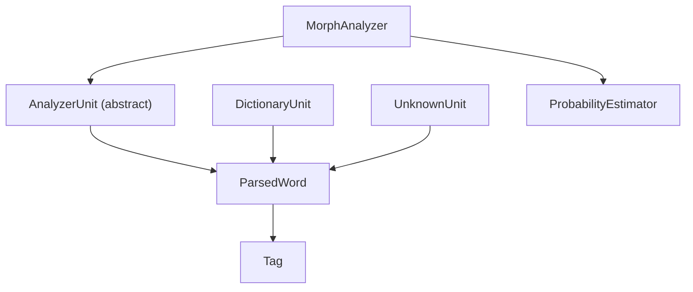
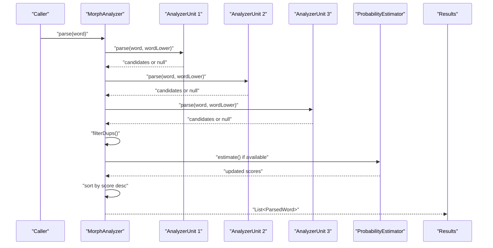
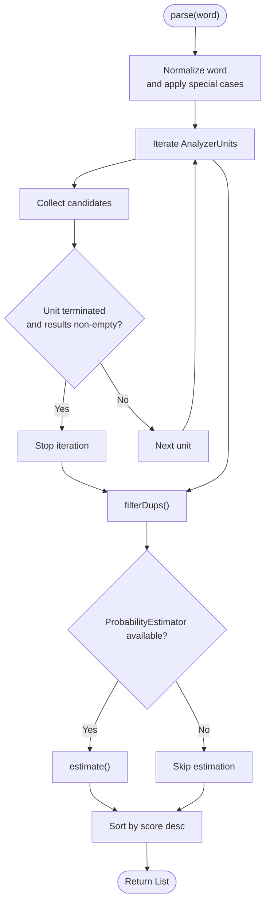
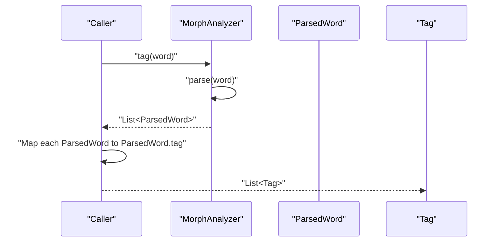
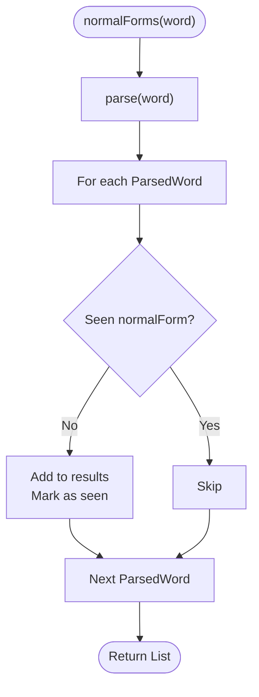
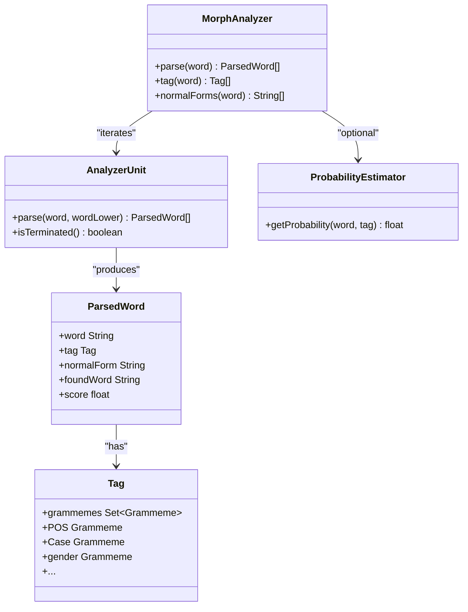
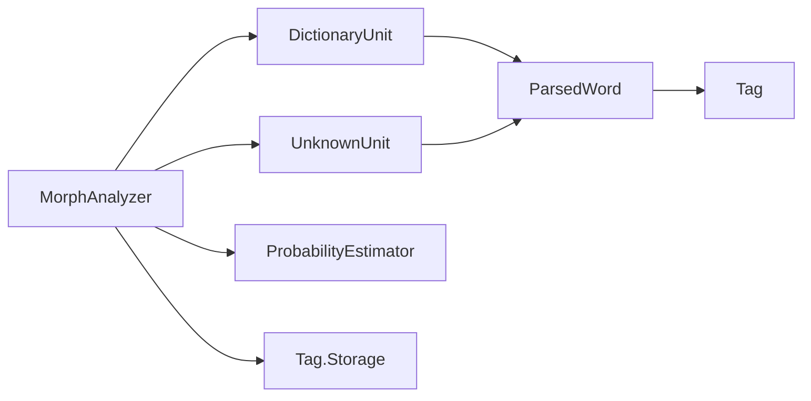
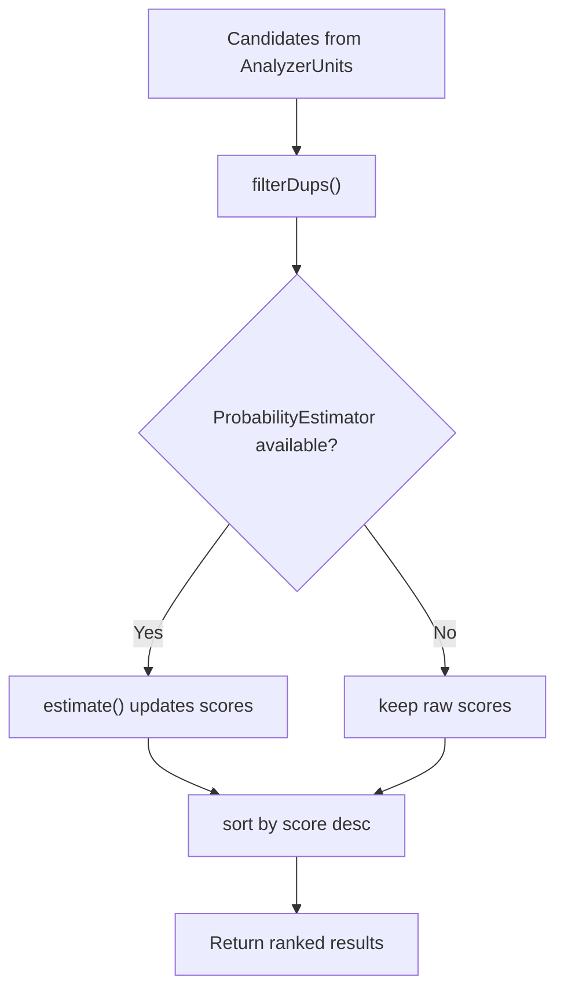

# Analysis Modes

<cite>
**Referenced Files in This Document**
- [MorphAnalyzer.java](file://jmorphy2-core/src/main/java/company/evo/jmorphy2/MorphAnalyzer.java)
- [ParsedWord.java](file://jmorphy2-core/src/main/java/company/evo/jmorphy2/ParsedWord.java)
- [Tag.java](file://jmorphy2-core/src/main/java/company/evo/jmorphy2/Tag.java)
- [ProbabilityEstimator.java](file://jmorphy2-core/src/main/java/company/evo/jmorphy2/ProbabilityEstimator.java)
- [AnalyzerUnit.java](file://jmorphy2-core/src/main/java/company/evo/jmorphy2/units/AnalyzerUnit.java)
- [DictionaryUnit.java](file://jmorphy2-core/src/main/java/company/evo/jmorphy2/units/DictionaryUnit.java)
- [UnknownUnit.java](file://jmorphy2-core/src/main/java/company/evo/jmorphy2/units/UnknownUnit.java)
- [MorphAnalyzerRUTest.java](file://jmorphy2-core/src/test/java/company/evo/jmorphy2/MorphAnalyzerRUTest.java)
- [MorphAnalyzerUkTest.java](file://jmorphy2-core/src/test/java/company/evo/jmorphy2/MorphAnalyzerUkTest.java)
- [SimpleTagger.java](file://jmorphy2-nlp/src/main/java/company/evo/jmorphy2/nlp/SimpleTagger.java)
- [CachingMorphAnalyzer.java](file://jmorphy2-elasticsearch/src/main/java/company/evo/jmorphy2/elasticsearch/indices/CachingMorphAnalyzer.java)
- [MorphAnalyzerBenchmarks.kt](file://benchmarks/src/jmh/kotlin/company/evo/jmorphy2/MorphAnalyzerBenchmarks.kt)
</cite>

## Table of Contents
1. [Introduction](#introduction)
2. [Project Structure](#project-structure)
3. [Core Components](#core-components)
4. [Architecture Overview](#architecture-overview)
5. [Detailed Component Analysis](#detailed-component-analysis)
6. [Dependency Analysis](#dependency-analysis)
7. [Performance Considerations](#performance-considerations)
8. [Troubleshooting Guide](#troubleshooting-guide)
9. [Conclusion](#conclusion)
10. [Appendices](#appendices)

## Introduction
This document explains the analysis modes supported by the morphological analyzer and how they relate to the underlying processing pipeline. It covers:
- Parse mode: returns comprehensive ParsedWord objects with grammatical tags, normal forms, and confidence scores.
- Tag mode: returns simplified grammatical categories without detailed analysis.
- NormalForms mode: extracts dictionary base forms from analyzed words.
It also documents the confidence scoring system, result ranking, filtering and deduplication, and compares performance and memory characteristics across modes. Practical guidance is provided for selecting the appropriate mode for search indexing, text processing, and linguistic research.

## Project Structure
The analyzer is composed of:
- A central MorphAnalyzer orchestrating multiple AnalyzerUnit processors.
- ParsedWord representing analysis results with a score.
- Tag encapsulating grammatical categories.
- ProbabilityEstimator optionally refining scores using dictionary statistics.
- Tests demonstrating usage and expected outputs for Russian and Ukrainian.

**Diagram sources**
- [MorphAnalyzer.java:174-200](file://jmorphy2-core/src/main/java/company/evo/jmorphy2/MorphAnalyzer.java#L174-L200)
- [AnalyzerUnit.java:46-71](file://jmorphy2-core/src/main/java/company/evo/jmorphy2/units/AnalyzerUnit.java#L46-L71)
- [DictionaryUnit.java:56-65](file://jmorphy2-core/src/main/java/company/evo/jmorphy2/units/DictionaryUnit.java#L56-L65)
- [UnknownUnit.java:27-32](file://jmorphy2-core/src/main/java/company/evo/jmorphy2/units/UnknownUnit.java#L27-L32)
- [ParsedWord.java:12-24](file://jmorphy2-core/src/main/java/company/evo/jmorphy2/ParsedWord.java#L12-L24)
- [Tag.java:27-73](file://jmorphy2-core/src/main/java/company/evo/jmorphy2/Tag.java#L27-L73)
- [ProbabilityEstimator.java:22-25](file://jmorphy2-core/src/main/java/company/evo/jmorphy2/ProbabilityEstimator.java#L22-L25)

**Section sources**
- [MorphAnalyzer.java:174-200](file://jmorphy2-core/src/main/java/company/evo/jmorphy2/MorphAnalyzer.java#L174-L200)
- [AnalyzerUnit.java:46-71](file://jmorphy2-core/src/main/java/company/evo/jmorphy2/units/AnalyzerUnit.java#L46-L71)
- [DictionaryUnit.java:56-65](file://jmorphy2-core/src/main/java/company/evo/jmorphy2/units/DictionaryUnit.java#L56-L65)
- [UnknownUnit.java:27-32](file://jmorphy2-core/src/main/java/company/evo/jmorphy2/units/UnknownUnit.java#L27-L32)
- [ParsedWord.java:12-24](file://jmorphy2-core/src/main/java/company/evo/jmorphy2/ParsedWord.java#L12-L24)
- [Tag.java:27-73](file://jmorphy2-core/src/main/java/company/evo/jmorphy2/Tag.java#L27-L73)
- [ProbabilityEstimator.java:22-25](file://jmorphy2-core/src/main/java/company/evo/jmorphy2/ProbabilityEstimator.java#L22-L25)

## Core Components
- Parse mode: The primary mode that returns a list of ParsedWord objects. Each carries:
  - Word surface form
  - Grammatical Tag
  - Normal form
  - Found word (original dictionary lemma or matched form)
  - Confidence score
- Tag mode: Returns a list of Tag objects derived from the same parse pipeline.
- NormalForms mode: Extracts unique normal forms from parse results, deduplicating by normal form.

Key behaviors:
- Results are filtered for duplicates and sorted by score.
- Optional probability estimation refines scores when available.

**Section sources**
- [MorphAnalyzer.java:174-200](file://jmorphy2-core/src/main/java/company/evo/jmorphy2/MorphAnalyzer.java#L174-L200)
- [MorphAnalyzer.java:143-159](file://jmorphy2-core/src/main/java/company/evo/jmorphy2/MorphAnalyzer.java#L143-L159)
- [MorphAnalyzer.java:161-172](file://jmorphy2-core/src/main/java/company/evo/jmorphy2/MorphAnalyzer.java#L161-L172)
- [ParsedWord.java:12-24](file://jmorphy2-core/src/main/java/company/evo/jmorphy2/ParsedWord.java#L12-L24)
- [ParsedWord.java:56-58](file://jmorphy2-core/src/main/java/company/evo/jmorphy2/ParsedWord.java#L56-L58)

## Architecture Overview
The analyzer composes multiple AnalyzerUnit instances. Each unit contributes candidate analyses. The pipeline:
1. Iterates units in order, collecting candidates.
2. Stops early if a unit declares termination and candidates are present.
3. Filters duplicates and estimates probabilities.
4. Sorts by score descending.

**Diagram sources**
- [MorphAnalyzer.java:174-200](file://jmorphy2-core/src/main/java/company/evo/jmorphy2/MorphAnalyzer.java#L174-L200)
- [MorphAnalyzer.java:202-232](file://jmorphy2-core/src/main/java/company/evo/jmorphy2/MorphAnalyzer.java#L202-L232)
- [MorphAnalyzer.java:234-245](file://jmorphy2-core/src/main/java/company/evo/jmorphy2/MorphAnalyzer.java#L234-L245)
- [AnalyzerUnit.java:46](file://jmorphy2-core/src/main/java/company/evo/jmorphy2/units/AnalyzerUnit.java#L46)
- [ProbabilityEstimator.java:22-25](file://jmorphy2-core/src/main/java/company/evo/jmorphy2/ProbabilityEstimator.java#L22-L25)

## Detailed Component Analysis

### Parse Mode
Parse mode returns a list of ParsedWord objects. Each object contains:
- Surface word
- Grammatical Tag
- Normal form
- Found word
- Confidence score

Processing steps:
- Lowercase normalization and special-case handling.
- Iterate units; collect candidates; terminate early if a unit requests termination and results exist.
- Filter duplicates and estimate probabilities.
- Sort by score descending.

**Diagram sources**
- [MorphAnalyzer.java:174-200](file://jmorphy2-core/src/main/java/company/evo/jmorphy2/MorphAnalyzer.java#L174-L200)
- [MorphAnalyzer.java:202-232](file://jmorphy2-core/src/main/java/company/evo/jmorphy2/MorphAnalyzer.java#L202-L232)
- [MorphAnalyzer.java:234-245](file://jmorphy2-core/src/main/java/company/evo/jmorphy2/MorphAnalyzer.java#L234-L245)
- [AnalyzerUnit.java:42-44](file://jmorphy2-core/src/main/java/company/evo/jmorphy2/units/AnalyzerUnit.java#L42-L44)

**Section sources**
- [MorphAnalyzer.java:174-200](file://jmorphy2-core/src/main/java/company/evo/jmorphy2/MorphAnalyzer.java#L174-L200)
- [MorphAnalyzer.java:202-232](file://jmorphy2-core/src/main/java/company/evo/jmorphy2/MorphAnalyzer.java#L202-L232)
- [MorphAnalyzer.java:234-245](file://jmorphy2-core/src/main/java/company/evo/jmorphy2/MorphAnalyzer.java#L234-L245)
- [ParsedWord.java:12-24](file://jmorphy2-core/src/main/java/company/evo/jmorphy2/ParsedWord.java#L12-L24)

### Tag Mode
Tag mode returns a list of Tag objects derived from the same parse pipeline. It:
- Calls parse to obtain ParsedWord candidates.
- Extracts the Tag from each ParsedWord.
- Preserves ordering from parse (sorted by score).

**Diagram sources**
- [MorphAnalyzer.java:161-172](file://jmorphy2-core/src/main/java/company/evo/jmorphy2/MorphAnalyzer.java#L161-L172)
- [ParsedWord.java:12-24](file://jmorphy2-core/src/main/java/company/evo/jmorphy2/ParsedWord.java#L12-L24)

**Section sources**
- [MorphAnalyzer.java:161-172](file://jmorphy2-core/src/main/java/company/evo/jmorphy2/MorphAnalyzer.java#L161-L172)
- [ParsedWord.java:12-24](file://jmorphy2-core/src/main/java/company/evo/jmorphy2/ParsedWord.java#L12-L24)

### NormalForms Mode
NormalForms mode:
- Calls parse to obtain ParsedWord candidates.
- Extracts unique normal forms, preserving order of first occurrence.
- Deduplicates by normal form.

**Diagram sources**
- [MorphAnalyzer.java:143-159](file://jmorphy2-core/src/main/java/company/evo/jmorphy2/MorphAnalyzer.java#L143-L159)
- [ParsedWord.java:56-58](file://jmorphy2-core/src/main/java/company/evo/jmorphy2/ParsedWord.java#L56-L58)

**Section sources**
- [MorphAnalyzer.java:143-159](file://jmorphy2-core/src/main/java/company/evo/jmorphy2/MorphAnalyzer.java#L143-L159)
- [ParsedWord.java:56-58](file://jmorphy2-core/src/main/java/company/evo/jmorphy2/ParsedWord.java#L56-L58)

### Relationship Between Modes and Underlying Pipelines
- All modes share the same parse pipeline: AnalyzerUnit chain, duplicate filtering, optional probability estimation, and sorting.
- Differences lie in post-processing:
  - Parse mode: returns full ParsedWord objects.
  - Tag mode: projects ParsedWord.tag.
  - NormalForms mode: projects ParsedWord.normalForm and deduplicates.

**Diagram sources**
- [MorphAnalyzer.java:174-200](file://jmorphy2-core/src/main/java/company/evo/jmorphy2/MorphAnalyzer.java#L174-L200)
- [AnalyzerUnit.java:46](file://jmorphy2-core/src/main/java/company/evo/jmorphy2/units/AnalyzerUnit.java#L46)
- [ParsedWord.java:12-24](file://jmorphy2-core/src/main/java/company/evo/jmorphy2/ParsedWord.java#L12-L24)
- [Tag.java:27-73](file://jmorphy2-core/src/main/java/company/evo/jmorphy2/Tag.java#L27-L73)
- [ProbabilityEstimator.java:22-25](file://jmorphy2-core/src/main/java/company/evo/jmorphy2/ProbabilityEstimator.java#L22-L25)

**Section sources**
- [MorphAnalyzer.java:174-200](file://jmorphy2-core/src/main/java/company/evo/jmorphy2/MorphAnalyzer.java#L174-L200)
- [AnalyzerUnit.java:46](file://jmorphy2-core/src/main/java/company/evo/jmorphy2/units/AnalyzerUnit.java#L46)
- [ParsedWord.java:12-24](file://jmorphy2-core/src/main/java/company/evo/jmorphy2/ParsedWord.java#L12-L24)
- [Tag.java:27-73](file://jmorphy2-core/src/main/java/company/evo/jmorphy2/Tag.java#L27-L73)
- [ProbabilityEstimator.java:22-25](file://jmorphy2-core/src/main/java/company/evo/jmorphy2/ProbabilityEstimator.java#L22-L25)

## Dependency Analysis
- MorphAnalyzer depends on:
  - AnalyzerUnit implementations (DictionaryUnit, UnknownUnit, etc.) to produce candidates.
  - ProbabilityEstimator for optional scoring refinement.
  - Tag.Storage for grammeme/tag resolution.
- ParsedWord depends on Tag and stores grammatical information and confidence.

**Diagram sources**
- [MorphAnalyzer.java:174-200](file://jmorphy2-core/src/main/java/company/evo/jmorphy2/MorphAnalyzer.java#L174-L200)
- [DictionaryUnit.java:56-65](file://jmorphy2-core/src/main/java/company/evo/jmorphy2/units/DictionaryUnit.java#L56-L65)
- [UnknownUnit.java:27-32](file://jmorphy2-core/src/main/java/company/evo/jmorphy2/units/UnknownUnit.java#L27-L32)
- [ProbabilityEstimator.java:22-25](file://jmorphy2-core/src/main/java/company/evo/jmorphy2/ProbabilityEstimator.java#L22-L25)
- [Tag.java:162-228](file://jmorphy2-core/src/main/java/company/evo/jmorphy2/Tag.java#L162-L228)
- [ParsedWord.java:12-24](file://jmorphy2-core/src/main/java/company/evo/jmorphy2/ParsedWord.java#L12-L24)

**Section sources**
- [MorphAnalyzer.java:174-200](file://jmorphy2-core/src/main/java/company/evo/jmorphy2/MorphAnalyzer.java#L174-L200)
- [DictionaryUnit.java:56-65](file://jmorphy2-core/src/main/java/company/evo/jmorphy2/units/DictionaryUnit.java#L56-L65)
- [UnknownUnit.java:27-32](file://jmorphy2-core/src/main/java/company/evo/jmorphy2/units/UnknownUnit.java#L27-L32)
- [ProbabilityEstimator.java:22-25](file://jmorphy2-core/src/main/java/company/evo/jmorphy2/ProbabilityEstimator.java#L22-L25)
- [Tag.java:162-228](file://jmorphy2-core/src/main/java/company/evo/jmorphy2/Tag.java#L162-L228)
- [ParsedWord.java:12-24](file://jmorphy2-core/src/main/java/company/evo/jmorphy2/ParsedWord.java#L12-L24)

## Performance Considerations
- Parse mode:
  - Produces full ParsedWord objects with grammatical information and scores.
  - Involves duplicate filtering and optional probability estimation.
  - Sorting by score adds overhead.
- Tag mode:
  - Same parse pipeline; minimal post-processing (projecting tags).
  - Lower memory overhead compared to parse mode.
- NormalForms mode:
  - Same parse pipeline; minimal post-processing (projecting normal forms and deduplicating).
  - Lowest memory overhead among the three modes.

Evidence and guidance:
- Benchmark harness demonstrates parsing throughput across a corpus.
- Caching wrapper around MorphAnalyzer reduces repeated computation for identical inputs.

Practical tips:
- Prefer Tag mode for applications needing grammatical categories without full analysis.
- Prefer NormalForms mode for tasks requiring dictionary base forms and minimal overhead.
- Use Parse mode when downstream components require detailed grammatical information and confidence scores.

**Section sources**
- [MorphAnalyzerBenchmarks.kt:35-42](file://benchmarks/src/jmh/kotlin/company/evo/jmorphy2/MorphAnalyzerBenchmarks.kt#L35-L42)
- [CachingMorphAnalyzer.java:42-63](file://jmorphy2-elasticsearch/src/main/java/company/evo/jmorphy2/elasticsearch/indices/CachingMorphAnalyzer.java#L42-L63)

## Troubleshooting Guide
Common issues and resolutions:
- Unexpected empty results:
  - Verify the word is not handled by special-case normalization.
  - Confirm dictionary availability and language configuration.
- Low-confidence results:
  - Probability estimation requires dictionary metadata indicating probability tables; otherwise, raw scores are used.
  - Consider enabling caching to improve performance on repeated queries.
- Duplicate analyses:
  - The analyzer filters duplicates based on tag and normal form; ensure expectations align with this deduplication strategy.
- Ordering confusion:
  - Results are sorted by score descending; if you need a different order, sort externally.

**Section sources**
- [MorphAnalyzer.java:180-182](file://jmorphy2-core/src/main/java/company/evo/jmorphy2/MorphAnalyzer.java#L180-L182)
- [MorphAnalyzer.java:202-232](file://jmorphy2-core/src/main/java/company/evo/jmorphy2/MorphAnalyzer.java#L202-L232)
- [MorphAnalyzer.java:234-245](file://jmorphy2-core/src/main/java/company/evo/jmorphy2/MorphAnalyzer.java#L234-L245)
- [ProbabilityEstimator.java:22-25](file://jmorphy2-core/src/main/java/company/evo/jmorphy2/ProbabilityEstimator.java#L22-L25)

## Conclusion
- Parse mode offers the richest information for downstream NLP tasks requiring detailed grammar and confidence.
- Tag mode provides a lightweight path to grammatical categories.
- NormalForms mode efficiently yields dictionary base forms for indexing and normalization.
- The shared pipeline ensures consistent behavior across modes, with differences in post-processing cost and memory footprint.

## Appendices

### Confidence Scoring and Ranking
- Each ParsedWord carries a floating-point score.
- Optional probability estimation adjusts scores using dictionary statistics when available.
- Results are sorted by score in descending order.

**Diagram sources**
- [MorphAnalyzer.java:202-232](file://jmorphy2-core/src/main/java/company/evo/jmorphy2/MorphAnalyzer.java#L202-L232)
- [MorphAnalyzer.java:234-245](file://jmorphy2-core/src/main/java/company/evo/jmorphy2/MorphAnalyzer.java#L234-L245)
- [ProbabilityEstimator.java:22-25](file://jmorphy2-core/src/main/java/company/evo/jmorphy2/ProbabilityEstimator.java#L22-L25)

**Section sources**
- [MorphAnalyzer.java:202-232](file://jmorphy2-core/src/main/java/company/evo/jmorphy2/MorphAnalyzer.java#L202-L232)
- [MorphAnalyzer.java:234-245](file://jmorphy2-core/src/main/java/company/evo/jmorphy2/MorphAnalyzer.java#L234-L245)
- [ProbabilityEstimator.java:22-25](file://jmorphy2-core/src/main/java/company/evo/jmorphy2/ProbabilityEstimator.java#L22-L25)

### Filtering and Deduplication Mechanism
- Duplicates are removed based on a composite key formed by Tag and normalForm.
- This ensures distinct grammatical analyses per normal form.

**Section sources**
- [MorphAnalyzer.java:234-245](file://jmorphy2-core/src/main/java/company/evo/jmorphy2/MorphAnalyzer.java#L234-L245)
- [ParsedWord.java:56-58](file://jmorphy2-core/src/main/java/company/evo/jmorphy2/ParsedWord.java#L56-L58)

### Practical Examples and Use Cases
- Parse mode:
  - Linguistic research: detailed grammatical analysis and paradigm exploration.
  - Text processing: inflection and morphological transformations.
- Tag mode:
  - Search indexing: quick grammatical category extraction for faceting.
  - Lightweight tagging pipelines.
- NormalForms mode:
  - Indexing dictionary base forms for recall.
  - Normalization for downstream tasks.

Validation from tests:
- Parse mode produces multiple analyses with different tags and scores.
- Tag mode returns Tag objects corresponding to parse results.
- NormalForms mode returns unique base forms.

**Section sources**
- [MorphAnalyzerRUTest.java:30-142](file://jmorphy2-core/src/test/java/company/evo/jmorphy2/MorphAnalyzerRUTest.java#L30-L142)
- [MorphAnalyzerRUTest.java:144-157](file://jmorphy2-core/src/test/java/company/evo/jmorphy2/MorphAnalyzerRUTest.java#L144-L157)
- [MorphAnalyzerRUTest.java:145-149](file://jmorphy2-core/src/test/java/company/evo/jmorphy2/MorphAnalyzerRUTest.java#L145-L149)
- [MorphAnalyzerUkTest.java:30-67](file://jmorphy2-core/src/test/java/company/evo/jmorphy2/MorphAnalyzerUkTest.java#L30-L67)

### Real-World Integration Notes
- SimpleTagger integrates morphological analysis into a broader NLP pipeline, using parse results to enrich nodes with grammatical information and scores.
- Caching wrapper improves performance for repeated lookups.

**Section sources**
- [SimpleTagger.java:106-135](file://jmorphy2-nlp/src/main/java/company/evo/jmorphy2/nlp/SimpleTagger.java#L106-L135)
- [CachingMorphAnalyzer.java:42-63](file://jmorphy2-elasticsearch/src/main/java/company/evo/jmorphy2/elasticsearch/indices/CachingMorphAnalyzer.java#L42-L63)