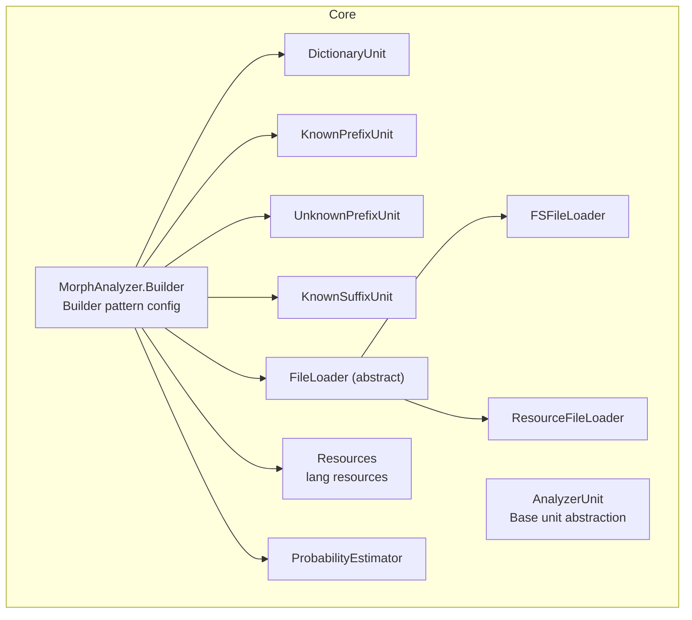
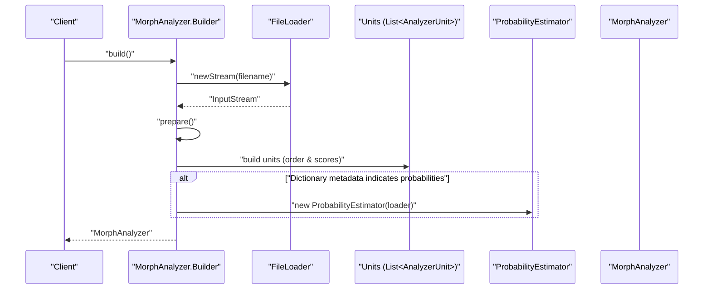
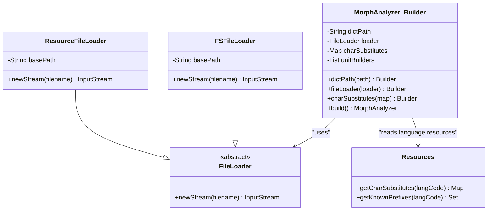
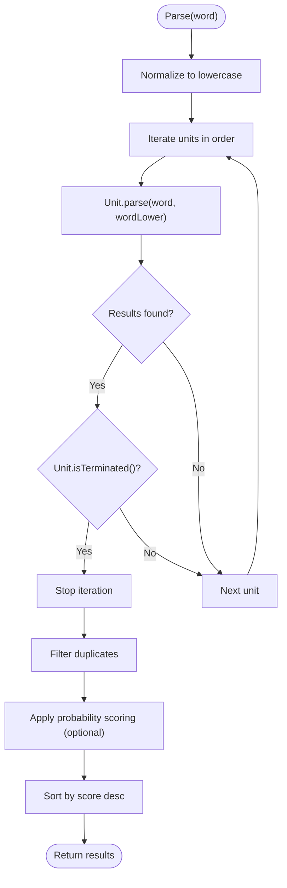
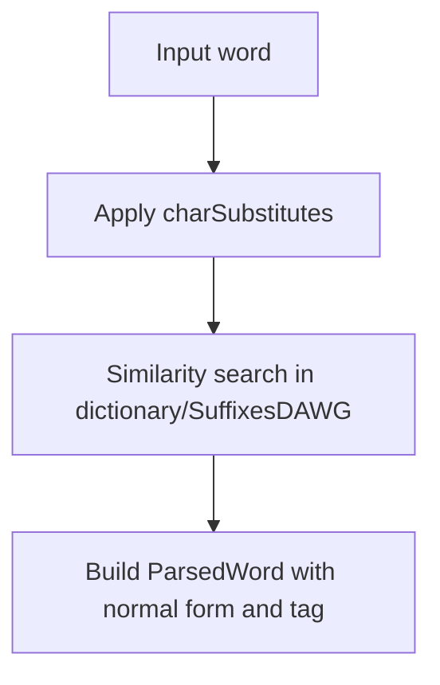
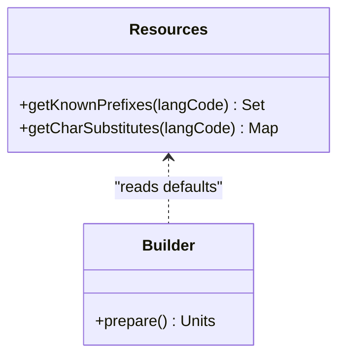
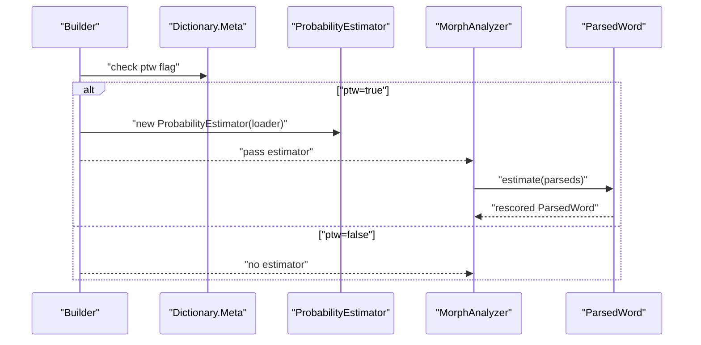
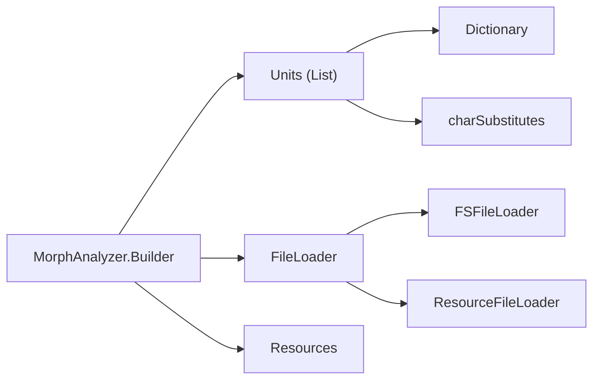

# Configuration Options

<cite>
**Referenced Files in This Document**
- [MorphAnalyzer.java](file://jmorphy2-core/src/main/java/company/evo/jmorphy2/MorphAnalyzer.java)
- [Resources.java](file://jmorphy2-core/src/main/java/company/evo/jmorphy2/Resources.java)
- [FileLoader.java](file://jmorphy2-core/src/main/java/company/evo/jmorphy2/FileLoader.java)
- [FSFileLoader.java](file://jmorphy2-core/src/main/java/company/evo/jmorphy2/FSFileLoader.java)
- [ResourceFileLoader.java](file://jmorphy2-core/src/main/java/company/evo/jmorphy2/ResourceFileLoader.java)
- [ProbabilityEstimator.java](file://jmorphy2-core/src/main/java/company/evo/jmorphy2/ProbabilityEstimator.java)
- [ParsedWord.java](file://jmorphy2-core/src/main/java/company/evo/jmorphy2/ParsedWord.java)
- [AnalyzerUnit.java](file://jmorphy2-core/src/main/java/company/evo/jmorphy2/units/AnalyzerUnit.java)
- [DictionaryUnit.java](file://jmorphy2-core/src/main/java/company/evo/jmorphy2/units/DictionaryUnit.java)
- [KnownPrefixUnit.java](file://jmorphy2-core/src/main/java/company/evo/jmorphy2/units/KnownPrefixUnit.java)
- [UnknownPrefixUnit.java](file://jmorphy2-core/src/main/java/company/evo/jmorphy2/units/UnknownPrefixUnit.java)
- [KnownSuffixUnit.java](file://jmorphy2-core/src/main/java/company/evo/jmorphy2/units/KnownSuffixUnit.java)
- [known_prefixes.txt (ru)](file://jmorphy2-core/src/main/resources/lang/ru/known_prefixes.txt)
- [known_prefixes.txt (uk)](file://jmorphy2-core/src/main/resources/lang/uk/known_prefixes.txt)
- [char_substitutes.txt (uk)](file://jmorphy2-core/src/main/resources/lang/uk/char_substitutes.txt)
</cite>

## Table of Contents
1. [Introduction](#introduction)
2. [Project Structure](#project-structure)
3. [Core Components](#core-components)
4. [Architecture Overview](#architecture-overview)
5. [Detailed Component Analysis](#detailed-component-analysis)
6. [Dependency Analysis](#dependency-analysis)
7. [Performance Considerations](#performance-considerations)
8. [Troubleshooting Guide](#troubleshooting-guide)
9. [Conclusion](#conclusion)
10. [Appendices](#appendices)

## Introduction
This document explains how to configure the morphological analyzer for optimal performance and behavior. It covers the Builder pattern configuration options (dictionary path, custom file loader, and character substitution rules), analyzer unit configuration (probability weighting, termination conditions, and unit ordering), performance tuning (cache sizing and memory optimization), language-specific configuration via resource files, and the impact of configuration choices on accuracy and performance. It also includes practical configuration scenarios, environment/system property usage, troubleshooting tips, best practices for production, and the relationship between configuration and underlying dictionary structure.

## Project Structure
The analyzer is implemented in the core module with a modular unit architecture. Configuration primarily happens through the analyzer builder, which selects language resources and composes analyzer units. File loading is abstracted behind a loader interface, enabling filesystem or resource-based loading. Probability estimation is optional and depends on dictionary metadata.

**Diagram sources**
- [MorphAnalyzer.java:20-105](file://jmorphy2-core/src/main/java/company/evo/jmorphy2/MorphAnalyzer.java#L20-L105)
- [AnalyzerUnit.java:11-72](file://jmorphy2-core/src/main/java/company/evo/jmorphy2/units/AnalyzerUnit.java#L11-L72)
- [DictionaryUnit.java:14-104](file://jmorphy2-core/src/main/java/company/evo/jmorphy2/units/DictionaryUnit.java#L14-L104)
- [KnownPrefixUnit.java:12-75](file://jmorphy2-core/src/main/java/company/evo/jmorphy2/units/KnownPrefixUnit.java#L12-L75)
- [UnknownPrefixUnit.java:11-75](file://jmorphy2-core/src/main/java/company/evo/jmorphy2/units/UnknownPrefixUnit.java#L11-L75)
- [KnownSuffixUnit.java:17-180](file://jmorphy2-core/src/main/java/company/evo/jmorphy2/units/KnownSuffixUnit.java#L17-L180)
- [FileLoader.java:7-9](file://jmorphy2-core/src/main/java/company/evo/jmorphy2/FileLoader.java#L7-L9)
- [FSFileLoader.java:9-21](file://jmorphy2-core/src/main/java/company/evo/jmorphy2/FSFileLoader.java#L9-L21)
- [ResourceFileLoader.java:6-18](file://jmorphy2-core/src/main/java/company/evo/jmorphy2/ResourceFileLoader.java#L6-L18)
- [Resources.java:16-40](file://jmorphy2-core/src/main/java/company/evo/jmorphy2/Resources.java#L16-L40)
- [ProbabilityEstimator.java:9-27](file://jmorphy2-core/src/main/java/company/evo/jmorphy2/ProbabilityEstimator.java#L9-L27)

**Section sources**
- [MorphAnalyzer.java:20-105](file://jmorphy2-core/src/main/java/company/evo/jmorphy2/MorphAnalyzer.java#L20-L105)
- [Resources.java:16-40](file://jmorphy2-core/src/main/java/company/evo/jmorphy2/Resources.java#L16-L40)
- [FileLoader.java:7-9](file://jmorphy2-core/src/main/java/company/evo/jmorphy2/FileLoader.java#L7-L9)
- [FSFileLoader.java:9-21](file://jmorphy2-core/src/main/java/company/evo/jmorphy2/FSFileLoader.java#L9-L21)
- [ResourceFileLoader.java:6-18](file://jmorphy2-core/src/main/java/company/evo/jmorphy2/ResourceFileLoader.java#L6-L18)
- [ProbabilityEstimator.java:9-27](file://jmorphy2-core/src/main/java/company/evo/jmorphy2/ProbabilityEstimator.java#L9-L27)

## Core Components
- Builder pattern configuration:
  - dictPath: Sets the base dictionary path. If not provided, the builder reads from a system property.
  - fileLoader: Allows injecting a custom FileLoader for dictionary access (filesystem vs. resources).
  - charSubstitutes: Provides character replacement rules applied during matching.
- Analyzer units:
  - Each unit has a terminate flag and a score multiplier that influence parsing order and confidence.
  - Units are ordered to optimize coverage and accuracy (dictionary-first, then numeric/special units, then affix-based units).
- Probability weighting:
  - Optional probability estimator is enabled when dictionary metadata indicates it is available.
  - Scores are combined and normalized to produce final rankings.

**Section sources**
- [MorphAnalyzer.java:20-105](file://jmorphy2-core/src/main/java/company/evo/jmorphy2/MorphAnalyzer.java#L20-L105)
- [AnalyzerUnit.java:16-34](file://jmorphy2-core/src/main/java/company/evo/jmorphy2/units/AnalyzerUnit.java#L16-L34)
- [ProbabilityEstimator.java:9-27](file://jmorphy2-core/src/main/java/company/evo/jmorphy2/ProbabilityEstimator.java#L9-L27)

## Architecture Overview
The analyzer composes a pipeline of units. The builder prepares units, loads language resources, and optionally enables probability estimation. Parsing iterates through units until a terminating unit produces results.

**Diagram sources**
- [MorphAnalyzer.java:52-104](file://jmorphy2-core/src/main/java/company/evo/jmorphy2/MorphAnalyzer.java#L52-L104)
- [FileLoader.java:8](file://jmorphy2-core/src/main/java/company/evo/jmorphy2/FileLoader.java#L8)
- [ProbabilityEstimator.java:16-25](file://jmorphy2-core/src/main/java/company/evo/jmorphy2/ProbabilityEstimator.java#L16-L25)

## Detailed Component Analysis

### Builder Pattern Configuration
- dictPath:
  - Purpose: Specify the dictionary directory path.
  - Behavior: If not set, the builder reads from a system property. Defaults to filesystem loading via FSFileLoader.
- fileLoader:
  - Purpose: Inject a custom loader for dictionary files.
  - Options: FSFileLoader for filesystem, ResourceFileLoader for bundled resources.
- charSubstitutes:
  - Purpose: Define character replacement rules used during similarity matching.
  - Behavior: Applied by dictionary and suffix units to normalize input before lookup.

**Diagram sources**
- [MorphAnalyzer.java:20-50](file://jmorphy2-core/src/main/java/company/evo/jmorphy2/MorphAnalyzer.java#L20-L50)
- [FileLoader.java:7-9](file://jmorphy2-core/src/main/java/company/evo/jmorphy2/FileLoader.java#L7-L9)
- [FSFileLoader.java:9-21](file://jmorphy2-core/src/main/java/company/evo/jmorphy2/FSFileLoader.java#L9-L21)
- [ResourceFileLoader.java:6-18](file://jmorphy2-core/src/main/java/company/evo/jmorphy2/ResourceFileLoader.java#L6-L18)
- [Resources.java:16-40](file://jmorphy2-core/src/main/java/company/evo/jmorphy2/Resources.java#L16-L40)

**Section sources**
- [MorphAnalyzer.java:20-50](file://jmorphy2-core/src/main/java/company/evo/jmorphy2/MorphAnalyzer.java#L20-L50)
- [FSFileLoader.java:9-21](file://jmorphy2-core/src/main/java/company/evo/jmorphy2/FSFileLoader.java#L9-L21)
- [ResourceFileLoader.java:6-18](file://jmorphy2-core/src/main/java/company/evo/jmorphy2/ResourceFileLoader.java#L6-L18)
- [Resources.java:16-40](file://jmorphy2-core/src/main/java/company/evo/jmorphy2/Resources.java#L16-L40)

### Analyzer Unit Configuration
- Termination conditions:
  - Each unit declares whether it terminates the pipeline upon producing matches.
  - DictionaryUnit typically terminates to avoid redundant parsing.
- Probability weights:
  - Units carry a score multiplier that influences ranking after parsing.
  - ProbabilityEstimator adjusts scores when enabled.
- Unit ordering:
  - DictionaryUnit first, followed by Number/Latin/Punctuation/Roman, KnownPrefixUnit (if applicable), UnknownPrefixUnit, KnownSuffixUnit, UnknownUnit.
  - This order prioritizes reliable matches and reduces ambiguity.

**Diagram sources**
- [MorphAnalyzer.java:178-200](file://jmorphy2-core/src/main/java/company/evo/jmorphy2/MorphAnalyzer.java#L178-L200)
- [AnalyzerUnit.java:42-44](file://jmorphy2-core/src/main/java/company/evo/jmorphy2/units/AnalyzerUnit.java#L42-L44)
- [ParsedWord.java:9-28](file://jmorphy2-core/src/main/java/company/evo/jmorphy2/ParsedWord.java#L9-L28)

**Section sources**
- [MorphAnalyzer.java:178-200](file://jmorphy2-core/src/main/java/company/evo/jmorphy2/MorphAnalyzer.java#L178-L200)
- [AnalyzerUnit.java:16-34](file://jmorphy2-core/src/main/java/company/evo/jmorphy2/units/AnalyzerUnit.java#L16-L34)
- [ParsedWord.java:9-28](file://jmorphy2-core/src/main/java/company/evo/jmorphy2/ParsedWord.java#L9-L28)

### Character Substitution Rules
- Purpose: Normalize characters during matching to improve recall (e.g., accented or variant forms).
- Application: Used by DictionaryUnit and KnownSuffixUnit to transform input before similarity queries.
- Language-specific defaults: Loaded from resource files per language.

**Diagram sources**
- [DictionaryUnit.java:56-65](file://jmorphy2-core/src/main/java/company/evo/jmorphy2/units/DictionaryUnit.java#L56-L65)
- [KnownSuffixUnit.java:83-126](file://jmorphy2-core/src/main/java/company/evo/jmorphy2/units/KnownSuffixUnit.java#L83-L126)
- [Resources.java:16-32](file://jmorphy2-core/src/main/java/company/evo/jmorphy2/Resources.java#L16-L32)

**Section sources**
- [DictionaryUnit.java:56-65](file://jmorphy2-core/src/main/java/company/evo/jmorphy2/units/DictionaryUnit.java#L56-L65)
- [KnownSuffixUnit.java:83-126](file://jmorphy2-core/src/main/java/company/evo/jmorphy2/units/KnownSuffixUnit.java#L83-L126)
- [Resources.java:16-32](file://jmorphy2-core/src/main/java/company/evo/jmorphy2/Resources.java#L16-L32)

### Language-Specific Configuration
- Known prefixes:
  - Used to pre-segment words when a known prefix is detected.
  - Loaded from language resource files.
- Character substitutions:
  - Loaded from language resource files and applied during matching.
- Impact:
  - Improves accuracy for morphologically complex languages and handles orthographic variants.

**Diagram sources**
- [Resources.java:16-40](file://jmorphy2-core/src/main/java/company/evo/jmorphy2/Resources.java#L16-L40)
- [MorphAnalyzer.java:52-82](file://jmorphy2-core/src/main/java/company/evo/jmorphy2/MorphAnalyzer.java#L52-L82)

**Section sources**
- [Resources.java:16-40](file://jmorphy2-core/src/main/java/company/evo/jmorphy2/Resources.java#L16-L40)
- [MorphAnalyzer.java:52-82](file://jmorphy2-core/src/main/java/company/evo/jmorphy2/MorphAnalyzer.java#L52-L82)
- [known_prefixes.txt (ru):1-145](file://jmorphy2-core/src/main/resources/lang/ru/known_prefixes.txt#L1-L145)
- [known_prefixes.txt (uk):1-480](file://jmorphy2-core/src/main/resources/lang/uk/known_prefixes.txt#L1-L480)
- [char_substitutes.txt (uk):1-4](file://jmorphy2-core/src/main/resources/lang/uk/char_substitutes.txt#L1-L4)

### Probability Estimation and Scoring
- Enabling:
  - ProbabilityEstimator is constructed when dictionary metadata indicates probability tables are present.
- Scoring:
  - Scores are adjusted using estimated probabilities; normalization ensures meaningful ranking.
- Accuracy/performance trade-off:
  - Probability weighting improves accuracy but adds I/O overhead and memory for probability tables.

**Diagram sources**
- [MorphAnalyzer.java:93-98](file://jmorphy2-core/src/main/java/company/evo/jmorphy2/MorphAnalyzer.java#L93-L98)
- [ProbabilityEstimator.java:16-25](file://jmorphy2-core/src/main/java/company/evo/jmorphy2/ProbabilityEstimator.java#L16-L25)
- [ParsedWord.java:202-232](file://jmorphy2-core/src/main/java/company/evo/jmorphy2/ParsedWord.java#L202-L232)

**Section sources**
- [MorphAnalyzer.java:93-98](file://jmorphy2-core/src/main/java/company/evo/jmorphy2/MorphAnalyzer.java#L93-L98)
- [ProbabilityEstimator.java:16-25](file://jmorphy2-core/src/main/java/company/evo/jmorphy2/ProbabilityEstimator.java#L16-L25)
- [ParsedWord.java:202-232](file://jmorphy2-core/src/main/java/company/evo/jmorphy2/ParsedWord.java#L202-L232)

## Dependency Analysis
- Builder-to-units:
  - The builder constructs units and passes Tag.Storage to each unit.
- Units-to-dictionary:
  - DictionaryUnit and KnownSuffixUnit depend on dictionary paradigms and suffix tables.
- Units-to-resources:
  - Units may receive charSubstitutes and KnownPrefixUnit relies on known prefixes.
- File loading:
  - FileLoader abstraction allows swapping between filesystem and resource loaders.

**Diagram sources**
- [MorphAnalyzer.java:52-98](file://jmorphy2-core/src/main/java/company/evo/jmorphy2/MorphAnalyzer.java#L52-L98)
- [DictionaryUnit.java:56-65](file://jmorphy2-core/src/main/java/company/evo/jmorphy2/units/DictionaryUnit.java#L56-L65)
- [KnownSuffixUnit.java:83-126](file://jmorphy2-core/src/main/java/company/evo/jmorphy2/units/KnownSuffixUnit.java#L83-L126)
- [FileLoader.java:7-9](file://jmorphy2-core/src/main/java/company/evo/jmorphy2/FileLoader.java#L7-L9)
- [FSFileLoader.java:9-21](file://jmorphy2-core/src/main/java/company/evo/jmorphy2/FSFileLoader.java#L9-L21)
- [ResourceFileLoader.java:6-18](file://jmorphy2-core/src/main/java/company/evo/jmorphy2/ResourceFileLoader.java#L6-L18)
- [Resources.java:16-40](file://jmorphy2-core/src/main/java/company/evo/jmorphy2/Resources.java#L16-L40)

**Section sources**
- [MorphAnalyzer.java:52-98](file://jmorphy2-core/src/main/java/company/evo/jmorphy2/MorphAnalyzer.java#L52-L98)
- [DictionaryUnit.java:56-65](file://jmorphy2-core/src/main/java/company/evo/jmorphy2/units/DictionaryUnit.java#L56-L65)
- [KnownSuffixUnit.java:83-126](file://jmorphy2-core/src/main/java/company/evo/jmorphy2/units/KnownSuffixUnit.java#L83-L126)
- [FileLoader.java:7-9](file://jmorphy2-core/src/main/java/company/evo/jmorphy2/FileLoader.java#L7-L9)
- [FSFileLoader.java:9-21](file://jmorphy2-core/src/main/java/company/evo/jmorphy2/FSFileLoader.java#L9-L21)
- [ResourceFileLoader.java:6-18](file://jmorphy2-core/src/main/java/company/evo/jmorphy2/ResourceFileLoader.java#L6-L18)
- [Resources.java:16-40](file://jmorphy2-core/src/main/java/company/evo/jmorphy2/Resources.java#L16-L40)

## Performance Considerations
- Cache sizing:
  - The builder defines a default cache size constant for internal caching behavior.
- Memory optimization:
  - Probability tables add memory overhead; enable only when needed.
  - Prefer resource-based loading for embedded deployments to reduce disk I/O.
- Unit ordering:
  - Place high-precision units earlier to minimize downstream work.
- Character substitution:
  - Keep substitution maps minimal to reduce overhead during similarity searches.

**Section sources**
- [MorphAnalyzer.java:23](file://jmorphy2-core/src/main/java/company/evo/jmorphy2/MorphAnalyzer.java#L23)
- [ProbabilityEstimator.java:16-25](file://jmorphy2-core/src/main/java/company/evo/jmorphy2/ProbabilityEstimator.java#L16-L25)

## Troubleshooting Guide
- Dictionary path issues:
  - Ensure dictPath is set or the system property is configured. Verify the path contains required dictionary files.
- Resource loading problems:
  - Confirm resource paths match language codes and filenames expected by the builder.
- Unexpected results:
  - Check unit ordering and termination flags; adjust scores to prioritize desired units.
- Probability scoring anomalies:
  - Verify dictionary metadata indicates probability tables and that the probability file exists in the loader’s path.
- Character normalization:
  - Review language-specific char_substitutes to ensure expected replacements are applied.

**Section sources**
- [MorphAnalyzer.java:52-58](file://jmorphy2-core/src/main/java/company/evo/jmorphy2/MorphAnalyzer.java#L52-L58)
- [Resources.java:42-62](file://jmorphy2-core/src/main/java/company/evo/jmorphy2/Resources.java#L42-L62)
- [ProbabilityEstimator.java:16-25](file://jmorphy2-core/src/main/java/company/evo/jmorphy2/ProbabilityEstimator.java#L16-L25)

## Conclusion
The analyzer’s configuration centers on three pillars: dictionary access (path/loader), language resources (prefixes/substitutions), and unit composition (ordering, termination, scoring). Probability weighting enhances accuracy but requires careful consideration of memory and I/O costs. Properly tuned configuration yields robust performance across applications, from embedded systems to large-scale indexing.

## Appendices

### Environment Variables and System Properties
- dictPath:
  - Used by the builder when no explicit path is provided.
  - Controls the base directory for dictionary files.

**Section sources**
- [MorphAnalyzer.java:54-56](file://jmorphy2-core/src/main/java/company/evo/jmorphy2/MorphAnalyzer.java#L54-L56)

### Configuration Scenarios
- Embedded service with bundled dictionaries:
  - Use ResourceFileLoader with a base path pointing to bundled dictionary resources.
  - Provide language-specific charSubstitutes and known prefixes via Resources if overriding defaults.
- Standalone desktop application:
  - Use FSFileLoader with dictPath set to the dictionary directory.
  - Enable probability estimation only if the dictionary includes probability tables.
- High-throughput indexing pipeline:
  - Prefer resource-based loading and minimal charSubstitutes.
  - Tune unit scores to prioritize fast, deterministic units early.

**Section sources**
- [FSFileLoader.java:9-21](file://jmorphy2-core/src/main/java/company/evo/jmorphy2/FSFileLoader.java#L9-L21)
- [ResourceFileLoader.java:6-18](file://jmorphy2-core/src/main/java/company/evo/jmorphy2/ResourceFileLoader.java#L6-L18)
- [MorphAnalyzer.java:52-82](file://jmorphy2-core/src/main/java/company/evo/jmorphy2/MorphAnalyzer.java#L52-L82)

### Relationship Between Configuration and Dictionary Structure
- Units depend on dictionary metadata and tables:
  - DictionaryUnit consumes word forms and paradigms.
  - KnownSuffixUnit leverages suffix prediction tables.
- Language resources complement dictionary structure:
  - Known prefixes guide segmentation.
  - Character substitutions align input with stored forms.

**Section sources**
- [DictionaryUnit.java:56-65](file://jmorphy2-core/src/main/java/company/evo/jmorphy2/units/DictionaryUnit.java#L56-L65)
- [KnownSuffixUnit.java:83-126](file://jmorphy2-core/src/main/java/company/evo/jmorphy2/units/KnownSuffixUnit.java#L83-L126)
- [Resources.java:16-40](file://jmorphy2-core/src/main/java/company/evo/jmorphy2/Resources.java#L16-L40)