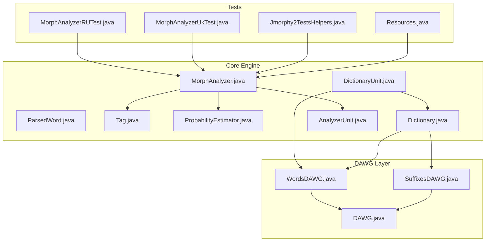
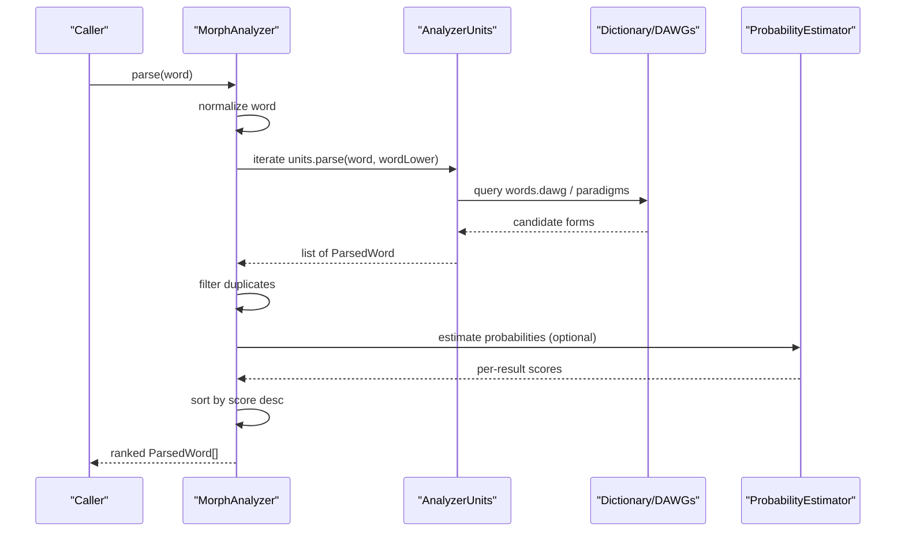
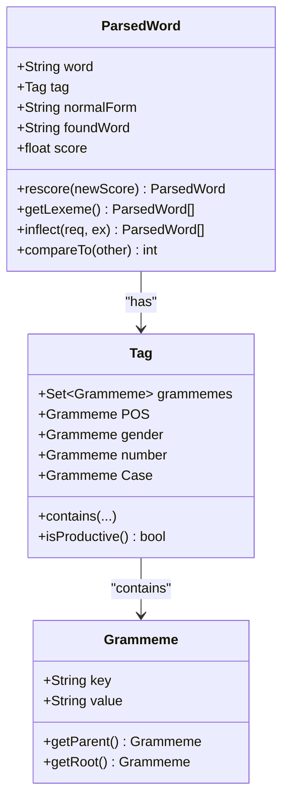
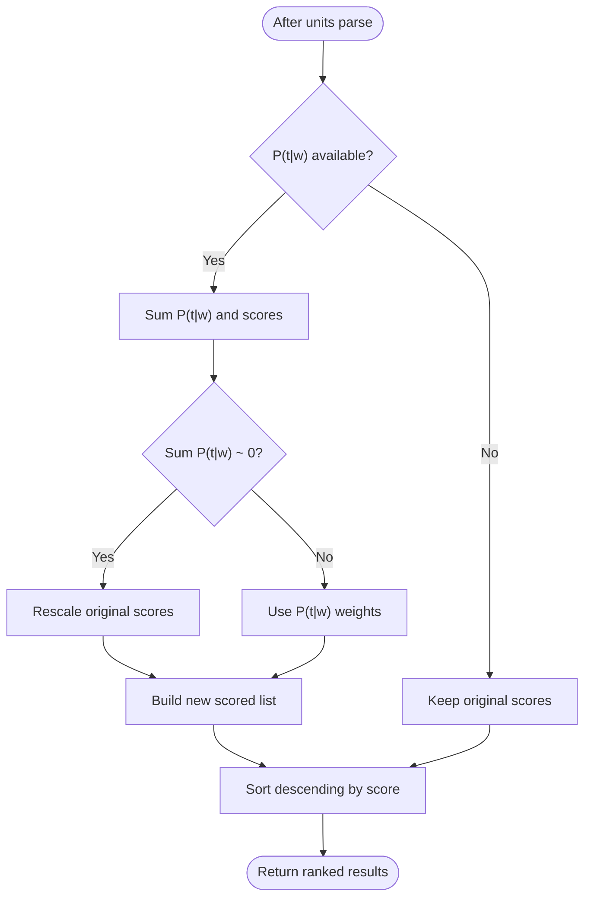
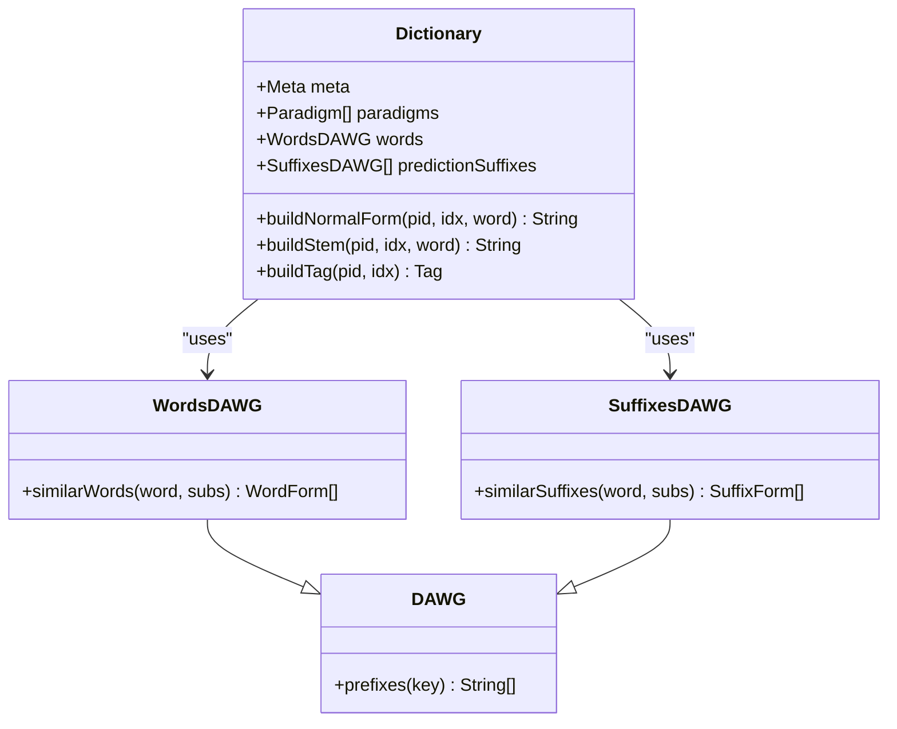
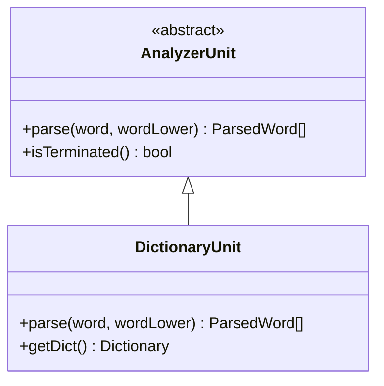
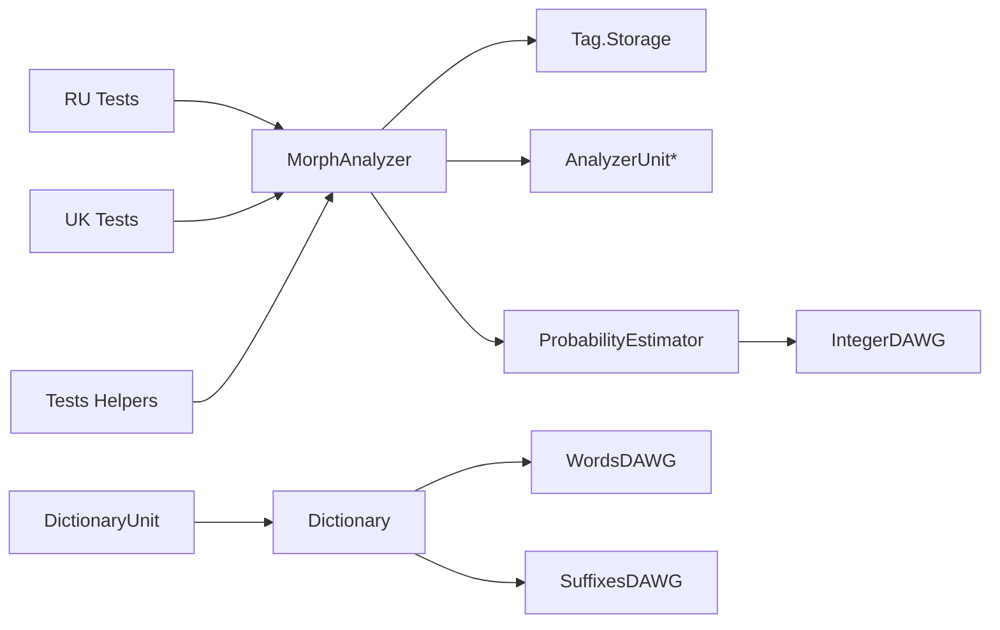

# Morphological Analysis Engine

<cite>
**Referenced Files in This Document**
- [MorphAnalyzer.java](file://jmorphy2-core/src/main/java/company/evo/jmorphy2/MorphAnalyzer.java)
- [ParsedWord.java](file://jmorphy2-core/src/main/java/company/evo/jmorphy2/ParsedWord.java)
- [Tag.java](file://jmorphy2-core/src/main/java/company/evo/jmorphy2/Tag.java)
- [ProbabilityEstimator.java](file://jmorphy2-core/src/main/java/company/evo/jmorphy2/ProbabilityEstimator.java)
- [Dictionary.java](file://jmorphy2-core/src/main/java/company/evo/jmorphy2/Dictionary.java)
- [WordsDAWG.java](file://jmorphy2-core/src/main/java/company/evo/jmorphy2/WordsDAWG.java)
- [SuffixesDAWG.java](file://jmorphy2-core/src/main/java/company/evo/jmorphy2/SuffixesDAWG.java)
- [AnalyzerUnit.java](file://jmorphy2-core/src/main/java/company/evo/jmorphy2/units/AnalyzerUnit.java)
- [DictionaryUnit.java](file://jmorphy2-core/src/main/java/company/evo/jmorphy2/units/DictionaryUnit.java)
- [DAWG.java](file://dawg/src/main/java/company/evo/dawg/DAWG.java)
- [MorphAnalyzerRUTest.java](file://jmorphy2-core/src/test/java/company/evo/jmorphy2/MorphAnalyzerRUTest.java)
- [MorphAnalyzerUkTest.java](file://jmorphy2-core/src/test/java/company/evo/jmorphy2/MorphAnalyzerUkTest.java)
- [Jmorphy2TestsHelpers.java](file://jmorphy2-core/src/test/java/company/evo/jmorphy2/Jmorphy2TestsHelpers.java)
- [Resources.java](file://jmorphy2-core/src/main/java/company/evo/jmorphy2/Resources.java)
</cite>

## Table of Contents
1. [Introduction](#introduction)
2. [Project Structure](#project-structure)
3. [Core Components](#core-components)
4. [Architecture Overview](#architecture-overview)
5. [Detailed Component Analysis](#detailed-component-analysis)
6. [Dependency Analysis](#dependency-analysis)
7. [Performance Considerations](#performance-considerations)
8. [Troubleshooting Guide](#troubleshooting-guide)
9. [Conclusion](#conclusion)
10. [Appendices](#appendices)

## Introduction
This document explains the morphological analysis engine centered on the MorphAnalyzer.parse() method and related APIs for parsing, tagging, and normal form extraction. It details the ParsedWord result structure, the Tag class for grammatical features, the probability estimation system for confidence scoring, and the underlying dictionary and DAWG infrastructure. Practical examples demonstrate analysis of Russian and Ukrainian words, configuration options, performance tuning, and error handling for unknown words and edge cases.

## Project Structure
The morphological engine is implemented primarily in the jmorphy2-core module with supporting DAWG structures in a separate module. Tests in jmorphy2-core exercise Russian and Ukrainian analyzers and showcase expected outputs.

**Diagram sources**
- [MorphAnalyzer.java:15-247](file://jmorphy2-core/src/main/java/company/evo/jmorphy2/MorphAnalyzer.java#L15-L247)
- [AnalyzerUnit.java:11-72](file://jmorphy2-core/src/main/java/company/evo/jmorphy2/units/AnalyzerUnit.java#L11-L72)
- [DictionaryUnit.java:14-104](file://jmorphy2-core/src/main/java/company/evo/jmorphy2/units/DictionaryUnit.java#L14-L104)
- [Dictionary.java:12-302](file://jmorphy2-core/src/main/java/company/evo/jmorphy2/Dictionary.java#L12-L302)
- [WordsDAWG.java:13-57](file://jmorphy2-core/src/main/java/company/evo/jmorphy2/WordsDAWG.java#L13-L57)
- [SuffixesDAWG.java:13-61](file://jmorphy2-core/src/main/java/company/evo/jmorphy2/SuffixesDAWG.java#L13-L61)
- [DAWG.java:13-40](file://dawg/src/main/java/company/evo/dawg/DAWG.java#L13-L40)
- [MorphAnalyzerRUTest.java:18-308](file://jmorphy2-core/src/test/java/company/evo/jmorphy2/MorphAnalyzerRUTest.java#L18-L308)
- [MorphAnalyzerUkTest.java:18-175](file://jmorphy2-core/src/test/java/company/evo/jmorphy2/MorphAnalyzerUkTest.java#L18-L175)
- [Jmorphy2TestsHelpers.java:6-21](file://jmorphy2-core/src/test/java/company/evo/jmorphy2/Jmorphy2TestsHelpers.java#L6-L21)
- [Resources.java:16-114](file://jmorphy2-core/src/main/java/company/evo/jmorphy2/Resources.java#L16-L114)

**Section sources**
- [MorphAnalyzer.java:15-247](file://jmorphy2-core/src/main/java/company/evo/jmorphy2/MorphAnalyzer.java#L15-L247)
- [MorphAnalyzerRUTest.java:18-308](file://jmorphy2-core/src/test/java/company/evo/jmorphy2/MorphAnalyzerRUTest.java#L18-L308)
- [MorphAnalyzerUkTest.java:18-175](file://jmorphy2-core/src/test/java/company/evo/jmorphy2/MorphAnalyzerUkTest.java#L18-L175)

## Core Components
- MorphAnalyzer: Orchestrates analysis via AnalyzerUnit plugins, applies duplicate filtering and optional probability-based scoring, and exposes parse(), tag(), and normalForms() APIs.
- ParsedWord: Immutable result container holding the input word, discovered tag, normal form, matched dictionary lemma, and a confidence score; supports lexeme retrieval and inflection filtering.
- Tag: Encapsulates grammatical features (part-of-speech, case, number, gender, etc.) and provides containment checks and productivity classification.
- ProbabilityEstimator: Loads a precomputed P(t|w) DAWG and estimates word-tag probabilities to re-score analyses.
- Dictionary and DAWGs: Provide paradigm metadata, word forms, and suffix predictions backed by compressed automata (DAWGs).
- AnalyzerUnit and DictionaryUnit: Pluggable units that produce candidate analyses; DictionaryUnit queries dictionary-backed data structures.

**Section sources**
- [MorphAnalyzer.java:15-247](file://jmorphy2-core/src/main/java/company/evo/jmorphy2/MorphAnalyzer.java#L15-L247)
- [ParsedWord.java:9-89](file://jmorphy2-core/src/main/java/company/evo/jmorphy2/ParsedWord.java#L9-L89)
- [Tag.java:7-230](file://jmorphy2-core/src/main/java/company/evo/jmorphy2/Tag.java#L7-L230)
- [ProbabilityEstimator.java:9-27](file://jmorphy2-core/src/main/java/company/evo/jmorphy2/ProbabilityEstimator.java#L9-L27)
- [Dictionary.java:12-302](file://jmorphy2-core/src/main/java/company/evo/jmorphy2/Dictionary.java#L12-L302)
- [WordsDAWG.java:13-57](file://jmorphy2-core/src/main/java/company/evo/jmorphy2/WordsDAWG.java#L13-L57)
- [SuffixesDAWG.java:13-61](file://jmorphy2-core/src/main/java/company/evo/jmorphy2/SuffixesDAWG.java#L13-L61)
- [AnalyzerUnit.java:11-72](file://jmorphy2-core/src/main/java/company/evo/jmorphy2/units/AnalyzerUnit.java#L11-L72)
- [DictionaryUnit.java:14-104](file://jmorphy2-core/src/main/java/company/evo/jmorphy2/units/DictionaryUnit.java#L14-L104)

## Architecture Overview
The analyzer composes multiple AnalyzerUnit instances (dictionary, numbers, punctuation, Latin, Roman, known/unknown prefixes/suffixes, unknown words). Each unit contributes candidate analyses. Results are deduplicated, optionally scored by P(t|w), and sorted by confidence.

**Diagram sources**
- [MorphAnalyzer.java:178-200](file://jmorphy2-core/src/main/java/company/evo/jmorphy2/MorphAnalyzer.java#L178-L200)
- [MorphAnalyzer.java:202-232](file://jmorphy2-core/src/main/java/company/evo/jmorphy2/MorphAnalyzer.java#L202-L232)
- [AnalyzerUnit.java:46-46](file://jmorphy2-core/src/main/java/company/evo/jmorphy2/units/AnalyzerUnit.java#L46-L46)
- [DictionaryUnit.java:56-65](file://jmorphy2-core/src/main/java/company/evo/jmorphy2/units/DictionaryUnit.java#L56-L65)
- [Dictionary.java:165-188](file://jmorphy2-core/src/main/java/company/evo/jmorphy2/Dictionary.java#L165-L188)
- [ProbabilityEstimator.java:22-25](file://jmorphy2-core/src/main/java/company/evo/jmorphy2/ProbabilityEstimator.java#L22-L25)

## Detailed Component Analysis

### MorphAnalyzer.parse() and Variants
- parse(String): Lowercases input, applies special-case normalization, aggregates results from AnalyzerUnit instances, filters duplicates, optionally estimates probabilities, and sorts descending by score.
- tag(String): Delegates to parse() and returns distinct Tag instances.
- normalForms(String): Delegates to parse() and returns unique normal forms.

Key behaviors:
- Termination: Stops early if a unit claims termination and produced candidates.
- Duplicate filtering: Uses a canonical representation combining tag and normal form.
- Scoring: If P(t|w) is available, re-scores candidates proportionally; otherwise preserves unit scores.

Example usage and expected outputs are demonstrated in tests for Russian and Ukrainian.

**Section sources**
- [MorphAnalyzer.java:178-200](file://jmorphy2-core/src/main/java/company/evo/jmorphy2/MorphAnalyzer.java#L178-L200)
- [MorphAnalyzer.java:161-172](file://jmorphy2-core/src/main/java/company/evo/jmorphy2/MorphAnalyzer.java#L161-L172)
- [MorphAnalyzer.java:147-159](file://jmorphy2-core/src/main/java/company/evo/jmorphy2/MorphAnalyzer.java#L147-L159)
- [MorphAnalyzer.java:234-245](file://jmorphy2-core/src/main/java/company/evo/jmorphy2/MorphAnalyzer.java#L234-L245)
- [MorphAnalyzerRUTest.java:30-142](file://jmorphy2-core/src/test/java/company/evo/jmorphy2/MorphAnalyzerRUTest.java#L30-L142)
- [MorphAnalyzerUkTest.java:30-67](file://jmorphy2-core/src/test/java/company/evo/jmorphy2/MorphAnalyzerUkTest.java#L30-L67)

### ParsedWord Result Structure
- Fields: original word, Tag, normalForm, foundWord (matched dictionary lemma), and score.
- Methods: rescore() creates a new instance with updated score; getLexeme() enumerates paradigm forms; inflect() filters paradigm by required/excluded grammemes.
- Ordering: Comparable by score; used to sort results.

**Diagram sources**
- [ParsedWord.java:9-89](file://jmorphy2-core/src/main/java/company/evo/jmorphy2/ParsedWord.java#L9-L89)
- [Tag.java:27-139](file://jmorphy2-core/src/main/java/company/evo/jmorphy2/Tag.java#L27-L139)
- [Grammeme.java:7-86](file://jmorphy2-core/src/main/java/company/evo/jmorphy2/Grammeme.java#L7-L86)

**Section sources**
- [ParsedWord.java:9-89](file://jmorphy2-core/src/main/java/company/evo/jmorphy2/ParsedWord.java#L9-L89)
- [Tag.java:27-139](file://jmorphy2-core/src/main/java/company/evo/jmorphy2/Tag.java#L27-L139)
- [Grammeme.java:7-86](file://jmorphy2-core/src/main/java/company/evo/jmorphy2/Grammeme.java#L7-L86)

### Tag and Grammatical Features
- Tag stores a set of Grammeme objects and exposes typed accessors (POS, gender, number, Case, etc.).
- Grammeme holds key/value pairs, parent/root relationships, and localized descriptions.
- Tag equality considers grammeme sets and storage identity; Tag Storage normalizes and caches grammemes/tags.

Practical usage:
- Retrieve grammeme roots for coarse-grained categories.
- Check feature containment with values or Grammeme objects.
- Determine productivity (non-productive features excluded).

**Section sources**
- [Tag.java:27-139](file://jmorphy2-core/src/main/java/company/evo/jmorphy2/Tag.java#L27-L139)
- [Grammeme.java:16-60](file://jmorphy2-core/src/main/java/company/evo/jmorphy2/Grammeme.java#L16-L60)
- [Tag.java:162-228](file://jmorphy2-core/src/main/java/company/evo/jmorphy2/Tag.java#L162-L228)

### Probability Estimation and Confidence Ranking
- ProbabilityEstimator loads a precomputed DAWG mapping "word:tag" to integer counts scaled to probabilities.
- MorphAnalyzer.estimate() computes new scores using P(t|w) when available; if all P(t|w) are near zero, falls back to uniform rescaling of existing scores.
- Results are sorted in descending order by score.

**Diagram sources**
- [MorphAnalyzer.java:202-232](file://jmorphy2-core/src/main/java/company/evo/jmorphy2/MorphAnalyzer.java#L202-L232)
- [ProbabilityEstimator.java:22-25](file://jmorphy2-core/src/main/java/company/evo/jmorphy2/ProbabilityEstimator.java#L22-L25)

**Section sources**
- [ProbabilityEstimator.java:9-27](file://jmorphy2-core/src/main/java/company/evo/jmorphy2/ProbabilityEstimator.java#L9-L27)
- [MorphAnalyzer.java:202-232](file://jmorphy2-core/src/main/java/company/evo/jmorphy2/MorphAnalyzer.java#L202-L232)

### Underlying Dictionary Systems and DAWG Structures
- Dictionary encapsulates:
  - meta (including compile options and P(t|w) availability)
  - paradigm metadata and normal-form construction
  - word DAWG for finding similar items with character substitutions
  - prediction suffix DAWGs indexed by paradigm prefix
  - grammeme/tag tables
- WordsDAWG and SuffixesDAWG extend a generic PayloadsDAWG to decode stored payloads (paradigm id and index).
- DAWG base class provides traversal primitives for prefix matching.

**Diagram sources**
- [Dictionary.java:12-302](file://jmorphy2-core/src/main/java/company/evo/jmorphy2/Dictionary.java#L12-L302)
- [WordsDAWG.java:13-57](file://jmorphy2-core/src/main/java/company/evo/jmorphy2/WordsDAWG.java#L13-L57)
- [SuffixesDAWG.java:13-61](file://jmorphy2-core/src/main/java/company/evo/jmorphy2/SuffixesDAWG.java#L13-L61)
- [DAWG.java:13-40](file://dawg/src/main/java/company/evo/dawg/DAWG.java#L13-L40)

**Section sources**
- [Dictionary.java:12-302](file://jmorphy2-core/src/main/java/company/evo/jmorphy2/Dictionary.java#L12-L302)
- [WordsDAWG.java:18-31](file://jmorphy2-core/src/main/java/company/evo/jmorphy2/WordsDAWG.java#L18-L31)
- [SuffixesDAWG.java:18-32](file://jmorphy2-core/src/main/java/company/evo/jmorphy2/SuffixesDAWG.java#L18-L32)
- [DAWG.java:22-38](file://dawg/src/main/java/company/evo/dawg/DAWG.java#L22-L38)

### Analyzer Units and DictionaryUnit
- AnalyzerUnit defines the interface for pluggable analyzers with a builder pattern and termination semantics.
- DictionaryUnit queries the dictionary’s word DAWG for similar forms, constructs normal forms and tags, and builds lexemes by iterating paradigm entries.

**Diagram sources**
- [AnalyzerUnit.java:11-72](file://jmorphy2-core/src/main/java/company/evo/jmorphy2/units/AnalyzerUnit.java#L11-L72)
- [DictionaryUnit.java:14-104](file://jmorphy2-core/src/main/java/company/evo/jmorphy2/units/DictionaryUnit.java#L14-L104)

**Section sources**
- [AnalyzerUnit.java:11-72](file://jmorphy2-core/src/main/java/company/evo/jmorphy2/units/AnalyzerUnit.java#L11-L72)
- [DictionaryUnit.java:56-102](file://jmorphy2-core/src/main/java/company/evo/jmorphy2/units/DictionaryUnit.java#L56-L102)

### Concrete Examples from the Codebase
Russian examples:
- Adjective inflection and case/number/animacy combinations for "красивого".
- Known and unknown prefixes, known suffixes, and paradigm prefix effects.
- Punctuation, numbers, Latin, Roman numerals, and unknown words.

Ukrainian examples:
- Comparative adjectives ("чарівної" -> "чарівний").
- Unicode apostrophe variations and hyphenated compounds.
- Unknown words and lexeme enumeration.

See test assertions for expected outputs and grammatical feature checks.

**Section sources**
- [MorphAnalyzerRUTest.java:30-142](file://jmorphy2-core/src/test/java/company/evo/jmorphy2/MorphAnalyzerRUTest.java#L30-L142)
- [MorphAnalyzerRUTest.java:144-211](file://jmorphy2-core/src/test/java/company/evo/jmorphy2/MorphAnalyzerRUTest.java#L144-L211)
- [MorphAnalyzerRUTest.java:213-254](file://jmorphy2-core/src/test/java/company/evo/jmorphy2/MorphAnalyzerRUTest.java#L213-L254)
- [MorphAnalyzerUkTest.java:30-67](file://jmorphy2-core/src/test/java/company/evo/jmorphy2/MorphAnalyzerUkTest.java#L30-L67)
- [MorphAnalyzerUkTest.java:69-101](file://jmorphy2-core/src/test/java/company/evo/jmorphy2/MorphAnalyzerUkTest.java#L69-L101)
- [MorphAnalyzerUkTest.java:103-121](file://jmorphy2-core/src/test/java/company/evo/jmorphy2/MorphAnalyzerUkTest.java#L103-L121)

### Configuration Options and Customization
- Builder options:
  - dictPath: dictionary location (resolved from system property if not set).
  - fileLoader: pluggable loader for dictionary resources.
  - charSubstitutes: character substitution map for flexible matching (loaded from language resources).
- Unit composition:
  - DictionaryUnit, NumberUnit, PunctuationUnit, LatinUnit, RomanUnit, KnownPrefixUnit, UnknownPrefixUnit, KnownSuffixUnit, UnknownUnit.
- Probability estimation:
  - Enabled automatically when dictionary meta indicates P(t|w) support.

Initialization helper:
- Jmorphy2TestsHelpers demonstrates loading dictionaries from resource paths and applying character substitutions.

**Section sources**
- [MorphAnalyzer.java:20-104](file://jmorphy2-core/src/main/java/company/evo/jmorphy2/MorphAnalyzer.java#L20-L104)
- [Resources.java:17-40](file://jmorphy2-core/src/main/java/company/evo/jmorphy2/Resources.java#L17-L40)
- [Jmorphy2TestsHelpers.java:7-19](file://jmorphy2-core/src/test/java/company/evo/jmorphy2/Jmorphy2TestsHelpers.java#L7-L19)
- [Dictionary.java:209-259](file://jmorphy2-core/src/main/java/company/evo/jmorphy2/Dictionary.java#L209-L259)

## Dependency Analysis
- MorphAnalyzer depends on Tag.Storage for grammeme/tag resolution, a list of AnalyzerUnit instances, and an optional ProbabilityEstimator.
- DictionaryUnit depends on Dictionary and DAWG-backed structures for word and suffix lookups.
- ProbabilityEstimator depends on IntegerDAWG for P(t|w) lookups.
- Tests depend on Jmorphy2TestsHelpers to construct analyzers with language-specific resources.

**Diagram sources**
- [MorphAnalyzer.java:16-25](file://jmorphy2-core/src/main/java/company/evo/jmorphy2/MorphAnalyzer.java#L16-L25)
- [DictionaryUnit.java:14-26](file://jmorphy2-core/src/main/java/company/evo/jmorphy2/units/DictionaryUnit.java#L14-L26)
- [Dictionary.java:12-34](file://jmorphy2-core/src/main/java/company/evo/jmorphy2/Dictionary.java#L12-L34)
- [ProbabilityEstimator.java:14-20](file://jmorphy2-core/src/main/java/company/evo/jmorphy2/ProbabilityEstimator.java#L14-L20)
- [MorphAnalyzerRUTest.java:18-28](file://jmorphy2-core/src/test/java/company/evo/jmorphy2/MorphAnalyzerRUTest.java#L18-L28)
- [MorphAnalyzerUkTest.java:18-28](file://jmorphy2-core/src/test/java/company/evo/jmorphy2/MorphAnalyzerUkTest.java#L18-L28)
- [Jmorphy2TestsHelpers.java:7-19](file://jmorphy2-core/src/test/java/company/evo/jmorphy2/Jmorphy2TestsHelpers.java#L7-L19)

**Section sources**
- [MorphAnalyzer.java:16-25](file://jmorphy2-core/src/main/java/company/evo/jmorphy2/MorphAnalyzer.java#L16-L25)
- [DictionaryUnit.java:14-26](file://jmorphy2-core/src/main/java/company/evo/jmorphy2/units/DictionaryUnit.java#L14-L26)
- [Dictionary.java:12-34](file://jmorphy2-core/src/main/java/company/evo/jmorphy2/Dictionary.java#L12-L34)
- [ProbabilityEstimator.java:14-20](file://jmorphy2-core/src/main/java/company/evo/jmorphy2/ProbabilityEstimator.java#L14-L20)

## Performance Considerations
- Early termination: Units marked terminated halt further analysis once candidates are produced, reducing unnecessary work.
- Duplicate filtering: Prevents redundant results from overlapping units.
- Optional P(t|w) scoring: Adds accuracy at the cost of DAWG lookups; enable only when needed.
- Character substitutions: Reduce lexical variance but increase similarity searches; tune for target languages.
- Lexeme expansion: getLexeme() enumerates paradigm forms; cache or limit usage in hot paths.

[No sources needed since this section provides general guidance]

## Troubleshooting Guide
- Unknown words:
  - Results tagged as UNKN with identity normal form and found word.
  - Example: "ъь" yields a single UNKN result.
- Edge cases:
  - Special-case normalization for specific tokens during parsing.
  - Unicode variants (apostrophes) handled via character substitutions and DAWG lookups.
- Validation:
  - Use tag() to verify grammatical categories and containment checks.
  - Use inflect() to constrain results by required and excluded features.

**Section sources**
- [MorphAnalyzerRUTest.java:136-142](file://jmorphy2-core/src/test/java/company/evo/jmorphy2/MorphAnalyzerRUTest.java#L136-L142)
- [MorphAnalyzerUkTest.java:99-101](file://jmorphy2-core/src/test/java/company/evo/jmorphy2/MorphAnalyzerUkTest.java#L99-L101)
- [MorphAnalyzer.java:180-182](file://jmorphy2-core/src/main/java/company/evo/jmorphy2/MorphAnalyzer.java#L180-L182)

## Conclusion
The morphological engine provides a modular, extensible pipeline for Russian and Ukrainian text analysis. MorphAnalyzer.parse() integrates multiple AnalyzerUnit plugins, leverages dictionary-backed paradigms and DAWGs, and optionally refines results with P(t|w) probabilities. ParsedWord and Tag offer robust, typed access to grammatical information, enabling downstream tasks like lemmatization, inflection, and feature-based filtering.

[No sources needed since this section summarizes without analyzing specific files]

## Appendices

### API Reference Summary
- parse(word): Returns ranked ParsedWord list.
- tag(word): Returns distinct Tag list derived from parse().
- normalForms(word): Returns unique normal forms from parse().
- getGrammeme(value)/getAllGrammemes(): Access grammeme registry.
- getTag(tagString)/getAllTags(): Access tag registry.

**Section sources**
- [MorphAnalyzer.java:147-172](file://jmorphy2-core/src/main/java/company/evo/jmorphy2/MorphAnalyzer.java#L147-L172)
- [Tag.java:184-214](file://jmorphy2-core/src/main/java/company/evo/jmorphy2/Tag.java#L184-L214)