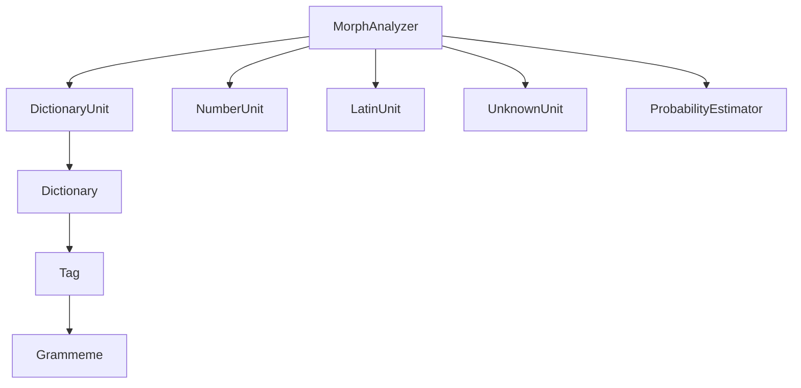
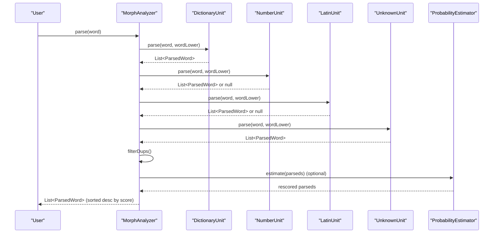
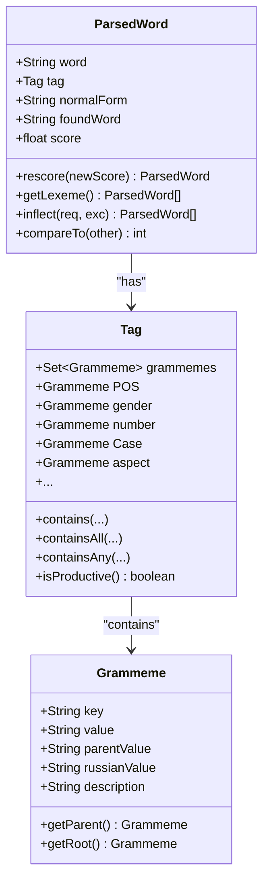
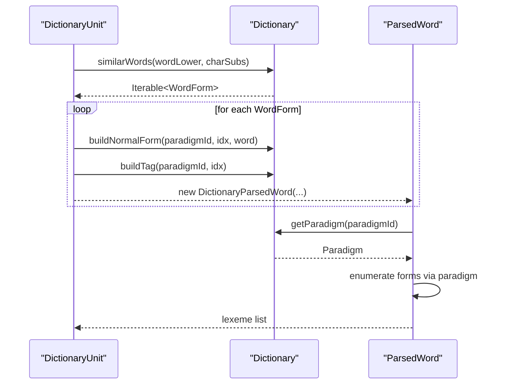
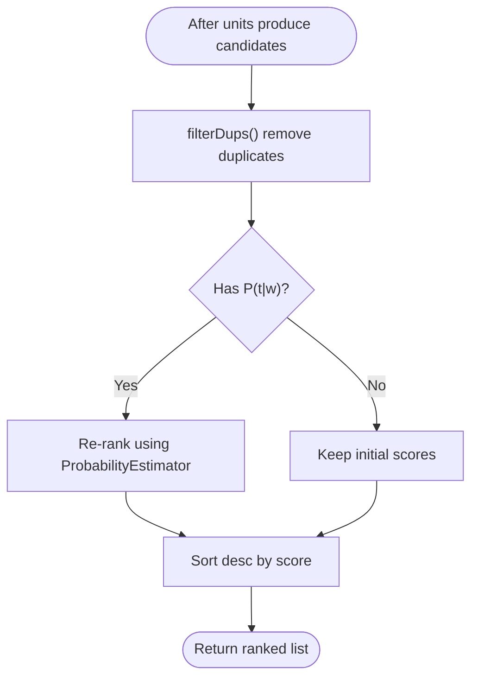
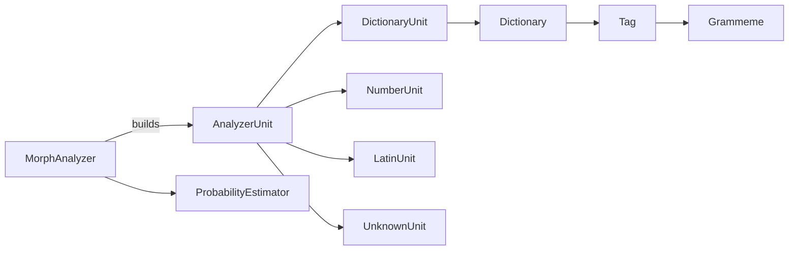

# Result Interpretation

<cite>
**Referenced Files in This Document**
- [ParsedWord.java](file://jmorphy2-core/src/main/java/company/evo/jmorphy2/ParsedWord.java)
- [Tag.java](file://jmorphy2-core/src/main/java/company/evo/jmorphy2/Tag.java)
- [Grammeme.java](file://jmorphy2-core/src/main/java/company/evo/jmorphy2/Grammeme.java)
- [MorphAnalyzer.java](file://jmorphy2-core/src/main/java/company/evo/jmorphy2/MorphAnalyzer.java)
- [Dictionary.java](file://jmorphy2-core/src/main/java/company/evo/jmorphy2/Dictionary.java)
- [DictionaryUnit.java](file://jmorphy2-core/src/main/java/company/evo/jmorphy2/units/DictionaryUnit.java)
- [AnalyzerUnit.java](file://jmorphy2-core/src/main/java/company/evo/jmorphy2/units/AnalyzerUnit.java)
- [NumberUnit.java](file://jmorphy2-core/src/main/java/company/evo/jmorphy2/units/NumberUnit.java)
- [LatinUnit.java](file://jmorphy2-core/src/main/java/company/evo/jmorphy2/units/LatinUnit.java)
- [UnknownUnit.java](file://jmorphy2-core/src/main/java/company/evo/jmorphy2/units/UnknownUnit.java)
- [ProbabilityEstimator.java](file://jmorphy2-core/src/main/java/company/evo/jmorphy2/ProbabilityEstimator.java)
- [MorphAnalyzerRUTest.java](file://jmorphy2-core/src/test/java/company/evo/jmorphy2/MorphAnalyzerRUTest.java)
- [MorphAnalyzerUkTest.java](file://jmorphy2-core/src/test/java/company/evo/jmorphy2/MorphAnalyzerUkTest.java)
- [README.md](file://README.md)
</cite>

## Table of Contents
1. [Introduction](#introduction)
2. [Project Structure](#project-structure)
3. [Core Components](#core-components)
4. [Architecture Overview](#architecture-overview)
5. [Detailed Component Analysis](#detailed-component-analysis)
6. [Dependency Analysis](#dependency-analysis)
7. [Performance Considerations](#performance-considerations)
8. [Troubleshooting Guide](#troubleshooting-guide)
9. [Conclusion](#conclusion)
10. [Appendices](#appendices)

## Introduction
This document explains how to interpret morphological analysis results produced by the system. It focuses on the ParsedWord structure and its fields, the Tag class representing part-of-speech and grammatical features, the Grammeme system for individual linguistic features, and practical guidance for working with results across Russian and Ukrainian languages. It also covers confidence scoring, ambiguity handling, and troubleshooting.

## Project Structure
The morphological analyzer is organized around a core set of classes:
- MorphAnalyzer orchestrates parsing and ranking of candidate analyses
- Dictionary and DictionaryUnit provide dictionary-backed analyses
- AnalyzerUnit and its subclasses implement specialized parsing modes (numbers, Latin, unknown words)
- Tag and Grammeme represent grammatical tags and features
- ProbabilityEstimator optionally refines confidence scores

**Diagram sources**
- [MorphAnalyzer.java:15-125](file://jmorphy2-core/src/main/java/company/evo/jmorphy2/MorphAnalyzer.java#L15-L125)
- [DictionaryUnit.java:14-26](file://jmorphy2-core/src/main/java/company/evo/jmorphy2/units/DictionaryUnit.java#L14-L26)
- [Dictionary.java:12-34](file://jmorphy2-core/src/main/java/company/evo/jmorphy2/Dictionary.java#L12-L34)
- [Tag.java:7-27](file://jmorphy2-core/src/main/java/company/evo/jmorphy2/Tag.java#L7-L27)
- [Grammeme.java:7-14](file://jmorphy2-core/src/main/java/company/evo/jmorphy2/Grammeme.java#L7-L14)
- [NumberUnit.java:10-28](file://jmorphy2-core/src/main/java/company/evo/jmorphy2/units/NumberUnit.java#L10-L28)
- [LatinUnit.java:8-26](file://jmorphy2-core/src/main/java/company/evo/jmorphy2/units/LatinUnit.java#L8-L26)
- [UnknownUnit.java:9-33](file://jmorphy2-core/src/main/java/company/evo/jmorphy2/units/UnknownUnit.java#L9-L33)
- [ProbabilityEstimator.java:9-25](file://jmorphy2-core/src/main/java/company/evo/jmorphy2/ProbabilityEstimator.java#L9-L25)

**Section sources**
- [MorphAnalyzer.java:15-125](file://jmorphy2-core/src/main/java/company/evo/jmorphy2/MorphAnalyzer.java#L15-L125)
- [README.md:4-142](file://README.md#L4-L142)

## Core Components
- ParsedWord: Holds a single analysis hypothesis with:
  - word: input surface form
  - tag: grammatical tag (POS and features)
  - normalForm: dictionary base form
  - foundWord: matched dictionary surface form
  - score: confidence score
  - Methods: rescore, getLexeme, inflect, comparison by score
- Tag: Encapsulates grammatical features and provides containment checks and productivity assessment
- Grammeme: Represents a single grammatical feature with parent/root relationships and localized labels
- MorphAnalyzer: Provides parse, tag, normalForms, and lexeme extraction; applies optional probability re-ranking

Key behaviors:
- Multiple analyses are returned per input word; they are deduplicated and sorted by score
- Confidence scores can be refined using a precomputed P(t|w) model when available

**Section sources**
- [ParsedWord.java:9-58](file://jmorphy2-core/src/main/java/company/evo/jmorphy2/ParsedWord.java#L9-L58)
- [Tag.java:7-159](file://jmorphy2-core/src/main/java/company/evo/jmorphy2/Tag.java#L7-L159)
- [Grammeme.java:7-84](file://jmorphy2-core/src/main/java/company/evo/jmorphy2/Grammeme.java#L7-L84)
- [MorphAnalyzer.java:143-245](file://jmorphy2-core/src/main/java/company/evo/jmorphy2/MorphAnalyzer.java#L143-L245)

## Architecture Overview
The analyzer composes multiple AnalyzerUnit instances. Each unit contributes candidate analyses with an associated score. The final list is de-duplicated, optionally re-ranked using P(t|w), and sorted descending by score.

**Diagram sources**
- [MorphAnalyzer.java:178-245](file://jmorphy2-core/src/main/java/company/evo/jmorphy2/MorphAnalyzer.java#L178-L245)
- [DictionaryUnit.java:56-65](file://jmorphy2-core/src/main/java/company/evo/jmorphy2/units/DictionaryUnit.java#L56-L65)
- [NumberUnit.java:31-52](file://jmorphy2-core/src/main/java/company/evo/jmorphy2/units/NumberUnit.java#L31-L52)
- [LatinUnit.java:8-26](file://jmorphy2-core/src/main/java/company/evo/jmorphy2/units/LatinUnit.java#L8-L26)
- [UnknownUnit.java:27-33](file://jmorphy2-core/src/main/java/company/evo/jmorphy2/units/UnknownUnit.java#L27-L33)
- [ProbabilityEstimator.java:22-25](file://jmorphy2-core/src/main/java/company/evo/jmorphy2/ProbabilityEstimator.java#L22-L25)

## Detailed Component Analysis

### ParsedWord and Lexeme Inflection
- ParsedWord fields:
  - word: original input
  - tag: Tag with POS and features
  - normalForm: canonical dictionary lemma
  - foundWord: matched dictionary surface form
  - score: confidence (higher is better)
- Methods:
  - rescore(newScore): returns a new ParsedWord with updated score
  - getLexeme(): returns paradigm forms for the analysis
  - inflect(includeGrammemes, excludeGrammemes): filters lexeme by required and excluded features
  - compareTo: sorts by score descending

**Diagram sources**
- [ParsedWord.java:9-58](file://jmorphy2-core/src/main/java/company/evo/jmorphy2/ParsedWord.java#L9-L58)
- [Tag.java:27-159](file://jmorphy2-core/src/main/java/company/evo/jmorphy2/Tag.java#L27-L159)
- [Grammeme.java:7-84](file://jmorphy2-core/src/main/java/company/evo/jmorphy2/Grammeme.java#L7-L84)

**Section sources**
- [ParsedWord.java:9-58](file://jmorphy2-core/src/main/java/company/evo/jmorphy2/ParsedWord.java#L9-L58)
- [Tag.java:75-139](file://jmorphy2-core/src/main/java/company/evo/jmorphy2/Tag.java#L75-L139)

### Tag and Grammeme System
- Tag stores a set of Grammeme objects and exposes convenience fields for common features (POS, gender, number, case, aspect, etc.).
- Grammeme holds metadata including key, value, parent, localized label, and description. It supports getParent and getRoot to navigate feature hierarchies.
- Tags are constructed from normalized grammeme strings and compared by normalized sets.

Practical usage tips:
- Use contains(...) and containsAll(...) to check for feature presence
- Use POS, gender, number, Case, aspect, etc., to quickly access major features
- Use isProductive() to filter out non-productive grammatical categories

**Section sources**
- [Tag.java:41-159](file://jmorphy2-core/src/main/java/company/evo/jmorphy2/Tag.java#L41-L159)
- [Grammeme.java:16-84](file://jmorphy2-core/src/main/java/company/evo/jmorphy2/Grammeme.java#L16-L84)

### Dictionary-Based Analysis and Lexeme Generation
- DictionaryUnit queries the dictionary for similar words and builds ParsedWord instances with normalForm and tag derived from paradigm tables.
- getLexeme() enumerates paradigm forms for the matched word, returning multiple inflected variants with consistent normalForm and varying tags.

**Diagram sources**
- [DictionaryUnit.java:56-101](file://jmorphy2-core/src/main/java/company/evo/jmorphy2/units/DictionaryUnit.java#L56-L101)
- [Dictionary.java:165-188](file://jmorphy2-core/src/main/java/company/evo/jmorphy2/Dictionary.java#L165-L188)

**Section sources**
- [DictionaryUnit.java:56-101](file://jmorphy2-core/src/main/java/company/evo/jmorphy2/units/DictionaryUnit.java#L56-L101)
- [Dictionary.java:165-188](file://jmorphy2-core/src/main/java/company/evo/jmorphy2/Dictionary.java#L165-L188)

### Specialized Analyzer Units
- NumberUnit recognizes integers and floats and assigns NUMB,intg or NUMB,real tags
- LatinUnit recognizes sequences of Latin characters and punctuation and assigns LATN
- UnknownUnit assigns UNKN to any unrecognized input

These units contribute baseline analyses with fixed scores and can terminate further processing depending on configuration.

**Section sources**
- [NumberUnit.java:15-52](file://jmorphy2-core/src/main/java/company/evo/jmorphy2/units/NumberUnit.java#L15-L52)
- [LatinUnit.java:15-26](file://jmorphy2-core/src/main/java/company/evo/jmorphy2/units/LatinUnit.java#L15-L26)
- [UnknownUnit.java:14-33](file://jmorphy2-core/src/main/java/company/evo/jmorphy2/units/UnknownUnit.java#L14-L33)

### Confidence Scores and Re-ranking
- Initial scores come from AnalyzerUnit builders and are combined across units
- If the dictionary metadata indicates availability of P(t|w), MorphAnalyzer estimates new scores using ProbabilityEstimator and normalizes them
- Results are sorted descending by score; higher score indicates higher confidence

**Diagram sources**
- [MorphAnalyzer.java:196-245](file://jmorphy2-core/src/main/java/company/evo/jmorphy2/MorphAnalyzer.java#L196-L245)
- [ProbabilityEstimator.java:22-25](file://jmorphy2-core/src/main/java/company/evo/jmorphy2/ProbabilityEstimator.java#L22-L25)

**Section sources**
- [MorphAnalyzer.java:202-245](file://jmorphy2-core/src/main/java/company/evo/jmorphy2/MorphAnalyzer.java#L202-L245)
- [ProbabilityEstimator.java:9-25](file://jmorphy2-core/src/main/java/company/evo/jmorphy2/ProbabilityEstimator.java#L9-L25)

### Interpreting Results Across Languages

#### Russian Examples
- Adjective with multiple analyses and case/number/gender features
- Adverb, proper noun with geo feature, prefixes, suffixes, and special letter handling
- Numbers, punctuation, Latin tokens, Roman numerals, and unknown words

Examples validated by tests:
- Adjective with gender/number/case variants and multiple possible analyses
- Adverb, capitalized nouns, known/unknown prefixes/suffixes
- Special letters (e.g., ё), numbers, punctuation, Latin, Roman numerals, unknown tokens

**Section sources**
- [MorphAnalyzerRUTest.java:30-142](file://jmorphy2-core/src/test/java/company/evo/jmorphy2/MorphAnalyzerRUTest.java#L30-L142)

#### Ukrainian Examples
- Adjective with comparative degree and gender/number/case
- Nouns with various animacy and case features
- Handling of apostrophes and hyphens in compounds
- Numbers, punctuation, Latin tokens, and unknown words

**Section sources**
- [MorphAnalyzerUkTest.java:30-101](file://jmorphy2-core/src/test/java/company/evo/jmorphy2/MorphAnalyzerUkTest.java#L30-L101)

### Practical Extraction Patterns
- Extract POS: access tag.POS
- Extract case/number/gender: access tag.Case, tag.number, tag.gender
- Check feature presence: tag.contains("ADJF"), tag.containsAllValues(...)
- Get normal form: use normalForm field
- Get all inflected forms: call getLexeme() on a ParsedWord
- Filter by required/excluded features: use inflect(include, exclude)

Validation references:
- POS and case/number/gender extraction
- Feature containment checks
- Lexeme enumeration and paradigm filtering

**Section sources**
- [MorphAnalyzerRUTest.java:30-254](file://jmorphy2-core/src/test/java/company/evo/jmorphy2/MorphAnalyzerRUTest.java#L30-L254)
- [MorphAnalyzerUkTest.java:30-121](file://jmorphy2-core/src/test/java/company/evo/jmorphy2/MorphAnalyzerUkTest.java#L30-L121)

## Dependency Analysis
The following diagram shows core dependencies among components involved in result interpretation.

**Diagram sources**
- [MorphAnalyzer.java:15-125](file://jmorphy2-core/src/main/java/company/evo/jmorphy2/MorphAnalyzer.java#L15-L125)
- [AnalyzerUnit.java:11-46](file://jmorphy2-core/src/main/java/company/evo/jmorphy2/units/AnalyzerUnit.java#L11-L46)
- [DictionaryUnit.java:14-26](file://jmorphy2-core/src/main/java/company/evo/jmorphy2/units/DictionaryUnit.java#L14-L26)
- [NumberUnit.java:10-28](file://jmorphy2-core/src/main/java/company/evo/jmorphy2/units/NumberUnit.java#L10-L28)
- [LatinUnit.java:8-26](file://jmorphy2-core/src/main/java/company/evo/jmorphy2/units/LatinUnit.java#L8-L26)
- [UnknownUnit.java:9-33](file://jmorphy2-core/src/main/java/company/evo/jmorphy2/units/UnknownUnit.java#L9-L33)
- [Dictionary.java:12-34](file://jmorphy2-core/src/main/java/company/evo/jmorphy2/Dictionary.java#L12-L34)
- [Tag.java:7-27](file://jmorphy2-core/src/main/java/company/evo/jmorphy2/Tag.java#L7-L27)
- [Grammeme.java:7-14](file://jmorphy2-core/src/main/java/company/evo/jmorphy2/Grammeme.java#L7-L14)
- [ProbabilityEstimator.java:9-25](file://jmorphy2-core/src/main/java/company/evo/jmorphy2/ProbabilityEstimator.java#L9-L25)

**Section sources**
- [MorphAnalyzer.java:15-125](file://jmorphy2-core/src/main/java/company/evo/jmorphy2/MorphAnalyzer.java#L15-L125)
- [AnalyzerUnit.java:11-46](file://jmorphy2-core/src/main/java/company/evo/jmorphy2/units/AnalyzerUnit.java#L11-L46)

## Performance Considerations
- De-duplication removes equivalent (tag, normalForm) pairs to reduce redundant results
- Sorting by score is performed once after estimation
- Probability re-ranking adds overhead but improves confidence ordering when enabled
- Lexeme generation enumerates paradigm forms; avoid excessive calls if only top analysis is needed

[No sources needed since this section provides general guidance]

## Troubleshooting Guide
Common issues and resolutions:
- Unexpected or low-confidence results:
  - Verify the input spelling and normalization
  - Check if P(t|w) is available; if not, scores reflect unit-level weights only
  - Inspect multiple analyses to select the highest-scoring one
- Ambiguous results with multiple analyses:
  - Use inflect(include, exclude) to narrow by required and excluded features
  - Prefer the top-ranked analysis; if none fits, adjust inclusion criteria
- Special characters and normalization:
  - Some languages support character substitutions and hyphen/apostrophe handling
  - Ensure input matches expected normalization rules
- Unknown words:
  - UnknownUnit assigns UNKN; consider preprocessing or dictionary expansion

Validation references:
- Multiple analyses and scoring behavior
- Lexeme filtering and selection
- Special character handling and normalization

**Section sources**
- [MorphAnalyzer.java:178-245](file://jmorphy2-core/src/main/java/company/evo/jmorphy2/MorphAnalyzer.java#L178-L245)
- [MorphAnalyzerRUTest.java:30-254](file://jmorphy2-core/src/test/java/company/evo/jmorphy2/MorphAnalyzerRUTest.java#L30-L254)
- [MorphAnalyzerUkTest.java:30-121](file://jmorphy2-core/src/test/java/company/evo/jmorphy2/MorphAnalyzerUkTest.java#L30-L121)

## Conclusion
Interpreting morphological analysis results hinges on understanding ParsedWord fields, Tag feature sets, and Grammeme hierarchies. Use POS, case, number, and gender fields for quick feature access, and leverage inflect to refine analyses. When multiple analyses are present, rely on score ordering and apply inclusion/exclusion filters to select the most plausible result. For Russian and Ukrainian, expect rich feature sets and nuanced handling of special characters and compounds.

[No sources needed since this section summarizes without analyzing specific files]

## Appendices

### Field Reference for ParsedWord
- word: input surface form
- tag: grammatical tag (POS and features)
- normalForm: dictionary base form
- foundWord: matched dictionary surface form
- score: confidence (higher is better)

**Section sources**
- [ParsedWord.java:12-16](file://jmorphy2-core/src/main/java/company/evo/jmorphy2/ParsedWord.java#L12-L16)

### Example Interpretations by Word Type
- Noun (Russian): capitalization, geo feature, case/number/animacy
- Verb (conceptual): aspect, mood, tense, voice, person, number
- Adjective (Russian/Ukrainian): degree, gender, number, case
- Proper name (Russian): geo feature, case variants
- Number (both languages): integer vs real
- Latin token (both languages): unanalyzed token category
- Unknown word: fallback category

Validation references:
- Russian noun/adverb/prefixes/suffixes examples
- Ukrainian adjective/noun examples
- Numbers, punctuation, Latin, unknown tokens

**Section sources**
- [MorphAnalyzerRUTest.java:30-142](file://jmorphy2-core/src/test/java/company/evo/jmorphy2/MorphAnalyzerRUTest.java#L30-L142)
- [MorphAnalyzerUkTest.java:30-101](file://jmorphy2-core/src/test/java/company/evo/jmorphy2/MorphAnalyzerUkTest.java#L30-L101)