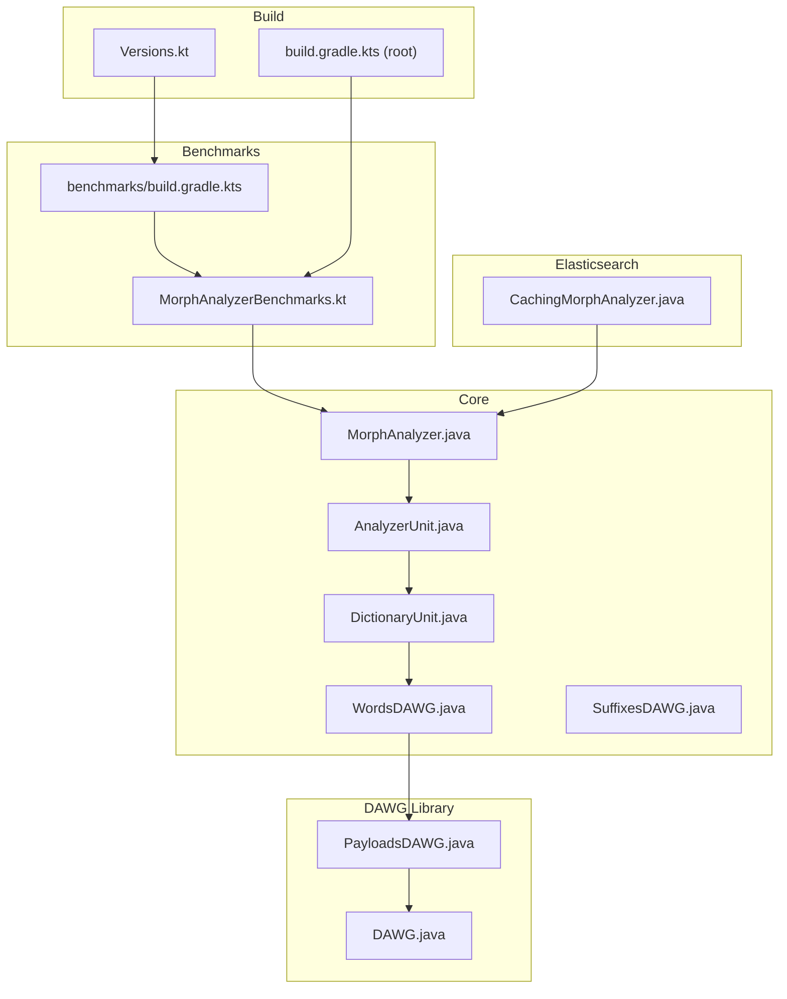
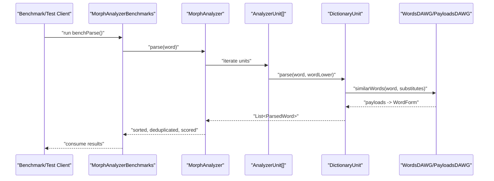
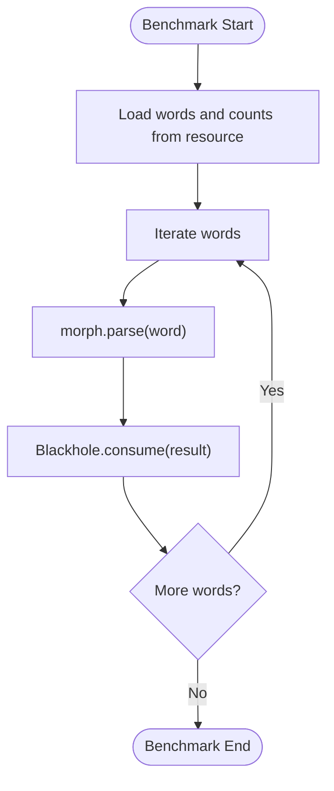
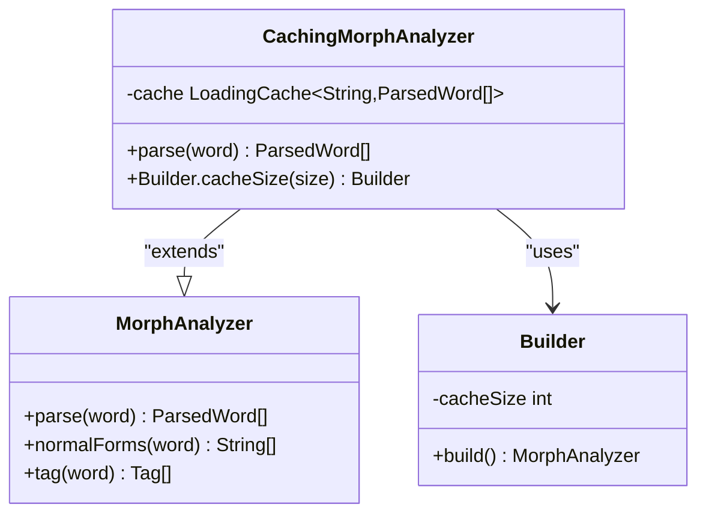
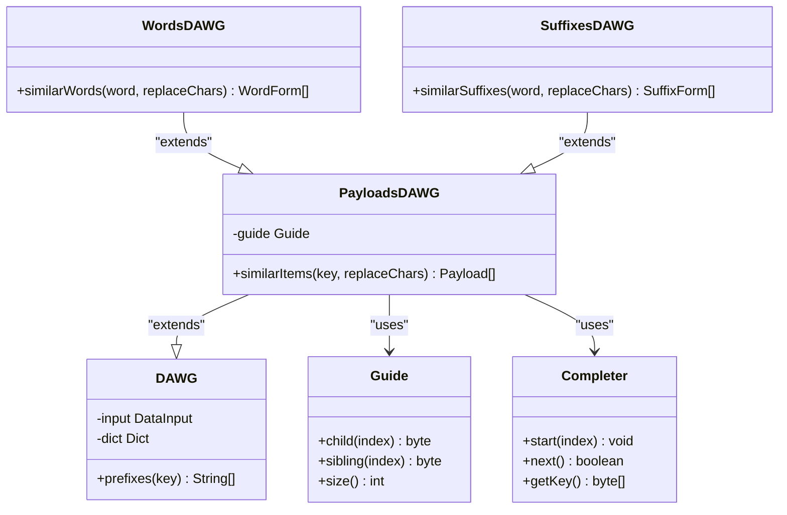
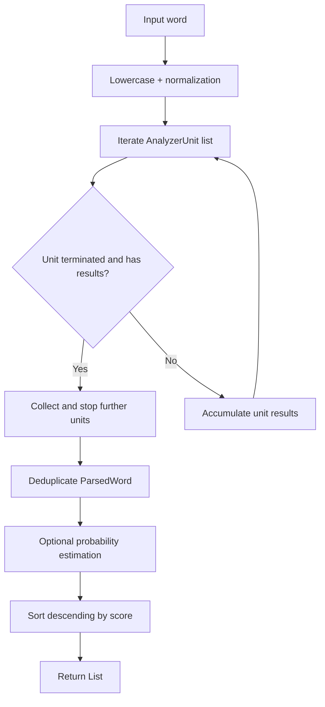
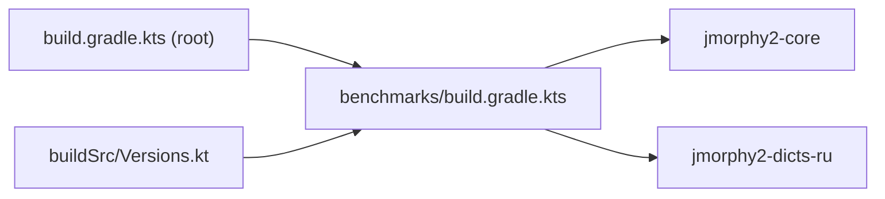

# Performance and Benchmarking

<cite>
**Referenced Files in This Document**
- [MorphAnalyzerBenchmarks.kt](file://benchmarks/src/jmh/kotlin/company/evo/jmorphy2/MorphAnalyzerBenchmarks.kt)
- [CachingMorphAnalyzer.java](file://jmorphy2-elasticsearch/src/main/java/company/evo/jmorphy2/elasticsearch/indices/CachingMorphAnalyzer.java)
- [MorphAnalyzer.java](file://jmorphy2-core/src/main/java/company/evo/jmorphy2/MorphAnalyzer.java)
- [AnalyzerUnit.java](file://jmorphy2-core/src/main/java/company/evo/jmorphy2/units/AnalyzerUnit.java)
- [DictionaryUnit.java](file://jmorphy2-core/src/main/java/company/evo/jmorphy2/units/DictionaryUnit.java)
- [DAWG.java](file://dawg/src/main/java/company/evo/dawg/DAWG.java)
- [PayloadsDAWG.java](file://dawg/src/main/java/company/evo/dawg/PayloadsDAWG.java)
- [WordsDAWG.java](file://jmorphy2-core/src/main/java/company/evo/jmorphy2/WordsDAWG.java)
- [SuffixesDAWG.java](file://jmorphy2-core/src/main/java/company/evo/jmorphy2/SuffixesDAWG.java)
- [build.gradle.kts (benchmarks)](file://benchmarks/build.gradle.kts)
- [build.gradle.kts (root)](file://build.gradle.kts)
- [Versions.kt](file://buildSrc/src/main/kotlin/Versions.kt)
- [Jmorphy2TestsHelpers.java](file://jmorphy2-core/src/test/java/company/evo/jmorphy2/Jmorphy2TestsHelpers.java)
</cite>

## Table of Contents
1. [Introduction](#introduction)
2. [Project Structure](#project-structure)
3. [Core Components](#core-components)
4. [Architecture Overview](#architecture-overview)
5. [Detailed Component Analysis](#detailed-component-analysis)
6. [Dependency Analysis](#dependency-analysis)
7. [Performance Considerations](#performance-considerations)
8. [Troubleshooting Guide](#troubleshooting-guide)
9. [Conclusion](#conclusion)
10. [Appendices](#appendices)

## Introduction
This document focuses on performance optimization and benchmarking in Jmorphy2, with an emphasis on maximizing Jmorphy2 efficiency. It explains the JMH-based benchmark suite that measures analysis throughput and memory usage patterns, documents caching strategies via the CachingMorphAnalyzer implementation, details memory optimization techniques using DAWG structures and compact data representations, and provides guidance on configuration tuning, profiling, scalability, production monitoring, and troubleshooting.

## Project Structure
The performance-relevant parts of the codebase are organized into:
- Benchmarks module with JMH tests for throughput measurement
- Core morphological analyzer and analyzer units
- DAWG dictionary structures for compressed lookup and similarity queries
- Elasticsearch integration with a caching wrapper around the analyzer
- Build configuration enabling JMH and Java 17 toolchain

**Diagram sources**
- [MorphAnalyzerBenchmarks.kt:1-44](file://benchmarks/src/jmh/kotlin/company/evo/jmorphy2/MorphAnalyzerBenchmarks.kt#L1-L44)
- [CachingMorphAnalyzer.java:1-64](file://jmorphy2-elasticsearch/src/main/java/company/evo/jmorphy2/elasticsearch/indices/CachingMorphAnalyzer.java#L1-L64)
- [MorphAnalyzer.java:1-247](file://jmorphy2-core/src/main/java/company/evo/jmorphy2/MorphAnalyzer.java#L1-L247)
- [AnalyzerUnit.java:1-72](file://jmorphy2-core/src/main/java/company/evo/jmorphy2/units/AnalyzerUnit.java#L1-L72)
- [DictionaryUnit.java:1-104](file://jmorphy2-core/src/main/java/company/evo/jmorphy2/units/DictionaryUnit.java#L1-L104)
- [DAWG.java:1-40](file://dawg/src/main/java/company/evo/dawg/DAWG.java#L1-L40)
- [PayloadsDAWG.java:1-242](file://dawg/src/main/java/company/evo/dawg/PayloadsDAWG.java#L1-L242)
- [WordsDAWG.java:1-57](file://jmorphy2-core/src/main/java/company/evo/jmorphy2/WordsDAWG.java#L1-L57)
- [SuffixesDAWG.java:1-61](file://jmorphy2-core/src/main/java/company/evo/jmorphy2/SuffixesDAWG.java#L1-L61)
- [build.gradle.kts (benchmarks):1-19](file://benchmarks/build.gradle.kts#L1-L19)
- [build.gradle.kts (root):1-21](file://build.gradle.kts#L1-L21)
- [Versions.kt:1-45](file://buildSrc/src/main/kotlin/Versions.kt#L1-L45)

**Section sources**
- [build.gradle.kts (benchmarks):1-19](file://benchmarks/build.gradle.kts#L1-L19)
- [build.gradle.kts (root):1-21](file://build.gradle.kts#L1-L21)
- [Versions.kt:35-45](file://buildSrc/src/main/kotlin/Versions.kt#L35-L45)

## Core Components
- MorphAnalyzer: orchestrates parsing by delegating to AnalyzerUnit instances; applies deduplication, optional probability estimation, and sorting.
- AnalyzerUnit and DictionaryUnit: provide specialized parsing strategies; DictionaryUnit leverages DAWG-backed word/suffix similarity.
- DAWG and PayloadsDAWG: compressed trie structures supporting prefix enumeration and “similar” queries with payloads.
- CachingMorphAnalyzer: wraps MorphAnalyzer with a Caffeine cache keyed by input word to reduce repeated analysis overhead.
- Benchmarks: JMH suite that parses a large vocabulary set and consumes results to avoid dead-code elimination.

**Section sources**
- [MorphAnalyzer.java:15-247](file://jmorphy2-core/src/main/java/company/evo/jmorphy2/MorphAnalyzer.java#L15-L247)
- [AnalyzerUnit.java:11-72](file://jmorphy2-core/src/main/java/company/evo/jmorphy2/units/AnalyzerUnit.java#L11-L72)
- [DictionaryUnit.java:14-104](file://jmorphy2-core/src/main/java/company/evo/jmorphy2/units/DictionaryUnit.java#L14-L104)
- [DAWG.java:13-40](file://dawg/src/main/java/company/evo/dawg/DAWG.java#L13-L40)
- [PayloadsDAWG.java:14-242](file://dawg/src/main/java/company/evo/dawg/PayloadsDAWG.java#L14-L242)
- [WordsDAWG.java:13-57](file://jmorphy2-core/src/main/java/company/evo/jmorphy2/WordsDAWG.java#L13-L57)
- [SuffixesDAWG.java:13-61](file://jmorphy2-core/src/main/java/company/evo/jmorphy2/SuffixesDAWG.java#L13-L61)
- [CachingMorphAnalyzer.java:19-64](file://jmorphy2-elasticsearch/src/main/java/company/evo/jmorphy2/elasticsearch/indices/CachingMorphAnalyzer.java#L19-L64)
- [MorphAnalyzerBenchmarks.kt:8-44](file://benchmarks/src/jmh/kotlin/company/evo/jmorphy2/MorphAnalyzerBenchmarks.kt#L8-L44)

## Architecture Overview
The analyzer pipeline composes multiple AnalyzerUnit strategies. The DictionaryUnit uses DAWG structures to efficiently match words and compute normal forms. A caching layer can be applied at the Elasticsearch integration level to amortize repeated parse costs.

**Diagram sources**
- [MorphAnalyzerBenchmarks.kt:35-42](file://benchmarks/src/jmh/kotlin/company/evo/jmorphy2/MorphAnalyzerBenchmarks.kt#L35-L42)
- [MorphAnalyzer.java:178-200](file://jmorphy2-core/src/main/java/company/evo/jmorphy2/MorphAnalyzer.java#L178-L200)
- [DictionaryUnit.java:56-65](file://jmorphy2-core/src/main/java/company/evo/jmorphy2/units/DictionaryUnit.java#L56-L65)
- [WordsDAWG.java:25-31](file://jmorphy2-core/src/main/java/company/evo/jmorphy2/WordsDAWG.java#L25-L31)
- [PayloadsDAWG.java:42-93](file://dawg/src/main/java/company/evo/dawg/PayloadsDAWG.java#L42-L93)

## Detailed Component Analysis

### JMH Benchmark Suite
- Purpose: measure throughput of morphological parsing over a large vocabulary loaded from a frequency corpus.
- Execution model: JMH @Benchmark method iterates over preloaded words and consumes results via Blackhole to prevent dead-code elimination.
- Configuration: controlled via Gradle jmh extension settings (forks, warmup, iterations, time-on-iteration).

**Diagram sources**
- [MorphAnalyzerBenchmarks.kt:16-31](file://benchmarks/src/jmh/kotlin/company/evo/jmorphy2/MorphAnalyzerBenchmarks.kt#L16-L31)
- [MorphAnalyzerBenchmarks.kt:35-42](file://benchmarks/src/jmh/kotlin/company/evo/jmorphy2/MorphAnalyzerBenchmarks.kt#L35-L42)

**Section sources**
- [MorphAnalyzerBenchmarks.kt:8-44](file://benchmarks/src/jmh/kotlin/company/evo/jmorphy2/MorphAnalyzerBenchmarks.kt#L8-L44)
- [build.gradle.kts (benchmarks):12-18](file://benchmarks/build.gradle.kts#L12-L18)
- [Jmorphy2TestsHelpers.java:6-20](file://jmorphy2-core/src/test/java/company/evo/jmorphy2/Jmorphy2TestsHelpers.java#L6-L20)

### Caching Strategy: CachingMorphAnalyzer
- Implements a builder pattern with a cacheSize option; when cacheSize > 0, wraps the underlying parse method with a Caffeine LoadingCache keyed by word.
- Uses privileged action to construct the cache under special permissions typical in Elasticsearch contexts.
- Reduces repeated computation for identical inputs by reusing prior parse results.

**Diagram sources**
- [CachingMorphAnalyzer.java:19-64](file://jmorphy2-elasticsearch/src/main/java/company/evo/jmorphy2/elasticsearch/indices/CachingMorphAnalyzer.java#L19-L64)
- [MorphAnalyzer.java:15-247](file://jmorphy2-core/src/main/java/company/evo/jmorphy2/MorphAnalyzer.java#L15-L247)

**Section sources**
- [CachingMorphAnalyzer.java:22-40](file://jmorphy2-elasticsearch/src/main/java/company/evo/jmorphy2/elasticsearch/indices/CachingMorphAnalyzer.java#L22-L40)
- [CachingMorphAnalyzer.java:42-62](file://jmorphy2-elasticsearch/src/main/java/company/evo/jmorphy2/elasticsearch/indices/CachingMorphAnalyzer.java#L42-L62)

### Memory Optimization with DAWG Structures
- DAWG: compressed trie supporting fast prefix traversal and existence checks.
- PayloadsDAWG: extends DAWG to support “similar” queries returning payloads; uses a Guide table and Completer stack-based traversal to enumerate keys with payloads.
- WordsDAWG and SuffixesDAWG: decode payloads into compact forms (short fields) for word paradigms and suffix counts, minimizing per-entry storage overhead.
- These structures enable efficient dictionary lookups and similarity queries with reduced memory footprint compared to naive maps or lists.

**Diagram sources**
- [DAWG.java:13-40](file://dawg/src/main/java/company/evo/dawg/DAWG.java#L13-L40)
- [PayloadsDAWG.java:14-242](file://dawg/src/main/java/company/evo/dawg/PayloadsDAWG.java#L14-L242)
- [WordsDAWG.java:13-57](file://jmorphy2-core/src/main/java/company/evo/jmorphy2/WordsDAWG.java#L13-L57)
- [SuffixesDAWG.java:13-61](file://jmorphy2-core/src/main/java/company/evo/jmorphy2/SuffixesDAWG.java#L13-L61)

**Section sources**
- [DAWG.java:17-20](file://dawg/src/main/java/company/evo/dawg/DAWG.java#L17-L20)
- [PayloadsDAWG.java:19-22](file://dawg/src/main/java/company/evo/dawg/PayloadsDAWG.java#L19-L22)
- [PayloadsDAWG.java:108-119](file://dawg/src/main/java/company/evo/dawg/PayloadsDAWG.java#L108-L119)
- [PayloadsDAWG.java:137-184](file://dawg/src/main/java/company/evo/dawg/PayloadsDAWG.java#L137-L184)
- [WordsDAWG.java:18-23](file://jmorphy2-core/src/main/java/company/evo/jmorphy2/WordsDAWG.java#L18-L23)
- [SuffixesDAWG.java:18-24](file://jmorphy2-core/src/main/java/company/evo/jmorphy2/SuffixesDAWG.java#L18-L24)

### Analyzer Pipeline and Unit Composition
- MorphAnalyzer.parse orchestrates AnalyzerUnit instances, deduplicates results, optionally estimates probabilities, and sorts by score.
- AnalyzerUnit.Builder caches built units to avoid repeated construction overhead across invocations.
- DictionaryUnit integrates DAWG-based similarity to produce candidate analyses efficiently.

**Diagram sources**
- [MorphAnalyzer.java:178-200](file://jmorphy2-core/src/main/java/company/evo/jmorphy2/MorphAnalyzer.java#L178-L200)
- [MorphAnalyzer.java:202-232](file://jmorphy2-core/src/main/java/company/evo/jmorphy2/MorphAnalyzer.java#L202-L232)
- [MorphAnalyzer.java:234-245](file://jmorphy2-core/src/main/java/company/evo/jmorphy2/MorphAnalyzer.java#L234-L245)
- [AnalyzerUnit.java:28-34](file://jmorphy2-core/src/main/java/company/evo/jmorphy2/units/AnalyzerUnit.java#L28-L34)
- [DictionaryUnit.java:57-65](file://jmorphy2-core/src/main/java/company/evo/jmorphy2/units/DictionaryUnit.java#L57-L65)

**Section sources**
- [MorphAnalyzer.java:178-200](file://jmorphy2-core/src/main/java/company/evo/jmorphy2/MorphAnalyzer.java#L178-L200)
- [AnalyzerUnit.java:28-34](file://jmorphy2-core/src/main/java/company/evo/jmorphy2/units/AnalyzerUnit.java#L28-L34)
- [DictionaryUnit.java:57-65](file://jmorphy2-core/src/main/java/company/evo/jmorphy2/units/DictionaryUnit.java#L57-L65)

## Dependency Analysis
- Benchmarks depend on jmorphy2-core and dictionaries; JMH plugin is configured via Gradle.
- Root build excludes Benchmark tests from regular test tasks.
- Versions pin Java 17 and JMH Gradle plugin version.

**Diagram sources**
- [build.gradle.kts (benchmarks):6-10](file://benchmarks/build.gradle.kts#L6-L10)
- [build.gradle.kts (root):12-14](file://build.gradle.kts#L12-L14)
- [Versions.kt:35-45](file://buildSrc/src/main/kotlin/Versions.kt#L35-L45)

**Section sources**
- [build.gradle.kts (benchmarks):1-19](file://benchmarks/build.gradle.kts#L1-L19)
- [build.gradle.kts (root):12-14](file://build.gradle.kts#L12-L14)
- [Versions.kt:35-45](file://buildSrc/src/main/kotlin/Versions.kt#L35-L45)

## Performance Considerations
- Throughput measurement
  - Use the JMH benchmark to assess parsing throughput on realistic vocabularies. Adjust warmup, forks, and iteration durations via the JMH Gradle configuration to stabilize measurements.
  - Example configuration keys: fork, warmup, warmupIterations, timeOnIteration, iterations.
  - Reference: [build.gradle.kts (benchmarks):12-18](file://benchmarks/build.gradle.kts#L12-L18)

- Caching
  - Enable CachingMorphAnalyzer with a positive cacheSize to reduce repeated parse workloads. The cache is keyed by the input word and built under privileged access suitable for Elasticsearch.
  - Reference: [CachingMorphAnalyzer.java:22-40](file://jmorphy2-elasticsearch/src/main/java/company/evo/jmorphy2/elasticsearch/indices/CachingMorphAnalyzer.java#L22-L40), [CachingMorphAnalyzer.java:51-56](file://jmorphy2-elasticsearch/src/main/java/company/evo/jmorphy2/elasticsearch/indices/CachingMorphAnalyzer.java#L51-L56)

- Memory optimization
  - DAWG structures minimize memory usage by sharing edges and storing payloads efficiently. PayloadsDAWG uses a guide table and a compact traversal mechanism to enumerate similar keys with minimal allocations.
  - WordsDAWG and SuffixesDAWG decode payloads into short fields, reducing per-entry overhead.
  - References: [PayloadsDAWG.java:108-119](file://dawg/src/main/java/company/evo/dawg/PayloadsDAWG.java#L108-L119), [WordsDAWG.java:18-23](file://jmorphy2-core/src/main/java/company/evo/jmorphy2/WordsDAWG.java#L18-L23), [SuffixesDAWG.java:18-24](file://jmorphy2-core/src/main/java/company/evo/jmorphy2/SuffixesDAWG.java#L18-L24)

- Analyzer pipeline efficiency
  - Deduplication and scoring occur after collecting results from all units; probability estimation is optional and only active when dictionary metadata indicates it is enabled.
  - References: [MorphAnalyzer.java:196-200](file://jmorphy2-core/src/main/java/company/evo/jmorphy2/MorphAnalyzer.java#L196-L200), [MorphAnalyzer.java:202-232](file://jmorphy2-core/src/main/java/company/evo/jmorphy2/MorphAnalyzer.java#L202-L232)

- Configuration options
  - Cache size: set via CachingMorphAnalyzer.Builder.cacheSize.
  - Character substitutions: passed to MorphAnalyzer.Builder and DictionaryUnit to improve matching robustness.
  - References: [CachingMorphAnalyzer.java:22-28](file://jmorphy2-elasticsearch/src/main/java/company/evo/jmorphy2/elasticsearch/indices/CachingMorphAnalyzer.java#L22-L28), [MorphAnalyzer.java:47-50](file://jmorphy2-core/src/main/java/company/evo/jmorphy2/MorphAnalyzer.java#L47-L50), [DictionaryUnit.java:39-43](file://jmorphy2-core/src/main/java/company/evo/jmorphy2/units/DictionaryUnit.java#L39-L43)

- Profiling techniques
  - Use JMH to measure throughput and identify hotspots in the pipeline.
  - Profile memory by instrumenting cache hit rates and dictionary traversal costs; leverage Blackhole consumption to avoid JIT optimizations masking real cost.
  - References: [MorphAnalyzerBenchmarks.kt:35-42](file://benchmarks/src/jmh/kotlin/company/evo/jmorphy2/MorphAnalyzerBenchmarks.kt#L35-L42)

- Scalability
  - Increase cache capacity for sustained high-throughput workloads.
  - Pre-warm caches during initialization to smooth latency spikes.
  - Tune JMH parameters to reflect production load characteristics.

- Production monitoring
  - Track cache hit ratio and eviction rate to detect saturation or misconfiguration.
  - Monitor parse latency distributions and throughput under varying loads.
  - Validate dictionary payload decoding performance for large lexicons.

- Best practices
  - Prefer caching in front of repeated workloads (e.g., batch processing).
  - Use character substitutions judiciously to balance recall and performance.
  - Keep analyzer units ordered so terminating units short-circuit early when applicable.

[No sources needed since this section provides general guidance]

## Troubleshooting Guide
- Low throughput in benchmarks
  - Verify JMH configuration parameters and ensure sufficient warmup and iterations.
  - Confirm the benchmark consumes results via Blackhole to avoid dead-code elimination.
  - References: [build.gradle.kts (benchmarks):12-18](file://benchmarks/build.gradle.kts#L12-L18), [MorphAnalyzerBenchmarks.kt:35-42](file://benchmarks/src/jmh/kotlin/company/evo/jmorphy2/MorphAnalyzerBenchmarks.kt#L35-L42)

- Cache not taking effect
  - Ensure cacheSize > 0 is set in the builder; otherwise, the base MorphAnalyzer is returned.
  - Confirm the privileged cache creation path is executed in the runtime environment.
  - References: [CachingMorphAnalyzer.java:32-39](file://jmorphy2-elasticsearch/src/main/java/company/evo/jmorphy2/elasticsearch/indices/CachingMorphAnalyzer.java#L32-L39), [CachingMorphAnalyzer.java:51-56](file://jmorphy2-elasticsearch/src/main/java/company/evo/jmorphy2/elasticsearch/indices/CachingMorphAnalyzer.java#L51-L56)

- Excessive memory usage
  - Reduce cache size or enable eviction policies if necessary.
  - Validate DAWG payload decoding and traversal are not causing excessive allocations.
  - References: [PayloadsDAWG.java:137-184](file://dawg/src/main/java/company/evo/dawg/PayloadsDAWG.java#L137-L184), [WordsDAWG.java:18-23](file://jmorphy2-core/src/main/java/company/evo/jmorphy2/WordsDAWG.java#L18-L23)

- Unexpected parsing results
  - Check character substitution maps and ensure they align with the language-specific configuration.
  - References: [MorphAnalyzer.java:47-50](file://jmorphy2-core/src/main/java/company/evo/jmorphy2/MorphAnalyzer.java#L47-L50), [DictionaryUnit.java:39-43](file://jmorphy2-core/src/main/java/company/evo/jmorphy2/units/DictionaryUnit.java#L39-L43)

**Section sources**
- [build.gradle.kts (benchmarks):12-18](file://benchmarks/build.gradle.kts#L12-L18)
- [MorphAnalyzerBenchmarks.kt:35-42](file://benchmarks/src/jmh/kotlin/company/evo/jmorphy2/MorphAnalyzerBenchmarks.kt#L35-L42)
- [CachingMorphAnalyzer.java:32-39](file://jmorphy2-elasticsearch/src/main/java/company/evo/jmorphy2/elasticsearch/indices/CachingMorphAnalyzer.java#L32-L39)
- [PayloadsDAWG.java:137-184](file://dawg/src/main/java/company/evo/dawg/PayloadsDAWG.java#L137-L184)
- [MorphAnalyzer.java:47-50](file://jmorphy2-core/src/main/java/company/evo/jmorphy2/MorphAnalyzer.java#L47-L50)

## Conclusion
Jmorphy2’s performance profile benefits from a combination of efficient dictionary structures (DAWG), a modular analyzer pipeline, and a practical caching layer. The JMH benchmark suite provides a reliable way to measure throughput, while CachingMorphAnalyzer reduces repeated analysis overhead. Memory efficiency is achieved through compact DAWG payloads and short-field encodings. Tuning cache sizes, character substitutions, and JMH parameters enables scalable, production-ready deployments across diverse workloads.

[No sources needed since this section summarizes without analyzing specific files]

## Appendices
- Benchmark execution tips
  - Run with multiple forks and iterations to stabilize timing.
  - Use realistic input corpora and vary vocabulary sizes to simulate production conditions.
  - References: [build.gradle.kts (benchmarks):12-18](file://benchmarks/build.gradle.kts#L12-L18)

- Toolchain and versions
  - Java 17 compatibility and JMH Gradle plugin version are defined centrally.
  - References: [Versions.kt:35-45](file://buildSrc/src/main/kotlin/Versions.kt#L35-L45)

**Section sources**
- [build.gradle.kts (benchmarks):12-18](file://benchmarks/build.gradle.kts#L12-L18)
- [Versions.kt:35-45](file://buildSrc/src/main/kotlin/Versions.kt#L35-L45)