# Analyzer Units

<cite>
**Referenced Files in This Document**
- [AnalyzerUnit.java](file://jmorphy2-core/src/main/java/company/evo/jmorphy2/units/AnalyzerUnit.java)
- [RegexUnit.java](file://jmorphy2-core/src/main/java/company/evo/jmorphy2/units/RegexUnit.java)
- [PrefixedUnit.java](file://jmorphy2-core/src/main/java/company/evo/jmorphy2/units/PrefixedUnit.java)
- [DictionaryUnit.java](file://jmorphy2-core/src/main/java/company/evo/jmorphy2/units/DictionaryUnit.java)
- [NumberUnit.java](file://jmorphy2-core/src/main/java/company/evo/jmorphy2/units/NumberUnit.java)
- [PunctuationUnit.java](file://jmorphy2-core/src/main/java/company/evo/jmorphy2/units/PunctuationUnit.java)
- [LatinUnit.java](file://jmorphy2-core/src/main/java/company/evo/jmorphy2/units/LatinUnit.java)
- [RomanUnit.java](file://jmorphy2-core/src/main/java/company/evo/jmorphy2/units/RomanUnit.java)
- [UnknownUnit.java](file://jmorphy2-core/src/main/java/company/evo/jmorphy2/units/UnknownUnit.java)
- [KnownPrefixUnit.java](file://jmorphy2-core/src/main/java/company/evo/jmorphy2/units/KnownPrefixUnit.java)
- [UnknownPrefixUnit.java](file://jmorphy2-core/src/main/java/company/evo/jmorphy2/units/UnknownPrefixUnit.java)
- [KnownSuffixUnit.java](file://jmorphy2-core/src/main/java/company/evo/jmorphy2/units/KnownSuffixUnit.java)
- [MorphAnalyzer.java](file://jmorphy2-core/src/main/java/company/evo/jmorphy2/MorphAnalyzer.java)
- [ParsedWord.java](file://jmorphy2-core/src/main/java/company/evo/jmorphy2/ParsedWord.java)
</cite>

## Table of Contents
1. [Introduction](#introduction)
2. [Project Structure](#project-structure)
3. [Core Components](#core-components)
4. [Architecture Overview](#architecture-overview)
5. [Detailed Component Analysis](#detailed-component-analysis)
6. [Dependency Analysis](#dependency-analysis)
7. [Performance Considerations](#performance-considerations)
8. [Troubleshooting Guide](#troubleshooting-guide)
9. [Conclusion](#conclusion)

## Introduction
This document explains the Analyzer Units subsystem that implements a pipeline pattern for processing different word types. It covers the AnalyzerUnit base class and its role as the foundation for specialized processing units, documents each specialized unit (DictionaryUnit, NumberUnit, PunctuationUnit, LatinUnit, UnknownUnit), and details the pipeline execution order and termination mechanism. It also documents the builder pattern used to create and configure analyzer units, including priority settings via termination flags and confidence scores. Finally, it explains specialized units for known and unknown prefixes/suffixes and their role in handling complex morphological patterns.

## Project Structure
The Analyzer Units live under the units package and integrate with the main MorphAnalyzer pipeline. The core files are:
- Base abstractions: AnalyzerUnit, RegexUnit, PrefixedUnit
- Specialized units: DictionaryUnit, NumberUnit, PunctuationUnit, LatinUnit, RomanUnit, UnknownUnit
- Prefix/suffix handling: KnownPrefixUnit, UnknownPrefixUnit, KnownSuffixUnit
- Pipeline orchestration: MorphAnalyzer
- Result representation: ParsedWord

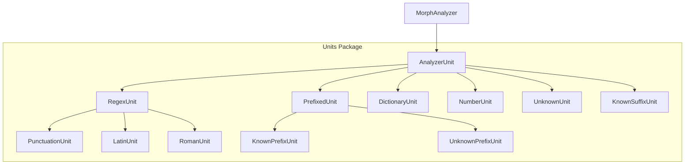

**Diagram sources**
- [MorphAnalyzer.java:15-125](file://jmorphy2-core/src/main/java/company/evo/jmorphy2/MorphAnalyzer.java#L15-L125)
- [AnalyzerUnit.java:11-46](file://jmorphy2-core/src/main/java/company/evo/jmorphy2/units/AnalyzerUnit.java#L11-L46)
- [RegexUnit.java:11-30](file://jmorphy2-core/src/main/java/company/evo/jmorphy2/units/RegexUnit.java#L11-L30)
- [PrefixedUnit.java:10-54](file://jmorphy2-core/src/main/java/company/evo/jmorphy2/units/PrefixedUnit.java#L10-L54)
- [DictionaryUnit.java:14-103](file://jmorphy2-core/src/main/java/company/evo/jmorphy2/units/DictionaryUnit.java#L14-L103)
- [NumberUnit.java:10-53](file://jmorphy2-core/src/main/java/company/evo/jmorphy2/units/NumberUnit.java#L10-L53)
- [PunctuationUnit.java:8-27](file://jmorphy2-core/src/main/java/company/evo/jmorphy2/units/PunctuationUnit.java#L8-L27)
- [LatinUnit.java:8-27](file://jmorphy2-core/src/main/java/company/evo/jmorphy2/units/LatinUnit.java#L8-L27)
- [RomanUnit.java:8-31](file://jmorphy2-core/src/main/java/company/evo/jmorphy2/units/RomanUnit.java#L8-L31)
- [UnknownUnit.java:9-33](file://jmorphy2-core/src/main/java/company/evo/jmorphy2/units/UnknownUnit.java#L9-L33)
- [KnownPrefixUnit.java:12-74](file://jmorphy2-core/src/main/java/company/evo/jmorphy2/units/KnownPrefixUnit.java#L12-L74)
- [UnknownPrefixUnit.java:11-74](file://jmorphy2-core/src/main/java/company/evo/jmorphy2/units/UnknownPrefixUnit.java#L11-L74)
- [KnownSuffixUnit.java:17-179](file://jmorphy2-core/src/main/java/company/evo/jmorphy2/units/KnownSuffixUnit.java#L17-L179)

**Section sources**
- [MorphAnalyzer.java:15-125](file://jmorphy2-core/src/main/java/company/evo/jmorphy2/MorphAnalyzer.java#L15-L125)

## Core Components
- AnalyzerUnit: Abstract base for all analyzers. Provides:
  - Termination flag to signal early pipeline exit when results are produced
  - Confidence score to weight results
  - Inner Builder class implementing the builder pattern with caching
  - Inner AnalyzerParsedWord wrapper for result construction and lexeme retrieval
- RegexUnit: Base for regex-based analyzers. Applies a compiled pattern and tags matches with a grammeme tag string.
- PrefixedUnit: Base for prefix-handling analyzers. Wraps another unit and augments results with prefixes while preserving productivity checks.

These components form the foundation for specialized units that handle dictionary lookup, numbers, punctuation, Latin text, Roman numerals, unknown tokens, and morphological affixes.

**Section sources**
- [AnalyzerUnit.java:11-71](file://jmorphy2-core/src/main/java/company/evo/jmorphy2/units/AnalyzerUnit.java#L11-L71)
- [RegexUnit.java:11-30](file://jmorphy2-core/src/main/java/company/evo/jmorphy2/units/RegexUnit.java#L11-L30)
- [PrefixedUnit.java:10-54](file://jmorphy2-core/src/main/java/company/evo/jmorphy2/units/PrefixedUnit.java#L10-L54)

## Architecture Overview
The pipeline is orchestrated by MorphAnalyzer. It builds a list of AnalyzerUnit instances in a specific order and executes them sequentially on each input word. Each unit returns either null (no match) or a list of ParsedWord results. If a unit has the terminate flag set and produced results, the pipeline stops further processing for that word. After collecting results from all units, duplicates are removed, optional probability estimation is applied, and results are sorted by score.

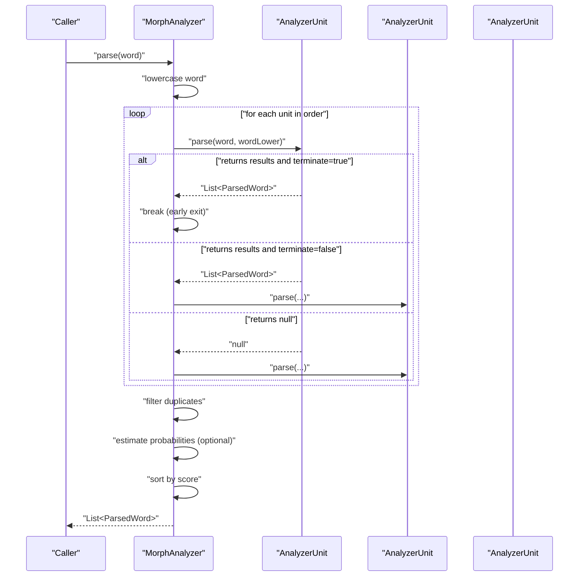

**Diagram sources**
- [MorphAnalyzer.java:178-200](file://jmorphy2-core/src/main/java/company/evo/jmorphy2/MorphAnalyzer.java#L178-L200)
- [AnalyzerUnit.java:42-44](file://jmorphy2-core/src/main/java/company/evo/jmorphy2/units/AnalyzerUnit.java#L42-L44)

**Section sources**
- [MorphAnalyzer.java:178-200](file://jmorphy2-core/src/main/java/company/evo/jmorphy2/MorphAnalyzer.java#L178-L200)

## Detailed Component Analysis

### AnalyzerUnit Base Class and Builder Pattern
- Purpose: Defines the contract for parsing and scoring, and provides a reusable builder infrastructure with caching.
- Key fields:
  - terminate: boolean flag indicating whether successful results should end the pipeline for the current word
  - score: float confidence score used to weight results
- Builder pattern:
  - Inner Builder caches the built unit instance
  - build(Tag.Storage) lazily constructs and returns the AnalyzerUnit
  - Subclasses override newAnalyzerUnit to create specialized instances
- Result wrapping:
  - AnalyzerParsedWord extends ParsedWord and provides rescore and lexeme behavior per unit

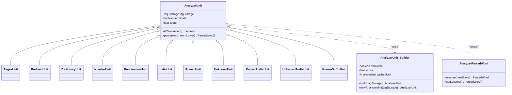

**Diagram sources**
- [AnalyzerUnit.java:11-71](file://jmorphy2-core/src/main/java/company/evo/jmorphy2/units/AnalyzerUnit.java#L11-L71)

**Section sources**
- [AnalyzerUnit.java:16-34](file://jmorphy2-core/src/main/java/company/evo/jmorphy2/units/AnalyzerUnit.java#L16-L34)
- [AnalyzerUnit.java:42-44](file://jmorphy2-core/src/main/java/company/evo/jmorphy2/units/AnalyzerUnit.java#L42-L44)
- [AnalyzerUnit.java:48-70](file://jmorphy2-core/src/main/java/company/evo/jmorphy2/units/AnalyzerUnit.java#L48-L70)

### DictionaryUnit
- Role: Recognized words via dictionary lookup with similarity and character substitution support.
- Behavior:
  - Uses Dictionary to find similar words and build tags and normal forms
  - Produces DictionaryParsedWord with lexeme expansion to all paradigm forms
- Configuration:
  - Builder accepts Dictionary.Builder and charSubstitutes map
  - Terminate and score configurable via base Builder

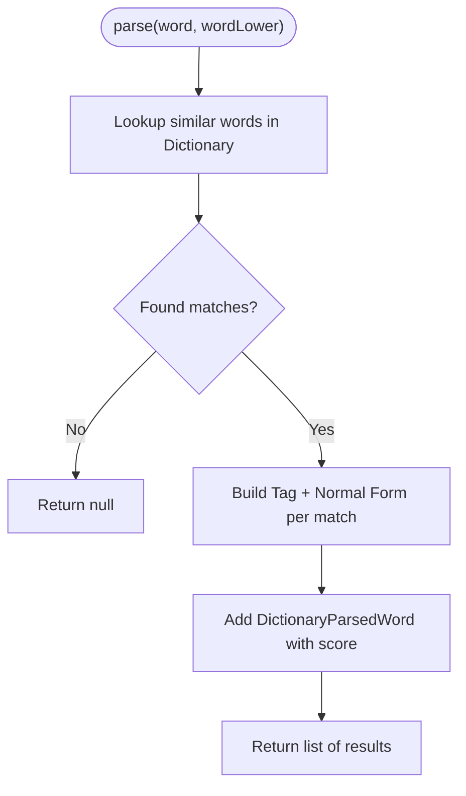

**Diagram sources**
- [DictionaryUnit.java:56-65](file://jmorphy2-core/src/main/java/company/evo/jmorphy2/units/DictionaryUnit.java#L56-L65)
- [DictionaryUnit.java:67-102](file://jmorphy2-core/src/main/java/company/evo/jmorphy2/units/DictionaryUnit.java#L67-L102)

**Section sources**
- [DictionaryUnit.java:14-26](file://jmorphy2-core/src/main/java/company/evo/jmorphy2/units/DictionaryUnit.java#L14-L26)
- [DictionaryUnit.java:56-65](file://jmorphy2-core/src/main/java/company/evo/jmorphy2/units/DictionaryUnit.java#L56-L65)
- [DictionaryUnit.java:67-102](file://jmorphy2-core/src/main/java/company/evo/jmorphy2/units/DictionaryUnit.java#L67-L102)

### NumberUnit
- Role: Numeric expressions (integer and real) with appropriate grammemes.
- Behavior:
  - Attempts to parse as integer; falls back to float; otherwise returns null
  - Tags with NUMB,intg or NUMB,real depending on parse outcome
- Configuration:
  - Builder registers required grammemes and tags during construction

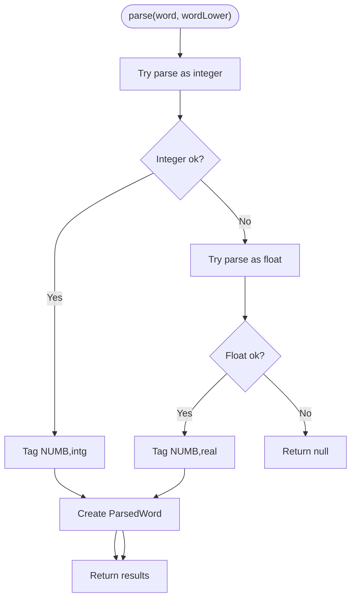

**Diagram sources**
- [NumberUnit.java:31-52](file://jmorphy2-core/src/main/java/company/evo/jmorphy2/units/NumberUnit.java#L31-L52)

**Section sources**
- [NumberUnit.java:10-29](file://jmorphy2-core/src/main/java/company/evo/jmorphy2/units/NumberUnit.java#L10-L29)
- [NumberUnit.java:31-52](file://jmorphy2-core/src/main/java/company/evo/jmorphy2/units/NumberUnit.java#L31-L52)

### PunctuationUnit
- Role: Punctuation marks identified by Unicode punctuation category.
- Behavior:
  - Inherits regex matching from RegexUnit with a punctuation pattern
  - Tags with PNCT grammeme
- Configuration:
  - Builder registers PNCT grammeme and tag

```mermaid
classDiagram
AnalyzerUnit <|-- RegexUnit
RegexUnit <|-- PunctuationUnit
PunctuationUnit : "Pattern : \\p{Punct}+"
PunctuationUnit : "Tag : PNCT"
```

**Diagram sources**
- [PunctuationUnit.java:8-27](file://jmorphy2-core/src/main/java/company/evo/jmorphy2/units/PunctuationUnit.java#L8-L27)
- [RegexUnit.java:11-30](file://jmorphy2-core/src/main/java/company/evo/jmorphy2/units/RegexUnit.java#L11-L30)

**Section sources**
- [PunctuationUnit.java:8-27](file://jmorphy2-core/src/main/java/company/evo/jmorphy2/units/PunctuationUnit.java#L8-L27)

### LatinUnit
- Role: Latin-script tokens including letters, digits, and punctuation.
- Behavior:
  - Regex-based tagging with LATN grammeme
- Configuration:
  - Builder registers LATN grammeme and tag

```mermaid
classDiagram
AnalyzerUnit <|-- RegexUnit
RegexUnit <|-- LatinUnit
LatinUnit : "Pattern : [\\p{IsLatin}\\d\\p{Punct}]+"
LatinUnit : "Tag : LATN"
```

**Diagram sources**
- [LatinUnit.java:8-27](file://jmorphy2-core/src/main/java/company/evo/jmorphy2/units/LatinUnit.java#L8-L27)
- [RegexUnit.java:11-30](file://jmorphy2-core/src/main/java/company/evo/jmorphy2/units/RegexUnit.java#L11-L30)

**Section sources**
- [LatinUnit.java:8-27](file://jmorphy2-core/src/main/java/company/evo/jmorphy2/units/LatinUnit.java#L8-L27)

### RomanUnit
- Role: Roman numerals using a strict regex pattern.
- Behavior:
  - Regex-based tagging with ROMN grammeme
- Configuration:
  - Builder registers ROMN grammeme and tag

```mermaid
classDiagram
AnalyzerUnit <|-- RegexUnit
RegexUnit <|-- RomanUnit
RomanUnit : "Pattern : MM{0,4}(CM|CD|D?C{0,3})(XC|XL|L?X{0,3})(IX|IV|V?I{0,3})"
RomanUnit : "Tag : ROMN"
```

**Diagram sources**
- [RomanUnit.java:8-31](file://jmorphy2-core/src/main/java/company/evo/jmorphy2/units/RomanUnit.java#L8-L31)
- [RegexUnit.java:11-30](file://jmorphy2-core/src/main/java/company/evo/jmorphy2/units/RegexUnit.java#L11-L30)

**Section sources**
- [RomanUnit.java:8-31](file://jmorphy2-core/src/main/java/company/evo/jmorphy2/units/RomanUnit.java#L8-L31)

### UnknownUnit
- Role: Unrecognized tokens tagged as unknown.
- Behavior:
  - Always returns a single ParsedWord tagged as UNKN
- Configuration:
  - Builder registers UNKN grammeme and tag

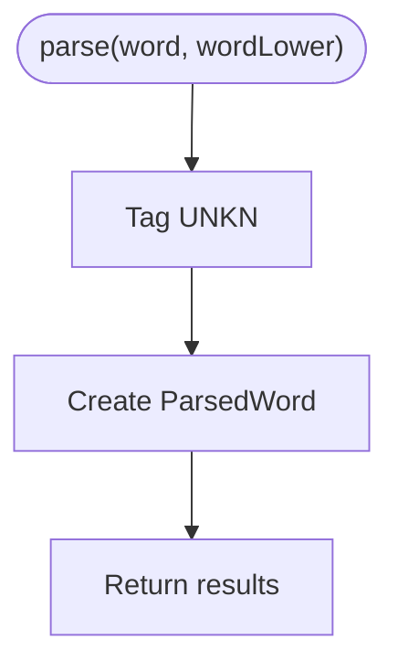

**Diagram sources**
- [UnknownUnit.java:27-33](file://jmorphy2-core/src/main/java/company/evo/jmorphy2/units/UnknownUnit.java#L27-L33)

**Section sources**
- [UnknownUnit.java:9-25](file://jmorphy2-core/src/main/java/company/evo/jmorphy2/units/UnknownUnit.java#L9-L25)
- [UnknownUnit.java:27-33](file://jmorphy2-core/src/main/java/company/evo/jmorphy2/units/UnknownUnit.java#L27-L33)

### Prefix Handling Units

#### PrefixedUnit (Base)
- Role: Decorator that augments results from a wrapped unit by prepending prefixes.
- Behavior:
  - Calls wrapped unit on the remainder after removing the prefix
  - Skips non-productive tags
  - Wraps results in PrefixedParsedWord

```mermaid
classDiagram
AnalyzerUnit <|-- PrefixedUnit
PrefixedUnit : "+unit : AnalyzerUnit"
PrefixedUnit : "parseWithPrefix(word, wordLower, prefix) List<ParsedWord>"
class PrefixedParsedWord {
-String prefix
-ParsedWord parsedWord
+rescore(newScore) ParsedWord
+getLexeme() List<ParsedWord>
}
PrefixedUnit --> PrefixedParsedWord : "creates"
```

**Diagram sources**
- [PrefixedUnit.java:10-54](file://jmorphy2-core/src/main/java/company/evo/jmorphy2/units/PrefixedUnit.java#L10-L54)

**Section sources**
- [PrefixedUnit.java:10-54](file://jmorphy2-core/src/main/java/company/evo/jmorphy2/units/PrefixedUnit.java#L10-L54)

#### KnownPrefixUnit
- Role: Applies known prefixes from a predefined set to dictionary results.
- Behavior:
  - Iterates candidate prefix lengths up to a minimum reminder threshold
  - Matches against known prefixes and delegates to parseWithPrefix
  - Uses the underlying dictionary unit for remainder parsing
- Configuration:
  - Builder accepts a set of known prefixes and minReminder

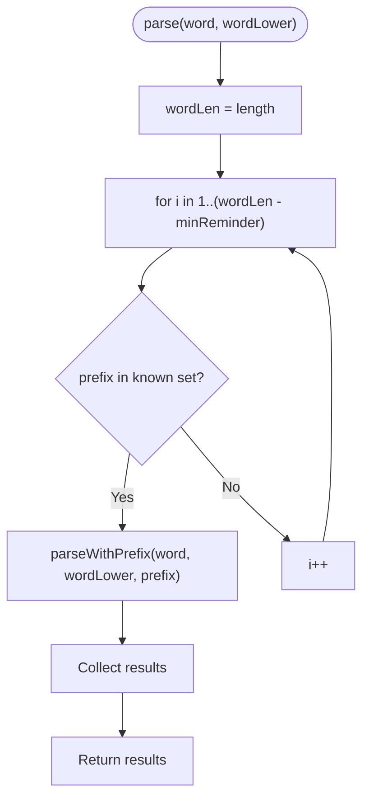

**Diagram sources**
- [KnownPrefixUnit.java:62-73](file://jmorphy2-core/src/main/java/company/evo/jmorphy2/units/KnownPrefixUnit.java#L62-L73)

**Section sources**
- [KnownPrefixUnit.java:12-27](file://jmorphy2-core/src/main/java/company/evo/jmorphy2/units/KnownPrefixUnit.java#L12-L27)
- [KnownPrefixUnit.java:29-60](file://jmorphy2-core/src/main/java/company/evo/jmorphy2/units/KnownPrefixUnit.java#L29-L60)
- [KnownPrefixUnit.java:62-73](file://jmorphy2-core/src/main/java/company/evo/jmorphy2/units/KnownPrefixUnit.java#L62-L73)

#### UnknownPrefixUnit
- Role: Brute-force prefix exploration up to a maximum length with a minimum remainder.
- Behavior:
  - Iterates prefixes up to maxPrefixLength and minReminder constraints
  - Delegates to parseWithPrefix for each candidate
- Configuration:
  - Builder accepts maxPrefixLength and minReminder

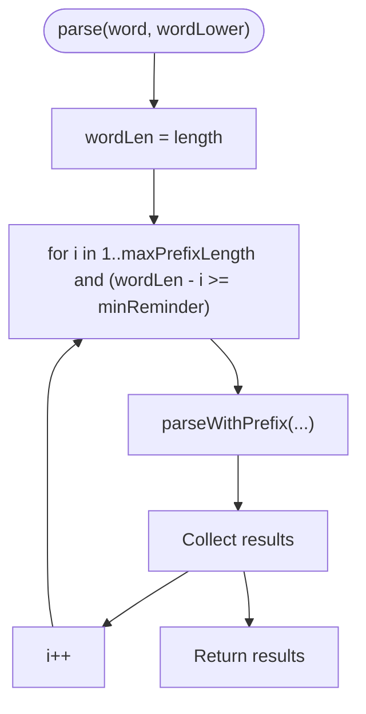

**Diagram sources**
- [UnknownPrefixUnit.java:64-73](file://jmorphy2-core/src/main/java/company/evo/jmorphy2/units/UnknownPrefixUnit.java#L64-L73)

**Section sources**
- [UnknownPrefixUnit.java:11-24](file://jmorphy2-core/src/main/java/company/evo/jmorphy2/units/UnknownPrefixUnit.java#L11-L24)
- [UnknownPrefixUnit.java:26-61](file://jmorphy2-core/src/main/java/company/evo/jmorphy2/units/UnknownPrefixUnit.java#L26-L61)
- [UnknownPrefixUnit.java:64-73](file://jmorphy2-core/src/main/java/company/evo/jmorphy2/units/UnknownPrefixUnit.java#L64-L73)

### Suffix Handling Unit

#### KnownSuffixUnit
- Role: Predicts word endings using dictionary suffix models and productive paradigms.
- Behavior:
  - Requires minimum word length and limits suffix length
  - Scans prefixes and suffixes, aggregates counts per paradigm prefix, and normalizes scores
  - Produces KnownSuffixParsedWord with lexeme expansion
- Configuration:
  - Builder accepts Dictionary.Builder, minWordLength, maxSuffixLength, charSubstitutes

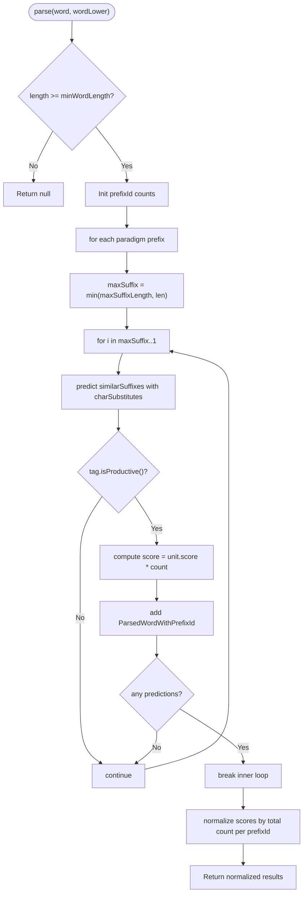

**Diagram sources**
- [KnownSuffixUnit.java:83-126](file://jmorphy2-core/src/main/java/company/evo/jmorphy2/units/KnownSuffixUnit.java#L83-L126)
- [KnownSuffixUnit.java:128-168](file://jmorphy2-core/src/main/java/company/evo/jmorphy2/units/KnownSuffixUnit.java#L128-L168)

**Section sources**
- [KnownSuffixUnit.java:17-35](file://jmorphy2-core/src/main/java/company/evo/jmorphy2/units/KnownSuffixUnit.java#L17-L35)
- [KnownSuffixUnit.java:37-81](file://jmorphy2-core/src/main/java/company/evo/jmorphy2/units/KnownSuffixUnit.java#L37-L81)
- [KnownSuffixUnit.java:83-126](file://jmorphy2-core/src/main/java/company/evo/jmorphy2/units/KnownSuffixUnit.java#L83-L126)
- [KnownSuffixUnit.java:128-168](file://jmorphy2-core/src/main/java/company/evo/jmorphy2/units/KnownSuffixUnit.java#L128-L168)

### Pipeline Execution Order and Termination
- Order in the default builder:
  1) DictionaryUnit (terminate=true, score=1.0f)
  2) NumberUnit (terminate=true, score=0.9f)
  3) PunctuationUnit (terminate=true, score=0.9f)
  4) RomanUnit (terminate=false, score=0.9f)
  5) LatinUnit (terminate=true, score=0.9f)
  6) KnownPrefixUnit (terminate=true, score=0.75f)
  7) UnknownPrefixUnit (terminate=true, score=0.5f)
  8) KnownSuffixUnit (terminate=true, score=0.5f)
  9) UnknownUnit (terminate=true, score=1.0f)
- Termination mechanism:
  - Each unit reports isTerminated()
  - If terminate is true and the unit returned results, the pipeline stops further units for that word
- Post-processing:
  - Duplicate ParsedWord entries are removed
  - Optional probability estimation adjusts scores
  - Results are sorted descending by score

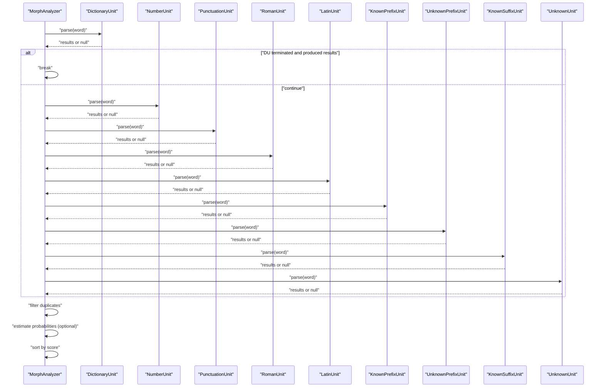

**Diagram sources**
- [MorphAnalyzer.java:67-81](file://jmorphy2-core/src/main/java/company/evo/jmorphy2/MorphAnalyzer.java#L67-L81)
- [MorphAnalyzer.java:178-200](file://jmorphy2-core/src/main/java/company/evo/jmorphy2/MorphAnalyzer.java#L178-L200)
- [AnalyzerUnit.java:42-44](file://jmorphy2-core/src/main/java/company/evo/jmorphy2/units/AnalyzerUnit.java#L42-L44)

**Section sources**
- [MorphAnalyzer.java:67-81](file://jmorphy2-core/src/main/java/company/evo/jmorphy2/MorphAnalyzer.java#L67-L81)
- [MorphAnalyzer.java:178-200](file://jmorphy2-core/src/main/java/company/evo/jmorphy2/MorphAnalyzer.java#L178-L200)

## Dependency Analysis
- AnalyzerUnit is the central abstraction; all specialized units inherit from it.
- RegexUnit inherits from AnalyzerUnit and provides regex-based matching.
- PrefixedUnit inherits from AnalyzerUnit and composes another AnalyzerUnit to delegate remainder parsing.
- DictionaryUnit depends on Dictionary and WordsDAWG for morphological forms.
- KnownSuffixUnit depends on Dictionary and SuffixesDAWG for suffix predictions.
- MorphAnalyzer composes a list of AnalyzerUnit builders, constructs them, and orchestrates the pipeline.

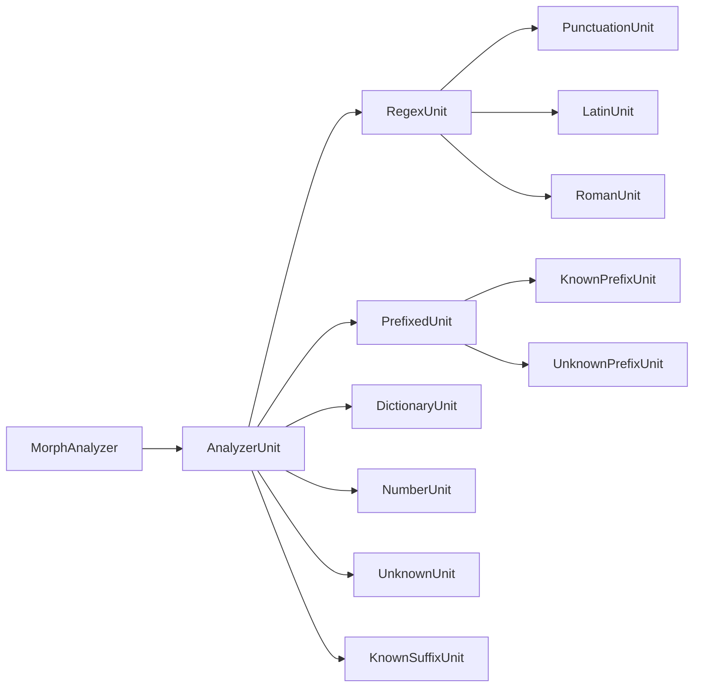

**Diagram sources**
- [AnalyzerUnit.java:11-46](file://jmorphy2-core/src/main/java/company/evo/jmorphy2/units/AnalyzerUnit.java#L11-L46)
- [RegexUnit.java:11-30](file://jmorphy2-core/src/main/java/company/evo/jmorphy2/units/RegexUnit.java#L11-L30)
- [PrefixedUnit.java:10-16](file://jmorphy2-core/src/main/java/company/evo/jmorphy2/units/PrefixedUnit.java#L10-L16)
- [DictionaryUnit.java:14-26](file://jmorphy2-core/src/main/java/company/evo/jmorphy2/units/DictionaryUnit.java#L14-L26)
- [NumberUnit.java:10-13](file://jmorphy2-core/src/main/java/company/evo/jmorphy2/units/NumberUnit.java#L10-L13)
- [PunctuationUnit.java:8-13](file://jmorphy2-core/src/main/java/company/evo/jmorphy2/units/PunctuationUnit.java#L8-L13)
- [LatinUnit.java:8-12](file://jmorphy2-core/src/main/java/company/evo/jmorphy2/units/LatinUnit.java#L8-L12)
- [RomanUnit.java:15-17](file://jmorphy2-core/src/main/java/company/evo/jmorphy2/units/RomanUnit.java#L15-L17)
- [UnknownUnit.java:9-12](file://jmorphy2-core/src/main/java/company/evo/jmorphy2/units/UnknownUnit.java#L9-L12)
- [KnownPrefixUnit.java:16-24](file://jmorphy2-core/src/main/java/company/evo/jmorphy2/units/KnownPrefixUnit.java#L16-L24)
- [UnknownPrefixUnit.java:15-22](file://jmorphy2-core/src/main/java/company/evo/jmorphy2/units/UnknownPrefixUnit.java#L15-L22)
- [KnownSuffixUnit.java:23-35](file://jmorphy2-core/src/main/java/company/evo/jmorphy2/units/KnownSuffixUnit.java#L23-L35)
- [MorphAnalyzer.java:15-17](file://jmorphy2-core/src/main/java/company/evo/jmorphy2/MorphAnalyzer.java#L15-L17)

**Section sources**
- [MorphAnalyzer.java:15-17](file://jmorphy2-core/src/main/java/company/evo/jmorphy2/MorphAnalyzer.java#L15-L17)

## Performance Considerations
- Termination flags short-circuit the pipeline when earlier units produce results, reducing unnecessary work.
- RegexUnit leverages compiled patterns for fast matching.
- DictionaryUnit uses efficient DAWG structures for similar word lookup and normal form/tag building.
- KnownSuffixUnit prunes non-productive paradigms and normalizes scores to avoid inflated confidence.
- PrefixedUnit delegates remainder parsing to the wrapped unit, avoiding redundant dictionary lookups.
- Probability estimation is optional and only applied when dictionary metadata indicates probabilistic training data is available.

[No sources needed since this section provides general guidance]

## Troubleshooting Guide
- Unexpected empty results:
  - Verify the unit order and termination flags. Earlier units with terminate=true may prevent downstream units from firing.
- Incorrect or missing tags:
  - Ensure the unit’s Builder registered the required grammemes and tags during construction.
- Poor confidence scores:
  - Adjust unit scores in the builder chain to reflect expected reliability.
- Prefix/suffix misanalysis:
  - Tune KnownPrefixUnit minReminder and UnknownPrefixUnit maxPrefixLength/minReminder.
  - For KnownSuffixUnit, adjust minWordLength and maxSuffixLength based on language characteristics.
- Duplicate results:
  - The pipeline filters duplicates; ensure ParsedWord equality semantics remain consistent.

**Section sources**
- [MorphAnalyzer.java:178-200](file://jmorphy2-core/src/main/java/company/evo/jmorphy2/MorphAnalyzer.java#L178-L200)
- [ParsedWord.java:56-87](file://jmorphy2-core/src/main/java/company/evo/jmorphy2/ParsedWord.java#L56-L87)

## Conclusion
The Analyzer Units subsystem provides a modular, extensible pipeline for morphological analysis. The AnalyzerUnit base class and its builder pattern enable consistent configuration of termination and scoring. Specialized units target distinct token types and morphological patterns, with KnownPrefixUnit, UnknownPrefixUnit, and KnownSuffixUnit enabling sophisticated affix handling. The pipeline’s termination mechanism and post-processing steps ensure efficient and accurate results.