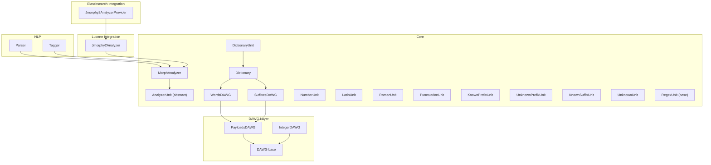
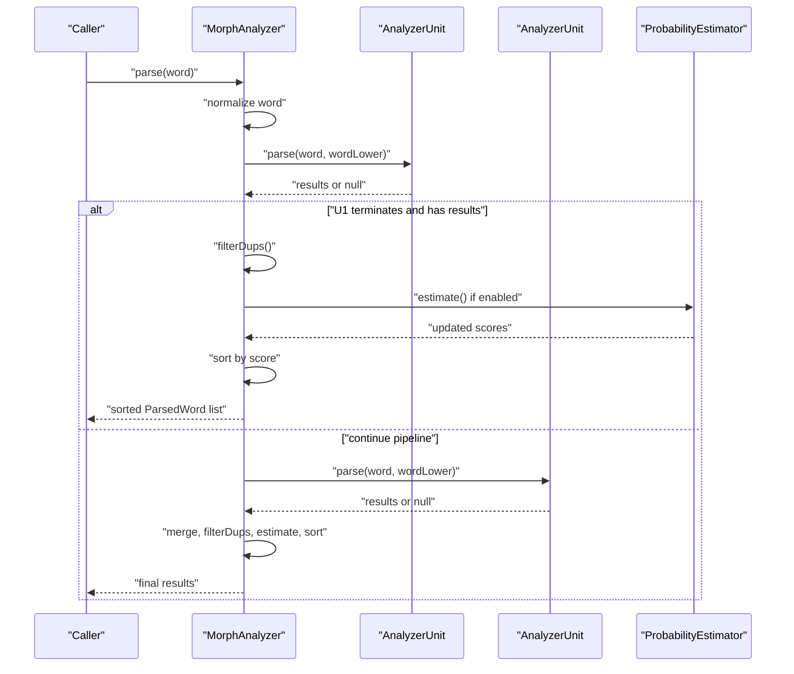
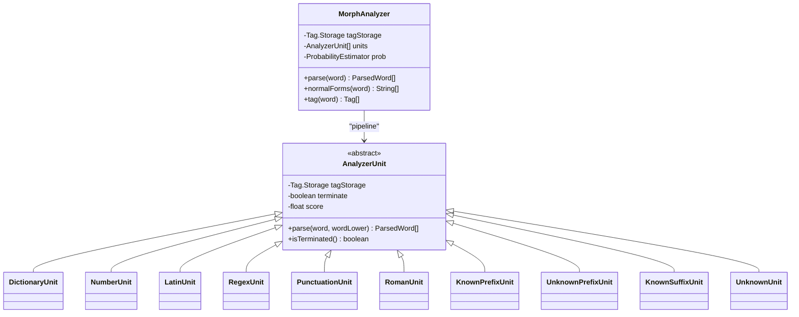
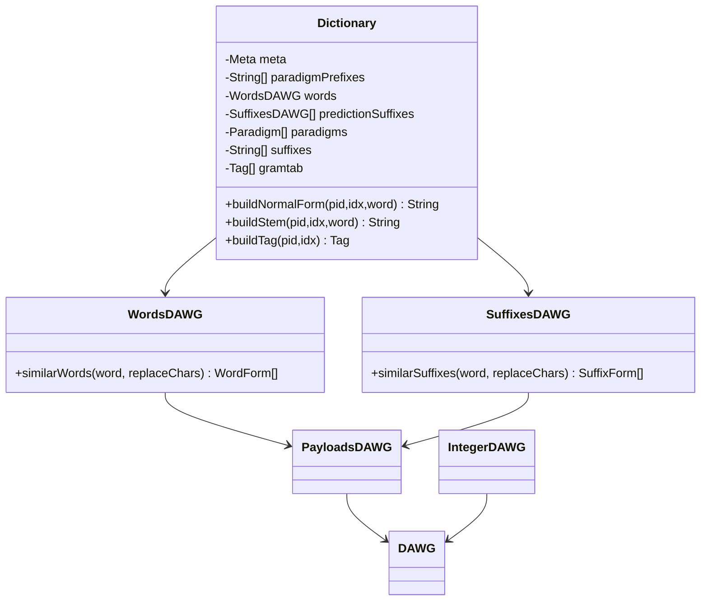
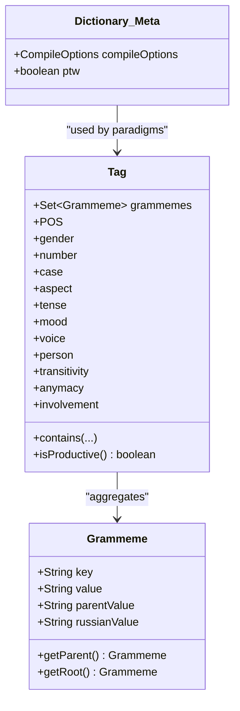
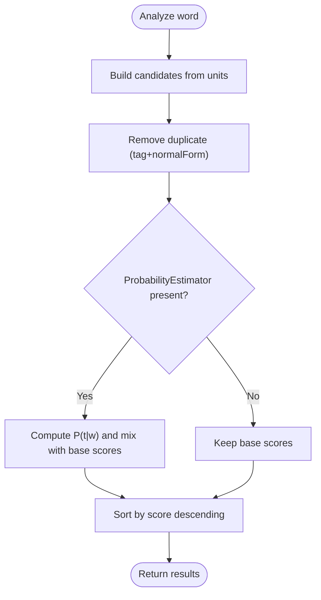
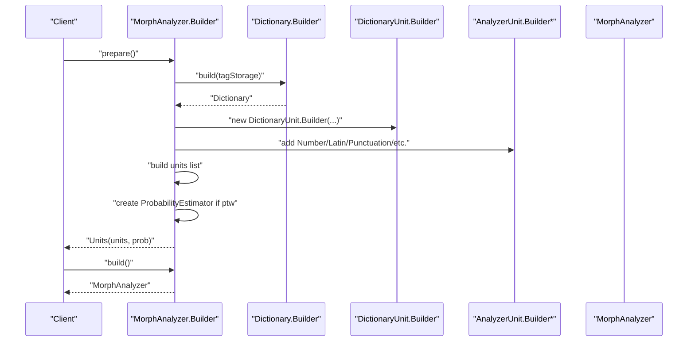
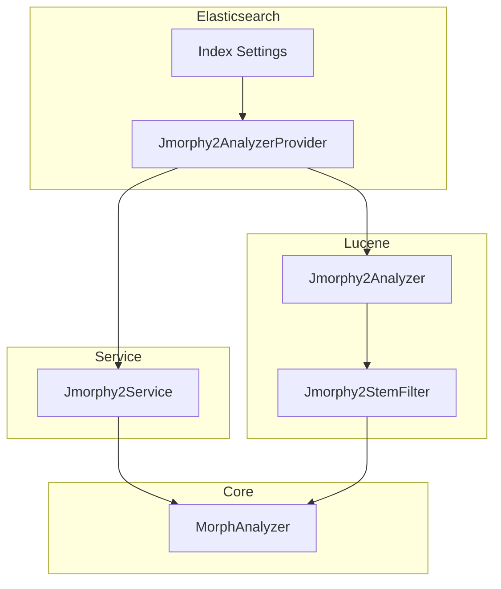
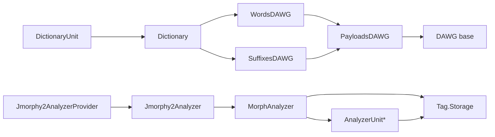

# Core Architecture

<cite>
**Referenced Files in This Document**
- [MorphAnalyzer.java](file://jmorphy2-core/src/main/java/company/evo/jmorphy2/MorphAnalyzer.java)
- [AnalyzerUnit.java](file://jmorphy2-core/src/main/java/company/evo/jmorphy2/units/AnalyzerUnit.java)
- [DictionaryUnit.java](file://jmorphy2-core/src/main/java/company/evo/jmorphy2/units/DictionaryUnit.java)
- [NumberUnit.java](file://jmorphy2-core/src/main/java/company/evo/jmorphy2/units/NumberUnit.java)
- [LatinUnit.java](file://jmorphy2-core/src/main/java/company/evo/jmorphy2/units/LatinUnit.java)
- [RegexUnit.java](file://jmorphy2-core/src/main/java/company/evo/jmorphy2/units/RegexUnit.java)
- [UnknownUnit.java](file://jmorphy2-core/src/main/java/company/evo/jmorphy2/units/UnknownUnit.java)
- [PunctuationUnit.java](file://jmorphy2-core/src/main/java/company/evo/jmorphy2/units/PunctuationUnit.java)
- [RomanUnit.java](file://jmorphy2-core/src/main/java/company/evo/jmorphy2/units/RomanUnit.java)
- [PrefixedUnit.java](file://jmorphy2-core/src/main/java/company/evo/jmorphy2/units/PrefixedUnit.java)
- [KnownPrefixUnit.java](file://jmorphy2-core/src/main/java/company/evo/jmorphy2/units/KnownPrefixUnit.java)
- [UnknownPrefixUnit.java](file://jmorphy2-core/src/main/java/company/evo/jmorphy2/units/UnknownPrefixUnit.java)
- [KnownSuffixUnit.java](file://jmorphy2-core/src/main/java/company/evo/jmorphy2/units/KnownSuffixUnit.java)
- [Dictionary.java](file://jmorphy2-core/src/main/java/company/evo/jmorphy2/Dictionary.java)
- [WordsDAWG.java](file://jmorphy2-core/src/main/java/company/evo/jmorphy2/WordsDAWG.java)
- [SuffixesDAWG.java](file://jmorphy2-core/src/main/java/company/evo/jmorphy2/SuffixesDAWG.java)
- [DAWG.java](file://dawg/src/main/java/company/evo/dawg/DAWG.java)
- [PayloadsDAWG.java](file://dawg/src/main/java/company/evo/dawg/PayloadsDAWG.java)
- [IntegerDAWG.java](file://dawg/src/main/java/company/evo/dawg/IntegerDAWG.java)
- [Tag.java](file://jmorphy2-core/src/main/java/company/evo/jmorpy2/Tag.java)
- [Grammeme.java](file://jmorphy2-core/src/main/java/company/evo/jmorphy2/Grammeme.java)
- [ParsedWord.java](file://jmorphy2-core/src/main/java/company/evo/jmorphy2/ParsedWord.java)
- [Jmorphy2Analyzer.java](file://jmorphy2-lucene/src/main/java/company/evo/jmorphy2/lucene/Jmorphy2Analyzer.java)
- [Jmorphy2AnalyzerProvider.java](file://jmorphy2-elasticsearch/src/main/java/company/evo/jmorphy2/elasticsearch/index/Jmorphy2AnalyzerProvider.java)
- [Parser.java](file://jmorphy2-nlp/src/main/java/company/evo/jmorphy2/nlp/Parser.java)
- [Tagger.java](file://jmorphy2-nlp/src/main/java/company/evo/jmorphy2/nlp/Tagger.java)
</cite>

## Table of Contents
1. [Introduction](#introduction)
2. [Project Structure](#project-structure)
3. [Core Components](#core-components)
4. [Architecture Overview](#architecture-overview)
5. [Detailed Component Analysis](#detailed-component-analysis)
6. [Dependency Analysis](#dependency-analysis)
7. [Performance Considerations](#performance-considerations)
8. [Troubleshooting Guide](#troubleshooting-guide)
9. [Conclusion](#conclusion)
10. [Appendices](#appendices)

## Introduction
This document describes the core architecture of Jmorphy2, focusing on the morphological analyzer as the central orchestrator, the AnalyzerUnit pipeline pattern for processing diverse word types, and the Dictionary system backed by DAWG-based storage. It explains how the morphological analyzer coordinates dictionary operations and language-specific processing units, and how the modular design separates concerns across analysis, dictionary management, and language-specific logic. It also documents the technical foundations including paradigm tables, grammatical tag systems, and confidence scoring mechanisms, and demonstrates how the builder pattern enables flexible configuration of analysis pipelines. Finally, it outlines system context with external integrations such as Elasticsearch and Lucene.

## Project Structure
Jmorphy2 is organized into several modules:
- jmorphy2-core: Core morphological analyzer, dictionary, DAWG abstractions, grammatical tags, and analyzer units.
- dawg: Low-level DAWG implementations used by the dictionary.
- jmorphy2-lucene: Lucene integration with analyzers and filters that delegate to MorphAnalyzer.
- jmorphy2-elasticsearch: Elasticsearch plugin integrating Jmorphy2 analyzers and token filters via a service facade.
- jmorphy2-nlp: Optional NLP components (parser and tagger) that can leverage MorphAnalyzer.

**Diagram sources**
- [MorphAnalyzer.java:15-247](file://jmorphy2-core/src/main/java/company/evo/jmorphy2/MorphAnalyzer.java#L15-L247)
- [Dictionary.java:12-302](file://jmorphy2-core/src/main/java/company/evo/jmorphy2/Dictionary.java#L12-L302)
- [WordsDAWG.java:13-57](file://jmorphy2-core/src/main/java/company/evo/jmorphy2/WordsDAWG.java#L13-L57)
- [SuffixesDAWG.java:13-61](file://jmorphy2-core/src/main/java/company/evo/jmorphy2/SuffixesDAWG.java#L13-L61)
- [DAWG.java:13-40](file://dawg/src/main/java/company/evo/dawg/DAWG.java#L13-L40)
- [PayloadsDAWG.java](file://dawg/src/main/java/company/evo/dawg/PayloadsDAWG.java)
- [IntegerDAWG.java](file://dawg/src/main/java/company/evo/dawg/IntegerDAWG.java)
- [Jmorphy2Analyzer.java:17-42](file://jmorphy2-lucene/src/main/java/company/evo/jmorphy2/lucene/Jmorphy2Analyzer.java#L17-L42)
- [Jmorphy2AnalyzerProvider.java:29-53](file://jmorphy2-elasticsearch/src/main/java/company/evo/jmorphy2/elasticsearch/index/Jmorphy2AnalyzerProvider.java#L29-L53)
- [Parser.java:9-30](file://jmorphy2-nlp/src/main/java/company/evo/jmorphy2/nlp/Parser.java#L9-L30)
- [Tagger.java:9-20](file://jmorphy2-nlp/src/main/java/company/evo/jmorphy2/nlp/Tagger.java#L9-L20)

**Section sources**
- [MorphAnalyzer.java:15-247](file://jmorphy2-core/src/main/java/company/evo/jmorphy2/MorphAnalyzer.java#L15-L247)
- [Dictionary.java:12-302](file://jmorphy2-core/src/main/java/company/evo/jmorphy2/Dictionary.java#L12-L302)

## Core Components
- MorphAnalyzer: Central orchestrator that runs a chain of AnalyzerUnit instances against an input word, aggregates results, removes duplicates, optionally estimates probabilities, and sorts by score.
- AnalyzerUnit: Abstract base for specialized analyzers (dictionary lookup, numbers, punctuation, Latin, roman numerals, prefixes/suffixes, regex-based, unknown words).
- Dictionary: Loads and exposes paradigm tables, grammatical tag table, words DAWG, prediction suffixes DAWG, and helpers to build normal forms and tags.
- DAWG layer: Generic DAWG base and payload-enabled variants used by WordsDAWG and SuffixesDAWG to support fast prefix/suffix similarity queries and payload decoding.
- Tag and Grammeme: Grammatical tag system with hierarchical grammeme semantics and a shared storage for normalization and lookup.
- ParsedWord: Immutable result type representing a candidate analysis with tag, normal form, confidence score, and lexeme generation capability.

Key responsibilities:
- MorphAnalyzer: Pipeline orchestration, duplicate filtering, optional probability estimation, sorting.
- Dictionary: Data loading, paradigm indexing, normal form construction, tag building.
- AnalyzerUnits: Specialized parsing strategies per word type with configurable termination and scoring.
- DAWG: Efficient storage and retrieval of word and suffix patterns with payloads.

**Section sources**
- [MorphAnalyzer.java:15-247](file://jmorphy2-core/src/main/java/company/evo/jmorphy2/MorphAnalyzer.java#L15-L247)
- [AnalyzerUnit.java:11-72](file://jmorphy2-core/src/main/java/company/evo/jmorphy2/units/AnalyzerUnit.java#L11-L72)
- [Dictionary.java:12-302](file://jmorphy2-core/src/main/java/company/evo/jmorphy2/Dictionary.java#L12-L302)
- [WordsDAWG.java:13-57](file://jmorphy2-core/src/main/java/company/evo/jmorphy2/WordsDAWG.java#L13-L57)
- [SuffixesDAWG.java:13-61](file://jmorphy2-core/src/main/java/company/evo/jmorphy2/SuffixesDAWG.java#L13-L61)
- [Tag.java:7-230](file://jmorphy2-core/src/main/java/company/evo/jmorphy2/Tag.java#L7-L230)
- [Grammeme.java:7-86](file://jmorphy2-core/src/main/java/company/evo/jmorphy2/Grammeme.java#L7-L86)
- [ParsedWord.java:9-89](file://jmorphy2-core/src/main/java/company/evo/jmorphy2/ParsedWord.java#L9-L89)

## Architecture Overview
The system centers on MorphAnalyzer, which composes a pipeline of AnalyzerUnit instances. Each unit contributes potential analyses for a given word. The pipeline short-circuits when a unit indicates termination and yields non-empty results. Results are deduplicated, optionally scored via probability estimation, and sorted by confidence.

**Diagram sources**
- [MorphAnalyzer.java:178-245](file://jmorphy2-core/src/main/java/company/evo/jmorphy2/MorphAnalyzer.java#L178-L245)
- [AnalyzerUnit.java:46-46](file://jmorphy2-core/src/main/java/company/evo/jmorphy2/units/AnalyzerUnit.java#L46-L46)
- [ParsedWord.java:26-28](file://jmorphy2-core/src/main/java/company/evo/jmorphy2/ParsedWord.java#L26-L28)

## Detailed Component Analysis

### MorphAnalyzer and the AnalyzerUnit Pipeline
MorphAnalyzer holds a Tag.Storage, a list of AnalyzerUnit instances, and an optional ProbabilityEstimator. Its Builder prepares units, loads dictionary metadata, and wires language-specific units. The parse method iterates units, collects results, deduplicates, optionally estimates probabilities, and sorts.

**Diagram sources**
- [MorphAnalyzer.java:15-247](file://jmorphy2-core/src/main/java/company/evo/jmorphy2/MorphAnalyzer.java#L15-L247)
- [AnalyzerUnit.java:11-72](file://jmorphy2-core/src/main/java/company/evo/jmorphy2/units/AnalyzerUnit.java#L11-L72)
- [DictionaryUnit.java:14-104](file://jmorphy2-core/src/main/java/company/evo/jmorphy2/units/DictionaryUnit.java#L14-L104)
- [NumberUnit.java:10-54](file://jmorphy2-core/src/main/java/company/evo/jmorphy2/units/NumberUnit.java#L10-L54)
- [LatinUnit.java:8-28](file://jmorphy2-core/src/main/java/company/evo/jmorphy2/units/LatinUnit.java#L8-L28)
- [RegexUnit.java](file://jmorphy2-core/src/main/java/company/evo/jmorphy2/units/RegexUnit.java)

**Section sources**
- [MorphAnalyzer.java:178-245](file://jmorphy2-core/src/main/java/company/evo/jmorphy2/MorphAnalyzer.java#L178-L245)
- [AnalyzerUnit.java:11-72](file://jmorphy2-core/src/main/java/company/evo/jmorphy2/units/AnalyzerUnit.java#L11-L72)

### Dictionary and DAWG-backed Storage
Dictionary encapsulates paradigm tables, grammatical tag table, and DAWG structures. It builds normal forms and tags from paradigms and suffixes, and exposes helpers to construct stems and combine paradigm parts. WordsDAWG and SuffixesDAWG inherit payload-aware DAWGs to decode stored paradigm identifiers and indices.

**Diagram sources**
- [Dictionary.java:12-302](file://jmorphy2-core/src/main/java/company/evo/jmorphy2/Dictionary.java#L12-L302)
- [WordsDAWG.java:13-57](file://jmorphy2-core/src/main/java/company/evo/jmorphy2/WordsDAWG.java#L13-L57)
- [SuffixesDAWG.java:13-61](file://jmorphy2-core/src/main/java/company/evo/jmorphy2/SuffixesDAWG.java#L13-L61)
- [DAWG.java:13-40](file://dawg/src/main/java/company/evo/dawg/DAWG.java#L13-L40)
- [PayloadsDAWG.java](file://dawg/src/main/java/company/evo/dawg/PayloadsDAWG.java)
- [IntegerDAWG.java](file://dawg/src/main/java/company/evo/dawg/IntegerDAWG.java)

**Section sources**
- [Dictionary.java:12-302](file://jmorphy2-core/src/main/java/company/evo/jmorphy2/Dictionary.java#L12-L302)
- [WordsDAWG.java:13-57](file://jmorphy2-core/src/main/java/company/evo/jmorphy2/WordsDAWG.java#L13-L57)
- [SuffixesDAWG.java:13-61](file://jmorphy2-core/src/main/java/company/evo/jmorphy2/SuffixesDAWG.java#L13-L61)

### Grammatical Tag System and Paradigm Tables
Tag represents a normalized set of grammemes with convenience accessors for major categories. Grammeme defines hierarchical keys and parent relationships. Dictionary.Meta stores compilation options and flags (including whether P(t|w) is available). Paradigm tables encode how to build stems, normal forms, and tags from paradigm identifiers and indices.

**Diagram sources**
- [Tag.java:7-230](file://jmorphy2-core/src/main/java/company/evo/jmorphy2/Tag.java#L7-L230)
- [Grammeme.java:7-86](file://jmorphy2-core/src/main/java/company/evo/jmorphy2/Grammeme.java#L7-L86)
- [Dictionary.java:190-260](file://jmorphy2-core/src/main/java/company/evo/jmorphy2/Dictionary.java#L190-L260)

**Section sources**
- [Tag.java:7-230](file://jmorphy2-core/src/main/java/company/evo/jmorphy2/Tag.java#L7-L230)
- [Grammeme.java:7-86](file://jmorphy2-core/src/main/java/company/evo/jmorphy2/Grammeme.java#L7-L86)
- [Dictionary.java:190-260](file://jmorphy2-core/src/main/java/company/evo/jmorphy2/Dictionary.java#L190-L260)

### Confidence Scoring and Lexeme Generation
ParsedWord carries the analysis result with a floating-point score. AnalyzerUnit subclasses produce AnalyzerParsedWord instances with a base score. MorphAnalyzer optionally updates scores using ProbabilityEstimator and sorts results. DictionaryUnit overrides getLexeme to enumerate paradigm forms for inflection.

**Diagram sources**
- [MorphAnalyzer.java:202-232](file://jmorphy2-core/src/main/java/company/evo/jmorphy2/MorphAnalyzer.java#L202-L232)
- [ParsedWord.java:9-89](file://jmorphy2-core/src/main/java/company/evo/jmorphy2/ParsedWord.java#L9-L89)
- [AnalyzerUnit.java:48-70](file://jmorphy2-core/src/main/java/company/evo/jmorphy2/units/AnalyzerUnit.java#L48-L70)
- [DictionaryUnit.java:67-102](file://jmorphy2-core/src/main/java/company/evo/jmorphy2/units/DictionaryUnit.java#L67-L102)

**Section sources**
- [MorphAnalyzer.java:202-232](file://jmorphy2-core/src/main/java/company/evo/jmorphy2/MorphAnalyzer.java#L202-L232)
- [ParsedWord.java:9-89](file://jmorphy2-core/src/main/java/company/evo/jmorphy2/ParsedWord.java#L9-L89)
- [DictionaryUnit.java:67-102](file://jmorphy2-core/src/main/java/company/evo/jmorphy2/units/DictionaryUnit.java#L67-L102)

### Builder Pattern and Flexible Pipelines
MorphAnalyzer.Builder prepares units automatically from dictionary metadata and language resources, but also allows explicit unit builders to be supplied. Each AnalyzerUnit.Builder caches built instances and delegates to a newAnalyzerUnit factory method. This enables flexible configuration of the analysis pipeline per language and use case.

**Diagram sources**
- [MorphAnalyzer.java:52-104](file://jmorphy2-core/src/main/java/company/evo/jmorphy2/MorphAnalyzer.java#L52-L104)
- [AnalyzerUnit.java:16-34](file://jmorphy2-core/src/main/java/company/evo/jmorphy2/units/AnalyzerUnit.java#L16-L34)
- [Dictionary.java:36-139](file://jmorphy2-core/src/main/java/company/evo/jmorphy2/Dictionary.java#L36-L139)

**Section sources**
- [MorphAnalyzer.java:52-104](file://jmorphy2-core/src/main/java/company/evo/jmorphy2/MorphAnalyzer.java#L52-L104)
- [AnalyzerUnit.java:16-34](file://jmorphy2-core/src/main/java/company/evo/jmorphy2/units/AnalyzerUnit.java#L16-L34)

### External Integrations: Elasticsearch and Lucene
Lucene integration wraps MorphAnalyzer in Jmorphy2Analyzer, which applies Jmorphy2StemFilter to normalize and enrich tokens. Elasticsearch integration provides Jmorphy2AnalyzerProvider that obtains a MorphAnalyzer from a service facade and binds it to index analyzers.

**Diagram sources**
- [Jmorphy2AnalyzerProvider.java:29-53](file://jmorphy2-elasticsearch/src/main/java/company/evo/jmorphy2/elasticsearch/index/Jmorphy2AnalyzerProvider.java#L29-L53)
- [Jmorphy2Analyzer.java:17-42](file://jmorphy2-lucene/src/main/java/company/evo/jmorphy2/lucene/Jmorphy2Analyzer.java#L17-L42)

**Section sources**
- [Jmorphy2AnalyzerProvider.java:29-53](file://jmorphy2-elasticsearch/src/main/java/company/evo/jmorphy2/elasticsearch/index/Jmorphy2AnalyzerProvider.java#L29-L53)
- [Jmorphy2Analyzer.java:17-42](file://jmorphy2-lucene/src/main/java/company/evo/jmorphy2/lucene/Jmorphy2Analyzer.java#L17-L42)

### Conceptual Overview
The system’s design emphasizes modularity and extensibility:
- Separation of concerns: MorphAnalyzer orchestrates, Dictionary manages data, AnalyzerUnits handle parsing logic.
- Language-specific processing: Units are configured per language via resource files and dictionary metadata.
- Scalable storage: DAWG-based structures enable efficient prefix/suffix matching and payload decoding.
- Interoperability: Lucene/Elasticsearch bridges integrate MorphAnalyzer into search pipelines.

[No sources needed since this section doesn't analyze specific source files]

## Dependency Analysis
- MorphAnalyzer depends on Tag.Storage, a list of AnalyzerUnit, and optionally ProbabilityEstimator.
- AnalyzerUnit subclasses depend on Tag.Storage for grammeme/tag creation and on Dictionary where applicable.
- Dictionary depends on DAWG implementations and JSON/arrays for grammemes, paradigms, suffixes, and grammatical tag table.
- DAWG layer provides generic base classes for prefix/suffix queries and payload decoding.
- Lucene/Elasticsearch modules depend on MorphAnalyzer to provide tokenization and stemming.

**Diagram sources**
- [MorphAnalyzer.java:15-247](file://jmorphy2-core/src/main/java/company/evo/jmorphy2/MorphAnalyzer.java#L15-L247)
- [AnalyzerUnit.java:11-72](file://jmorphy2-core/src/main/java/company/evo/jmorphy2/units/AnalyzerUnit.java#L11-L72)
- [DictionaryUnit.java:14-104](file://jmorphy2-core/src/main/java/company/evo/jmorphy2/units/DictionaryUnit.java#L14-L104)
- [Dictionary.java:12-302](file://jmorphy2-core/src/main/java/company/evo/jmorphy2/Dictionary.java#L12-L302)
- [WordsDAWG.java:13-57](file://jmorphy2-core/src/main/java/company/evo/jmorphy2/WordsDAWG.java#L13-L57)
- [SuffixesDAWG.java:13-61](file://jmorphy2-core/src/main/java/company/evo/jmorphy2/SuffixesDAWG.java#L13-L61)
- [DAWG.java:13-40](file://dawg/src/main/java/company/evo/dawg/DAWG.java#L13-L40)
- [PayloadsDAWG.java](file://dawg/src/main/java/company/evo/dawg/PayloadsDAWG.java)
- [Jmorphy2Analyzer.java:17-42](file://jmorphy2-lucene/src/main/java/company/evo/jmorphy2/lucene/Jmorphy2Analyzer.java#L17-L42)
- [Jmorphy2AnalyzerProvider.java:29-53](file://jmorphy2-elasticsearch/src/main/java/company/evo/jmorphy2/elasticsearch/index/Jmorphy2AnalyzerProvider.java#L29-L53)

**Section sources**
- [MorphAnalyzer.java:15-247](file://jmorphy2-core/src/main/java/company/evo/jmorphy2/MorphAnalyzer.java#L15-L247)
- [Dictionary.java:12-302](file://jmorphy2-core/src/main/java/company/evo/jmorphy2/Dictionary.java#L12-L302)

## Performance Considerations
- DAWG-based lookups: Prefix/suffix similarity queries are efficient; payloads decode paradigm identifiers quickly.
- Pipeline short-circuiting: Terminating units reduce unnecessary work when confident matches are found.
- Deduplication and scoring: Removing duplicates and re-ranking improves result quality and reduces downstream processing overhead.
- Probability estimation: Conditional probability weighting can improve ranking accuracy when enabled by dictionary metadata.
- Caching: AnalyzerUnit.Builder caches built units; Dictionary.Builder caches loaded dictionaries.

[No sources needed since this section provides general guidance]

## Troubleshooting Guide
Common issues and diagnostics:
- Unsupported dictionary format: Dictionary.Meta constructor validates format version; mismatches raise runtime exceptions during build.
- Missing or invalid language resources: Builder resolves language-specific prefixes and character substitutions; missing resources lead to incomplete unit configuration.
- No results for a word: Verify pipeline order and termination flags; ensure UnknownUnit is included to capture unknown words.
- Incorrect grammemes/tags: Confirm grammeme JSON loading and tag normalization in Tag.Storage.
- Elasticsearch/Lucene integration: Ensure Jmorphy2Service provides a MorphAnalyzer instance and that Jmorphy2AnalyzerProvider is registered.

**Section sources**
- [Dictionary.java:232-238](file://jmorphy2-core/src/main/java/company/evo/jmorphy2/Dictionary.java#L232-L238)
- [MorphAnalyzer.java:52-98](file://jmorphy2-core/src/main/java/company/evo/jmorphy2/MorphAnalyzer.java#L52-L98)
- [Tag.java:162-228](file://jmorphy2-core/src/main/java/company/evo/jmorphy2/Tag.java#L162-L228)
- [Jmorphy2AnalyzerProvider.java:29-53](file://jmorphy2-elasticsearch/src/main/java/company/evo/jmorphy2/elasticsearch/index/Jmorphy2AnalyzerProvider.java#L29-L53)

## Conclusion
Jmorphy2’s architecture cleanly separates morphological analysis, dictionary management, and language-specific processing. The MorphAnalyzer orchestrates a configurable pipeline of AnalyzerUnit instances, leveraging DAWG-backed dictionary structures for efficient lookups and paradigm-based normal form generation. The builder pattern enables flexible, language-aware configurations, while Lucene and Elasticsearch integrations demonstrate seamless interoperability with search stacks. The grammatical tag system and confidence scoring mechanisms provide robust semantic labeling and ranking.

[No sources needed since this section summarizes without analyzing specific files]

## Appendices

### AnalyzerUnit Types Overview
- DictionaryUnit: Dictionary-backed lookup with lexeme enumeration.
- NumberUnit: Numeric detection with integer/float variants.
- LatinUnit: Latin character sequences.
- RegexUnit: Base for regex-based analyzers (e.g., LatinUnit).
- PunctuationUnit: Punctuation tokenization.
- RomanUnit: Roman numeral recognition.
- KnownPrefixUnit: Prefix analysis using known prefixes.
- UnknownPrefixUnit: Unknown prefix analysis.
- KnownSuffixUnit: Suffix analysis with character substitution.
- UnknownUnit: Fallback for unknown words.

**Section sources**
- [DictionaryUnit.java:14-104](file://jmorphy2-core/src/main/java/company/evo/jmorphy2/units/DictionaryUnit.java#L14-L104)
- [NumberUnit.java:10-54](file://jmorphy2-core/src/main/java/company/evo/jmorphy2/units/NumberUnit.java#L10-L54)
- [LatinUnit.java:8-28](file://jmorphy2-core/src/main/java/company/evo/jmorphy2/units/LatinUnit.java#L8-L28)
- [RegexUnit.java](file://jmorphy2-core/src/main/java/company/evo/jmorphy2/units/RegexUnit.java)
- [PunctuationUnit.java](file://jmorphy2-core/src/main/java/company/evo/jmorphy2/units/PunctuationUnit.java)
- [RomanUnit.java](file://jmorphy2-core/src/main/java/company/evo/jmorphy2/units/RomanUnit.java)
- [KnownPrefixUnit.java](file://jmorphy2-core/src/main/java/company/evo/jmorphy2/units/KnownPrefixUnit.java)
- [UnknownPrefixUnit.java](file://jmorphy2-core/src/main/java/company/evo/jmorphy2/units/UnknownPrefixUnit.java)
- [KnownSuffixUnit.java](file://jmorphy2-core/src/main/java/company/evo/jmorphy2/units/KnownSuffixUnit.java)
- [UnknownUnit.java](file://jmorphy2-core/src/main/java/company/evo/jmorphy2/units/UnknownUnit.java)