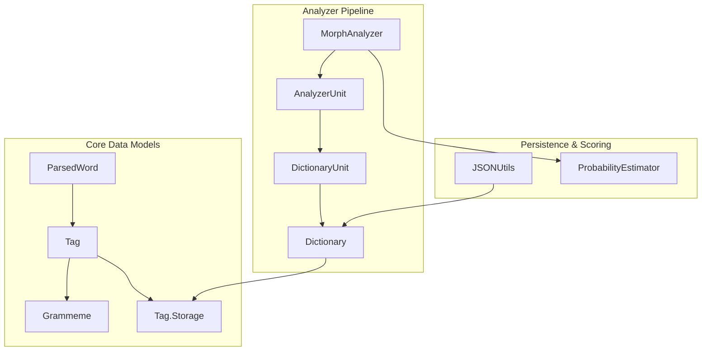
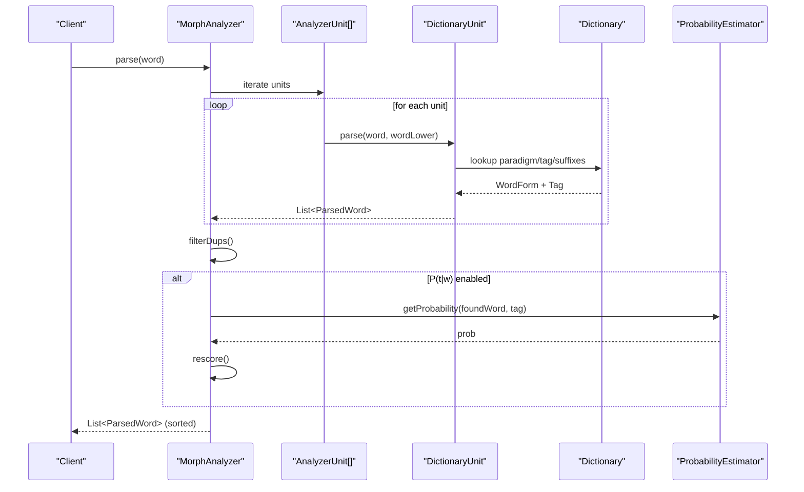
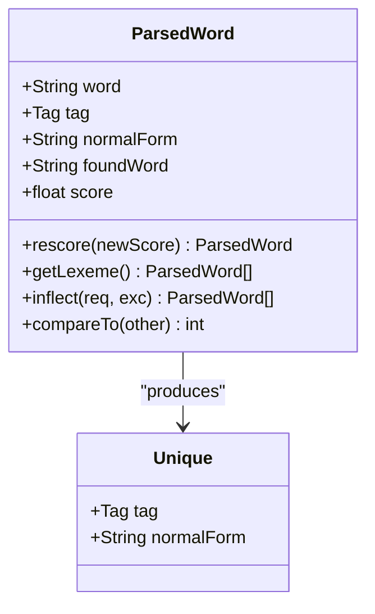
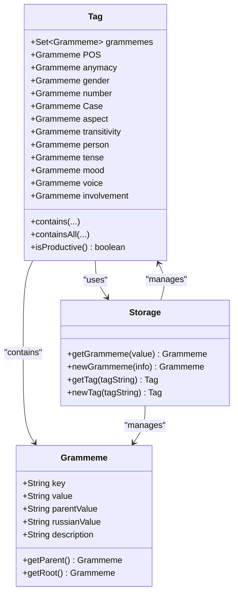
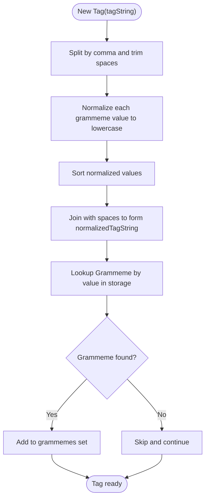
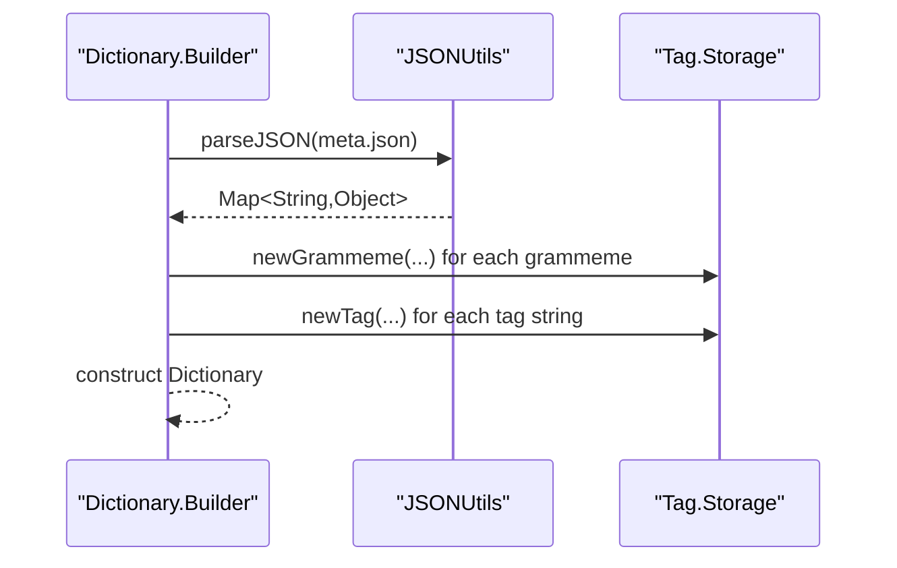
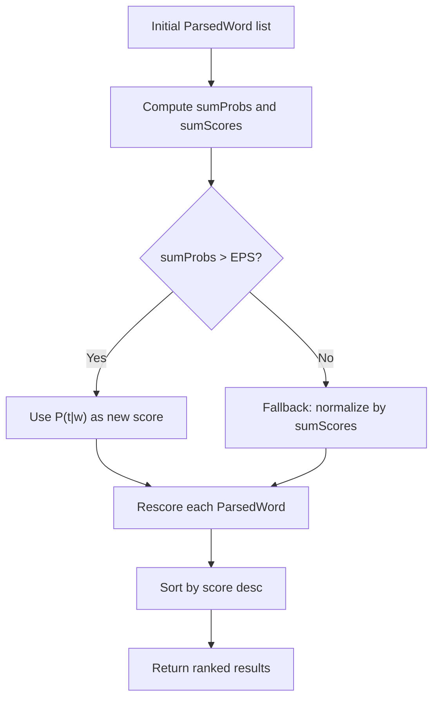
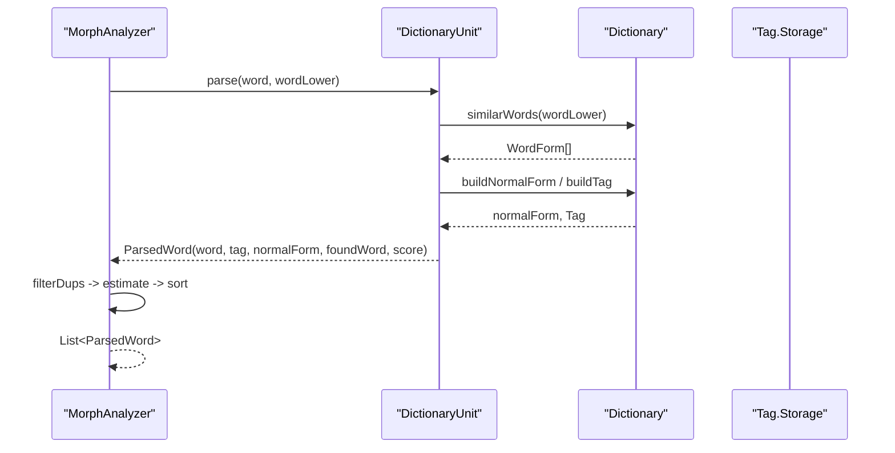
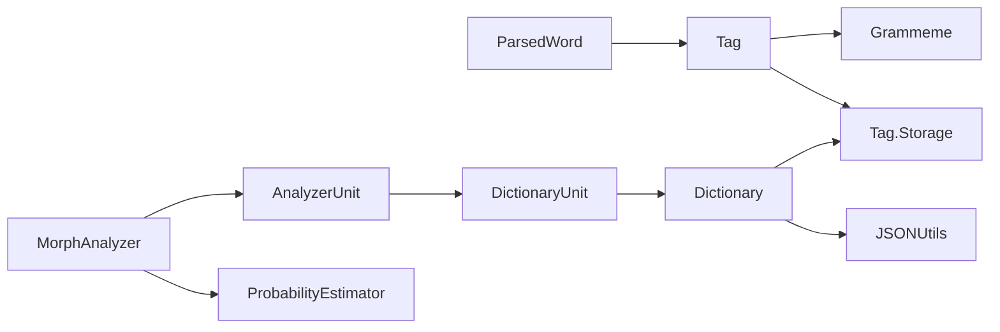

# Data Models

<cite>
**Referenced Files in This Document**
- [ParsedWord.java](file://jmorphy2-core/src/main/java/company/evo/jmorphy2/ParsedWord.java)
- [Tag.java](file://jmorphy2-core/src/main/java/company/evo/jmorphy2/Tag.java)
- [Grammeme.java](file://jmorphy2-core/src/main/java/company/evo/jmorphy2/Grammeme.java)
- [JSONUtils.java](file://jmorphy2-core/src/main/java/company/evo/jmorphy2/JSONUtils.java)
- [ProbabilityEstimator.java](file://jmorphy2-core/src/main/java/company/evo/jmorphy2/ProbabilityEstimator.java)
- [MorphAnalyzer.java](file://jmorphy2-core/src/main/java/company/evo/jmorphy2/MorphAnalyzer.java)
- [Dictionary.java](file://jmorphy2-core/src/main/java/company/evo/jmorphy2/Dictionary.java)
- [AnalyzerUnit.java](file://jmorphy2-core/src/main/java/company/evo/jmorphy2/units/AnalyzerUnit.java)
- [DictionaryUnit.java](file://jmorphy2-core/src/main/java/company/evo/jmorphy2/units/DictionaryUnit.java)
- [Resources.java](file://jmorphy2-core/src/main/java/company/evo/jmorphy2/Resources.java)
- [MorphAnalyzerRUTest.java](file://jmorphy2-core/src/test/java/company/evo/jmorphy2/MorphAnalyzerRUTest.java)
</cite>

## Table of Contents
1. [Introduction](#introduction)
2. [Project Structure](#project-structure)
3. [Core Components](#core-components)
4. [Architecture Overview](#architecture-overview)
5. [Detailed Component Analysis](#detailed-component-analysis)
6. [Dependency Analysis](#dependency-analysis)
7. [Performance Considerations](#performance-considerations)
8. [Troubleshooting Guide](#troubleshooting-guide)
9. [Conclusion](#conclusion)
10. [Appendices](#appendices)

## Introduction
This document explains Jmorphy2’s core data models that represent morphological analysis results and grammatical information. It focuses on:
- ParsedWord as the primary result container for analysis outcomes
- Tag and Grammeme for grammatical categories and features
- Tag.Storage for managing grammatical tag definitions and lookups
- Serialization and deserialization via JSONUtils for persisting analysis results
- Confidence scoring and probability estimation
- Data flow across components and downstream processing

## Project Structure
The data model layer resides primarily under jmorphy2-core/src/main/java/company/evo/jmorphy2, with supporting units and utilities. The analyzer composes multiple AnalyzerUnit instances to produce ParsedWord results, which are later scored and filtered.

**Diagram sources**
- [ParsedWord.java:9-88](file://jmorphy2-core/src/main/java/company/evo/jmorphy2/ParsedWord.java#L9-L88)
- [Tag.java:7-229](file://jmorphy2-core/src/main/java/company/evo/jmorphy2/Tag.java#L7-L229)
- [Grammeme.java:7-86](file://jmorphy2-core/src/main/java/company/evo/jmorphy2/Grammeme.java#L7-L86)
- [MorphAnalyzer.java:15-247](file://jmorphy2-core/src/main/java/company/evo/jmorphy2/MorphAnalyzer.java#L15-L247)
- [AnalyzerUnit.java:42-71](file://jmorphy2-core/src/main/java/company/evo/jmorphy2/units/AnalyzerUnit.java#L42-L71)
- [DictionaryUnit.java:14-104](file://jmorphy2-core/src/main/java/company/evo/jmorphy2/units/DictionaryUnit.java#L14-L104)
- [Dictionary.java:12-302](file://jmorphy2-core/src/main/java/company/evo/jmorphy2/Dictionary.java#L12-L302)
- [JSONUtils.java:18-79](file://jmorphy2-core/src/main/java/company/evo/jmorphy2/JSONUtils.java#L18-L79)
- [ProbabilityEstimator.java:9-27](file://jmorphy2-core/src/main/java/company/evo/jmorphy2/ProbabilityEstimator.java#L9-L27)

**Section sources**
- [MorphAnalyzer.java:15-247](file://jmorphy2-core/src/main/java/company/evo/jmorphy2/MorphAnalyzer.java#L15-L247)
- [Dictionary.java:12-302](file://jmorphy2-core/src/main/java/company/evo/jmorphy2/Dictionary.java#L12-L302)

## Core Components
- ParsedWord: Immutable result container holding the input word, normalized form, grammatical tag, the matched surface form, and a confidence score. Provides filtering by grammatical features and lexeme expansion.
- Tag: Encapsulates grammatical features as a set of Grammeme objects, with convenience accessors for major categories (POS, case, number, gender, etc.). Normalizes and stores grammatical values via Tag.Storage.
- Grammeme: Represents a single grammatical feature with key, value, parent, Russian label, and description. Supports hierarchical navigation to parent/root.
- Tag.Storage: Central registry for Grammeme and Tag instances, enabling normalization, deduplication, and fast lookup.
- ProbabilityEstimator: Loads precomputed P(t|w) distributions and returns probability estimates used to rescore analyses.
- JSONUtils: Low-level JSON parser for loading dictionary metadata and grammatical tables.
- MorphAnalyzer: Orchestrates parsing, scoring, and ranking of ParsedWord results.

**Section sources**
- [ParsedWord.java:9-88](file://jmorphy2-core/src/main/java/company/evo/jmorphy2/ParsedWord.java#L9-L88)
- [Tag.java:7-229](file://jmorphy2-core/src/main/java/company/evo/jmorphy2/Tag.java#L7-L229)
- [Grammeme.java:7-86](file://jmorphy2-core/src/main/java/company/evo/jmorphy2/Grammeme.java#L7-L86)
- [ProbabilityEstimator.java:9-27](file://jmorphy2-core/src/main/java/company/evo/jmorphy2/ProbabilityEstimator.java#L9-L27)
- [JSONUtils.java:18-79](file://jmorphy2-core/src/main/java/company/evo/jmorphy2/JSONUtils.java#L18-L79)
- [MorphAnalyzer.java:15-247](file://jmorphy2-core/src/main/java/company/evo/jmorphy2/MorphAnalyzer.java#L15-L247)

## Architecture Overview
The analyzer pipeline produces ParsedWord instances from multiple AnalyzerUnit sources. Each ParsedWord carries a Tag and a base score. ProbabilityEstimator optionally refines scores using P(t|w) distributions. Results are deduplicated and sorted by score.

**Diagram sources**
- [MorphAnalyzer.java:178-246](file://jmorphy2-core/src/main/java/company/evo/jmorphy2/MorphAnalyzer.java#L178-L246)
- [DictionaryUnit.java:56-104](file://jmorphy2-core/src/main/java/company/evo/jmorphy2/units/DictionaryUnit.java#L56-L104)
- [Dictionary.java:165-188](file://jmorphy2-core/src/main/java/company/evo/jmorphy2/Dictionary.java#L165-L188)
- [ProbabilityEstimator.java:22-25](file://jmorphy2-core/src/main/java/company/evo/jmorphy2/ProbabilityEstimator.java#L22-L25)

## Detailed Component Analysis

### ParsedWord: Result Container
- Fields:
  - word: original input
  - tag: grammatical tag
  - normalForm: canonical lemma-like form
  - foundWord: matched surface form
  - score: confidence (higher is better)
- Methods:
  - rescore(newScore): returns a new ParsedWord with updated score
  - getLexeme(): returns all paradigm forms for inflection
  - inflect(requiredGrammemes, excludeGrammemes): filters lexeme by grammatical constraints
  - compareTo: sorts by score descending
  - Unique: hash/equality key for (tag, normalForm) pairs
- Typical usage: downstream processors consume lists of ParsedWord to select best interpretations, enumerate paradigms, or apply post-processing.

**Diagram sources**
- [ParsedWord.java:9-88](file://jmorphy2-core/src/main/java/company/evo/jmorphy2/ParsedWord.java#L9-L88)

**Section sources**
- [ParsedWord.java:9-88](file://jmorphy2-core/src/main/java/company/evo/jmorphy2/ParsedWord.java#L9-L88)

### Tag and Grammeme: Grammatical Categories
- Tag:
  - Holds a set of Grammeme objects and exposes typed accessors for major categories (POS, animacy, gender, number, case, aspect, transitivity, person, tense, mood, voice, involvement)
  - Normalizes tag strings and grammeme keys for consistent comparison
  - Provides containment checks for grammemes and values
  - isProductive(): determines whether the tag encodes productive morphology
- Grammeme:
  - Stores key/value, parent, Russian label, and description
  - Supports getParent() and getRoot() to navigate grammatical hierarchy
- Tag.Storage:
  - Central registry for Grammeme and Tag instances
  - Normalizes grammeme values and tag strings
  - Provides newGrammeme(...) and newTag(...) with caching

**Diagram sources**
- [Tag.java:7-229](file://jmorphy2-core/src/main/java/company/evo/jmorphy2/Tag.java#L7-L229)
- [Grammeme.java:7-86](file://jmorphy2-core/src/main/java/company/evo/jmorphy2/Grammeme.java#L7-L86)

**Section sources**
- [Tag.java:7-229](file://jmorphy2-core/src/main/java/company/evo/jmorphy2/Tag.java#L7-L229)
- [Grammeme.java:7-86](file://jmorphy2-core/src/main/java/company/evo/jmorphy2/Grammeme.java#L7-L86)

### Tag.Storage: Managing Definitions and Lookups
- Responsibilities:
  - Normalize grammeme values and tag strings
  - Build and cache Grammeme and Tag instances
  - Provide lookup APIs for grammemes and tags
- Behavior:
  - Uses lowercased keys for robustness
  - Sorts and joins grammeme tokens to normalize tag strings
  - Ensures uniqueness and immutability of stored objects

**Diagram sources**
- [Tag.java:41-73](file://jmorphy2-core/src/main/java/company/evo/jmorphy2/Tag.java#L41-L73)
- [Tag.java:162-228](file://jmorphy2-core/src/main/java/company/evo/jmorphy2/Tag.java#L162-L228)

**Section sources**
- [Tag.java:162-228](file://jmorphy2-core/src/main/java/company/evo/jmorphy2/Tag.java#L162-L228)

### Serialization and Deserialization with JSONUtils
- JSONUtils provides a streaming JSON parser to load dictionary metadata and grammatical tables.
- Dictionary.Builder uses JSONUtils to:
  - Parse meta.json into a Meta object
  - Load grammemes.json into Tag.Storage via newGrammeme(...)
  - Load grammatic tags (gramtab) into Tag[] via newTag(...)
  - Load suffixes and prediction suffixes arrays

**Diagram sources**
- [Dictionary.java:92-107](file://jmorphy2-core/src/main/java/company/evo/jmorphy2/Dictionary.java#L92-L107)
- [JSONUtils.java:18-79](file://jmorphy2-core/src/main/java/company/evo/jmorphy2/JSONUtils.java#L18-L79)

**Section sources**
- [Dictionary.java:92-107](file://jmorphy2-core/src/main/java/company/evo/jmorphy2/Dictionary.java#L92-L107)
- [JSONUtils.java:18-79](file://jmorphy2-core/src/main/java/company/evo/jmorphy2/JSONUtils.java#L18-L79)

### Confidence Scoring and Probability Estimation
- Initial scoring:
  - Each AnalyzerUnit contributes ParsedWord instances with a unit-specific score (e.g., dictionary vs. rules vs. unknown).
- Rescoring:
  - ProbabilityEstimator loads P(t|w) distributions and returns a probability for each (word, tag) pair.
  - MorphAnalyzer estimates new scores using P(t|w), normalizing if probabilities sum below threshold.
- Ranking:
  - Results are sorted by score descending for downstream selection.

**Diagram sources**
- [MorphAnalyzer.java:202-232](file://jmorphy2-core/src/main/java/company/evo/jmorphy2/MorphAnalyzer.java#L202-L232)
- [ProbabilityEstimator.java:22-25](file://jmorphy2-core/src/main/java/company/evo/jmorphy2/ProbabilityEstimator.java#L22-L25)

**Section sources**
- [MorphAnalyzer.java:202-232](file://jmorphy2-core/src/main/java/company/evo/jmorphy2/MorphAnalyzer.java#L202-L232)
- [ProbabilityEstimator.java:9-27](file://jmorphy2-core/src/main/java/company/evo/jmorphy2/ProbabilityEstimator.java#L9-L27)

### Data Flow Between Components
- Analyzer pipeline:
  - MorphAnalyzer builds AnalyzerUnit chain (dictionary, numbers, punctuation, regex, unknown, etc.)
  - DictionaryUnit resolves forms via Dictionary and constructs ParsedWord instances
  - ParsedWord instances are deduplicated by (tag, normalForm), optionally rescrored, and sorted
- Downstream processing:
  - Clients call parse(word) to get ranked ParsedWord results
  - Clients can call normalForms(word) or tag(word) to extract normalized forms or tags
  - Lexeme enumeration via ParsedWord.getLexeme() enables inflection filtering

**Diagram sources**
- [MorphAnalyzer.java:178-200](file://jmorphy2-core/src/main/java/company/evo/jmorphy2/MorphAnalyzer.java#L178-L200)
- [DictionaryUnit.java:56-104](file://jmorphy2-core/src/main/java/company/evo/jmorphy2/units/DictionaryUnit.java#L56-L104)
- [Dictionary.java:165-188](file://jmorphy2-core/src/main/java/company/evo/jmorphy2/Dictionary.java#L165-L188)

**Section sources**
- [MorphAnalyzer.java:178-200](file://jmorphy2-core/src/main/java/company/evo/jmorphy2/MorphAnalyzer.java#L178-L200)
- [DictionaryUnit.java:56-104](file://jmorphy2-core/src/main/java/company/evo/jmorphy2/units/DictionaryUnit.java#L56-L104)
- [Dictionary.java:165-188](file://jmorphy2-core/src/main/java/company/evo/jmorphy2/Dictionary.java#L165-L188)

### Usage Patterns and Examples
- Typical data structures:
  - ParsedWord: carries word, tag, normalForm, foundWord, score
  - Tag: set of Grammeme objects with typed accessors
  - Grammeme: hierarchical feature with parent/root relations
- Example usage patterns:
  - Extract top-ranked analysis: parse(word).get(0)
  - Get all normal forms: normalForms(word)
  - Filter lexeme by features: parsed.getLexeme().inflect(required, excluded)
  - Inspect grammatical categories: tag.POS, tag.Case, tag.number, tag.gender
  - Enumerate paradigms: parsed.getLexeme()

These patterns are demonstrated in tests and analyzer methods.

**Section sources**
- [MorphAnalyzerRUTest.java:30-200](file://jmorphy2-core/src/test/java/company/evo/jmorphy2/MorphAnalyzerRUTest.java#L30-L200)
- [MorphAnalyzer.java:147-172](file://jmorphy2-core/src/main/java/company/evo/jmorphy2/MorphAnalyzer.java#L147-L172)
- [ParsedWord.java:30-43](file://jmorphy2-core/src/main/java/company/evo/jmorphy2/ParsedWord.java#L30-L43)

## Dependency Analysis
- ParsedWord depends on Tag and Grammeme for grammatical interpretation.
- Tag depends on Tag.Storage for normalized grammeme/tag management.
- DictionaryUnit depends on Dictionary to resolve paradigm forms and tags.
- MorphAnalyzer composes AnalyzerUnit instances and orchestrates scoring and ranking.
- ProbabilityEstimator depends on IntegerDAWG-backed P(t|w) distribution.
- Dictionary.Builder depends on JSONUtils to load grammatical definitions and tables.

**Diagram sources**
- [ParsedWord.java:9-88](file://jmorphy2-core/src/main/java/company/evo/jmorphy2/ParsedWord.java#L9-L88)
- [Tag.java:7-229](file://jmorphy2-core/src/main/java/company/evo/jmorphy2/Tag.java#L7-L229)
- [Grammeme.java:7-86](file://jmorphy2-core/src/main/java/company/evo/jmorphy2/Grammeme.java#L7-L86)
- [DictionaryUnit.java:14-104](file://jmorphy2-core/src/main/java/company/evo/jmorphy2/units/DictionaryUnit.java#L14-L104)
- [Dictionary.java:12-302](file://jmorphy2-core/src/main/java/company/evo/jmorphy2/Dictionary.java#L12-L302)
- [MorphAnalyzer.java:15-247](file://jmorphy2-core/src/main/java/company/evo/jmorphy2/MorphAnalyzer.java#L15-L247)
- [ProbabilityEstimator.java:9-27](file://jmorphy2-core/src/main/java/company/evo/jmorphy2/ProbabilityEstimator.java#L9-L27)
- [JSONUtils.java:18-79](file://jmorphy2-core/src/main/java/company/evo/jmorphy2/JSONUtils.java#L18-L79)

**Section sources**
- [MorphAnalyzer.java:15-247](file://jmorphy2-core/src/main/java/company/evo/jmorphy2/MorphAnalyzer.java#L15-L247)
- [Dictionary.java:12-302](file://jmorphy2-core/src/main/java/company/evo/jmorphy2/Dictionary.java#L12-L302)

## Performance Considerations
- Deduplication: MorphAnalyzer.filterDups eliminates redundant (tag, normalForm) entries early to reduce downstream processing overhead.
- Scoring normalization: When P(t|w) sums are negligible, fallback normalization prevents skewed rankings.
- Storage normalization: Tag.Storage caches normalized grammeme/tag keys to minimize repeated parsing and comparisons.
- Streaming JSON: JSONUtils avoids building large intermediate structures, reducing memory pressure during dictionary loading.

[No sources needed since this section provides general guidance]

## Troubleshooting Guide
- Unexpected empty results:
  - Verify dictionary availability and language code resolution via Dictionary.Builder and Resources.
  - Confirm tag strings are normalized and grammeme values exist in Tag.Storage.
- Incorrect grammatical filtering:
  - Ensure requiredGrammemes are present in the Tag.grammemes set and that parent/root relationships are considered when checking category membership.
- Poor confidence scores:
  - Check if P(t|w) distributions are available and enabled (Dictionary.Meta.ptw).
  - Validate that foundWord and tag combinations are present in the distribution.

**Section sources**
- [MorphAnalyzer.java:93-98](file://jmorphy2-core/src/main/java/company/evo/jmorphy2/MorphAnalyzer.java#L93-L98)
- [Dictionary.java:254-258](file://jmorphy2-core/src/main/java/company/evo/jmorphy2/Dictionary.java#L254-L258)
- [Resources.java:17-40](file://jmorphy2-core/src/main/java/company/evo/jmorphy2/Resources.java#L17-L40)

## Conclusion
Jmorphy2’s data models provide a robust, extensible foundation for morphological analysis:
- ParsedWord encapsulates analysis outcomes with grammatical context and confidence
- Tag and Grammeme define a rich, hierarchical grammatical taxonomy
- Tag.Storage ensures efficient, normalized lookups
- JSONUtils and Dictionary enable declarative dictionary loading
- ProbabilityEstimator and MorphAnalyzer integrate probabilistic scoring into the pipeline
Together, these components support flexible downstream processing, from simple normal form extraction to full paradigm enumeration and filtering.

[No sources needed since this section summarizes without analyzing specific files]

## Appendices

### Appendix A: Typical Data Structures and Usage
- ParsedWord: [ParsedWord.java:9-88](file://jmorphy2-core/src/main/java/company/evo/jmorphy2/ParsedWord.java#L9-L88)
- Tag: [Tag.java:7-229](file://jmorphy2-core/src/main/java/company/evo/jmorphy2/Tag.java#L7-L229)
- Grammeme: [Grammeme.java:7-86](file://jmorphy2-core/src/main/java/company/evo/jmorphy2/Grammeme.java#L7-L86)
- Tag.Storage: [Tag.java:162-228](file://jmorphy2-core/src/main/java/company/evo/jmorphy2/Tag.java#L162-L228)
- JSONUtils: [JSONUtils.java:18-79](file://jmorphy2-core/src/main/java/company/evo/jmorphy2/JSONUtils.java#L18-L79)
- ProbabilityEstimator: [ProbabilityEstimator.java:9-27](file://jmorphy2-core/src/main/java/company/evo/jmorphy2/ProbabilityEstimator.java#L9-L27)
- MorphAnalyzer: [MorphAnalyzer.java:15-247](file://jmorphy2-core/src/main/java/company/evo/jmorphy2/MorphAnalyzer.java#L15-L247)
- Dictionary: [Dictionary.java:12-302](file://jmorphy2-core/src/main/java/company/evo/jmorphy2/Dictionary.java#L12-L302)
- AnalyzerUnit and DictionaryUnit: [AnalyzerUnit.java:42-71](file://jmorphy2-core/src/main/java/company/evo/jmorphy2/units/AnalyzerUnit.java#L42-L71), [DictionaryUnit.java:14-104](file://jmorphy2-core/src/main/java/company/evo/jmorphy2/units/DictionaryUnit.java#L14-L104)
- Usage examples: [MorphAnalyzerRUTest.java:30-200](file://jmorphy2-core/src/test/java/company/evo/jmorphy2/MorphAnalyzerRUTest.java#L30-L200)