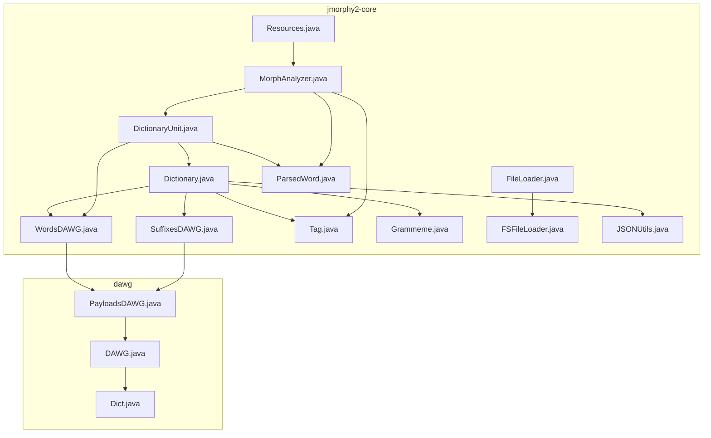
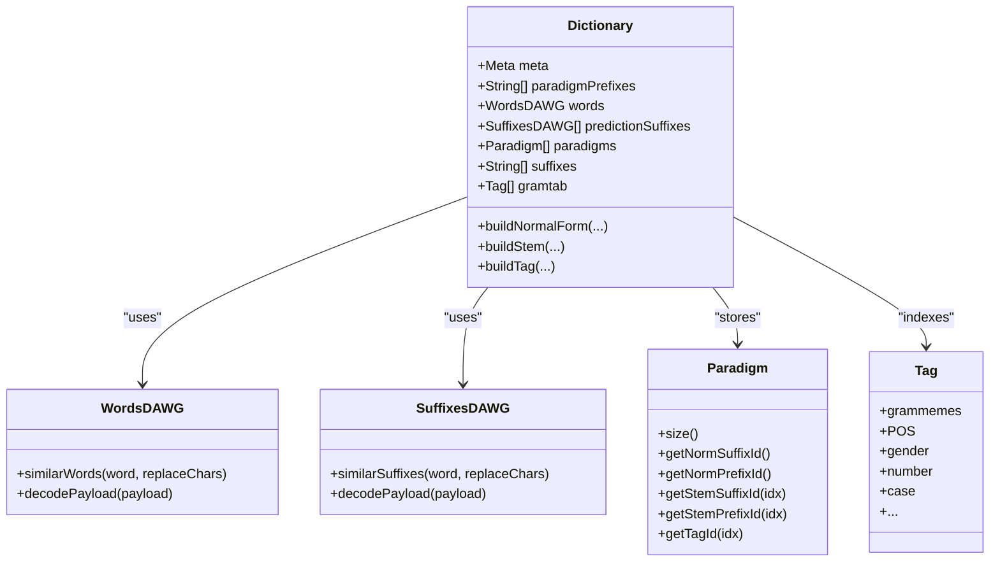
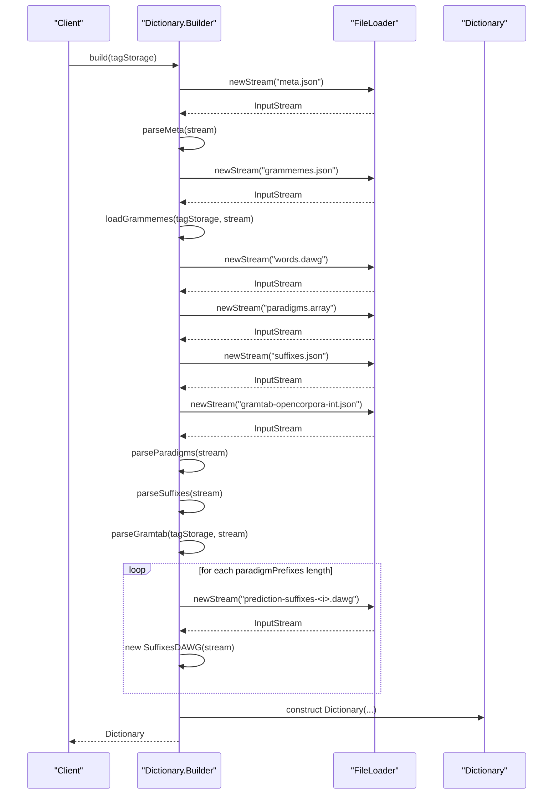
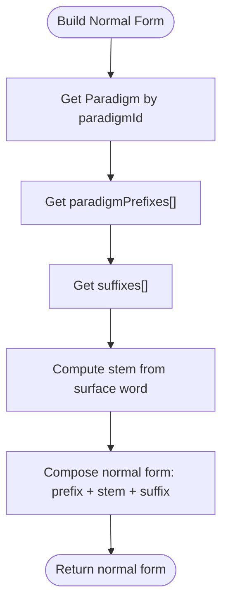
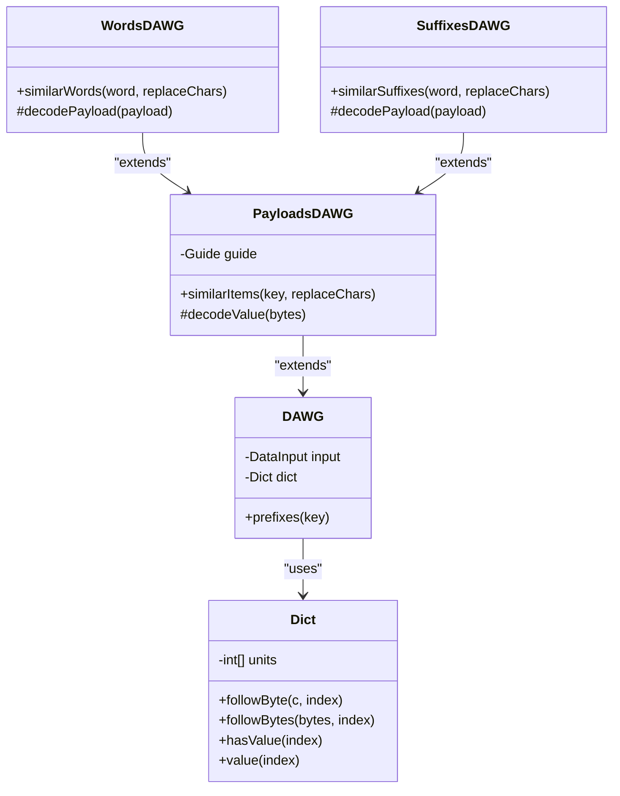
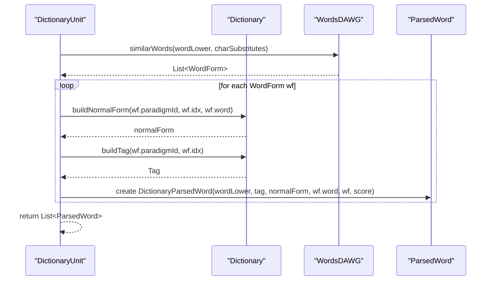
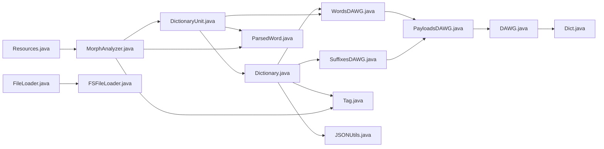

# Dictionary Management

<cite>
**Referenced Files in This Document**
- [Dictionary.java](file://jmorphy2-core/src/main/java/company/evo/jmorphy2/Dictionary.java)
- [WordsDAWG.java](file://jmorphy2-core/src/main/java/company/evo/jmorphy2/WordsDAWG.java)
- [SuffixesDAWG.java](file://jmorphy2-core/src/main/java/company/evo/jmorphy2/SuffixesDAWG.java)
- [DAWG.java](file://dawg/src/main/java/company/evo/dawg/DAWG.java)
- [Dict.java](file://dawg/src/main/java/company/evo/dawg/Dict.java)
- [PayloadsDAWG.java](file://dawg/src/main/java/company/evo/dawg/PayloadsDAWG.java)
- [DictionaryUnit.java](file://jmorphy2-core/src/main/java/company/evo/jmorphy2/units/DictionaryUnit.java)
- [MorphAnalyzer.java](file://jmorphy2-core/src/main/java/company/evo/jmorphy2/MorphAnalyzer.java)
- [Tag.java](file://jmorphy2-core/src/main/java/company/evo/jmorphy2/Tag.java)
- [Grammeme.java](file://jmorphy2-core/src/main/java/company/evo/jmorphy2/Grammeme.java)
- [FileLoader.java](file://jmorphy2-core/src/main/java/company/evo/jmorphy2/FileLoader.java)
- [FSFileLoader.java](file://jmorphy2-core/src/main/java/company/evo/jmorphy2/FSFileLoader.java)
- [Resources.java](file://jmorphy2-core/src/main/java/company/evo/jmorphy2/Resources.java)
- [JSONUtils.java](file://jmorphy2-core/src/main/java/company/evo/jmorphy2/JSONUtils.java)
- [ParsedWord.java](file://jmorphy2-core/src/main/java/company/evo/jmorphy2/ParsedWord.java)
- [known_prefixes.txt](file://jmorphy2-core/src/main/resources/lang/ru/known_prefixes.txt)
</cite>

## Table of Contents
1. [Introduction](#introduction)
2. [Project Structure](#project-structure)
3. [Core Components](#core-components)
4. [Architecture Overview](#architecture-overview)
5. [Detailed Component Analysis](#detailed-component-analysis)
6. [Dependency Analysis](#dependency-analysis)
7. [Performance Considerations](#performance-considerations)
8. [Troubleshooting Guide](#troubleshooting-guide)
9. [Conclusion](#conclusion)
10. [Appendices](#appendices)

## Introduction
This document explains the Dictionary Management system responsible for storing and retrieving word forms using DAWG (Directed Acyclic Word Graph) structures. It covers the Dictionary class architecture, DAWG implementations for word forms and inflection patterns, the Dict class and its traversal mechanisms, and how the paradigm table system stores inflection patterns to generate allometric forms. It also documents the dictionary loading process, file format specifications, language-specific dictionary structures, memory optimization benefits of DAWG storage, and the relationship between dictionary management and analyzer units in the processing pipeline.

## Project Structure
The dictionary management spans two modules:
- jmorphy2-core: Contains the Dictionary, DAWG wrappers (WordsDAWG, SuffixesDAWG), analyzer units, morphological tagging, and resource loaders.
- dawg: Provides the low-level DAWG engine (DAWG, Dict, PayloadsDAWG) used by higher-level components.

**Diagram sources**
- [Dictionary.java:12-302](file://jmorphy2-core/src/main/java/company/evo/jmorphy2/Dictionary.java#L12-L302)
- [WordsDAWG.java:13-57](file://jmorphy2-core/src/main/java/company/evo/jmorphy2/WordsDAWG.java#L13-L57)
- [SuffixesDAWG.java:13-61](file://jmorphy2-core/src/main/java/company/evo/jmorphy2/SuffixesDAWG.java#L13-L61)
- [DictionaryUnit.java:14-104](file://jmorphy2-core/src/main/java/company/evo/jmorphy2/units/DictionaryUnit.java#L14-L104)
- [MorphAnalyzer.java:15-247](file://jmorphy2-core/src/main/java/company/evo/jmorphy2/MorphAnalyzer.java#L15-L247)
- [Tag.java:7-230](file://jmorphy2-core/src/main/java/company/evo/jmorphy2/Tag.java#L7-L230)
- [Grammeme.java:7-86](file://jmorphy2-core/src/main/java/company/evo/jmorphy2/Grammeme.java#L7-L86)
- [FileLoader.java:7-10](file://jmorphy2-core/src/main/java/company/evo/jmorphy2/FileLoader.java#L7-L10)
- [FSFileLoader.java:9-21](file://jmorphy2-core/src/main/java/company/evo/jmorphy2/FSFileLoader.java#L9-L21)
- [Resources.java:16-114](file://jmorphy2-core/src/main/java/company/evo/jmorphy2/Resources.java#L16-L114)
- [JSONUtils.java:18-79](file://jmorphy2-core/src/main/java/company/evo/jmorphy2/JSONUtils.java#L18-L79)
- [ParsedWord.java:9-89](file://jmorphy2-core/src/main/java/company/evo/jmorphy2/ParsedWord.java#L9-L89)
- [DAWG.java:13-40](file://dawg/src/main/java/company/evo/dawg/DAWG.java#L13-L40)
- [Dict.java:7-102](file://dawg/src/main/java/company/evo/dawg/Dict.java#L7-L102)
- [PayloadsDAWG.java:14-242](file://dawg/src/main/java/company/evo/dawg/PayloadsDAWG.java#L14-L242)

**Section sources**
- [Dictionary.java:12-302](file://jmorphy2-core/src/main/java/company/evo/jmorphy2/Dictionary.java#L12-L302)
- [DAWG.java:13-40](file://dawg/src/main/java/company/evo/dawg/DAWG.java#L13-L40)
- [PayloadsDAWG.java:14-242](file://dawg/src/main/java/company/evo/dawg/PayloadsDAWG.java#L14-L242)

## Core Components
- Dictionary: Central orchestrator for dictionary metadata, paradigms, grammatical tag table, and DAWG-backed word/suffix lookup. It exposes builders to load serialized dictionary artifacts and provides methods to reconstruct normal forms and tags from paradigm indices.
- WordsDAWG: Specialization of PayloadsDAWG for word forms. Decodes stored payloads into WordForm entries containing paradigmId and idx.
- SuffixesDAWG: Specialization of PayloadsDAWG for suffix patterns used in similarity queries and predictions.
- Dict and DAWG: Low-level DAWG engine implementing compressed trie traversal, leaf/value detection, and guided traversal via a guide table.
- PayloadsDAWG: Adds payload decoding and “similarItems” search with wildcard character substitution support.
- DictionaryUnit: Analyzer unit that integrates Dictionary into the pipeline, performing word lookup and generating lexeme candidates.
- MorphAnalyzer: Pipeline builder that composes analyzer units, including DictionaryUnit, and optionally ProbabilityEstimator when enabled by dictionary metadata.

**Section sources**
- [Dictionary.java:12-302](file://jmorphy2-core/src/main/java/company/evo/jmorphy2/Dictionary.java#L12-L302)
- [WordsDAWG.java:13-57](file://jmorphy2-core/src/main/java/company/evo/jmorphy2/WordsDAWG.java#L13-L57)
- [SuffixesDAWG.java:13-61](file://jmorphy2-core/src/main/java/company/evo/jmorphy2/SuffixesDAWG.java#L13-L61)
- [Dict.java:7-102](file://dawg/src/main/java/company/evo/dawg/Dict.java#L7-L102)
- [DAWG.java:13-40](file://dawg/src/main/java/company/evo/dawg/DAWG.java#L13-L40)
- [PayloadsDAWG.java:14-242](file://dawg/src/main/java/company/evo/dawg/PayloadsDAWG.java#L14-L242)
- [DictionaryUnit.java:14-104](file://jmorphy2-core/src/main/java/company/evo/jmorphy2/units/DictionaryUnit.java#L14-L104)
- [MorphAnalyzer.java:15-247](file://jmorphy2-core/src/main/java/company/evo/jmorphy2/MorphAnalyzer.java#L15-L247)

## Architecture Overview
The dictionary management architecture centers around Dictionary, which encapsulates:
- WordsDAWG for exact and fuzzy matching of word forms
- SuffixesDAWG arrays indexed by paradigmPrefixes length for prediction-like suffix matching
- Paradigm table for per-word paradigm metadata (prefix/suffix ids and tag ids)
- Grammatical tag table and grammeme hierarchy for semantic tagging
- Loading pipeline via Dictionary.Builder that reads serialized artifacts

**Diagram sources**
- [Dictionary.java:12-302](file://jmorphy2-core/src/main/java/company/evo/jmorphy2/Dictionary.java#L12-L302)
- [WordsDAWG.java:13-57](file://jmorphy2-core/src/main/java/company/evo/jmorphy2/WordsDAWG.java#L13-L57)
- [SuffixesDAWG.java:13-61](file://jmorphy2-core/src/main/java/company/evo/jmorphy2/SuffixesDAWG.java#L13-L61)
- [Tag.java:7-230](file://jmorphy2-core/src/main/java/company/evo/jmorphy2/Tag.java#L7-L230)

## Detailed Component Analysis

### Dictionary Class and Builder
- Responsibilities:
  - Load dictionary artifacts: meta.json, words.dawg, paradigms.array, suffixes.json, grammemes.json, gramtab-opencorpora-int.json, and prediction-suffixes-*.dawg files.
  - Build internal structures: paradigmPrefixes array, paradigms table, suffixes array, and grammatical tag table.
  - Provide APIs to reconstruct normal form, stem, and tags from paradigm indices.
- Builder pattern:
  - Reads JSON meta to validate format version and capture compile options.
  - Parses paradigms array and suffixes list.
  - Loads grammemes and builds Tag instances.
  - Loads predictionSuffixes DAWGs according to compileOptions.paradigmPrefixes length.
- Accessors:
  - getWords(), getPredictionSuffixes(n), getParadigm(id), buildNormalForm(), buildStem(), buildTag(), getSuffix(), getParadigmPrefixes().

**Diagram sources**
- [Dictionary.java:36-139](file://jmorphy2-core/src/main/java/company/evo/jmorphy2/Dictionary.java#L36-L139)
- [FileLoader.java:7-10](file://jmorphy2-core/src/main/java/company/evo/jmorphy2/FileLoader.java#L7-L10)
- [FSFileLoader.java:9-21](file://jmorphy2-core/src/main/java/company/evo/jmorphy2/FSFileLoader.java#L9-L21)

**Section sources**
- [Dictionary.java:36-139](file://jmorphy2-core/src/main/java/company/evo/jmorphy2/Dictionary.java#L36-L139)
- [JSONUtils.java:18-79](file://jmorphy2-core/src/main/java/company/evo/jmorphy2/JSONUtils.java#L18-L79)

### Paradigm Table System
- Paradigm structure:
  - Fixed-size packed array storing three groups of indices per paradigm entry: stem suffix ids, tag ids, and stem prefix ids.
  - Normal form prefix/suffix ids are stored separately for global normalization.
- Methods:
  - getStemSuffixId(idx), getStemPrefixId(idx), getTagId(idx), getNormPrefixId(), getNormSuffixId(), size().
- Usage:
  - Dictionary.buildNormalForm() composes prefix + stem + suffix using paradigmPrefixes and suffixes arrays.
  - Dictionary.buildStem() slices the surface form using stem prefix/suffix ids.
  - Dictionary.buildTag() resolves Tag from tag ids via the grammatical tag table.

**Diagram sources**
- [Dictionary.java:170-188](file://jmorphy2-core/src/main/java/company/evo/jmorphy2/Dictionary.java#L170-L188)

**Section sources**
- [Dictionary.java:262-300](file://jmorphy2-core/src/main/java/company/evo/jmorphy2/Dictionary.java#L262-L300)

### DAWG Implementation Details
- Dict and DAWG:
  - Dict implements a compact trie with bit-packed nodes, label matching, and leaf detection.
  - DAWG wraps Dict and provides prefix enumeration.
- PayloadsDAWG:
  - Adds payload decoding and “similarItems” search supporting wildcard character substitutions.
  - Uses a guide table to traverse children and siblings efficiently.
- WordsDAWG and SuffixesDAWG:
  - Decode payloads into WordForm and SuffixForm respectively, carrying paradigmId and idx for downstream use.

**Diagram sources**
- [DAWG.java:13-40](file://dawg/src/main/java/company/evo/dawg/DAWG.java#L13-L40)
- [Dict.java:7-102](file://dawg/src/main/java/company/evo/dawg/Dict.java#L7-L102)
- [PayloadsDAWG.java:14-242](file://dawg/src/main/java/company/evo/dawg/PayloadsDAWG.java#L14-L242)
- [WordsDAWG.java:13-57](file://jmorphy2-core/src/main/java/company/evo/jmorphy2/WordsDAWG.java#L13-L57)
- [SuffixesDAWG.java:13-61](file://jmorphy2-core/src/main/java/company/evo/jmorphy2/SuffixesDAWG.java#L13-L61)

**Section sources**
- [DAWG.java:13-40](file://dawg/src/main/java/company/evo/dawg/DAWG.java#L13-L40)
- [Dict.java:7-102](file://dawg/src/main/java/company/evo/dawg/Dict.java#L7-L102)
- [PayloadsDAWG.java:42-93](file://dawg/src/main/java/company/evo/dawg/PayloadsDAWG.java#L42-L93)
- [WordsDAWG.java:18-31](file://jmorphy2-core/src/main/java/company/evo/jmorphy2/WordsDAWG.java#L18-L31)
- [SuffixesDAWG.java:18-32](file://jmorphy2-core/src/main/java/company/evo/jmorphy2/SuffixesDAWG.java#L18-L32)

### DictionaryUnit and Lookup Pipeline
- DictionaryUnit:
  - Integrates Dictionary into the analyzer pipeline.
  - On parse(word, wordLower), queries WordsDAWG.similarWords with optional character substitutions.
  - Builds ParsedWord instances with normal form, tag, and the underlying WordForm.
  - Implements getLexeme() to enumerate all paradigm forms using Dictionary.buildStem() and Dictionary.getSuffix().
- Relationship to MorphAnalyzer:
  - MorphAnalyzer.Builder composes DictionaryUnit along with other units and ProbabilityEstimator when applicable.

**Diagram sources**
- [DictionaryUnit.java:56-102](file://jmorphy2-core/src/main/java/company/evo/jmorphy2/units/DictionaryUnit.java#L56-L102)
- [Dictionary.java:170-188](file://jmorphy2-core/src/main/java/company/evo/jmorphy2/Dictionary.java#L170-L188)
- [WordsDAWG.java:25-31](file://jmorphy2-core/src/main/java/company/evo/jmorphy2/WordsDAWG.java#L25-L31)
- [ParsedWord.java:9-89](file://jmorphy2-core/src/main/java/company/evo/jmorphy2/ParsedWord.java#L9-L89)

**Section sources**
- [DictionaryUnit.java:14-104](file://jmorphy2-core/src/main/java/company/evo/jmorphy2/units/DictionaryUnit.java#L14-L104)
- [MorphAnalyzer.java:52-99](file://jmorphy2-core/src/main/java/company/evo/jmorphy2/MorphAnalyzer.java#L52-L99)

### Tagging and Grammatical Information
- Tag and Grammeme:
  - Tag parses grammeme strings, normalizes them, and provides accessors for major categories (POS, gender, number, case, etc.).
  - Grammeme supports hierarchical parent relationships and normalization.
- Dictionary integration:
  - Dictionary.buildTag() resolves Tag from paradigm tag ids using the preloaded grammatical tag table.

**Section sources**
- [Tag.java:7-230](file://jmorphy2-core/src/main/java/company/evo/jmorphy2/Tag.java#L7-L230)
- [Grammeme.java:7-86](file://jmorphy2-core/src/main/java/company/evo/jmorphy2/Grammeme.java#L7-L86)
- [Dictionary.java:165-168](file://jmorphy2-core/src/main/java/company/evo/jmorphy2/Dictionary.java#L165-L168)

### Dictionary Loading Process and File Formats
- Files:
  - meta.json: Dictionary metadata including format version, language code, compilation info, and compile options.
  - words.dawg: DAWG of word forms with payloads encoding paradigmId and idx.
  - paradigms.array: Binary-packed paradigm table.
  - suffixes.json: Array of suffix strings used for composition.
  - grammemes.json: Grammeme definitions for the tag set.
  - gramtab-opencorpora-int.json: Grammatical tag table as a list of tag strings.
  - prediction-suffixes-<n>.dawg: Per-prefix-length DAWG for suffix prediction.
- Builder steps:
  - Parse meta, load grammemes, build Tag.Storage, load paradigms, suffixes, and gramtab, then load predictionSuffixes DAWGs.

**Section sources**
- [Dictionary.java:40-47](file://jmorphy2-core/src/main/java/company/evo/jmorphy2/Dictionary.java#L40-L47)
- [Dictionary.java:109-139](file://jmorphy2-core/src/main/java/company/evo/jmorphy2/Dictionary.java#L109-L139)
- [JSONUtils.java:18-79](file://jmorphy2-core/src/main/java/company/evo/jmorphy2/JSONUtils.java#L18-L79)

### Language-Specific Dictionary Structures
- Language detection:
  - MorphAnalyzer.Builder determines language code from Dictionary meta and loads language-specific resources.
- Resources:
  - Resources.getKnownPrefixes(langCode): known affixes for prefix units.
  - Resources.getCharSubstitutes(langCode): character substitution map for fuzzy matching.
- Example resource:
  - known_prefixes.txt for Russian.

**Section sources**
- [MorphAnalyzer.java:62-66](file://jmorphy2-core/src/main/java/company/evo/jmorphy2/MorphAnalyzer.java#L62-L66)
- [Resources.java:17-40](file://jmorphy2-core/src/main/java/company/evo/jmorphy2/Resources.java#L17-L40)
- [known_prefixes.txt:1-145](file://jmorphy2-core/src/main/resources/lang/ru/known_prefixes.txt#L1-L145)

## Dependency Analysis
The following diagram shows key dependencies among dictionary and DAWG components:

**Diagram sources**
- [Dictionary.java:12-302](file://jmorphy2-core/src/main/java/company/evo/jmorphy2/Dictionary.java#L12-L302)
- [WordsDAWG.java:13-57](file://jmorphy2-core/src/main/java/company/evo/jmorphy2/WordsDAWG.java#L13-L57)
- [SuffixesDAWG.java:13-61](file://jmorphy2-core/src/main/java/company/evo/jmorphy2/SuffixesDAWG.java#L13-L61)
- [PayloadsDAWG.java:14-242](file://dawg/src/main/java/company/evo/dawg/PayloadsDAWG.java#L14-L242)
- [DAWG.java:13-40](file://dawg/src/main/java/company/evo/dawg/DAWG.java#L13-L40)
- [Dict.java:7-102](file://dawg/src/main/java/company/evo/dawg/Dict.java#L7-L102)
- [DictionaryUnit.java:14-104](file://jmorphy2-core/src/main/java/company/evo/jmorphy2/units/DictionaryUnit.java#L14-L104)
- [MorphAnalyzer.java:15-247](file://jmorphy2-core/src/main/java/company/evo/jmorphy2/MorphAnalyzer.java#L15-L247)
- [Tag.java:7-230](file://jmorphy2-core/src/main/java/company/evo/jmorphy2/Tag.java#L7-L230)
- [ParsedWord.java:9-89](file://jmorphy2-core/src/main/java/company/evo/jmorphy2/ParsedWord.java#L9-L89)
- [Resources.java:16-114](file://jmorphy2-core/src/main/java/company/evo/jmorphy2/Resources.java#L16-L114)
- [FileLoader.java:7-10](file://jmorphy2-core/src/main/java/company/evo/jmorphy2/FileLoader.java#L7-L10)
- [FSFileLoader.java:9-21](file://jmorphy2-core/src/main/java/company/evo/jmorphy2/FSFileLoader.java#L9-L21)

**Section sources**
- [Dictionary.java:12-302](file://jmorphy2-core/src/main/java/company/evo/jmorphy2/Dictionary.java#L12-L302)
- [DAWG.java:13-40](file://dawg/src/main/java/company/evo/dawg/DAWG.java#L13-L40)
- [PayloadsDAWG.java:14-242](file://dawg/src/main/java/company/evo/dawg/PayloadsDAWG.java#L14-L242)

## Performance Considerations
- DAWG advantages:
  - Compressed trie representation reduces memory footprint compared to full suffix tries.
  - Fast prefix and near-neighbor lookups via Dict traversal and PayloadsDAWG’s guided traversal.
- Practical benefits:
  - WordsDAWG.similarWords enables fuzzy matching with character substitutions, accelerating robust recognition.
  - PredictionSuffixes DAWGs enable efficient suffix-based inference aligned with paradigmPrefixes granularity.
- Memory layout:
  - Paradigm table and grammatical tag table are compact arrays for O(1) indexing during normal form and tag construction.

[No sources needed since this section provides general guidance]

## Troubleshooting Guide
- Unsupported format version:
  - Dictionary.Meta constructor validates format version against expected version and throws on mismatch.
- Missing or invalid dictionary files:
  - Builder requires meta.json, grammemes.json, words.dawg, paradigms.array, suffixes.json, and gramtab-opencorpora-int.json. Absent files cause IOExceptions during stream creation.
- Character substitution issues:
  - Ensure Resources.getCharSubstitutes(langCode) returns expected mappings; malformed entries are skipped.
- Pipeline ordering:
  - DictionaryUnit should be placed early in the pipeline to maximize coverage; downstream units can refine results.

**Section sources**
- [Dictionary.java:234-237](file://jmorphy2-core/src/main/java/company/evo/jmorphy2/Dictionary.java#L234-L237)
- [Dictionary.java:109-139](file://jmorphy2-core/src/main/java/company/evo/jmorphy2/Dictionary.java#L109-L139)
- [Resources.java:17-32](file://jmorphy2-core/src/main/java/company/evo/jmorphy2/Resources.java#L17-L32)

## Conclusion
The Dictionary Management system leverages DAWG structures to achieve compact, high-performance word and suffix lookups. Dictionary orchestrates paradigm tables and grammatical tagging, enabling accurate normal form and tag reconstruction. WordsDAWG and SuffixesDAWG provide flexible search capabilities, while DictionaryUnit integrates these capabilities into the broader MorphAnalyzer pipeline. Language-specific resources further tailor behavior for robust multilingual processing.

[No sources needed since this section summarizes without analyzing specific files]

## Appendices

### File Format Specifications
- meta.json:
  - Keys include format_version, language_code, compile_at, source, source_version, source_revision, source_lexemes_count, source_links_count, gramtab_length, gramtab_formats, paradigms_length, suffixes_length, words_dawg_length, compile_options, prediction_suffixes_dawg_lengths, and probabilistic tagging flags.
- paradigms.array:
  - Binary-packed array of Paradigm entries; each entry stores packed indices for stem suffix ids, tag ids, and stem prefix ids.
- suffixes.json:
  - JSON array of suffix strings used for composition.
- grammemes.json:
  - JSON array of grammeme definitions for the tag set.
- gramtab-opencorpora-int.json:
  - JSON array of tag strings mapped to Tag instances.
- words.dawg and prediction-suffixes-<n>.dawg:
  - DAWG binary format with guide table and payload encoding.

**Section sources**
- [Dictionary.java:190-260](file://jmorphy2-core/src/main/java/company/evo/jmorphy2/Dictionary.java#L190-L260)
- [Dictionary.java:76-84](file://jmorphy2-core/src/main/java/company/evo/jmorphy2/Dictionary.java#L76-L84)
- [Dictionary.java:87-89](file://jmorphy2-core/src/main/java/company/evo/jmorphy2/Dictionary.java#L87-L89)
- [Dictionary.java:99-107](file://jmorphy2-core/src/main/java/company/evo/jmorphy2/Dictionary.java#L99-L107)