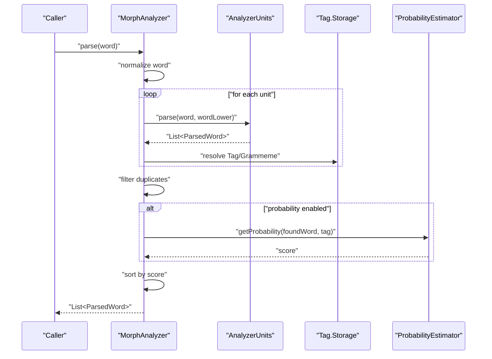
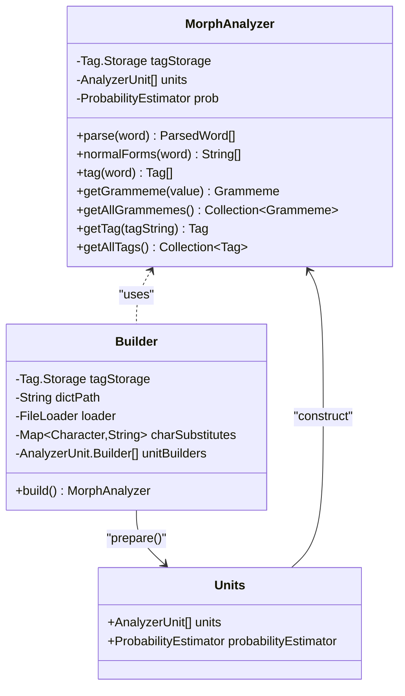
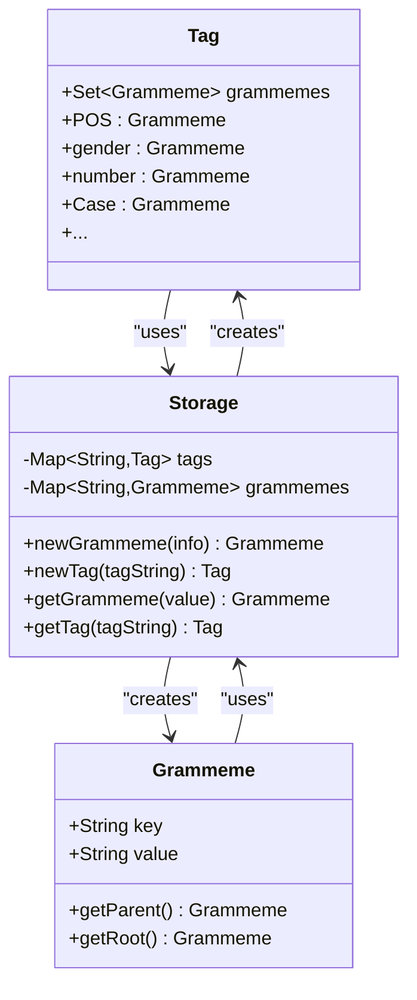
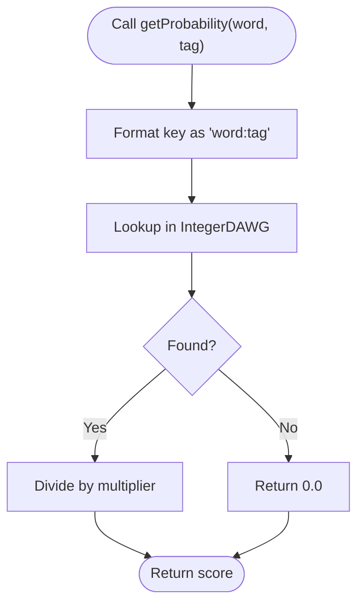
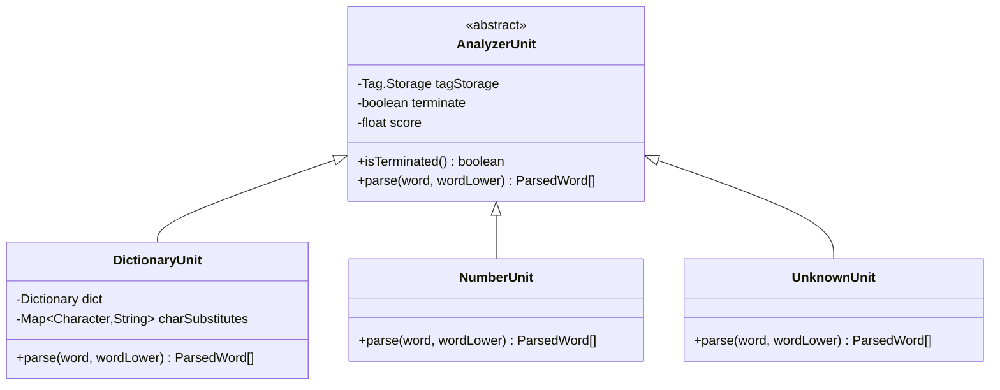
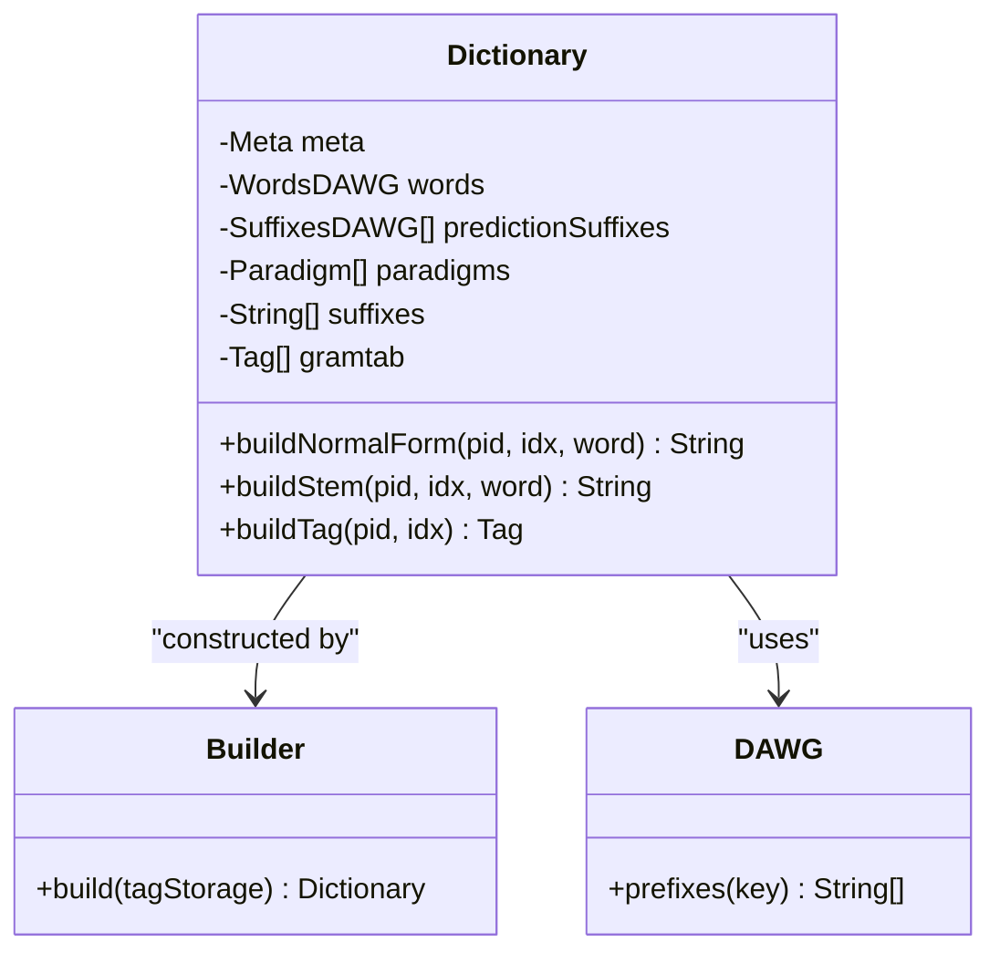
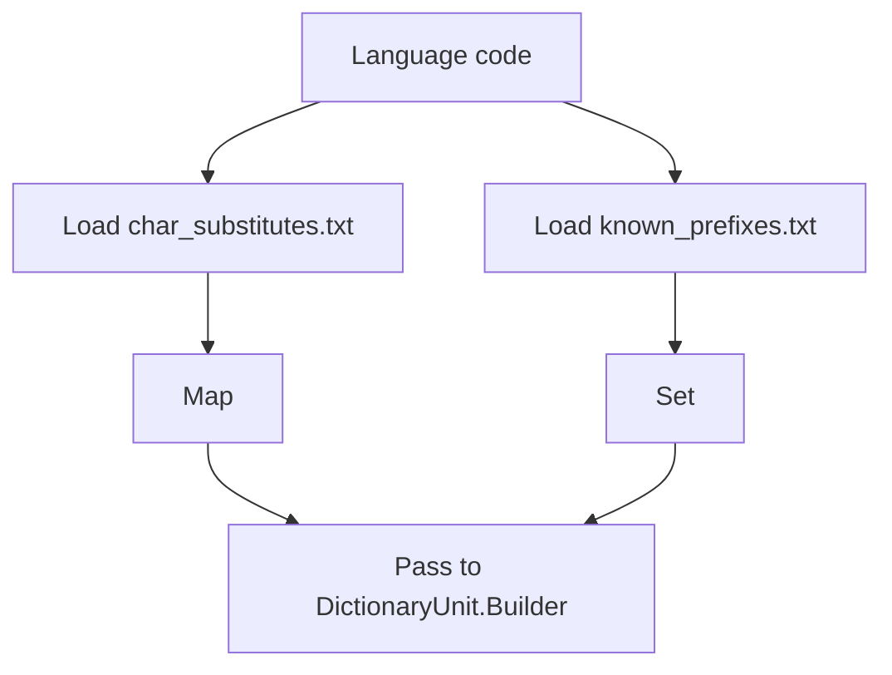
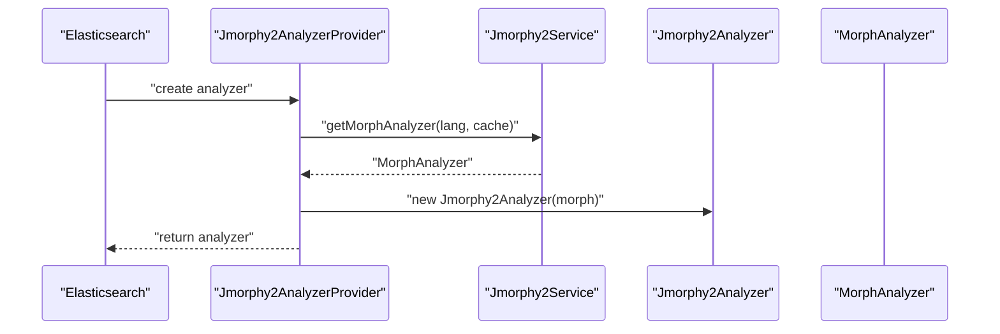
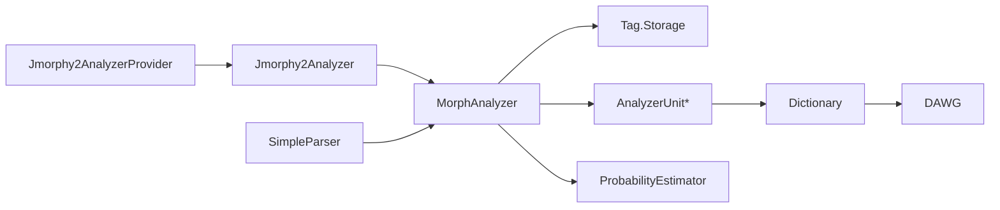
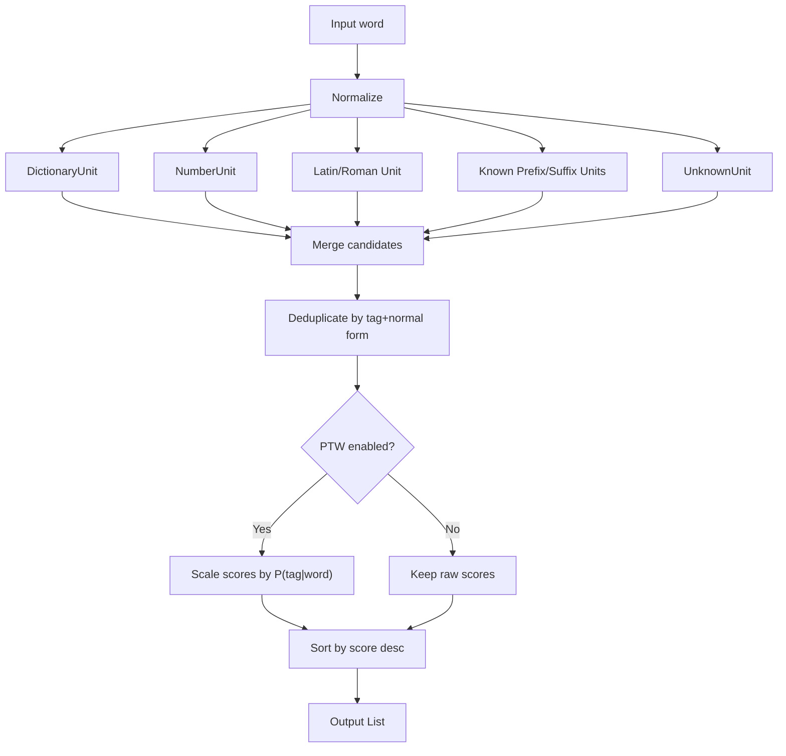

# System Design

<cite>
**Referenced Files in This Document**
- [MorphAnalyzer.java](file://jmorphy2-core/src/main/java/company/evo/jmorphy2/MorphAnalyzer.java)
- [Tag.java](file://jmorphy2-core/src/main/java/company/evo/jmorphy2/Tag.java)
- [ProbabilityEstimator.java](file://jmorphy2-core/src/main/java/company/evo/jmorphy2/ProbabilityEstimator.java)
- [ParsedWord.java](file://jmorphy2-core/src/main/java/company/evo/jmorphy2/ParsedWord.java)
- [AnalyzerUnit.java](file://jmorphy2-core/src/main/java/company/evo/jmorphy2/units/AnalyzerUnit.java)
- [DictionaryUnit.java](file://jmorphy2-core/src/main/java/company/evo/jmorphy2/units/DictionaryUnit.java)
- [UnknownUnit.java](file://jmorphy2-core/src/main/java/company/evo/jmorphy2/units/UnknownUnit.java)
- [NumberUnit.java](file://jmorphy2-core/src/main/java/company/evo/jmorphy2/units/NumberUnit.java)
- [Dictionary.java](file://jmorphy2-core/src/main/java/company/evo/jmorphy2/Dictionary.java)
- [Resources.java](file://jmorphy2-core/src/main/java/company/evo/jmorphy2/Resources.java)
- [FileLoader.java](file://jmorphy2-core/src/main/java/company/evo/jmorphy2/FileLoader.java)
- [DAWG.java](file://dawg/src/main/java/company/evo/dawg/DAWG.java)
- [SimpleParser.java](file://jmorphy2-nlp/src/main/java/company/evo/jmorphy2/nlp/SimpleParser.java)
- [Jmorphy2Analyzer.java](file://jmorphy2-lucene/src/main/java/company/evo/jmorphy2/lucene/Jmorphy2Analyzer.java)
- [Jmorphy2AnalyzerProvider.java](file://jmorphy2-elasticsearch/src/main/java/company/evo/jmorphy2/elasticsearch/index/Jmorphy2AnalyzerProvider.java)
</cite>

## Table of Contents
1. [Introduction](#introduction)
2. [Project Structure](#project-structure)
3. [Core Components](#core-components)
4. [Architecture Overview](#architecture-overview)
5. [Detailed Component Analysis](#detailed-component-analysis)
6. [Dependency Analysis](#dependency-analysis)
7. [Performance Considerations](#performance-considerations)
8. [Troubleshooting Guide](#troubleshooting-guide)
9. [Conclusion](#conclusion)
10. [Appendices](#appendices)

## Introduction
This document describes the system design of Jmorphy2’s core morphological analysis engine. It focuses on the central role of MorphAnalyzer as the orchestrator of the entire pipeline, the grammatical tagging system via Tag.Storage, the optional probability estimation mechanism, and the modular unit architecture that separates morphological analysis, grammatical tagging, and probabilistic scoring. It also explains how the builder pattern enables flexible configuration and how language-specific resources are integrated without coupling to core logic.

## Project Structure
Jmorphy2 is organized into several modules:
- jmorphy2-core: Core morphological analyzer, grammatical model, dictionary loading, and pipeline units
- dawg: Compressed automaton library used for dictionary and suffix lookups
- jmorphy2-nlp: Optional NLP components (parser, tagger, subject extraction) built on top of MorphAnalyzer
- jmorphy2-lucene: Lucene integration using MorphAnalyzer
- jmorphy2-elasticsearch: Elasticsearch plugin integrating Lucene analyzer with service discovery

```mermaid
graph TB
subgraph "Core"
MA["MorphAnalyzer"]
TU["Tag.Storage"]
PE["ProbabilityEstimator"]
PU["ParsedWord"]
AU["AnalyzerUnit"]
DU["DictionaryUnit"]
NU["NumberUnit"]
UU["UnknownUnit"]
DICT["Dictionary"]
RES["Resources"]
FL["FileLoader"]
end
subgraph "DAWG"
DAWG["DAWG"]
end
subgraph "Integration"
LUC["Jmorphy2Analyzer (Lucene)"]
ESH["Jmorphy2AnalyzerProvider (Elasticsearch)"]
NLP["SimpleParser (NLP)"]
end
MA --> TU
MA --> AU
MA --> PE
AU --> PU
DU --> DICT
DICT --> DAWG
DU --> TU
MA --> RES
MA --> FL
LUC --> MA
ESH --> LUC
NLP --> MA
```

**Diagram sources**
- [MorphAnalyzer.java:15-247](file://jmorphy2-core/src/main/java/company/evo/jmorphy2/MorphAnalyzer.java#L15-L247)
- [Tag.java:162-228](file://jmorphy2-core/src/main/java/company/evo/jmorphy2/Tag.java#L162-L228)
- [ProbabilityEstimator.java:9-26](file://jmorphy2-core/src/main/java/company/evo/jmorphy2/ProbabilityEstimator.java#L9-L26)
- [ParsedWord.java:9-88](file://jmorphy2-core/src/main/java/company/evo/jmorphy2/ParsedWord.java#L9-L88)
- [AnalyzerUnit.java:11-71](file://jmorphy2-core/src/main/java/company/evo/jmorphy2/units/AnalyzerUnit.java#L11-L71)
- [DictionaryUnit.java:14-104](file://jmorphy2-core/src/main/java/company/evo/jmorphy2/units/DictionaryUnit.java#L14-L104)
- [NumberUnit.java:10-54](file://jmorphy2-core/src/main/java/company/evo/jmorphy2/units/NumberUnit.java#L10-L54)
- [UnknownUnit.java:9-34](file://jmorphy2-core/src/main/java/company/evo/jmorphy2/units/UnknownUnit.java#L9-L34)
- [Dictionary.java:12-302](file://jmorphy2-core/src/main/java/company/evo/jmorphy2/Dictionary.java#L12-L302)
- [Resources.java:16-114](file://jmorphy2-core/src/main/java/company/evo/jmorphy2/Resources.java#L16-L114)
- [FileLoader.java:7-9](file://jmorphy2-core/src/main/java/company/evo/jmorphy2/FileLoader.java#L7-L9)
- [DAWG.java:13-39](file://dawg/src/main/java/company/evo/dawg/DAWG.java#L13-L39)
- [Jmorphy2Analyzer.java:17-42](file://jmorphy2-lucene/src/main/java/company/evo/jmorphy2/lucene/Jmorphy2Analyzer.java#L17-L42)
- [Jmorphy2AnalyzerProvider.java:29-52](file://jmorphy2-elasticsearch/src/main/java/company/evo/jmorphy2/elasticsearch/index/Jmorphy2AnalyzerProvider.java#L29-L52)
- [SimpleParser.java:15-176](file://jmorphy2-nlp/src/main/java/company/evo/jmorphy2/nlp/SimpleParser.java#L15-L176)

**Section sources**
- [MorphAnalyzer.java:15-247](file://jmorphy2-core/src/main/java/company/evo/jmorphy2/MorphAnalyzer.java#L15-L247)
- [Tag.java:162-228](file://jmorphy2-core/src/main/java/company/evo/jmorphy2/Tag.java#L162-L228)
- [ProbabilityEstimator.java:9-26](file://jmorphy2-core/src/main/java/company/evo/jmorphy2/ProbabilityEstimator.java#L9-L26)
- [ParsedWord.java:9-88](file://jmorphy2-core/src/main/java/company/evo/jmorphy2/ParsedWord.java#L9-L88)
- [AnalyzerUnit.java:11-71](file://jmorphy2-core/src/main/java/company/evo/jmorphy2/units/AnalyzerUnit.java#L11-L71)
- [DictionaryUnit.java:14-104](file://jmorphy2-core/src/main/java/company/evo/jmorphy2/units/DictionaryUnit.java#L14-L104)
- [NumberUnit.java:10-54](file://jmorphy2-core/src/main/java/company/evo/jmorphy2/units/NumberUnit.java#L10-L54)
- [UnknownUnit.java:9-34](file://jmorphy2-core/src/main/java/company/evo/jmorphy2/units/UnknownUnit.java#L9-L34)
- [Dictionary.java:12-302](file://jmorphy2-core/src/main/java/company/evo/jmorphy2/Dictionary.java#L12-L302)
- [Resources.java:16-114](file://jmorphy2-core/src/main/java/company/evo/jmorphy2/Resources.java#L16-L114)
- [FileLoader.java:7-9](file://jmorphy2-core/src/main/java/company/evo/jmorphy2/FileLoader.java#L7-L9)
- [DAWG.java:13-39](file://dawg/src/main/java/company/evo/dawg/DAWG.java#L13-L39)
- [Jmorphy2Analyzer.java:17-42](file://jmorphy2-lucene/src/main/java/company/evo/jmorphy2/lucene/Jmorphy2Analyzer.java#L17-L42)
- [Jmorphy2AnalyzerProvider.java:29-52](file://jmorphy2-elasticsearch/src/main/java/company/evo/jmorphy2/elasticsearch/index/Jmorphy2AnalyzerProvider.java#L29-L52)
- [SimpleParser.java:15-176](file://jmorphy2-nlp/src/main/java/company/evo/jmorphy2/nlp/SimpleParser.java#L15-L176)

## Core Components
- MorphAnalyzer: Central orchestrator that coordinates AnalyzerUnits, deduplicates results, optionally estimates probabilities, and sorts parses by score. It exposes APIs for normal forms, tags, and full parsing.
- Tag.Storage: Global registry for grammemes and tags. Normalizes and caches grammeme/tag instances, enabling efficient comparison and cross-language compatibility.
- ProbabilityEstimator: Loads a precomputed DAWG of P(tag|word) scores and provides per-parse confidence scaling.
- AnalyzerUnit and subclasses: Pluggable stages in the pipeline (dictionary lookup, numbers, punctuation, Latin, roman numerals, known/unknown prefixes/suffixes, unknown words).
- Dictionary and DAWG: Loads dictionary metadata, paradigms, grammatical tags, and compressed word/suffix structures for fast lookups.
- Resources and FileLoader: Provide language-specific character substitutions and known prefixes, and abstract file access for dictionaries.

**Section sources**
- [MorphAnalyzer.java:15-247](file://jmorphy2-core/src/main/java/company/evo/jmorphy2/MorphAnalyzer.java#L15-L247)
- [Tag.java:162-228](file://jmorphy2-core/src/main/java/company/evo/jmorphy2/Tag.java#L162-L228)
- [ProbabilityEstimator.java:9-26](file://jmorphy2-core/src/main/java/company/evo/jmorphy2/ProbabilityEstimator.java#L9-L26)
- [AnalyzerUnit.java:11-71](file://jmorphy2-core/src/main/java/company/evo/jmorphy2/units/AnalyzerUnit.java#L11-L71)
- [Dictionary.java:12-302](file://jmorphy2-core/src/main/java/company/evo/jmorphy2/Dictionary.java#L12-L302)
- [DAWG.java:13-39](file://dawg/src/main/java/company/evo/dawg/DAWG.java#L13-L39)
- [Resources.java:16-114](file://jmorphy2-core/src/main/java/company/evo/jmorphy2/Resources.java#L16-L114)
- [FileLoader.java:7-9](file://jmorphy2-core/src/main/java/company/evo/jmorphy2/FileLoader.java#L7-L9)

## Architecture Overview
The pipeline is a staged composition controlled by MorphAnalyzer. Each AnalyzerUnit contributes candidate analyses independently. Results are deduplicated, optionally scored by ProbabilityEstimator, and sorted. Tag.Storage ensures grammatical consistency across units and languages.



**Diagram sources**
- [MorphAnalyzer.java:178-245](file://jmorphy2-core/src/main/java/company/evo/jmorphy2/MorphAnalyzer.java#L178-L245)
- [AnalyzerUnit.java:46-46](file://jmorphy2-core/src/main/java/company/evo/jmorphy2/units/AnalyzerUnit.java#L46-L46)
- [ProbabilityEstimator.java:22-25](file://jmorphy2-core/src/main/java/company/evo/jmorphy2/ProbabilityEstimator.java#L22-L25)
- [Tag.java:162-228](file://jmorphy2-core/src/main/java/company/evo/jmorphy2/Tag.java#L162-L228)

## Detailed Component Analysis

### MorphAnalyzer: Orchestrator and Pipeline Controller
Responsibilities:
- Build pipeline from AnalyzerUnit builders
- Load dictionary metadata and language resources
- Coordinate parsing across units, early termination when requested
- Deduplicate parses and sort by score
- Optionally scale scores using P(tag|word) from ProbabilityEstimator
- Expose convenience APIs for normal forms and tags

Key design decisions:
- Builder pattern encapsulates construction and unit assembly, enabling language-specific defaults and overrides.
- Early termination semantics per unit allow prioritizing deterministic units (e.g., dictionary) to short-circuit analysis.
- Separation of scoring from analysis allows optional probability estimation.



**Diagram sources**
- [MorphAnalyzer.java:15-125](file://jmorphy2-core/src/main/java/company/evo/jmorphy2/MorphAnalyzer.java#L15-L125)
- [MorphAnalyzer.java:20-104](file://jmorphy2-core/src/main/java/company/evo/jmorphy2/MorphAnalyzer.java#L20-L104)
- [MorphAnalyzer.java:107-115](file://jmorphy2-core/src/main/java/company/evo/jmorphy2/MorphAnalyzer.java#L107-L115)

**Section sources**
- [MorphAnalyzer.java:15-247](file://jmorphy2-core/src/main/java/company/evo/jmorphy2/MorphAnalyzer.java#L15-L247)

### Tag.Storage: Grammatical Model Registry
Responsibilities:
- Normalize and cache grammemes and tags
- Resolve grammeme roots and parent-child relations
- Provide equality semantics based on normalized grammeme sets

Design:
- Immutable grammeme/tag instances stored by normalized keys
- Efficient lookup and comparison across the pipeline
- Enables cross-language grammatical consistency



**Diagram sources**
- [Tag.java:7-228](file://jmorphy2-core/src/main/java/company/evo/jmorphy2/Tag.java#L7-L228)

**Section sources**
- [Tag.java:7-228](file://jmorphy2-core/src/main/java/company/evo/jmorphy2/Tag.java#L7-L228)

### ProbabilityEstimator: Confidence Scoring
Responsibilities:
- Load P(tag|word) DAWG
- Compute per-parse probability for score re-weighting

Design:
- Uses IntegerDAWG for compact representation of counts scaled to float probabilities
- Key format combines lemma and tag string
- Optional: only enabled when dictionary metadata indicates PTW support



**Diagram sources**
- [ProbabilityEstimator.java:22-25](file://jmorphy2-core/src/main/java/company/evo/jmorphy2/ProbabilityEstimator.java#L22-L25)

**Section sources**
- [ProbabilityEstimator.java:9-26](file://jmorphy2-core/src/main/java/company/evo/jmorphy2/ProbabilityEstimator.java#L9-L26)

### AnalyzerUnit and Pipeline Units
Responsibilities:
- AnalyzerUnit: Abstract stage interface with termination and scoring semantics
- DictionaryUnit: Word lookup via DAWG, paradigm expansion, and lexeme generation
- NumberUnit: Numeric recognition and tagging
- UnknownUnit: Default tag for unknown tokens

Design:
- Each unit operates independently and returns lists of ParsedWord
- Terminating units signal early exit when matches are found
- Builders cache constructed units for reuse



**Diagram sources**
- [AnalyzerUnit.java:11-71](file://jmorphy2-core/src/main/java/company/evo/jmorphy2/units/AnalyzerUnit.java#L11-L71)
- [DictionaryUnit.java:14-104](file://jmorphy2-core/src/main/java/company/evo/jmorphy2/units/DictionaryUnit.java#L14-L104)
- [NumberUnit.java:10-54](file://jmorphy2-core/src/main/java/company/evo/jmorphy2/units/NumberUnit.java#L10-L54)
- [UnknownUnit.java:9-34](file://jmorphy2-core/src/main/java/company/evo/jmorphy2/units/UnknownUnit.java#L9-L34)

**Section sources**
- [AnalyzerUnit.java:11-71](file://jmorphy2-core/src/main/java/company/evo/jmorphy2/units/AnalyzerUnit.java#L11-L71)
- [DictionaryUnit.java:14-104](file://jmorphy2-core/src/main/java/company/evo/jmorphy2/units/DictionaryUnit.java#L14-L104)
- [NumberUnit.java:10-54](file://jmorphy2-core/src/main/java/company/evo/jmorphy2/units/NumberUnit.java#L10-L54)
- [UnknownUnit.java:9-34](file://jmorphy2-core/src/main/java/company/evo/jmorphy2/units/UnknownUnit.java#L9-L34)

### Dictionary and DAWG Integration
Responsibilities:
- Load dictionary metadata, paradigms, grammatical tag table, and suffix sets
- Provide fast word and suffix lookups via DAWG structures
- Build normal forms and tags from paradigm indices

Design:
- Dictionary.Builder loads resources via FileLoader and Tag.Storage
- DAWG-based structures enable compact and efficient lookups
- Paradigm-driven normal form construction decouples morphology from language specifics



**Diagram sources**
- [Dictionary.java:12-302](file://jmorphy2-core/src/main/java/company/evo/jmorphy2/Dictionary.java#L12-L302)
- [DAWG.java:13-39](file://dawg/src/main/java/company/evo/dawg/DAWG.java#L13-L39)

**Section sources**
- [Dictionary.java:12-302](file://jmorphy2-core/src/main/java/company/evo/jmorphy2/Dictionary.java#L12-L302)
- [DAWG.java:13-39](file://dawg/src/main/java/company/evo/dawg/DAWG.java#L13-L39)

### Resources and FileLoader
Responsibilities:
- Provide language-specific character substitution maps and known prefixes
- Abstract file access for dictionary resources

Design:
- Resources reads bundled resource files and normalizes content
- FileLoader enables pluggable resource backends (filesystem, classpath, etc.)



**Diagram sources**
- [Resources.java:16-114](file://jmorphy2-core/src/main/java/company/evo/jmorphy2/Resources.java#L16-L114)
- [FileLoader.java:7-9](file://jmorphy2-core/src/main/java/company/evo/jmorphy2/FileLoader.java#L7-L9)

**Section sources**
- [Resources.java:16-114](file://jmorphy2-core/src/main/java/company/evo/jmorphy2/Resources.java#L16-L114)
- [FileLoader.java:7-9](file://jmorphy2-core/src/main/java/company/evo/jmorphy2/FileLoader.java#L7-L9)

### Integration Points
- Lucene: Jmorphy2Analyzer composes a tokenizer with Jmorphy2StemFilter to apply morphological normalization during indexing/search.
- Elasticsearch: Jmorphy2AnalyzerProvider integrates Lucene analyzer into Elasticsearch via a service that supplies a configured MorphAnalyzer.



**Diagram sources**
- [Jmorphy2AnalyzerProvider.java:29-52](file://jmorphy2-elasticsearch/src/main/java/company/evo/jmorphy2/elasticsearch/index/Jmorphy2AnalyzerProvider.java#L29-L52)
- [Jmorphy2Analyzer.java:17-42](file://jmorphy2-lucene/src/main/java/company/evo/jmorphy2/lucene/Jmorphy2Analyzer.java#L17-L42)

**Section sources**
- [Jmorphy2AnalyzerProvider.java:29-52](file://jmorphy2-elasticsearch/src/main/java/company/evo/jmorphy2/elasticsearch/index/Jmorphy2AnalyzerProvider.java#L29-L52)
- [Jmorphy2Analyzer.java:17-42](file://jmorphy2-lucene/src/main/java/company/evo/jmorphy2/lucene/Jmorphy2Analyzer.java#L17-L42)

## Dependency Analysis
- MorphAnalyzer depends on Tag.Storage for grammatical resolution and optional ProbabilityEstimator for scoring.
- AnalyzerUnit implementations depend on Tag.Storage and Dictionary for paradigm-based analyses.
- Dictionary depends on DAWG structures and Tag.Storage for grammatical mapping.
- Integration modules (Lucene/Elasticsearch/NLP) depend on MorphAnalyzer but not on internal pipeline internals.



**Diagram sources**
- [MorphAnalyzer.java:15-247](file://jmorphy2-core/src/main/java/company/evo/jmorphy2/MorphAnalyzer.java#L15-L247)
- [AnalyzerUnit.java:11-71](file://jmorphy2-core/src/main/java/company/evo/jmorphy2/units/AnalyzerUnit.java#L11-L71)
- [Dictionary.java:12-302](file://jmorphy2-core/src/main/java/company/evo/jmorphy2/Dictionary.java#L12-L302)
- [DAWG.java:13-39](file://dawg/src/main/java/company/evo/dawg/DAWG.java#L13-L39)
- [Jmorphy2Analyzer.java:17-42](file://jmorphy2-lucene/src/main/java/company/evo/jmorphy2/lucene/Jmorphy2Analyzer.java#L17-L42)
- [Jmorphy2AnalyzerProvider.java:29-52](file://jmorphy2-elasticsearch/src/main/java/company/evo/jmorphy2/elasticsearch/index/Jmorphy2AnalyzerProvider.java#L29-L52)
- [SimpleParser.java:15-176](file://jmorphy2-nlp/src/main/java/company/evo/jmorphy2/nlp/SimpleParser.java#L15-L176)

**Section sources**
- [MorphAnalyzer.java:15-247](file://jmorphy2-core/src/main/java/company/evo/jmorphy2/MorphAnalyzer.java#L15-L247)
- [AnalyzerUnit.java:11-71](file://jmorphy2-core/src/main/java/company/evo/jmorphy2/units/AnalyzerUnit.java#L11-L71)
- [Dictionary.java:12-302](file://jmorphy2-core/src/main/java/company/evo/jmorphy2/Dictionary.java#L12-L302)
- [DAWG.java:13-39](file://dawg/src/main/java/company/evo/dawg/DAWG.java#L13-L39)
- [Jmorphy2Analyzer.java:17-42](file://jmorphy2-lucene/src/main/java/company/evo/jmorphy2/lucene/Jmorphy2Analyzer.java#L17-L42)
- [Jmorphy2AnalyzerProvider.java:29-52](file://jmorphy2-elasticsearch/src/main/java/company/evo/jmorphy2/elasticsearch/index/Jmorphy2AnalyzerProvider.java#L29-L52)
- [SimpleParser.java:15-176](file://jmorphy2-nlp/src/main/java/company/evo/jmorphy2/nlp/SimpleParser.java#L15-L176)

## Performance Considerations
- Early termination: Units marked terminate can short-circuit the pipeline when matches are found, reducing downstream work.
- Deduplication: Filtering by tag+normal form avoids redundant parses.
- Probabilistic scoring: Optional P(tag|word) reweighting trades CPU for quality; disable when throughput is prioritized.
- DAWG lookups: Compact structures minimize memory footprint and improve cache locality.
- Builder caching: AnalyzerUnit builders cache constructed units to avoid repeated initialization.

[No sources needed since this section provides general guidance]

## Troubleshooting Guide
Common issues and diagnostics:
- No results returned: Verify dictionary availability and language resources; check that the dictionary metadata indicates PTW support if probability scoring is expected.
- Unexpected tags: Inspect Tag.Storage normalization and grammeme roots; ensure language-specific char substitutions and known prefixes are loaded.
- Slow performance: Confirm early termination is effective; consider disabling probability estimation; review unit order and weights.
- Integration failures: Ensure MorphAnalyzer is properly constructed via the Builder and that FileLoader resolves dictionary files.

**Section sources**
- [MorphAnalyzer.java:178-245](file://jmorphy2-core/src/main/java/company/evo/jmorphy2/MorphAnalyzer.java#L178-L245)
- [Tag.java:162-228](file://jmorphy2-core/src/main/java/company/evo/jmorphy2/Tag.java#L162-L228)
- [Resources.java:16-114](file://jmorphy2-core/src/main/java/company/evo/jmorphy2/Resources.java#L16-L114)
- [FileLoader.java:7-9](file://jmorphy2-core/src/main/java/company/evo/jmorphy2/FileLoader.java#L7-L9)

## Conclusion
Jmorphy2’s core architecture centers on MorphAnalyzer as a configurable, modular orchestrator. The separation of morphological analysis (AnalyzerUnits), grammatical tagging (Tag.Storage), and optional probabilistic scoring (ProbabilityEstimator) yields a clean, extensible design. The builder pattern and language resource abstraction enable flexible configuration and easy integration with downstream systems like Lucene and Elasticsearch.

[No sources needed since this section summarizes without analyzing specific files]

## Appendices

### Pipeline Flow for a Single Word


**Diagram sources**
- [MorphAnalyzer.java:178-245](file://jmorphy2-core/src/main/java/company/evo/jmorphy2/MorphAnalyzer.java#L178-L245)
- [DictionaryUnit.java:56-65](file://jmorphy2-core/src/main/java/company/evo/jmorphy2/units/DictionaryUnit.java#L56-L65)
- [NumberUnit.java:31-52](file://jmorphy2-core/src/main/java/company/evo/jmorphy2/units/NumberUnit.java#L31-L52)
- [UnknownUnit.java:27-32](file://jmorphy2-core/src/main/java/company/evo/jmorphy2/units/UnknownUnit.java#L27-L32)
- [ProbabilityEstimator.java:22-25](file://jmorphy2-core/src/main/java/company/evo/jmorphy2/ProbabilityEstimator.java#L22-L25)