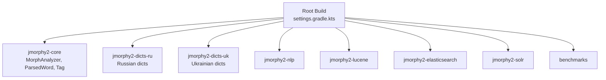
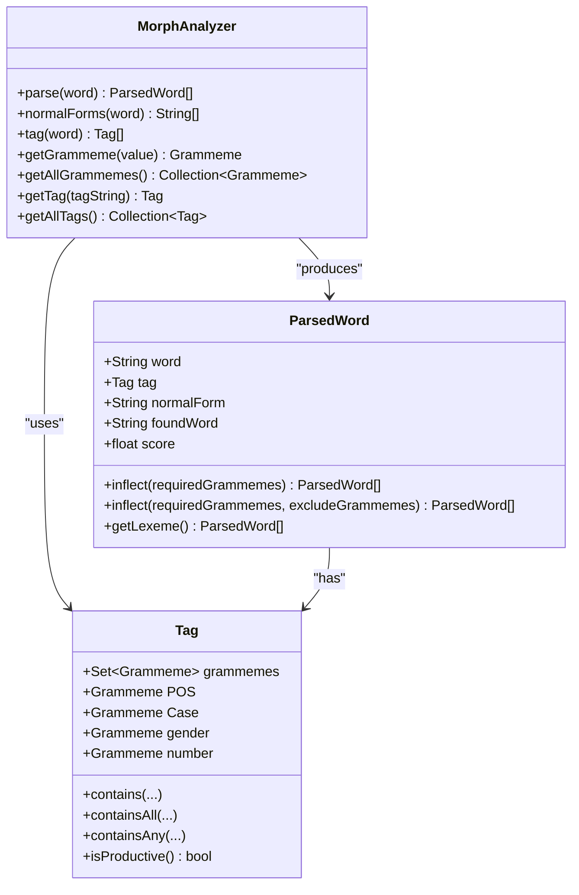
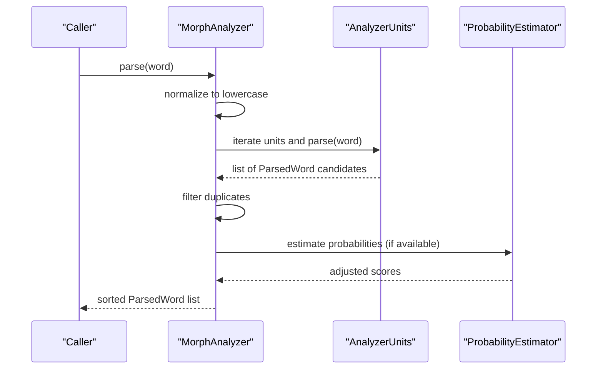
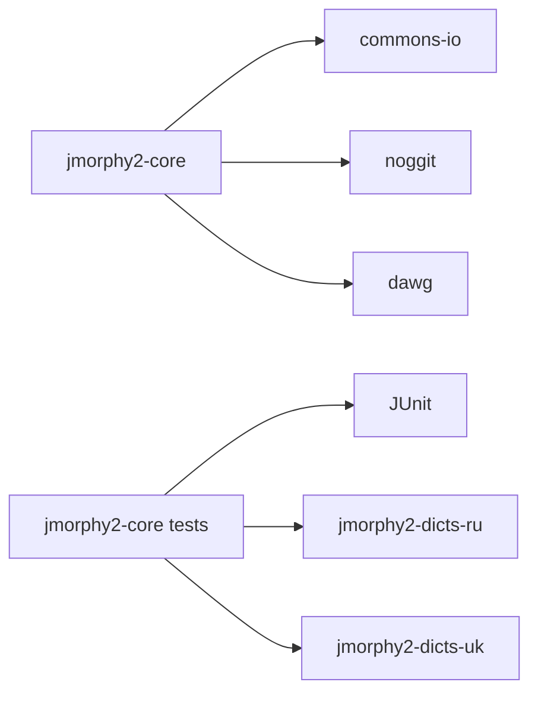

# Getting Started

<cite>
**Referenced Files in This Document**
- [README.md](file://README.md)
- [build.gradle.kts](file://build.gradle.kts)
- [settings.gradle.kts](file://settings.gradle.kts)
- [gradle-wrapper.properties](file://gradle/wrapper/gradle-wrapper.properties)
- [Versions.kt](file://buildSrc/src/main/kotlin/Versions.kt)
- [MorphAnalyzer.java](file://jmorphy2-core/src/main/java/company/evo/jmorphy2/MorphAnalyzer.java)
- [ParsedWord.java](file://jmorphy2-core/src/main/java/company/evo/jmorphy2/ParsedWord.java)
- [Tag.java](file://jmorphy2-core/src/main/java/company/evo/jmorphy2/Tag.java)
- [MorphAnalyzerRUTest.java](file://jmorphy2-core/src/test/java/company/evo/jmorphy2/MorphAnalyzerRUTest.java)
- [MorphAnalyzerUkTest.java](file://jmorphy2-core/src/test/java/company/evo/jmorphy2/MorphAnalyzerUkTest.java)
- [Jmorphy2TestsHelpers.java](file://jmorphy2-core/src/test/java/company/evo/jmorphy2/Jmorphy2TestsHelpers.java)
- [jmorphy2-dicts-ru README.md](file://jmorphy2-dicts-ru/README.md)
- [jmorphy2-dicts-uk README.md](file://jmorphy2-dicts-uk/README.md)
- [project.version](file://project.version)
</cite>

## Table of Contents
1. [Introduction](#introduction)
2. [Project Structure](#project-structure)
3. [Core Components](#core-components)
4. [Architecture Overview](#architecture-overview)
5. [Detailed Component Analysis](#detailed-component-analysis)
6. [Dependency Analysis](#dependency-analysis)
7. [Performance Considerations](#performance-considerations)
8. [Troubleshooting Guide](#troubleshooting-guide)
9. [Conclusion](#conclusion)
10. [Appendices](#appendices)

## Introduction
This guide helps you quickly set up Jmorphy2, build the project, run tests, and perform morphological analysis on Russian and Ukrainian text. It covers prerequisites, cloning and building with Gradle, running the included tests, and understanding the core APIs for parsing words and sentences. You will also learn basic configuration options and see expected output formats.

## Project Structure
Jmorphy2 is a multi-module Gradle project. The most relevant module for morphological analysis is jmorphy2-core, which contains the analyzer and related types. Language-specific dictionary artifacts are provided by jmorphy2-dicts-ru and jmorphy2-dicts-uk. The top-level build applies shared Java settings across subprojects.

**Diagram sources**
- [settings.gradle.kts:1-12](file://settings.gradle.kts#L1-L12)

**Section sources**
- [settings.gradle.kts:1-12](file://settings.gradle.kts#L1-L12)
- [build.gradle.kts:1-21](file://build.gradle.kts#L1-L21)

## Core Components
- MorphAnalyzer: The central API for morphological analysis. It exposes methods to parse single words, compute normal forms, retrieve tags, and inflect forms.
- ParsedWord: Represents a single analysis hypothesis with the surface form, normal form, tag, and score.
- Tag: Encapsulates morphological features (part of speech, case, gender, number, etc.) and provides lookup and filtering helpers.

Key capabilities demonstrated by tests:
- Parsing Russian and Ukrainian words and sentences
- Extracting normal forms
- Retrieving grammeme and tag information
- Inflecting forms by required and excluded grammemes
- Accessing lexical paradigms (lexeme)

**Section sources**
- [MorphAnalyzer.java:15-247](file://jmorphy2-core/src/main/java/company/evo/jmorphy2/MorphAnalyzer.java#L15-L247)
- [ParsedWord.java:9-89](file://jmorphy2-core/src/main/java/company/evo/jmorphy2/ParsedWord.java#L9-L89)
- [Tag.java:7-230](file://jmorphy2-core/src/main/java/company/evo/jmorphy2/Tag.java#L7-L230)

## Architecture Overview
The analyzer composes multiple AnalyzerUnits (dictionary, numbers, punctuation, Latin, Roman numerals, known prefixes/suffixes, unknown prefixes/suffixes, and unknown words) and ranks hypotheses by score and optional probability estimation.

**Diagram sources**
- [MorphAnalyzer.java:15-247](file://jmorphy2-core/src/main/java/company/evo/jmorphy2/MorphAnalyzer.java#L15-L247)
- [ParsedWord.java:9-89](file://jmorphy2-core/src/main/java/company/evo/jmorphy2/ParsedWord.java#L9-L89)
- [Tag.java:7-230](file://jmorphy2-core/src/main/java/company/evo/jmorphy2/Tag.java#L7-L230)

## Detailed Component Analysis

### Quick Setup and First Run
- Prerequisites
  - Java: The project targets Java 17. Ensure your environment matches the configured version.
  - Gradle: The wrapper distribution is provided; Gradle 8.10 is bundled.
- Clone and build
  - Clone the repository and run the Gradle build to compile, package, and run tests.
- Verify with tests
  - The Russian and Ukrainian test suites demonstrate parsing, normal forms, tags, and inflection.

Step-by-step:
1. Install prerequisites (Java 17+ and Git).
2. Clone the repository.
3. Open a terminal in the project root.
4. Run the Gradle build to compile and execute tests.
5. Review the Russian and Ukrainian test outputs to confirm successful setup.

What to expect:
- Tests exercise parsing of Russian and Ukrainian words, normal forms, tags, and lexeme generation.
- The tests show expected output formats and grammeme/tag usage.

**Section sources**
- [README.md:8-19](file://README.md#L8-L19)
- [Versions.kt:36](file://buildSrc/src/main/kotlin/Versions.kts#L36)
- [gradle-wrapper.properties:1-6](file://gradle/wrapper/gradle-wrapper.properties#L1-L6)
- [MorphAnalyzerRUTest.java:30-142](file://jmorphy2-core/src/test/java/company/evo/jmorphy2/MorphAnalyzerRUTest.java#L30-L142)
- [MorphAnalyzerUkTest.java:30-67](file://jmorphy2-core/src/test/java/company/evo/jmorphy2/MorphAnalyzerUkTest.java#L30-L67)

### Essential Dependencies and Prerequisites
- Java 17 is the configured source/target compatibility.
- Gradle wrapper is configured to use Gradle 8.10.
- The core module depends on commons-io, noggit, and the internal dawg module.
- Test dependencies include JUnit and the Russian/Ukrainian dictionary modules.

**Section sources**
- [build.gradle.kts:16-20](file://build.gradle.kts#L16-L20)
- [gradle-wrapper.properties:1-6](file://gradle/wrapper/gradle-wrapper.properties#L1-L6)
- [Versions.kt:36](file://buildSrc/src/main/kotlin/Versions.kts#L36)
- [jmorphy2-core/build.gradle.kts:5-14](file://jmorphy2-core/build.gradle.kts#L5-L14)

### Basic Configuration Options
- Dictionary loading
  - The analyzer builder supports specifying a dictionary path or using a resource-based loader. Tests use a resource loader pointing to packaged dictionary resources.
- Character substitution
  - You can supply character substitutions (e.g., for handling variants like ё vs е) via the builder.
- Language selection
  - Tests initialize analyzers for Russian ("ru") and Ukrainian ("uk").

Example configuration pattern (described):
- Initialize an analyzer with a resource-based loader for the desired language.
- Optionally pass character substitutions for language-specific normalization.
- Build the analyzer and use parse(), normalForms(), tag(), and inflect().

**Section sources**
- [MorphAnalyzer.java:20-104](file://jmorphy2-core/src/main/java/company/evo/jmorphy2/MorphAnalyzer.java#L20-L104)
- [Jmorphy2TestsHelpers.java:7-19](file://jmorphy2-core/src/test/java/company/evo/jmorphy2/Jmorphy2TestsHelpers.java#L7-L19)

### Common Usage Patterns
- Parse a single word
  - Call parse() to obtain a list of ParsedWord candidates ordered by score.
- Get normal forms
  - Use normalForms() to retrieve unique base forms for a word.
- Retrieve tags
  - Use tag() to get the Tag objects associated with each candidate.
- Inflect forms
  - Use inflect() with required and/or excluded grammemes to generate paradigms.
- Access lexeme
  - Use getLexeme() on a ParsedWord to enumerate paradigm forms.

Expected output formats (described):
- ParsedWord includes the surface word, normal form, found word, tag, and score.
- Tags represent morphological features (e.g., part of speech, case, gender, number).
- Normal forms are deduplicated lists of base forms.

**Section sources**
- [MorphAnalyzer.java:143-200](file://jmorphy2-core/src/main/java/company/evo/jmorphy2/MorphAnalyzer.java#L143-L200)
- [ParsedWord.java:12-24](file://jmorphy2-core/src/main/java/company/evo/jmorphy2/ParsedWord.java#L12-L24)
- [Tag.java:41-73](file://jmorphy2-core/src/main/java/company/evo/jmorphy2/Tag.java#L41-L73)

### Running Basic Tests
- Build and test
  - Use the Gradle wrapper to build the project and run tests.
- Russian tests
  - Exercises parsing, normal forms, tags, lexeme generation, and inflection for Russian.
- Ukrainian tests
  - Exercises parsing, lexeme generation, and inflection for Ukrainian.

**Section sources**
- [README.md:15-19](file://README.md#L15-L19)
- [MorphAnalyzerRUTest.java:30-308](file://jmorphy2-core/src/test/java/company/evo/jmorphy2/MorphAnalyzerRUTest.java#L30-L308)
- [MorphAnalyzerUkTest.java:30-175](file://jmorphy2-core/src/test/java/company/evo/jmorphy2/MorphAnalyzerUkTest.java#L30-L175)

### Parsing Examples: Russian and Ukrainian
- Russian examples
  - Demonstrates parsing adjectives, nouns, adverbs, numbers, punctuation, Latin, Roman numerals, and unknown words.
  - Shows normal forms and lexeme enumeration.
- Ukrainian examples
  - Demonstrates parsing nouns, adjectives, and hyphenated compounds.
  - Shows lexeme enumeration and handling of apostrophe variants.

Note: The tests assert expected outputs and grammeme/tag checks.

**Section sources**
- [MorphAnalyzerRUTest.java:30-142](file://jmorphy2-core/src/test/java/company/evo/jmorphy2/MorphAnalyzerRUTest.java#L30-L142)
- [MorphAnalyzerUkTest.java:30-67](file://jmorphy2-core/src/test/java/company/evo/jmorphy2/MorphAnalyzerUkTest.java#L30-L67)

### Sequence: How parse() Works Internally

**Diagram sources**
- [MorphAnalyzer.java:178-245](file://jmorphy2-core/src/main/java/company/evo/jmorphy2/MorphAnalyzer.java#L178-L245)

## Dependency Analysis
- Module dependencies
  - jmorphy2-core depends on commons-io, noggit, and the dawg module.
  - Tests depend on JUnit and the Russian/Ukrainian dictionary modules.
- Version management
  - Java 17 is the target.
  - Gradle wrapper pins Gradle 8.10.
  - Library version is derived from project.version.

**Diagram sources**
- [jmorphy2-core/build.gradle.kts:5-14](file://jmorphy2-core/build.gradle.kts#L5-L14)
- [Versions.kt:36](file://buildSrc/src/main/kotlin/Versions.kts#L36)
- [gradle-wrapper.properties:1-6](file://gradle/wrapper/gradle-wrapper.properties#L1-L6)
- [project.version:1-2](file://project.version#L1-L2)

**Section sources**
- [jmorphy2-core/build.gradle.kts:5-14](file://jmorphy2-core/build.gradle.kts#L5-L14)
- [Versions.kt:36](file://buildSrc/src/main/kotlin/Versions.kts#L36)
- [gradle-wrapper.properties:1-6](file://gradle/wrapper/gradle-wrapper.properties#L1-L6)
- [project.version:1-2](file://project.version#L1-L2)

## Performance Considerations
- The analyzer ranks candidates by score and optionally refines scores using probability estimation when available.
- Duplicate hypotheses are filtered to reduce redundant results.
- For production workloads, consider caching frequently analyzed words and reusing a single analyzer instance.

**Section sources**
- [MorphAnalyzer.java:202-245](file://jmorphy2-core/src/main/java/company/evo/jmorphy2/MorphAnalyzer.java#L202-L245)

## Troubleshooting Guide
- Java version mismatch
  - Ensure your JDK is Java 17 to match the project configuration.
- Gradle wrapper issues
  - The wrapper is configured to use Gradle 8.10; if you encounter issues, verify your Gradle installation or rely on the wrapper.
- Missing dictionaries
  - Tests use a resource-based loader for dictionary resources. Confirm that the Russian/Ukrainian dictionary modules are present and included in the test runtime.
- Unexpected empty results
  - Unknown words are tagged as UNKN; verify input spelling and consider character substitutions for language-specific variants.
- Tag/grammeme mismatches
  - Use getTag() and getGrammeme() to resolve canonical forms and verify grammeme presence.

**Section sources**
- [Versions.kt:36](file://buildSrc/src/main/kotlin/Versions.kts#L36)
- [gradle-wrapper.properties:1-6](file://gradle/wrapper/gradle-wrapper.properties#L1-L6)
- [jmorphy2-dicts-ru README.md:1-10](file://jmorphy2-dicts-ru/README.md#L1-L10)
- [jmorphy2-dicts-uk README.md:1-12](file://jmorphy2-dicts-uk/README.md#L1-L12)
- [MorphAnalyzer.java:127-141](file://jmorphy2-core/src/main/java/company/evo/jmorphy2/MorphAnalyzer.java#L127-L141)

## Conclusion
You now have the essentials to set up Jmorphy2, build the project, run tests, and perform morphological analysis on Russian and Ukrainian text. Use the analyzer’s parse(), normalForms(), tag(), and inflect() methods to explore word analyses and paradigms. Refer to the tests for expected output formats and grammeme/tag usage.

## Appendices

### Appendix A: Step-by-Step First-Time Setup
1. Install prerequisites: Java 17+ and Git.
2. Clone the repository.
3. Open a terminal in the project root.
4. Run the Gradle build to compile and execute tests.
5. Explore Russian and Ukrainian test outputs to confirm operation.
6. Initialize an analyzer with a resource-based loader for the desired language and use parse()/normalForms()/tag()/inflect().

**Section sources**
- [README.md:8-19](file://README.md#L8-L19)
- [MorphAnalyzerRUTest.java:30-142](file://jmorphy2-core/src/test/java/company/evo/jmorphy2/MorphAnalyzerRUTest.java#L30-L142)
- [MorphAnalyzerUkTest.java:30-67](file://jmorphy2-core/src/test/java/company/evo/jmorphy2/MorphAnalyzerUkTest.java#L30-L67)