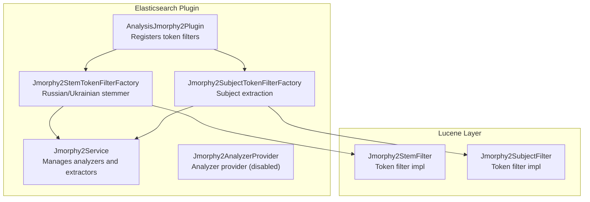
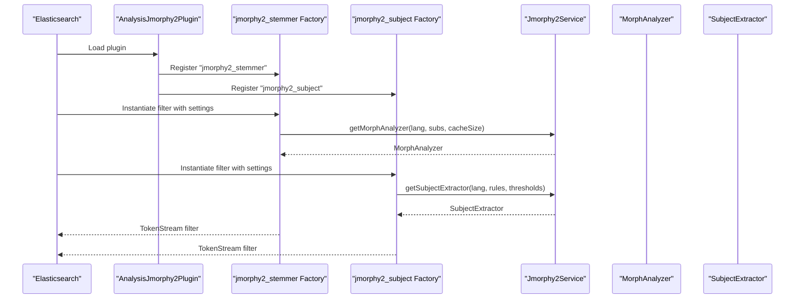
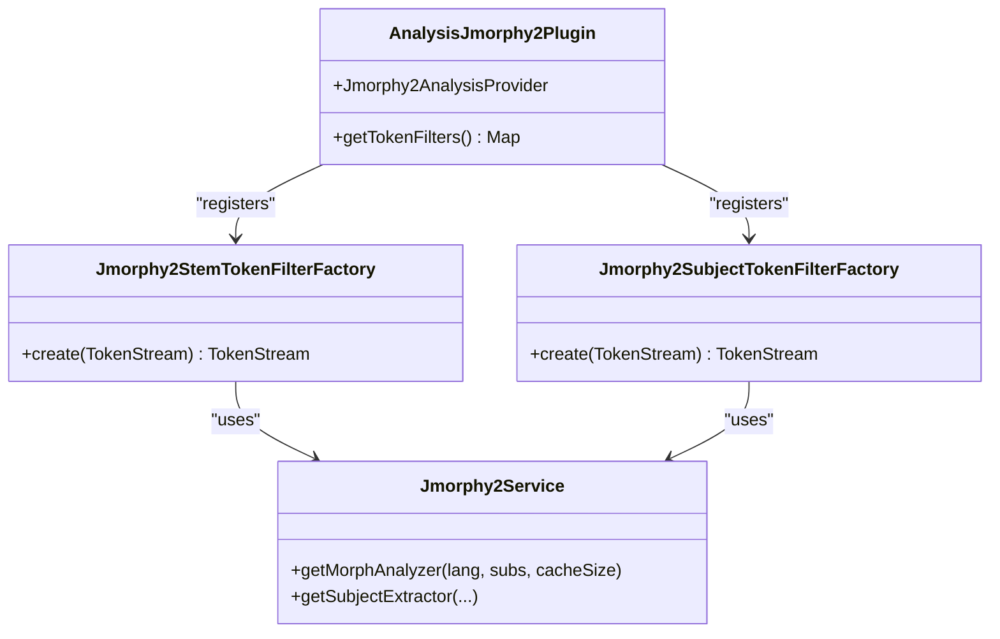
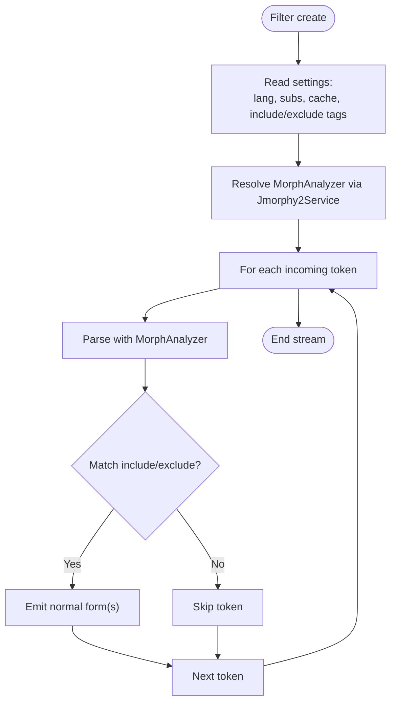
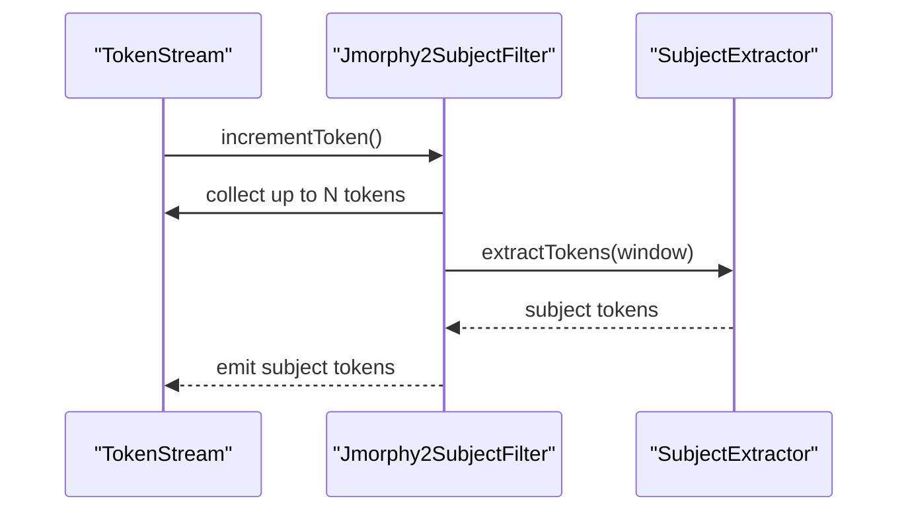
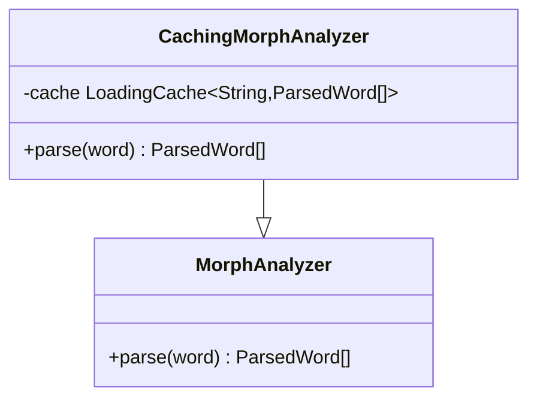
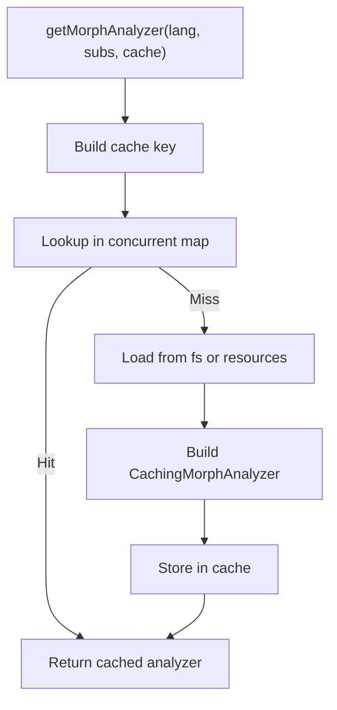
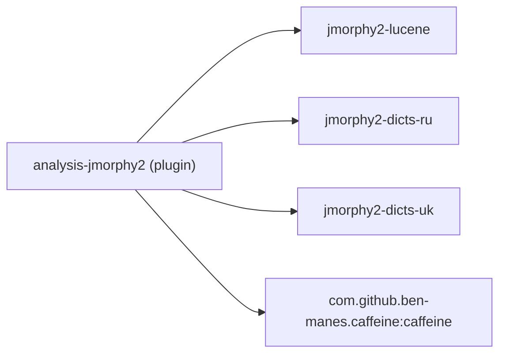

# Elasticsearch Integration

<cite>
**Referenced Files in This Document**
- [AnalysisJmorphy2Plugin.java](file://jmorphy2-elasticsearch/src/main/java/company/evo/jmorphy2/elasticsearch/plugin/AnalysisJmorphy2Plugin.java)
- [Jmorphy2AnalyzerProvider.java](file://jmorphy2-elasticsearch/src/main/java/company/evo/jmorphy2/elasticsearch/index/Jmorphy2AnalyzerProvider.java)
- [Jmorphy2StemTokenFilterFactory.java](file://jmorphy2-elasticsearch/src/main/java/company/evo/jmorphy2/elasticsearch/index/Jmorphy2StemTokenFilterFactory.java)
- [Jmorphy2SubjectTokenFilterFactory.java](file://jmorphy2-elasticsearch/src/main/java/company/evo/jmorphy2/elasticsearch/index/Jmorphy2SubjectTokenFilterFactory.java)
- [CachingMorphAnalyzer.java](file://jmorphy2-elasticsearch/src/main/java/company/evo/jmorphy2/elasticsearch/indices/CachingMorphAnalyzer.java)
- [Jmorphy2Service.java](file://jmorphy2-elasticsearch/src/main/java/company/evo/jmorphy2/elasticsearch/indices/Jmorphy2Service.java)
- [Jmorphy2StemFilter.java](file://jmorphy2-lucene/src/main/java/company/evo/jmorphy2/lucene/Jmorphy2StemFilter.java)
- [Jmorphy2SubjectFilter.java](file://jmorphy2-lucene/src/main/java/company/evo/jmorphy2/lucene/Jmorphy2SubjectFilter.java)
- [build.gradle.kts](file://jmorphy2-elasticsearch/build.gradle.kts)
- [README.md](file://README.md)
- [ES_8.x_Migration_Report_06a5fe0f.md](file://ES_8.x_Migration_Report_06a5fe0f.md)
- [Jmorphy2StemTokenFilterFactoryTests.java](file://jmorphy2-elasticsearch/src/test/java/company/evo/jmorphy2/elasticsearch/index/Jmorphy2StemTokenFilterFactoryTests.java)
- [Jmorphy2SubjectTokenFilterFactoryTests.java](file://jmorphy2-elasticsearch/src/test/java/company/evo/jmorphy2/elasticsearch/index/Jmorphy2SubjectTokenFilterFactoryTests.java)
- [Utils.java](file://jmorphy2-elasticsearch/src/test/java/company/evo/jmorphy2/elasticsearch/index/Utils.java)
</cite>

## Table of Contents
1. [Introduction](#introduction)
2. [Project Structure](#project-structure)
3. [Core Components](#core-components)
4. [Architecture Overview](#architecture-overview)
5. [Detailed Component Analysis](#detailed-component-analysis)
6. [Dependency Analysis](#dependency-analysis)
7. [Performance Considerations](#performance-considerations)
8. [Troubleshooting Guide](#troubleshooting-guide)
9. [Conclusion](#conclusion)
10. [Appendices](#appendices)

## Introduction
This document explains the Jmorphy2 Elasticsearch integration module. It covers the plugin architecture, custom analyzer providers, token filter factories, configuration patterns for Russian and Ukrainian morphological processing, caching mechanisms for performance, installation and compatibility, and guidance for extending the plugin and integrating with existing deployments.

## Project Structure
The Elasticsearch integration resides in the jmorphy2-elasticsearch module. It registers token filters, exposes a service to supply morphological analyzers and subject extractors, and integrates with the Lucene-based analyzers and filters from jmorphy2-lucene.

**Diagram sources**
- [AnalysisJmorphy2Plugin.java:34-67](file://jmorphy2-elasticsearch/src/main/java/company/evo/jmorphy2/elasticsearch/plugin/AnalysisJmorphy2Plugin.java#L34-L67)
- [Jmorphy2Service.java:44-76](file://jmorphy2-elasticsearch/src/main/java/company/evo/jmorphy2/elasticsearch/indices/Jmorphy2Service.java#L44-L76)
- [Jmorphy2AnalyzerProvider.java:29-52](file://jmorphy2-elasticsearch/src/main/java/company/evo/jmorphy2/elasticsearch/index/Jmorphy2AnalyzerProvider.java#L29-L52)
- [Jmorphy2StemTokenFilterFactory.java:37-72](file://jmorphy2-elasticsearch/src/main/java/company/evo/jmorphy2/elasticsearch/index/Jmorphy2StemTokenFilterFactory.java#L37-L72)
- [Jmorphy2SubjectTokenFilterFactory.java:35-77](file://jmorphy2-elasticsearch/src/main/java/company/evo/jmorphy2/elasticsearch/index/Jmorphy2SubjectTokenFilterFactory.java#L35-L77)
- [Jmorphy2StemFilter.java:21-184](file://jmorphy2-lucene/src/main/java/company/evo/jmorphy2/lucene/Jmorphy2StemFilter.java#L21-L184)
- [Jmorphy2SubjectFilter.java:17-86](file://jmorphy2-lucene/src/main/java/company/evo/jmorphy2/lucene/Jmorphy2SubjectFilter.java#L17-L86)

**Section sources**
- [AnalysisJmorphy2Plugin.java:34-67](file://jmorphy2-elasticsearch/src/main/java/company/evo/jmorphy2/elasticsearch/plugin/AnalysisJmorphy2Plugin.java#L34-L67)
- [build.gradle.kts:18-26](file://jmorphy2-elasticsearch/build.gradle.kts#L18-L26)

## Core Components
- AnalysisJmorphy2Plugin: Registers token filters for stemming and subject extraction.
- Jmorphy2Service: Central factory for MorphAnalyzer and SubjectExtractor instances, with caching and resource resolution.
- Jmorphy2StemTokenFilterFactory: Configurable stemmer for Russian and Ukrainian with include/exclude grammeme filtering and cache sizing.
- Jmorphy2SubjectTokenFilterFactory: Subject extraction filter backed by tagger, parser, and extractor rules.
- CachingMorphAnalyzer: Wraps a morphological analyzer with a cache for parsed words to improve throughput.
- Jmorphy2StemFilter and Jmorphy2SubjectFilter: Concrete Lucene token filters implementing stemming and subject extraction.

**Section sources**
- [AnalysisJmorphy2Plugin.java:34-67](file://jmorphy2-elasticsearch/src/main/java/company/evo/jmorphy2/elasticsearch/plugin/AnalysisJmorphy2Plugin.java#L34-L67)
- [Jmorphy2Service.java:44-168](file://jmorphy2-elasticsearch/src/main/java/company/evo/jmorphy2/elasticsearch/indices/Jmorphy2Service.java#L44-L168)
- [Jmorphy2StemTokenFilterFactory.java:37-72](file://jmorphy2-elasticsearch/src/main/java/company/evo/jmorphy2/elasticsearch/index/Jmorphy2StemTokenFilterFactory.java#L37-L72)
- [Jmorphy2SubjectTokenFilterFactory.java:35-77](file://jmorphy2-elasticsearch/src/main/java/company/evo/jmorphy2/elasticsearch/index/Jmorphy2SubjectTokenFilterFactory.java#L35-L77)
- [CachingMorphAnalyzer.java:19-63](file://jmorphy2-elasticsearch/src/main/java/company/evo/jmorphy2/elasticsearch/indices/CachingMorphAnalyzer.java#L19-L63)
- [Jmorphy2StemFilter.java:21-184](file://jmorphy2-lucene/src/main/java/company/evo/jmorphy2/lucene/Jmorphy2StemFilter.java#L21-L184)
- [Jmorphy2SubjectFilter.java:17-86](file://jmorphy2-lucene/src/main/java/company/evo/jmorphy2/lucene/Jmorphy2SubjectFilter.java#L17-L86)

## Architecture Overview
The plugin integrates with Elasticsearch’s analysis framework. Token filters are registered under names and later referenced by analyzers. The Jmorphy2Service resolves dictionaries and rules from filesystem or embedded resources, constructs analyzers and extractors, and caches them keyed by configuration.

**Diagram sources**
- [AnalysisJmorphy2Plugin.java:42-56](file://jmorphy2-elasticsearch/src/main/java/company/evo/jmorphy2/elasticsearch/plugin/AnalysisJmorphy2Plugin.java#L42-L56)
- [Jmorphy2StemTokenFilterFactory.java:45-66](file://jmorphy2-elasticsearch/src/main/java/company/evo/jmorphy2/elasticsearch/index/Jmorphy2StemTokenFilterFactory.java#L45-L66)
- [Jmorphy2SubjectTokenFilterFactory.java:39-71](file://jmorphy2-elasticsearch/src/main/java/company/evo/jmorphy2/elasticsearch/index/Jmorphy2SubjectTokenFilterFactory.java#L39-L71)
- [Jmorphy2Service.java:61-76](file://jmorphy2-elasticsearch/src/main/java/company/evo/jmorphy2/elasticsearch/indices/Jmorphy2Service.java#L61-L76)

## Detailed Component Analysis

### Plugin Registration and Providers
- The plugin implements the Elasticsearch AnalysisPlugin interface and registers two token filters: jmorphy2_stemmer and jmorphy2_subject.
- Token filter factories receive a Jmorphy2Service instance to construct morphological analyzers and extractors.
- An analyzer provider for a combined analyzer is present but intentionally disabled in the current implementation.

**Diagram sources**
- [AnalysisJmorphy2Plugin.java:34-67](file://jmorphy2-elasticsearch/src/main/java/company/evo/jmorphy2/elasticsearch/plugin/AnalysisJmorphy2Plugin.java#L34-L67)
- [Jmorphy2StemTokenFilterFactory.java:37-72](file://jmorphy2-elasticsearch/src/main/java/company/evo/jmorphy2/elasticsearch/index/Jmorphy2StemTokenFilterFactory.java#L37-L72)
- [Jmorphy2SubjectTokenFilterFactory.java:35-77](file://jmorphy2-elasticsearch/src/main/java/company/evo/jmorphy2/elasticsearch/index/Jmorphy2SubjectTokenFilterFactory.java#L35-L77)
- [Jmorphy2Service.java:44-76](file://jmorphy2-elasticsearch/src/main/java/company/evo/jmorphy2/elasticsearch/indices/Jmorphy2Service.java#L44-L76)

**Section sources**
- [AnalysisJmorphy2Plugin.java:34-67](file://jmorphy2-elasticsearch/src/main/java/company/evo/jmorphy2/elasticsearch/plugin/AnalysisJmorphy2Plugin.java#L34-L67)
- [Jmorphy2AnalyzerProvider.java:29-52](file://jmorphy2-elasticsearch/src/main/java/company/evo/jmorphy2/elasticsearch/index/Jmorphy2AnalyzerProvider.java#L29-L52)

### Stemming Filter Configuration and Behavior
- Configuration keys include lang, char_substitutes_path, cache_size, include_tags, exclude_tags.
- The filter parses tokens using a MorphAnalyzer and emits normalized forms filtered by grammemes.
- Defaults include a cache size and optional character substitution rules.

**Diagram sources**
- [Jmorphy2StemTokenFilterFactory.java:45-66](file://jmorphy2-elasticsearch/src/main/java/company/evo/jmorphy2/elasticsearch/index/Jmorphy2StemTokenFilterFactory.java#L45-L66)
- [Jmorphy2StemFilter.java:123-164](file://jmorphy2-lucene/src/main/java/company/evo/jmorphy2/lucene/Jmorphy2StemFilter.java#L123-L164)

**Section sources**
- [Jmorphy2StemTokenFilterFactory.java:37-72](file://jmorphy2-elasticsearch/src/main/java/company/evo/jmorphy2/elasticsearch/index/Jmorphy2StemTokenFilterFactory.java#L37-L72)
- [Jmorphy2StemFilter.java:21-184](file://jmorphy2-lucene/src/main/java/company/evo/jmorphy2/lucene/Jmorphy2StemFilter.java#L21-L184)

### Subject Extraction Filter Configuration and Behavior
- Configuration keys include lang, char_substitutes_path, analyzer_cache_size, tagger_rules_path, parser_rules_path, extractor_rules_path, tagger_threshold, parser_threshold, max_sentence_length.
- The filter builds a sentence window up to max_sentence_length and extracts subject tokens using a SubjectExtractor.

**Diagram sources**
- [Jmorphy2SubjectTokenFilterFactory.java:39-71](file://jmorphy2-elasticsearch/src/main/java/company/evo/jmorphy2/elasticsearch/index/Jmorphy2SubjectTokenFilterFactory.java#L39-L71)
- [Jmorphy2SubjectFilter.java:50-76](file://jmorphy2-lucene/src/main/java/company/evo/jmorphy2/lucene/Jmorphy2SubjectFilter.java#L50-L76)

**Section sources**
- [Jmorphy2SubjectTokenFilterFactory.java:35-77](file://jmorphy2-elasticsearch/src/main/java/company/evo/jmorphy2/elasticsearch/index/Jmorphy2SubjectTokenFilterFactory.java#L35-L77)
- [Jmorphy2SubjectFilter.java:17-86](file://jmorphy2-lucene/src/main/java/company/evo/jmorphy2/lucene/Jmorphy2SubjectFilter.java#L17-L86)

### Caching Mechanisms with CachingMorphAnalyzer
- CachingMorphAnalyzer wraps a MorphAnalyzer and caches parsed word results using a LoadingCache with a configurable maximum size.
- The cache is built with privileged access and uses the underlying parse method as the loader.

**Diagram sources**
- [CachingMorphAnalyzer.java:19-63](file://jmorphy2-elasticsearch/src/main/java/company/evo/jmorphy2/elasticsearch/indices/CachingMorphAnalyzer.java#L19-L63)

**Section sources**
- [CachingMorphAnalyzer.java:19-63](file://jmorphy2-elasticsearch/src/main/java/company/evo/jmorphy2/elasticsearch/indices/CachingMorphAnalyzer.java#L19-L63)

### Service Resolution and Resource Loading
- Jmorphy2Service resolves dictionaries and rules from either the filesystem under a configured directory or from embedded resources.
- It caches analyzers and extractors keyed by configuration to avoid repeated construction.
- Character substitutions and threshold settings are supported for customization.

**Diagram sources**
- [Jmorphy2Service.java:61-127](file://jmorphy2-elasticsearch/src/main/java/company/evo/jmorphy2/elasticsearch/indices/Jmorphy2Service.java#L61-L127)

**Section sources**
- [Jmorphy2Service.java:44-177](file://jmorphy2-elasticsearch/src/main/java/company/evo/jmorphy2/elasticsearch/indices/Jmorphy2Service.java#L44-L177)

## Dependency Analysis
- The plugin depends on jmorphy2-lucene for the actual token filter implementations.
- Dictionary and rule resources are loaded from either the filesystem or embedded resources.
- The build script packages caffeine for caching and shadows dependencies into the plugin distribution.

**Diagram sources**
- [build.gradle.kts:51-62](file://jmorphy2-elasticsearch/build.gradle.kts#L51-L62)

**Section sources**
- [build.gradle.kts:51-62](file://jmorphy2-elasticsearch/build.gradle.kts#L51-L62)

## Performance Considerations
- Use analyzer cache_size to tune the internal cache of parsed words per analyzer instance.
- Prefer include_tags or exclude_tags to limit normalization to relevant grammematical categories.
- For high-throughput workloads, ensure adequate JVM heap and consider tuning Elasticsearch refresh and indexing settings.
- Place the jmorphy2 filters early in the filter chain to minimize redundant token processing.

[No sources needed since this section provides general guidance]

## Troubleshooting Guide
Common issues and resolutions:
- Missing dictionary for a language: Ensure the language-specific pymorphy2 dictionaries are present in the configured jmorphy2 directory or included as resources.
- Missing configuration keys: Both jmorphy2_stemmer and jmorphy2_subject require a lang setting; missing it will cause instantiation errors.
- Rules files not found: For subject extraction, ensure tagger_rules_path, parser_rules_path, and extractor_rules_path are resolvable from the config directory.
- Character substitutions: If using char_substitutes_path, verify the file exists and is readable.
- Testing configuration: Use the provided test patterns to validate analyzers and filters.

**Section sources**
- [Jmorphy2StemTokenFilterFactory.java:52-65](file://jmorphy2-elasticsearch/src/main/java/company/evo/jmorphy2/elasticsearch/index/Jmorphy2StemTokenFilterFactory.java#L52-L65)
- [Jmorphy2SubjectTokenFilterFactory.java:46-68](file://jmorphy2-elasticsearch/src/main/java/company/evo/jmorphy2/elasticsearch/index/Jmorphy2SubjectTokenFilterFactory.java#L46-L68)
- [Jmorphy2Service.java:170-185](file://jmorphy2-elasticsearch/src/main/java/company/evo/jmorphy2/elasticsearch/indices/Jmorphy2Service.java#L170-L185)
- [Jmorphy2StemTokenFilterFactoryTests.java:37-83](file://jmorphy2-elasticsearch/src/test/java/company/evo/jmorphy2/elasticsearch/index/Jmorphy2StemTokenFilterFactoryTests.java#L37-L83)
- [Jmorphy2SubjectTokenFilterFactoryTests.java:37-83](file://jmorphy2-elasticsearch/src/test/java/company/evo/jmorphy2/elasticsearch/index/Jmorphy2SubjectTokenFilterFactoryTests.java#L37-L83)
- [Utils.java:30-73](file://jmorphy2-elasticsearch/src/test/java/company/evo/jmorphy2/elasticsearch/index/Utils.java#L30-L73)

## Conclusion
The Jmorphy2 Elasticsearch integration provides robust morphological processing for Russian and Ukrainian through configurable token filters. With caching and flexible resource resolution, it scales to high-throughput environments. Proper configuration of dictionaries, rules, and thresholds ensures accurate and efficient analysis.

[No sources needed since this section summarizes without analyzing specific files]

## Appendices

### Installation and Compatibility
- Supported Elasticsearch versions include 6.6.x through 7.14.x. For other versions, consult the migration report and build accordingly.
- Install via Debian package or the elasticsearch-plugin CLI.
- To build for a specific ES version, use the assemble task with the desired version property.

**Section sources**
- [README.md:21-78](file://README.md#L21-L78)
- [build.gradle.kts:37-38](file://jmorphy2-elasticsearch/build.gradle.kts#L37-L38)

### ES 8.x Migration Highlights
- Java 17 required; plugin constructor must be no-arg with createComponents initialization.
- AbstractTokenFilterFactory and AbstractIndexAnalyzerProvider constructors changed; IndexSettings parameter removed.
- Lucene 9 artifact and package renames; SPI requires NAME field and no-arg constructor in factories.
- Build system updates: Gradle 8.x+, Kotlin plugin updates, ES build-tools alignment.

**Section sources**
- [ES_8.x_Migration_Report_06a5fe0f.md:16-242](file://ES_8.x_Migration_Report_06a5fe0f.md#L16-L242)

### Practical Configuration Examples
- Configure Russian and Ukrainian analyzers by registering jmorphy2_stemmer filters with name set to ru or uk.
- Combine with standard tokenizer and lowercase filter; optionally add word_delimiter.
- For subject extraction, register jmorphy2_subject with appropriate rules paths and thresholds.

**Section sources**
- [README.md:84-141](file://README.md#L84-L141)
- [Jmorphy2StemTokenFilterFactoryTests.java:37-83](file://jmorphy2-elasticsearch/src/test/java/company/evo/jmorphy2/elasticsearch/index/Jmorphy2StemTokenFilterFactoryTests.java#L37-L83)
- [Jmorphy2SubjectTokenFilterFactoryTests.java:37-83](file://jmorphy2-elasticsearch/src/test/java/company/evo/jmorphy2/elasticsearch/index/Jmorphy2SubjectTokenFilterFactoryTests.java#L37-L83)

### Extending the Plugin
- Add new token filters by implementing an AbstractTokenFilterFactory and registering it in the plugin.
- Use Jmorphy2Service to obtain analyzers or extractors with custom parameters.
- Integrate new languages by placing their pymorphy2 dictionaries and NLP rules in the configured jmorphy2 directory.

**Section sources**
- [AnalysisJmorphy2Plugin.java:42-56](file://jmorphy2-elasticsearch/src/main/java/company/evo/jmorphy2/elasticsearch/plugin/AnalysisJmorphy2Plugin.java#L42-L56)
- [Jmorphy2Service.java:61-168](file://jmorphy2-elasticsearch/src/main/java/company/evo/jmorphy2/elasticsearch/indices/Jmorphy2Service.java#L61-L168)