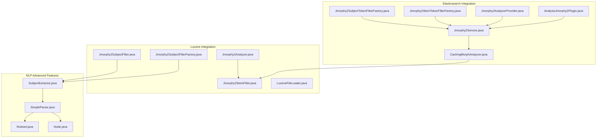
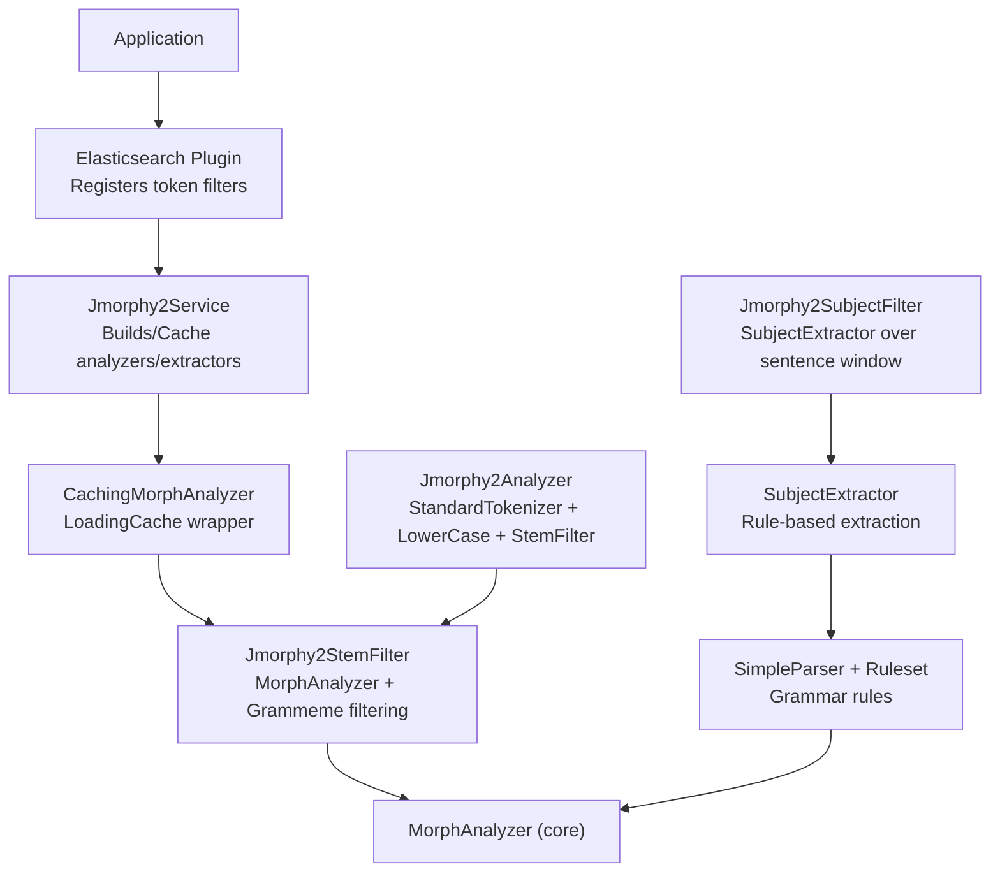
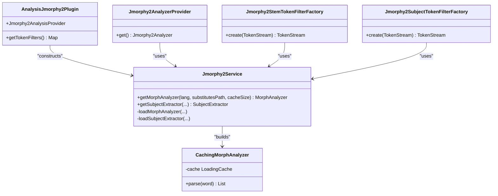
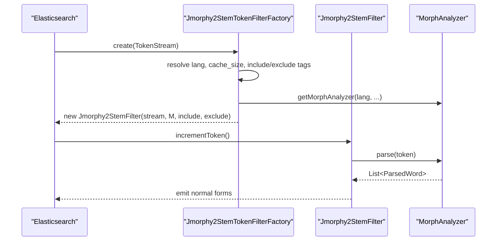
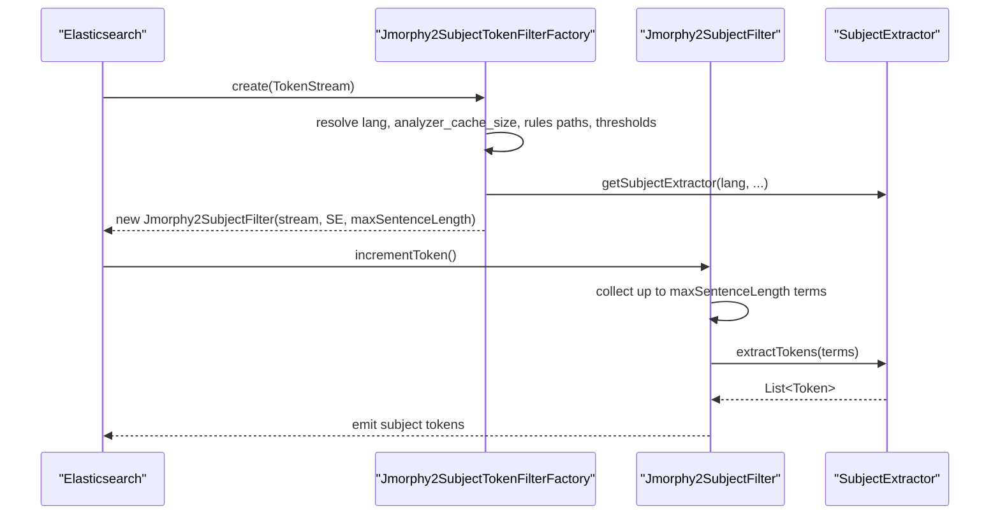
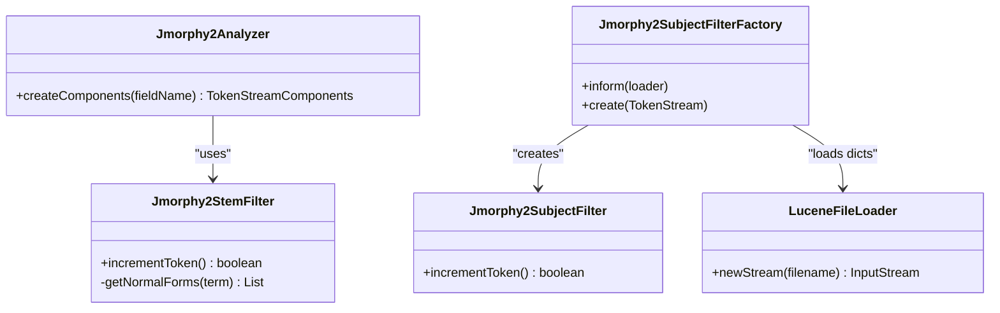
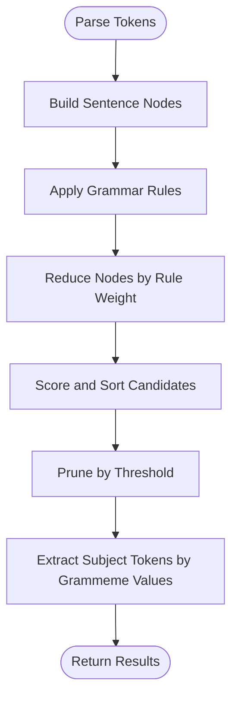
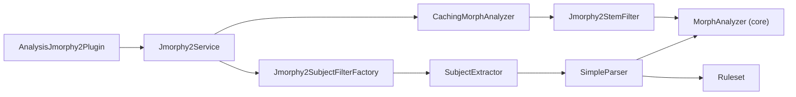

# Integration Modules

<cite>
**Referenced Files in This Document**
- [AnalysisJmorphy2Plugin.java](file://jmorphy2-elasticsearch/src/main/java/company/evo/jmorphy2/elasticsearch/plugin/AnalysisJmorphy2Plugin.java)
- [Jmorphy2AnalyzerProvider.java](file://jmorphy2-elasticsearch/src/main/java/company/evo/jmorphy2/elasticsearch/index/Jmorphy2AnalyzerProvider.java)
- [Jmorphy2StemTokenFilterFactory.java](file://jmorphy2-elasticsearch/src/main/java/company/evo/jmorphy2/elasticsearch/index/Jmorphy2StemTokenFilterFactory.java)
- [Jmorphy2SubjectTokenFilterFactory.java](file://jmorphy2-elasticsearch/src/main/java/company/evo/jmorphy2/elasticsearch/index/Jmorphy2SubjectTokenFilterFactory.java)
- [Jmorphy2Service.java](file://jmorphy2-elasticsearch/src/main/java/company/evo/jmorphy2/elasticsearch/indices/Jmorphy2Service.java)
- [CachingMorphAnalyzer.java](file://jmorphy2-elasticsearch/src/main/java/company/evo/jmorphy2/elasticsearch/indices/CachingMorphAnalyzer.java)
- [Jmorphy2Analyzer.java](file://jmorphy2-lucene/src/main/java/company/evo/jmorphy2/lucene/Jmorphy2Analyzer.java)
- [Jmorphy2StemFilter.java](file://jmorphy2-lucene/src/main/java/company/evo/jmorphy2/lucene/Jmorphy2StemFilter.java)
- [Jmorphy2SubjectFilter.java](file://jmorphy2-lucene/src/main/java/company/evo/jmorphy2/lucene/Jmorphy2SubjectFilter.java)
- [Jmorphy2SubjectFilterFactory.java](file://jmorphy2-lucene/src/main/java/company/evo/jmorphy2/lucene/Jmorphy2SubjectFilterFactory.java)
- [LuceneFileLoader.java](file://jmorphy2-lucene/src/main/java/company/evo/jmorphy2/lucene/LuceneFileLoader.java)
- [SubjectExtractor.java](file://jmorphy2-nlp/src/main/java/company/evo/jmorphy2/nlp/SubjectExtractor.java)
- [SimpleParser.java](file://jmorphy2-nlp/src/main/java/company/evo/jmorphy2/nlp/SimpleParser.java)
- [Ruleset.java](file://jmorphy2-nlp/src/main/java/company/evo/jmorphy2/nlp/Ruleset.java)
- [Node.java](file://jmorphy2-nlp/src/main/java/company/evo/jmorphy2/nlp/Node.java)
- [README.md](file://README.md)
- [ES_8.x_Migration_Report_06a5fe0f.md](file://ES_8.x_Migration_Report_06a5fe0f.md)
</cite>

## Table of Contents
1. [Introduction](#introduction)
2. [Project Structure](#project-structure)
3. [Core Components](#core-components)
4. [Architecture Overview](#architecture-overview)
5. [Detailed Component Analysis](#detailed-component-analysis)
6. [Dependency Analysis](#dependency-analysis)
7. [Performance Considerations](#performance-considerations)
8. [Troubleshooting Guide](#troubleshooting-guide)
9. [Conclusion](#conclusion)
10. [Appendices](#appendices)

## Introduction
This document explains Jmorphy2’s integration modules that extend morphological analysis capabilities beyond the core library. It covers:
- Elasticsearch plugin architecture with custom analyzers and token filters, plus caching for high-performance search
- Lucene integration providing direct stemming filters and subject extraction for IR pipelines
- Advanced NLP features: context-free grammar parsing, rule-based phrase analysis, and semantic role-like subject extraction
- Practical configuration options, performance tuning, troubleshooting, deployment, compatibility, and extension strategies

## Project Structure
The repository organizes integrations by platform and domain:
- Elasticsearch integration: plugin, index-time analyzers/filters, and caching service
- Lucene integration: analyzers and token filters for direct indexing/search
- NLP components: parsers, taggers, and subject extraction utilities

**Diagram sources**
- [AnalysisJmorphy2Plugin.java:34-67](file://jmorphy2-elasticsearch/src/main/java/company/evo/jmorphy2/elasticsearch/plugin/AnalysisJmorphy2Plugin.java#L34-L67)
- [Jmorphy2AnalyzerProvider.java:29-52](file://jmorphy2-elasticsearch/src/main/java/company/evo/jmorphy2/elasticsearch/index/Jmorphy2AnalyzerProvider.java#L29-L52)
- [Jmorphy2StemTokenFilterFactory.java:37-72](file://jmorphy2-elasticsearch/src/main/java/company/evo/jmorphy2/elasticsearch/index/Jmorphy2StemTokenFilterFactory.java#L37-L72)
- [Jmorphy2SubjectTokenFilterFactory.java:35-77](file://jmorphy2-elasticsearch/src/main/java/company/evo/jmorphy2/elasticsearch/index/Jmorphy2SubjectTokenFilterFactory.java#L35-L77)
- [Jmorphy2Service.java:44-76](file://jmorphy2-elasticsearch/src/main/java/company/evo/jmorphy2/elasticsearch/indices/Jmorphy2Service.java#L44-L76)
- [CachingMorphAnalyzer.java:19-63](file://jmorphy2-elasticsearch/src/main/java/company/evo/jmorphy2/elasticsearch/indices/CachingMorphAnalyzer.java#L19-L63)
- [Jmorphy2Analyzer.java:17-41](file://jmorphy2-lucene/src/main/java/company/evo/jmorphy2/lucene/Jmorphy2Analyzer.java#L17-L41)
- [Jmorphy2StemFilter.java:21-183](file://jmorphy2-lucene/src/main/java/company/evo/jmorphy2/lucene/Jmorphy2StemFilter.java#L21-L183)
- [Jmorphy2SubjectFilter.java:17-85](file://jmorphy2-lucene/src/main/java/company/evo/jmorphy2/lucene/Jmorphy2SubjectFilter.java#L17-L85)
- [Jmorphy2SubjectFilterFactory.java:23-108](file://jmorphy2-lucene/src/main/java/company/evo/jmorphy2/lucene/Jmorphy2SubjectFilterFactory.java#L23-108)
- [LuceneFileLoader.java:12-25](file://jmorphy2-lucene/src/main/java/company/evo/jmorphy2/lucene/LuceneFileLoader.java#L12-L25)
- [SubjectExtractor.java:11-116](file://jmorphy2-nlp/src/main/java/company/evo/jmorphy2/nlp/SubjectExtractor.java#L11-L116)
- [SimpleParser.java:15-175](file://jmorphy2-nlp/src/main/java/company/evo/jmorphy2/nlp/SimpleParser.java#L15-L175)
- [Ruleset.java:17-114](file://jmorphy2-nlp/src/main/java/company/evo/jmorphy2/nlp/Ruleset.java#L17-L114)
- [Node.java:12-158](file://jmorphy2-nlp/src/main/java/company/evo/jmorphy2/nlp/Node.java#L12-L158)

**Section sources**
- [README.md](file://README.md)

## Core Components
- Elasticsearch plugin registers token filters and exposes a caching service for morph analyzers and subject extractors.
- Lucene analyzers and filters integrate morphological normalization and subject extraction into token streams.
- NLP components implement rule-based parsing and subject extraction for semantic role-like processing.

Key responsibilities:
- Elasticsearch plugin: register token filters and manage lifecycle via AnalysisPlugin SPI.
- Elasticsearch service: resolve dictionaries, build analyzers/extractors, and cache instances keyed by configuration.
- Caching analyzer: wrap MorphAnalyzer with a high-performance LoadingCache.
- Lucene filters: apply morphological normalization and subject extraction with configurable grammeme inclusion/exclusion.
- NLP parser and ruleset: define phrase structure rules and scoring for grammar-driven parsing.

**Section sources**
- [AnalysisJmorphy2Plugin.java:34-67](file://jmorphy2-elasticsearch/src/main/java/company/evo/jmorphy2/elasticsearch/plugin/AnalysisJmorphy2Plugin.java#L34-L67)
- [Jmorphy2Service.java:61-76](file://jmorphy2-elasticsearch/src/main/java/company/evo/jmorphy2/elasticsearch/indices/Jmorphy2Service.java#L61-L76)
- [CachingMorphAnalyzer.java:19-63](file://jmorphy2-elasticsearch/src/main/java/company/evo/jmorphy2/elasticsearch/indices/CachingMorphAnalyzer.java#L19-L63)
- [Jmorphy2StemFilter.java:21-183](file://jmorphy2-lucene/src/main/java/company/evo/jmorphy2/lucene/Jmorphy2StemFilter.java#L21-L183)
- [Jmorphy2SubjectFilter.java:17-85](file://jmorphy2-lucene/src/main/java/company/evo/jmorphy2/lucene/Jmorphy2SubjectFilter.java#L17-L85)
- [SimpleParser.java:15-175](file://jmorphy2-nlp/src/main/java/company/evo/jmorphy2/nlp/SimpleParser.java#L15-L175)
- [Ruleset.java:17-114](file://jmorphy2-nlp/src/main/java/company/evo/jmorphy2/nlp/Ruleset.java#L17-L114)

## Architecture Overview
The integration architecture separates concerns across layers:
- Elasticsearch plugin and service: platform-specific registration and resource resolution
- Caching layer: shared analyzer and extractor caches
- Lucene pipeline: reusable analyzers and filters for tokenization, normalization, and subject extraction
- NLP engine: grammar-aware parsing and extraction rules

**Diagram sources**
- [AnalysisJmorphy2Plugin.java:34-67](file://jmorphy2-elasticsearch/src/main/java/company/evo/jmorphy2/elasticsearch/plugin/AnalysisJmorphy2Plugin.java#L34-L67)
- [Jmorphy2Service.java:61-76](file://jmorphy2-elasticsearch/src/main/java/company/evo/jmorphy2/elasticsearch/indices/Jmorphy2Service.java#L61-L76)
- [CachingMorphAnalyzer.java:19-63](file://jmorphy2-elasticsearch/src/main/java/company/evo/jmorphy2/elasticsearch/indices/CachingMorphAnalyzer.java#L19-L63)
- [Jmorphy2Analyzer.java:17-41](file://jmorphy2-lucene/src/main/java/company/evo/jmorphy2/lucene/Jmorphy2Analyzer.java#L17-L41)
- [Jmorphy2StemFilter.java:21-183](file://jmorphy2-lucene/src/main/java/company/evo/jmorphy2/lucene/Jmorphy2StemFilter.java#L21-L183)
- [Jmorphy2SubjectFilter.java:17-85](file://jmorphy2-lucene/src/main/java/company/evo/jmorphy2/lucene/Jmorphy2SubjectFilter.java#L17-L85)
- [SubjectExtractor.java:11-116](file://jmorphy2-nlp/src/main/java/company/evo/jmorphy2/nlp/SubjectExtractor.java#L11-L116)
- [SimpleParser.java:15-175](file://jmorphy2-nlp/src/main/java/company/evo/jmorphy2/nlp/SimpleParser.java#L15-L175)

## Detailed Component Analysis

### Elasticsearch Plugin and Service
The plugin integrates with Elasticsearch’s AnalysisPlugin SPI to register token filters and coordinate resource loading and caching.

**Diagram sources**
- [AnalysisJmorphy2Plugin.java:34-67](file://jmorphy2-elasticsearch/src/main/java/company/evo/jmorphy2/elasticsearch/plugin/AnalysisJmorphy2Plugin.java#L34-L67)
- [Jmorphy2Service.java:61-76](file://jmorphy2-elasticsearch/src/main/java/company/evo/jmorphy2/elasticsearch/indices/Jmorphy2Service.java#L61-L76)
- [CachingMorphAnalyzer.java:19-63](file://jmorphy2-elasticsearch/src/main/java/company/evo/jmorphy2/elasticsearch/indices/CachingMorphAnalyzer.java#L19-L63)
- [Jmorphy2AnalyzerProvider.java:29-52](file://jmorphy2-elasticsearch/src/main/java/company/evo/jmorphy2/elasticsearch/index/Jmorphy2AnalyzerProvider.java#L29-L52)
- [Jmorphy2StemTokenFilterFactory.java:37-72](file://jmorphy2-elasticsearch/src/main/java/company/evo/jmorphy2/elasticsearch/index/Jmorphy2StemTokenFilterFactory.java#L37-L72)
- [Jmorphy2SubjectTokenFilterFactory.java:35-77](file://jmorphy2-elasticsearch/src/main/java/company/evo/jmorphy2/elasticsearch/index/Jmorphy2SubjectTokenFilterFactory.java#L35-L77)

Key behaviors:
- Token filter registration via AnalysisPlugin
- Morph analyzer and subject extractor creation with caching keyed by language, substitutes, thresholds, and rule paths
- Dictionary resolution from filesystem or classpath resources

**Section sources**
- [AnalysisJmorphy2Plugin.java:34-67](file://jmorphy2-elasticsearch/src/main/java/company/evo/jmorphy2/elasticsearch/plugin/AnalysisJmorphy2Plugin.java#L34-L67)
- [Jmorphy2Service.java:61-127](file://jmorphy2-elasticsearch/src/main/java/company/evo/jmorphy2/elasticsearch/indices/Jmorphy2Service.java#L61-L127)
- [Jmorphy2AnalyzerProvider.java:29-52](file://jmorphy2-elasticsearch/src/main/java/company/evo/jmorphy2/elasticsearch/index/Jmorphy2AnalyzerProvider.java#L29-L52)
- [Jmorphy2StemTokenFilterFactory.java:37-72](file://jmorphy2-elasticsearch/src/main/java/company/evo/jmorphy2/elasticsearch/index/Jmorphy2StemTokenFilterFactory.java#L37-L72)
- [Jmorphy2SubjectTokenFilterFactory.java:35-77](file://jmorphy2-elasticsearch/src/main/java/company/evo/jmorphy2/elasticsearch/index/Jmorphy2SubjectTokenFilterFactory.java#L35-L77)

### Elasticsearch Stemming Token Filter
The stemming filter applies morphological normalization with optional grammeme inclusion/exclusion and position increment control.

**Diagram sources**
- [Jmorphy2StemTokenFilterFactory.java:37-72](file://jmorphy2-elasticsearch/src/main/java/company/evo/jmorphy2/elasticsearch/index/Jmorphy2StemTokenFilterFactory.java#L37-L72)
- [Jmorphy2StemFilter.java:21-183](file://jmorphy2-lucene/src/main/java/company/evo/jmorphy2/lucene/Jmorphy2StemFilter.java#L21-L183)

Configuration highlights:
- Required: lang
- Optional: char_substitutes_path, cache_size, include_tags, exclude_tags

**Section sources**
- [Jmorphy2StemTokenFilterFactory.java:37-72](file://jmorphy2-elasticsearch/src/main/java/company/evo/jmorphy2/elasticsearch/index/Jmorphy2StemTokenFilterFactory.java#L37-L72)
- [Jmorphy2StemFilter.java:21-183](file://jmorphy2-lucene/src/main/java/company/evo/jmorphy2/lucene/Jmorphy2StemFilter.java#L21-L183)

### Elasticsearch Subject Extraction Token Filter
The subject filter extracts semantic subjects over a bounded sentence window using a configured SubjectExtractor.

**Diagram sources**
- [Jmorphy2SubjectTokenFilterFactory.java:35-77](file://jmorphy2-elasticsearch/src/main/java/company/evo/jmorphy2/elasticsearch/index/Jmorphy2SubjectTokenFilterFactory.java#L35-L77)
- [Jmorphy2SubjectFilter.java:17-85](file://jmorphy2-lucene/src/main/java/company/evo/jmorphy2/lucene/Jmorphy2SubjectFilter.java#L17-L85)
- [SubjectExtractor.java:11-116](file://jmorphy2-nlp/src/main/java/company/evo/jmorphy2/nlp/SubjectExtractor.java#L11-L116)

Configuration highlights:
- Required: lang
- Optional: char_substitutes_path, analyzer_cache_size, tagger_rules_path, parser_rules_path, extractor_rules_path, tagger_threshold, parser_threshold, max_sentence_length

**Section sources**
- [Jmorphy2SubjectTokenFilterFactory.java:35-77](file://jmorphy2-elasticsearch/src/main/java/company/evo/jmorphy2/elasticsearch/index/Jmorphy2SubjectTokenFilterFactory.java#L35-L77)
- [Jmorphy2SubjectFilter.java:17-85](file://jmorphy2-lucene/src/main/java/company/evo/jmorphy2/lucene/Jmorphy2SubjectFilter.java#L17-L85)
- [SubjectExtractor.java:11-116](file://jmorphy2-nlp/src/main/java/company/evo/jmorphy2/nlp/SubjectExtractor.java#L11-L116)

### Lucene Analyzer and Filters
Lucene integration provides reusable analyzers and filters for standalone applications.

**Diagram sources**
- [Jmorphy2Analyzer.java:17-41](file://jmorphy2-lucene/src/main/java/company/evo/jmorphy2/lucene/Jmorphy2Analyzer.java#L17-L41)
- [Jmorphy2StemFilter.java:21-183](file://jmorphy2-lucene/src/main/java/company/evo/jmorphy2/lucene/Jmorphy2StemFilter.java#L21-L183)
- [Jmorphy2SubjectFilter.java:17-85](file://jmorphy2-lucene/src/main/java/company/evo/jmorphy2/lucene/Jmorphy2SubjectFilter.java#L17-L85)
- [Jmorphy2SubjectFilterFactory.java:23-108](file://jmorphy2-lucene/src/main/java/company/evo/jmorphy2/lucene/Jmorphy2SubjectFilterFactory.java#L23-108)
- [LuceneFileLoader.java:12-25](file://jmorphy2-lucene/src/main/java/company/evo/jmorphy2/lucene/LuceneFileLoader.java#L12-L25)

Configuration highlights (Lucene factory):
- Attributes: dict, replaces, taggerRules, taggerThreshold, parserRules, parserThreshold, extract, maxSentenceLength
- Defaults: dict defaults to a standard path, maxSentenceLength default is set

**Section sources**
- [Jmorphy2Analyzer.java:17-41](file://jmorphy2-lucene/src/main/java/company/evo/jmorphy2/lucene/Jmorphy2Analyzer.java#L17-L41)
- [Jmorphy2StemFilter.java:21-183](file://jmorphy2-lucene/src/main/java/company/evo/jmorphy2/lucene/Jmorphy2StemFilter.java#L21-L183)
- [Jmorphy2SubjectFilterFactory.java:23-108](file://jmorphy2-lucene/src/main/java/company/evo/jmorphy2/lucene/Jmorphy2SubjectFilterFactory.java#L23-L108)
- [LuceneFileLoader.java:12-25](file://jmorphy2-lucene/src/main/java/company/evo/jmorphy2/lucene/LuceneFileLoader.java#L12-L25)

### NLP Advanced Features: Parsing and Subject Extraction
The NLP stack implements rule-based parsing and extraction:
- Ruleset parses grammar rules from resources
- SimpleParser applies rules iteratively with pruning by threshold
- SubjectExtractor traverses parse trees to extract tokens matching grammeme criteria

**Diagram sources**
- [SimpleParser.java:67-114](file://jmorphy2-nlp/src/main/java/company/evo/jmorphy2/nlp/SimpleParser.java#L67-L114)
- [Ruleset.java:88-99](file://jmorphy2-nlp/src/main/java/company/evo/jmorphy2/nlp/Ruleset.java#L88-L99)
- [SubjectExtractor.java:67-100](file://jmorphy2-nlp/src/main/java/company/evo/jmorphy2/nlp/SubjectExtractor.java#L67-L100)
- [Node.java:94-96](file://jmorphy2-nlp/src/main/java/company/evo/jmorphy2/nlp/Node.java#L94-L96)

**Section sources**
- [SimpleParser.java:15-175](file://jmorphy2-nlp/src/main/java/company/evo/jmorphy2/nlp/SimpleParser.java#L15-L175)
- [Ruleset.java:17-114](file://jmorphy2-nlp/src/main/java/company/evo/jmorphy2/nlp/Ruleset.java#L17-L114)
- [SubjectExtractor.java:11-116](file://jmorphy2-nlp/src/main/java/company/evo/jmorphy2/nlp/SubjectExtractor.java#L11-L116)
- [Node.java:12-158](file://jmorphy2-nlp/src/main/java/company/evo/jmorphy2/nlp/Node.java#L12-L158)

## Dependency Analysis
High-level dependencies:
- Elasticsearch plugin depends on Jmorphy2Service for analyzer/extractor provisioning
- Jmorphy2Service depends on core MorphAnalyzer and NLP components
- CachingMorphAnalyzer wraps core MorphAnalyzer with a LoadingCache
- Lucene filters depend on MorphAnalyzer and SubjectExtractor
- SubjectExtractor depends on Parser and Ruleset

**Diagram sources**
- [AnalysisJmorphy2Plugin.java:34-67](file://jmorphy2-elasticsearch/src/main/java/company/evo/jmorphy2/elasticsearch/plugin/AnalysisJmorphy2Plugin.java#L34-L67)
- [Jmorphy2Service.java:61-167](file://jmorphy2-elasticsearch/src/main/java/company/evo/jmorphy2/elasticsearch/indices/Jmorphy2Service.java#L61-L167)
- [CachingMorphAnalyzer.java:19-63](file://jmorphy2-elasticsearch/src/main/java/company/evo/jmorphy2/elasticsearch/indices/CachingMorphAnalyzer.java#L19-L63)
- [Jmorphy2StemFilter.java:21-183](file://jmorphy2-lucene/src/main/java/company/evo/jmorphy2/lucene/Jmorphy2StemFilter.java#L21-L183)
- [Jmorphy2SubjectFilterFactory.java:23-108](file://jmorphy2-lucene/src/main/java/company/evo/jmorphy2/lucene/Jmorphy2SubjectFilterFactory.java#L23-L108)
- [SubjectExtractor.java:11-116](file://jmorphy2-nlp/src/main/java/company/evo/jmorphy2/nlp/SubjectExtractor.java#L11-L116)
- [SimpleParser.java:15-175](file://jmorphy2-nlp/src/main/java/company/evo/jmorphy2/nlp/SimpleParser.java#L15-L175)
- [Ruleset.java:17-114](file://jmorphy2-nlp/src/main/java/company/evo/jmorphy2/nlp/Ruleset.java#L17-L114)

**Section sources**
- [Jmorphy2Service.java:61-167](file://jmorphy2-elasticsearch/src/main/java/company/evo/jmorphy2/elasticsearch/indices/Jmorphy2Service.java#L61-L167)

## Performance Considerations
- Elasticsearch
  - Enable analyzer caching via cache_size to reduce repeated morphological parsing
  - Use include_tags/exclude_tags to limit normalization to relevant grammematical categories
  - Configure analyzer_cache_size for subject extraction to reuse underlying analyzer
- Lucene
  - Use Jmorphy2Analyzer for standard pipelines; tune include/exclude grammemes in filters
  - Limit sentence window in subject extraction to balance recall and latency
- General
  - Prefer filesystem-backed dictionaries for predictable I/O; fallback to classpath resources supported
  - Tune parser thresholds to control search space explosion during grammar reduction

[No sources needed since this section provides general guidance]

## Troubleshooting Guide
Common issues and resolutions:
- Missing language configuration
  - Symptom: IllegalArgumentException indicating missing lang for token filters
  - Resolution: Provide lang in filter settings
- Dictionary not found
  - Symptom: Cannot find dictionary for lang
  - Resolution: Verify dictionary location and structure under jmorphy2 directory
- Unexpected empty results
  - Symptom: No normal forms emitted or no subject tokens
  - Resolution: Adjust include_tags/exclude_tags, increase cache_size, or relax grammeme constraints
- Subject extraction errors
  - Symptom: Exceptions when building SubjectExtractor
  - Resolution: Validate rule files and thresholds; ensure tagger/parser rules are present

**Section sources**
- [Jmorphy2StemTokenFilterFactory.java:52-66](file://jmorphy2-elasticsearch/src/main/java/company/evo/jmorphy2/elasticsearch/index/Jmorphy2StemTokenFilterFactory.java#L52-L66)
- [Jmorphy2SubjectTokenFilterFactory.java:46-68](file://jmorphy2-elasticsearch/src/main/java/company/evo/jmorphy2/elasticsearch/index/Jmorphy2SubjectTokenFilterFactory.java#L46-L68)
- [Jmorphy2Service.java:78-86](file://jmorphy2-elasticsearch/src/main/java/company/evo/jmorphy2/elasticsearch/indices/Jmorphy2Service.java#L78-L86)
- [Jmorphy2Service.java:130-167](file://jmorphy2-elasticsearch/src/main/java/company/evo/jmorphy2/elasticsearch/indices/Jmorphy2Service.java#L130-L167)

## Conclusion
Jmorphy2’s integration modules provide robust, high-performance morphological processing for Elasticsearch and Lucene-based systems. The Elasticsearch plugin and caching service streamline dictionary loading and analyzer reuse, while Lucene analyzers and filters offer flexible tokenization and normalization. The NLP stack enables grammar-aware parsing and subject extraction suitable for advanced IR tasks. Proper configuration, caching, and threshold tuning yield significant performance gains and reliable results.

[No sources needed since this section summarizes without analyzing specific files]

## Appendices

### Configuration Options by Module
- Elasticsearch Stem Token Filter
  - Required: lang
  - Optional: char_substitutes_path, cache_size, include_tags, exclude_tags
- Elasticsearch Subject Token Filter
  - Required: lang
  - Optional: char_substitutes_path, analyzer_cache_size, tagger_rules_path, parser_rules_path, extractor_rules_path, tagger_threshold, parser_threshold, max_sentence_length
- Lucene Subject Filter Factory
  - Attributes: dict, replaces, taggerRules, taggerThreshold, parserRules, parserThreshold, extract, maxSentenceLength
  - Defaults: dict defaults to a standard path; maxSentenceLength default is set

**Section sources**
- [Jmorphy2StemTokenFilterFactory.java:52-66](file://jmorphy2-elasticsearch/src/main/java/company/evo/jmorphy2/elasticsearch/index/Jmorphy2StemTokenFilterFactory.java#L52-L66)
- [Jmorphy2SubjectTokenFilterFactory.java:46-71](file://jmorphy2-elasticsearch/src/main/java/company/evo/jmorphy2/elasticsearch/index/Jmorphy2SubjectTokenFilterFactory.java#L46-L71)
- [Jmorphy2SubjectFilterFactory.java:49-69](file://jmorphy2-lucene/src/main/java/company/evo/jmorphy2/lucene/Jmorphy2SubjectFilterFactory.java#L49-L69)

### Deployment and Compatibility
- Elasticsearch plugin registration is performed via AnalysisPlugin SPI
- Dictionary locations are resolved from configuration; default path is configurable
- Migration guidance for Elasticsearch 8.x is documented separately

**Section sources**
- [AnalysisJmorphy2Plugin.java:34-67](file://jmorphy2-elasticsearch/src/main/java/company/evo/jmorphy2/elasticsearch/plugin/AnalysisJmorphy2Plugin.java#L34-L67)
- [Jmorphy2Service.java:170-177](file://jmorphy2-elasticsearch/src/main/java/company/evo/jmorphy2/elasticsearch/indices/Jmorphy2Service.java#L170-L177)
- [ES_8.x_Migration_Report_06a5fe0f.md](file://ES_8.x_Migration_Report_06a5fe0f.md)

### Extending the Integration Framework
- Add custom analyzers: implement Analyzer and compose with Jmorphy2StemFilter and/or Jmorphy2SubjectFilter
- Add custom token filters: subclass TokenFilter and integrate with MorphAnalyzer or SubjectExtractor
- Extend subject extraction: customize extraction rules and grammeme sets in SubjectExtractor
- Integrate with Solr: similar patterns can be adapted using Solr’s analysis factories

[No sources needed since this section provides general guidance]