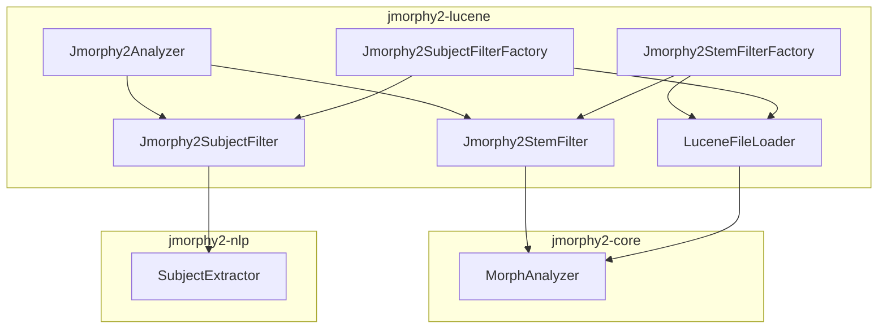
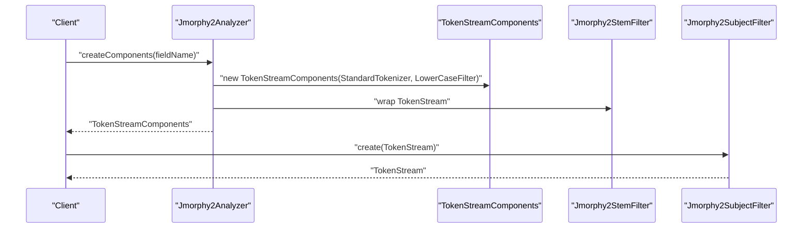
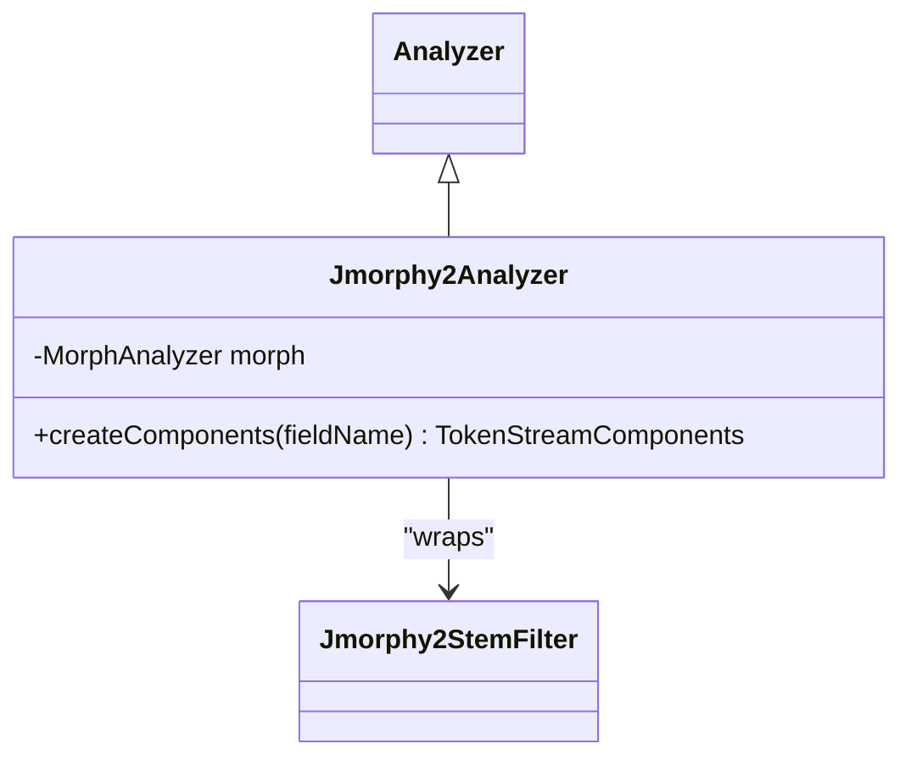
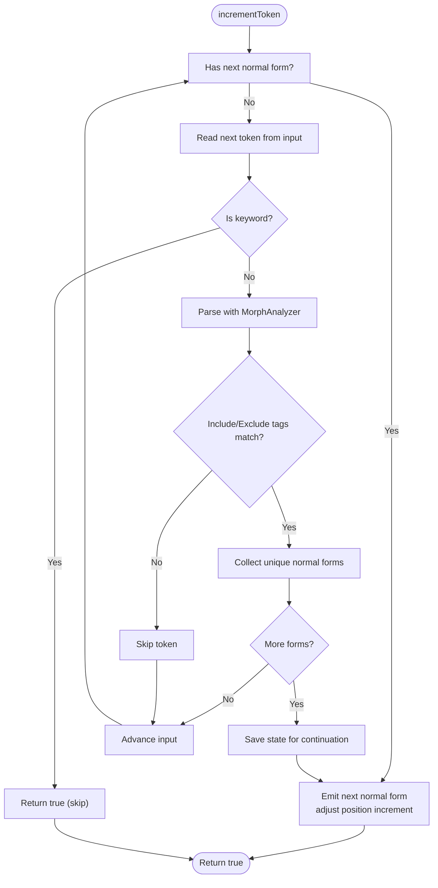
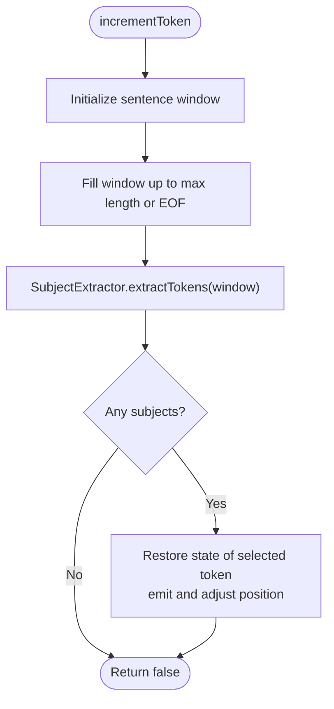
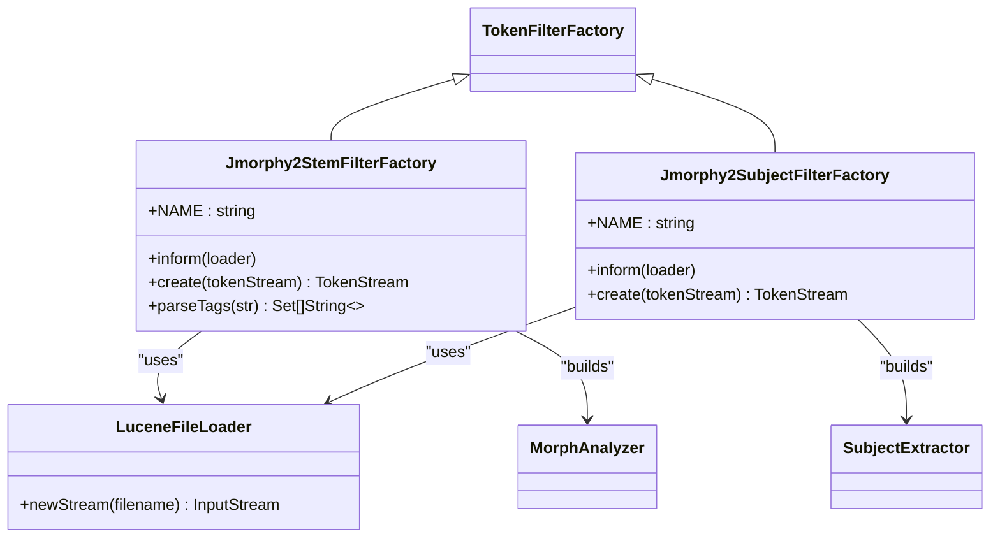
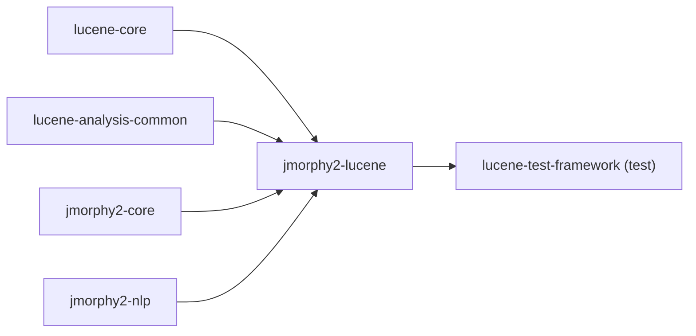

# Lucene Integration

<cite>
**Referenced Files in This Document**
- [Jmorphy2Analyzer.java](file://jmorphy2-lucene/src/main/java/company/evo/jmorphy2/lucene/Jmorphy2Analyzer.java)
- [Jmorphy2StemFilter.java](file://jmorphy2-lucene/src/main/java/company/evo/jmorphy2/lucene/Jmorphy2StemFilter.java)
- [Jmorphy2SubjectFilter.java](file://jmorphy2-lucene/src/main/java/company/evo/jmorphy2/lucene/Jmorphy2SubjectFilter.java)
- [LuceneFileLoader.java](file://jmorphy2-lucene/src/main/java/company/evo/jmorphy2/lucene/LuceneFileLoader.java)
- [Jmorphy2StemFilterFactory.java](file://jmorphy2-lucene/src/main/java/company/evo/jmorphy2/lucene/Jmorphy2StemFilterFactory.java)
- [Jmorphy2SubjectFilterFactory.java](file://jmorphy2-lucene/src/main/java/company/evo/jmorphy2/lucene/Jmorphy2SubjectFilterFactory.java)
- [MorphAnalyzer.java](file://jmorphy2-core/src/main/java/company/evo/jmorphy2/MorphAnalyzer.java)
- [jmorphy2-lucene build.gradle.kts](file://jmorphy2-lucene/build.gradle.kts)
- [BaseFilterTestCase.java](file://jmorphy2-lucene/src/test/java/company/evo/jmorphy2/lucene/BaseFilterTestCase.java)
- [Jmorphy2AnalyzerTest.java](file://jmorphy2-lucene/src/test/java/company/evo/jmorphy2/lucene/Jmorphy2AnalyzerTest.java)
- [tagger_rules.txt](file://jmorphy2-lucene/src/test/resources/tagger_rules.txt)
- [parser_rules.txt](file://jmorphy2-lucene/src/test/resources/parser_rules.txt)
- [Versions.kt](file://buildSrc/src/main/kotlin/Versions.kt)
</cite>

## Table of Contents
1. [Introduction](#introduction)
2. [Project Structure](#project-structure)
3. [Core Components](#core-components)
4. [Architecture Overview](#architecture-overview)
5. [Detailed Component Analysis](#detailed-component-analysis)
6. [Dependency Analysis](#dependency-analysis)
7. [Performance Considerations](#performance-considerations)
8. [Troubleshooting Guide](#troubleshooting-guide)
9. [Conclusion](#conclusion)
10. [Appendices](#appendices)

## Introduction
This document explains Jmorphy2’s direct integration with Apache Lucene for Russian and Ukrainian morphology-based text processing. It covers how Jmorphy2Analyzer extends Lucene’s analysis framework, how Jmorphy2StemFilter and Jmorphy2SubjectFilter operate within the token stream pipeline, and how LuceneFileLoader bridges Lucene’s ResourceLoader with Jmorphy2’s dictionary loading. It also provides practical guidance for building custom analyzers, configuring stemming and subject extraction, chaining filters, and optimizing performance for large-scale indexing.

## Project Structure
Jmorphy2’s Lucene integration lives primarily in the jmorphy2-lucene module. The key elements are:
- An Analyzer subclass that wires a tokenizer, lowercasing, and morphological stemming.
- Two TokenFilter implementations for stemming and subject extraction.
- Factory classes that integrate with Lucene’s SPI to load dictionaries and rules via ResourceLoader.
- A ResourceLoader-aware FileLoader adapter that resolves dictionary resources inside Lucene’s environment.

**Diagram sources**
- [Jmorphy2Analyzer.java:17-41](file://jmorphy2-lucene/src/main/java/company/evo/jmorphy2/lucene/Jmorphy2Analyzer.java#L17-L41)
- [Jmorphy2StemFilter.java:21-61](file://jmorphy2-lucene/src/main/java/company/evo/jmorphy2/lucene/Jmorphy2StemFilter.java#L21-L61)
- [Jmorphy2SubjectFilter.java:17-39](file://jmorphy2-lucene/src/main/java/company/evo/jmorphy2/lucene/Jmorphy2SubjectFilter.java#L17-L39)
- [LuceneFileLoader.java:12-25](file://jmorphy2-lucene/src/main/java/company/evo/jmorphy2/lucene/LuceneFileLoader.java#L12-L25)
- [Jmorphy2StemFilterFactory.java:22-80](file://jmorphy2-lucene/src/main/java/company/evo/jmorphy2/lucene/Jmorphy2StemFilterFactory.java#L22-L80)
- [Jmorphy2SubjectFilterFactory.java:23-93](file://jmorphy2-lucene/src/main/java/company/evo/jmorphy2/lucene/Jmorphy2SubjectFilterFactory.java#L23-L93)
- [MorphAnalyzer.java:15-125](file://jmorphy2-core/src/main/java/company/evo/jmorphy2/MorphAnalyzer.java#L15-L125)

**Section sources**
- [jmorphy2-lucene build.gradle.kts:5-13](file://jmorphy2-lucene/build.gradle.kts#L5-L13)

## Core Components
- Jmorphy2Analyzer: A ready-to-use Analyzer that applies StandardTokenizer, LowerCaseFilter, and Jmorphy2StemFilter. It configures default exclusion tags for parts-of-speech commonly omitted in IR.
- Jmorphy2StemFilter: A TokenFilter that converts tokens to their morphological normal forms, optionally constrained by include/exclude grammeme sets. It preserves position increments and supports keyword tokens.
- Jmorphy2SubjectFilter: A TokenFilter that extracts subject-related tokens from up to a configurable sentence length using a SubjectExtractor built from MorphAnalyzer, Tagger, and Parser.
- Jmorphy2StemFilterFactory and Jmorphy2SubjectFilterFactory: SPI-compatible factories that construct MorphAnalyzer and SubjectExtractor instances using Lucene’s ResourceLoader and dictionary resources.
- LuceneFileLoader: Bridges Lucene’s ResourceLoader to Jmorphy2’s FileLoader so dictionary files can be loaded from Lucene’s resource path.

**Section sources**
- [Jmorphy2Analyzer.java:17-41](file://jmorphy2-lucene/src/main/java/company/evo/jmorphy2/lucene/Jmorpy2Analyzer.java#L17-L41)
- [Jmorphy2StemFilter.java:21-184](file://jmorphy2-lucene/src/main/java/company/evo/jmorphy2/lucene/Jmorphy2StemFilter.java#L21-L184)
- [Jmorphy2SubjectFilter.java:17-86](file://jmorphy2-lucene/src/main/java/company/evo/jmorphy2/lucene/Jmorphy2SubjectFilter.java#L17-L86)
- [LuceneFileLoader.java:12-25](file://jmorphy2-lucene/src/main/java/company/evo/jmorphy2/lucene/LuceneFileLoader.java#L12-L25)
- [Jmorphy2StemFilterFactory.java:22-110](file://jmorphy2-lucene/src/main/java/company/evo/jmorphy2/lucene/Jmorphy2StemFilterFactory.java#L22-L110)
- [Jmorphy2SubjectFilterFactory.java:23-109](file://jmorphy2-lucene/src/main/java/company/evo/jmorphy2/lucene/Jmorphy2SubjectFilterFactory.java#L23-L109)

## Architecture Overview
The integration follows Lucene’s standard Analyzer and TokenFilter architecture. Jmorphy2Analyzer builds a TokenStreamComponents chain with StandardTokenizer and LowerCaseFilter, then adds Jmorphy2StemFilter. For subject extraction, Jmorphy2SubjectFilter reads a fixed-length window of tokens, passes them to SubjectExtractor, and emits subject-bearing tokens.

**Diagram sources**
- [Jmorphy2Analyzer.java:34-40](file://jmorphy2-lucene/src/main/java/company/evo/jmorphy2/lucene/Jmorphy2Analyzer.java#L34-L40)
- [Jmorphy2StemFilter.java:92-121](file://jmorphy2-lucene/src/main/java/company/evo/jmorphy2/lucene/Jmorphy2StemFilter.java#L92-L121)
- [Jmorphy2SubjectFilter.java:50-76](file://jmorphy2-lucene/src/main/java/company/evo/jmorphy2/lucene/Jmorphy2SubjectFilter.java#L50-L76)

## Detailed Component Analysis

### Jmorphy2Analyzer
- Extends Lucene’s Analyzer and defines a default pipeline: StandardTokenizer → LowerCaseFilter → Jmorphy2StemFilter.
- Uses a static default exclude set for parts-of-speech typical for IR (pronouns, prepositions, conjunctions, particles, interjections).
- Exposes a constructor accepting a prebuilt MorphAnalyzer, enabling reuse across analyzers.

**Diagram sources**
- [Jmorphy2Analyzer.java:17-41](file://jmorphy2-lucene/src/main/java/company/evo/jmorphy2/lucene/Jmorphy2Analyzer.java#L17-L41)
- [Jmorphy2StemFilter.java:21-61](file://jmorphy2-lucene/src/main/java/company/evo/jmorphy2/lucene/Jmorphy2StemFilter.java#L21-L61)

**Section sources**
- [Jmorphy2Analyzer.java:17-41](file://jmorphy2-lucene/src/main/java/company/evo/jmorphy2/lucene/Jmorphy2Analyzer.java#L17-L41)

### Jmorphy2StemFilter
- Implements morphological stemming by parsing each token with MorphAnalyzer and emitting unique normal forms.
- Supports include/exclude grammeme filtering by converting POS tag strings to Grammeme sets.
- Preserves or adjusts position increments depending on configuration and whether tokens are emitted as continuations.
- Skips keyword tokens and handles multi-form tokens by saving/restoring TokenFilter state.

**Diagram sources**
- [Jmorphy2StemFilter.java:92-182](file://jmorphy2-lucene/src/main/java/company/evo/jmorphy2/lucene/Jmorphy2StemFilter.java#L92-L182)

**Section sources**
- [Jmorphy2StemFilter.java:21-184](file://jmorphy2-lucene/src/main/java/company/evo/jmorphy2/lucene/Jmorphy2StemFilter.java#L21-L184)

### Jmorphy2SubjectFilter
- Reads up to maxSentenceLength tokens from the upstream stream, skipping keyword tokens.
- Passes the collected tokens to SubjectExtractor to produce subject-bearing tokens.
- Emits tokens preserving original positions and adjusting position increments to reflect extracted spans.

**Diagram sources**
- [Jmorphy2SubjectFilter.java:50-84](file://jmorphy2-lucene/src/main/java/company/evo/jmorphy2/lucene/Jmorphy2SubjectFilter.java#L50-L84)

**Section sources**
- [Jmorphy2SubjectFilter.java:17-86](file://jmorphy2-lucene/src/main/java/company/evo/jmorphy2/lucene/Jmorphy2SubjectFilter.java#L17-L86)

### Factory Classes and Configuration
- Jmorphy2StemFilterFactory
  - Attributes: dict, replaces, excludeTags, includeTags, enablePositionIncrements.
  - Loads replacements mapping from JSON resource and constructs MorphAnalyzer with LuceneFileLoader.
  - Creates Jmorphy2StemFilter with include/exclude grammeme sets and position increment behavior.
- Jmorphy2SubjectFilterFactory
  - Attributes: dict, replaces, taggerRules, taggerThreshold, parserRules, parserThreshold, extract, maxSentenceLength.
  - Builds MorphAnalyzer, Tagger, Parser, and SubjectExtractor using ResourceLoader-backed resources.
  - Creates Jmorphy2SubjectFilter with configured sentence length.

**Diagram sources**
- [Jmorphy2StemFilterFactory.java:22-110](file://jmorphy2-lucene/src/main/java/company/evo/jmorphy2/lucene/Jmorphy2StemFilterFactory.java#L22-L110)
- [Jmorphy2SubjectFilterFactory.java:23-109](file://jmorphy2-lucene/src/main/java/company/evo/jmorphy2/lucene/Jmorphy2SubjectFilterFactory.java#L23-L109)
- [LuceneFileLoader.java:12-25](file://jmorphy2-lucene/src/main/java/company/evo/jmorphy2/lucene/LuceneFileLoader.java#L12-L25)
- [MorphAnalyzer.java:15-125](file://jmorphy2-core/src/main/java/company/evo/jmorphy2/MorphAnalyzer.java#L15-L125)

**Section sources**
- [Jmorphy2StemFilterFactory.java:22-110](file://jmorphy2-lucene/src/main/java/company/evo/jmorphy2/lucene/Jmorphy2StemFilterFactory.java#L22-L110)
- [Jmorphy2SubjectFilterFactory.java:23-109](file://jmorphy2-lucene/src/main/java/company/evo/jmorphy2/lucene/Jmorphy2SubjectFilterFactory.java#L23-L109)

### LuceneFileLoader
- Wraps Lucene’s ResourceLoader to supply InputStreams for dictionary files.
- Resolves paths relative to a base path supplied by the factory.

**Section sources**
- [LuceneFileLoader.java:12-25](file://jmorphy2-lucene/src/main/java/company/evo/jmorphy2/lucene/LuceneFileLoader.java#L12-L25)

## Dependency Analysis
- jmorphy2-lucene depends on Lucene core and analysis-common, and on jmorphy2-core and jmorphy2-nlp.
- The build script derives the Lucene version from the current Elasticsearch version mapping.

**Diagram sources**
- [jmorphy2-lucene build.gradle.kts:5-17](file://jmorphy2-lucene/build.gradle.kts#L5-L17)
- [Versions.kt:97-108](file://buildSrc/src/main/kotlin/Versions.kt#L97-L108)

**Section sources**
- [jmorphy2-lucene build.gradle.kts:5-17](file://jmorphy2-lucene/build.gradle.kts#L5-L17)
- [Versions.kt:97-108](file://buildSrc/src/main/kotlin/Versions.kt#L97-L108)

## Performance Considerations
- Prefer a single shared MorphAnalyzer instance across analyzers to avoid repeated dictionary loading overhead.
- Use includeTags to restrict parsing to relevant grammematical categories, reducing downstream work.
- Disable position increments when not needed to minimize positional overhead.
- Tune maxSentenceLength in Jmorphy2SubjectFilter to balance recall and performance.
- Keep dictionary resources packaged efficiently and ensure they are loaded from Lucene’s resource path to avoid filesystem latency.

## Troubleshooting Guide
- Dictionary not found
  - Ensure the dict attribute points to a valid base path within Lucene’s resource loader scope.
  - Verify that replaces resource path is present and parses as JSON with single-character keys.
- Unexpected empty output
  - Confirm that StandardTokenizer and LowerCaseFilter precede Jmorphy2StemFilter in the analyzer chain.
  - Check include/exclude grammeme sets and defaults; verify that tokens are not being filtered out.
- Subject extraction yields no tokens
  - Increase maxSentenceLength if sentences exceed the default window.
  - Validate taggerRules and parserRules paths and thresholds.
- Position increments appear incorrect
  - Adjust enablePositionIncrements in Jmorphy2StemFilterFactory or disable position increments for downstream consumers that do not require positions.
- Compatibility issues
  - Confirm the Lucene version matches the expected version derived from the project’s version mapping.

**Section sources**
- [Jmorphy2StemFilterFactory.java:62-72](file://jmorphy2-lucene/src/main/java/company/evo/jmorphy2/lucene/Jmorphy2StemFilterFactory.java#L62-L72)
- [Jmorphy2SubjectFilterFactory.java:76-89](file://jmorphy2-lucene/src/main/java/company/evo/jmorphy2/lucene/Jmorphy2SubjectFilterFactory.java#L76-L89)
- [Jmorphy2AnalyzerTest.java:22-54](file://jmorphy2-lucene/src/test/java/company/evo/jmorphy2/lucene/Jmorphy2AnalyzerTest.java#L22-L54)

## Conclusion
Jmorphy2’s Lucene integration provides robust, extensible morphological processing through familiar Lucene abstractions. By leveraging Analyzer, TokenFilter, and ResourceLoader-aware factories, it enables seamless integration into existing Lucene-based systems. Proper configuration of grammematical filters, subject extraction windows, and shared analyzers ensures strong performance and accuracy for information retrieval tasks.

## Appendices

### Practical Integration Examples
- Using Jmorphy2Analyzer in tests
  - See assertions demonstrating expected token outputs for Russian text.
  - Reference: [Jmorphy2AnalyzerTest.java:22-54](file://jmorphy2-lucene/src/test/java/company/evo/jmorphy2/lucene/Jmorphy2AnalyzerTest.java#L22-L54)
- Configuring Jmorphy2StemFilterFactory
  - Provide dict, replaces, excludeTags/includeTags, and enablePositionIncrements attributes.
  - Reference: [Jmorphy2StemFilterFactory.java:22-80](file://jmorphy2-lucene/src/main/java/company/evo/jmorphy2/lucene/Jmorphy2StemFilterFactory.java#L22-L80)
- Configuring Jmorphy2SubjectFilterFactory
  - Provide dict, replaces, taggerRules, parserRules, extract, and maxSentenceLength attributes.
  - Reference: [Jmorphy2SubjectFilterFactory.java:23-93](file://jmorphy2-lucene/src/main/java/company/evo/jmorphy2/lucene/Jmorphy2SubjectFilterFactory.java#L23-L93)

### Compatibility Notes
- Lucene version is resolved from the project’s Elasticsearch version mapping.
- Reference: [Versions.kt:97-108](file://buildSrc/src/main/kotlin/Versions.kt#L97-L108)

### Test Resources
- Tagger rules and parser rules for testing subject extraction.
- References:
  - [tagger_rules.txt:1-8](file://jmorphy2-lucene/src/test/resources/tagger_rules.txt#L1-L8)
  - [parser_rules.txt:1-36](file://jmorphy2-lucene/src/test/resources/parser_rules.txt#L1-L36)