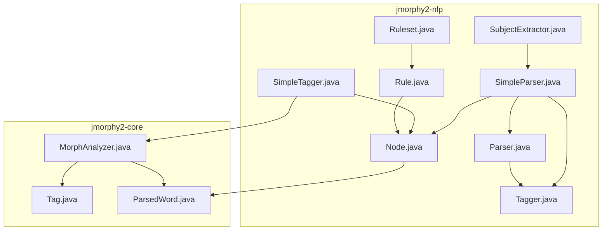
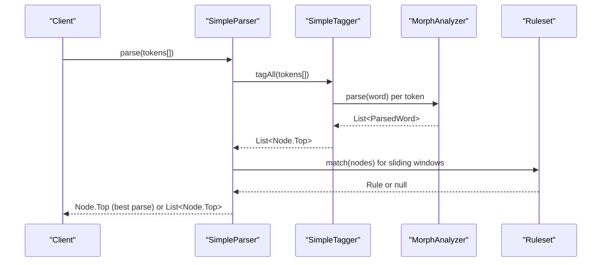
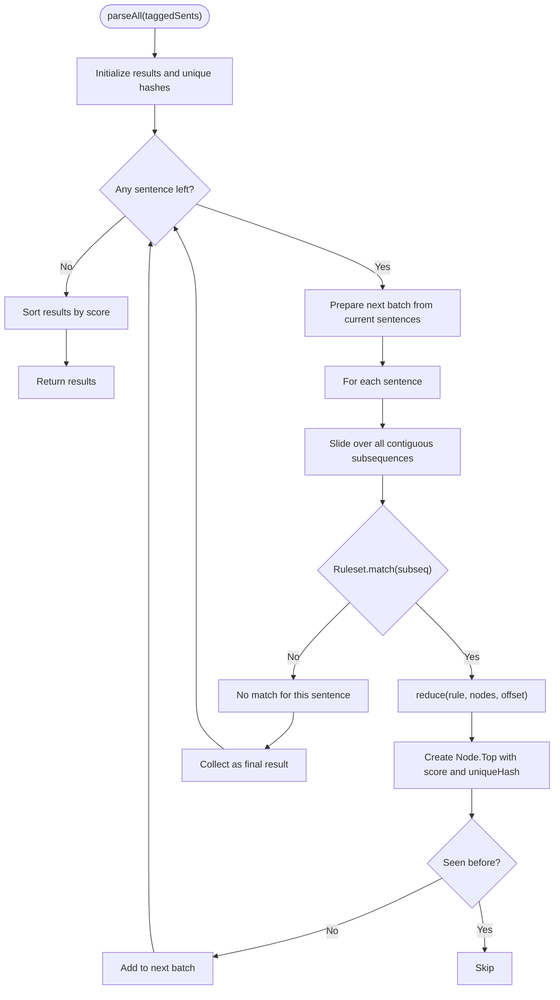
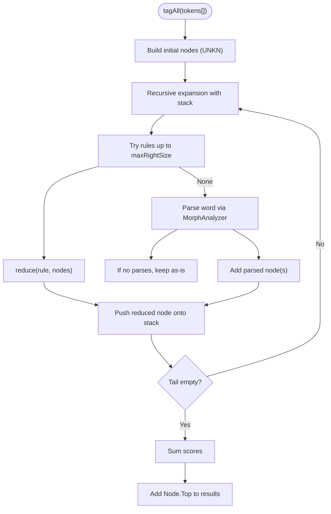
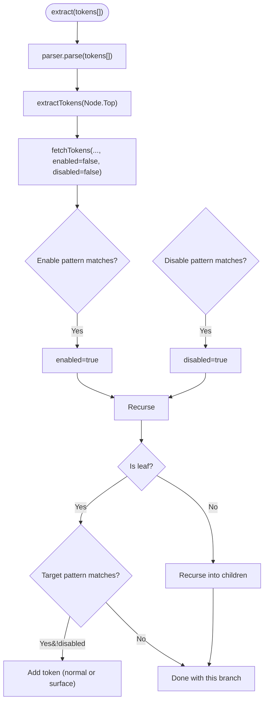
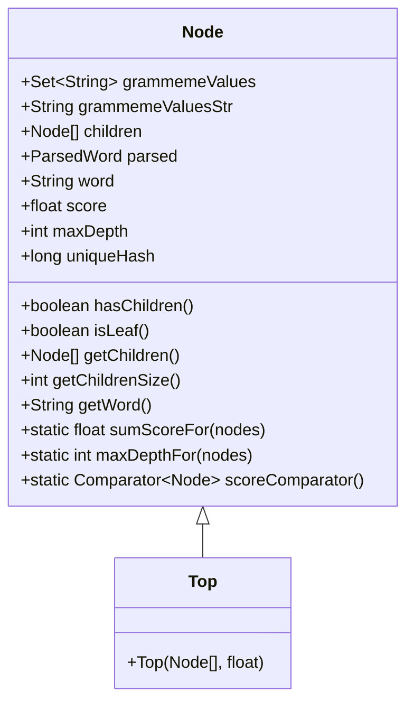
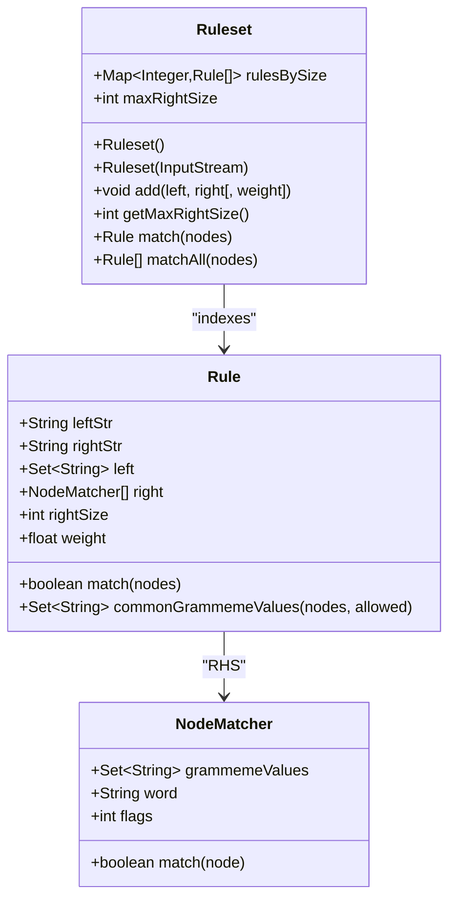
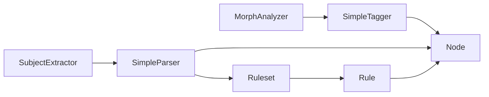

# NLP Advanced Features

<cite>
**Referenced Files in This Document**
- [Parser.java](file://jmorphy2-nlp/src/main/java/company/evo/jmorphy2/nlp/Parser.java)
- [SimpleParser.java](file://jmorphy2-nlp/src/main/java/company/evo/jmorphy2/nlp/SimpleParser.java)
- [Tagger.java](file://jmorphy2-nlp/src/main/java/company/evo/jmorphy2/nlp/Tagger.java)
- [SimpleTagger.java](file://jmorphy2-nlp/src/main/java/company/evo/jmorphy2/nlp/SimpleTagger.java)
- [SubjectExtractor.java](file://jmorphy2-nlp/src/main/java/company/evo/jmorphy2/nlp/SubjectExtractor.java)
- [Node.java](file://jmorphy2-nlp/src/main/java/company/evo/jmorphy2/nlp/Node.java)
- [Rule.java](file://jmorphy2-nlp/src/main/java/company/evo/jmorphy2/nlp/Rule.java)
- [Ruleset.java](file://jmorphy2-nlp/src/main/java/company/evo/jmorphy2/nlp/Ruleset.java)
- [MorphAnalyzer.java](file://jmorphy2-core/src/main/java/company/evo/jmorphy2/MorphAnalyzer.java)
- [Tag.java](file://jmorphy2-core/src/main/java/company/evo/jmorphy2/Tag.java)
- [ParsedWord.java](file://jmorphy2-core/src/main/java/company/evo/jmorphy2/ParsedWord.java)
- [parser_rules.txt](file://jmorphy2-nlp/src/test/resources/parser_rules.txt)
- [tagger_rules.txt](file://jmorphy2-nlp/src/test/resources/tagger_rules.txt)
- [phrases.txt](file://jmorphy2-nlp/src/test/resources/phrases.txt)
- [SimpleParserTest.java](file://jmorphy2-nlp/src/test/java/company/evo/jmorphy2/nlp/SimpleParserTest.java)
- [SubjectExtractorTest.java](file://jmorphy2-nlp/src/test/java/company/evo/jmorphy2/nlp/SubjectExtractorTest.java)
</cite>

## Table of Contents
1. [Introduction](#introduction)
2. [Project Structure](#project-structure)
3. [Core Components](#core-components)
4. [Architecture Overview](#architecture-overview)
5. [Detailed Component Analysis](#detailed-component-analysis)
6. [Dependency Analysis](#dependency-analysis)
7. [Performance Considerations](#performance-considerations)
8. [Troubleshooting Guide](#troubleshooting-guide)
9. [Conclusion](#conclusion)
10. [Appendices](#appendices)

## Introduction
This document explains Jmorphy2’s advanced NLP capabilities beyond basic morphological analysis. It focuses on:
- The Parser interface and SimpleParser implementation for context-free grammar parsing and rule-based phrase analysis
- The Tagger system for part-of-speech tagging and grammatical feature extraction
- The SubjectExtractor component for identifying grammatical subjects and integrating with morphological analysis
- The Node data structure representing parsed sentence components
- The Rule and Ruleset framework for defining custom parsing and tagging rules
- Practical examples for building custom parsers, implementing domain-specific tagging rules, and extracting semantic information
- Performance considerations, integration patterns with ML workflows, and guidance on extending the framework

## Project Structure
The advanced NLP features live primarily in the jmorphy2-nlp module, with deep integration to the morphological analyzer in jmorphy2-core. The tests and resource files demonstrate rule formats and usage patterns.

**Diagram sources**
- [Parser.java:1-30](file://jmorphy2-nlp/src/main/java/company/evo/jmorphy2/nlp/Parser.java#L1-L30)
- [SimpleParser.java:1-176](file://jmorphy2-nlp/src/main/java/company/evo/jmorphy2/nlp/SimpleParser.java#L1-L176)
- [Tagger.java:1-20](file://jmorphy2-nlp/src/main/java/company/evo/jmorphy2/nlp/Tagger.java#L1-L20)
- [SimpleTagger.java:1-155](file://jmorphy2-nlp/src/main/java/company/evo/jmorphy2/nlp/SimpleTagger.java#L1-L155)
- [SubjectExtractor.java:1-117](file://jmorphy2-nlp/src/main/java/company/evo/jmorphy2/nlp/SubjectExtractor.java#L1-L117)
- [Node.java:1-159](file://jmorphy2-nlp/src/main/java/company/evo/jmorphy2/nlp/Node.java#L1-L159)
- [Rule.java:1-118](file://jmorphy2-nlp/src/main/java/company/evo/jmorphy2/nlp/Rule.java#L1-L118)
- [Ruleset.java:1-115](file://jmorphy2-nlp/src/main/java/company/evo/jmorphy2/nlp/Ruleset.java#L1-L115)
- [MorphAnalyzer.java:1-247](file://jmorphy2-core/src/main/java/company/evo/jmorphy2/MorphAnalyzer.java#L1-L247)
- [Tag.java:1-230](file://jmorphy2-core/src/main/java/company/evo/jmorphy2/Tag.java#L1-L230)
- [ParsedWord.java:1-89](file://jmorphy2-core/src/main/java/company/evo/jmorphy2/ParsedWord.java#L1-L89)

**Section sources**
- [Parser.java:1-30](file://jmorphy2-nlp/src/main/java/company/evo/jmorphy2/nlp/Parser.java#L1-L30)
- [SimpleParser.java:1-176](file://jmorphy2-nlp/src/main/java/company/evo/jmorphy2/nlp/SimpleParser.java#L1-L176)
- [Tagger.java:1-20](file://jmorphy2-nlp/src/main/java/company/evo/jmorphy2/nlp/Tagger.java#L1-L20)
- [SimpleTagger.java:1-155](file://jmorphy2-nlp/src/main/java/company/evo/jmorphy2/nlp/SimpleTagger.java#L1-L155)
- [SubjectExtractor.java:1-117](file://jmorphy2-nlp/src/main/java/company/evo/jmorphy2/nlp/SubjectExtractor.java#L1-L117)
- [Node.java:1-159](file://jmorphy2-nlp/src/main/java/company/evo/jmorphy2/nlp/Node.java#L1-L159)
- [Rule.java:1-118](file://jmorphy2-nlp/src/main/java/company/evo/jmorphy2/nlp/Rule.java#L1-L118)
- [Ruleset.java:1-115](file://jmorphy2-nlp/src/main/java/company/evo/jmorphy2/nlp/Ruleset.java#L1-L115)
- [MorphAnalyzer.java:1-247](file://jmorphy2-core/src/main/java/company/evo/jmorphy2/MorphAnalyzer.java#L1-L247)
- [Tag.java:1-230](file://jmorphy2-core/src/main/java/company/evo/jmorphy2/Tag.java#L1-L230)
- [ParsedWord.java:1-89](file://jmorphy2-core/src/main/java/company/evo/jmorphy2/ParsedWord.java#L1-L89)

## Core Components
- Parser: Abstract base for sentence parsing, orchestrating Tagger and MorphAnalyzer to produce Node.Top trees.
- SimpleParser: Implements a breadth-first, rule-driven chart-style parser with pruning thresholds and scoring.
- Tagger: Abstract base for token-level tagging using morphological analysis.
- SimpleTagger: Rule-driven tagger that either applies rules or falls back to MorphAnalyzer for lexical parsing.
- SubjectExtractor: Traverses Node trees to extract grammatical subjects based on configurable grammeme filters.
- Node: Immutable tree node representing tokens or constituents with grammeme values, score, and children.
- Rule and Ruleset: Define and match production rules with flags and weights; support loading from text resources.

**Section sources**
- [Parser.java:9-29](file://jmorphy2-nlp/src/main/java/company/evo/jmorphy2/nlp/Parser.java#L9-L29)
- [SimpleParser.java:15-176](file://jmorphy2-nlp/src/main/java/company/evo/jmorphy2/nlp/SimpleParser.java#L15-L176)
- [Tagger.java:9-19](file://jmorphy2-nlp/src/main/java/company/evo/jmorphy2/nlp/Tagger.java#L9-L19)
- [SimpleTagger.java:14-155](file://jmorphy2-nlp/src/main/java/company/evo/jmorphy2/nlp/SimpleTagger.java#L14-L155)
- [SubjectExtractor.java:11-117](file://jmorphy2-nlp/src/main/java/company/evo/jmorphy2/nlp/SubjectExtractor.java#L11-L117)
- [Node.java:12-159](file://jmorphy2-nlp/src/main/java/company/evo/jmorphy2/nlp/Node.java#L12-L159)
- [Rule.java:10-118](file://jmorphy2-nlp/src/main/java/company/evo/jmorphy2/nlp/Rule.java#L10-L118)
- [Ruleset.java:17-115](file://jmorphy2-nlp/src/main/java/company/evo/jmorphy2/nlp/Ruleset.java#L17-L115)

## Architecture Overview
The system integrates morphological analysis with rule-based parsing and tagging. SimpleTagger produces token-level analyses enriched with grammeme values. SimpleParser then applies Ruleset to combine adjacent nodes into constituents guided by weighted rules. SubjectExtractor traverses the resulting tree to extract subject candidates.

**Diagram sources**
- [SimpleParser.java:59-114](file://jmorphy2-nlp/src/main/java/company/evo/jmorphy2/nlp/SimpleParser.java#L59-L114)
- [SimpleTagger.java:38-104](file://jmorphy2-nlp/src/main/java/company/evo/jmorphy2/nlp/SimpleTagger.java#L38-L104)
- [MorphAnalyzer.java:178-200](file://jmorphy2-core/src/main/java/company/evo/jmorphy2/MorphAnalyzer.java#L178-L200)
- [Ruleset.java:88-113](file://jmorphy2-nlp/src/main/java/company/evo/jmorphy2/nlp/Ruleset.java#L88-L113)

## Detailed Component Analysis

### Parser and SimpleParser
- Responsibilities:
  - Convert token arrays into Node.Top trees via Tagger
  - Apply Ruleset to reduce sequences of nodes into constituents
  - Control exploration via threshold pruning and scoring normalization
- Key behaviors:
  - Sliding window over sentence constituents to match Ruleset
  - Reduce matched subsequences into new nodes with combined grammeme values and scores
  - Maintain uniqueness of Node.Top via hash to avoid duplicates
  - Sort and cap results by threshold to manage combinatorial explosion

**Diagram sources**
- [SimpleParser.java:67-114](file://jmorphy2-nlp/src/main/java/company/evo/jmorphy2/nlp/SimpleParser.java#L67-L114)
- [SimpleParser.java:116-138](file://jmorphy2-nlp/src/main/java/company/evo/jmorphy2/nlp/SimpleParser.java#L116-L138)
- [Node.java:76-109](file://jmorphy2-nlp/src/main/java/company/evo/jmorphy2/nlp/Node.java#L76-L109)

**Section sources**
- [Parser.java:18-28](file://jmorphy2-nlp/src/main/java/company/evo/jmorphy2/nlp/Parser.java#L18-L28)
- [SimpleParser.java:59-114](file://jmorphy2-nlp/src/main/java/company/evo/jmorphy2/nlp/SimpleParser.java#L59-L114)
- [SimpleParser.java:116-138](file://jmorphy2-nlp/src/main/java/company/evo/jmorphy2/nlp/SimpleParser.java#L116-L138)
- [Node.java:76-109](file://jmorphy2-nlp/src/main/java/company/evo/jmorphy2/nlp/Node.java#L76-L109)

### Tagger and SimpleTagger
- Responsibilities:
  - Produce token-level analyses with grammeme values
  - Either apply Ruleset to merge tokens into constituents or fallback to MorphAnalyzer
- Key behaviors:
  - SimpleTagger enumerates rules up to max right-size and reduces matches into higher-level nodes
  - Fallback to MorphAnalyzer.parse(word) with early termination on fixed forms
  - Threshold controls reduction explosion by limiting top candidates

**Diagram sources**
- [SimpleTagger.java:38-104](file://jmorphy2-nlp/src/main/java/company/evo/jmorphy2/nlp/SimpleTagger.java#L38-L104)
- [SimpleTagger.java:106-135](file://jmorphy2-nlp/src/main/java/company/evo/jmorphy2/nlp/SimpleTagger.java#L106-L135)
- [MorphAnalyzer.java:178-200](file://jmorphy2-core/src/main/java/company/evo/jmorphy2/MorphAnalyzer.java#L178-L200)

**Section sources**
- [Tagger.java:16-18](file://jmorphy2-nlp/src/main/java/company/evo/jmorphy2/nlp/Tagger.java#L16-L18)
- [SimpleTagger.java:38-104](file://jmorphy2-nlp/src/main/java/company/evo/jmorphy2/nlp/SimpleTagger.java#L38-L104)
- [SimpleTagger.java:106-135](file://jmorphy2-nlp/src/main/java/company/evo/jmorphy2/nlp/SimpleTagger.java#L106-L135)

### SubjectExtractor
- Responsibilities:
  - Extract grammatical subjects from parsed sentences
  - Filter nodes by inclusion/exclusion sets and target grammeme patterns
  - Optionally return normal forms via MorphAnalyzer
- Key behaviors:
  - Configurable filter string with “+” (enable), “-” (disable), and base patterns
  - DFS traversal collecting tokens matching filters and targets
  - Supports normalization to morphological normal form when available

**Diagram sources**
- [SubjectExtractor.java:45-91](file://jmorphy2-nlp/src/main/java/company/evo/jmorphy2/nlp/SubjectExtractor.java#L45-L91)

**Section sources**
- [SubjectExtractor.java:18-91](file://jmorphy2-nlp/src/main/java/company/evo/jmorphy2/nlp/SubjectExtractor.java#L18-L91)

### Node Data Structure
- Purpose:
  - Represent terminal tokens and internal constituents with grammeme values, score, and children
  - Provide efficient comparison, hashing, and pretty printing
- Notable fields and methods:
  - grammemeValues: set of grammeme keys
  - children: ordered subtree list
  - parsed: optional ParsedWord for terminals
  - score: numeric score used for ranking
  - maxDepth: cached depth for normalization
  - uniqueHash: deterministic hash for deduplication
  - Top: special root node type with a fixed grammeme signature

**Diagram sources**
- [Node.java:12-159](file://jmorphy2-nlp/src/main/java/company/evo/jmorphy2/nlp/Node.java#L12-L159)

**Section sources**
- [Node.java:12-159](file://jmorphy2-nlp/src/main/java/company/evo/jmorphy2/nlp/Node.java#L12-L159)

### Rule and Ruleset Framework
- Rule:
  - Left-hand side (LHS) grammeme pattern
  - Right-hand side (RHS) sequence of NodeMatchers with flags
  - Weight for scoring
  - Matching logic checks grammeme containment and literal word equality
- Ruleset:
  - Loads rules from streams or inline
  - Indexes rules by RHS length for fast lookup
  - Provides match and matchAll for sliding windows

**Diagram sources**
- [Rule.java:10-118](file://jmorphy2-nlp/src/main/java/company/evo/jmorphy2/nlp/Rule.java#L10-L118)
- [Ruleset.java:17-115](file://jmorphy2-nlp/src/main/java/company/evo/jmorphy2/nlp/Ruleset.java#L17-L115)

**Section sources**
- [Rule.java:18-84](file://jmorphy2-nlp/src/main/java/company/evo/jmorphy2/nlp/Rule.java#L18-L84)
- [Ruleset.java:32-67](file://jmorphy2-nlp/src/main/java/company/evo/jmorphy2/nlp/Ruleset.java#L32-L67)
- [Ruleset.java:88-113](file://jmorphy2-nlp/src/main/java/company/evo/jmorphy2/nlp/Ruleset.java#L88-L113)

## Dependency Analysis
- Parser depends on MorphAnalyzer and Tagger to transform tokens into Node.Top trees.
- SimpleParser depends on Ruleset and Node utilities for reduction and scoring.
- SimpleTagger depends on MorphAnalyzer for lexical parsing and on Ruleset for rule-driven merging.
- SubjectExtractor depends on Parser and Node traversal to extract subjects.
- Rule and Ruleset are standalone rule engines used by both SimpleTagger and SimpleParser.

**Diagram sources**
- [SimpleParser.java:15-43](file://jmorphy2-nlp/src/main/java/company/evo/jmorphy2/nlp/SimpleParser.java#L15-L43)
- [SimpleTagger.java:14-36](file://jmorphy2-nlp/src/main/java/company/evo/jmorphy2/nlp/SimpleTagger.java#L14-L36)
- [SubjectExtractor.java:12-22](file://jmorphy2-nlp/src/main/java/company/evo/jmorphy2/nlp/SubjectExtractor.java#L12-L22)
- [Ruleset.java:17-31](file://jmorphy2-nlp/src/main/java/company/evo/jmorphy2/nlp/Ruleset.java#L17-L31)

**Section sources**
- [Parser.java:9-16](file://jmorphy2-nlp/src/main/java/company/evo/jmorphy2/nlp/Parser.java#L9-L16)
- [SimpleParser.java:15-43](file://jmorphy2-nlp/src/main/java/company/evo/jmorphy2/nlp/SimpleParser.java#L15-L43)
- [SimpleTagger.java:14-36](file://jmorphy2-nlp/src/main/java/company/evo/jmorphy2/nlp/SimpleTagger.java#L14-L36)
- [SubjectExtractor.java:12-22](file://jmorphy2-nlp/src/main/java/company/evo/jmorphy2/nlp/SubjectExtractor.java#L12-L22)
- [Ruleset.java:17-31](file://jmorphy2-nlp/src/main/java/company/evo/jmorphy2/nlp/Ruleset.java#L17-L31)

## Performance Considerations
- Threshold pruning:
  - SimpleParser and SimpleTagger both use threshold parameters to cap candidate expansions and reduce combinatorial blow-up.
- Scoring and normalization:
  - Scores are summed and normalized by average score and depth to favor compact, high-scoring parses.
- Deduplication:
  - Node.Top uniqueHash prevents revisiting identical parses across iterations.
- Early termination:
  - SimpleTagger stops lexical parsing on fixed forms to reduce redundant analyses.
- Rule indexing:
  - Ruleset indexes rules by RHS length for O(1) lookup during sliding-window matching.
- Recommendations:
  - Tune thresholds based on corpus size and complexity.
  - Prefer concise rulesets for large-scale processing.
  - Cache repeated morphological analyses when processing batches.
  - Consider parallelization of sentence processing pipelines outside the core components.

[No sources needed since this section provides general guidance]

## Troubleshooting Guide
- Parsing yields no results:
  - Verify Ruleset contains applicable rules for the token sequences.
  - Confirm SimpleParser threshold is sufficient to retain candidates.
  - Check that SimpleTagger can parse unknown tokens; otherwise, ensure fallback lexicon coverage.
- Unexpected subjects:
  - Review SubjectExtractor configuration filters (+enable, -disable, targets).
  - Validate grammeme patterns align with morphological tags produced by MorphAnalyzer.
- Rule debugging:
  - Load rules from resource files and print matched rules to confirm RHS lengths and weights.
  - Use small test corpora to isolate mis-matched patterns.
- Integration with ML:
  - Serialize Node.Top trees and extract features (grammeme vectors, depths, scores) for downstream classification/regression.
  - Normalize morphological forms for embedding stability.

**Section sources**
- [SimpleParser.java:67-114](file://jmorphy2-nlp/src/main/java/company/evo/jmorphy2/nlp/SimpleParser.java#L67-L114)
- [SimpleTagger.java:68-84](file://jmorphy2-nlp/src/main/java/company/evo/jmorphy2/nlp/SimpleTagger.java#L68-L84)
- [SubjectExtractor.java:24-43](file://jmorphy2-nlp/src/main/java/company/evo/jmorphy2/nlp/SubjectExtractor.java#L24-L43)
- [parser_rules.txt:1-36](file://jmorphy2-nlp/src/test/resources/parser_rules.txt#L1-L36)
- [tagger_rules.txt:1-7](file://jmorphy2-nlp/src/test/resources/tagger_rules.txt#L1-L7)

## Conclusion
Jmorphy2’s advanced NLP stack combines robust morphological analysis with flexible, rule-driven parsing and tagging. SimpleParser and SimpleTagger provide powerful primitives for building domain-specific semantic extractors, while SubjectExtractor offers practical subject identification. The Node and Ruleset abstractions enable extensible customization and efficient processing at scale.

[No sources needed since this section summarizes without analyzing specific files]

## Appendices

### Practical Examples and Usage Patterns
- Building a custom parser:
  - Instantiate MorphAnalyzer, configure SimpleTagger with domain rules, and construct SimpleParser with a tailored Ruleset and threshold.
  - Example references:
    - [SimpleParserTest.java:24-39](file://jmorphy2-nlp/src/test/java/company/evo/jmorphy2/nlp/SimpleParserTest.java#L24-L39)
    - [parser_rules.txt:1-36](file://jmorphy2-nlp/src/test/resources/parser_rules.txt#L1-L36)
- Implementing domain-specific tagging rules:
  - Extend SimpleTagger with a custom Ruleset loaded from a resource file.
  - Example references:
    - [SimpleTagger.java:145-154](file://jmorphy2-nlp/src/main/java/company/evo/jmorphy2/nlp/SimpleTagger.java#L145-L154)
    - [tagger_rules.txt:1-7](file://jmorphy2-nlp/src/test/resources/tagger_rules.txt#L1-L7)
- Extracting semantic information:
  - Use SubjectExtractor with a configuration string to filter subjects by grammeme patterns.
  - Example references:
    - [SubjectExtractorTest.java:22-33](file://jmorphy2-nlp/src/test/java/company/evo/jmorphy2/nlp/SubjectExtractorTest.java#L22-L33)
- Large-scale processing:
  - Adjust thresholds, leverage deduplication, and cache morphological results.
  - Example references:
    - [SimpleParser.java:21-43](file://jmorphy2-nlp/src/main/java/company/evo/jmorphy2/nlp/SimpleParser.java#L21-L43)
    - [SimpleTagger.java:18-36](file://jmorphy2-nlp/src/main/java/company/evo/jmorphy2/nlp/SimpleTagger.java#L18-L36)
- Extending the framework:
  - Implement custom Parser/Tagger by subclassing Parser/Tagger and wiring to MorphAnalyzer.
  - Add new rules to Ruleset or load from external resources.
  - Example references:
    - [Parser.java:9-29](file://jmorphy2-nlp/src/main/java/company/evo/jmorphy2/nlp/Parser.java#L9-L29)
    - [Tagger.java:9-19](file://jmorphy2-nlp/src/main/java/company/evo/jmorphy2/nlp/Tagger.java#L9-L19)
    - [Ruleset.java:32-67](file://jmorphy2-nlp/src/main/java/company/evo/jmorphy2/nlp/Ruleset.java#L32-L67)

**Section sources**
- [SimpleParserTest.java:24-39](file://jmorphy2-nlp/src/test/java/company/evo/jmorphy2/nlp/SimpleParserTest.java#L24-L39)
- [parser_rules.txt:1-36](file://jmorphy2-nlp/src/test/resources/parser_rules.txt#L1-L36)
- [SimpleTagger.java:145-154](file://jmorphy2-nlp/src/main/java/company/evo/jmorphy2/nlp/SimpleTagger.java#L145-L154)
- [tagger_rules.txt:1-7](file://jmorphy2-nlp/src/test/resources/tagger_rules.txt#L1-L7)
- [SubjectExtractorTest.java:22-33](file://jmorphy2-nlp/src/test/java/company/evo/jmorphy2/nlp/SubjectExtractorTest.java#L22-L33)
- [SimpleParser.java:21-43](file://jmorphy2-nlp/src/main/java/company/evo/jmorphy2/nlp/SimpleParser.java#L21-L43)
- [SimpleTagger.java:18-36](file://jmorphy2-nlp/src/main/java/company/evo/jmorphy2/nlp/SimpleTagger.java#L18-L36)
- [Parser.java:9-29](file://jmorphy2-nlp/src/main/java/company/evo/jmorphy2/nlp/Parser.java#L9-L29)
- [Tagger.java:9-19](file://jmorphy2-nlp/src/main/java/company/evo/jmorphy2/nlp/Tagger.java#L9-L19)
- [Ruleset.java:32-67](file://jmorphy2-nlp/src/main/java/company/evo/jmorphy2/nlp/Ruleset.java#L32-L67)