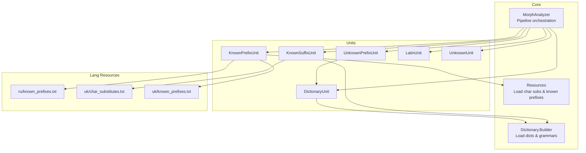
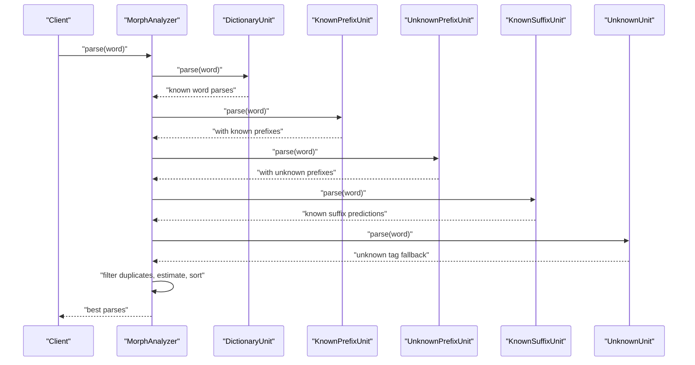
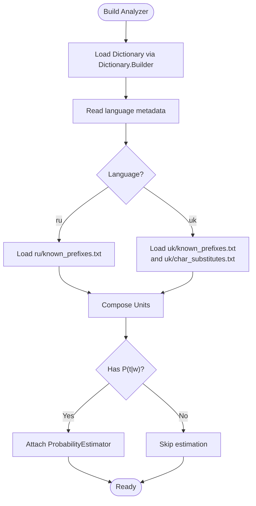
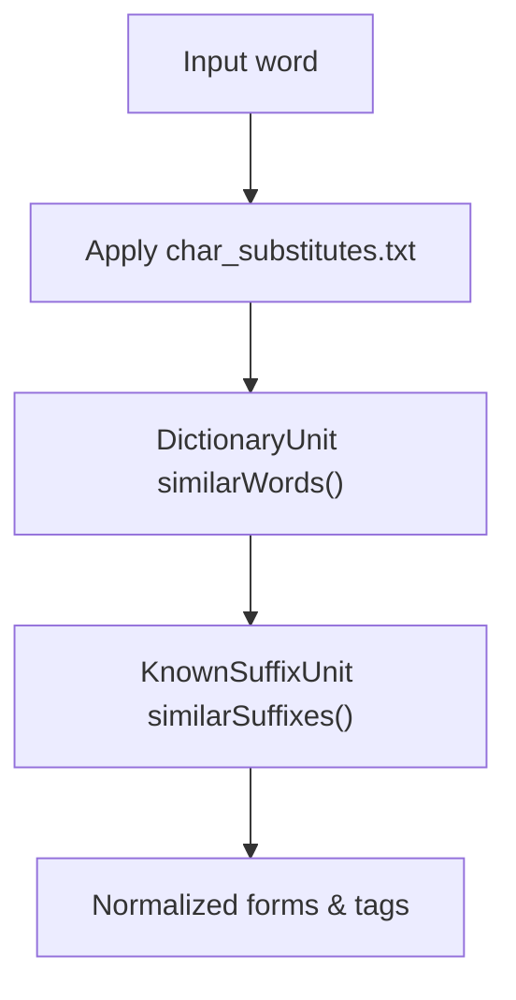
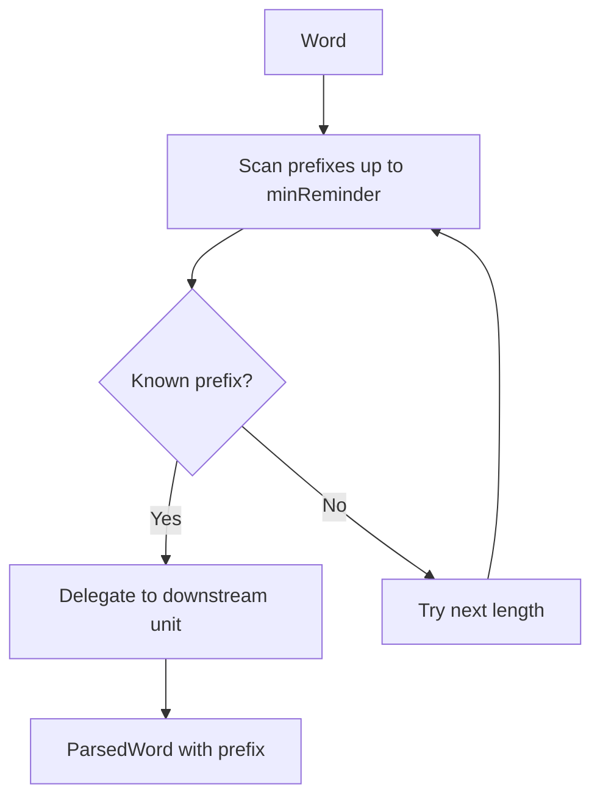
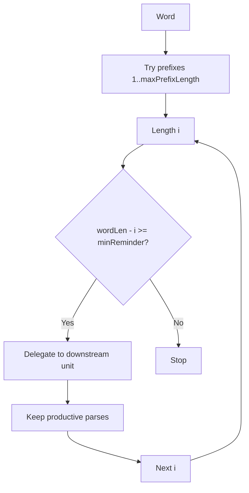
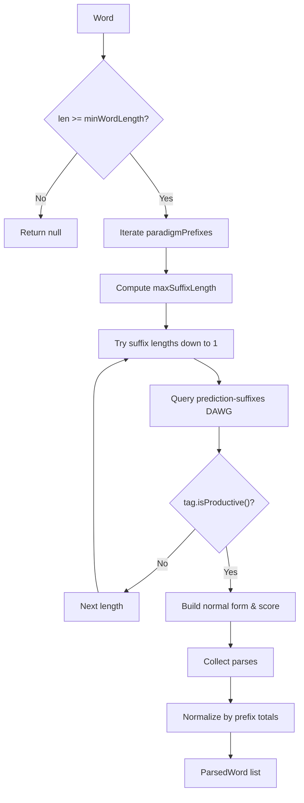
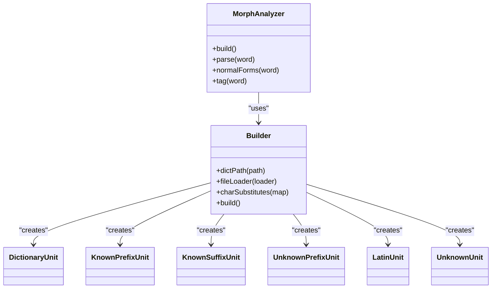
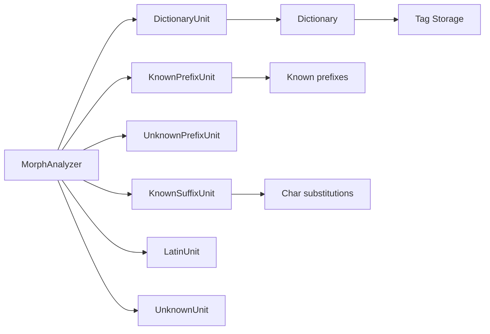

# Language Support

<cite>
**Referenced Files in This Document**
- [MorphAnalyzer.java](file://jmorphy2-core/src/main/java/company/evo/jmorphy2/MorphAnalyzer.java)
- [Dictionary.java](file://jmorphy2-core/src/main/java/company/evo/jmorphy2/Dictionary.java)
- [Resources.java](file://jmorphy2-core/src/main/java/company/evo/jmorphy2/Resources.java)
- [DictionaryUnit.java](file://jmorphy2-core/src/main/java/company/evo/jmorphy2/units/DictionaryUnit.java)
- [KnownPrefixUnit.java](file://jmorphy2-core/src/main/java/company/evo/jmorphy2/units/KnownPrefixUnit.java)
- [KnownSuffixUnit.java](file://jmorphy2-core/src/main/java/company/evo/jmorphy2/units/KnownSuffixUnit.java)
- [PrefixedUnit.java](file://jmorphy2-core/src/main/java/company/evo/jmorphy2/units/PrefixedUnit.java)
- [UnknownPrefixUnit.java](file://jmorphy2-core/src/main/java/company/evo/jmorphy2/units/UnknownPrefixUnit.java)
- [UnknownUnit.java](file://jmorphy2-core/src/main/java/company/evo/jmorphy2/units/UnknownUnit.java)
- [LatinUnit.java](file://jmorphy2-core/src/main/java/company/evo/jmorphy2/units/LatinUnit.java)
- [known_prefixes.txt (Russian)](file://jmorphy2-core/src/main/resources/lang/ru/known_prefixes.txt)
- [known_prefixes.txt (Ukrainian)](file://jmorphy2-core/src/main/resources/lang/uk/known_prefixes.txt)
- [char_substitutes.txt (Ukrainian)](file://jmorphy2-core/src/main/resources/lang/uk/char_substitutes.txt)
- [MorphAnalyzerRUTest.java](file://jmorphy2-core/src/test/java/company/evo/jmorphy2/MorphAnalyzerRUTest.java)
- [MorphAnalyzerUkTest.java](file://jmorphy2-core/src/test/java/company/evo/jmorphy2/MorphAnalyzerUkTest.java)
</cite>

## Table of Contents
1. [Introduction](#introduction)
2. [Project Structure](#project-structure)
3. [Core Components](#core-components)
4. [Architecture Overview](#architecture-overview)
5. [Detailed Component Analysis](#detailed-component-analysis)
6. [Dependency Analysis](#dependency-analysis)
7. [Performance Considerations](#performance-considerations)
8. [Troubleshooting Guide](#troubleshooting-guide)
9. [Conclusion](#conclusion)
10. [Appendices](#appendices)

## Introduction
This document explains jmorphy2’s multi-language support with a focus on Russian and Ukrainian morphological processing. It covers language-specific handling of character substitutions, known prefix/suffix recognition, Slavic inflection patterns (nouns, verbs, adjectives), dictionary loading, and practical examples of morphological analysis. It also provides guidance for configuring language-specific analyzers and handling multilingual text workflows.

## Project Structure
The multi-language support is implemented through:
- A language-agnostic analyzer pipeline that composes modular processing units.
- Language-specific resources loaded at runtime via a resource loader.
- Dictionary builders that parse language-specific compiled dictionaries and grammatical tables.
- Test suites validating language-specific behavior.

**Diagram sources**
- [MorphAnalyzer.java:52-99](file://jmorphy2-core/src/main/java/company/evo/jmorphy2/MorphAnalyzer.java#L52-L99)
- [Resources.java:17-40](file://jmorphy2-core/src/main/java/company/evo/jmorphy2/Resources.java#L17-L40)
- [Dictionary.java:109-138](file://jmorphy2-core/src/main/java/company/evo/jmorphy2/Dictionary.java#L109-L138)
- [DictionaryUnit.java:56-65](file://jmorphy2-core/src/main/java/company/evo/jmorphy2/units/DictionaryUnit.java#L56-L65)
- [KnownPrefixUnit.java:62-73](file://jmorphy2-core/src/main/java/company/evo/jmorphy2/units/KnownPrefixUnit.java#L62-L73)
- [KnownSuffixUnit.java:83-126](file://jmorphy2-core/src/main/java/company/evo/jmorphy2/units/KnownSuffixUnit.java#L83-L126)
- [UnknownPrefixUnit.java:64-73](file://jmorphy2-core/src/main/java/company/evo/jmorphy2/units/UnknownPrefixUnit.java#L64-L73)
- [LatinUnit.java:8-27](file://jmorphy2-core/src/main/java/company/evo/jmorphy2/units/LatinUnit.java#L8-L27)
- [UnknownUnit.java:27-32](file://jmorphy2-core/src/main/java/company/evo/jmorphy2/units/UnknownUnit.java#L27-L32)
- [known_prefixes.txt (Russian)](file://jmorphy2-core/src/main/resources/lang/ru/known_prefixes.txt)
- [known_prefixes.txt (Ukrainian)](file://jmorphy2-core/src/main/resources/lang/uk/known_prefixes.txt)
- [char_substitutes.txt (Ukrainian)](file://jmorphy2-core/src/main/resources/lang/uk/char_substitutes.txt)

**Section sources**
- [MorphAnalyzer.java:52-99](file://jmorphy2-core/src/main/java/company/evo/jmorphy2/MorphAnalyzer.java#L52-L99)
- [Resources.java:17-40](file://jmorphy2-core/src/main/java/company/evo/jmorphy2/Resources.java#L17-L40)
- [Dictionary.java:109-138](file://jmorphy2-core/src/main/java/company/evo/jmorphy2/Dictionary.java#L109-L138)

## Core Components
- MorphAnalyzer orchestrates a pipeline of AnalyzerUnit instances. It builds units based on the detected language dictionary metadata, loads language-specific character substitutions and known prefixes, and applies scoring and deduplication.
- Dictionary encapsulates compiled dictionaries and grammatical tables, exposing paradigms, normal forms, and tag mappings per language.
- Resources provides language-specific configuration such as character substitutions and known prefixes.

Key responsibilities:
- Language detection: The dictionary builder reads language metadata, ensuring the analyzer configures units appropriate for the target language.
- Character normalization: Character substitutions are applied during dictionary lookup and suffix prediction.
- Prefix/suffix recognition: Known and unknown prefix/suffix units integrate with the dictionary to disambiguate and inflect words.

**Section sources**
- [MorphAnalyzer.java:15-125](file://jmorphy2-core/src/main/java/company/evo/jmorphy2/MorphAnalyzer.java#L15-L125)
- [Dictionary.java:190-260](file://jmorphy2-core/src/main/java/company/evo/jmorphy2/Dictionary.java#L190-L260)
- [Resources.java:17-40](file://jmorphy2-core/src/main/java/company/evo/jmorphy2/Resources.java#L17-L40)

## Architecture Overview
The analyzer composes units in a fixed order, enabling deterministic fallback and termination behavior. The pipeline emphasizes:
- Dictionary lookup for known words.
- Known prefix recognition for productive affixes.
- Unknown prefix exploration within bounds.
- Known suffix prediction leveraging language-specific paradigms.
- Final scoring, deduplication, and sorting.

**Diagram sources**
- [MorphAnalyzer.java:178-200](file://jmorphy2-core/src/main/java/company/evo/jmorphy2/MorphAnalyzer.java#L178-L200)
- [DictionaryUnit.java:56-65](file://jmorphy2-core/src/main/java/company/evo/jmorphy2/units/DictionaryUnit.java#L56-L65)
- [KnownPrefixUnit.java:62-73](file://jmorphy2-core/src/main/java/company/evo/jmorphy2/units/KnownPrefixUnit.java#L62-L73)
- [UnknownPrefixUnit.java:64-73](file://jmorphy2-core/src/main/java/company/evo/jmorphy2/units/UnknownPrefixUnit.java#L64-L73)
- [KnownSuffixUnit.java:83-126](file://jmorphy2-core/src/main/java/company/evo/jmorphy2/units/KnownSuffixUnit.java#L83-L126)
- [UnknownUnit.java:27-32](file://jmorphy2-core/src/main/java/company/evo/jmorphy2/units/UnknownUnit.java#L27-L32)

## Detailed Component Analysis

### Language Detection and Dictionary Loading
- The analyzer builder constructs a Dictionary.Builder and loads language metadata. The language code determines which resources are applied (character substitutions, known prefixes).
- If the dictionary supports probabilistic tag-word estimation, a probability estimator is attached to refine scores.

**Diagram sources**
- [MorphAnalyzer.java:60-99](file://jmorphy2-core/src/main/java/company/evo/jmorphy2/MorphAnalyzer.java#L60-L99)
- [Dictionary.java:109-138](file://jmorphy2-core/src/main/java/company/evo/jmorphy2/Dictionary.java#L109-L138)
- [Resources.java:17-40](file://jmorphy2-core/src/main/java/company/evo/jmorphy2/Resources.java#L17-L40)

**Section sources**
- [MorphAnalyzer.java:60-99](file://jmorphy2-core/src/main/java/company/evo/jmorphy2/MorphAnalyzer.java#L60-L99)
- [Dictionary.java:109-138](file://jmorphy2-core/src/main/java/company/evo/jmorphy2/Dictionary.java#L109-L138)

### Character Substitution Handling (Ukrainian Orthographic Variations)
- Ukrainian resources define character substitutions to normalize variants such as apostrophe-like characters to the standard single quote. This ensures consistent matching against dictionary entries and suffix predictors.
- Substitutions are applied during dictionary lookups and known suffix predictions.

**Diagram sources**
- [Resources.java:17-32](file://jmorphy2-core/src/main/java/company/evo/jmorphy2/Resources.java#L17-L32)
- [DictionaryUnit.java:56-65](file://jmorphy2-core/src/main/java/company/evo/jmorphy2/units/DictionaryUnit.java#L56-L65)
- [KnownSuffixUnit.java:83-126](file://jmorphy2-core/src/main/java/company/evo/jmorphy2/units/KnownSuffixUnit.java#L83-L126)
- [char_substitutes.txt (Ukrainian)](file://jmorphy2-core/src/main/resources/lang/uk/char_substitutes.txt)

**Section sources**
- [Resources.java:17-32](file://jmorphy2-core/src/main/java/company/evo/jmorphy2/Resources.java#L17-L32)
- [DictionaryUnit.java:56-65](file://jmorphy2-core/src/main/java/company/evo/jmorphy2/units/DictionaryUnit.java#L56-L65)
- [KnownSuffixUnit.java:83-126](file://jmorphy2-core/src/main/java/company/evo/jmorphy2/units/KnownSuffixUnit.java#L83-L126)
- [char_substitutes.txt (Ukrainian)](file://jmorphy2-core/src/main/resources/lang/uk/char_substitutes.txt)

### Known Prefix Recognition
- Known prefixes are loaded from language-specific lists and matched against word beginnings. Successful matches delegate to the downstream unit (typically dictionary) to produce analyses.
- Russian and Ukrainian share many prefixes, but Ukrainian includes additional modern and technical prefixes, plus adapted Russian ones.

**Diagram sources**
- [KnownPrefixUnit.java:62-73](file://jmorphy2-core/src/main/java/company/evo/jmorphy2/units/KnownPrefixUnit.java#L62-L73)
- [PrefixedUnit.java:18-28](file://jmorphy2-core/src/main/java/company/evo/jmorphy2/units/PrefixedUnit.java#L18-L28)
- [known_prefixes.txt (Russian)](file://jmorphy2-core/src/main/resources/lang/ru/known_prefixes.txt)
- [known_prefixes.txt (Ukrainian)](file://jmorphy2-core/src/main/resources/lang/uk/known_prefixes.txt)

**Section sources**
- [KnownPrefixUnit.java:62-73](file://jmorphy2-core/src/main/java/company/evo/jmorphy2/units/KnownPrefixUnit.java#L62-L73)
- [PrefixedUnit.java:18-28](file://jmorphy2-core/src/main/java/company/evo/jmorphy2/units/PrefixedUnit.java#L18-L28)
- [known_prefixes.txt (Russian)](file://jmorphy2-core/src/main/resources/lang/ru/known_prefixes.txt)
- [known_prefixes.txt (Ukrainian)](file://jmorphy2-core/src/main/resources/lang/uk/known_prefixes.txt)

### Unknown Prefix Recognition
- Unknown prefixes explore candidate lengths up to a maximum, delegating to the downstream unit and filtering only productive analyses. This enables parsing of non-dictionary or compound-like forms.

**Diagram sources**
- [UnknownPrefixUnit.java:64-73](file://jmorphy2-core/src/main/java/company/evo/jmorphy2/units/UnknownPrefixUnit.java#L64-L73)
- [PrefixedUnit.java:18-28](file://jmorphy2-core/src/main/java/company/evo/jmorphy2/units/PrefixedUnit.java#L18-L28)

**Section sources**
- [UnknownPrefixUnit.java:64-73](file://jmorphy2-core/src/main/java/company/evo/jmorphy2/units/UnknownPrefixUnit.java#L64-L73)
- [PrefixedUnit.java:18-28](file://jmorphy2-core/src/main/java/company/evo/jmorphy2/units/PrefixedUnit.java#L18-L28)

### Known Suffix Prediction
- Known suffix unit leverages language-specific paradigm prefixes and prediction suffixes DAWGs. It attempts suffix matching with configurable maximum length and minimum word length, normalizing scores by total counts per paradigm prefix.

**Diagram sources**
- [KnownSuffixUnit.java:83-126](file://jmorphy2-core/src/main/java/company/evo/jmorphy2/units/KnownSuffixUnit.java#L83-L126)
- [Dictionary.java:149-177](file://jmorphy2-core/src/main/java/company/evo/jmorphy2/Dictionary.java#L149-L177)

**Section sources**
- [KnownSuffixUnit.java:83-126](file://jmorphy2-core/src/main/java/company/evo/jmorphy2/units/KnownSuffixUnit.java#L83-L126)
- [Dictionary.java:149-177](file://jmorphy2-core/src/main/java/company/evo/jmorphy2/Dictionary.java#L149-L177)

### Slavic Inflection Patterns and Grammatical Features
- Nouns: Both languages exhibit rich case and number inflection. Tests demonstrate genitive, locative, and other cases for nouns.
- Adjectives: Comparative and superlative degrees are supported, with gender/number/case agreement.
- Verbs: Verb conjugation is handled implicitly through dictionary paradigms and tag tables; tests show numeral and punctuation handling, indicating robust coverage of non-verb tokens.

Practical examples (see tests):
- Russian: Adjective “beautiful” with multiple tagged analyses and normal forms; noun “snow” with multiple case forms.
- Ukrainian: Adjective “magical” in comparative degree; noun “computer” with dual case forms; normalization of various apostrophe variants.

**Section sources**
- [MorphAnalyzerRUTest.java:30-142](file://jmorphy2-core/src/test/java/company/evo/jmorphy2/MorphAnalyzerRUTest.java#L30-L142)
- [MorphAnalyzerUkTest.java:30-67](file://jmorphy2-core/src/test/java/company/evo/jmorphy2/MorphAnalyzerUkTest.java#L30-L67)

### Language-Specific Challenges and Handling
- Soft consonants and palatalization: The system relies on dictionary paradigms and normalization rules. Ukrainian character substitutions help align orthographic variants to canonical forms for matching.
- Historical spelling variations: Known prefixes and suffix units enable recognition of archaic or variant forms. The probability estimator (when available) can further refine choices.

**Section sources**
- [char_substitutes.txt (Ukrainian)](file://jmorphy2-core/src/main/resources/lang/uk/char_substitutes.txt)
- [MorphAnalyzer.java:202-232](file://jmorphy2-core/src/main/java/company/evo/jmorphy2/MorphAnalyzer.java#L202-L232)

### Practical Examples: Morphological Analysis Results
Below are representative outcomes derived from tests, illustrating normalization, POS tagging, and grammatical features.

- Russian examples:
  - Normal forms for “beautiful” reduced to lemma “beautiful.”
  - Noun “snow” with multiple case-tagged analyses.
  - Known prefix “pseudo-” and unknown prefix exploration.
  - Known suffix “-er” and “-ers” inflection.

- Ukrainian examples:
  - Comparative adjective “magical” with gender and case features.
  - Noun “computer” with multiple case forms.
  - Apostrophe normalization across variants.

These examples reflect language-specific tagsets and morphological paradigms encoded in the dictionaries.

**Section sources**
- [MorphAnalyzerRUTest.java:30-142](file://jmorphy2-core/src/test/java/company/evo/jmorphy2/MorphAnalyzerRUTest.java#L30-L142)
- [MorphAnalyzerUkTest.java:30-67](file://jmorphy2-core/src/test/java/company/evo/jmorphy2/MorphAnalyzerUkTest.java#L30-L67)

### Configuration Guidance for Language-Specific Analyzers
- Choose dictionary path or rely on environment variable resolution.
- Allow the builder to auto-detect language from dictionary metadata.
- Supply language-specific character substitutions and known prefixes when needed.
- Enable/disable probability estimation depending on dictionary availability.

**Diagram sources**
- [MorphAnalyzer.java:20-104](file://jmorphy2-core/src/main/java/company/evo/jmorphy2/MorphAnalyzer.java#L20-L104)
- [DictionaryUnit.java:28-50](file://jmorphy2-core/src/main/java/company/evo/jmorphy2/units/DictionaryUnit.java#L28-L50)
- [KnownPrefixUnit.java:29-60](file://jmorphy2-core/src/main/java/company/evo/jmorphy2/units/KnownPrefixUnit.java#L29-L60)
- [KnownSuffixUnit.java:37-80](file://jmorphy2-core/src/main/java/company/evo/jmorphy2/units/KnownSuffixUnit.java#L37-L80)
- [UnknownPrefixUnit.java:26-62](file://jmorphy2-core/src/main/java/company/evo/jmorphy2/units/UnknownPrefixUnit.java#L26-L62)
- [LatinUnit.java:15-26](file://jmorphy2-core/src/main/java/company/evo/jmorphy2/units/LatinUnit.java#L15-L26)
- [UnknownUnit.java:14-25](file://jmorphy2-core/src/main/java/company/evo/jmorphy2/units/UnknownUnit.java#L14-L25)

**Section sources**
- [MorphAnalyzer.java:20-104](file://jmorphy2-core/src/main/java/company/evo/jmorphy2/MorphAnalyzer.java#L20-L104)

### Multilingual Text Processing Workflows
- Single analyzer per language: Use separate analyzers for Russian and Ukrainian to avoid cross-contamination of character substitutions and prefixes.
- Mixed content: Segment by language, apply language-specific analyzers, and merge results. Alternatively, preprocess with normalization aligned to the target language.
- Robustness: The UnknownUnit ensures every input yields at least a fallback tag, preventing silent failures.

**Section sources**
- [UnknownUnit.java:27-32](file://jmorphy2-core/src/main/java/company/evo/jmorphy2/units/UnknownUnit.java#L27-L32)

## Dependency Analysis
- Coupling: MorphAnalyzer depends on Dictionary and Resources; units depend on Dictionary and Tag storage.
- Cohesion: Units encapsulate specific morphological strategies (lookup, prefix, suffix, unknown).
- External dependencies: Compiled dictionary artifacts (DAWG, arrays, JSON) and language resources.

**Diagram sources**
- [MorphAnalyzer.java:15-125](file://jmorphy2-core/src/main/java/company/evo/jmorphy2/MorphAnalyzer.java#L15-L125)
- [DictionaryUnit.java:14-26](file://jmorphy2-core/src/main/java/company/evo/jmorphy2/units/DictionaryUnit.java#L14-L26)
- [KnownPrefixUnit.java:12-27](file://jmorphy2-core/src/main/java/company/evo/jmorphy2/units/KnownPrefixUnit.java#L12-L27)
- [KnownSuffixUnit.java:17-35](file://jmorphy2-core/src/main/java/company/evo/jmorphy2/units/KnownSuffixUnit.java#L17-L35)
- [UnknownPrefixUnit.java:11-24](file://jmorphy2-core/src/main/java/company/evo/jmorphy2/units/UnknownPrefixUnit.java#L11-L24)
- [LatinUnit.java:8-13](file://jmorphy2-core/src/main/java/company/evo/jmorphy2/units/LatinUnit.java#L8-L13)
- [UnknownUnit.java:9-12](file://jmorphy2-core/src/main/java/company/evo/jmorphy2/units/UnknownUnit.java#L9-L12)
- [Dictionary.java:12-34](file://jmorphy2-core/src/main/java/company/evo/jmorphy2/Dictionary.java#L12-L34)
- [Resources.java:17-40](file://jmorphy2-core/src/main/java/company/evo/jmorphy2/Resources.java#L17-L40)

**Section sources**
- [MorphAnalyzer.java:15-125](file://jmorphy2-core/src/main/java/company/evo/jmorphy2/MorphAnalyzer.java#L15-L125)
- [Dictionary.java:12-34](file://jmorphy2-core/src/main/java/company/evo/jmorphy2/Dictionary.java#L12-L34)
- [Resources.java:17-40](file://jmorphy2-core/src/main/java/company/evo/jmorphy2/Resources.java#L17-L40)

## Performance Considerations
- DAWG-based lookups: Dictionary and suffix prediction use compressed automata for fast similarity queries.
- Scoring and estimation: Probability estimation can improve ranking but adds overhead; enable only when available.
- Unit ordering: Early termination units reduce unnecessary work; keep the dictionary unit early for known-word speedups.
- Memory: Compiled dictionaries are loaded once per analyzer instance; reuse analyzers in multi-threaded contexts.

[No sources needed since this section provides general guidance]

## Troubleshooting Guide
- Unexpected unknown tag: Verify UnknownUnit is present in the pipeline and that the analyzer did not terminate prematurely.
- Missing Ukrainian forms: Ensure Ukrainian char substitutions and known prefixes are loaded; confirm language metadata indicates Ukrainian.
- Poor comparative/superlative tagging: Confirm dictionary supports comparative degree tags and that paradigms include productive forms.
- Mixed-script tokens: Use LatinUnit to tag non-Cyrillic sequences distinctly.

**Section sources**
- [UnknownUnit.java:27-32](file://jmorphy2-core/src/main/java/company/evo/jmorphy2/units/UnknownUnit.java#L27-L32)
- [LatinUnit.java:8-27](file://jmorphy2-core/src/main/java/company/evo/jmorphy2/units/LatinUnit.java#L8-L27)
- [MorphAnalyzer.java:178-200](file://jmorphy2-core/src/main/java/company/evo/jmorphy2/MorphAnalyzer.java#L178-L200)

## Conclusion
jmorphy2’s modular pipeline delivers robust Russian and Ukrainian morphological analysis by combining dictionary lookup, known prefix/suffix recognition, and unknown prefix exploration. Language-specific resources—particularly Ukrainian character substitutions and extensive prefix lists—enable accurate handling of orthographic and morphological variation. Tests validate noun, adjective, and numeral behavior, while the analyzer’s design supports scalable multilingual workflows.

[No sources needed since this section summarizes without analyzing specific files]

## Appendices

### Appendix A: Language-Specific Resource Files
- Russian known prefixes: [known_prefixes.txt (Russian)](file://jmorphy2-core/src/main/resources/lang/ru/known_prefixes.txt)
- Ukrainian known prefixes: [known_prefixes.txt (Ukrainian)](file://jmorphy2-core/src/main/resources/lang/uk/known_prefixes.txt)
- Ukrainian character substitutions: [char_substitutes.txt (Ukrainian)](file://jmorphy2-core/src/main/resources/lang/uk/char_substitutes.txt)

**Section sources**
- [known_prefixes.txt (Russian)](file://jmorphy2-core/src/main/resources/lang/ru/known_prefixes.txt)
- [known_prefixes.txt (Ukrainian)](file://jmorphy2-core/src/main/resources/lang/uk/known_prefixes.txt)
- [char_substitutes.txt (Ukrainian)](file://jmorphy2-core/src/main/resources/lang/uk/char_substitutes.txt)