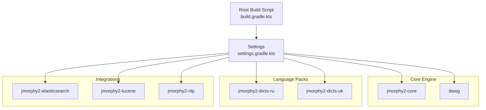
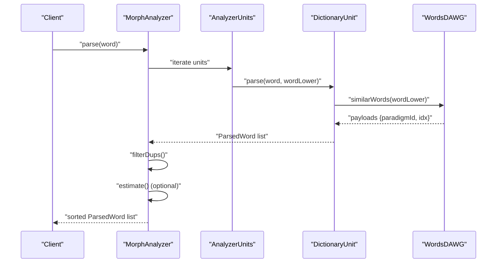
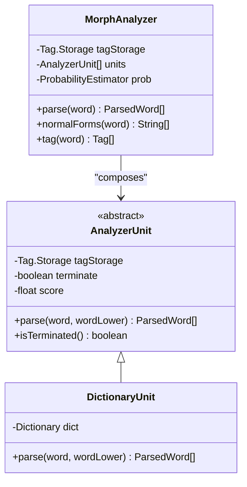
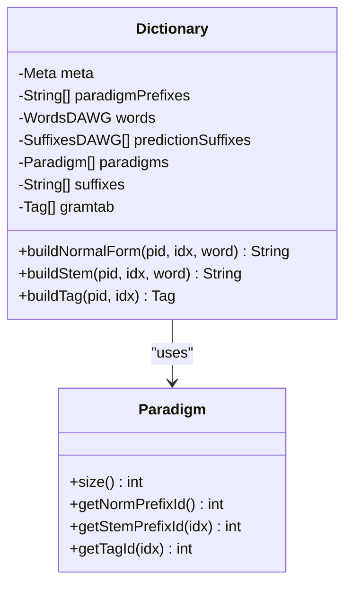
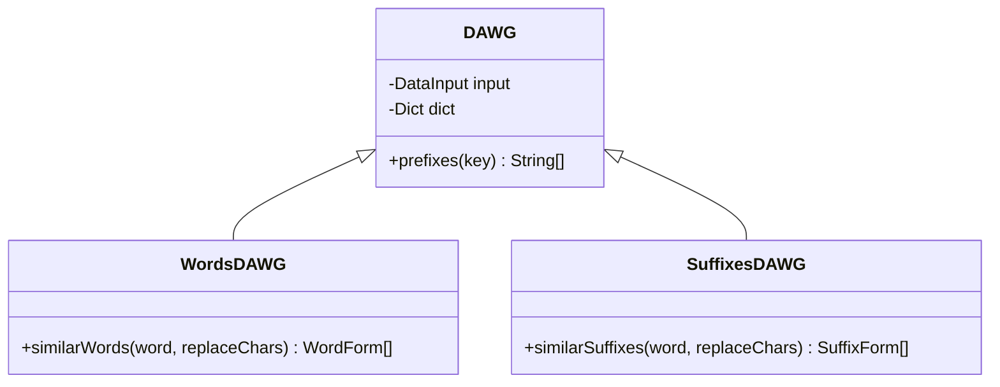
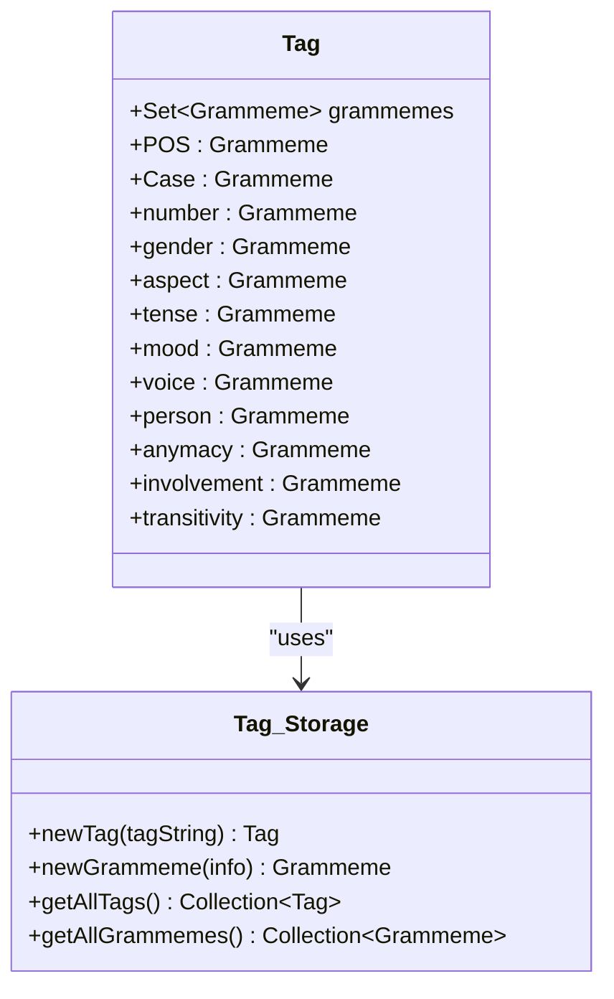
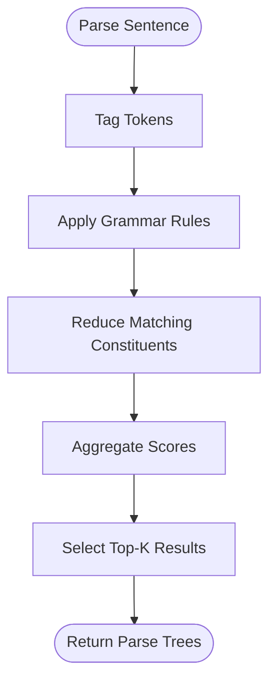
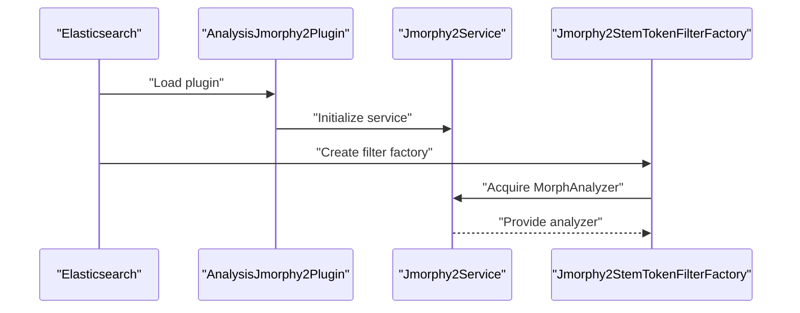
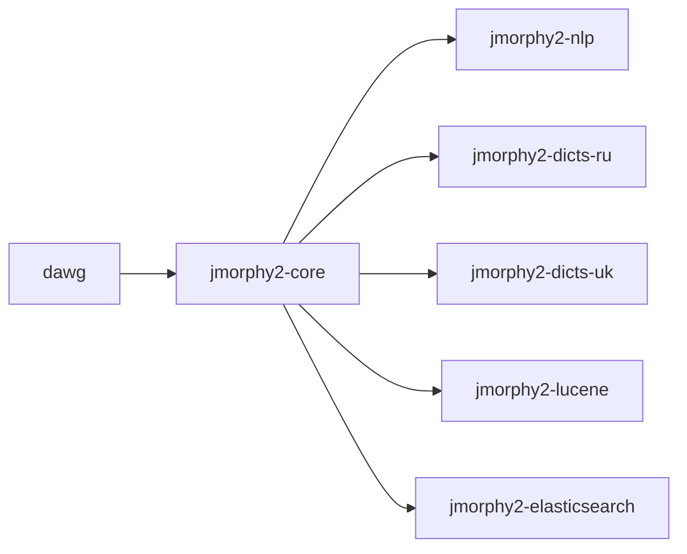

# Project Overview

<cite>
**Referenced Files in This Document**
- [README.md](file://README.md)
- [build.gradle.kts](file://build.gradle.kts)
- [settings.gradle.kts](file://settings.gradle.kts)
- [MorphAnalyzer.java](file://jmorphy2-core/src/main/java/company/evo/jmorphy2/MorphAnalyzer.java)
- [Dictionary.java](file://jmorphy2-core/src/main/java/company/evo/jmorphy2/Dictionary.java)
- [WordsDAWG.java](file://jmorphy2-core/src/main/java/company/evo/jmorphy2/WordsDAWG.java)
- [SuffixesDAWG.java](file://jmorphy2-core/src/main/java/company/evo/jmorphy2/SuffixesDAWG.java)
- [DAWG.java](file://dawg/src/main/java/company/evo/dawg/DAWG.java)
- [AnalyzerUnit.java](file://jmorphy2-core/src/main/java/company/evo/jmorphy2/units/AnalyzerUnit.java)
- [DictionaryUnit.java](file://jmorphy2-core/src/main/java/company/evo/jmorphy2/units/DictionaryUnit.java)
- [ParsedWord.java](file://jmorphy2-core/src/main/java/company/evo/jmorphy2/ParsedWord.java)
- [Tag.java](file://jmorphy2-core/src/main/java/company/evo/jmorphy2/Tag.java)
- [AnalysisJmorphy2Plugin.java](file://jmorphy2-elasticsearch/src/main/java/company/evo/jmorphy2/elasticsearch/plugin/AnalysisJmorphy2Plugin.java)
- [Jmorphy2Analyzer.java](file://jmorphy2-lucene/src/main/java/company/evo/jmorphy2/lucene/Jmorphy2Analyzer.java)
- [SimpleParser.java](file://jmorphy2-nlp/src/main/java/company/evo/jmorphy2/nlp/SimpleParser.java)
</cite>

## Table of Contents
1. [Introduction](#introduction)
2. [Project Structure](#project-structure)
3. [Core Components](#core-components)
4. [Architecture Overview](#architecture-overview)
5. [Detailed Component Analysis](#detailed-component-analysis)
6. [Dependency Analysis](#dependency-analysis)
7. [Performance Considerations](#performance-considerations)
8. [Troubleshooting Guide](#troubleshooting-guide)
9. [Conclusion](#conclusion)

## Introduction
Jmorphy2 is a Java port of the popular Python library pymorphy2, designed as a morphological analyzer for Russian and Ukrainian languages. It performs morphological analysis, part-of-speech tagging, and normalization to base forms (lemmatization), integrating seamlessly into the broader Java NLP ecosystem. The project emphasizes efficient dictionary-backed analysis powered by compact automata structures and modular extensions for Elasticsearch, Lucene, and custom NLP pipelines.

Key goals:
- Provide accurate morphological analysis and lemmatization for Russian and Ukrainian.
- Support part-of-speech tagging via structured grammatical tags.
- Enable scalable text processing through optimized data structures and pluggable analyzers.
- Integrate with Elasticsearch and Lucene for search applications.

## Project Structure
Jmorphy2 is organized as a multi-module Gradle project. Modules are grouped by responsibility: core morphological engine, dictionary packs, DAWG utilities, NLP pipeline helpers, and framework integrations.

**Diagram sources**
- [build.gradle.kts:1-21](file://build.gradle.kts#L1-L21)
- [settings.gradle.kts:1-12](file://settings.gradle.kts#L1-L12)

Highlights:
- Core engine and DAWG utilities form the foundation for morphological analysis.
- Language packs provide compiled dictionaries for Russian and Ukrainian.
- Integrations expose analyzers and filters for Elasticsearch and Lucene.
- NLP module adds parsing and tagging utilities.

**Section sources**
- [build.gradle.kts:1-21](file://build.gradle.kts#L1-L21)
- [settings.gradle.kts:1-12](file://settings.gradle.kts#L1-L12)

## Core Components
Jmorphy2’s core engine centers around morphological analysis, grammatical tagging, and dictionary-backed paradigm tables encoded in compact DAWG structures.

- MorphAnalyzer orchestrates analysis by composing multiple AnalyzerUnit instances, each responsible for a specific token type (dictionary lookup, numbers, punctuation, unknowns, etc.). It applies scoring, deduplication, optional probabilistic estimation, and sorting to produce ranked parses.
- Dictionary encapsulates compiled morphology data: paradigm tables, grammatical tag tables, suffix sets, and DAWG indices. It exposes methods to reconstruct normal forms and stems from paradigm metadata.
- DAWG-based structures WordsDAWG and SuffixesDAWG provide fast near-neighbor and suffix matching over dictionary keys, enabling efficient lookup and prediction.
- Tag and Grammeme define the grammatical tag model and its roots/values, enabling filtering and inference of grammatical features.
- ParsedWord represents a single analysis outcome, including the surface word, tag, normal form, and score, with utilities to infer lexeme paradigms and inflection.

Practical outcomes:
- Morphological analysis: convert tokens to one or more analyses with grammatical tags and normal forms.
- Part-of-speech tagging: extract POS and other grammatical features from tags.
- Normalization: derive canonical forms suitable for indexing and retrieval.

**Section sources**
- [MorphAnalyzer.java:15-247](file://jmorphy2-core/src/main/java/company/evo/jmorphy2/MorphAnalyzer.java#L15-L247)
- [Dictionary.java:12-302](file://jmorphy2-core/src/main/java/company/evo/jmorphy2/Dictionary.java#L12-L302)
- [WordsDAWG.java:13-57](file://jmorphy2-core/src/main/java/company/evo/jmorphy2/WordsDAWG.java#L13-L57)
- [SuffixesDAWG.java:13-61](file://jmorphy2-core/src/main/java/company/evo/jmorphy2/SuffixesDAWG.java#L13-L61)
- [Tag.java:7-230](file://jmorphy2-core/src/main/java/company/evo/jmorphy2/Tag.java#L7-L230)
- [ParsedWord.java:9-89](file://jmorphy2-core/src/main/java/company/evo/jmorphy2/ParsedWord.java#L9-L89)

## Architecture Overview
The analyzer pipeline composes multiple AnalyzerUnit stages. Each unit contributes candidate parses for a given word, with early termination semantics and weighted scoring. DictionaryUnit drives paradigm-based analysis using DAWG indices, while other units handle numbers, punctuation, Latin, and unknown tokens. Optional probabilistic weighting refines scores when available.

**Diagram sources**
- [MorphAnalyzer.java:178-200](file://jmorphy2-core/src/main/java/company/evo/jmorphy2/MorphAnalyzer.java#L178-L200)
- [DictionaryUnit.java:56-65](file://jmorphy2-core/src/main/java/company/evo/jmorphy2/units/DictionaryUnit.java#L56-L65)
- [WordsDAWG.java:25-31](file://jmorphy2-core/src/main/java/company/evo/jmorphy2/WordsDAWG.java#L25-L31)

## Detailed Component Analysis

### MorphAnalyzer and AnalyzerUnit Composition
MorphAnalyzer builds a chain of AnalyzerUnit instances. Each unit can mark itself as “terminated,” halting further analysis once candidates are produced. Scores are combined per unit, then normalized and optionally adjusted by probabilistic estimates.

**Diagram sources**
- [MorphAnalyzer.java:15-125](file://jmorphy2-core/src/main/java/company/evo/jmorphy2/MorphAnalyzer.java#L15-L125)
- [AnalyzerUnit.java:11-72](file://jmorphy2-core/src/main/java/company/evo/jmorphy2/units/AnalyzerUnit.java#L11-L72)
- [DictionaryUnit.java:14-54](file://jmorphy2-core/src/main/java/company/evo/jmorphy2/units/DictionaryUnit.java#L14-L54)

**Section sources**
- [MorphAnalyzer.java:101-104](file://jmorphy2-core/src/main/java/company/evo/jmorphy2/MorphAnalyzer.java#L101-L104)
- [AnalyzerUnit.java:26-34](file://jmorphy2-core/src/main/java/company/evo/jmorphy2/units/AnalyzerUnit.java#L26-L34)

### Dictionary and Paradigm Tables
Dictionary loads compiled morphology data and exposes:
- Paradigm tables for normal/stem forms and tag indices.
- Grammatical tag table and grammeme definitions.
- DAWG indices for words and prediction suffixes.

**Diagram sources**
- [Dictionary.java:12-139](file://jmorphy2-core/src/main/java/company/evo/jmorphy2/Dictionary.java#L12-L139)
- [Dictionary.java:262-300](file://jmorphy2-core/src/main/java/company/evo/jmorphy2/Dictionary.java#L262-L300)

**Section sources**
- [Dictionary.java:109-138](file://jmorphy2-core/src/main/java/company/evo/jmorphy2/Dictionary.java#L109-L138)
- [Dictionary.java:170-188](file://jmorphy2-core/src/main/java/company/evo/jmorphy2/Dictionary.java#L170-L188)

### DAWG Structures for Efficient Lookup
DAWG-based structures enable compact and fast dictionary traversal:
- DAWG provides prefix enumeration over byte-encoded keys.
- WordsDAWG decodes payloads to paradigm identifiers and indices for matched words.
- SuffixesDAWG decodes payloads for predicted suffix sequences.

**Diagram sources**
- [DAWG.java:13-40](file://dawg/src/main/java/company/evo/dawg/DAWG.java#L13-L40)
- [WordsDAWG.java:13-57](file://jmorphy2-core/src/main/java/company/evo/jmorphy2/WordsDAWG.java#L13-L57)
- [SuffixesDAWG.java:13-61](file://jmorphy2-core/src/main/java/company/evo/jmorphy2/SuffixesDAWG.java#L13-L61)

**Section sources**
- [WordsDAWG.java:18-31](file://jmorphy2-core/src/main/java/company/evo/jmorphy2/WordsDAWG.java#L18-L31)
- [SuffixesDAWG.java:18-32](file://jmorphy2-core/src/main/java/company/evo/jmorphy2/SuffixesDAWG.java#L18-L32)

### Tag Model and Grammemes
Tag represents a normalized set of grammatical features keyed by roots (e.g., POS, case, number). Grammemes are stored centrally and resolved by Tag.Storage. This enables consistent filtering and inference across analysis results.

**Diagram sources**
- [Tag.java:7-230](file://jmorphy2-core/src/main/java/company/evo/jmorphy2/Tag.java#L7-L230)

**Section sources**
- [Tag.java:41-86](file://jmorphy2-core/src/main/java/company/evo/jmorphy2/Tag.java#L41-L86)
- [Tag.java:162-228](file://jmorphy2-core/src/main/java/company/evo/jmorphy2/Tag.java#L162-L228)

### NLP Pipeline Utilities
SimpleParser demonstrates higher-level usage by applying grammar-aware rules to tagged tokens, building a parse forest and selecting top candidates. It leverages Tag and Grammeme to match and reduce constituents.

**Diagram sources**
- [SimpleParser.java:67-114](file://jmorphy2-nlp/src/main/java/company/evo/jmorphy2/nlp/SimpleParser.java#L67-L114)

**Section sources**
- [SimpleParser.java:15-43](file://jmorphy2-nlp/src/main/java/company/evo/jmorphy2/nlp/SimpleParser.java#L15-L43)

### Integration with Elasticsearch and Lucene
- Elasticsearch: AnalysisJmorphy2Plugin registers token filters for stemming and subject extraction, delegating to a shared service that manages MorphAnalyzer instances per index.
- Lucene: Jmorphy2Analyzer composes a standard tokenizer with lowercasing and a stemming filter backed by MorphAnalyzer, with configurable exclusion lists for parts of speech.

**Diagram sources**
- [AnalysisJmorphy2Plugin.java:34-68](file://jmorphy2-elasticsearch/src/main/java/company/evo/jmorphy2/elasticsearch/plugin/AnalysisJmorphy2Plugin.java#L34-L68)

**Section sources**
- [AnalysisJmorphy2Plugin.java:43-56](file://jmorphy2-elasticsearch/src/main/java/company/evo/jmorphy2/elasticsearch/plugin/AnalysisJmorphy2Plugin.java#L43-L56)
- [Jmorphy2Analyzer.java:17-41](file://jmorphy2-lucene/src/main/java/company/evo/jmorphy2/lucene/Jmorphy2Analyzer.java#L17-L41)

## Dependency Analysis
The multi-module structure cleanly separates concerns:
- dawg provides low-level DAWG utilities used by jmorphy2-core.
- jmorphy2-core depends on dawg and supplies the morphological engine and dictionary abstractions.
- jmorphy2-dicts-ru and jmorphy2-dicts-uk supply language-specific compiled dictionaries.
- jmorphy2-nlp adds parsing/tagging utilities.
- jmorphy2-lucene and jmorphy2-elasticsearch integrate with Lucene and Elasticsearch respectively.

**Diagram sources**
- [settings.gradle.kts:3-11](file://settings.gradle.kts#L3-L11)

**Section sources**
- [settings.gradle.kts:1-12](file://settings.gradle.kts#L1-L12)

## Performance Considerations
- DAWG-based lookups minimize memory footprint and accelerate near-neighbor queries for words and suffixes.
- AnalyzerUnit composition allows early termination and staged scoring, reducing unnecessary work.
- Probabilistic weighting is applied only when dictionary metadata indicates availability, avoiding overhead otherwise.
- Normal form and stem reconstruction leverage paradigm tables to avoid expensive string manipulations.

[No sources needed since this section provides general guidance]

## Troubleshooting Guide
Common issues and remedies:
- Dictionary path resolution: Ensure the dictionary path variable or loader is configured so that DictionaryUnit can locate compiled resources.
- Character substitutions: Configure character substitutes for the target language to improve matching for homoglyphs or alternate scripts.
- Probabilistic estimation: If P(t|w) metadata is missing, probabilistic re-ranking is disabled; expect deterministic scoring.
- Elasticsearch/Lucene filters: Verify filter registration and analyzer settings; confirm that the plugin or analyzer is loaded with correct language names.

**Section sources**
- [MorphAnalyzer.java:52-98](file://jmorphy2-core/src/main/java/company/evo/jmorphy2/MorphAnalyzer.java#L52-L98)
- [Dictionary.java:109-138](file://jmorphy2-core/src/main/java/company/evo/jmorphy2/Dictionary.java#L109-L138)
- [README.md:21-78](file://README.md#L21-L78)

## Conclusion
Jmorphy2 brings robust morphological analysis to Java with a modular architecture centered on dictionary-backed paradigm tables and DAWG structures. It supports Russian and Ukrainian, offers part-of-speech tagging and normalization, and integrates smoothly with Elasticsearch and Lucene. Beginners can leverage ready-to-use analyzers and filters, while advanced users benefit from fine-grained control over analysis units, scoring, and probabilistic estimation.

[No sources needed since this section summarizes without analyzing specific files]